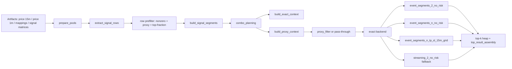
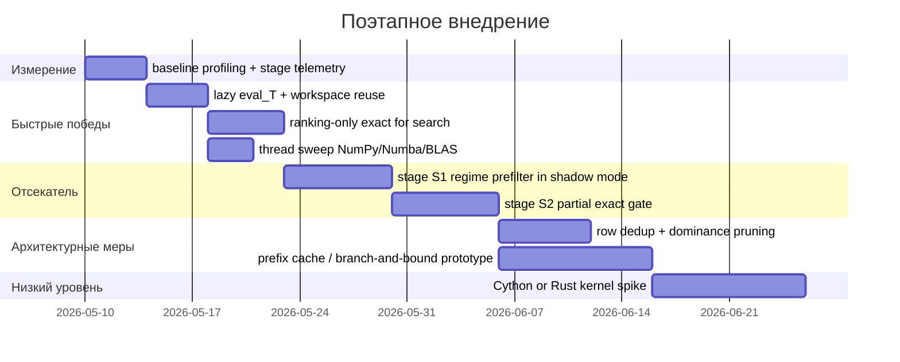

# Аналитический отчёт по ускорению движка бэктеста индикаторов при взрывном росте комбинаций

**Executive summary.**  
Исследование я начал с GitHub-коннектора и разобрал кодовую базу urlDejetins/roehub.comhttps://github.com/Dejetins/roehub.com, включая notebook `tests/notebook_tests/engine_test/btcusdt_15m_research_engine.ipynb`, а затем сопоставил её с текущими сервисными модулями `v2`, benchmark-evidence из репозитория и официальной документацией по `NumPy`/`Numba`/Python-профилированию и стеку urlAccelerateturn3search4 / urlMetal Performance Shadersturn4search1. Главный вывод: **в актуальном состоянии репозитория основная проблема для 4+ индикаторов — уже не генерация комбинаций как таковая, а exact-scoring при полном переборе выживших кандидатов**. Это хорошо видно по accepted benchmark: на 5 индикаторах `exact_scoring` уже около `2.09s`, на 6 — около `15.74s`, на 7 — около `139.59s`, тогда как `combo_iteration` на тех же объёмах остаётся на порядки дешевле. Иными словами, если ваша реальная боевая конфигурация даёт миллионы комбинаций, нужно атаковать не только orchestration, а прежде всего **количество кандидатов, доходящих до exact**, и **стоимость exact на одного кандидата**. fileciteturn21file0L1-L1

Ваша гипотеза про быстрый «отсекатель» **не просто жизнеспособна — она очень хорошо ложится в уже существующую архитектуру**. В коде уже есть идеи `proxy_filter`, `build_proxy_context`, дешёвого row-prefilter и разделения на подготовку / планирование / exact-backend. Самый прагматичный следующий шаг — не один «магический фильтр», а **трёхступенчатый rejector**:  
`row-level prefilter` → `cheap combo prefilter on regime slices` → `partial exact / early-stop exact`.  
Чтобы не потерять сильные стратегии, отсечение должно быть **динамическим**, привязанным к текущему `k-th` порогу в heap/top-k, а не к статическому абсолютному порогу. Я бы запускал это сначала в `shadow mode`: отсекаем, но случайно 1–5% rejected-кандидатов всё равно считаем полностью и измеряем false-reject-rate относительно top-k. Это позволит сделать фильтр агрессивным без слепого риска. Концептуально это очень близко к идеям pruner-ов и successive halving / Hyperband в задачах дорогого поиска по конфигурациям. fileciteturn19file0L1-L1 fileciteturn20file0L1-L1 citeturn10search0turn9search3

Мой приоритетный набор доработок для вашего железа — **entity["product","Mac Studio","desktop workstation with M2 Max and 64 GB unified memory"] 64 GB** — такой:  
**сразу**: `ranking-only exact`, lazy `eval_T`, re-use рабочих буферов, thread-sweep для `Numba`/BLAS, многослойный отсекатель в shadow mode;  
**следом**: prefix-caching / branch-and-bound по префиксам комбинаций, dedup одинаковых/почти одинаковых сигнал-строк, процессное распараллеливание с shared-memory/memmap без сериализации массивов;  
**после валидации**: перенос 1–2 наиболее дорогих exact kernels в urlCython docsturn11search4 или urlPyO3 guideturn11search2/Rust, если CPU-only Numba после остальных мер всё ещё не даёт целевое время. GPU/Metal я не ставлю в первый эшелон: он имеет смысл для **плотных матричных proxy-счётов**, но не как первый рычаг для stateful ветвящегося exact-backend. fileciteturn19file0L1-L1 fileciteturn20file0L1-L1 citeturn3search5turn4search0turn4search1turn11search6

## Архитектура текущего движка

Ключевая находка по коду: **репозиторий уже ушёл дальше “одного notebook-прототипа”**. В `src/trading/contexts/backtest/application/services/v2/` есть модульный пайплайн со стадиями `prepare_pools`, `combo_planning`, `no_risk_exact`, `tp_sl_hit_times`, `tp_sl_exact`, `top_result_assembly`, `job_orchestration`, `lazy_trades_detail`; в `__init__.py` экспортированы backend’ы `event_segments_2_no_risk`, `event_segments_n_no_risk`, `event_segments_n_tp_sl_15m_grid` и `streaming_2_no_risk`. Это значит, что для анализа производительности важно разделять **исторический notebook** и **актуальную сервисную реализацию**, потому что часть сильных идей уже реализована в кодовой базе. fileciteturn18file0L1-L1

По `benchmark_results.json` / `benchmark_summary.md` актуальный runtime использует backend registry, где для режима `risk.mode="none"` и arity=2 backend по умолчанию — `event_segments_2_no_risk`, для arity 1 и 3..10 — `event_segments_n_no_risk`, для `tp_sl_grid` — `event_segments_n_tp_sl_15m_grid`, а `streaming_2_no_risk` оставлен как fallback / parity-perf comparison. Это важный архитектурный факт: **основная линия развития уже сделана в сторону event-compressed exact**, а не в сторону лобового сканирования полных dense-матриц на каждой комбинации. fileciteturn15file0L1-L1 fileciteturn19file0L1-L1 fileciteturn20file0L1-L1

На уровне подготовки данных `prepare_pools.py` делает три вещи:  
`extract_signal_rows()` выбирает нужные строки сигналов по `row_ids` и временному `slice`;  
`prefilter_indicator_rows()` считает `nonzero`, `proxy`, `change_count`, отбирает top-fraction и формирует `filtered_trade_T` и `filtered_eval_T`;  
`build_signal_segments()` сжимает `trade_T` в сегменты `(starts, ends, values, counts)`.  
Это уже правильная архитектурная раскладка: дешёвое row-level pruning и compression до combo-поиска, затем отдельный combo planning и backend-specific exact. fileciteturn12file0L1-L1

Ниже — схема потока данных в текущем состоянии.



С практической точки зрения точки входа и наиболее важные места для изменения/профилирования такие:  
`tests/notebook_tests/engine_test/btcusdt_15m_research_engine.ipynb` — исследовательский baseline;  
`src/.../prepare_pools.py` — row selection / row prefilter / signal segments;  
`src/.../combo_planning.py` — chunking, proxy context/filter, cache для 2-индикаторного proxy;  
`src/.../no_risk_exact.py` — dispatch exact backend’ов, metric buffers, heap update.  
Именно тут сейчас сидит почти весь compute-core. fileciteturn18file0L1-L1 fileciteturn12file0L1-L1 fileciteturn19file0L1-L1 fileciteturn20file0L1-L1

## Узкие места и что именно доказывает репозиторий

Главное фактическое наблюдение по benchmark-evidence на `Mac Studio`: **при росте arity exact stage быстро начинает полностью доминировать**. Для no-risk benchmark accepted значения выглядят так:  
arity 4 → `exact_scoring ≈ 0.352s`, total `≈ 0.525s`;  
arity 5 → `≈ 2.091s`, total `≈ 2.288s`;  
arity 6 → `≈ 15.736s`, total `≈ 16.059s`;  
arity 7 → `≈ 139.586s`, total `≈ 140.746s`.  
При этом `prepare_pools`, `build_exact_context`, `combo_iteration`, `heap_update` растут гораздо медленнее. Это и есть основной доказательный аргумент, почему дальнейшее ускорение должно быть сосредоточено на **отсечении перед exact** и на **удешевлении самого exact backend**. fileciteturn21file0L1-L1

Отдельный benchmark по combo planning показывает, что даже на `279,936` combinations максимум `combo_iteration` находится примерно на уровне `0.157s`, а `proxy_filter` при канонической конфигурации почти бесплатен, потому что default full-matrix benchmark идёт с `combo_top_frac = 1.0` и `combo_min_confirm = 1`, то есть proxy фактически выступает как pass-through. Следовательно, в текущем accepted configuration **узкое место не в детерминированном chunking**, а в exact evaluation downstream. fileciteturn16file0L1-L1

Есть и более локальные места, важные именно для вашего кейса «много комбинаций, память нельзя раздувать».  
Во-первых, `prefilter_indicator_rows()` сейчас **всегда материализует** `filtered_eval_T = filtered_trade_T[:, :n_intervals]`, даже если proxy stage отключён и комбинации идут дальше практически без combo prefilter. Это конкретный кандидат на lazy materialization: при неактивном proxy `eval_T` не должно занимать память до тех пор, пока оно реально не понадобится. fileciteturn12file0L1-L1 fileciteturn19file0L1-L1

Во-вторых, в generic no-risk exact path (`event_segments_n_no_risk`) в `evaluate_no_risk_exact_chunk()` создаётся `segment_pos_workspace = np.empty((combo_idx_by_indicator.shape[1], combo_idx_by_indicator.shape[0]), dtype=np.int32)` на вызов. На миллионах candidate batches это означает повторяющиеся аллокации на горячем пути. Это не архитектурная катастрофа, но это **чистый технический долг**, который можно убрать почти без риска, переведя workspace на повторное использование уровня worker/thread/chunk-runner. fileciteturn20file0L1-L1

В-третьих, exact path сейчас считает **весь набор метрик**, перечисленный в `NO_RISK_METRIC_NAMES`: `total_return_pct`, `max_drawdown_pct`, `return_over_max_drawdown`, `profit_factor`, `trade_count`, `sharpe_trades`, `win_rate_pct`, `avg_trade_ret_pct`, `avg_trade_exec_bars`, `exposure_pct`. Для исследовательского режима это удобно, но если ranking metric у вас один, например `total_return_pct`, то ранжировать миллионы кандидатов по полному пакету статистики — дорогое излишество. Самая дешёвая и очень сильная идея здесь: **двухступенчатый exact** — сначала считаем минимальный ranking-profile, затем только для shortlist добиваем полный metric-profile. fileciteturn20file0L1-L1

В-четвёртых, `build_combo_proxy_cache_two()` в `combo_planning.py` уже использует матричную форму через `@` и формирует `confirm_matrix` / `proxy_matrix`. Это правильно для активного 2-индикаторного proxy, потому что `NumPy` использует optimized BLAS when possible, а в экосистеме macOS это ложится на `Accelerate`/BLAS. Но этот путь имеет смысл только когда proxy stage действительно активен; в pass-through режиме его не надо оплачивать ни временем, ни памятью. Ещё один нюанс: в benchmark runtime видно `numba_threads = 12`, а BLAS имеет собственную модель threading, поэтому при смешанном использовании `Numba parallel` и BLAS нужно отдельно контролировать oversubscription. fileciteturn19file0L1-L1 fileciteturn21file0L1-L1 citeturn3search3turn3search0turn3search4

В-пятых, важна и память доступа к массивам. В `extract_signal_rows()` код уже идёт по пути contiguous selection, а по документации `NumPy` разница между basic slicing/view и advanced indexing/copy принципиальна: basic slicing даёт view, advanced indexing всегда даёт copy. Это подтверждает, что выбор способа выборки строк и временного окна — не мелочь, а прямой фактор wall-time и RSS. То же касается `np.load(..., mmap_mode="r")`: memory mapping действительно полезен тогда, когда вы хотите трогать фрагменты больших массивов без полного чтения в память. fileciteturn12file0L1-L1 citeturn3search1turn12search4

## Ранний отсекатель

Ваша идея с быстрым «отсекателем» имеет **реальное право на существование** и, на мой взгляд, должна стать первым экспериментом уровня MVP. Но я бы развивал её не как один if/else-фильтр, а как **многоступенчатую схему с контролем ложноотсечений**.

### Почему это архитектурно правильно

Сейчас код уже разделён на `row prefilter` → `combo planning` → `proxy filter` → `exact`. Добавление **ещё одной cheap stage между proxy и full exact** почти не ломает архитектуру. Более того, это соответствует общим принципам pruner-ов: дешёвые промежуточные оценки используются для отказа от слабых конфигураций раньше, чем потрачен основной бюджет. В мире hyperparameter optimization это давно формализовано в successive halving / Hyperband и их практических реализациях. Для бэктеста логика та же: если дешёвый partial signal даёт сильную корреляцию с full exact ranking, то такой фильтр окупается очень быстро. fileciteturn19file0L1-L1 citeturn10search0turn9search3

### Рекомендуемая схема отсечения

Я предлагаю такую структуру:

1. **Stage S0 — row-level**  
   Уже есть в коде: `nonzero`, `proxy`, `change_count`, top-fraction. Здесь можно добавить ещё 1–2 дешёвые характеристики: `change_density`, `mean_hold_length`, `sign_imbalance`.

2. **Stage S1 — statistical combo prefilter на микро-периодах**  
   Для каждой candidate-combo считаем очень дешёвый proxy не на всём интервале, а на наборе коротких representative slices: high-vol, low-vol, trend-up, trend-down, chop. Если по совокупности этих slices combo не дотягивает даже до консервативного порога — не допускаем до partial exact.

3. **Stage S2 — partial exact / early-stop exact**  
   Запускаем exact backend, но только до достижения лимита по `N trades` или `M event transitions`, и считаем **optimistic upper bound**. Если даже верхняя оценка уже ниже текущего порога `k-th best`, останавливаемся.

4. **Stage S3 — full exact**  
   Только для выживших.

Это даёт намного лучший компромисс, чем один жёсткий фильтр. В S1 вы отстреливаете откровенный мусор, в S2 — кандидатов, которые сначала выглядели терпимо, но быстро провалились уже на stateful exact логике.

### Вариант statistical prefilter

**Идея.**  
Берём не весь backtest-period, а 5–8 коротких сегментов, покрывающих разные режимы рынка:  
high vol up, high vol down, low vol flat, medium vol trend, shock segment.  
На каждом сегменте считаем дешёвые proxy-метрики: `confirm_count`, `proxy_return`, `sign stability`, `trade opportunity density`.  
Если по нескольким режимам подряд конфигурация проваливается — выбрасываем.  
Это особенно полезно для вашей идеи «понимать, как стратегия чувствует себя в high-vol и во флете»: вы не просто фильтруете по усреднённому рынку, а проверяете **regime-robustness**.

**Что именно измерять.**
- `proxy_return_sum`
- `proxy_return_per_confirm`
- `confirm_count`
- `fraction_nonzero_consensus`
- `mean_segment_length`
- `proxy_worst_slice`
- `proxy_std_between_slices`

**Как не допустить ложноотсечения.**
- порог считать не абсолютный, а **относительно текущего heap-threshold**;
- добавлять `safety margin`, например не отсекать, если upper estimate ближе чем на `ε`;
- первые `N_seed` тысяч комбинаций прогонять **без отсекателя**, чтобы получить эмпирическое распределение;
- 1–5% rejected комбо пересчитывать full exact в shadow mode.

**Псевдокод.**

```python
def statistical_prefilter(combo, regime_slices, heap_threshold, margin):
    scores = []
    confirms = 0

    for sl in regime_slices:
        proxy_ret, proxy_conf = cheap_proxy(combo, sl)
        scores.append(proxy_ret)
        confirms += proxy_conf

    mean_score = mean(scores)
    worst_score = min(scores)
    dispersion = std(scores)

    optimistic = mean_score + 0.5 * max(0.0, -worst_score) - 0.25 * dispersion

    if confirms < MIN_CONFIRMS:
        return False
    if optimistic < heap_threshold - margin:
        return False
    return True
```

**Оценка стоимости.**  
Очень низкая по памяти; по CPU — низкая/средняя; интеграция — простая.  
**Ожидаемый эффект:** если выбрать хорошие regime-slices, можно отсеять десятки процентов комбо почти бесплатно.  
**Риск:** фильтр бесполезен, если cheap proxy плохо коррелирует с full exact ranking. Это нужно проверить измерением, а не предполагать. fileciteturn19file0L1-L1 citeturn10search0turn9search3

### Вариант cheap surrogate model

**Идея.**  
Сначала полностью считаем небольшой seed-набор комбинаций. По ним обучаем компактную суррогатную модель, которая предсказывает вероятность попадания в top-k или ожидаемый ranking metric.  
Фичи не должны быть “сырой `trade_T` матрицей”; нужны очень дешёвые агрегаты:
- row_score каждого индикатора;
- change_count;
- agree/disagree density;
- cheap proxy на regime slices;
- средняя длина сегмента;
- overlap признаков между индикаторами.

Практически это может быть даже не GBDT, а обычная логистическая регрессия / маленький light model. Суррогат не обязан быть точным по значению доходности; ему достаточно хорошо различать «явно мусор» и «имеет шанс попасть в верхушку».

**Псевдокод.**

```python
seed = full_exact(sample_of_combos)
X_seed = build_features(seed.combos)
y_seed = (seed.rank <= TOP_K_SURROGATE)

model.fit(X_seed, y_seed)

for combo in stream_of_combos:
    x = build_features_for_combo(combo)
    p = model.predict_proba(x)[1]
    if p < P_REJECT:
        reject(combo)
    else:
        send_to_partial_exact(combo)
```

**Оценка стоимости.**  
Память низкая, если фичи компактные. CPU низкий после обучения.  
**Плюс:** хорош для 4+ индикаторов, потому что работает поверх комбинации как объекта, а не диктует форму exact backend.  
**Минус:** требует аккуратной калибровки и периодического переобучения при смене тикера/таймфрейма/режима рынка.  
Мой совет: использовать surrogate **сначала только как ranker/prioritizer**, а не как жёсткий rejector. citeturn9search3turn10search0

### Вариант early-trade-sampling

Это наиболее близко к вашей исходной формулировке «посчитать первые 10–20 сделок и выкинуть плохое», но я бы делал это чуть умнее.

**Идея.**  
Запускаем exact backend на полном state-machine, но останавливаемся после:
- `N = 10/20/40` закрытых сделок, либо
- `M` event transitions, либо
- `T_partial` bars.

После этого считаем **не только текущее качество**, но и **upper bound**: насколько хорошо кандидат может закончить даже в оптимистическом случае.

Например:
- если после 20 сделок стратегия уже сильно в минусе, а средняя длина сделки большая, её шанс вернуться в top-k мал;
- если `confirm_count` хороший, но сделок мало, то можно не рубить, а перевести в “uncertain / continue”.

**Псевдокод.**

```python
def partial_exact_gate(combo, heap_threshold, margin):
    state = init_state()
    trades = 0

    for event in exact_event_stream(combo):
        state = apply_event(state, event)
        if state.closed_trades > 0:
            trades += 1
        if trades >= EARLY_TRADE_LIMIT:
            break

    current = state.total_return_pct
    optimistic_tail = estimate_best_possible_tail(state)
    upper_bound = current + optimistic_tail

    return upper_bound >= heap_threshold - margin
```

**Как оценивать `estimate_best_possible_tail`.**  
Не нужно делать слишком “умную” математику. Достаточно консервативного и воспроизводимого bound, например:
- `remaining_trade_opportunities * empirical_top_quantile_trade_return`;
- либо bound на базе top-5% уже посчитанных комбинаций.

**Главный плюс** этого варианта: он уже использует **exact semantics**, а значит корреляция с final ranking обычно выше, чем у голого proxy.  
**Главный минус:** дороже, чем S1, поэтому его нельзя делать первым фильтром; он должен быть вторым cheap exact gate перед full exact.

### Вариант volatility-aware sampling

Это лучший способ развить именно вашу идею про “проверять и high-vol, и flat”.

**Идея.**  
Один раз, оффлайн для данного тикера/таймфрейма, разрезать историю на режимы по realised volatility / ATR / directional efficiency ratio. Из каждого кластера режимов выбрать короткие representative windows. Дальше все cheap tests вести **не на случайном сэмпле**, а на фиксированном наборе slice-ов, где:
- 2 окна high-vol,
- 2 окна low-vol/flat,
- 1 окно тренда вверх,
- 1 окно тренда вниз,
- 1 shock window.

Такой сэмпл:
- стабилен между запусками;
- лучше покрывает режимы рынка;
- даёт более интерпретируемую причину rejection.

**Моя рекомендация:** сделать именно этот вариант базой для S1.

### Как избежать ложноотсечений

Это вопрос критичный, поэтому фиксирую явно.

| Механизм | Что делает | Почему нужен |
|---|---|---|
| `seed_full_exact` | первые N кандидатов считаются без отсечения | нужен стартовый порог и калибровка |
| `dynamic_threshold` | сравнение не с фиксированной доходностью, а с текущим `k-th` result | рынок и режимы меняются |
| `patient_margin` | сохраняет приграничные кандидаты | уменьшает false negatives |
| `shadow_audit` | 1–5% rejected идёт в full exact | прямое измерение ошибки фильтра |
| `top-k parity check` | сравнение top-k до/после введения фильтра | главный бизнес-критерий |
| `regime coverage` | high-vol + flat + trend slices | убирает сдвиг в сторону одного режима |

Мой практический критерий принятия фильтра:  
**false reject of true top-k must be ~0 on benchmark fixture**, а если бизнес допускает компромисс, то это должно быть **явно оговорено**, например “не теряем top-20, допускаем редкую потерю хвоста top-100”.

## Остальные варианты ускорения

Ниже — приоритетная матрица. Оценки по ускорению и памяти — это инженерные диапазоны для тестирования, а не обещание результата.

| Идея | Где менять | Ожидаемый эффект по скорости | Влияние на память | Сложность | Комментарий |
|---|---|---:|---:|---|---|
| Lazy `eval_T` | `prepare_pools.py` | низкий / средний | **снижение** | низкая | сейчас `eval_T` материализуется всегда |
| Reuse workspaces/buffers | `no_risk_exact.py` | низкий / средний | нейтрально / снижение пиков | низкая | убрать per-batch `np.empty(...)` |
| Ranking-only exact | `no_risk_exact.py` | **средний / высокий** | снижение буферов | средняя | полный набор метрик считать только для shortlist |
| Prefix cache для частичных комбинаций | `combo_planning` + exact | **высокий** | умеренный рост, но контролируемый LRU | средняя / высокая | особенно полезно для 4+ индикаторов |
| Branch-and-bound по префиксам | combo search | **высокий** | низкий / средний | высокая | резко режет дерево поиска при хорошем upper bound |
| Dedup одинаковых сигнал-строк | `prepare_pools` | средний / высокий | **снижение** | средняя | особенно выгодно на близких окнах/источниках |
| Dominance pruning | row pools | средний | снижение | средняя | выбрасывать явно доминируемые строки |
| Bitset proxy для sampled slices | prefilter stage | высокий на cheap stage | умеренный рост | средняя | хранить не весь период, а regime slices |
| ProcessPool + shared mem/memmap | orchestration | средний / высокий | умеренный контроль нужен | средняя | важно не сериализовать массивы в каждую задачу |
| BLAS/Numba thread tuning | proxy stage / Numba loops | средний | нейтрально | низкая | защита от oversubscription |
| GPU/Metal только для плотных proxy | 2-indicator proxy / surrogate | средний / высокий, но локально | может вырасти | высокая | не первый приоритет |
| Cython / Rust exact kernels | hottest exact backend | высокий | нейтрально / снижение | высокая | делать после профилирования и стабилизации API |

### Алгоритмические улучшения

**Prefix-caching / динамическое программирование по префиксам.**  
Если у вас комбинация из 4 индикаторов `(A, B, C, D)`, то наивный exact считает каждую четверку заново. Но префикс `(A_i, B_j)` или `(A_i, B_j, C_k)` повторяется очень много раз. Поэтому выгодно кэшировать не final metrics, а **частичную consensus-представление**:
- пересечение сегментов,
- accumulated confirm mask,
- prefix proxy,
- prefix event list.

Тогда следующий шаг по дереву работает не с исходными `N` рядами, а с уже сжатым prefix-state. Это прямо бьёт по взрыву `R^n` и гораздо лучше согласуется с event-segment backends, чем повторное dense-сканирование. Это мой главный medium/high-upside вариант после MVP-отсекателя. fileciteturn19file0L1-L1 fileciteturn20file0L1-L1

**Dedup одинаковых строк сигналов.**  
Для скользящих окон 5..200 и нескольких price sources часть комбинаций реально даёт одинаковый или почти одинаковый сигнал-ряд. Их нужно хэшировать на уровне `trade_T` или, лучше, на уровне compressed segments. Выигрыш двойной:
- уменьшаются pool sizes;
- повторно используются уже посчитанные exact/proxy результаты.  
Это очень «дешёвая» по памяти оптимизация: нужен только hash-index и редкая full equality-проверка на коллизии.

**Dominance pruning.**  
Если две строки очень близки, но одна хуже по `row_score`, имеет больше `change_count` и хуже worst-regime proxy, то худшую можно не пускать дальше вообще. Это не строгий математический dominance в общем случае, но как исследовательская эвристика — сильная.

### Параллелизм и распараллеливание

`Numba` документировано нормально работает с циклами и `prange`, и рекомендует сначала профилировать реальный workload, а не пытаться “угадать” оптимизацию. Для ваших stateful exact kernels это означает: **CPU-parallel outer-loop по комбинациям** — естественный путь; “полная NumPy-векторизация exact accounting” — нет. citeturn3search5turn3search7

Для multiprocessing я бы советовал coarse-grained распараллеливание **по крупным chunk-ам комбинаций или по prefix-веткам**, но только при одном условии: массивы должны приходить в worker не через pickle, а через memmap / shared memory. В Python стандартная библиотека прямо указывает, что shared memory уменьшает накладные расходы на сериализацию/копирование между процессами. Для очень длинных iterable `ProcessPoolExecutor.map(..., chunksize=...)` тоже имеет значение. citeturn5search5turn7search6turn5search3

На вашем железе я бы тестировал два профиля:
- **CPU-only exact**: `Numba` threads tuned, BLAS passive;
- **dense proxy**: BLAS/Accelerate active, Numba threads reduced.  
Потому что факт наличия `12` Numba threads в benchmark и отдельной threading-модели BLAS означает риск oversubscription, который на Apple silicon часто даёт не ускорение, а деградацию и рост энергопотребления. fileciteturn21file0L1-L1 citeturn3search0turn3search4

### GPU / Metal / Accelerate на M2

Мой вывод здесь такой:  
**линейная алгебра, плотные proxy cache и surrogate scoring** — да, можно экспериментировать с `Accelerate`/BLAS и, при большом желании, с `Metal Performance Shaders`/`MPSGraph`;  
**ветвящийся stateful exact scorer** — не первый кандидат для GPU.  

Почему:
- `Accelerate` прямо предназначен для high-performance CPU vector/matrix compute на Apple silicon;  
- `MPS` и `MPSGraph` особенно хороши на плотных data-parallel kernels и tensor graphs;  
- ваш exact backend содержит много ветвлений, state transitions, trade accounting, drawdown logic, profit lock, close policy. Такое часто плохо переносится на GPU без полной смены представления данных. citeturn3search4turn3search0turn4search1turn4search0

Практически это означает:
- **первая GPU-гипотеза** — не exact, а `build_combo_proxy_cache_two()` с большими матрицами;
- **вторая** — surrogate scoring on batches;
- **не первая** — exact no-risk / tp-sl accounting.

### Оптимизация работы с данными

Тут у вас уже сильная база: `.npy` artifacts, `mmap_mode="r"`, contiguous arrays. Это лучше, чем pandas-heavy pipeline. Но есть ещё резервы.

**Что бы я сделал в первую очередь:**
- lazy `eval_T`;
- сквозной `float32` там, где это допустимо и уже согласовано с exact kernels;
- повторное использование выходных буферов;
- отказ от лишних копий и преобразований dtype;
- optional build of heavy contexts only when the stage is active.

`NumPy` documentation прямо подтверждает пользу memory mapping для частичного доступа к большим массивам; а разница между view/copy при индексировании критична для throughput и RSS. citeturn12search4turn3search1

### Низкоуровневые варианты

Если после всех вышеперечисленных мер exact stage всё ещё не укладывается в целевое время, то самый рациональный compiled-step — это **не “переписать всё”, а вынести 1–2 горячих exact kernel-а**:
- generic `event_segments_n_no_risk`,
- возможно `tp_sl` exact scorer,
- возможно fused cheap prefilter.

Для этого подходят оба пути:
- urlCython docsturn11search4 / urlCython hometurn11search6 — проще интеграционно, хорош для typed memoryviews и NumPy interop;
- urlPyO3 guideturn11search2 + urlMaturin bindingsturn11search5 — лучше, если хотите строгий модульный boundary и безопасный Rust core.

`PyPy` я здесь не ставлю в приоритет: у вас hot path уже построен вокруг NumPy/Numba/compiled kernels, а не вокруг чистого Python-циклического кода.

## Конкретные эксперименты и benchmarks

Ниже — минимальный набор экспериментов, который я бы реально прогнал первым.

| Эксперимент | Описание | Входные параметры | Ожидаемый эффект | Метрики для измерения | Примерный код / команды |
|---|---|---|---|---|---|
| Lazy `eval_T` | не строить `filtered_eval_T`, если proxy неактивен | `combo_top_frac=1.0`, `combo_min_confirm=1` и активный workload | снижение RSS и prep time | `prepare_pools`, peak RSS, parity hash | флаг `need_eval=False`; сравнить accepted fixture |
| Ranking-only exact | считать только ranking metric + trade_count в full search; остальные метрики — только для shortlist | `sort_metric=total_return_pct` | заметное снижение `exact_scoring` | `exact_scoring`, `heap_update`, total, top-k parity | отдельный `MetricProfile.MINIMAL` |
| Workspace reuse | переиспользовать `segment_pos_workspace` и metric buffers между batches | arity 4..7 | уменьшение alloc overhead | alloc count, `exact_scoring`, RSS peaks | worker-local buffer pool |
| Stage S1 statistical prefilter | cheap proxy на regime slices | 5–8 slices, `min_confirms`, `margin` | сильный cut exact candidates | reject rate, false reject rate, top-k parity | `cheap_proxy(combo, slice)` |
| Stage S2 partial exact | early-stop after `N trades` / `M events` | `N=10/20/40`, margin, seed | ещё один cut перед full exact | exact candidates, false reject, total wall time | partial backend + upper bound |
| Prefix cache | кэш partial consensus для префиксов длины 2/3 | arity 4..6 | большой upside на 4+ indicators | exact_s, cache hit ratio, RSS | bounded LRU by prefix hash |
| Row dedup | хэшировать identical `trade_T` / segment signatures | windows 5..200, 4 sources | уменьшение pool sizes и combo counts | unique rows %, total combos, top-k parity | 64-bit hash + collision check |
| BLAS/Numba tuning | sweep thread settings | `NUMBA_NUM_THREADS`, BLAS threading, chunk sizes | бесплатный прирост без логики | total, exact_s, proxy_s, CPU%, power | серия запусков на одном fixture |
| Process pool + shared mem | coarse parallel exact by chunks/prefixes без pickling массивов | workers 2/4/6/8 | ускорение по wall time | wall time, RSS per worker, serialization overhead | `ProcessPoolExecutor(chunksize=...)` + shared mem |
| GPU proxy prototype | вынести только dense proxy/surrogate stage | 2-indicator proxy cache | локальное ускорение proxy | proxy wall time, memory, total | отдельный prototype на MPS/Metal |

Для воспроизводимого профилирования на вашем Mac я бы использовал два уровня.  
**Внутри Python:** `cProfile` и `tracemalloc` для file/line statistics и сравнения snapshot-ов памяти;  
**снаружи:** Instruments `Time Profiler` + `Allocations`. Важно: новый `Processor Trace` инструмент из Xcode требует Mac с M4+, поэтому для M2 Max он не является первичным вариантом. `Time Profiler` по-прежнему подходит, а `tracemalloc` поможет поймать именно Python-side allocations. urlcProfile/profile docsturn7search7 urltracemallocturn6search0 citeturn8search0turn8search7turn8search10

Пример минимального профилировочного контура для воспроизведения:

```bash
# CPU profile
python -m cProfile -o backtest.prof path/to/run_benchmark.py

# Read results
python - <<'PY'
import pstats
p = pstats.Stats("backtest.prof")
p.sort_stats("cumtime").print_stats(40)
PY

# Python allocation tracing
PYTHONTRACEMALLOC=25 python path/to/run_benchmark.py
```

И отдельно в benchmark harness я бы логировал:
- `exact_candidates_evaluated`
- `rejected_at_s1`
- `rejected_at_s2`
- `false_reject_audit_count`
- `false_reject_topk_hits`
- `prepare_pools_s`
- `exact_scoring_s`
- `heap_update_s`
- `peak_rss_mb`
- `result_hash/top-k parity`

## План реализации и валидации

Ниже — реалистичный план внедрения без резкого увеличения памяти и без «большого переписывания» на первом шаге.



### MVP

**Что включить в MVP:**
- lazy `eval_T`;
- reuse workspace/buffers;
- ranking-only exact;
- S1 statistical prefilter on regime slices;
- shadow audit rejected-комбо.

**Критерии успеха MVP:**
- wall time на representative fixture уменьшается минимум в `1.5–2.0x`;
- `peak RSS` растёт не более чем на `~10–15%`, либо падает;
- `top-k parity` сохраняется;
- false-reject of true top-k = `0` на benchmark fixtures;
- новая телеметрия clearly shows where the win comes from.

### Контрольные точки

**Checkpoint A.**  
После quick wins: если `exact_scoring` почти не изменился, а `prepare_pools` и alloc peaks улучшились — значит основная проблема действительно в combo→exact, а не в подготовке.  

**Checkpoint B.**  
После S1 в shadow mode: если reject rate высокий, а top-k parity не страдает — фильтр жизнеспособен. Если reject rate низкий, cheap proxy плохо коррелирует с exact ranking и надо усиливать S2.  

**Checkpoint C.**  
После S2: если partial exact сильно режет кандидатов без потери лидеров, можно идти в branch-and-bound. Если нет — лучше не усложнять exact tree, а усиливать prefix cache / dedup.

## Риски и ограничения

Самый важный риск — **ложноотсечение сильных стратегий**. Поэтому любые прунинговые идеи должны сначала идти в shadow mode и сопровождаться audit pipeline. Это не опция, а обязательное условие безопасности для исследовательского движка. citeturn10search0turn9search3

Второй риск — **рост памяти из-за “ускоряющих” структур**. Особенно это касается:
- полного bitset-представления на весь период,
- больших proxy matrices,
- слишком глубокого prefix cache,
- process-level fan-out без shared-memory discipline.  
Для вас это критично, потому что constraint «нельзя сильно раздувать память» явно важнее, чем выжать ещё несколько процентов wall-time любой ценой. По accepted benchmark memory сейчас ещё контролируема, но это benchmark на `6 rows_per_indicator`, а не на полном пользовательском диапазоне `5..200 × 4 sources`. fileciteturn21file0L1-L1

Третий риск — **перепутать notebook baseline и актуальный production path**. В репозитории уже есть переход к event-segment backend’ам, поэтому я бы не инвестировал много времени в ускорение чисто notebook-specific dense path, если исследовательский режим можно посадить на сервисные exact kernels. Иначе получится параллельное развитие двух движков с разной семантикой и разными узкими местами. fileciteturn18file0L1-L1 fileciteturn20file0L1-L1

Четвёртый риск — **слишком ранний уход в GPU или в полный rewrite на C++/Rust**. По текущим данным это не первый ход. Сначала стоит забрать дешёвые и проверяемые выигрыши: отсекатель, ranking-only exact, lazy materialization, workspace reuse, prefix reuse. Лишь потом имеет смысл решать, нужен ли compiled extension. citeturn3search5turn11search6turn11search2

**Открытые вопросы / что в данных не указано явно:**
- точный боевой объём исторических данных для всех тикеров и timeframe-ов — **не указано**;
- целевой SLA по latency для исследовательского прогона — **не указано**;
- допустимо ли терять часть хвоста top-100 ради кратного ускорения — **не указано**;
- какой процент памяти от 64 GB вы готовы стабильно отдавать под один research-run — **не указано**;
- точные номера ячеек notebook через коннектор недоступны в удобном line-addressable виде, поэтому в отчёте я ссылаюсь на **файлы и функции**, а для notebook — на логические блоки и эквивалентные сервисные модули. fileciteturn8file6L1-L1 fileciteturn12file0L1-L1 fileciteturn19file0L1-L1 fileciteturn20file0L1-L1