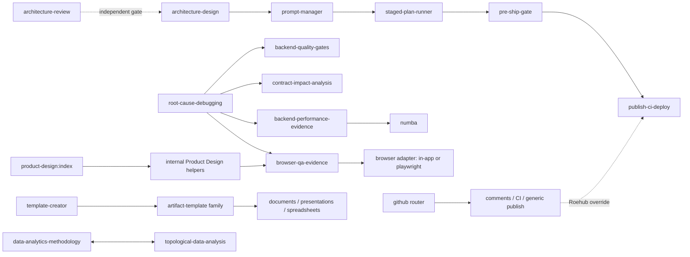

# Stage 02 — Consolidated Skill-System Improvement Backlog

Консолидированный read-only результат классического аудита локальной библиотеки
skills/plugins. Документ закрывает полный inventory из Stage `00`, объединяет
main-model и clean-context выводы Stage `01` и задаёт совместимый целевой
контракт. Исходные `SKILL.md`, plugin cache и system skills не изменялись.

Статус: `accepted` после cold-head verdict `Block`, main-agent fix-loop,
локальной follow-up проверки и синхронного закрытия ledger.

Дата: `2026-07-09`.

## Результат Stage 02

- Canonical skills: `85/85` покрыты итоговым backlog.
- Main-model review: `85/85`; clean-context review: `85/85`.
- Hash drift между inventory и review: `0`; `85/85` имеют статус `same`.
- Приоритеты: `P0 = 18`, `P1 = 45`, `P2 = 12`, `P3 = 10`.
- Structural validation: `80` valid, `5` invalid (`S018`, `S056`, `S057`,
  `S075`, `S078`).
- Progressive-disclosure pressure: `8` корневых `SKILL.md` длиннее `500` строк.
- Exact-content duplicates: `4` пары (`S005/S020`, `S006/S021`, `S007/S022`,
  `S059/S060`).
- Source mutations: `0`; этот stage предлагает изменения, но не применяет их.

Главный вывод: библиотеке нужен не более подробный общий prompt, а единый
тонкий protocol layer. Trigger и ограничения остаются в коротком `SKILL.md`,
детали уходят в references/scripts, каталог отделяет public skills от internal и
cache-only entries, а каждый запуск возвращает совместимый `skill-result/v1`.

## Статус внедрения рекомендаций

Аудит выше остаётся неизменяемым историческим baseline: исходные findings,
приоритеты, source anchors и оценки риска не переписываются задним числом.
Отдельный staged implementation завершён `2026-07-10`:

- baseline `S001–S085`: `78 implemented + 7 deprecated = 85/85 terminal`;
- текущий inventory `S001–S096`: `96/96 classified`, включая `11/11`
  supplemental Figma cache записей со статусом
  `inventory_only/preserve_dormant`;
- каналы реализации: `23` direct source repairs, `55` corrected resource
  contracts, `7` deprecated aliases и `0` accepted-no-change;
- обязательные строки: `0 pending`, `0 blocked`;
- effective contracts: `78/78` проходят official validator,
  `skill-spec/v1` и structural audit `100/100`;
- relations: `0` dangling edges, `0` unresolved aliases, `0` public duplicate
  targets;
- deterministic fixtures: `61/61`; representative `skill-result/v1`
  envelopes: `4/4`;
- управляемые plugin cache sources не редактировались; их исходные hashes
  сохранены `62/62` для baseline и `11/11` для supplemental inventory;
- fresh read-only Codex process подтвердил routing и нулевое расширение
  публичной discovery surface.

Authoritative implementation references:

- план: `docs/architecture/agents/skill-library-wave0-full-implementation-v1.md`;
- ledger: `docs/architecture/agents/skill-library-wave0-full-implementation-v1-stage-reports/skill-library-wave0-full-implementation-v1-stage-ledger.md`;
- итоговый отчёт: `docs/architecture/agents/skill-library-wave0-full-implementation-v1-stage-reports/08-closure.md`;
- каталог: `.codex/skill-system/catalog-v1.json`;
- итоговая машинная сверка:
  `.codex/skill-system/evidence/stage-08-final-reconciliation.json`;
- runtime proof:
  `.codex/skill-system/evidence/stage-07-fresh-process.json`.

Контрактное влияние итогового внедрения: Roehub runtime/API/UI/data — `none`;
общая система скиллов — `compatible-change`; обязательные authority/target/
budget gates для ранее автономных external/paid действий — намеренное
`breaking-change` по безопасности. Canonical renames и deprecations сохранены
через aliases и deterministic resolver.

## Сравнение уровней инструкций

| Layer | Что работает | Системный риск | Целевой акцент |
|---|---|---|---|
| Platform/system/developer/tool contracts | задают реальную верхнюю границу authority, permissions и tool output | отдельные skills пытаются объявить себя выше platform/tool rules | каждый skill явно наследует верхние правила и никогда не переопределяет их |
| `~/.codex/AGENTS.md` | компактный общий baseline: repo-first, minimal diff, safety, contracts, gates | формула «repository overrides global» без явного напоминания о внешних platform layers может быть вырвана из контекста | наследовать действующую platform hierarchy и applicable `AGENTS.md` discovery/precedence без изобретения универсального порядка; skill всегда ниже обоих слоёв |
| Repository root `AGENTS.md` | корректный discovery pointer к нормативному файлу | отсутствует риск только пока pointer и target не расходятся | сохранить pointer-only роль; не дублировать полный policy |
| Repository `.codex/AGENTS.md` | сильный Roehub contract для shared `main`, proof boundaries, stage ledgers, browser/runtime и delivery | большой, изменчивый repo contract уже частично скопирован в `S068`, `S069`, `S080`, что создаёт drift и reviewer recursion | skills содержат portable core, а Roehub-specific поведение читают из текущего `.codex/AGENTS.md`/profile |
| `SKILL.md` | лучшие skills хорошо задают trigger, workflow и evidence | неодинаковые metadata, modes, side effects, blockers, outputs и relationships | единый `skill-spec/v1`, короткий hot path и общий result envelope |

Нормативная формулировка authority для каждого skill:

> This skill never overrides the active platform instruction hierarchy,
> applicable AGENTS.md discovery/precedence, permission boundaries, or tool
> contracts. Resolve conflicts using those active contracts; the skill is
> always subordinate and reports any constrained or blocked step.

Она устраняет наиболее опасный класс дефектов, включая попытку `S075`
«supersede» global/tool rules и локальные policy-копии, которые со временем
расходятся с Roehub contract.

## Карта ролей и связей



Routing principles:

1. Router выбирает ровно один primary skill; companions подключаются только к
   конкретному acceptance surface.
2. Repo-specific orchestrator побеждает generic workflow для той же операции:
   в Roehub publish route — `publish-ci-deploy`, а не generic `yeet`.
3. Review skills по умолчанию read-only. Mutation требует отдельного execute/fix
   mode или явного пользовательского запроса.
4. Internal helpers не должны конкурировать с public router в discovery.
5. Managed plugin cache не редактируется напрямую: исправление идёт upstream,
   через новую plugin version или локальный policy/catalog overlay.

## Единый machine-readable контракт `skill-spec/v1`

### Совместимое frontmatter

Верхний уровень остаётся минимальным и совместимым с текущим validator:
`name`, `description`, `metadata`. Новые поля находятся в `metadata`; текущий
`quick_validate.py` не интерпретирует nested shape, а v1 validator обязан
проверять его формальной схемой ниже. Production-loader compatibility до
отдельного fixture остаётся `unknown`.

```yaml
---
name: example-skill
description: "Use when the user asks to inspect X. Do not use for Y or mutation-only requests."
metadata:
  short-description: "Inspect X with evidence"
  skill-spec: "v1"
  role: "workflow"
  visibility: "public"
  owner: "user"
  mutability: "source"
  side-effect-class: "local-write"
  primary-output: "report"
  companions:
    - "contract-impact-analysis"
  conflicts: []
---
```

Обязательные семантические правила:

- `name`: lowercase hyphen-case, стабильный canonical id; rename требует alias и
  migration window.
- `description`: сначала положительный trigger, затем явный `Do not use for`;
  не прятать routing только в body.
- `visibility`: отделяет реальный public catalog от internal/cache/dependency
  inventory; filesystem presence не означает discoverability.
- `side-effect-class`: описывает максимальный возможный side effect, а не
  «обычное» поведение.
- `owner` + `mutability`: запрещают прямой patch managed cache и задают канал
  исправления.
- `companions` и `conflicts`: YAML arrays canonical names; empty array означает
  отсутствие связей, escaping comma-separated строк не используется.
- enum `role`: `router`, `orchestrator`, `workflow`, `gate`, `tool`, `domain`,
  `template`, `meta`.
- enum `visibility`: `public`, `internal`, `cache-only`.
- enum `owner`: `system`, `user`, `plugin:<id>`, `project:<id>`.
- enum `mutability`: `source`, `managed-cache`.
- enum `side-effect-class`: `read-only`, `local-write`, `external-write`,
  `paid-job`, `production-mutation`.
- enum `primary-output`: `report`, `artifact`, `patch`, `deployment`, `decision`.

Формальная proposed schema для frontmatter после YAML→JSON conversion:

```json
{
  "$schema": "https://json-schema.org/draft/2020-12/schema",
  "$id": "skill-spec/v1",
  "type": "object",
  "required": ["name", "description", "metadata"],
  "properties": {
    "name": {
      "type": "string",
      "pattern": "^[a-z0-9]+(?:-[a-z0-9]+)*$",
      "maxLength": 64
    },
    "description": {"type": "string", "minLength": 1},
    "license": {"type": ["string", "null"]},
    "allowed-tools": {},
    "metadata": {
      "type": "object",
      "required": [
        "short-description", "skill-spec", "role", "visibility", "owner",
        "mutability", "side-effect-class", "primary-output", "companions",
        "conflicts"
      ],
      "properties": {
        "short-description": {"type": "string", "minLength": 1},
        "skill-spec": {"const": "v1"},
        "role": {
          "enum": ["router", "orchestrator", "workflow", "gate", "tool", "domain", "template", "meta"]
        },
        "visibility": {"enum": ["public", "internal", "cache-only"]},
        "owner": {
          "type": "string",
          "pattern": "^(system|user|plugin:[a-z0-9._-]+|project:[a-z0-9._-]+)$"
        },
        "mutability": {"enum": ["source", "managed-cache"]},
        "side-effect-class": {
          "enum": ["read-only", "local-write", "external-write", "paid-job", "production-mutation"]
        },
        "primary-output": {"enum": ["report", "artifact", "patch", "deployment", "decision"]},
        "companions": {
          "type": "array",
          "items": {"type": "string", "pattern": "^[a-z0-9]+(?:-[a-z0-9]+)*$"},
          "uniqueItems": true
        },
        "conflicts": {
          "type": "array",
          "items": {"type": "string", "pattern": "^[a-z0-9]+(?:-[a-z0-9]+)*$"},
          "uniqueItems": true
        }
      },
      "additionalProperties": true
    }
  },
  "additionalProperties": false
}
```

Implementation gate должен расширить actual production loader либо добавить
wrapper-validator, который: parse-ит frontmatter тем же YAML parser-ом,
применяет `skill-spec/v1`, разрешает relations только на catalog IDs и падает на
public→missing/internal edge. Пока такого gate нет, schema является formal
proposal, а не внедрённой гарантией.

### Совместимый шаблон `SKILL.md`

```markdown
# <Human-readable title>

## Purpose and authority

One sentence describing the outcome.

This skill never overrides the active platform instruction hierarchy,
applicable AGENTS.md discovery/precedence, permission boundaries, or tool
contracts. Resolve conflicts using those active contracts; the skill is always
subordinate and reports any constrained or blocked step.

## Inputs and preconditions

- Required inputs and how to discover them.
- Current repository/workspace instructions that must be read.
- Capabilities that may be absent and the safe fallback.

## Modes

- `inspect`: read-only, no durable or external mutation.
- `execute`: scoped mutation only when the request authorizes it.

List only modes the skill really supports.

## Workflow

1. Establish current state and task scope.
2. Select the smallest valid path and named companions.
3. Execute bounded actions.
4. Verify at the nearest meaningful boundary.
5. Return `skill-result/v1`.

## Side effects and approval boundary

- Enumerate local writes, external writes, paid jobs and production mutations.
- State which actions require explicit authority, destination and budget.
- Never print or persist secrets, cookies, tokens, raw provider payloads or PII.

## Stop and blocker rules

- `blocked`: a required prerequisite or authority is absent.
- `partial`: useful verified work exists but the full outcome was not reached.
- Never convert a failed gate into success by inference.

## Verification and evidence

- Commands or tools, expected evidence and proof-boundary label.
- Redaction, scratch ownership and cleanup rules.

## Output contract

Return the common result envelope plus the skill-specific artifact or report.

## References and scripts

Load only the one-hop resource needed for the selected mode. Keep volatile
versions, long examples and incident history outside the hot-path body.
```

Target size is usually `80–250` lines and must stay below `500` unless the root
file is itself a compact generated reference. Long commands/examples belong in
scripts or one-hop references; references do not recursively preload a tree.

### Единый result envelope `skill-result/v1`

```yaml
skill_run:
  spec: "skill-result/v1"
  skill: "canonical-skill-name"
  status: "completed"
  mode: "inspect"
  inputs: []
  assumptions: []
  actions: []
  evidence: []
  side_effects: []
  contract_impact:
    classification: "none"
    dimensions: []
  files:
    created: []
    modified: []
    deleted: []
    outside_expected_paths: []
  redaction: "not-needed"
  proof_boundary:
    surface: "none"
    profile: "generic"
    label: "none"
  residual_risks: []
  next_action: "none or one concrete action"
```

Human-readable ответ может быть короче, но durable report/ledger использует эти
стабильные поля. Skill-specific evidence добавляется внутрь `evidence`, а не
переименовывает общие поля.

Allowed values: `status = completed|partial|blocked`, `mode = inspect|execute`,
`contract_impact.classification = none|compatible-change|breaking-change|unknown`,
`redaction = applied|not-needed|unknown`, `proof_boundary.surface =
tests-only|browser|api|runtime|ci|deploy|none`. `proof_boundary.label` является
profile-aware: generic profile использует `none` или documented local label;
Roehub profile обязан использовать точные
`target_host_readiness_pre_main`, `read_only_existing_runtime_smoke` или
`post_main_production_runtime_proof` там, где применим Mac Studio/runtime/deploy
boundary. Generic `runtime`/`deploy` не заменяет эти labels.

Формальная proposed result schema должна проверять как минимум: required
`spec/skill/status/mode/evidence/side_effects/contract_impact/files/redaction/
proof_boundary/residual_risks/next_action`; closed enums выше; четыре file
arrays; `proof_boundary.surface/profile/label`; и условие Roehub profile, при
котором runtime/deploy evidence использует один из трёх точных repo labels.
Version negotiation выполняется по `spec`; consumer неизвестной major version
обязан вернуть `blocked`, а не молча интерпретировать другой shape.

```json
{
  "$schema": "https://json-schema.org/draft/2020-12/schema",
  "$id": "skill-result/v1",
  "type": "object",
  "required": ["skill_run"],
  "properties": {
    "skill_run": {
      "type": "object",
      "required": [
        "spec", "skill", "status", "mode", "inputs", "assumptions",
        "actions", "evidence", "side_effects", "contract_impact", "files",
        "redaction", "proof_boundary", "residual_risks", "next_action"
      ],
      "properties": {
        "spec": {"const": "skill-result/v1"},
        "skill": {"type": "string", "pattern": "^[a-z0-9]+(?:-[a-z0-9]+)*$"},
        "status": {"enum": ["completed", "partial", "blocked"]},
        "mode": {"enum": ["inspect", "execute"]},
        "inputs": {"type": "array"},
        "assumptions": {"type": "array"},
        "actions": {"type": "array"},
        "evidence": {"type": "array"},
        "side_effects": {"type": "array"},
        "contract_impact": {
          "type": "object",
          "required": ["classification", "dimensions"],
          "properties": {
            "classification": {"enum": ["none", "compatible-change", "breaking-change", "unknown"]},
            "dimensions": {"type": "array"}
          },
          "additionalProperties": false
        },
        "files": {
          "type": "object",
          "required": ["created", "modified", "deleted", "outside_expected_paths"],
          "properties": {
            "created": {"type": "array", "items": {"type": "string"}},
            "modified": {"type": "array", "items": {"type": "string"}},
            "deleted": {"type": "array", "items": {"type": "string"}},
            "outside_expected_paths": {"type": "array", "items": {"type": "string"}}
          },
          "additionalProperties": false
        },
        "redaction": {"enum": ["applied", "not-needed", "unknown"]},
        "proof_boundary": {
          "type": "object",
          "required": ["surface", "profile", "label"],
          "properties": {
            "surface": {"enum": ["tests-only", "browser", "api", "runtime", "ci", "deploy", "none"]},
            "profile": {"type": "string", "minLength": 1},
            "label": {"type": "string", "minLength": 1}
          },
          "additionalProperties": false
        },
        "residual_risks": {"type": "array"},
        "next_action": {"type": "string"}
      },
      "additionalProperties": false,
      "allOf": [
        {
          "if": {
            "properties": {
              "proof_boundary": {
                "properties": {
                  "profile": {"const": "roehub"},
                  "surface": {"enum": ["runtime", "deploy"]}
                },
                "required": ["profile", "surface"]
              }
            }
          },
          "then": {
            "properties": {
              "proof_boundary": {
                "properties": {
                  "label": {
                    "enum": [
                      "target_host_readiness_pre_main",
                      "read_only_existing_runtime_smoke",
                      "post_main_production_runtime_proof"
                    ]
                  }
                }
              }
            }
          }
        }
      ]
    }
  },
  "additionalProperties": false
}
```

## Top improvement themes

| Theme | Evidence | Усиление |
|---|---|---|
| Authority и precedence | `S003`, `S004`, `S056`, `S057`, `S063`, `S068`, `S069`, `S075`, `S080`, `S085` | одна общая authority clause; repo policy читается, а не копируется; designated cold-head reviewer terminal и не spawn-ит ещё reviewer-а |
| Side effects, approvals и spend | HF jobs/trainers, GitHub publish, sharing/deploy, installer, production delivery | mode + side-effect-class; перед external/paid/prod действием фиксируются authority, target, visibility, budget, rollback |
| Secrets, PII и raw evidence | browser state, CI logs, traces, saved context, social research | запрет raw cookies/storage/headers/payloads; bounded redacted evidence; scratch ownership и cleanup |
| Progressive disclosure | восемь skills длиннее `500` строк | короткий router/hot path; volatile API, long examples и incident history в one-hop references/scripts |
| Catalog и cache topology | `90` raw paths → `85` canonical; четыре duplicate pairs; лишь часть inventory public | `visibility`, `owner`, `mutability`, canonical-path/hash dedupe; upstream/overlay вместо cache patch |
| Verification semantics | UI, Office templates, analytics, performance, deploy | named acceptance surface; browser/recalc/openability/tie-out/runtime/CI evidence; tests-only не маскируются как release proof |
| Output и file ownership | fixed report paths, auto-persist, temp artifacts, broad staging | `skill-result/v1`, caller-owned destination, explicit file manifest, foreign changes preserved |
| Domain integrity | legal, finance, experiment, market and system-design templates | provenance, as-of/jurisdiction, uncertainty, accounting tie-outs, architecture/contract gates до visual acceptance |

## Per-skill backlog

`recommended_action` использует закрытый набор: `leave_as_is`,
`rewrite_prompt_contract`, `add_examples`, `tighten_routing`, `split_skill`,
`merge_or_deprecate`, `needs_manual_decision`. Полные hashes и paths находятся в
Stage `00`; подробные findings — в Stage `01`.

| skill_id | relation | what_works | recommended_action | improvement_proposal | priority | subagent_evidence_ref | hash_drift_status | coverage_status |
|---|---|---|---|---|---|---|---|---|
| S001 | browser adapter → S044/S072 | precise bootstrap and auth handoff | tighten_routing | capability fallback; redact storage, cookies and network evidence | P2 | `/root/classic_audit_b2` | same | covered |
| S002 | browser adapter → S044/S072 | connector-first and no auth bypass | rewrite_prompt_contract | bind named tabs/domains; redact profile state | P1 | `/root/classic_audit_b2` | same | covered |
| S003 | OS UI adapter | fresh AX-state loop and confirmation taxonomy | rewrite_prompt_contract | inherit platform confirmation policy; narrow terminal exemption; redact UI evidence | P1 | `/root/classic_audit_b1` | same | covered |
| S004 | visualization tool | responsive, CSP and accessibility guidance | rewrite_prompt_contract | respect higher commentary; discover writable path; use fidelity-based rules | P1 | `/root/classic_audit_b2` | same | covered |
| S005 | old cache duplicate of S020 | thread-aware GraphQL and write safety | merge_or_deprecate | expose one canonical catalog entry; policy-aware network fallback | P1 | `/root/classic_audit_b1` | same | covered |
| S006 | old cache duplicate of S021 | narrow CI diagnosis and local verification | merge_or_deprecate | dedupe; bound, redact and clean log evidence | P1 | `/root/classic_audit_b3` | same | covered |
| S007 | old cache duplicate of S022 | connector-first specialist routing | merge_or_deprecate | dedupe and apply repo override before generic publish route | P1 | `/root/classic_audit_b1` | same | covered |
| S008 | generic publisher; Roehub → S081 | scope inspection and draft PR | rewrite_prompt_contract | repository policy first; explicit-path staging; no automatic branch/install | P0 | `/root/classic_audit_b2` | same | covered |
| S009 | HF base CLI | broad command map and env-token advice | rewrite_prompt_contract | verified install/version; live help; destructive-action and redaction gates | P1 | `/root/classic_audit_b2` | same | covered |
| S010 | HF evaluation workflow | smoke-before-scale and backend fallback | split_skill | separate local/provider modes; pin revision, seed and versions; trust gate | P1 | `/root/classic_audit_b3` | same | covered |
| S011 | HF dataset tool | compact API and pagination guidance | split_skill | separate viewer from uploads; explicit destination/visibility authority | P1 | `/root/classic_audit_b1` | same | covered |
| S012 | HF Gradio reference | useful component and event patterns | tighten_routing | move volatile signatures to versioned reference; security/a11y/browser gate | P2 | `/root/classic_audit_b2` | same | covered |
| S013 | HF Jobs orchestrator | timeouts, persistence, monitoring and failures | split_skill | safe core + references; dry run, cost cap, exact target, no token output | P0 | `/root/classic_audit_b2` | same | covered |
| S014 | HF Jobs training client | dataset validation and smoke guidance | split_skill | reuse safe Jobs adapter; confirm model, data, hardware, budget and target | P0 | `/root/classic_audit_b3` | same | covered |
| S015 | HF paper write workflows | strong command and error coverage | split_skill | separate read/write/authorship/article paths; preview, diff, rollback, redaction | P1 | `/root/classic_audit_b3` | same | covered |
| S016 | HF/arXiv paper reader | robust ID parsing and API fallbacks | split_skill | read-only default; isolate admin writes; primary-source citation contract | P1 | `/root/classic_audit_b2` | same | covered |
| S017 | HF experiment observability | thin router and JSON metrics path | rewrite_prompt_contract | bound polling/relaunch; stopping budget, run identity and webhook privacy | P1 | `/root/classic_audit_b2` | same | covered |
| S018 | JS inference reference | broad task/device/model coverage | split_skill | valid metadata; versioned refs; fixed lifecycle example; license/privacy/benchmark gates | P1 | `/root/classic_audit_b2` | same | covered |
| S019 | HF vision Jobs client | dataset and model diagnostics | split_skill | reuse safe Jobs adapter; approval for cost/target; exact companion names | P0 | `/root/classic_audit_b2` | same | covered |
| S020 | active PR-comment specialist via S022 | correct thread semantics and write boundary | merge_or_deprecate | canonicalize S005/S020 content; least-privilege network and redacted excerpts | P1 | `/root/classic_audit_b3` | same | covered |
| S021 | CI specialist via S022 | root-cause-first CI workflow | rewrite_prompt_contract | bounded redacted logs; scoped fix request is sufficient mutation authority | P1 | `/root/classic_audit_b2` | same | covered |
| S022 | GitHub public router | concise intent routing | merge_or_deprecate | canonicalize S007/S022; read AGENTS; route Roehub publish to S081 | P1 | `/root/classic_audit_b3` | same | covered |
| S023 | generic publisher via S022; Roehub → S081 | scope checks and draft PR | rewrite_prompt_contract | repository policy first; never broad-stage; branch only when authorized | P0 | `/root/classic_audit_b3` | same | covered |
| S024 | artifact template → S057 | fidelity, no invention and render loop | rewrite_prompt_contract | KPI/source map; formula recalculation and openability gate | P2 | `/root/classic_audit_b3` | same | covered |
| S025 | artifact template → S056 | retained deck fidelity and rendering | add_examples | add KPI provenance, period, unit and actual/forecast semantics | P2 | `/root/classic_audit_b1` | same | covered |
| S026 | artifact template → S054 | nondestructive template and no invention | add_examples | exact Documents companion; source/findings/recommendation evidence map | P3 | `/root/classic_audit_b2` | same | covered |
| S027 | artifact template → S054 + S074 | document fidelity and render gate | rewrite_prompt_contract | experiment design, uncertainty, power and causal-label integrity | P1 | `/root/classic_audit_b3` | same | covered |
| S028 | artifact template → S057 | formula-rich fidelity | rewrite_prompt_contract | recalc, error scan, totals, scenarios, runway and openability checks | P1 | `/root/classic_audit_b1` | same | covered |
| S029 | artifact template → S054 | no invention and retained structure | rewrite_prompt_contract | provenance, assumptions, sensitivity and unresolved-data flags | P1 | `/root/classic_audit_b2` | same | covered |
| S030 | high-stakes template → S054 | no fabricated facts and faithful document | rewrite_prompt_contract | require jurisdiction, as-of date, primary law, citations and legal-review boundary | P0 | `/root/classic_audit_b3` | same | covered |
| S031 | artifact template → S054 | visual fidelity and fallback | add_examples | recency/source labels; separate evidence, inference and implication | P2 | `/root/classic_audit_b1` | same | covered |
| S032 | artifact template → S054 | narrow faithful document creation | add_examples | field checklist and explicit create-versus-send boundary | P3 | `/root/classic_audit_b2` | same | covered |
| S033 | artifact template → S057 | formula/validation/layout preservation | add_examples | timezone, locale, fiscal and recurrence semantics plus recalc | P2 | `/root/classic_audit_b3` | same | covered |
| S034 | artifact template → S056 | retained visual system and sourced content | add_examples | owner, status, due date and open/closed action semantics | P2 | `/root/classic_audit_b1` | same | covered |
| S035 | artifact template → S056 | master/layout fidelity and no invention | add_examples | goals/scope/owner/milestone completeness; mark unresolved fields | P3 | `/root/classic_audit_b2` | same | covered |
| S036 | artifact template → S057 | table/formula/Gantt fidelity | rewrite_prompt_contract | status vocabulary, owners, dependency cycles, dates and recalc | P2 | `/root/classic_audit_b3` | same | covered |
| S037 | artifact template → S057 | formula, validation and chart preservation | rewrite_prompt_contract | stage/probability/duplicate/forecast semantic integrity | P1 | `/root/classic_audit_b1` | same | covered |
| S038 | artifact template → S056 | faithful dark reference and render check | add_examples | dark/projector contrast, chart and display acceptance | P3 | `/root/classic_audit_b2` | same | covered |
| S039 | artifact template → S056 | narrow trigger and visual fidelity | add_examples | explicit Presentations relation; contrast/font/embed checks | P3 | `/root/classic_audit_b3` | same | covered |
| S040 | artifact template → S054 | narrow, nondestructive and faithful | add_examples | recommendation, alternatives, risks, owner and milestone trace | P3 | `/root/classic_audit_b1` | same | covered |
| S041 | artifact template → S068/S069 + S054 | visual structure and no invention | tighten_routing | require architecture policy, contracts, rollout, validation and cold-head | P1 | `/root/classic_audit_b2` | same | covered |
| S042 | artifact template → S056 | fidelity and user-controlled deviations | add_examples | distinguish proposed, approved and open; owner/deadline/source | P3 | `/root/classic_audit_b3` | same | covered |
| S043 | artifact template → S057 | integrated formula structure | rewrite_prompt_contract | balance, tie-out, roll-forward, recalc and openability gates | P1 | `/root/classic_audit_b1` | same | covered |
| S044 | Product Design audit → S072/browser | screenshot-grounded severity and evidence | tighten_routing | semantic/keyboard path; conditional Figma; scoped evidence ownership | P2 | `/root/classic_audit_b1` | same | covered |
| S045 | Product Design internal QA | same-state comparison and iteration | rewrite_prompt_contract | explicit report-only/fix modes; caller-owned report path; repo asset policy | P1 | `/root/classic_audit_b1` | same | covered |
| S046 | Product Design internal brief gate | avoids re-asking known facts | tighten_routing | task context first; narrow saved context; capability-aware expectations | P2 | `/root/classic_audit_b1` | same | covered |
| S047 | Product Design ideation → S063 | reference gate and distinct concepts | rewrite_prompt_contract | put selection instructions before image calls; durable IDs; configurable count | P0 | `/root/classic_audit_b3` | same | covered |
| S048 | Product Design image implementation → S072 | visual target and browser QA | rewrite_prompt_contract | licensed assets; opt-in deploy/artifacts; capability-aware browser | P0 | `/root/classic_audit_b2` | same | covered |
| S049 | Product Design public router | clear plugin boundary and focused routes | rewrite_prompt_contract | declare internal edges; discover capabilities; lazy-load user context | P1 | `/root/classic_audit_b3` | same | covered |
| S050 | Product Design research | evidence/inference and confidence discipline | rewrite_prompt_contract | time window, stop budget, privacy, dedupe and citation/quote limits | P1 | `/root/classic_audit_b2` | same | covered |
| S051 | Product Design sharing | target confirmation and working-URL proof | tighten_routing | classify disposable versus repo deploy; readiness/rollback; repo orchestrator wins | P1 | `/root/classic_audit_b1` | same | covered |
| S052 | Product Design URL clone → S072 | source capture and browser comparison | rewrite_prompt_contract | ownership/licensing gate; bounded route/state manifest and stop budget | P0 | `/root/classic_audit_b3` | same | covered |
| S053 | Product Design durable context | writable preflight and secret ban | rewrite_prompt_contract | call them design tokens; namespace, PII scan, fresh upload consent, delete path | P0 | `/root/classic_audit_b2` | same | covered |
| S054 | DOCX artifact core | strict render/inspect loop and minimal edits | split_skill | compact router; resolved runtime commands; finite visual/a11y/privacy criteria | P1 | `/root/classic_audit_b3` | same | covered |
| S055 | PDF artifact core | separates extraction and visual evidence | rewrite_prompt_contract | caller paths; dependency authority; Unicode-safe and active/encrypted-content checks | P1 | `/root/classic_audit_b2` | same | covered |
| S056 | presentation artifact core | narrative/fidelity and visual QA | rewrite_prompt_contract | lowercase canonical name with alias; resolve vector-diagram contradiction | P1 | `/root/classic_audit_b1` | same | covered |
| S057 | spreadsheet artifact core | formula auditability and visual pass | rewrite_prompt_contract | lowercase canonical name with alias; full authority; inspect/execute modes | P1 | `/root/classic_audit_b2` | same | covered |
| S058 | template meta-skill → Office cores | exact-target update and manifest verification | rewrite_prompt_contract | informed retention; hidden metadata/PII scan; scrub option and cleanup | P1 | `/root/classic_audit_b3` | same | covered |
| S059 | dependency cache duplicate → S077 | broad Playwright CLI coverage | merge_or_deprecate | exclude node_modules skills; remove raw-state examples; use pinned S077 | P0 | `/root/classic_audit_b2` | same | covered |
| S060 | dependency cache duplicate → S077 | broad Playwright CLI coverage | merge_or_deprecate | hash-dedupe with S059; canonical pinned wrapper and redaction | P0 | `/root/classic_audit_b3` | same | covered |
| S061 | trace inspector companion to S077 | useful action/request/console navigation | rewrite_prompt_contract | redacted summaries; pinned CLI; external scratch and cleanup | P0 | `/root/classic_audit_b1` | same | covered |
| S062 | Roehub prototype plugin → S077/S072 | clear design-only scope and existing paths | rewrite_prompt_contract | plugin-relative source; exact cwd; build/browser/console acceptance | P1 | `/root/classic_audit_b3` | same | covered |
| S063 | raster image tool | generate/edit routing and nondestructive output | split_skill | built-in router + fallback refs; tool contract wins; resolve logo policy | P1 | `/root/classic_audit_b1` | same | covered |
| S064 | official OpenAI docs router | authoritative sources and migration boundary | rewrite_prompt_contract | discover capabilities; official fallback; no global install without authority | P1 | `/root/classic_audit_b3` | same | covered |
| S065 | plugin meta-skill → S066 | safe force behavior and validation | rewrite_prompt_contract | one resolved root example; validate discovery and installation, not manifest alone | P1 | `/root/classic_audit_b3` | same | covered |
| S066 | skill meta-skill | progressive disclosure and forward testing | rewrite_prompt_contract | one authoritative schema; owned cleanup; examples in references | P1 | `/root/classic_audit_b1` | same | covered |
| S067 | installer → S066 contract gate | helper scripts and existing-target abort | rewrite_prompt_contract | provenance/commit review; never overwrite system skills; policy-aware network | P0 | `/root/classic_audit_b2` | same | covered |
| S068 | architecture pipeline entry → S080 | proportionality, current-state and validation ladder | split_skill | portable core + repo profile; permitted reviewer; terminal cold-head role | P1 | `/root/classic_audit_b1` | same | covered |
| S069 | independent architecture gate | fact/inference ledger and severity matrix | rewrite_prompt_contract | designated reviewer never spawns; one shared receipt schema | P1 | `/root/classic_audit_b1` | same | covered |
| S070 | performance gate → S076 | hot-path and comparability discipline | leave_as_is | small polish: redact raw env and secret-bearing telemetry | P3 | `/root/classic_audit_b1` | same | covered |
| S071 | backend verification gate | wrapper-first and failure classification | leave_as_is | one evidence-driven retry ceiling; record CI/runtime environment | P3 | `/root/classic_audit_b3` | same | covered |
| S072 | browser acceptance gate | report-only posture and auth/redaction | rewrite_prompt_contract | label browser_qa_readiness; delegate ship verdict; proof-boundary field | P1 | `/root/classic_audit_b1` | same | covered |
| S073 | compatibility gate | clear surfaces and four-state classification | leave_as_is | add standard surface/evidence/classification/migration matrix | P3 | `/root/classic_audit_b1` | same | covered |
| S074 | analytics router ↔ S084 | causal/ML/data-quality guardrails | tighten_routing | recognize approved method contract; workspace-conditional plan artifact | P2 | `/root/classic_audit_b3` | same | covered |
| S075 | social/web research router | query resolution, diversity and Russian synthesis | split_skill | valid frontmatter; portable core + execution/synthesis/security refs; no policy override or cookie path | P0 | `/root/classic_audit_b1` | same | covered |
| S076 | optimization tool → S070 | measure-first kernels and diagnostics | rewrite_prompt_contract | lock/runtime gate; deterministic corpus; performance-evidence and cache policy | P1 | `/root/classic_audit_b3` | same | covered |
| S077 | canonical terminal browser tool → S072 | pinned version, snapshots and Roehub auth | rewrite_prompt_contract | secret-safe auth; trace around auth off; redact state; caller evidence path | P1 | `/root/classic_audit_b2` | same | covered |
| S078 | release-readiness gate | compact intent/check/risk structure | rewrite_prompt_contract | quote YAML description; strict report-only mode; shared-main scope evidence | P0 | `/root/classic_audit_b2` | same | covered |
| S079 | production-risk review gate | concise safety/concurrency/migration focus | rewrite_prompt_contract | exact base and AGENTS; severity/confidence/evidence; contract matrix | P1 | `/root/classic_audit_b3` | same | covered |
| S080 | prompt-pack pipeline → S083 | ledger, validation and traceability contracts | split_skill | portable core + Roehub profile; impact-based docs; permitted reviewer rule | P1 | `/root/classic_audit_b1` | same | covered |
| S081 | Roehub delivery orchestrator | shared-main, proof-boundary and CI sequence | rewrite_prompt_contract | stage-conditional prerequisites; deploy relevance; no-runtime terminal; redacted cleanup | P0 | `/root/classic_audit_b2` | same | covered |
| S082 | debugging router → S071/S073/S070/S072 | hypothesis, reproduction and narrow fix | rewrite_prompt_contract | diagnose_only versus fix_authorized modes; sanitized evidence | P1 | `/root/classic_audit_b1` | same | covered |
| S083 | plan executor → S078/S081 | three-artifact truth and stop gates | rewrite_prompt_contract | inspect_status read-only mode; strict stage schema before execution | P1 | `/root/classic_audit_b1` | same | covered |
| S084 | TDA domain companion ↔ S074 | hypothesis-not-causality and PII guardrails | rewrite_prompt_contract | seed/config/version/features/sampling evidence; quadratic budget; current AGENTS | P2 | `/root/classic_audit_b3` | same | covered |
| S085 | UI/UX advisory → S072 | broad a11y/responsive guidance | split_skill | compact router + web/mobile refs; infer stack; opt-in persist/install; browser QA | P0 | `/root/classic_audit_b3` | same | covered |

## Final per-skill audit schema

Это нормативная self-contained таблица Stage `02`. Она повторяет обязательную схему plan doc; компактная таблица выше остаётся relationship-oriented представлением тех же решений.

| skill_id | source | path | sha256 | batch_id | skill_type | what_works | main_model_verdict | subagent_verdict | subagent_evidence_ref | top_findings | improvement_proposals | priority | risk_if_unchanged | recommended_next_action |
|---|---|---|---|---|---|---|---|---|---|---|---|---|---|---|
| S001 | plugin_skill | `/Users/daniildegtyarev/.codex/plugins/cache/openai-bundled/browser/26.707.30751/skills/control-in-app-browser/SKILL.md` | `83a5db57c3a5e7a2dcebc1dd0992b0c5ed393e3f36495af95881d8dd448491c8` | B2 | tool | precise bootstrap, auth handoff, runtime docs | improve | improve | `/root/classic_audit_b2` | `PV,SE`: one internal runtime; no browser-state redaction | capability fallback; redact storage, cookies and network evidence | P2 | brittle setup or sensitive browser evidence | tighten_routing |
| S002 | plugin_skill | `/Users/daniildegtyarev/.codex/plugins/cache/openai-bundled/chrome/26.707.30751/skills/control-chrome/SKILL.md` | `bf396dd558967b012b369603b9e86cb4c0c5dd23912a2eae60a302540ff5db4b` | B2 | tool | connector-first and no auth bypass | improve | improve | `/root/classic_audit_b2` | `SE,PV`: broad profile scope; no tab/domain or storage limits | bind named tabs/domains; redact profile state | P1 | unintended access to private Chrome state | rewrite_prompt_contract |
| S003 | plugin_skill | `/Users/daniildegtyarev/.codex/plugins/cache/openai-bundled/computer-use/1.0.1000362/skills/computer-use/SKILL.md` | `8e6a753cb166190a7f573b04dc73ae13a1c991497c77f0ef07e0c3e71d143a08` | B1 | tool | fresh AX-state loop and confirmation taxonomy | improve | improve | `/root/classic_audit_b1` | `AP,SE`: embedded confirmation policy may drift; terminal exemption too broad | inherit platform confirmation policy; narrow terminal exemption; redact UI evidence | P1 | unsafe confirmation or UI-data disclosure | rewrite_prompt_contract |
| S004 | plugin_skill | `/Users/daniildegtyarev/.codex/plugins/cache/openai-bundled/visualize/1.0.11/skills/visualize/SKILL.md` | `174968af443c48fa2ace0fb73c35b86be6d63a3049fb88312e59e500d337db4d` | B2 | tool | strong responsive, CSP and accessibility guidance | improve | improve | `/root/classic_audit_b2` | `AP,PV`: silence-before-final conflicts with mandatory updates; fixed path | respect higher commentary; discover writable path; use fidelity-based rules | P1 | instruction conflict or unusable output path | rewrite_prompt_contract |
| S005 | plugin_skill | `/Users/daniildegtyarev/.codex/plugins/cache/openai-curated/github/d6169bef/skills/gh-address-comments/SKILL.md` | `c1ebc337357402f7faabafe712e0c463981a65f736453efe52abd305bcb74769` | B1 | gate | thread-aware GraphQL and write safety | merge_or_deprecate | improve | `/root/classic_audit_b1` | `CF,PV`: exact duplicate `S020`; environment-specific escalation | expose one canonical catalog entry; policy-aware network fallback | P1 | duplicate drift or blocked review workflow | merge_or_deprecate |
| S006 | plugin_skill | `/Users/daniildegtyarev/.codex/plugins/cache/openai-curated/github/d6169bef/skills/gh-fix-ci/SKILL.md` | `7621a3560d788fb221d25f9753233fe0c393c5cfe63167c88b11f027c277b1f8` | B3 | gate | narrow CI diagnosis and local verification | merge_or_deprecate | merge_or_deprecate | `/root/classic_audit_b3` | `CF,SE`: exact duplicate `S021`; raw log persistence | dedupe; bound, redact and clean log evidence | P1 | sensitive logs and divergent duplicates | merge_or_deprecate |
| S007 | plugin_skill | `/Users/daniildegtyarev/.codex/plugins/cache/openai-curated/github/d6169bef/skills/github/SKILL.md` | `81dbdd90934fe86a79ddc4790fd211e5fca866302a74090ad153395f56f2bd42` | B1 | orchestrator | connector-first specialist routing | merge_or_deprecate | improve | `/root/classic_audit_b1` | `CF,RT`: duplicate `S022`; generic `yeet` bypasses Roehub orchestrator | dedupe and apply repo override before generic publish route | P1 | incomplete Roehub delivery lifecycle | merge_or_deprecate |
| S008 | plugin_skill | `/Users/daniildegtyarev/.codex/plugins/cache/openai-curated/github/d6169bef/skills/yeet/SKILL.md` | `93a0bcbc834c9b3ad6a8965c1a273b237b6d226e870cd0c16e08e87bc8769814` | B2 | orchestrator | scope inspection and draft PR | improve | improve | `/root/classic_audit_b2` | `RT,OW`: branch + `git add -A` conflict with Roehub; auto-install | repository policy first; explicit-path staging; no automatic branch/install | P0 | foreign files published or forbidden branch created | rewrite_prompt_contract |
| S009 | plugin_skill | `/Users/daniildegtyarev/.codex/plugins/cache/openai-curated/hugging-face/b1986b3d3da5bb8a04d3cb1e69af5a29bb5c2c04/skills/cli/SKILL.md` | `ee85209886c4ec3d3d850489368be193d11a8a3fa589012b39a4a5bbf7c7da2e` | B2 | tool | broad command map and token-as-env advice | improve | improve | `/root/classic_audit_b2` | `SX,SE,PV`: `curl\|bash`, destructive commands, static version snapshot | verified install/version; live help; destructive-action and redaction gates | P1 | supply-chain or irreversible remote mutation | rewrite_prompt_contract |
| S010 | plugin_skill | `/Users/daniildegtyarev/.codex/plugins/cache/openai-curated/hugging-face/b1986b3d3da5bb8a04d3cb1e69af5a29bb5c2c04/skills/community-evals/SKILL.md` | `a97f1c703f55b72427453a76af858237e6392a447fcafa9eeb85f7ac67f0155d` | B3 | domain | smoke-before-scale and backend fallback | improve | improve | `/root/classic_audit_b3` | `PV,VG`: local/provider modes mixed; no reproducibility schema; remote code | separate local/provider modes; pin revision, seed and versions; trust gate | P1 | non-reproducible or untrusted evaluation | split_skill |
| S011 | plugin_skill | `/Users/daniildegtyarev/.codex/plugins/cache/openai-curated/hugging-face/b1986b3d3da5bb8a04d3cb1e69af5a29bb5c2c04/skills/datasets/SKILL.md` | `5af74f3e042313efadf02e85c316a2576bdc0b0ff92c43c3ba5dcb6e2dae1ded` | B1 | domain | compact API/pagination guidance | improve | improve | `/root/classic_audit_b1` | `RT,SX`: read-only trigger later uploads datasets; floating CLI | separate viewer from uploads; explicit destination/visibility authority | P1 | unexpected Hub write from read-only request | split_skill |
| S012 | plugin_skill | `/Users/daniildegtyarev/.codex/plugins/cache/openai-curated/hugging-face/b1986b3d3da5bb8a04d3cb1e69af5a29bb5c2c04/skills/gradio/SKILL.md` | `e2f4c232c38682bccfc73115ca7d0a5427f7d625e6fd56b32515fe4c0900f997` | B2 | domain | useful component/event patterns | improve | improve | `/root/classic_audit_b2` | `PD,PV,VG`: volatile signatures in root; no security/a11y/runtime gate | move volatile signatures to versioned reference; security/a11y/browser gate | P2 | stale API and unverified demo | tighten_routing |
| S013 | plugin_skill | `/Users/daniildegtyarev/.codex/plugins/cache/openai-curated/hugging-face/b1986b3d3da5bb8a04d3cb1e69af5a29bb5c2c04/skills/jobs/SKILL.md` | `3cb5fd329d3a7c3612d66ae8513367a9019eb57cf39a2a2c86d6adabd85a7bae` | B2 | domain | timeouts, persistence, monitoring and failure coverage | split | split | `/root/classic_audit_b2` | `PD,SX,SE`: 1044 lines; paid writes without spend/destination gate; token-like examples | safe core + references; dry run, cost cap, exact target, no token output | P0 | secret exposure, unexpected spend or failed job | split_skill |
| S014 | plugin_skill | `/Users/daniildegtyarev/.codex/plugins/cache/openai-curated/hugging-face/b1986b3d3da5bb8a04d3cb1e69af5a29bb5c2c04/skills/llm-trainer/SKILL.md` | `f996e1422ba412a78683e828a2021b973eb622a26072598f33438df83859fbd2` | B3 | domain | dataset validation, timeout, persistence and smoke guidance | split | split | `/root/classic_audit_b3` | `PD,SX`: immediate paid job; conflicting tools; 718 mixed lines | reuse safe Jobs adapter; confirm model, data, hardware, budget and target | P0 | unapproved cost or unintended publication | split_skill |
| S015 | plugin_skill | `/Users/daniildegtyarev/.codex/plugins/cache/openai-curated/hugging-face/b1986b3d3da5bb8a04d3cb1e69af5a29bb5c2c04/skills/paper-publisher/SKILL.md` | `fd437f107a467a65987364d19dd55cf662b0228102d466f3b0691fad18d20679` | B3 | domain | clear HF trigger and command/error coverage | split | split | `/root/classic_audit_b3` | `PD,SX,SE`: publishing, authorship, visibility and writing mixed | separate read/write/authorship/article paths; preview, diff, rollback, redaction | P1 | wrong profile/repo mutation or PII leak | split_skill |
| S016 | plugin_skill | `/Users/daniildegtyarev/.codex/plugins/cache/openai-curated/hugging-face/b1986b3d3da5bb8a04d3cb1e69af5a29bb5c2c04/skills/papers/SKILL.md` | `985c2d5c7261aba2b157811cde0c2b30134663694a4ab701280de28f941eb3b2` | B2 | domain | ID parsing and API fallbacks | improve | improve | `/root/classic_audit_b2` | `RT,SX`: read path includes claim/index/update endpoints; weak citation contract | read-only default; isolate admin writes; primary-source citation contract | P1 | accidental metadata write or weak attribution | split_skill |
| S017 | plugin_skill | `/Users/daniildegtyarev/.codex/plugins/cache/openai-curated/hugging-face/b1986b3d3da5bb8a04d3cb1e69af5a29bb5c2c04/skills/trackio/SKILL.md` | `893ac9695f8677db4c4f0c15795e789346946f6142305c89d7ee57774e22ffb1` | B2 | domain | thin router and JSON metrics path | improve | improve | `/root/classic_audit_b2` | `SX,VG,SE`: autonomous relaunch/polling unbounded; webhook privacy | bound polling/relaunch; stopping budget, run identity and webhook privacy | P1 | uncontrolled experiments or incomplete metrics | rewrite_prompt_contract |
| S018 | plugin_skill | `/Users/daniildegtyarev/.codex/plugins/cache/openai-curated/hugging-face/b1986b3d3da5bb8a04d3cb1e69af5a29bb5c2c04/skills/transformers.js/SKILL.md` | `03e5039f7f68644ee894a066ae2c3a6a27b025746c16c945d9926b594e48744f` | B2 | domain | broad task/device/model guidance | split | improve | `/root/classic_audit_b2` | `FM,PD,VG`: invalid `compatibility`; 638 lines; broken dispose example | valid metadata; versioned refs; fixed lifecycle example; license/privacy/benchmark gates | P1 | loader failure, leak or runtime error | split_skill |
| S019 | plugin_skill | `/Users/daniildegtyarev/.codex/plugins/cache/openai-curated/hugging-face/b1986b3d3da5bb8a04d3cb1e69af5a29bb5c2c04/skills/vision-trainer/SKILL.md` | `dc49673ef648cdf5b243c49b8be749f8e4352be498e77293b371c5d5a7dfa967` | B2 | domain | dataset validation and model-specific diagnostics | split | split | `/root/classic_audit_b2` | `PD,SX,OW`: paid full runs, forced local scripts/Hub push, wrong companion names | reuse safe Jobs adapter; approval for cost/target; exact companion names | P0 | paid failed run or unintended Hub publication | split_skill |
| S020 | plugin_skill | `/Users/daniildegtyarev/.codex/plugins/cache/openai-curated-remote/github/0.1.8-2841cf9749ae/skills/gh-address-comments/SKILL.md` | `c1ebc337357402f7faabafe712e0c463981a65f736453efe52abd305bcb74769` | B3 | gate | correct thread semantics and write boundary | improve | merge_or_deprecate | `/root/classic_audit_b3` | `CF,PV`: exact duplicate `S005`; unconditional escalation | canonicalize S005/S020 content; least-privilege network and redacted excerpts | P1 | duplicate routing or permission blocker | merge_or_deprecate |
| S021 | plugin_skill | `/Users/daniildegtyarev/.codex/plugins/cache/openai-curated-remote/github/0.1.8-2841cf9749ae/skills/gh-fix-ci/SKILL.md` | `7621a3560d788fb221d25f9753233fe0c393c5cfe63167c88b11f027c277b1f8` | B2 | gate | root-cause-first CI workflow | improve | improve | `/root/classic_audit_b2` | `SE,RT`: raw log artifacts; ambiguous extra approval | bounded redacted logs; scoped fix request is sufficient mutation authority | P1 | CI secret leakage or unnecessary stop | rewrite_prompt_contract |
| S022 | plugin_skill | `/Users/daniildegtyarev/.codex/plugins/cache/openai-curated-remote/github/0.1.8-2841cf9749ae/skills/github/SKILL.md` | `81dbdd90934fe86a79ddc4790fd211e5fca866302a74090ad153395f56f2bd42` | B3 | orchestrator | concise intent routing | improve | merge_or_deprecate | `/root/classic_audit_b3` | `CF,RT`: duplicate `S007`; publish route ignores repo override | canonicalize S007/S022; read AGENTS; route Roehub publish to S081 | P1 | wrong publish topology | merge_or_deprecate |
| S023 | plugin_skill | `/Users/daniildegtyarev/.codex/plugins/cache/openai-curated-remote/github/0.1.8-2841cf9749ae/skills/yeet/SKILL.md` | `e93c6ea769ba673d30749a981cd8ad75b687f454e3c8e2e45e7cfcbd412df12c` | B3 | orchestrator | scope checks and draft PR | improve | improve | `/root/classic_audit_b3` | `RT,OW`: `git add -A`, branch-by-default, dependency install | repository policy first; never broad-stage; branch only when authorized | P0 | foreign changes or prohibited branch/dependency mutation | rewrite_prompt_contract |
| S024 | plugin_skill | `/Users/daniildegtyarev/.codex/plugins/cache/openai-curated-remote/openai-templates/0.1.0/skills/artifact-template-analytics-dashboard/SKILL.md` | `cf5360fd8b197673bb237c52c603c97fa319c875c3dfa2cd8efff52d4422f513` | B3 | template | fidelity/no-invention/render workflow | improve | improve | `/root/classic_audit_b3` | `CT,VG`: no KPI contract, recalculation or openability gate | KPI/source map; formula recalculation and openability gate | P2 | polished but semantically wrong dashboard | rewrite_prompt_contract |
| S025 | plugin_skill | `/Users/daniildegtyarev/.codex/plugins/cache/openai-curated-remote/openai-templates/0.1.0/skills/artifact-template-business-review/SKILL.md` | `27721fc1d67d1b41949caa75ac8f94f81952ff124406878af6524047929e60d2` | B1 | template | retained deck fidelity and render verification | improve | improve | `/root/classic_audit_b1` | `CT`: KPI provenance/period/unit/actual-vs-forecast absent | add KPI provenance, period, unit and actual/forecast semantics | P2 | incomparable or unsourced KPI deck | add_examples |
| S026 | plugin_skill | `/Users/daniildegtyarev/.codex/plugins/cache/openai-curated-remote/openai-templates/0.1.0/skills/artifact-template-design-report/SKILL.md` | `563722f53854e606f8a9f87e37e72d7ef70a22d46d5836b8e4d6abfb1b79e9e0` | B2 | template | nondestructive template and no invention | ok | ok | `/root/classic_audit_b2` | `CT,RT`: generic capability discovery; weak evidence map | exact Documents companion; source/findings/recommendation evidence map | P3 | well-formatted but weakly evidenced report | add_examples |
| S027 | plugin_skill | `/Users/daniildegtyarev/.codex/plugins/cache/openai-curated-remote/openai-templates/0.1.0/skills/artifact-template-experiment-analysis/SKILL.md` | `0b05effc47df0a14f8e0c3e3597e6722224747435546385d38a2cae279bd20b9` | B3 | template | document fidelity and render gate | improve | improve | `/root/classic_audit_b3` | `CT`: no design, uncertainty, power or causal label | experiment design, uncertainty, power and causal-label integrity | P1 | unsupported experiment conclusion | rewrite_prompt_contract |
| S028 | plugin_skill | `/Users/daniildegtyarev/.codex/plugins/cache/openai-curated-remote/openai-templates/0.1.0/skills/artifact-template-financial-budget/SKILL.md` | `c0b6b7a62a15597aaf2b1ec679e21da48f533b756127f0aef957cdfe9f3da738` | B1 | template | formula-rich fidelity | improve | improve | `/root/classic_audit_b1` | `CT,VG`: visual render without model integrity | recalc, error scan, totals, scenarios, runway and openability checks | P1 | mathematically broken budget | rewrite_prompt_contract |
| S029 | plugin_skill | `/Users/daniildegtyarev/.codex/plugins/cache/openai-curated-remote/openai-templates/0.1.0/skills/artifact-template-investment-committee-memo/SKILL.md` | `68abd08cfe5e073e3c446a3f675f44c5bf98f57434dba679e8acd8a763379a8b` | B2 | template | no invention and retained structure | improve | improve | `/root/classic_audit_b2` | `CT`: no provenance, assumptions, sensitivity or high-stakes review | provenance, assumptions, sensitivity and unresolved-data flags | P1 | decision based on unchecked figures | rewrite_prompt_contract |
| S030 | plugin_skill | `/Users/daniildegtyarev/.codex/plugins/cache/openai-curated-remote/openai-templates/0.1.0/skills/artifact-template-legal-memorandum/SKILL.md` | `51fb9d21baf6119c4ccb1903638a6bac0e859210de63460fffa7025d52e997e0` | B3 | template | no fabricated facts and faithful document | improve | improve | `/root/classic_audit_b3` | `CT`: no jurisdiction/date/current primary-law verification | require jurisdiction, as-of date, primary law, citations and legal-review boundary | P0 | authoritative-looking but wrong legal memo | rewrite_prompt_contract |
| S031 | plugin_skill | `/Users/daniildegtyarev/.codex/plugins/cache/openai-curated-remote/openai-templates/0.1.0/skills/artifact-template-market-trends-report/SKILL.md` | `d58d019b89cb6f292ac3ab991d561489eef477ff53ce05fb024a0c936f5af26a` | B1 | template | visual fidelity and capability fallback | improve | improve | `/root/classic_audit_b1` | `CT`: no recency/citation/fact-vs-inference gate | recency/source labels; separate evidence, inference and implication | P2 | stale or untraceable market claim | add_examples |
| S032 | plugin_skill | `/Users/daniildegtyarev/.codex/plugins/cache/openai-curated-remote/openai-templates/0.1.0/skills/artifact-template-minimal-letterhead/SKILL.md` | `880ef094d4d0c89a7bde5ce9bbe4086625c186651e9e6efc8ba8bdd7cc77f9d5` | B2 | template | narrow, faithful document creation | ok | ok | `/root/classic_audit_b2` | `CT,SX`: no field checklist or create-vs-send boundary | field checklist and explicit create-versus-send boundary | P3 | missing letter fields or send ambiguity | add_examples |
| S033 | plugin_skill | `/Users/daniildegtyarev/.codex/plugins/cache/openai-curated-remote/openai-templates/0.1.0/skills/artifact-template-operating-calendar/SKILL.md` | `33bb660791a0b9a21628a42c34934932220203b6aabd84e98cb1b45327d0384c` | B3 | template | formula/validation/layout preservation | improve | improve | `/root/classic_audit_b3` | `CT,VG`: timezone/locale/fiscal/recurrence undefined | timezone, locale, fiscal and recurrence semantics plus recalc | P2 | shifted dates or bad recurrence | add_examples |
| S034 | plugin_skill | `/Users/daniildegtyarev/.codex/plugins/cache/openai-curated-remote/openai-templates/0.1.0/skills/artifact-template-operating-review/SKILL.md` | `6d63c5cd025ffe936e7bab5db3023672bbaec26af55c2bb8b057d38c202c9c32` | B1 | template | retained visual system and sourced content | improve | improve | `/root/classic_audit_b1` | `CT`: actions lack owner/status/due/open-closed semantics | owner, status, due date and open/closed action semantics | P2 | non-actionable review deck | add_examples |
| S035 | plugin_skill | `/Users/daniildegtyarev/.codex/plugins/cache/openai-curated-remote/openai-templates/0.1.0/skills/artifact-template-project-kickoff/SKILL.md` | `aa893ebd89e7c8d1db4261d01cc2b1add35d78d00785871ccaaa5fc8db783ec9` | B2 | template | master/layout fidelity and no invention | ok | ok | `/root/classic_audit_b2` | `CT`: goals/scope/owners/milestones completeness not checked | goals/scope/owner/milestone completeness; mark unresolved fields | P3 | operationally incomplete kickoff | add_examples |
| S036 | plugin_skill | `/Users/daniildegtyarev/.codex/plugins/cache/openai-curated-remote/openai-templates/0.1.0/skills/artifact-template-project-tracker/SKILL.md` | `d97d5be20189b7f53dd269b6e1c5f694eaf53e5a72f6559fcb1578911b7cda82` | B3 | template | table/formula/Gantt fidelity | improve | improve | `/root/classic_audit_b3` | `CT,VG`: statuses, dependencies, dates and Gantt not validated | status vocabulary, owners, dependency cycles, dates and recalc | P2 | inconsistent tracker or false Gantt | rewrite_prompt_contract |
| S037 | plugin_skill | `/Users/daniildegtyarev/.codex/plugins/cache/openai-curated-remote/openai-templates/0.1.0/skills/artifact-template-sales-pipeline/SKILL.md` | `15cfeeedf440021f16ed3f3ad8c7c1ef6d48898b9447741e223d2fb41cfc9800` | B1 | template | formulas, validation and charts preserved | improve | improve | `/root/classic_audit_b1` | `CT,VG`: no stage/probability/duplicate/forecast checks | stage/probability/duplicate/forecast semantic integrity | P1 | double-counted or invalid forecast | rewrite_prompt_contract |
| S038 | plugin_skill | `/Users/daniildegtyarev/.codex/plugins/cache/openai-curated-remote/openai-templates/0.1.0/skills/artifact-template-simple-dark-mode/SKILL.md` | `b7c8d0c05f75878b9bc21e56a57c41ec1aa29700aca0a24822be0f9f1bd53207` | B2 | template | faithful reference and render check | ok | ok | `/root/classic_audit_b2` | `VG`: no dark-mode/projector contrast check | dark/projector contrast, chart and display acceptance | P3 | unreadable presentation | add_examples |
| S039 | plugin_skill | `/Users/daniildegtyarev/.codex/plugins/cache/openai-curated-remote/openai-templates/0.1.0/skills/artifact-template-simple-light-mode/SKILL.md` | `7c68430c6cf57b55b457d4735dbd1a46b889bef135a32222902dd0848b6e1752` | B3 | template | narrow trigger and visual fidelity | ok | ok | `/root/classic_audit_b3` | `RT`: companion implicit; a11y depends on base skill | explicit Presentations relation; contrast/font/embed checks | P3 | minor visual/accessibility miss | add_examples |
| S040 | plugin_skill | `/Users/daniildegtyarev/.codex/plugins/cache/openai-curated-remote/openai-templates/0.1.0/skills/artifact-template-strategy-memorandum/SKILL.md` | `51d7882ac94e8e57b323394825728c33925af878806e37277217c2dc12a912e5` | B1 | template | narrow, nondestructive and faithful | ok | ok | `/root/classic_audit_b1` | `CT`: decision provenance/ownership optional | recommendation, alternatives, risks, owner and milestone trace | P3 | weak decision traceability | add_examples |
| S041 | plugin_skill | `/Users/daniildegtyarev/.codex/plugins/cache/openai-curated-remote/openai-templates/0.1.0/skills/artifact-template-system-design/SKILL.md` | `87f7b7ed1b0d8410f5e5971cd7f7db9a4165e2f37069e97e52dbfb469b75a57c` | B2 | template | visual structure and no invention | improve | improve | `/root/classic_audit_b2` | `RT,CT`: visual template can bypass architecture policy/content gate | require architecture policy, contracts, rollout, validation and cold-head | P1 | attractive but non-executable design | tighten_routing |
| S042 | plugin_skill | `/Users/daniildegtyarev/.codex/plugins/cache/openai-curated-remote/openai-templates/0.1.0/skills/artifact-template-team-alignment/SKILL.md` | `26d7cafdcd1899a937b325c5d02ac57c162d45002153be33a934d35f81eb6110` | B3 | template | fidelity and user-controlled deviations | ok | ok | `/root/classic_audit_b3` | `CT`: proposed/approved/open states not distinguished | distinguish proposed, approved and open; owner/deadline/source | P3 | ambiguous decisions | add_examples |
| S043 | plugin_skill | `/Users/daniildegtyarev/.codex/plugins/cache/openai-curated-remote/openai-templates/0.1.0/skills/artifact-template-three-statement-forecast/SKILL.md` | `74f4a5cccec0107b861548b157e04c51d9b58ec13a990c86394b4c529b8ecf41` | B1 | template | integrated formula structure preserved | improve | improve | `/root/classic_audit_b1` | `CT,VG`: no balance/tie-out/roll-forward checks | balance, tie-out, roll-forward, recalc and openability gates | P1 | statements do not reconcile | rewrite_prompt_contract |
| S044 | plugin_skill | `/Users/daniildegtyarev/.codex/plugins/cache/openai-curated-remote/product-design/0.1.50/skills/audit/SKILL.md` | `616e74f59da25ae72f5c853b7c9cfc4317400d224ff162abd67293b6f3ee1c82` | B1 | gate | screenshot-grounded severity and current-run evidence | improve | improve | `/root/classic_audit_b1` | `VG,OW,RT`: weak DOM/keyboard path; screenshot lifecycle; overlap | semantic/keyboard path; conditional Figma; scoped evidence ownership | P2 | misses nonvisual defects or pollutes workspace | tighten_routing |
| S045 | plugin_skill | `/Users/daniildegtyarev/.codex/plugins/cache/openai-curated-remote/product-design/0.1.50/skills/design-qa/SKILL.md` | `a761ed96e1e91905e7e6f32ab95e8dc6d0cca2036556d4d63945b25efd3eaa5c` | B1 | gate | same-state comparison and iterative evidence | improve | improve | `/root/classic_audit_b1` | `RT,OW,AP`: report-only may mutate; forced root file; absolute asset ban | explicit report-only/fix modes; caller-owned report path; repo asset policy | P1 | unauthorized edits or false blockers | rewrite_prompt_contract |
| S046 | plugin_skill | `/Users/daniildegtyarev/.codex/plugins/cache/openai-curated-remote/product-design/0.1.50/skills/get-context/SKILL.md` | `19a38a3ac4443cb477a01c2303e77c891c304234a195dd2da248e3e736b22679` | B1 | workflow | does not re-ask known facts and continues | improve | improve | `/root/classic_audit_b1` | `SE,PV`: broad saved-context preflight; fixed time promise | task context first; narrow saved context; capability-aware expectations | P2 | unnecessary private-context reads | tighten_routing |
| S047 | plugin_skill | `/Users/daniildegtyarev/.codex/plugins/cache/openai-curated-remote/product-design/0.1.50/skills/ideate/SKILL.md` | `595f83f18e22b19f32fe858530f17572d3ec25d7c7f3b2dc305eca41e5435d33` | B3 | workflow | brief/reference gate and distinct concepts | improve | improve | `/root/classic_audit_b3` | `AP,RT`: post-generation prompt conflicts with tool no-text rule | put selection instructions before image calls; durable IDs; configurable count | P0 | impossible contract or wrong selected mock | rewrite_prompt_contract |
| S048 | plugin_skill | `/Users/daniildegtyarev/.codex/plugins/cache/openai-curated-remote/product-design/0.1.50/skills/image-to-code/SKILL.md` | `e0acaa600fda4b87b58774cf60a5fda8b98e18990d4d51920ec40773dd97971c` | B2 | tool | strong visual target and browser QA | improve | improve | `/root/classic_audit_b2` | `SX,OW,RT`: asset/deploy/report writes over-broad; IP/brand reuse gap | licensed assets; opt-in deploy/artifacts; capability-aware browser | P0 | unauthorized deployment or brand/IP drift | rewrite_prompt_contract |
| S049 | plugin_skill | `/Users/daniildegtyarev/.codex/plugins/cache/openai-curated-remote/product-design/0.1.50/skills/index/SKILL.md` | `8f9f19273ee34a06298ed93f8d70a9c17b3d4ce66f061b024f6d1038b138e5f7` | B3 | orchestrator | clear plugin boundary and focused routes | improve | improve | `/root/classic_audit_b3` | `PV,RT`: hardcoded browser API; environment logic and context preload | declare internal edges; discover capabilities; lazy-load user context | P1 | false blocker or wrong tool call | rewrite_prompt_contract |
| S050 | plugin_skill | `/Users/daniildegtyarev/.codex/plugins/cache/openai-curated-remote/product-design/0.1.50/skills/research/SKILL.md` | `bf824e72dd93941c8d591e4af13bb7e3a09380cd6ed7dd8c1f61a295648fa023` | B2 | workflow | evidence/inference and confidence discipline | improve | improve | `/root/classic_audit_b2` | `SE,VG`: no recency/budget/PII/quotation/dedupe controls | time window, stop budget, privacy, dedupe and citation/quote limits | P1 | privacy leak or anecdotal conclusion | rewrite_prompt_contract |
| S051 | plugin_skill | `/Users/daniildegtyarev/.codex/plugins/cache/openai-curated-remote/product-design/0.1.50/skills/share/SKILL.md` | `5976cfbc9d865230db085af37f0c25a2d8beed3ff58e0e2edb9d0a4f7ca987b5` | B1 | workflow | target confirmation and working-URL proof | improve | improve | `/root/classic_audit_b1` | `SX,RT`: no readiness/rollback; overlaps production delivery | classify disposable versus repo deploy; readiness/rollback; repo orchestrator wins | P1 | bypassed delivery gates | tighten_routing |
| S052 | plugin_skill | `/Users/daniildegtyarev/.codex/plugins/cache/openai-curated-remote/product-design/0.1.50/skills/url-to-code/SKILL.md` | `8708f622b4c86866370b8c1cef5f404b71679d09e6678953b2ca7125c3c1098d` | B3 | tool | source capture and browser comparison | improve | improve | `/root/classic_audit_b3` | `SX,CT`: availability treated as copy right; unbounded states | ownership/licensing gate; bounded route/state manifest and stop budget | P0 | copyright/terms violation or unbounded crawl | rewrite_prompt_contract |
| S053 | plugin_skill | `/Users/daniildegtyarev/.codex/plugins/cache/openai-curated-remote/product-design/0.1.50/skills/user-context/SKILL.md` | `5690a7f99cf896970493f5d0bd7f35f62ab9cbe21744352acf84dc0ceea4194c` | B2 | workflow | writable preflight and explicit secret ban | improve | improve | `/root/classic_audit_b2` | `SE,SX,OW`: “tokens” ambiguity; external reuse without fresh consent; no retention | call them design tokens; namespace, PII scan, fresh upload consent, delete path | P0 | durable privacy leak or external data transfer | rewrite_prompt_contract |
| S054 | plugin_skill | `/Users/daniildegtyarev/.codex/plugins/cache/openai-primary-runtime/documents/26.630.12135/skills/documents/SKILL.md` | `1e7aad4a77d92c36309429043b63c59f510c413623b9ab4af036da82fc3dd5b0` | B3 | tool | strict render-inspect loop and minimal edits | improve | improve | `/root/classic_audit_b3` | `PD,PV,VG`: runtime command inconsistency; 446-line root; no finite stop | compact router; resolved runtime commands; finite visual/a11y/privacy criteria | P1 | broken commands or endless QA | split_skill |
| S055 | plugin_skill | `/Users/daniildegtyarev/.codex/plugins/cache/openai-primary-runtime/pdf/26.630.12135/skills/pdf/SKILL.md` | `b09cb414c60234a15599c04a502ce36fe6e9aa178aabe007e43a3346b5aab607` | B2 | tool | separates extraction from visual evidence | improve | improve | `/root/classic_audit_b2` | `OW,PV`: fixed repo paths, install mutation, Unicode rule, malicious PDF gap | caller paths; dependency authority; Unicode-safe and active/encrypted-content checks | P1 | workspace pollution or content corruption | rewrite_prompt_contract |
| S056 | plugin_skill | `/Users/daniildegtyarev/.codex/plugins/cache/openai-primary-runtime/presentations/26.630.12135/skills/presentations/SKILL.md` | `1c6d64a49dcaef02799a493f6679a1a7a530e80f01f8b14f566313e4f3d358f9` | B1 | tool | narrative/fidelity and visual QA | improve | improve | `/root/classic_audit_b1` | `FM,AP`: invalid uppercase name; vector-shape hard-rule contradiction | lowercase canonical name with alias; resolve vector-diagram contradiction | P1 | discovery failure or impossible diagram rule | rewrite_prompt_contract |
| S057 | plugin_skill | `/Users/daniildegtyarev/.codex/plugins/cache/openai-primary-runtime/spreadsheets/26.630.12135/skills/spreadsheets/SKILL.md` | `1ec84be8e108181a0f761f6e8c7398b2c9e41daa3db78e18475f095b22fd0ed4` | B2 | tool | formula auditability and visual pass | improve | improve | `/root/classic_audit_b2` | `FM,AP,RT`: invalid name; incomplete precedence; output/citation conflict | lowercase canonical name with alias; full authority; inspect/execute modes | P1 | loader or final-format conflict | rewrite_prompt_contract |
| S058 | plugin_skill | `/Users/daniildegtyarev/.codex/plugins/cache/openai-primary-runtime/template-creator/26.630.12135/skills/template-creator/SKILL.md` | `36c4b07109d27f7f57024a67f7682f6e7c3727c73feef01401d6c6aef7a9a57c` | B3 | meta | exact-target update and manifest verification | improve | improve | `/root/classic_audit_b3` | `SE,OW`: retained hidden metadata/PII and temp lifecycle | informed retention; hidden metadata/PII scan; scrub option and cleanup | P1 | persistent confidential metadata | rewrite_prompt_contract |
| S059 | plugin_skill | `/Users/daniildegtyarev/.codex/plugins/cache/personal/roehub-live-redesign-prototype/0.1.0+codex.20260708091856/prototype/.npm-cache/_npx/820a5ae692c55a8b/node_modules/@playwright/cli/skills/playwright-cli/SKILL.md` | `b4c81c39e39f30e4790607e57b12283878f3751daca9c0e44f301899f2108b13` | B2 | tool | broad command coverage | merge_or_deprecate | merge_or_deprecate | `/root/classic_audit_b2` | `CF,SE,PV`: exact `S060`; raw cookies/state; floating latest | exclude node_modules skills; remove raw-state examples; use pinned S077 | P0 | credential leak and version drift | merge_or_deprecate |
| S060 | plugin_skill | `/Users/daniildegtyarev/.codex/plugins/cache/personal/roehub-live-redesign-prototype/0.1.0+codex.20260708091856/prototype/.npm-cache/_npx/820a5ae692c55a8b/node_modules/playwright-core/lib/tools/cli-client/skill/SKILL.md` | `b4c81c39e39f30e4790607e57b12283878f3751daca9c0e44f301899f2108b13` | B3 | tool | broad command coverage | merge_or_deprecate | merge_or_deprecate | `/root/classic_audit_b3` | `CF,SE,PV`: exact `S059`; raw cookies/state; floating latest | hash-dedupe with S059; canonical pinned wrapper and redaction | P0 | unsafe duplicate selected | merge_or_deprecate |
| S061 | plugin_skill | `/Users/daniildegtyarev/.codex/plugins/cache/personal/roehub-live-redesign-prototype/0.1.0+codex.20260708091856/prototype/.npm-cache/_npx/820a5ae692c55a8b/node_modules/playwright-core/lib/tools/trace/SKILL.md` | `df85506bfa8a445c961efa1ac244cca733667b717711bcc99c1f93994c29d5dc` | B1 | tool | useful action/request/console navigation | improve | improve | `/root/classic_audit_b1` | `SE,PV,OW`: raw headers/body/DOM; floating CLI; weak cleanup | redacted summaries; pinned CLI; external scratch and cleanup | P0 | secrets/PII in trace evidence | rewrite_prompt_contract |
| S062 | plugin_skill | `/Users/daniildegtyarev/.codex/plugins/cache/personal/roehub-live-redesign-prototype/0.1.0+codex.20260708091856/skills/backtests-live-prototype/SKILL.md` | `542fda3e7c2ff460d6be95860223f2e3d8703355af88b3807a1c28572d1c2e4e` | B3 | project | clearly design-only, paths currently exist | improve | improve | `/root/classic_audit_b3` | `PV,VG`: hardcoded source path/cwd; no browser acceptance | plugin-relative source; exact cwd; build/browser/console acceptance | P1 | edits wrong copy or false success | rewrite_prompt_contract |
| S063 | system_skill | `/Users/daniildegtyarev/.codex/skills/.system/imagegen/SKILL.md` | `59981d23519222bcecf1be48bb37730bbc50539ceb0e35ad09fcef98a3df19d3` | B1 | tool | generate/edit routing, invariants and non-destructive outputs | split | split | `/root/classic_audit_b1` | `AP,PD,RT`: logo contradiction; built-in/CLI mixed; post-tool output conflict | built-in router + fallback refs; tool contract wins; resolve logo policy | P1 | wrong mode or higher-priority conflict | split_skill |
| S064 | system_skill | `/Users/daniildegtyarev/.codex/skills/.system/openai-docs/SKILL.md` | `669a42ccf3323fe0ceda6e466730bcb05dddf1e0c220d6523ea504909fc49165` | B3 | domain | authoritative source priority and migration boundaries | improve | improve | `/root/classic_audit_b3` | `SX,PV`: auto-add MCP/global config in docs-only request | discover capabilities; official fallback; no global install without authority | P1 | unwanted global config mutation | rewrite_prompt_contract |
| S065 | system_skill | `/Users/daniildegtyarev/.codex/skills/.system/plugin-creator/SKILL.md` | `8fd56316b2c49cbdc657a5d197967a233018e1fada65b00a5dd030dce6499a6e` | B3 | meta | safe force behavior and validation | improve | improve | `/root/classic_audit_b3` | `PV,CT`: inconsistent root/marketplace example; description/default drift | one resolved root example; validate discovery and installation, not manifest alone | P1 | valid manifest pointing nowhere | rewrite_prompt_contract |
| S066 | system_skill | `/Users/daniildegtyarev/.codex/skills/.system/skill-creator/SKILL.md` | `da44c88f6b3845a8fa8c60792ec9a722110a55a9793c279757b48fefb11f819c` | B1 | meta | excellent progressive disclosure and forward testing | improve | improve | `/root/classic_audit_b1` | `FM,OW,PD`: schema contradicts own metadata/validator; cleanup ownership | one authoritative schema; owned cleanup; examples in references | P1 | invalid generated skills or foreign cleanup | rewrite_prompt_contract |
| S067 | system_skill | `/Users/daniildegtyarev/.codex/skills/.system/skill-installer/SKILL.md` | `d68b77e5bbb34dedab89d134da52855f140fc4b4299b80104f534e3b9e98f8ee` | B2 | meta | helper scripts and existing-target abort | improve | improve | `/root/classic_audit_b2` | `SE,SX,AP`: no provenance/hash review; unsafe system overwrite; escalation assumption | provenance/commit review; never overwrite system skills; policy-aware network | P0 | supply-chain prompt injection | rewrite_prompt_contract |
| S068 | user_skill | `/Users/daniildegtyarev/.codex/skills/architecture-design/SKILL.md` | `bdc3928edf713ea31b7f81dbd5d706237bcdb4424a7a90a79996fec1ca702309` | B1 | workflow | proportionality, current-state and validation ladder | improve | improve | `/root/classic_audit_b1` | `PD,AP`: repo-policy duplication; cold-head recursion/permission ambiguity | portable core + repo profile; permitted reviewer; terminal cold-head role | P1 | drift or recursive reviewers | split_skill |
| S069 | user_skill | `/Users/daniildegtyarev/.codex/skills/architecture-review/SKILL.md` | `abf15a221f2c5f994e7730c27ad2d6658ffe1f3387e1a0bfc6a9230167d89c43` | B1 | gate | strong fact/inference ledger and severity matrix | improve | improve | `/root/classic_audit_b1` | `AP,PD`: cold-head recursion ambiguity; receipt duplication | designated reviewer never spawns; one shared receipt schema | P1 | concurrency loop or policy drift | rewrite_prompt_contract |
| S070 | user_skill | `/Users/daniildegtyarev/.codex/skills/backend-performance-evidence/SKILL.md` | `c6143d3d0d6b93b8c8bbf6e991c1f95d1c27121c001b5a2d88eb280dedad72a0` | B1 | gate | hot-path gate and comparability | ok | ok | `/root/classic_audit_b1` | `SE`: small telemetry/env redaction polish | small polish: redact raw env and secret-bearing telemetry | P3 | low residual evidence leak | leave_as_is |
| S071 | user_skill | `/Users/daniildegtyarev/.codex/skills/backend-quality-gates/SKILL.md` | `76a4b2da76ab1a5a13d08a38113471e3ea596465cb25e29063ed3db63038596e` | B3 | gate | wrapper-first, focused-before-broad, failure classes | ok | ok | `/root/classic_audit_b3` | `VG`: retry ceiling/environment parity optional | one evidence-driven retry ceiling; record CI/runtime environment | P3 | low reproducibility gap | leave_as_is |
| S072 | user_skill | `/Users/daniildegtyarev/.codex/skills/browser-qa-evidence/SKILL.md` | `e542979fab6141f130b9129b7fdc4bccb2ec3762dd788538b6fdfe074d40c9e0` | B1 | gate | report-only posture and auth/redaction | improve | improve | `/root/classic_audit_b1` | `RT,VG`: browser-only result called ship readiness; proof labels absent | label browser_qa_readiness; delegate ship verdict; proof-boundary field | P1 | UI pass mistaken for release pass | rewrite_prompt_contract |
| S073 | user_skill | `/Users/daniildegtyarev/.codex/skills/contract-impact-analysis/SKILL.md` | `6ed55e3e41bd511818dc92c33e3bfc410b5439375c4ef4d07fe22821693bfd10` | B1 | gate | clear surfaces and four-state result | ok | ok | `/root/classic_audit_b1` | `VG`: large analyses could improve evidence trace | add standard surface/evidence/classification/migration matrix | P3 | low traceability gap | leave_as_is |
| S074 | user_skill | `/Users/daniildegtyarev/.codex/skills/data-analytics-methodology/SKILL.md` | `0003e9adfe5581b9e8062e03251e64a21539a87518ac083a2fc5c2fdef9c0c09` | B3 | domain | strong causal/ML/data-quality guardrails | improve | improve | `/root/classic_audit_b3` | `RT,OW,PD`: very broad trigger; redundant approval/artifact in other workspaces | recognize approved method contract; workspace-conditional plan artifact | P2 | ceremony and extra files | tighten_routing |
| S075 | user_skill | `/Users/daniildegtyarev/.codex/skills/last30days/SKILL.md` | `aad2ee31cb92d0b79c23024920ea9d865dc404c604411fc4c682d988b17edd98` | B1 | domain | query resolution, source diversity and Russian synthesis | split | split | `/root/classic_audit_b1` | `FM,AP,PD,SE,OW`: invalid metadata; 1727 lines; claims override tool/platform; cookies/state | valid frontmatter; portable core + execution/synthesis/security refs; no policy override or cookie path | P0 | policy violation, secret risk, stale claims and context overload | split_skill |
| S076 | user_skill | `/Users/daniildegtyarev/.codex/skills/numba-jit-performance/SKILL.md` | `34e518dec5000fcd4494404539b60c9516669fc280715d07da66959918172741` | B3 | domain | measure-first kernels and diagnostics | improve | improve | `/root/classic_audit_b3` | `PV,VG,OW`: no runtime-version gate; weak baseline example; cache artifacts | lock/runtime gate; deterministic corpus; performance-evidence and cache policy | P1 | incompatible advice or false speedup | rewrite_prompt_contract |
| S077 | user_skill | `/Users/daniildegtyarev/.codex/skills/playwright/SKILL.md` | `a0db6085139c382852724b6ac3baef8d7de78f43eff8c12828784c90eef7cc2e` | B2 | tool | exact version, snapshots and Roehub auth | improve | improve | `/root/classic_audit_b2` | `SE,OW`: credential example/trace sequence; no raw-state policy; fixed path | secret-safe auth; trace around auth off; redact state; caller evidence path | P1 | credentials in traces or repo noise | rewrite_prompt_contract |
| S078 | user_skill | `/Users/daniildegtyarev/.codex/skills/pre-ship-gate/SKILL.md` | `86cb230cc71e17efbb7d3f757543d514a84d43b4809550cf0555c22f9ed3025a` | B2 | gate | compact intent/check/risk gate | improve | improve | `/root/classic_audit_b2` | `FM,RT,OW`: invalid YAML; readiness-only may edit docs/artifacts | quote YAML description; strict report-only mode; shared-main scope evidence | P0 | loader failure or unauthorized review edits | rewrite_prompt_contract |
| S079 | user_skill | `/Users/daniildegtyarev/.codex/skills/production-risk-review/SKILL.md` | `afb6b757f6f65f6c721d25d49b7a26ba762c8341754ab03d760cb7536096ba5c` | B3 | gate | concise safety/concurrency/migration focus | improve | improve | `/root/classic_audit_b3` | `RT,VG`: no AGENTS/base/severity/contract matrix | exact base and AGENTS; severity/confidence/evidence; contract matrix | P1 | missed breaking change | rewrite_prompt_contract |
| S080 | user_skill | `/Users/daniildegtyarev/.codex/skills/prompt-manager/SKILL.md` | `f1281550ebe53e926534a64e0b7edc58b749f95a2cd98281c277662d1f9dd5a1` | B1 | orchestrator | excellent ledger, validation and traceability contracts | split | split | `/root/classic_audit_b1` | `PD,AP,OW`: 503 lines; copies Roehub policy; mandatory new docs; reviewer recursion | portable core + Roehub profile; impact-based docs; permitted reviewer rule | P1 | prompt bloat, policy drift and doc churn | split_skill |
| S081 | user_skill | `/Users/daniildegtyarev/.codex/skills/publish-ci-deploy/SKILL.md` | `939a7deb074816fa290fdf263e7c10fb1d2c61616202cc661a9f3c75c3e33f9a` | B2 | orchestrator | strong shared-main, proof-boundary and CI sequencing | improve | improve | `/root/classic_audit_b2` | `RT,SX,SE`: SSH/deploy unconditional; docs-only deploy; raw provider artifacts | stage-conditional prerequisites; deploy relevance; no-runtime terminal; redacted cleanup | P0 | unnecessary production reload or blocked publish | rewrite_prompt_contract |
| S082 | user_skill | `/Users/daniildegtyarev/.codex/skills/root-cause-debugging/SKILL.md` | `6adb991df8dbc1b7f89fa5a82309664d99e08f678b5e8a219fb8fea003db801d` | B1 | workflow | hypothesis/reproduction and narrow fix | improve | improve | `/root/classic_audit_b1` | `RT,SE`: diagnose-only request flows to edit; log redaction absent | diagnose_only versus fix_authorized modes; sanitized evidence | P1 | unauthorized fix or log leak | rewrite_prompt_contract |
| S083 | user_skill | `/Users/daniildegtyarev/.codex/skills/staged-plan-runner/SKILL.md` | `77b3d61e1bceae0323aecd394861435bf87479ba040593c923a07a9a260143aa` | B1 | orchestrator | clear three-artifact truth and stop gates | improve | improve | `/root/classic_audit_b1` | `RT`: status audit can mutate/execute; fallback stage inference too loose | inspect_status read-only mode; strict stage schema before execution | P1 | status query changes ledger or starts stage | rewrite_prompt_contract |
| S084 | user_skill | `/Users/daniildegtyarev/.codex/skills/topological-data-analysis/SKILL.md` | `8c763dbd1041fc31d9152125d449e791a2545206f56368c21b6c040d0644e99d` | B3 | domain | strong hypothesis-not-causality and PII guardrails | improve | improve | `/root/classic_audit_b3` | `VG,PV`: reproducibility/compute thresholds/workspace drift | seed/config/version/features/sampling evidence; quadratic budget; current AGENTS | P2 | unstable topology or excessive compute | rewrite_prompt_contract |
| S085 | user_skill | `/Users/daniildegtyarev/.codex/skills/ui-ux-pro-max/SKILL.md` | `0d08fb3566b84c94b792b6751f83e06a0a0e97401b84279e705cc7d0edc359e1` | B3 | domain | broad a11y/responsive guidance and repo override in description | split | split | `/root/classic_audit_b3` | `PD,AP,PV,OW`: React-Native contradiction; unrequested persist/install; no browser gate | compact router + web/mobile refs; infer stack; opt-in persist/install; browser QA | P0 | wrong stack, forbidden artifacts or static-only acceptance | split_skill |

## Final coverage reconciliation

Таблица является Stage `02` copy of the Stage `01` coverage contract; она позволяет проверить closure без cross-document join.

| skill_id | batch_id | inventory_sha256 | review_sha256 | hash_drift_status | main_review_status | subagent_review_status | subagent_evidence_ref | clean_context_input_scope | coverage_status |
|---|---|---|---|---|---|---|---|---|---|
| S001 | B2 | `83a5db57c3a5e7a2dcebc1dd0992b0c5ed393e3f36495af95881d8dd448491c8` | `83a5db57c3a5e7a2dcebc1dd0992b0c5ed393e3f36495af95881d8dd448491c8` | same | done | done | `/root/classic_audit_b2` | B2-scope | covered |
| S002 | B2 | `bf396dd558967b012b369603b9e86cb4c0c5dd23912a2eae60a302540ff5db4b` | `bf396dd558967b012b369603b9e86cb4c0c5dd23912a2eae60a302540ff5db4b` | same | done | done | `/root/classic_audit_b2` | B2-scope | covered |
| S003 | B1 | `8e6a753cb166190a7f573b04dc73ae13a1c991497c77f0ef07e0c3e71d143a08` | `8e6a753cb166190a7f573b04dc73ae13a1c991497c77f0ef07e0c3e71d143a08` | same | done | done | `/root/classic_audit_b1` | B1-scope | covered |
| S004 | B2 | `174968af443c48fa2ace0fb73c35b86be6d63a3049fb88312e59e500d337db4d` | `174968af443c48fa2ace0fb73c35b86be6d63a3049fb88312e59e500d337db4d` | same | done | done | `/root/classic_audit_b2` | B2-scope | covered |
| S005 | B1 | `c1ebc337357402f7faabafe712e0c463981a65f736453efe52abd305bcb74769` | `c1ebc337357402f7faabafe712e0c463981a65f736453efe52abd305bcb74769` | same | done | done | `/root/classic_audit_b1` | B1-scope | covered |
| S006 | B3 | `7621a3560d788fb221d25f9753233fe0c393c5cfe63167c88b11f027c277b1f8` | `7621a3560d788fb221d25f9753233fe0c393c5cfe63167c88b11f027c277b1f8` | same | done | done | `/root/classic_audit_b3` | B3-scope | covered |
| S007 | B1 | `81dbdd90934fe86a79ddc4790fd211e5fca866302a74090ad153395f56f2bd42` | `81dbdd90934fe86a79ddc4790fd211e5fca866302a74090ad153395f56f2bd42` | same | done | done | `/root/classic_audit_b1` | B1-scope | covered |
| S008 | B2 | `93a0bcbc834c9b3ad6a8965c1a273b237b6d226e870cd0c16e08e87bc8769814` | `93a0bcbc834c9b3ad6a8965c1a273b237b6d226e870cd0c16e08e87bc8769814` | same | done | done | `/root/classic_audit_b2` | B2-scope | covered |
| S009 | B2 | `ee85209886c4ec3d3d850489368be193d11a8a3fa589012b39a4a5bbf7c7da2e` | `ee85209886c4ec3d3d850489368be193d11a8a3fa589012b39a4a5bbf7c7da2e` | same | done | done | `/root/classic_audit_b2` | B2-scope | covered |
| S010 | B3 | `a97f1c703f55b72427453a76af858237e6392a447fcafa9eeb85f7ac67f0155d` | `a97f1c703f55b72427453a76af858237e6392a447fcafa9eeb85f7ac67f0155d` | same | done | done | `/root/classic_audit_b3` | B3-scope | covered |
| S011 | B1 | `5af74f3e042313efadf02e85c316a2576bdc0b0ff92c43c3ba5dcb6e2dae1ded` | `5af74f3e042313efadf02e85c316a2576bdc0b0ff92c43c3ba5dcb6e2dae1ded` | same | done | done | `/root/classic_audit_b1` | B1-scope | covered |
| S012 | B2 | `e2f4c232c38682bccfc73115ca7d0a5427f7d625e6fd56b32515fe4c0900f997` | `e2f4c232c38682bccfc73115ca7d0a5427f7d625e6fd56b32515fe4c0900f997` | same | done | done | `/root/classic_audit_b2` | B2-scope | covered |
| S013 | B2 | `3cb5fd329d3a7c3612d66ae8513367a9019eb57cf39a2a2c86d6adabd85a7bae` | `3cb5fd329d3a7c3612d66ae8513367a9019eb57cf39a2a2c86d6adabd85a7bae` | same | done | done | `/root/classic_audit_b2` | B2-scope | covered |
| S014 | B3 | `f996e1422ba412a78683e828a2021b973eb622a26072598f33438df83859fbd2` | `f996e1422ba412a78683e828a2021b973eb622a26072598f33438df83859fbd2` | same | done | done | `/root/classic_audit_b3` | B3-scope | covered |
| S015 | B3 | `fd437f107a467a65987364d19dd55cf662b0228102d466f3b0691fad18d20679` | `fd437f107a467a65987364d19dd55cf662b0228102d466f3b0691fad18d20679` | same | done | done | `/root/classic_audit_b3` | B3-scope | covered |
| S016 | B2 | `985c2d5c7261aba2b157811cde0c2b30134663694a4ab701280de28f941eb3b2` | `985c2d5c7261aba2b157811cde0c2b30134663694a4ab701280de28f941eb3b2` | same | done | done | `/root/classic_audit_b2` | B2-scope | covered |
| S017 | B2 | `893ac9695f8677db4c4f0c15795e789346946f6142305c89d7ee57774e22ffb1` | `893ac9695f8677db4c4f0c15795e789346946f6142305c89d7ee57774e22ffb1` | same | done | done | `/root/classic_audit_b2` | B2-scope | covered |
| S018 | B2 | `03e5039f7f68644ee894a066ae2c3a6a27b025746c16c945d9926b594e48744f` | `03e5039f7f68644ee894a066ae2c3a6a27b025746c16c945d9926b594e48744f` | same | done | done | `/root/classic_audit_b2` | B2-scope | covered |
| S019 | B2 | `dc49673ef648cdf5b243c49b8be749f8e4352be498e77293b371c5d5a7dfa967` | `dc49673ef648cdf5b243c49b8be749f8e4352be498e77293b371c5d5a7dfa967` | same | done | done | `/root/classic_audit_b2` | B2-scope | covered |
| S020 | B3 | `c1ebc337357402f7faabafe712e0c463981a65f736453efe52abd305bcb74769` | `c1ebc337357402f7faabafe712e0c463981a65f736453efe52abd305bcb74769` | same | done | done | `/root/classic_audit_b3` | B3-scope | covered |
| S021 | B2 | `7621a3560d788fb221d25f9753233fe0c393c5cfe63167c88b11f027c277b1f8` | `7621a3560d788fb221d25f9753233fe0c393c5cfe63167c88b11f027c277b1f8` | same | done | done | `/root/classic_audit_b2` | B2-scope | covered |
| S022 | B3 | `81dbdd90934fe86a79ddc4790fd211e5fca866302a74090ad153395f56f2bd42` | `81dbdd90934fe86a79ddc4790fd211e5fca866302a74090ad153395f56f2bd42` | same | done | done | `/root/classic_audit_b3` | B3-scope | covered |
| S023 | B3 | `e93c6ea769ba673d30749a981cd8ad75b687f454e3c8e2e45e7cfcbd412df12c` | `e93c6ea769ba673d30749a981cd8ad75b687f454e3c8e2e45e7cfcbd412df12c` | same | done | done | `/root/classic_audit_b3` | B3-scope | covered |
| S024 | B3 | `cf5360fd8b197673bb237c52c603c97fa319c875c3dfa2cd8efff52d4422f513` | `cf5360fd8b197673bb237c52c603c97fa319c875c3dfa2cd8efff52d4422f513` | same | done | done | `/root/classic_audit_b3` | B3-scope | covered |
| S025 | B1 | `27721fc1d67d1b41949caa75ac8f94f81952ff124406878af6524047929e60d2` | `27721fc1d67d1b41949caa75ac8f94f81952ff124406878af6524047929e60d2` | same | done | done | `/root/classic_audit_b1` | B1-scope | covered |
| S026 | B2 | `563722f53854e606f8a9f87e37e72d7ef70a22d46d5836b8e4d6abfb1b79e9e0` | `563722f53854e606f8a9f87e37e72d7ef70a22d46d5836b8e4d6abfb1b79e9e0` | same | done | done | `/root/classic_audit_b2` | B2-scope | covered |
| S027 | B3 | `0b05effc47df0a14f8e0c3e3597e6722224747435546385d38a2cae279bd20b9` | `0b05effc47df0a14f8e0c3e3597e6722224747435546385d38a2cae279bd20b9` | same | done | done | `/root/classic_audit_b3` | B3-scope | covered |
| S028 | B1 | `c0b6b7a62a15597aaf2b1ec679e21da48f533b756127f0aef957cdfe9f3da738` | `c0b6b7a62a15597aaf2b1ec679e21da48f533b756127f0aef957cdfe9f3da738` | same | done | done | `/root/classic_audit_b1` | B1-scope | covered |
| S029 | B2 | `68abd08cfe5e073e3c446a3f675f44c5bf98f57434dba679e8acd8a763379a8b` | `68abd08cfe5e073e3c446a3f675f44c5bf98f57434dba679e8acd8a763379a8b` | same | done | done | `/root/classic_audit_b2` | B2-scope | covered |
| S030 | B3 | `51fb9d21baf6119c4ccb1903638a6bac0e859210de63460fffa7025d52e997e0` | `51fb9d21baf6119c4ccb1903638a6bac0e859210de63460fffa7025d52e997e0` | same | done | done | `/root/classic_audit_b3` | B3-scope | covered |
| S031 | B1 | `d58d019b89cb6f292ac3ab991d561489eef477ff53ce05fb024a0c936f5af26a` | `d58d019b89cb6f292ac3ab991d561489eef477ff53ce05fb024a0c936f5af26a` | same | done | done | `/root/classic_audit_b1` | B1-scope | covered |
| S032 | B2 | `880ef094d4d0c89a7bde5ce9bbe4086625c186651e9e6efc8ba8bdd7cc77f9d5` | `880ef094d4d0c89a7bde5ce9bbe4086625c186651e9e6efc8ba8bdd7cc77f9d5` | same | done | done | `/root/classic_audit_b2` | B2-scope | covered |
| S033 | B3 | `33bb660791a0b9a21628a42c34934932220203b6aabd84e98cb1b45327d0384c` | `33bb660791a0b9a21628a42c34934932220203b6aabd84e98cb1b45327d0384c` | same | done | done | `/root/classic_audit_b3` | B3-scope | covered |
| S034 | B1 | `6d63c5cd025ffe936e7bab5db3023672bbaec26af55c2bb8b057d38c202c9c32` | `6d63c5cd025ffe936e7bab5db3023672bbaec26af55c2bb8b057d38c202c9c32` | same | done | done | `/root/classic_audit_b1` | B1-scope | covered |
| S035 | B2 | `aa893ebd89e7c8d1db4261d01cc2b1add35d78d00785871ccaaa5fc8db783ec9` | `aa893ebd89e7c8d1db4261d01cc2b1add35d78d00785871ccaaa5fc8db783ec9` | same | done | done | `/root/classic_audit_b2` | B2-scope | covered |
| S036 | B3 | `d97d5be20189b7f53dd269b6e1c5f694eaf53e5a72f6559fcb1578911b7cda82` | `d97d5be20189b7f53dd269b6e1c5f694eaf53e5a72f6559fcb1578911b7cda82` | same | done | done | `/root/classic_audit_b3` | B3-scope | covered |
| S037 | B1 | `15cfeeedf440021f16ed3f3ad8c7c1ef6d48898b9447741e223d2fb41cfc9800` | `15cfeeedf440021f16ed3f3ad8c7c1ef6d48898b9447741e223d2fb41cfc9800` | same | done | done | `/root/classic_audit_b1` | B1-scope | covered |
| S038 | B2 | `b7c8d0c05f75878b9bc21e56a57c41ec1aa29700aca0a24822be0f9f1bd53207` | `b7c8d0c05f75878b9bc21e56a57c41ec1aa29700aca0a24822be0f9f1bd53207` | same | done | done | `/root/classic_audit_b2` | B2-scope | covered |
| S039 | B3 | `7c68430c6cf57b55b457d4735dbd1a46b889bef135a32222902dd0848b6e1752` | `7c68430c6cf57b55b457d4735dbd1a46b889bef135a32222902dd0848b6e1752` | same | done | done | `/root/classic_audit_b3` | B3-scope | covered |
| S040 | B1 | `51d7882ac94e8e57b323394825728c33925af878806e37277217c2dc12a912e5` | `51d7882ac94e8e57b323394825728c33925af878806e37277217c2dc12a912e5` | same | done | done | `/root/classic_audit_b1` | B1-scope | covered |
| S041 | B2 | `87f7b7ed1b0d8410f5e5971cd7f7db9a4165e2f37069e97e52dbfb469b75a57c` | `87f7b7ed1b0d8410f5e5971cd7f7db9a4165e2f37069e97e52dbfb469b75a57c` | same | done | done | `/root/classic_audit_b2` | B2-scope | covered |
| S042 | B3 | `26d7cafdcd1899a937b325c5d02ac57c162d45002153be33a934d35f81eb6110` | `26d7cafdcd1899a937b325c5d02ac57c162d45002153be33a934d35f81eb6110` | same | done | done | `/root/classic_audit_b3` | B3-scope | covered |
| S043 | B1 | `74f4a5cccec0107b861548b157e04c51d9b58ec13a990c86394b4c529b8ecf41` | `74f4a5cccec0107b861548b157e04c51d9b58ec13a990c86394b4c529b8ecf41` | same | done | done | `/root/classic_audit_b1` | B1-scope | covered |
| S044 | B1 | `616e74f59da25ae72f5c853b7c9cfc4317400d224ff162abd67293b6f3ee1c82` | `616e74f59da25ae72f5c853b7c9cfc4317400d224ff162abd67293b6f3ee1c82` | same | done | done | `/root/classic_audit_b1` | B1-scope | covered |
| S045 | B1 | `a761ed96e1e91905e7e6f32ab95e8dc6d0cca2036556d4d63945b25efd3eaa5c` | `a761ed96e1e91905e7e6f32ab95e8dc6d0cca2036556d4d63945b25efd3eaa5c` | same | done | done | `/root/classic_audit_b1` | B1-scope | covered |
| S046 | B1 | `19a38a3ac4443cb477a01c2303e77c891c304234a195dd2da248e3e736b22679` | `19a38a3ac4443cb477a01c2303e77c891c304234a195dd2da248e3e736b22679` | same | done | done | `/root/classic_audit_b1` | B1-scope | covered |
| S047 | B3 | `595f83f18e22b19f32fe858530f17572d3ec25d7c7f3b2dc305eca41e5435d33` | `595f83f18e22b19f32fe858530f17572d3ec25d7c7f3b2dc305eca41e5435d33` | same | done | done | `/root/classic_audit_b3` | B3-scope | covered |
| S048 | B2 | `e0acaa600fda4b87b58774cf60a5fda8b98e18990d4d51920ec40773dd97971c` | `e0acaa600fda4b87b58774cf60a5fda8b98e18990d4d51920ec40773dd97971c` | same | done | done | `/root/classic_audit_b2` | B2-scope | covered |
| S049 | B3 | `8f9f19273ee34a06298ed93f8d70a9c17b3d4ce66f061b024f6d1038b138e5f7` | `8f9f19273ee34a06298ed93f8d70a9c17b3d4ce66f061b024f6d1038b138e5f7` | same | done | done | `/root/classic_audit_b3` | B3-scope | covered |
| S050 | B2 | `bf824e72dd93941c8d591e4af13bb7e3a09380cd6ed7dd8c1f61a295648fa023` | `bf824e72dd93941c8d591e4af13bb7e3a09380cd6ed7dd8c1f61a295648fa023` | same | done | done | `/root/classic_audit_b2` | B2-scope | covered |
| S051 | B1 | `5976cfbc9d865230db085af37f0c25a2d8beed3ff58e0e2edb9d0a4f7ca987b5` | `5976cfbc9d865230db085af37f0c25a2d8beed3ff58e0e2edb9d0a4f7ca987b5` | same | done | done | `/root/classic_audit_b1` | B1-scope | covered |
| S052 | B3 | `8708f622b4c86866370b8c1cef5f404b71679d09e6678953b2ca7125c3c1098d` | `8708f622b4c86866370b8c1cef5f404b71679d09e6678953b2ca7125c3c1098d` | same | done | done | `/root/classic_audit_b3` | B3-scope | covered |
| S053 | B2 | `5690a7f99cf896970493f5d0bd7f35f62ab9cbe21744352acf84dc0ceea4194c` | `5690a7f99cf896970493f5d0bd7f35f62ab9cbe21744352acf84dc0ceea4194c` | same | done | done | `/root/classic_audit_b2` | B2-scope | covered |
| S054 | B3 | `1e7aad4a77d92c36309429043b63c59f510c413623b9ab4af036da82fc3dd5b0` | `1e7aad4a77d92c36309429043b63c59f510c413623b9ab4af036da82fc3dd5b0` | same | done | done | `/root/classic_audit_b3` | B3-scope | covered |
| S055 | B2 | `b09cb414c60234a15599c04a502ce36fe6e9aa178aabe007e43a3346b5aab607` | `b09cb414c60234a15599c04a502ce36fe6e9aa178aabe007e43a3346b5aab607` | same | done | done | `/root/classic_audit_b2` | B2-scope | covered |
| S056 | B1 | `1c6d64a49dcaef02799a493f6679a1a7a530e80f01f8b14f566313e4f3d358f9` | `1c6d64a49dcaef02799a493f6679a1a7a530e80f01f8b14f566313e4f3d358f9` | same | done | done | `/root/classic_audit_b1` | B1-scope | covered |
| S057 | B2 | `1ec84be8e108181a0f761f6e8c7398b2c9e41daa3db78e18475f095b22fd0ed4` | `1ec84be8e108181a0f761f6e8c7398b2c9e41daa3db78e18475f095b22fd0ed4` | same | done | done | `/root/classic_audit_b2` | B2-scope | covered |
| S058 | B3 | `36c4b07109d27f7f57024a67f7682f6e7c3727c73feef01401d6c6aef7a9a57c` | `36c4b07109d27f7f57024a67f7682f6e7c3727c73feef01401d6c6aef7a9a57c` | same | done | done | `/root/classic_audit_b3` | B3-scope | covered |
| S059 | B2 | `b4c81c39e39f30e4790607e57b12283878f3751daca9c0e44f301899f2108b13` | `b4c81c39e39f30e4790607e57b12283878f3751daca9c0e44f301899f2108b13` | same | done | done | `/root/classic_audit_b2` | B2-scope | covered |
| S060 | B3 | `b4c81c39e39f30e4790607e57b12283878f3751daca9c0e44f301899f2108b13` | `b4c81c39e39f30e4790607e57b12283878f3751daca9c0e44f301899f2108b13` | same | done | done | `/root/classic_audit_b3` | B3-scope | covered |
| S061 | B1 | `df85506bfa8a445c961efa1ac244cca733667b717711bcc99c1f93994c29d5dc` | `df85506bfa8a445c961efa1ac244cca733667b717711bcc99c1f93994c29d5dc` | same | done | done | `/root/classic_audit_b1` | B1-scope | covered |
| S062 | B3 | `542fda3e7c2ff460d6be95860223f2e3d8703355af88b3807a1c28572d1c2e4e` | `542fda3e7c2ff460d6be95860223f2e3d8703355af88b3807a1c28572d1c2e4e` | same | done | done | `/root/classic_audit_b3` | B3-scope | covered |
| S063 | B1 | `59981d23519222bcecf1be48bb37730bbc50539ceb0e35ad09fcef98a3df19d3` | `59981d23519222bcecf1be48bb37730bbc50539ceb0e35ad09fcef98a3df19d3` | same | done | done | `/root/classic_audit_b1` | B1-scope | covered |
| S064 | B3 | `669a42ccf3323fe0ceda6e466730bcb05dddf1e0c220d6523ea504909fc49165` | `669a42ccf3323fe0ceda6e466730bcb05dddf1e0c220d6523ea504909fc49165` | same | done | done | `/root/classic_audit_b3` | B3-scope | covered |
| S065 | B3 | `8fd56316b2c49cbdc657a5d197967a233018e1fada65b00a5dd030dce6499a6e` | `8fd56316b2c49cbdc657a5d197967a233018e1fada65b00a5dd030dce6499a6e` | same | done | done | `/root/classic_audit_b3` | B3-scope | covered |
| S066 | B1 | `da44c88f6b3845a8fa8c60792ec9a722110a55a9793c279757b48fefb11f819c` | `da44c88f6b3845a8fa8c60792ec9a722110a55a9793c279757b48fefb11f819c` | same | done | done | `/root/classic_audit_b1` | B1-scope | covered |
| S067 | B2 | `d68b77e5bbb34dedab89d134da52855f140fc4b4299b80104f534e3b9e98f8ee` | `d68b77e5bbb34dedab89d134da52855f140fc4b4299b80104f534e3b9e98f8ee` | same | done | done | `/root/classic_audit_b2` | B2-scope | covered |
| S068 | B1 | `bdc3928edf713ea31b7f81dbd5d706237bcdb4424a7a90a79996fec1ca702309` | `bdc3928edf713ea31b7f81dbd5d706237bcdb4424a7a90a79996fec1ca702309` | same | done | done | `/root/classic_audit_b1` | B1-scope | covered |
| S069 | B1 | `abf15a221f2c5f994e7730c27ad2d6658ffe1f3387e1a0bfc6a9230167d89c43` | `abf15a221f2c5f994e7730c27ad2d6658ffe1f3387e1a0bfc6a9230167d89c43` | same | done | done | `/root/classic_audit_b1` | B1-scope | covered |
| S070 | B1 | `c6143d3d0d6b93b8c8bbf6e991c1f95d1c27121c001b5a2d88eb280dedad72a0` | `c6143d3d0d6b93b8c8bbf6e991c1f95d1c27121c001b5a2d88eb280dedad72a0` | same | done | done | `/root/classic_audit_b1` | B1-scope | covered |
| S071 | B3 | `76a4b2da76ab1a5a13d08a38113471e3ea596465cb25e29063ed3db63038596e` | `76a4b2da76ab1a5a13d08a38113471e3ea596465cb25e29063ed3db63038596e` | same | done | done | `/root/classic_audit_b3` | B3-scope | covered |
| S072 | B1 | `e542979fab6141f130b9129b7fdc4bccb2ec3762dd788538b6fdfe074d40c9e0` | `e542979fab6141f130b9129b7fdc4bccb2ec3762dd788538b6fdfe074d40c9e0` | same | done | done | `/root/classic_audit_b1` | B1-scope | covered |
| S073 | B1 | `6ed55e3e41bd511818dc92c33e3bfc410b5439375c4ef4d07fe22821693bfd10` | `6ed55e3e41bd511818dc92c33e3bfc410b5439375c4ef4d07fe22821693bfd10` | same | done | done | `/root/classic_audit_b1` | B1-scope | covered |
| S074 | B3 | `0003e9adfe5581b9e8062e03251e64a21539a87518ac083a2fc5c2fdef9c0c09` | `0003e9adfe5581b9e8062e03251e64a21539a87518ac083a2fc5c2fdef9c0c09` | same | done | done | `/root/classic_audit_b3` | B3-scope | covered |
| S075 | B1 | `aad2ee31cb92d0b79c23024920ea9d865dc404c604411fc4c682d988b17edd98` | `aad2ee31cb92d0b79c23024920ea9d865dc404c604411fc4c682d988b17edd98` | same | done | done | `/root/classic_audit_b1` | B1-scope | covered |
| S076 | B3 | `34e518dec5000fcd4494404539b60c9516669fc280715d07da66959918172741` | `34e518dec5000fcd4494404539b60c9516669fc280715d07da66959918172741` | same | done | done | `/root/classic_audit_b3` | B3-scope | covered |
| S077 | B2 | `a0db6085139c382852724b6ac3baef8d7de78f43eff8c12828784c90eef7cc2e` | `a0db6085139c382852724b6ac3baef8d7de78f43eff8c12828784c90eef7cc2e` | same | done | done | `/root/classic_audit_b2` | B2-scope | covered |
| S078 | B2 | `86cb230cc71e17efbb7d3f757543d514a84d43b4809550cf0555c22f9ed3025a` | `86cb230cc71e17efbb7d3f757543d514a84d43b4809550cf0555c22f9ed3025a` | same | done | done | `/root/classic_audit_b2` | B2-scope | covered |
| S079 | B3 | `afb6b757f6f65f6c721d25d49b7a26ba762c8341754ab03d760cb7536096ba5c` | `afb6b757f6f65f6c721d25d49b7a26ba762c8341754ab03d760cb7536096ba5c` | same | done | done | `/root/classic_audit_b3` | B3-scope | covered |
| S080 | B1 | `f1281550ebe53e926534a64e0b7edc58b749f95a2cd98281c277662d1f9dd5a1` | `f1281550ebe53e926534a64e0b7edc58b749f95a2cd98281c277662d1f9dd5a1` | same | done | done | `/root/classic_audit_b1` | B1-scope | covered |
| S081 | B2 | `939a7deb074816fa290fdf263e7c10fb1d2c61616202cc661a9f3c75c3e33f9a` | `939a7deb074816fa290fdf263e7c10fb1d2c61616202cc661a9f3c75c3e33f9a` | same | done | done | `/root/classic_audit_b2` | B2-scope | covered |
| S082 | B1 | `6adb991df8dbc1b7f89fa5a82309664d99e08f678b5e8a219fb8fea003db801d` | `6adb991df8dbc1b7f89fa5a82309664d99e08f678b5e8a219fb8fea003db801d` | same | done | done | `/root/classic_audit_b1` | B1-scope | covered |
| S083 | B1 | `77b3d61e1bceae0323aecd394861435bf87479ba040593c923a07a9a260143aa` | `77b3d61e1bceae0323aecd394861435bf87479ba040593c923a07a9a260143aa` | same | done | done | `/root/classic_audit_b1` | B1-scope | covered |
| S084 | B3 | `8c763dbd1041fc31d9152125d449e791a2545206f56368c21b6c040d0644e99d` | `8c763dbd1041fc31d9152125d449e791a2545206f56368c21b6c040d0644e99d` | same | done | done | `/root/classic_audit_b3` | B3-scope | covered |
| S085 | B3 | `0d08fb3566b84c94b792b6751f83e06a0a0e97401b84279e705cc7d0edc359e1` | `0d08fb3566b84c94b792b6751f83e06a0a0e97401b84279e705cc7d0edc359e1` | same | done | done | `/root/classic_audit_b3` | B3-scope | covered |

## Material findings evidence ledger (`P0`/`P1`)

Это durable fact-versus-inference layer для всех `63` material rows. `source_anchor` содержит узкий набор строк исходного `SKILL.md`, выбранных по finding-specific safety/routing/verification terms; отсутствие обязательного gate в коротком template подтверждается всем указанным коротким диапазоном. Полный текст finding не копируется, чтобы не переносить token/cookie/provider examples в audit docs.

| skill_id | source_anchor | observed_fact | inference | affected_boundary | verification_needed | durable_evidence_ref |
|---|---|---|---|---|---|---|
| S002 | `/Users/daniildegtyarev/.codex/plugins/cache/openai-bundled/chrome/26.707.30751/skills/control-chrome/SKILL.md:3,21,28,36,40,49` | `SE,PV`: broad profile scope; no tab/domain or storage limits | unintended access to private Chrome state | secret/PII evidence, portability/tool topology | re-read anchors; run loader/hash check and SE,PV prompt-contract fixture before implementation | Stage01 per-skill row `S002` + this source anchor; reviewer task is provenance only |
| S003 | `/Users/daniildegtyarev/.codex/plugins/cache/openai-bundled/computer-use/1.0.1000362/skills/computer-use/SKILL.md:6,18,80,105,114,126` | `AP,SE`: embedded confirmation policy may drift; terminal exemption too broad | unsafe confirmation or UI-data disclosure | authority/precedence, secret/PII evidence | re-read anchors; run loader/hash check and AP,SE prompt-contract fixture before implementation | Stage01 per-skill row `S003` + this source anchor; reviewer task is provenance only |
| S004 | `/Users/daniildegtyarev/.codex/plugins/cache/openai-bundled/visualize/1.0.11/skills/visualize/SKILL.md:9,27,39,55,74,88` | `AP,PV`: silence-before-final conflicts with mandatory updates; fixed path | instruction conflict or unusable output path | authority/precedence, portability/tool topology | re-read anchors; run loader/hash check and AP,PV prompt-contract fixture before implementation | Stage01 per-skill row `S004` + this source anchor; reviewer task is provenance only |
| S005 | `/Users/daniildegtyarev/.codex/plugins/cache/openai-curated/github/d6169bef/skills/gh-address-comments/SKILL.md:10,19,23,32,36,44` | `CF,PV`: exact duplicate `S020`; environment-specific escalation | duplicate drift or blocked review workflow | catalog/cache identity, portability/tool topology | re-read anchors; run loader/hash check and CF,PV prompt-contract fixture before implementation | Stage01 per-skill row `S005` + this source anchor; reviewer task is provenance only |
| S006 | `/Users/daniildegtyarev/.codex/plugins/cache/openai-curated/github/d6169bef/skills/gh-fix-ci/SKILL.md:13,23,33,42,50,63` | `CF,SE`: exact duplicate `S021`; raw log persistence | sensitive logs and divergent duplicates | catalog/cache identity, secret/PII evidence | re-read anchors; run loader/hash check and CF,SE prompt-contract fixture before implementation | Stage01 per-skill row `S006` + this source anchor; reviewer task is provenance only |
| S007 | `/Users/daniildegtyarev/.codex/plugins/cache/openai-curated/github/d6169bef/skills/github/SKILL.md:10,30,44,61,65,74` | `CF,RT`: duplicate `S022`; generic `yeet` bypasses Roehub orchestrator | incomplete Roehub delivery lifecycle | catalog/cache identity, routing/mode | re-read anchors; run loader/hash check and CF,RT prompt-contract fixture before implementation | Stage01 per-skill row `S007` + this source anchor; reviewer task is provenance only |
| S008 | `/Users/daniildegtyarev/.codex/plugins/cache/openai-curated/github/d6169bef/skills/yeet/SKILL.md:3,16,32,39,44,50` | `RT,OW`: branch + `git add -A` conflict with Roehub; auto-install | foreign files published or forbidden branch created | routing/mode, file/output ownership | re-read anchors; run loader/hash check and RT,OW prompt-contract fixture before implementation | Stage01 per-skill row `S008` + this source anchor; reviewer task is provenance only |
| S009 | `/Users/daniildegtyarev/.codex/plugins/cache/openai-curated/hugging-face/b1986b3d3da5bb8a04d3cb1e69af5a29bb5c2c04/skills/cli/SKILL.md:3,17,23,31,38,54` | `SX,SE,PV`: `curl\|bash`, destructive commands, static version snapshot | supply-chain or irreversible remote mutation | external/paid/production side effect, secret/PII evidence, portability/tool topology | re-read anchors; run loader/hash check and SX,SE,PV prompt-contract fixture before implementation | Stage01 per-skill row `S009` + this source anchor; reviewer task is provenance only |
| S010 | `/Users/daniildegtyarev/.codex/plugins/cache/openai-curated/hugging-face/b1986b3d3da5bb8a04d3cb1e69af5a29bb5c2c04/skills/community-evals/SKILL.md:3,24,43,66,83,147` | `PV,VG`: local/provider modes mixed; no reproducibility schema; remote code | non-reproducible or untrusted evaluation | portability/tool topology, verification/acceptance | re-read anchors; run loader/hash check and PV,VG prompt-contract fixture before implementation | Stage01 per-skill row `S010` + this source anchor; reviewer task is provenance only |
| S011 | `/Users/daniildegtyarev/.codex/plugins/cache/openai-curated/hugging-face/b1986b3d3da5bb8a04d3cb1e69af5a29bb5c2c04/skills/datasets/SKILL.md:8,58,87,103,112,121` | `RT,SX`: read-only trigger later uploads datasets; floating CLI | unexpected Hub write from read-only request | routing/mode, external/paid/production side effect | re-read anchors; run loader/hash check and RT,SX prompt-contract fixture before implementation | Stage01 per-skill row `S011` + this source anchor; reviewer task is provenance only |
| S013 | `/Users/daniildegtyarev/.codex/plugins/cache/openai-curated/hugging-face/b1986b3d3da5bb8a04d3cb1e69af5a29bb5c2c04/skills/jobs/SKILL.md:2,20,33,49,54,63` | `PD,SX,SE`: 1044 lines; paid writes without spend/destination gate; token-like examples | secret exposure, unexpected spend or failed job | context/progressive-disclosure, external/paid/production side effect, secret/PII evidence | re-read anchors; run loader/hash check and PD,SX,SE prompt-contract fixture before implementation | Stage01 per-skill row `S013` + this source anchor; reviewer task is provenance only |
| S014 | `/Users/daniildegtyarev/.codex/plugins/cache/openai-curated/hugging-face/b1986b3d3da5bb8a04d3cb1e69af5a29bb5c2c04/skills/llm-trainer/SKILL.md:3,20,51,73,77,89` | `PD,SX`: immediate paid job; conflicting tools; 718 mixed lines | unapproved cost or unintended publication | context/progressive-disclosure, external/paid/production side effect | re-read anchors; run loader/hash check and PD,SX prompt-contract fixture before implementation | Stage01 per-skill row `S014` + this source anchor; reviewer task is provenance only |
| S015 | `/Users/daniildegtyarev/.codex/plugins/cache/openai-curated/hugging-face/b1986b3d3da5bb8a04d3cb1e69af5a29bb5c2c04/skills/paper-publisher/SKILL.md:1,25` | `PD,SX,SE`: publishing, authorship, visibility and writing mixed | wrong profile/repo mutation or PII leak | context/progressive-disclosure, external/paid/production side effect, secret/PII evidence | re-read anchors; run loader/hash check and PD,SX,SE prompt-contract fixture before implementation | Stage01 per-skill row `S015` + this source anchor; reviewer task is provenance only |
| S016 | `/Users/daniildegtyarev/.codex/plugins/cache/openai-curated/hugging-face/b1986b3d3da5bb8a04d3cb1e69af5a29bb5c2c04/skills/papers/SKILL.md:3,52,101,120,144,181` | `RT,SX`: read path includes claim/index/update endpoints; weak citation contract | accidental metadata write or weak attribution | routing/mode, external/paid/production side effect | re-read anchors; run loader/hash check and RT,SX prompt-contract fixture before implementation | Stage01 per-skill row `S016` + this source anchor; reviewer task is provenance only |
| S017 | `/Users/daniildegtyarev/.codex/plugins/cache/openai-curated/hugging-face/b1986b3d3da5bb8a04d3cb1e69af5a29bb5c2c04/skills/trackio/SKILL.md:1,25` | `SX,VG,SE`: autonomous relaunch/polling unbounded; webhook privacy | uncontrolled experiments or incomplete metrics | external/paid/production side effect, verification/acceptance, secret/PII evidence | re-read anchors; run loader/hash check and SX,VG,SE prompt-contract fixture before implementation | Stage01 per-skill row `S017` + this source anchor; reviewer task is provenance only |
| S018 | `/Users/daniildegtyarev/.codex/plugins/cache/openai-curated/hugging-face/b1986b3d3da5bb8a04d3cb1e69af5a29bb5c2c04/skills/transformers.js/SKILL.md:3,24,33,119,151,316` | `FM,PD,VG`: invalid `compatibility`; 638 lines; broken dispose example | loader failure, leak or runtime error | loader/frontmatter, context/progressive-disclosure, verification/acceptance | re-read anchors; run loader/hash check and FM,PD,VG prompt-contract fixture before implementation | Stage01 per-skill row `S018` + this source anchor; reviewer task is provenance only |
| S019 | `/Users/daniildegtyarev/.codex/plugins/cache/openai-curated/hugging-face/b1986b3d3da5bb8a04d3cb1e69af5a29bb5c2c04/skills/vision-trainer/SKILL.md:3,24,40,58,83,97` | `PD,SX,OW`: paid full runs, forced local scripts/Hub push, wrong companion names | paid failed run or unintended Hub publication | context/progressive-disclosure, external/paid/production side effect, file/output ownership | re-read anchors; run loader/hash check and PD,SX,OW prompt-contract fixture before implementation | Stage01 per-skill row `S019` + this source anchor; reviewer task is provenance only |
| S020 | `/Users/daniildegtyarev/.codex/plugins/cache/openai-curated-remote/github/0.1.8-2841cf9749ae/skills/gh-address-comments/SKILL.md:10,19,23,32,36,44` | `CF,PV`: exact duplicate `S005`; unconditional escalation | duplicate routing or permission blocker | catalog/cache identity, portability/tool topology | re-read anchors; run loader/hash check and CF,PV prompt-contract fixture before implementation | Stage01 per-skill row `S020` + this source anchor; reviewer task is provenance only |
| S021 | `/Users/daniildegtyarev/.codex/plugins/cache/openai-curated-remote/github/0.1.8-2841cf9749ae/skills/gh-fix-ci/SKILL.md:13,23,33,42,50,63` | `SE,RT`: raw log artifacts; ambiguous extra approval | CI secret leakage or unnecessary stop | secret/PII evidence, routing/mode | re-read anchors; run loader/hash check and SE,RT prompt-contract fixture before implementation | Stage01 per-skill row `S021` + this source anchor; reviewer task is provenance only |
| S022 | `/Users/daniildegtyarev/.codex/plugins/cache/openai-curated-remote/github/0.1.8-2841cf9749ae/skills/github/SKILL.md:10,30,44,61,65,74` | `CF,RT`: duplicate `S007`; publish route ignores repo override | wrong publish topology | catalog/cache identity, routing/mode | re-read anchors; run loader/hash check and CF,RT prompt-contract fixture before implementation | Stage01 per-skill row `S022` + this source anchor; reviewer task is provenance only |
| S023 | `/Users/daniildegtyarev/.codex/plugins/cache/openai-curated-remote/github/0.1.8-2841cf9749ae/skills/yeet/SKILL.md:3,16,32,39,44,50` | `RT,OW`: `git add -A`, branch-by-default, dependency install | foreign changes or prohibited branch/dependency mutation | routing/mode, file/output ownership | re-read anchors; run loader/hash check and RT,OW prompt-contract fixture before implementation | Stage01 per-skill row `S023` + this source anchor; reviewer task is provenance only |
| S027 | `/Users/daniildegtyarev/.codex/plugins/cache/openai-curated-remote/openai-templates/0.1.0/skills/artifact-template-experiment-analysis/SKILL.md:2,8,12,14,16,22` | `CT`: no design, uncertainty, power or causal label | unsupported experiment conclusion | domain integrity | re-read anchors; run loader/hash check and CT prompt-contract fixture before implementation | Stage01 per-skill row `S027` + this source anchor; reviewer task is provenance only |
| S028 | `/Users/daniildegtyarev/.codex/plugins/cache/openai-curated-remote/openai-templates/0.1.0/skills/artifact-template-financial-budget/SKILL.md:1,23` | `CT,VG`: visual render without model integrity | mathematically broken budget | domain integrity, verification/acceptance | re-read anchors; run loader/hash check and CT,VG prompt-contract fixture before implementation | Stage01 per-skill row `S028` + this source anchor; reviewer task is provenance only |
| S029 | `/Users/daniildegtyarev/.codex/plugins/cache/openai-curated-remote/openai-templates/0.1.0/skills/artifact-template-investment-committee-memo/SKILL.md:13,14,16,20,22` | `CT`: no provenance, assumptions, sensitivity or high-stakes review | decision based on unchecked figures | domain integrity | re-read anchors; run loader/hash check and CT prompt-contract fixture before implementation | Stage01 per-skill row `S029` + this source anchor; reviewer task is provenance only |
| S030 | `/Users/daniildegtyarev/.codex/plugins/cache/openai-curated-remote/openai-templates/0.1.0/skills/artifact-template-legal-memorandum/SKILL.md:2,8,12,14,16,22` | `CT`: no jurisdiction/date/current primary-law verification | authoritative-looking but wrong legal memo | domain integrity | re-read anchors; run loader/hash check and CT prompt-contract fixture before implementation | Stage01 per-skill row `S030` + this source anchor; reviewer task is provenance only |
| S037 | `/Users/daniildegtyarev/.codex/plugins/cache/openai-curated-remote/openai-templates/0.1.0/skills/artifact-template-sales-pipeline/SKILL.md:1,23` | `CT,VG`: no stage/probability/duplicate/forecast checks | double-counted or invalid forecast | domain integrity, verification/acceptance | re-read anchors; run loader/hash check and CT,VG prompt-contract fixture before implementation | Stage01 per-skill row `S037` + this source anchor; reviewer task is provenance only |
| S041 | `/Users/daniildegtyarev/.codex/plugins/cache/openai-curated-remote/openai-templates/0.1.0/skills/artifact-template-system-design/SKILL.md:1,23` | `RT,CT`: visual template can bypass architecture policy/content gate | attractive but non-executable design | routing/mode, domain integrity | re-read anchors; run loader/hash check and RT,CT prompt-contract fixture before implementation | Stage01 per-skill row `S041` + this source anchor; reviewer task is provenance only |
| S043 | `/Users/daniildegtyarev/.codex/plugins/cache/openai-curated-remote/openai-templates/0.1.0/skills/artifact-template-three-statement-forecast/SKILL.md:2,8,12,14,16,22` | `CT,VG`: no balance/tie-out/roll-forward checks | statements do not reconcile | domain integrity, verification/acceptance | re-read anchors; run loader/hash check and CT,VG prompt-contract fixture before implementation | Stage01 per-skill row `S043` + this source anchor; reviewer task is provenance only |
| S045 | `/Users/daniildegtyarev/.codex/plugins/cache/openai-curated-remote/product-design/0.1.50/skills/design-qa/SKILL.md:1,25` | `RT,OW,AP`: report-only may mutate; forced root file; absolute asset ban | unauthorized edits or false blockers | routing/mode, file/output ownership, authority/precedence | re-read anchors; run loader/hash check and RT,OW,AP prompt-contract fixture before implementation | Stage01 per-skill row `S045` + this source anchor; reviewer task is provenance only |
| S047 | `/Users/daniildegtyarev/.codex/plugins/cache/openai-curated-remote/product-design/0.1.50/skills/ideate/SKILL.md:12,42,72,91,146,175` | `AP,RT`: post-generation prompt conflicts with tool no-text rule | impossible contract or wrong selected mock | authority/precedence, routing/mode | re-read anchors; run loader/hash check and AP,RT prompt-contract fixture before implementation | Stage01 per-skill row `S047` + this source anchor; reviewer task is provenance only |
| S048 | `/Users/daniildegtyarev/.codex/plugins/cache/openai-curated-remote/product-design/0.1.50/skills/image-to-code/SKILL.md:1,25` | `SX,OW,RT`: asset/deploy/report writes over-broad; IP/brand reuse gap | unauthorized deployment or brand/IP drift | external/paid/production side effect, file/output ownership, routing/mode | re-read anchors; run loader/hash check and SX,OW,RT prompt-contract fixture before implementation | Stage01 per-skill row `S048` + this source anchor; reviewer task is provenance only |
| S049 | `/Users/daniildegtyarev/.codex/plugins/cache/openai-curated-remote/product-design/0.1.50/skills/index/SKILL.md:1,25` | `PV,RT`: hardcoded browser API; environment logic and context preload | false blocker or wrong tool call | portability/tool topology, routing/mode | re-read anchors; run loader/hash check and PV,RT prompt-contract fixture before implementation | Stage01 per-skill row `S049` + this source anchor; reviewer task is provenance only |
| S050 | `/Users/daniildegtyarev/.codex/plugins/cache/openai-curated-remote/product-design/0.1.50/skills/research/SKILL.md:1,25` | `SE,VG`: no recency/budget/PII/quotation/dedupe controls | privacy leak or anecdotal conclusion | secret/PII evidence, verification/acceptance | re-read anchors; run loader/hash check and SE,VG prompt-contract fixture before implementation | Stage01 per-skill row `S050` + this source anchor; reviewer task is provenance only |
| S051 | `/Users/daniildegtyarev/.codex/plugins/cache/openai-curated-remote/product-design/0.1.50/skills/share/SKILL.md:1,25` | `SX,RT`: no readiness/rollback; overlaps production delivery | bypassed delivery gates | external/paid/production side effect, routing/mode | re-read anchors; run loader/hash check and SX,RT prompt-contract fixture before implementation | Stage01 per-skill row `S051` + this source anchor; reviewer task is provenance only |
| S052 | `/Users/daniildegtyarev/.codex/plugins/cache/openai-curated-remote/product-design/0.1.50/skills/url-to-code/SKILL.md:14,31,39,74,80,93` | `SX,CT`: availability treated as copy right; unbounded states | copyright/terms violation or unbounded crawl | external/paid/production side effect, domain integrity | re-read anchors; run loader/hash check and SX,CT prompt-contract fixture before implementation | Stage01 per-skill row `S052` + this source anchor; reviewer task is provenance only |
| S053 | `/Users/daniildegtyarev/.codex/plugins/cache/openai-curated-remote/product-design/0.1.50/skills/user-context/SKILL.md:3,24,32,46,62,76` | `SE,SX,OW`: “tokens” ambiguity; external reuse without fresh consent; no retention | durable privacy leak or external data transfer | secret/PII evidence, external/paid/production side effect, file/output ownership | re-read anchors; run loader/hash check and SE,SX,OW prompt-contract fixture before implementation | Stage01 per-skill row `S053` + this source anchor; reviewer task is provenance only |
| S054 | `/Users/daniildegtyarev/.codex/plugins/cache/openai-primary-runtime/documents/26.630.12135/skills/documents/SKILL.md:3,16,28,38,45,59` | `PD,PV,VG`: runtime command inconsistency; 446-line root; no finite stop | broken commands or endless QA | context/progressive-disclosure, portability/tool topology, verification/acceptance | re-read anchors; run loader/hash check and PD,PV,VG prompt-contract fixture before implementation | Stage01 per-skill row `S054` + this source anchor; reviewer task is provenance only |
| S055 | `/Users/daniildegtyarev/.codex/plugins/cache/openai-primary-runtime/pdf/26.630.12135/skills/pdf/SKILL.md:3,19,26,36,50,69` | `OW,PV`: fixed repo paths, install mutation, Unicode rule, malicious PDF gap | workspace pollution or content corruption | file/output ownership, portability/tool topology | re-read anchors; run loader/hash check and OW,PV prompt-contract fixture before implementation | Stage01 per-skill row `S055` + this source anchor; reviewer task is provenance only |
| S056 | `/Users/daniildegtyarev/.codex/plugins/cache/openai-primary-runtime/presentations/26.630.12135/skills/presentations/SKILL.md:3,22,36,46,55,69` | `FM,AP`: invalid uppercase name; vector-shape hard-rule contradiction | discovery failure or impossible diagram rule | loader/frontmatter, authority/precedence | re-read anchors; run loader/hash check and FM,AP prompt-contract fixture before implementation | Stage01 per-skill row `S056` + this source anchor; reviewer task is provenance only |
| S057 | `/Users/daniildegtyarev/.codex/plugins/cache/openai-primary-runtime/spreadsheets/26.630.12135/skills/spreadsheets/SKILL.md:3,17,25,36,51,59` | `FM,AP,RT`: invalid name; incomplete precedence; output/citation conflict | loader or final-format conflict | loader/frontmatter, authority/precedence, routing/mode | re-read anchors; run loader/hash check and FM,AP,RT prompt-contract fixture before implementation | Stage01 per-skill row `S057` + this source anchor; reviewer task is provenance only |
| S058 | `/Users/daniildegtyarev/.codex/plugins/cache/openai-primary-runtime/template-creator/26.630.12135/skills/template-creator/SKILL.md:1,25` | `SE,OW`: retained hidden metadata/PII and temp lifecycle | persistent confidential metadata | secret/PII evidence, file/output ownership | re-read anchors; run loader/hash check and SE,OW prompt-contract fixture before implementation | Stage01 per-skill row `S058` + this source anchor; reviewer task is provenance only |
| S059 | `/Users/daniildegtyarev/.codex/plugins/cache/personal/roehub-live-redesign-prototype/0.1.0+codex.20260708091856/prototype/.npm-cache/_npx/820a5ae692c55a8b/node_modules/@playwright/cli/skills/playwright-cli/SKILL.md:3,42,90,114,119,124` | `CF,SE,PV`: exact `S060`; raw cookies/state; floating latest | credential leak and version drift | catalog/cache identity, secret/PII evidence, portability/tool topology | re-read anchors; run loader/hash check and CF,SE,PV prompt-contract fixture before implementation | Stage01 per-skill row `S059` + this source anchor; reviewer task is provenance only |
| S060 | `/Users/daniildegtyarev/.codex/plugins/cache/personal/roehub-live-redesign-prototype/0.1.0+codex.20260708091856/prototype/.npm-cache/_npx/820a5ae692c55a8b/node_modules/playwright-core/lib/tools/cli-client/skill/SKILL.md:3,42,90,114,119,124` | `CF,SE,PV`: exact `S059`; raw cookies/state; floating latest | unsafe duplicate selected | catalog/cache identity, secret/PII evidence, portability/tool topology | re-read anchors; run loader/hash check and CF,SE,PV prompt-contract fixture before implementation | Stage01 per-skill row `S060` + this source anchor; reviewer task is provenance only |
| S061 | `/Users/daniildegtyarev/.codex/plugins/cache/personal/roehub-live-redesign-prototype/0.1.0+codex.20260708091856/prototype/.npm-cache/_npx/820a5ae692c55a8b/node_modules/playwright-core/lib/tools/trace/SKILL.md:2,14,18,31,45,67` | `SE,PV,OW`: raw headers/body/DOM; floating CLI; weak cleanup | secrets/PII in trace evidence | secret/PII evidence, portability/tool topology, file/output ownership | re-read anchors; run loader/hash check and SE,PV,OW prompt-contract fixture before implementation | Stage01 per-skill row `S061` + this source anchor; reviewer task is provenance only |
| S062 | `/Users/daniildegtyarev/.codex/plugins/cache/personal/roehub-live-redesign-prototype/0.1.0+codex.20260708091856/skills/backtests-live-prototype/SKILL.md:2,3,6,19,20,30` | `PV,VG`: hardcoded source path/cwd; no browser acceptance | edits wrong copy or false success | portability/tool topology, verification/acceptance | re-read anchors; run loader/hash check and PV,VG prompt-contract fixture before implementation | Stage01 per-skill row `S062` + this source anchor; reviewer task is provenance only |
| S063 | `/Users/daniildegtyarev/.codex/skills/.system/imagegen/SKILL.md:3,24,28,38,43,66` | `AP,PD,RT`: logo contradiction; built-in/CLI mixed; post-tool output conflict | wrong mode or higher-priority conflict | authority/precedence, context/progressive-disclosure, routing/mode | re-read anchors; run loader/hash check and AP,PD,RT prompt-contract fixture before implementation | Stage01 per-skill row `S063` + this source anchor; reviewer task is provenance only |
| S064 | `/Users/daniildegtyarev/.codex/skills/.system/openai-docs/SKILL.md:3,22,26,36,47,54` | `SX,PV`: auto-add MCP/global config in docs-only request | unwanted global config mutation | external/paid/production side effect, portability/tool topology | re-read anchors; run loader/hash check and SX,PV prompt-contract fixture before implementation | Stage01 per-skill row `S064` + this source anchor; reviewer task is provenance only |
| S065 | `/Users/daniildegtyarev/.codex/skills/.system/plugin-creator/SKILL.md:3,34,48,57,72,88` | `PV,CT`: inconsistent root/marketplace example; description/default drift | valid manifest pointing nowhere | portability/tool topology, domain integrity | re-read anchors; run loader/hash check and PV,CT prompt-contract fixture before implementation | Stage01 per-skill row `S065` + this source anchor; reviewer task is provenance only |
| S066 | `/Users/daniildegtyarev/.codex/skills/.system/skill-creator/SKILL.md:22,48,58,80,111,125` | `FM,OW,PD`: schema contradicts own metadata/validator; cleanup ownership | invalid generated skills or foreign cleanup | loader/frontmatter, file/output ownership, context/progressive-disclosure | re-read anchors; run loader/hash check and FM,OW,PD prompt-contract fixture before implementation | Stage01 per-skill row `S066` + this source anchor; reviewer task is provenance only |
| S067 | `/Users/daniildegtyarev/.codex/skills/.system/skill-installer/SKILL.md:2,13,21,38,46,57` | `SE,SX,AP`: no provenance/hash review; unsafe system overwrite; escalation assumption | supply-chain prompt injection | secret/PII evidence, external/paid/production side effect, authority/precedence | re-read anchors; run loader/hash check and SE,SX,AP prompt-contract fixture before implementation | Stage01 per-skill row `S067` + this source anchor; reviewer task is provenance only |
| S068 | `/Users/daniildegtyarev/.codex/skills/architecture-design/SKILL.md:3,32,41,51,83,102` | `PD,AP`: repo-policy duplication; cold-head recursion/permission ambiguity | drift or recursive reviewers | context/progressive-disclosure, authority/precedence | re-read anchors; run loader/hash check and PD,AP prompt-contract fixture before implementation | Stage01 per-skill row `S068` + this source anchor; reviewer task is provenance only |
| S069 | `/Users/daniildegtyarev/.codex/skills/architecture-review/SKILL.md:3,19,33,59,77,84` | `AP,PD`: cold-head recursion ambiguity; receipt duplication | concurrency loop or policy drift | authority/precedence, context/progressive-disclosure | re-read anchors; run loader/hash check and AP,PD prompt-contract fixture before implementation | Stage01 per-skill row `S069` + this source anchor; reviewer task is provenance only |
| S072 | `/Users/daniildegtyarev/.codex/skills/browser-qa-evidence/SKILL.md:2,14,22,34,48,67` | `RT,VG`: browser-only result called ship readiness; proof labels absent | UI pass mistaken for release pass | routing/mode, verification/acceptance | re-read anchors; run loader/hash check and RT,VG prompt-contract fixture before implementation | Stage01 per-skill row `S072` + this source anchor; reviewer task is provenance only |
| S075 | `/Users/daniildegtyarev/.codex/skills/last30days/SKILL.md:3,25,34,71,76,88` | `FM,AP,PD,SE,OW`: invalid metadata; 1727 lines; claims override tool/platform; cookies/state | policy violation, secret risk, stale claims and context overload | loader/frontmatter, authority/precedence, context/progressive-disclosure, secret/PII evidence, file/output ownership | re-read anchors; run loader/hash check and FM,AP,PD,SE,OW prompt-contract fixture before implementation | Stage01 per-skill row `S075` + this source anchor; reviewer task is provenance only |
| S076 | `/Users/daniildegtyarev/.codex/skills/numba-jit-performance/SKILL.md:3,30,62,87,151,196` | `PV,VG,OW`: no runtime-version gate; weak baseline example; cache artifacts | incompatible advice or false speedup | portability/tool topology, verification/acceptance, file/output ownership | re-read anchors; run loader/hash check and PV,VG,OW prompt-contract fixture before implementation | Stage01 per-skill row `S076` + this source anchor; reviewer task is provenance only |
| S077 | `/Users/daniildegtyarev/.codex/skills/playwright/SKILL.md:3,24,32,67,84,134` | `SE,OW`: credential example/trace sequence; no raw-state policy; fixed path | credentials in traces or repo noise | secret/PII evidence, file/output ownership | re-read anchors; run loader/hash check and SE,OW prompt-contract fixture before implementation | Stage01 per-skill row `S077` + this source anchor; reviewer task is provenance only |
| S078 | `/Users/daniildegtyarev/.codex/skills/pre-ship-gate/SKILL.md:3,14,21,29,33,44` | `FM,RT,OW`: invalid YAML; readiness-only may edit docs/artifacts | loader failure or unauthorized review edits | loader/frontmatter, routing/mode, file/output ownership | re-read anchors; run loader/hash check and FM,RT,OW prompt-contract fixture before implementation | Stage01 per-skill row `S078` + this source anchor; reviewer task is provenance only |
| S079 | `/Users/daniildegtyarev/.codex/skills/production-risk-review/SKILL.md:2,17,24,30,43,57` | `RT,VG`: no AGENTS/base/severity/contract matrix | missed breaking change | routing/mode, verification/acceptance | re-read anchors; run loader/hash check and RT,VG prompt-contract fixture before implementation | Stage01 per-skill row `S079` + this source anchor; reviewer task is provenance only |
| S080 | `/Users/daniildegtyarev/.codex/skills/prompt-manager/SKILL.md:3,17,26,39,46,51` | `PD,AP,OW`: 503 lines; copies Roehub policy; mandatory new docs; reviewer recursion | prompt bloat, policy drift and doc churn | context/progressive-disclosure, authority/precedence, file/output ownership | re-read anchors; run loader/hash check and PD,AP,OW prompt-contract fixture before implementation | Stage01 per-skill row `S080` + this source anchor; reviewer task is provenance only |
| S081 | `/Users/daniildegtyarev/.codex/skills/publish-ci-deploy/SKILL.md:2,18,36,47,59,67` | `RT,SX,SE`: SSH/deploy unconditional; docs-only deploy; raw provider artifacts | unnecessary production reload or blocked publish | routing/mode, external/paid/production side effect, secret/PII evidence | re-read anchors; run loader/hash check and RT,SX,SE prompt-contract fixture before implementation | Stage01 per-skill row `S081` + this source anchor; reviewer task is provenance only |
| S082 | `/Users/daniildegtyarev/.codex/skills/root-cause-debugging/SKILL.md:3,20,31,37,46,62` | `RT,SE`: diagnose-only request flows to edit; log redaction absent | unauthorized fix or log leak | routing/mode, secret/PII evidence | re-read anchors; run loader/hash check and RT,SE prompt-contract fixture before implementation | Stage01 per-skill row `S082` + this source anchor; reviewer task is provenance only |
| S083 | `/Users/daniildegtyarev/.codex/skills/staged-plan-runner/SKILL.md:3,33,45,53,66,80` | `RT`: status audit can mutate/execute; fallback stage inference too loose | status query changes ledger or starts stage | routing/mode | re-read anchors; run loader/hash check and RT prompt-contract fixture before implementation | Stage01 per-skill row `S083` + this source anchor; reviewer task is provenance only |
| S085 | `/Users/daniildegtyarev/.codex/skills/ui-ux-pro-max/SKILL.md:3,45,129,187,225,235` | `PD,AP,PV,OW`: React-Native contradiction; unrequested persist/install; no browser gate | wrong stack, forbidden artifacts or static-only acceptance | context/progressive-disclosure, authority/precedence, portability/tool topology, file/output ownership | re-read anchors; run loader/hash check and PD,AP,PV,OW prompt-contract fixture before implementation | Stage01 per-skill row `S085` + this source anchor; reviewer task is provenance only |

Evidence durability rule: Stage `01` row + exact source path/lines is the durable evidence. `/root/classic_audit_b1`, `/root/classic_audit_b2`, `/root/classic_audit_b3` remain reviewer provenance, not the only evidence locator. Future implementation must refresh anchors if the inventory hash changes.

## Execution waves

### Wave 0 — Loader, authority and dangerous side effects (`P0`)

1. Fix invalid `S078` YAML immediately; add validator gate for all public skills.
2. Remove policy-override and cookie/auth-state paths from `S075`; split it.
3. Add explicit spend/target/visibility gates to `S013`, `S014`, `S019`.
4. Remove generic broad staging/branch behavior from `S008`/`S023` under repo
   policy; make Roehub override deterministic.
5. Add provenance/no-system-overwrite gate to `S067`.
6. Deduplicate/exclude dependency Playwright entries `S059/S060`; redact `S061`.
7. Resolve image-tool output conflict in `S047`, IP/deploy boundaries in
   `S048/S052`, privacy/retention in `S053`.
8. Add deploy relevance and no-runtime terminal state to `S081`.
9. Split `S085`; remove forced persist/install and stack contradiction.
10. Add primary-law/jurisdiction/as-of gate to `S030`.

Wave `0` должен завершиться regression fixtures: invalid frontmatter, authority
conflict, read-only request, missing capability, paid action without budget,
external target ambiguity, raw-secret evidence and dirty shared-main checkout.

### Wave 1 — Routing, profiles and progressive disclosure (`P1`)

- Ввести catalog overlay с canonical hash/path, `visibility`, `owner`,
  `mutability`, relations и repo overrides.
- Разделить portable core и Roehub profile у `S068`, `S080`; нормализовать
  terminal cold-head contract у `S069`.
- Исправлять managed plugin skills upstream/new version, не в cache.
- Перевести long/volatile reference skills в compact root + one-hop resources.
- Ввести inspect/execute modes для Office, review, debugging и stage-status
  workflows.

### Wave 2 — Domain acceptance (`P2`)

- Сертифицировать template semantics, analytics/TDA reproducibility, browser
  evidence ownership и capability fallbacks.
- Добавить domain-specific checks до visual acceptance.

### Wave 3 — Uniform polish (`P3`)

- Применить `skill-result/v1`, небольшие redaction/reproducibility поля и no-op
  recommendations к уже сильным skills без раздувания их body.

## Verification and acceptance for implementation

Рекомендуемый будущий CI gate (не применён этим audit-only stage):

1. Resolve and dedupe every configured root by canonical path.
2. Parse YAML with the production loader and validate `skill-spec/v1` metadata.
3. Enforce canonical name, positive/negative trigger, visibility, owner,
   mutability, side-effect class and result contract.
4. Fail public catalog on exact hash/name duplicates, unknown companions,
   public→internal accidental routing or direct managed-cache mutation.
5. Warn above `300` root lines; fail above `500` unless allowlisted generated
   reference.
6. Run prompt-contract fixtures for authority, modes, side effects, redaction,
   missing capability, blocker/partial status and output fields.
7. Run domain gates only where relevant: browser, Office render/recalc/openability,
   benchmark, API/runtime, CI/deploy.

Acceptance is not “validator passed”. It requires all three:

- structural validity;
- routing/authority/side-effect contract tests;
- nearest real-boundary evidence for the skill family.

## Contract impact

| Dimension | Classification | Reason |
|---|---|---|
| This audit and reports | `none` | no source skill, plugin, runtime or user-visible product behavior changed |
| Additive `metadata` fields and `skill-result/v1` | `unknown` until production-loader and result-consumer fixtures | nested metadata may be ignored safely, but a strict loader or consumer can reject the shape; major-version negotiation and shadow validation are required |
| Public/internal/cache catalog filtering | `unknown` until alias/discovery fixtures | discovery set can change for callers relying on accidental cache entries |
| Rename `S056`/`S057` | `breaking-change` without aliases | canonical skill names affect routing and explicit invocation |
| Merge/deprecate duplicates | `unknown` until canonical aliases are proven; `breaking-change` without them | direct old identifiers may disappear |
| Stricter approval/side-effect gates | `breaking-change` for existing autonomous consumers, though safety-required | previously autonomous flows may now return `blocked`; use versioned rollout, migration notice and rollback |

Поэтому внедрение должно быть отдельным staged plan с baseline routing fixtures,
aliases, shadow catalog validation и rollback, а не массовым одновременным
rewrite всех 85 файлов.

## Coverage reconciliation

- Stage `00` inventory rows: `85` unique `skill_id`.
- Stage `01` per-skill rows: `85`; coverage rows: `85`.
- Stage `02` compact relationship rows: `85`; final full-schema rows: `85`;
  final reconciliation rows: `85`; all sets contain the same unique IDs.
- Required non-empty full-row fields: all `15` plan fields, including source,
  path, SHA, batch, type, both verdicts, findings, risk and action.
- Required non-empty reconciliation fields: all `10` plan fields, including
  both hashes, both review statuses, evidence ref, input scope and coverage.
- Allowed values: all drift statuses are `same`; all coverage statuses are
  `covered`; evidence refs are the three recorded clean-context reviewers.
- Material evidence ledger: `63/63` `P0/P1` rows have source anchors,
  fact/inference separation, affected boundary and verification requirement.
- Source re-hash at closure: `85 same`, `0 changed`, `0 missing`.

## Cold-head review and local follow-up

Independent reviewer initial verdict: `Block`.

Исправленные Blocker findings:

1. Добавлены self-contained final per-skill table с `15/15` полями и отдельная
   coverage reconciliation table с `10/10` полями для всех `85` IDs.
2. Убран преждевременный acceptance; после fix-loop Stage `02` и ledger
   синхронно выставлены в `accepted/completed`, evidence заполнен.
3. Добавлен durable material evidence ledger для всех `63` `P0/P1` findings:
   exact source path/lines, observed fact, inference, affected boundary,
   verification и durable report locator.

Исправленные High findings:

- универсальная precedence formula удалена; contract наследует active platform
  hierarchy и repo `.codex/AGENTS.md` order, а skill всегда subordinate;
- `proof_boundary` стал profile-aware и сохраняет три точных Roehub labels;
- loader/result/catalog compatibility переведена в `unknown`, stricter
  autonomous-flow gates — в `breaking-change` с versioned migration/rollback.

Исправленные Medium findings:

- union-like strings заменены concrete examples, relations — YAML arrays;
- добавлены parseable JSON Schemas `skill-spec/v1` и `skill-result/v1`;
- исторический `draft execution plan` явно отделён от authoritative completed
  ledger status.

Локальный follow-up по тому же cold-head checklist: `Release after fixes`.
Повторный independent reviewer не запускался, как требует contract.

```text
Cold-head review: completed
Mode: independent subagent
Review scope: plan, Stage 00/01/02 reports, ledger, repo contract, validator evidence
Review instructions: architecture-review/references/cold-head-plan-prompt-pack-review.md
Verdict: Release after fixes
Blockers fixed: full final schema/reconciliation; synchronized ledger truth; durable P0/P1 evidence; precedence, proof-boundary, compatibility and schema fixes
Local follow-up check: completed
Residual risks: proposals are not implemented; production-loader compatibility is unknown until fixtures; managed caches may drift
```

## Quality gates

| Gate | Result | Evidence |
|---|---|---|
| Stage set reconciliation | `PASS` | compact/full/reconciliation `85/85/85`; identical unique ID sets |
| Required fields and enums | `PASS` | no empty cells; full `15` columns, reconciliation `10`, actions closed enum |
| Material evidence | `PASS` | `63/63` `P0/P1` IDs exactly match evidence ledger IDs |
| Source closure hash | `PASS` | `85 same`, `0 changed`, `0 missing` against Stage `00` SHA-256 |
| Actual `quick_validate.py` | expected findings reproduced | `80 valid`; invalid `S018,S056,S057,S075,S078` |
| Proposed schema examples | `PASS` | `2` JSON Schemas and `2` YAML examples parse successfully |
| Prompt-pack references | `PASS` | Stage prompts `00/01/02` readable; ledger current stage `completed` |
| Docs index generation | `PASS` | generator reported `Unchanged`; `--check` reported up-to-date |
| Whitespace | `PASS` | repository `git diff --check`; no-index `--check` for four untracked audit reports |
| Runtime/API/browser/deploy | `N/A` | audit-only docs; no source skill or Roehub runtime behavior changed |

## File manifest

- created during audit execution:
  `docs/architecture/agents/skill-library-classic-audit-v1-stage-reports/00-inventory-and-batch-plan.md`,
  `docs/architecture/agents/skill-library-classic-audit-v1-stage-reports/01-subagent-batch-audits.md`,
  `docs/architecture/agents/skill-library-classic-audit-v1-stage-reports/02-consolidated-improvement-backlog.md`
- modified:
  `docs/architecture/agents/skill-library-classic-audit-v1-stage-reports/skill-library-classic-audit-v1-stage-ledger.md`
- repaired within created Stage `01` report: escaped one Markdown table delimiter
- deleted: none
- outside_expected_paths: Stage `01` report only, required to repair its table
  syntax; no source skill/plugin path
- outside_expected_paths_justification: the escaped delimiter preserves the
  existing finding while making the machine-readable table structurally valid
- foreign_changes_excluded: all unrelated existing worktree changes
- mixed_files: stage ledger only; `docs/architecture/README.md` already contained
  parallel/foreign changes and the generator made no write in this closure pass
- pre-existing artifacts not changed: plan doc and generated prompt pack

## Историческое закрытие аудита и выполненный следующий этап

Этот audit stage считается closed после independent cold-head review, локальной
follow-up проверки, docs index gate, `git diff --check`, exact `85/85`
reconciliation и повторного source hash check.

Plan doc сохраняет исторический header `draft execution plan`: он не является
runtime status source и не входит в owned mutation scope Stage `02`. Closure
определяется stage ledger; этот выбор явно фиксируется в ledger change log.

Исторически следующим действием было создание отдельного implementation plan,
а не прямой bulk edit. Этот шаг выполнен планом
`skill-library-wave0-full-implementation-v1`: изменения применены по точному
ownership channel, managed cache не редактировался, а итоговое состояние
закрыто в Stage `08`. Дальнейшая обязательная работа отсутствует; после
provider/plugin/loader updates требуется только повторить inventory drift,
catalog parity и fresh-process проверки.
