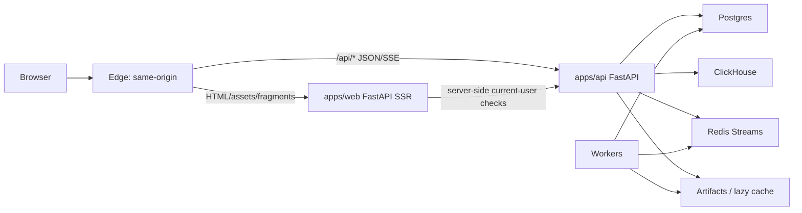
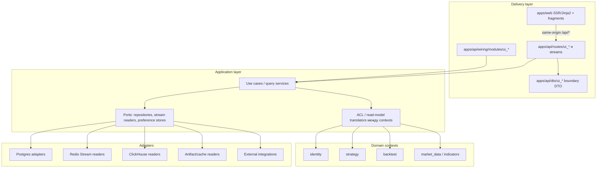
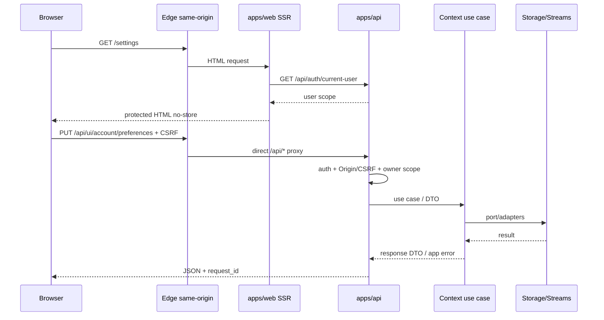
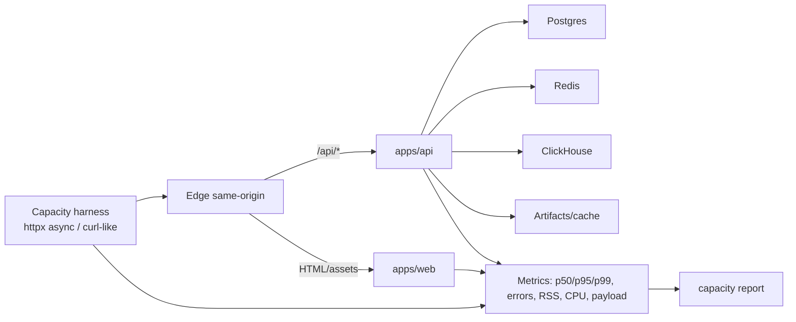
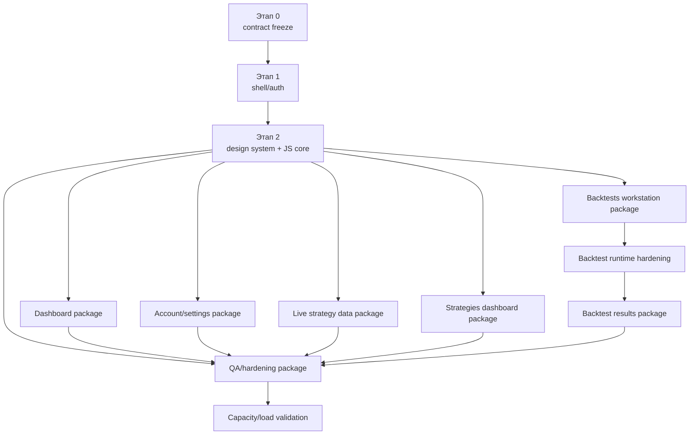
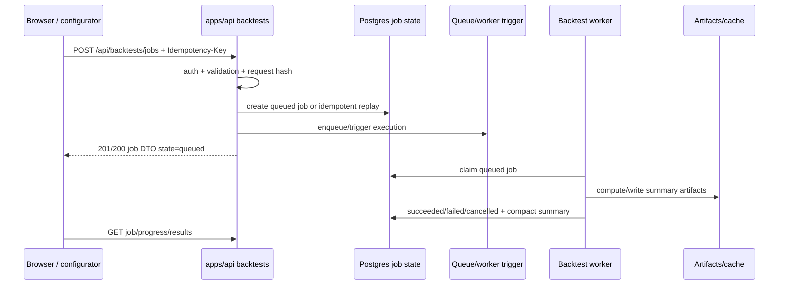

# План реализации Roehub Web UI + Backend v1

Документ фиксирует пошаговый план реализации новой версии Roehub Web UI и связанных backend read-model/API-расширений так, чтобы работу можно было безопасно распараллелить между агентами.

## Статус

- предлагаемый план реализации;
- дизайн-источник правды: `docs/architecture/apps/web/web-ui-design-manifest-v1.md`;
- исследовательский ввод: `docs/web-ui+backend-plan-deep-research.md`;
- текущая визуальная реализация `apps/web` заменяется полностью и не сохраняется как наследуемый режим;
- обновление 2026-05-04: функциональные страницы привязаны к canonical PNG-референсам через жесткий `reference fidelity contract`; текущие реализации после baseline commit `bae8bd88229ceec4736deee5d61ad178e1ab9060` считаются кандидатом на откат/замену, если не повторяют назначенный reference layout.
- обновление 2026-05-05: login реализуется как branded modal, registration остается отдельной страницей, все dropdown/listbox/menu controls должны быть фирменными, а live-data страницы получают explicit data-source/refresh/autorefresh/rate-limit contracts.
- актуальная canonical map Web UI v1 содержит ровно 5 визуальных страниц: `/`, `/dashboard`, `/settings`, `/strategies`, `/backtests`.

## Цель

Построить новый сайт и защищенный UI приложения поверх существующих backend-контекстов Roehub:

- сначала базовый каркас: skeleton, вкладки шапки, точки входа авторизации/регистрации;
- весь UI мультиязычный: основной язык `en`, дополнительный `ru`, переключение языка доступно из shell/settings;
- затем отдельный план реализации для каждой страницы;
- для каждой страницы явно указать backend API, состав UI, пользовательский функционал, затрагиваемые файлы, критерии приемки и Playwright CLI-проверки;
- для функциональных страниц реализация обязана быть `reference-shaped`, а не "inspired by";
- backend-логика остается в backend API/application services, не в `apps/web`;
- после базовых этапов агенты могут работать параллельно с непересекающимися зонами записи.

## Контекст

Факты текущего репозитория:

- `apps/web` - FastAPI SSR/Jinja2-приложение с login gate через `/api/auth/current-user`, защищенными страницами и static mount `/assets`.
- Текущие шаблоны лежат top-level файлами, текущие ассеты - `apps/web/dist/site.css`, `strategy_ui.js`, `backtest_ui.js`.
- Текущий `base.html` грузит HTMX из CDN, а login/logout-шаблоны используют встроенный JavaScript.
- Production routing должен оставаться same-origin на edge: HTML/assets идут в web, `/api/*` идет напрямую в backend. Встроенный web-proxy `/api/*` остается local/dev parity-путем, а не production-целью.
- Backend уже предоставляет auth/current-user, exchange keys, strategy CRUD/run/stop, справочники market-data, indicators и backtest jobs API.
- Backtest jobs API уже использует терминологию `jobs`, публично читаемый `variant_key`, summary-only top rows и lazy trades endpoint.
- Strategy runtime уже имеет Redis Streams realtime output primitives; для UI не хватает browser-facing read-model/SSE-моста.

Факты по текущему хранению данных на момент обновления 2026-05-05:

- `migrations/postgres/0001-0005` покрывают identity/users, Keycloak session bridge и encrypted/masked exchange keys; в этой цепочке пока нет `identity_user_preferences`, `identity_audit_events`, `identity_integrations` и persistent autorefresh defaults.
- `alembic/versions/20260215_0001` и `20260216_0002` покрывают `strategy_strategies`, `strategy_runs`, `strategy_events` и `strategy_runs.metadata_json`; этого достаточно для immutable strategy specs/run metadata/events, но недостаточно для полноценного online portfolio dashboard: нет typed positions, fills/executions, equity/PnL time series, symbol allocation snapshots, per-strategy/hour/month aggregates.
- `alembic/versions/20260222_0003` ... `20260418_0009` покрывают `backtest_jobs`, `backtest_job_top_variants`, shortlist/runtime metadata и persisted-run summary columns; этого достаточно для bounded jobs/history/top-variant surfaces, но presets и UI workstation state еще не имеют отдельной таблицы.
- `migrations/clickhouse/market_data_ddl.sql` покрывает `market_data.ref_market`, `ref_instruments`, raw/canonical 1m candles и stats; это источник market/instrument/candle reference, но не источник account portfolio, exchange balances, live positions или strategy PnL snapshots.
- Redis streams существуют как runtime/live transport для market-data и strategy output, но для браузера нужен explicit read-model/SSE bridge с owner scope, freshness/degraded states и rate limits.

Следствие: implementation-агенты не должны "добивать" панели synthetic production data. Если текущая БД/stream не поддерживает требуемую панель из референса, этап обязан добавить migration/read-model/port или сохранить панель с typed `unavailable/degraded/stale` state и задокументировать backend gap.

## Нотация API-путей

В этом документе пути вида `/api/...` описывают **browser-visible same-origin contract**. Это путь, который видит браузер на `roehub.com` или локально через `apps/web`.

Фактическая регистрация маршрутов в `apps/api/routes/*` остается без префикса `/api`, если этап явно не меняет edge contract:

- browser `/api/auth/current-user` -> backend API `/auth/current-user`;
- browser `/api/backtests/jobs` -> backend API `/backtests/jobs`;
- browser `/api/ui/dashboard/summary` -> backend API `/ui/dashboard/summary`;
- browser `/api/stream/strategies` -> backend API `/stream/strategies`.

Причина: production `Caddy handle_path /api/*` и локальный `apps/web` proxy оба снимают `/api` перед upstream API. Implementation-агенты не должны добавлять второй `/api` prefix внутри FastAPI router. Если этот edge/proxy contract меняется, нужно обновить `docs/runbooks/web-ui-gateway-same-origin.md`, `infra/caddy/Caddyfile.vps`, web proxy tests и smoke-проверки public edge.

## Auth UX contract

Web UI v1 различает login и registration:

- login - не отдельная основная страница. Кнопка `Login` / `Войти` открывает branded modal/dialog поверх текущей страницы или shell.
- Login modal использует общий терминальный UI: темная surface, тонкая рамка, focus trap, accessible close, i18n copy, sanitized `next` и primary action для существующего Keycloak/OIDC flow через browser-visible `/api/auth/login`.
- Прямой `GET /login?next=...` остается compatibility/deep-link entrypoint: он должен отрендерить shell/landing с открытым login modal или выполнить контролируемый redirect к состоянию с открытым modal. Он не является самостоятельной визуальной страницей v1.
- При `401` во время polling/SSE/JSON refresh client останавливает live loops и показывает login modal/banner; нельзя оставлять бесконечный spinner или native browser prompt.
- Registration - отдельная страница `GET /register`. Она может вести в Keycloak-backed registration/get-started flow, но не реализует локальную username/password регистрацию в Roehub web.
- `next` для login/register всегда sanitizes to safe local path; external URL запрещены.

## Branded controls contract

Все выпадающие интерфейсы в новом Web UI должны быть фирменными, а не системными popup-меню браузера или OS. Это касается theme/language/account menus, filters/sort, strategy selectors, backtest config selects, risk/ranking/order dropdowns и autorefresh interval menus.

Правила:

- видимый native `<select>` с системным серым dropdown считается introduced visual failure для функциональных страниц;
- native `<select>` допустим только как hidden/progressive fallback, если видимый control - Roehub branded combobox/listbox/menu;
- shared implementation принадлежит Stage 2: `apps/web/dist/js/components/*`, `apps/web/templates/components/*`, `apps/web/dist/css/components.css`;
- компонент обязан поддерживать keyboard navigation (`Tab`, `Esc`, arrows, `Enter`/`Space`), visible focus, ARIA role (`menu`, `listbox` или `combobox`) и typeahead там, где список длинный;
- popover должен рендериться в controlled overlay layer, не обрезаться panel overflow и не выходить за viewport;
- mobile может использовать branded drawer/sheet, но не OS-native picker как основной acceptance path;
- Playwright evidence для stages с новыми dropdown/listbox controls должно включать открытый branded menu/popover.

## Охват

- замена маршрутов, шаблонов и ассетов `apps/web`;
- UI-kit на design-токенах и переключатель темы;
- i18n foundation: `en` default, `ru` secondary, language switcher, locale preference/fallback;
- каркас с auth/register/header;
- лендинг, dashboard всех стратегий, settings, dashboard конкретной стратегии и backtest workstation;
- backend API read-model-расширения под same-origin `/api/*`;
- SSE/polling helpers для live UI;
- Playwright CLI-приемка для каждой реализованной страницы;
- reference fidelity evidence для каждой функциональной страницы;
- обновление docs index.

## Что не входит

- миграция на React/Next/full SPA;
- отдельный Node.js frontend-сервер;
- сохранение текущего светлого UI как наследуемого режима;
- перенос production-трафика `/api/*` через FastAPI web;
- хранение полных сделок в `backtest_job_top_variants.trades_json`;
- вычисление backtest-задач в web-слое;
- breaking changes публичного API, если этап явно не содержит migration notes;
- прямой запуск job AI-ассистентом без подтверждения пользователя;
- темы, меняющие семантику финансовых цветов для доходности и процентных изменений.
- локализация URL-маршрутов, `/api/*` paths, DTO fields, enum values, `job_id`, `variant_key`, market symbols и других технических identifiers.
- destructive откат к baseline commit без отдельного явного запроса; этот документ фиксирует baseline, но не разрешает `git reset`.

## Reference fidelity contract и карта страниц

Для функциональных страниц часть после глобальной шапки сайта должна повторять назначенный PNG-референс по структуре, плотности, сетке панелей, таблицам, графикам, command bar и status bar. Референс является визуальным контрактом, а не настроением. Допускаются только контролируемые отклонения: бренд `Roehub` вместо `QUANT CLI`, `en`/`ru` copy, реальные данные вместо демо-значений, responsive collapse на mobile и typed degraded/unavailable panels вместо отсутствующих backend-данных.

Canonical page map:

| Route | Canonical reference | Смысл | Статус реализации |
|---|---|---|---|
| `/` | `/Users/daniildegtyarev/Projects/roehub_web_ui/general_page.png` | public landing | этим обновлением не пересматривается. |
| `/dashboard` | `/Users/daniildegtyarev/Projects/roehub_web_ui/personal_dashboard.png` | dashboard по всем стратегиям | Stage 4 должен быть переписан как all-strategies workstation. |
| `/settings` | `/Users/daniildegtyarev/Projects/roehub_web_ui/personal_settings.png` | account/settings workstation | Stage 5 должен повторять панельный account layout. |
| `/strategies` | `/Users/daniildegtyarev/Projects/roehub_web_ui/strategy_statistic.png` | dashboard/statistics по конкретной выбранной стратегии | Stage 6 должен повторять analytics workstation layout. |
| `/backtests` | `/Users/daniildegtyarev/Projects/roehub_web_ui/stategy_backtest.png` | backtest workstation/configurator | Stage 8 должен реализовать единую рабочую поверхность, а не split на generic pages. |
| `/backtests/{job_id}` | нет canonical PNG в v1 map | optional deep link/API state | не является шестой функциональной страницей v1; если сохраняется, открывает `/backtests` с выбранной job/result state. |
| `/monitoring` | нет canonical PNG в v1 map | compatibility/ops route only | не забирает strategy reference; может быть redirect/alias после отдельного решения. |

В v1 не планируются отдельные visual pages для `/monitoring`, `/strategies/new`, `/strategies/{strategy_id}`, `/backtests/new` или `/backtests/{job_id}`. Эти entrypoints допустимы только как compatibility redirects/aliases или state внутри соответствующей canonical page.

Обязательства implementation-агента:

- открыть canonical PNG перед кодом и перечислить panel inventory в notes/final report;
- сохранить форму каждой панели из референса даже при `degraded/unavailable` data state;
- не заменять функциональную страницу generic card grid, overview cards или marketing layout;
- не выдумывать production-данные ради заполнения panel inventory;
- добавить Playwright desktop/mobile evidence и в final report отделить observed reference fidelity от inference;
- если canonical PNG отсутствует, остановиться с blocker, а не реализовывать страницу по памяти.

Rollback/baseline:

- baseline commit для пересборки UI pack: `bae8bd88229ceec4736deee5d61ad178e1ab9060`;
- если требуется физически откатить уже реализованный UI-код, использовать отдельный безопасный revert/publish workflow с проверками и Mac Studio sync;
- этот план и prompt pack должны считать post-baseline generic UI реализацией, которую можно заменять, но не должны выполнять destructive reset без отдельного явного задания.

## Целевая архитектура



Правила:

- `apps/web` рендерит только HTML-каркас и низкочастотные HTML-фрагменты.
- Browser JS вызывает same-origin `/api/*`.
- Backend API владеет JSON DTO, SSE streams, валидацией, persistence и доменной orchestration.
- Workers владеют долгими compute/realtime-процессами.
- HTMX используется для forms/fragments/tables, не для high-frequency live dashboard-ов.
- JS islands владеют charts, pollers, SSE, сложными формами и browser-local состоянием взаимодействия.

## Модель распараллеливания

Не распараллеливать реализацию страниц до приемки этапа 1 и этапа 2. После этого работу можно делить по page/API area.

Правила владения:

- Foundation-агент владеет `apps/web/main/app.py`, `apps/web/templates/base.html`, общими папками шаблонов и общими ассетами.
- Design-system-агент владеет `apps/web/dist/css/**`, общими macros/components, переключателем темы и страницами visual QA fixture.
- Settings-агент владеет account/settings-шаблонами и фрагментами, `identity` UI routes/read-models и тестами аккаунта.
- Strategies-dashboard агент владеет selected-strategy dashboard `/strategies`, strategy monitoring API/SSE-мостом, templates/assets и тестами стратегий.
- Backtests workstation агент владеет `/backtests` как единой reference-shaped рабочей поверхностью, presets, history table и интеграцией current jobs/preflight.
- Backtests results-агент владеет summary/chart/stats/paginated trades endpoints и selected result state внутри `/backtests`, без отдельной sixth page.
- Dashboard-агент владеет dashboard read-model endpoints и обзорной страницей.
- QA/hardening-агент владеет Playwright evidence, проверками CSP/CSRF/cache headers и drift docs index.

Агенты не должны переписывать modules другого агента, кроме заранее согласованных exports, router includes или shared helper interfaces.

## Целевая структура файлов

Web:

```text
apps/web/templates/
  base.html
  pages/
    landing.html
    logout.html
    register.html
    dashboard.html
    settings.html
    strategies.html
    backtests.html
  fragments/
    auth/
    account/
    dashboard/
    strategies/
    backtests/
  components/
    panel.html
    metric_card.html
    data_table.html
    empty_state.html
    error_state.html
  macros/
    ui.html
apps/web/locales/
  en.json
  ru.json
apps/web/main/
  i18n.py
```

Ассеты:

```text
apps/web/dist/
  css/
    tokens.css
    themes.css
    base.css
    layout.css
    components.css
    pages/
  js/
    core/
      api.js
      poller.js
      sse.js
      dom.js
      locale.js
      formatters.js
      notifications.js
      validators.js
      theme.js
    components/
    charts/
    pages/
  vendor/
```

## Мультиязычность и locale contract

Web UI v1 реализуется как мультиязычный продуктовый интерфейс.

Инварианты:

- supported locales: `en`, `ru`;
- default locale: `en`;
- `ru` является полным вторым языком для пользовательского UI-copy;
- routes, `/api/*`, DTO fields, enum values, strategy ids, market symbols, `job_id`, `variant_key`, config keys и metric identifiers не локализуются;
- `<html lang>` и root `data-locale` всегда соответствуют выбранному locale;
- каждый stage, добавляющий user-visible copy, обязан добавить `en` и `ru` строки в общий catalog/helper;
- отсутствующий перевод является introduced failure для stage, который добавил строку;
- длинные русские строки проверяются на desktop/mobile, чтобы не ломать header, buttons, table headers и status badges.

Resolution order:

1. authenticated `identity_user_preferences.locale`, когда backend preference доступен;
2. locale cookie, установленная language switcher-ом и доступная SSR до render;
3. browser `localStorage` как client-side fallback/hydration source;
4. `Accept-Language`, если пользователь еще не выбирал язык;
5. hard fallback `en`.

Target files:

- `apps/web/main/i18n.py` - planned SSR helper для locale resolution, translation lookup, missing-key fallback и `<html lang>`;
- `apps/web/locales/en.json`, `apps/web/locales/ru.json` - planned catalogs с одинаковыми ключами;
- `apps/web/dist/js/core/locale.js` - planned client helper для language switcher, cookie/localStorage sync и dynamic strings;
- `identity_user_preferences.locale` - planned persisted account preference на settings stage.

Browser-visible contract:

- language switcher доступен в shell рядом с account/auth controls, но не конкурирует с primary nav;
- переключение языка не меняет route path и не добавляет localized URL aliases;
- anonymous pages используют cookie/localStorage/Accept-Language fallback;
- authenticated pages используют backend preference, если она уже реализована;
- full reload после переключения допустим для SSR v1; controlled fragment refresh допустим только если он не ломает state и auth.

Backend-добавления:

```text
apps/api/routes/
  ui_account.py
  ui_dashboard.py
  ui_strategies_dashboard.py
  ui_backtests.py
  streams.py
apps/api/dto/
  ui_account.py
  ui_dashboard.py
  ui_strategies_dashboard.py
  ui_backtests.py
apps/api/wiring/modules/
  ui_account.py
  ui_dashboard.py
  ui_strategies_dashboard.py
  ui_backtests.py
  streams.py
```

Точные имена modules можно уточнять при реализации, но разделение должно оставаться по bounded capability, а не через generic `misc UI`.

## Инженерный контракт реализации

Этот раздел является обязательным для всех этапов. Он дополняет `.codex/AGENTS.md` и делает план пригодным для передачи нескольким агентам без потери архитектурных, контрактных и verification-требований.

Каждый агент в финальном отчете по этапу обязан указать:

- `Intent`: что реализовано и почему это нужно пользователю;
- `Scope`: какие bounded capability, routes, modules и файлы были затронуты;
- `Design`: какие use cases, DTO, ports/adapters, migrations, JS modules и template fragments добавлены или изменены;
- `Contract impact`: классификация `public API contract`, `port contract`, `DTO schema`, `persisted schema`, `config schema`, `request hash/cache key/persistence identity`, `browser-visible behavior`, `performance risk`;
- `Tests`: точные команды, рабочая директория и результат; отдельно focused tests, lint/type gates, migration tests;
- `Docs`: какие документы обновлены или почему обновление отложено;
- `Performance`: затронут ли verified hot path, какие payload/latency/RSS ограничения применялись, какие load/capacity checks выполнены;
- `Runtime evidence`: что проверено браузером/Playwright, что проверено тестами, что является только inference;
- `Risks`: оставшиеся edge cases, migration/rollback risks, pre-existing failures, environmental limitations;
- `Handoff`: какие exports, route includes, shared helpers или endpoint contracts должен использовать следующий агент.

Минимальная классификация gate failures:

- `introduced`: создано текущим изменением;
- `required-path pre-existing`: уже было, но блокирует нужный путь;
- `unrelated pre-existing`: вне scope текущего этапа;
- `environmental`: зависит от локальной среды, внешнего сервиса, данных или host state;
- `flaky`: воспроизводится нестабильно; нужен повтор с тем же SHA/config.

Агент не имеет права заявлять, что browser-visible behavior работает, если он не проверил его через Playwright CLI или явно не пометил утверждение как inference.

## Направление зависимостей и DDD-контракт

Backend-добавления для UI реализуются как тонкие delivery slices поверх существующих bounded contexts. Router не содержит бизнес-правил, web не содержит domain orchestration, а новые read-models не импортируют private domain internals другого контекста без translation layer.



Правила реализации:

- `apps/api/routes/*` валидируют транспорт, авторизацию, статусы и маппинг ошибок; бизнес-решения не живут в router.
- `apps/api/dto/*` описывает публичный payload; ORM/domain entities не сериализуются напрямую.
- Application/query services владеют orchestration, pagination, ownership checks, fallback/degradation и read-model assembly.
- Ports описывают зависимости от storage, Redis Streams, ClickHouse, artifacts и external integrations. В новых production-facing slices предпочтителен `typing.Protocol`.
- Adapters реализуют ports и переводят infrastructure exceptions в application errors.
- Cross-context DTO собирается через explicit mapper/ACL. Например, dashboard не должен импортировать внутренние strategy/backtest entities ради удобства.
- Web templates получают только view model для first paint; дальнейшие JSON/SSE данные идут из backend API.
- Shared helper допускается только для stable primitives, formatters, errors или small cross-cutting contracts; нельзя создавать generic `misc UI service`.

## API-контракт и модель ошибок

Каждый новый endpoint в implementation prompt должен иметь краткую спецификацию до начала кода:

| Поле | Требование |
|---|---|
| `method/path` | Полный путь, query params, path params, auth requirement. |
| `owner scope` | Как определяется текущий user/account и как проверяется доступ к ресурсу. |
| `request DTO` | Required/optional поля, defaults, validation, idempotency key, size limits. |
| `response DTO` | Shape, nullable fields, enum values, links, timestamps, pagination. |
| `status codes` | `200`, `201`, `204`, `400`, `401`, `403`, `404`, `409`, `422`, `429`, `500/503` semantics. |
| `error payload` | Stable error code, message, field errors, retryability, correlation/request id. |
| `pagination` | Cursor/keyset/page semantics, limits, max page size, stable ordering. |
| `cache identity` | Request hash/cache key impact или explicit `none`. |
| `compatibility` | `none`, `compatible-change`, `breaking-change`, `unknown`; migration/deprecation notes. |

Базовый error envelope должен оставаться совместимым с текущим `RoehubError` contract:

```json
{
  "error": {
    "code": "validation_error",
    "message": "Validation failed",
    "details": {
      "errors": [
        {
          "path": "body.time_range.start",
          "code": "value_error",
          "message": "must be before end"
        }
      ]
    }
  }
}
```

Новые `/api/ui/*` и UI-facing additions не должны вводить второй несовместимый error envelope. Если этап добавляет `request_id`, `retryable` или field-map helpers, это делается как additive extension к общему API error handler и документируется в `docs/architecture/api/api-errors-and-422-payload-v1.md`, а не реализуется локально только в одном router.

Статусные правила:

- `401`: пользователь не аутентифицирован; browser client должен остановить polling/SSE и отправить пользователя на login.
- `403`: пользователь аутентифицирован, но ресурс ему не принадлежит или действие запрещено; не раскрывать наличие чужого ресурса там, где это чувствительно.
- `404`: ресурс не найден в scope пользователя или публичный ключ варианта неизвестен.
- `409`: конфликт состояния или дубликат, который пользователь может исправить; duplicate exchange key и idempotency mismatch должны быть детерминированными.
- `422`: структурная или доменная validation error с field-level деталями.
- `429`: rate limit для live-control, AI и potentially expensive endpoints.
- `503`: backend dependency degraded; UI должен показать degraded panel, а не бесконечный spinner.

Pagination:

- cursor/keyset по умолчанию для history, audit, sessions, fills и больших списков;
- page/page_size допустимы для trades table, если storage/cache уже поддерживает стабильный total;
- default limit должен быть безопасным; max limit обязателен;
- ordering должен быть стабильным и документированным.

Idempotency:

- `POST /api/backtests/jobs` принимает `Idempotency-Key`; replay возвращает тот же job и не запускает новый compute;
- destructive actions должны быть safe-to-retry с точки зрения UX;
- AI endpoints не могут вызывать job creation напрямую.

## Схема хранения, миграции и rollback

Любая новая таблица или column является контрактом хранения. Миграция должна быть additive, rollback-able и owner-scoped.

Перед добавлением таблицы агент обязан определить владельца БД и миграционный канал:

- `identity_*` таблицы добавляются через SQL-файлы `migrations/postgres/0006_...sql` и bootstrap path identity DB, если они принадлежат identity/session/account scope;
- strategy/backtest/runtime tables добавляются через Alembic `alembic/versions/...py` и `apps.migrations.main`, если они принадлежат основной application DB;
- таблицу нельзя создавать в "удобной" БД только потому, что рядом уже есть похожий repository;
- если owner DB не очевиден, этап фиксирует `unknown` для persisted schema и не начинает migration до отдельного design decision.

Общие правила схемы:

- каждая user-owned таблица содержит `owner_user_id` или эквивалентный account scope;
- индексы обязаны покрывать основные query patterns (`owner_user_id`, `created_at`, cursor key, external id, active flag);
- timestamps хранятся в UTC;
- JSON columns допускаются для drafts/preferences, но required query fields выносятся в typed columns;
- secrets не хранятся в UI tables; exchange secret policy остается в identity/exchange-key контексте;
- soft-delete применяется там, где audit/recoverability важнее физического удаления;
- retention policy задается для audit/events/sessions/AI transcript-like data;
- default resolution должен быть deterministic: server default -> account preference -> browser local fallback -> hardcoded safe default.

Минимальные планируемые схемы:

| Таблица | Назначение | Ключи и индексы | Rollback/default |
|---|---|---|---|
| `identity_user_preferences` | UI theme, density, `locale` (`en`/`ru`) и другие account preferences | unique `owner_user_id`; check/validation `locale in ('en', 'ru')`; index `updated_at` | при rollback UI использует `terminal-orange`, locale cookie/localStorage и fallback `en`; таблицу можно оставить unused. |
| `identity_integrations` | non-secret integration toggles/config refs | `owner_user_id`, `provider`, `enabled` | disable-on-read fallback; secrets отдельно. |
| `identity_audit_events` | account/settings/security/live-control audit | `owner_user_id`, `created_at`, `event_type` | append-only; rollback к read-only ignored events. |
| `identity_user_profile_overrides` | optional display/profile overrides | unique `owner_user_id` | fallback на `current-user` claims. |
| `backtest_presets` | safe request drafts для configurator | `owner_user_id`, `created_at`, `name`, optional `request_hash` | configurator продолжает работать без presets. |

Чеклист миграции:

- forward migration additive and nullable-safe;
- application code tolerates table absence only during explicit transitional rollout, otherwise fail fast;
- downgrade/rollback documented before merge;
- owner scope tested;
- duplicate/unique constraints tested;
- default-read behavior tested;
- docs index updated when architecture/persistence contract changes.

## Источники данных, refresh/autorefresh и лимиты бирж

`/dashboard` и `/strategies` отображают текущее online-состояние портфеля стратегий. Браузер никогда не ходит напрямую к биржам: все данные приходят через backend read-models, Redis/DB/cache adapters и same-origin `/api/*`.

Стандартный refresh contract для live-data страниц:

- каждая workstation имеет ручной `Refresh` action;
- autorefresh имеет шаблоны `off`, `10s`, `15s`, `30s`, `1m`, `5m`;
- custom interval допускается только с server-side validation: минимальный безопасный интервал по умолчанию `10s` для cached/internal read-model refresh и `30s` для exchange-bound upstream refresh, если конкретный adapter не задает более строгий лимит;
- UI не запускает overlapping refresh requests; `poller.js` должен иметь no-overlap, hidden-tab pause и backoff;
- каждый response содержит `generated_at`, `sources[]`, `refresh_status`, `next_allowed_refresh_at` или equivalent fields, если данные live/stale/degraded;
- manual refresh не гарантирует немедленный запрос к бирже: backend может вернуть fresh cached snapshot, coalesced refresh, queued refresh или `429` с `retry_after_seconds`;
- backend применяет per-user/per-account и per-exchange token-bucket или эквивалентный limiter для exchange-bound refresh;
- если exchange/API limit исчерпан, UI показывает typed degraded/stale state и `retry_after`, а не маскирует проблему.

Источник данных по страницам:

| Page | Основные источники сейчас | Планируемые gaps / additions | Refresh behavior |
|---|---|---|---|
| `/` | статический SSR/landing copy; auth CTA only | нет backend dependency на first render | no autorefresh. |
| `/dashboard` | `strategy_strategies`, `strategy_runs`, `strategy_events`, backtest jobs summaries, Redis strategy output, market-data refs | `strategy_portfolio_snapshots`, `strategy_position_snapshots`, `strategy_execution_fills`, `strategy_equity_points`, `strategy_symbol_allocations`, exchange/account balance snapshots или typed degraded panels | manual refresh + autorefresh; один summary endpoint заполняет panels; upstream exchange refresh coalesced/rate-limited. |
| `/settings` | current-user, `identity_sessions`, `identity_exchange_keys` | `identity_user_preferences`, `identity_integrations`, `identity_audit_events`, optional profile overrides; хранение default refresh/autorefresh preferences | refresh для account panels; no exchange secret leakage; preferences save writes audit event. |
| `/strategies` | `strategy_strategies`, `strategy_runs`, `strategy_events`, Redis output, ClickHouse candles/reference | typed positions/fills/equity/monthly/hourly/symbol stats read-models или materialized projections; selected-strategy live snapshot | manual refresh + autorefresh; SSE preferred for live deltas, polling fallback bounded. |
| `/backtests` | `backtest_jobs`, `backtest_job_top_variants`, shortlist metadata, artifacts/lazy cache, market-data refs, indicators | `backtest_presets`, optional job events, workstation counters | manual refresh + optional autorefresh для jobs/progress; create/preflight остается controlled low-rate. |

Планируемые persistence/read-model additions:

| Таблица/read-model | Owner DB | Назначение | Индексы/лимиты |
|---|---|---|---|
| `identity_user_preferences` | identity SQL migrations | theme, locale, density, default autorefresh preset/custom interval | unique `owner_user_id`, `updated_at`, checks locale/theme/interval. |
| `identity_audit_events` | identity SQL migrations | settings/security/live-control/refresh policy audit | `owner_user_id`, `created_at DESC`, `event_type`; retention policy. |
| `identity_integrations` | identity SQL migrations | non-secret integration toggles/config refs | `owner_user_id`, `provider`, `enabled`; secrets stay outside UI tables. |
| `strategy_portfolio_snapshots` | main Alembic DB | account-level totals, equity, realized/unrealized PnL, exposure, source freshness | `user_id`, `as_of DESC`; bounded latest read. |
| `strategy_position_snapshots` | main Alembic DB | open positions for dashboard/strategy panels | `user_id`, `strategy_id`, `as_of DESC`, `symbol`; latest-only or retention window. |
| `strategy_execution_fills` | main Alembic DB | recent executions/fills and realized PnL | `user_id`, `strategy_id`, `ts DESC`, cursor key; retention/window. |
| `strategy_equity_points` | main Alembic DB or ClickHouse projection | equity/PnL chart series per account/strategy | `user_id`, `strategy_id`, `ts`; server downsampling required. |
| `strategy_symbol_allocations` | main Alembic DB or derived read-model | symbol allocation/PnL bars | `user_id`, `strategy_id`, `as_of DESC`; can be derived from positions/fills if cheap. |
| `backtest_presets` | main Alembic DB unless separate decision | safe request drafts for `/backtests` configurator | `owner_user_id`, `created_at DESC`, `name`, optional `request_hash`. |

Implementation stages may choose a simpler derived read-model if it is bounded and measured, but they must not perform unbounded per-request aggregation over full event/history tables for first paint.

Exchange/API limit contract:

- exchange adapters own concrete upstream limits; UI stages only set product-level minimum intervals and request coalescing;
- manual refresh can request a fresh snapshot but backend may serve cached data when `next_allowed_refresh_at` is in the future;
- refresh responses include source freshness so users see whether data is fresh, stale, degraded, or blocked by rate limit;
- tests cover `429`/`retry_after_seconds`, no-overlap polling and hidden-tab pause; load stage covers refresh storm/coalescing.

## Security и граница доверия

Security является частью каждого этапа, а не только финального hardening.



Обязательные правила:

- все state-changing browser calls защищены Origin/Referer validation и выбранной CSRF strategy до public rollout;
- конкретная CSRF strategy должна быть выбрана и зафиксирована до начала этапов, которые добавляют `PUT`, `POST`, `PATCH` или `DELETE` browser calls; до этого page-агенты могут реализовывать только read-only flows или использовать уже существующие защищенные endpoints без расширения mutation surface;
- cookies: `HttpOnly`, `Secure`, `SameSite=Lax` или более строгий эквивалент, если текущий identity flow позволяет;
- per-route authorization и owner scope обязательны для `/api/ui/*`, streams, settings, jobs, presets, trades, CSV export;
- SSE читает только события текущего пользователя/account; `last_event_id` не должен позволять читать чужой stream;
- destructive actions требуют confirm UI и audit event;
- live-control actions (`run`, `stop`, future trading controls) требуют rate limit и idempotency/retry semantics;
- exchange secrets never appear в response DTO, HTML, JS state, logs, screenshots или Playwright artifacts;
- AI prompt/session data не получают secrets, API keys, session cookies или raw private audit logs;
- CSP target после foundation: `default-src 'self'; script-src 'self'; style-src 'self'; img-src 'self' data:; connect-src 'self'; object-src 'none'; frame-ancestors 'none'; base-uri 'self'; form-action 'self'`.

## Observability и режимы отказа

Новые UI-facing endpoints должны быть operable на текущем host и при деградации зависимостей.

Минимальные observability-требования:

- переиспользовать существующие Prometheus HTTP metrics (`http_requests_total`, `http_request_duration_seconds`, `http_requests_in_progress`) и добавлять новые метрики только как additive labels/series без взрыва cardinality;
- каждый request имеет `request_id`/correlation id в logs и error DTO;
- если `request_id` еще не существует в API middleware, его добавление является отдельным compatible API-wide изменением в общем middleware/error handler; page-router не должен изобретать локальный request id contract;
- web proxy и edge должны сохранять или пробрасывать `X-Request-ID`/correlation header, если он выбран;
- boundary logs structured и не содержат secrets;
- метрики: request count, status count, p50/p95 latency, payload size bucket, active SSE connections, SSE reconnects, polling errors, dependency failure count;
- для dashboard/strategies/backtests/results отдельно считать degraded panel count и dependency name;
- для backtest jobs считать create latency, queue wait, running duration, cancel latency, lazy detail materialization time;
- для load tests фиксировать CPU/RSS, DB pool wait, Redis latency и error rate.

Режимы отказа:

| Область | Failure mode | UI behavior | Backend behavior |
|---|---|---|---|
| Auth | `401` во время polling/SSE | остановить live loops, redirect/login banner | stable 401 без stack traces |
| Authorization | чужой ресурс | 403/404 без утечки деталей | owner scope до read/stream |
| Dashboard | один источник недоступен | degraded panel, остальные panels работают | partial DTO или typed degraded source |
| Strategy live SSE | network drop | reconnect 2s/5s/15s, затем polling fallback | read-only stream, bounded connections |
| Backtest results | lazy detail cache miss | loading state, bounded materialization | no full payload in top rows |
| CSV export | large export | отдельный download flow | streaming/file route, rate limit |
| AI | provider timeout | draft not applied, deterministic error | cancellation, redaction, rate limit |

## Backend quality gates и порядок проверок

Каждый этап должен начинаться с focused gates и расширяться только при риске или изменении shared contracts.

Общий порядок:

1. focused `uv run pytest -q <tests for touched behavior>`;
2. focused `uv run ruff check <touched python paths>` для Python paths;
3. `uv run pyright` при изменении DTO, ports, application services, routes или wiring;
4. migration tests / repository tests при изменении persisted schema;
5. related web route tests при изменении templates/routes;
6. broader `uv run pytest -q` только для финального hardening, shared contract changes или перед publish.

Prompt каждого этапа должен явно указать:

- какие тесты добавить или обновить;
- какой focused gate является минимальным acceptance;
- какие failures классифицируются как introduced vs pre-existing;
- какие browser checks обязательны и почему backend tests не заменяют их.

Минимальные классы тестов по зонам:

| Зона | Tests |
|---|---|
| Web shell/auth | route smoke, protected redirect, next sanitization, no inline script smoke. |
| JS core | если JS unit runner не вводится, добавить browser/Playwright flow для 401/422/abort/backoff; Python tests проверяют asset references. |
| Account/settings | route tests, DTO validation, owner scope, duplicate 409, audit event write, preferences default resolution. |
| Strategy dashboard/live bridge | route tests, stream auth, Redis reader adapter tests, fallback DTO, start/stop state reflection, missing-reference blocker. |
| Backtests workstation | preflight invalid/valid, idempotency key, cancel idempotency, presets persistence, request hash unchanged, reference panel inventory. |
| Backtests results | variant 404, downsampling bounds, paginated trades, CSV auth/ownership, no full trades in top rows. |
| Migrations | upgrade/downgrade or equivalent migration smoke, indexes/unique constraints, default-read behavior. |

## Browser runtime evidence

Для каждого browser-visible этапа требуется Playwright CLI evidence:

- desktop screenshot: обычно `1440x1000`;
- mobile screenshot: около `390x844`;
- `snapshot` после ключевого состояния;
- console errors отсутствуют;
- failed same-origin network requests отсутствуют, кроме ожидаемых auth redirects;
- auth state и protected route behavior проверены;
- theme switcher меняет `base/accent/state`, но не financial colors;
- primary workflow выполнен без overlapping requests;
- для chart/canvas страниц выполнена nonblank canvas/SVG проверка;
- отчет различает observed runtime evidence, test evidence, inference и assumptions.

Пример минимального блока:

```bash
export CODEX_HOME="${CODEX_HOME:-$HOME/.codex}"
export PWCLI="$CODEX_HOME/skills/playwright/scripts/playwright_cli.sh"
"$PWCLI" open http://127.0.0.1:8010/<route>
"$PWCLI" snapshot
"$PWCLI" screenshot --filename output/playwright/<stage>-desktop.png
```

Если stage влияет на mobile layout или theme behavior, добавить отдельные команды/настройки viewport по Playwright skill и сохранить evidence в `output/playwright/`.

## Нагрузочное тестирование и оценка capacity

Цель: оценить потенциал текущего backend host как машины для Roehub UI/API и не внедрить UI, который хорошо выглядит локально, но перегружает 1 vCPU / 2 GB class host.

Нагрузочные проверки не заменяют функциональные tests. Они дают capacity evidence и классифицируют риск как `green`, `yellow` или `red`:

- `green`: p95 latency и error rate приемлемы, RSS стабилен, CPU не держится в saturation;
- `yellow`: работает, но есть явный bottleneck или малый запас; нужен mitigation перед ростом traffic;
- `red`: endpoint/workflow не готов к public rollout на текущем host.



Рекомендуемый harness:

- не добавлять Node toolchain ради load tests;
- если в repo нет готового инструмента, реализовать `tools/load/web_capacity_smoke.py` на стандартном Python + уже доступном `httpx`;
- сценарии должны быть read-mostly по умолчанию; destructive flows запускаются только в isolated test account;
- каждый запуск фиксирует commit, branch, host, config, dataset/fixtures, warmup, concurrency, duration, cold/warm mode.

Обязательные load/capacity сценарии:

| Этап / область | Сценарий | Минимальная нагрузка | Что измерить |
|---|---|---|---|
| Shell/assets | anonymous `/`, protected redirect, static assets | 30-60s, concurrency 10-25 | p95 HTML latency, asset cache hit, web RSS. |
| Dashboard summary | `GET /api/ui/dashboard/summary` | 30-60s, concurrency 5-20 | p95, payload size, dependency fan-out, degraded source count. |
| Settings | preferences/profile/audit read, exchange-key list | 30s, concurrency 5-10 | auth overhead, DB latency, no secret leakage. |
| Strategies dashboard/live | selected snapshot + strategy list/SSE | 60s, concurrency 10 plus 1-5 SSE clients | Redis/DB fan-out, active SSE connections, reconnects. |
| Backtests workstation | `GET /api/ui/backtests/workstation` + cursor job table | 60s, concurrency 10-20 | cursor stability, DB indexes, payload size, p95. |
| Backtests results | summary/equity/drawdown/monthly/trades page | 60s, concurrency 5-15 | artifact/cache IO, chart downsampling cost, no full trades payload. |
| Paginated trades | `GET /trades?page=&page_size=50/100` | 60s, concurrency 5-10 | page latency, memory, cache materialization misses. |
| Backtest create/preflight | valid/invalid preflight, idempotent create | controlled low rate | no API-process compute saturation; queued/background behavior. |

Приемка оценки текущего host:

- report включает host class, process counts, env profile, DB/Redis locality и cache state;
- endpoint, используемый для first paint, не передает unbounded data;
- polling/SSE loops не накладывают новые requests поверх еще не завершенных при повышенной latency;
- SSE connection count ограничен и проходит reconnect test;
- p95 и RSS trends записаны даже если hard threshold еще не задан;
- если сценарий получает статус `yellow` или `red`, владелец этапа фиксирует mitigation до public rollout.

## Пакеты работ для параллельных агентов

После приемки этапов 1-2 работа делится на disjoint write sets. Каждый package prompt должен включать dependencies, owned files, forbidden files, integration points и handoff.



Шаблон package:

| Поле | Содержание |
|---|---|
| `depends_on` | Этапы и packages, которые должны быть accepted. |
| `owns` | Точные файлы/папки, где агент может писать. |
| `forbidden` | Файлы/папки других агентов; изменения только через согласованный integration point. |
| `integration points` | Router include, DTO export, macro name, JS core API, CSS class/token, migration dependency. |
| `contracts` | Endpoint specs, DTO shapes, errors, persistence, browser defaults. |
| `gates` | Focused tests, ruff/pyright, Playwright, load smoke if relevant. |
| `handoff` | Что следующий агент может считать stable. |

Правила merge/order:

- shared foundation merges first;
- page packages do not edit each other's CSS/JS/page templates;
- changes to `apps/api/main/app.py`, route includes and shared DTO exports should be small and reviewed at integration boundaries;
- migration packages cannot run in parallel if they edit same migration chain or same table;
- QA/hardening package can patch shared shell/security only after page packages expose their route contracts.

## Этап 0 - фиксация контрактов и границы cleanup

Цель: зафиксировать scope до старта implementation-агентов.

Задачи:

- Считать `docs/architecture/apps/web/web-ui-design-manifest-v1.md` визуальным источником правды.
- Считать этот документ источником правды по исполнению.
- Подтвердить, что светлый наследуемый UI-режим не остается.
- Проинвентаризировать текущие web-файлы и пометить каждый как replace, move или delete.
- Зафиксировать route map и endpoint map до начала работ над страницами.

Основные файлы:

- `apps/web/main/app.py`;
- `apps/web/templates/*.html`;
- `apps/web/dist/site.css`;
- `apps/web/dist/strategy_ui.js`;
- `apps/web/dist/backtest_ui.js`;
- `tests/unit/apps/web/test_app_routes.py`.

Текущая route map и целевые решения:

| Текущий route/static surface | Текущий шаблон/поведение | Решение | Handoff для этапов |
|---|---|---:|---|
| `GET /` | `landing.html`, public landing | `replace` | Этап 1 сохраняет public entrypoint, этап 3 заменяет содержимое на `apps/web/templates/pages/landing.html`. |
| `GET /favicon.ico` | `204`, чтобы убрать browser 404 noise | `replace` | Инвариант "favicon не дает incidental 404" сохраняется; позже можно заменить на static/versioned asset. |
| `GET /login` | `login.html`, inline JS redirect на `/api/auth/login` | `replace` | Этап 1 сохраняет compatibility entrypoint, но целевой UX - branded login modal; direct `/login` открывает modal state, а не standalone page. |
| `GET /logout` | `logout.html`, inline JS `POST /api/auth/logout` | `replace` | Этап 1 сохраняет logout entrypoint, но убирает inline script. |
| `ANY /api/{upstream_path:path}` | local/dev same-origin proxy, снимает `/api` перед upstream | `move` | `/api/... browser-visible` contract сохраняется для browser/dev parity; backend routers остаются без второго `/api` prefix. |
| `MOUNT /assets/*` | flat `apps/web/dist/*` | `move` | Browser-visible `/assets/*` сохраняется; внутренняя раскладка переезжает в `css/`, `js/`, `vendor/`. |
| `GET /strategies` | protected `strategies_list.html` | `replace` | Этап 1 регистрирует route, этап 6 заменяет страницу на `pages/strategies.html` и fragments. |
| `GET /strategies/new` | protected `strategy_builder.html` | `replace` | Этап 1 сохраняет entrypoint; этап 6 делает compatibility redirect/alias на `/strategies?mode=create` или create modal внутри `/strategies`. |
| `GET /strategies/{strategy_id}` | protected `strategy_details.html` | `replace` | Этап 1 регистрирует route, этап 6 делает compatibility redirect/alias на `/strategies?strategy_id=...`; отдельная visual page не создается. |
| `GET /backtests` | protected монолитный `backtests.html` | `replace` | Этап 8 заменяет current monolith на reference-shaped workstation; results state живет внутри `/backtests`. |
| `GET /_partial/user_badge` | HTMX partial route для текущего header badge | `delete` | Не является stable public route; этап 1 переносит badge в shell component/fragment или server-rendered context. |

Текущие шаблоны и ассеты:

| Current file | Target decision | Целевое владение |
|---|---:|---|
| `apps/web/templates/base.html` | `replace` | Этап 1: terminal shell, self-hosted HTMX, no legacy light skin. |
| `apps/web/templates/landing.html` | `replace` | Этап 3: `apps/web/templates/pages/landing.html`. |
| `apps/web/templates/login.html` | `replace` | Этап 1: `fragments/auth/login_modal.html` или thin compatibility wrapper с modal pre-open; standalone full-page login не является целевым UX. |
| `apps/web/templates/logout.html` | `replace` | Этап 1: `apps/web/templates/pages/logout.html` или server redirect flow без inline JS. |
| `apps/web/templates/protected_page.html` | `delete` | Stage placeholders/pages заменяют этот generic skeleton; legacy skin не сохраняется. |
| `apps/web/templates/strategies_list.html` | `replace` | Этап 6: `pages/strategies.html` + `fragments/strategies/*`. |
| `apps/web/templates/strategy_builder.html` | `replace` | Этап 6: create workflow внутри `/strategies` или redirect, без отдельного page layout. |
| `apps/web/templates/strategy_details.html` | `replace` | Этап 6: compatibility redirect/alias на `/strategies?strategy_id=...`; отдельная `pages/strategy_detail.html` в v1 не является целевой страницей. |
| `apps/web/templates/backtests.html` | `replace` | Этап 8/9: `pages/backtests.html` + backtests fragments; отдельный `backtests_result.html` в v1 не является целевой страницей. |
| `apps/web/templates/partials/user_badge.html` | `move` | Этап 1: shell component/fragment; route `/_partial/user_badge` не переносится как public contract. |
| `apps/web/dist/site.css` | `replace` | Этап 2: `css/tokens.css`, `themes.css`, `base.css`, `layout.css`, `components.css`, `pages/*`; default palette `terminal-orange`. |
| `apps/web/dist/strategy_ui.js` | `replace` | Этап 2/6: `js/core/*`, `js/pages/strategies*`, strategy-specific helpers. |
| `apps/web/dist/backtest_ui.js` | `replace` | Этап 2/8/9: `js/core/*`, `js/pages/backtests*`, chart/poller helpers. |

Endpoint map freeze:

| Browser-visible method/path | Actual backend router path | Статус для следующих этапов |
|---|---|---|
| `GET /api/auth/login` | `GET /auth/login` | Existing auth entrypoint; этап 1 переиспользует. |
| `GET /api/auth/callback` | `GET /auth/callback` | Existing OIDC callback; этап 1 не реализует локальную callback-логику в web. |
| `POST /api/auth/logout` | `POST /auth/logout` | Existing auth entrypoint; этап 1 переиспользует. |
| `GET /api/auth/current-user` | `GET /auth/current-user` | Existing auth gate; protected web routes продолжают server-side проверку через него. |
| `GET /api/exchange-keys` | `GET /exchange-keys` | Existing settings/account API; этап 5 переиспользует. |
| `POST /api/exchange-keys` | `POST /exchange-keys` | Existing settings/account API; этап 5 переиспользует. |
| `DELETE /api/exchange-keys/{key_id}` | `DELETE /exchange-keys/{key_id}` | Existing settings/account API; этап 5 переиспользует. |
| `GET /api/strategies` | `GET /strategies` | Existing strategy list; этап 6 переиспользует. |
| `GET /api/strategies/{strategy_id}` | `GET /strategies/{strategy_id}` | Existing strategy details; этап 6 переиспользует. |
| `POST /api/strategies` | `POST /strategies` | Existing strategy create; этап 6 переиспользует. |
| `POST /api/strategies/clone` | `POST /strategies/clone` | Existing clone action; этап 6 переиспользует. |
| `POST /api/strategies/{strategy_id}/run` | `POST /strategies/{strategy_id}/run` | Existing run-control action; этап 7 переиспользует для monitoring/live control. |
| `POST /api/strategies/{strategy_id}/stop` | `POST /strategies/{strategy_id}/stop` | Existing run-control action; этап 7 переиспользует для monitoring/live control. |
| `DELETE /api/strategies/{strategy_id}` | `DELETE /strategies/{strategy_id}` | Existing delete action; этап 6 переиспользует с UX confirmation. |
| `GET /api/market-data/markets` | `GET /market-data/markets` | Existing reference data; stages 6/8 reuse. |
| `GET /api/market-data/instruments` | `GET /market-data/instruments` | Existing reference data; stages 6/8 reuse. |
| `GET /api/indicators` | `GET /indicators` | Existing indicator reference data; stages 6/8 reuse. |
| `GET /api/backtests/runtime-defaults` | `GET /backtests/runtime-defaults` | Existing backtest defaults; этап 8 переиспользует. |
| `POST /api/backtests/preflight` | `POST /backtests/preflight` | Existing preflight; этап 8 переиспользует. |
| `POST /api/backtests/jobs` | `POST /backtests/jobs` | Existing async job create; этап 8 считает authoritative. |
| `GET /api/backtests/jobs` | `GET /backtests/jobs` | Existing history/list; этап 8 переиспользует с cursor/limit contract. |
| `GET /api/backtests/jobs/{job_id}` | `GET /backtests/jobs/{job_id}` | Existing job read; stages 8/9 reuse. |
| `GET /api/backtests/jobs/{job_id}/top` | `GET /backtests/jobs/{job_id}/top` | Existing top variants summary; stages 8/9 reuse. |
| `GET /api/backtests/jobs/{job_id}/variants/{variant_key}` | `GET /backtests/jobs/{job_id}/variants/{variant_key}` | Existing variant details; этап 9 переиспользует. |
| `POST /api/backtests/jobs/{job_id}/variants/{variant_key}/trades` | `POST /backtests/jobs/{job_id}/variants/{variant_key}/trades` | Existing lazy trades detail; этап 9 переиспользует, не хранит full trades в top rows. |
| `POST /api/backtests/jobs/{job_id}/cancel` | `POST /backtests/jobs/{job_id}/cancel` | Existing cancel action; этап 8 переиспользует. |
| New `/api/ui/*` | New `/ui/*` | Additive endpoints only in owning stages; no duplicate backend `/api` prefix. |
| New `/api/stream/*` | New `/stream/*` | Additive SSE endpoints only in owning stages; edge/proxy contract unchanged. |

Handoff-инварианты для этапов 1-2:

- Целевая структура `apps/web/templates/pages|fragments|components|macros` и `apps/web/dist/css|js|vendor` выше является source of truth; старые top-level файлы являются только current inventory.
- Stage 1 может держать compatibility route paths, но не должен использовать старый `site.css`, `strategy_ui.js` или `backtest_ui.js` как визуальную или JS-основу.
- Stage 2 задает tokens/themes/core JS; default theme остается `terminal-orange`, а financial color semantics не меняются темами.
- Browser-visible API notation остается `/api/...`; actual backend router paths остаются без `/api`.
- Production edge split не меняется: HTML/assets обслуживает web, `/api/*` обслуживает backend через prefix stripping.
- `_partial/user_badge` не является публичным API; user badge переносится в shell context/component без обязательного HTMX route.
- Физически удалять старые templates/assets можно только в этапе, который уже заменил соответствующий route/page и обновил route tests.

Критерии приемки:

- у каждого текущего web-маршрута есть целевое решение;
- у каждого текущего top-level шаблона/ассета есть путь удаления или замены;
- ни один агент не начинает реализацию страницы, используя старый `site.css` как визуальную основу;
- docs index обновлен после добавления architecture docs.

Проверка:

```bash
python -m tools.docs.generate_docs_index
python -m tools.docs.generate_docs_index --check
```

Влияние на контракты:

- public API contract: `none` для этапа 0; следующие `/api/ui/*` и `/api/stream/*` остаются additive `compatible-change` в owning stages;
- port contract: `none`;
- DTO schema: `none`;
- persisted schema: `none`;
- config schema: `none`;
- request hash/cache identity: `none`;
- browser-visible behavior: `breaking-change` для текущего вида/компоновки UI, намеренно принято этим планом; `/api/... browser-visible` path contract сохраняется;
- performance risk: `none` для этапа 0, потому что runtime behavior не меняется.

## Этап 1 - каркас приложения, вкладки шапки, auth/register

Цель: создать новый skeleton: базовую компоновку, вкладки шапки, login modal, отдельную registration page и gate защищенных страниц.

Задачи:

- Заменить `base.html` на терминальный каркас с токенами дизайн-манифеста.
- Добавить route map в `apps/web/main/app.py`:
  - `/`;
  - `/login`;
  - `/logout`;
  - `/register`;
  - `/dashboard`;
  - `/settings`;
  - `/strategies`;
  - `/strategies/new`;
  - `/strategies/{strategy_id}`;
  - `/monitoring` только как compatibility route/redirect, если сохраняется;
  - `/backtests`;
  - `/backtests/new` только как compatibility route/redirect, если сохраняется;
  - `/backtests/{job_id}` только как compatibility deep link к `/backtests` selected job/result state, если сохраняется.
- Сохранить server-side проверку защищенного маршрута через `/api/auth/current-user`.
- Заменить inline JS для login/logout на внешний `apps/web/dist/js/pages/auth.js` или чистые серверные redirects там, где это возможно.
- Реализовать login как branded modal/dialog, а не как standalone visual page:
  - header `Login` открывает modal;
  - direct `/login?next=...` открывает shell/landing с modal pre-open;
  - primary modal action запускает `/api/auth/login` с safe `next`;
  - modal получает focus trap, `Esc` close и i18n copy.
- Self-host HTMX в `apps/web/dist/vendor/htmx.min.js`.
- Добавить route-level template contexts для активного состояния nav, title страницы и user badge.
- Добавить i18n foundation в shell:
  - default locale `en`;
  - secondary locale `ru`;
  - `<html lang>` и `data-locale`;
  - compact language switcher `EN/RU` рядом с auth/account controls;
  - locale cookie для SSR;
  - route/template context для `locale` и translation helper.
- Добавить `/register` как web entrypoint, запускающий Keycloak-backed registration/get-started flow.
- `/register` остается отдельной страницей с branded shell, i18n и CTA к Keycloak-backed registration.
- Не реализовывать локальную регистрацию username/password в Roehub web.

Backend/API:

- Текущий auth API сохраняется:
  - `GET /api/auth/login`;
  - `GET /api/auth/callback`;
  - `POST /api/auth/logout`;
  - `GET /api/auth/current-user`.
- Если Keycloak self-registration требует отдельный backend entrypoint, добавить его как совместимое auth-расширение в identity router, а не как обработку локальной web-формы.

Файлы:

- изменить `apps/web/main/app.py`;
- изменить `apps/web/templates/base.html`;
- заменить текущий `login.html` на `apps/web/templates/fragments/auth/login_modal.html` или equivalent modal fragment; `apps/web/templates/pages/login.html` допускается только как thin compatibility wrapper с modal pre-open;
- переместить/пересоздать `logout.html` в `apps/web/templates/pages/` или согласованные auth fragments;
- добавить/изменить `apps/web/templates/pages/register.html` как отдельную registration page;
- переместить/пересоздать текущий `partials/user_badge.html` как shell component/fragment без сохранения `/_partial/user_badge` как public route;
- добавить placeholder-шаблоны `apps/web/templates/pages/*.html`;
- добавить `apps/web/main/i18n.py`;
- добавить `apps/web/locales/en.json`, `apps/web/locales/ru.json`;
- добавить `apps/web/dist/css/tokens.css`, `themes.css`, `base.css`, `layout.css`;
- добавить `apps/web/dist/js/pages/auth.js`;
- обновить `tests/unit/apps/web/test_app_routes.py`;
- обновить `tests/unit/apps/web/test_security.py`.

Критерии приемки:

- anonymous `/` работает;
- защищенные страницы перенаправляют на `/login?next=<safe-local-path>`;
- внешний `next=https://...` санитизируется;
- шапка показывает вкладки и корректное активное состояние;
- login и logout не требуют inline scripts;
- login как основной flow открывается через branded modal; standalone full-page login считается invalid для v1 UX;
- прямой `/login?next=...` открывает modal state и сохраняет safe-local `next`;
- register CTA присутствует и ведет в выбранный Keycloak-backed entrypoint;
- `/register` является отдельной страницей и не замещается login modal;
- `/strategies/new` остается поддержанным entrypoint для создания стратегии или явно редиректит на новый create workflow;
- в базовом каркасе не остается внешнего CDN-скрипта.
- shell copy по умолчанию на английском, русская версия доступна через language switcher;
- переключение языка обновляет cookie/`<html lang>`/`data-locale` и не меняет route path;
- технические identifiers и `/api/*` paths не локализуются;
- locale catalogs `en`/`ru` имеют одинаковый набор ключей для строк Stage 1.

Playwright CLI:

```bash
export CODEX_HOME="${CODEX_HOME:-$HOME/.codex}"
export PWCLI="$CODEX_HOME/skills/playwright/scripts/playwright_cli.sh"
"$PWCLI" open http://127.0.0.1:8010/
"$PWCLI" snapshot
"$PWCLI" screenshot --filename output/playwright/shell-landing-desktop.png
"$PWCLI" open http://127.0.0.1:8010/settings
"$PWCLI" snapshot
```

Backend gates:

```bash
uv run pytest -q tests/unit/apps/web/test_app_routes.py tests/unit/apps/web/test_security.py
```

Влияние на контракты:

- public API contract: `compatible-change` только если добавляется registration auth entrypoint;
- browser-visible behavior: `breaking-change`, намеренная замена;
- config schema: `compatible-change`, если добавляются настройки asset version/CSP.

## Этап 2 - дизайн-система, темы и JS core

Цель: создать shared UI primitives, переключатель темы и JS core до того, как page-команды начнут строить реальные экраны.

Задачи:

- Реализовать CSS token-файлы из дизайн-манифеста.
- Зафиксировать `terminal-orange` как тему по умолчанию.
- Добавить `themes.css` минимум с `terminal-orange`, `graphite`, `matrix-green`, `high-contrast` как placeholders или полные блоки токенов.
- Реализовать `apps/web/dist/js/core/theme.js`:
  - читает начальную тему из backend preference, если она доступна;
  - затем использует `localStorage`;
  - затем использует `terminal-orange`;
  - применяет `data-theme` без перезагрузки страницы;
  - никогда не переписывает финансовые семантические классы.
- Реализовать `apps/web/dist/js/core/locale.js`:
  - читает/пишет locale cookie и `localStorage`;
  - поддерживает только `en` и `ru`;
  - fallback всегда `en`;
  - обновляет language switcher state;
  - не локализует routes/API identifiers;
  - предоставляет hook для dynamic strings и validation messages.
- Реализовать shared macros/components:
  - панель;
  - metric card;
  - status badge;
  - data table;
  - tabs;
  - empty/error state;
  - command bar;
  - modal shell;
  - branded dropdown/menu/listbox/combobox;
  - переключатель темы.
  - переключатель языка.
- Реализовать branded dropdown/popover foundation:
  - no visible native `<select>` для основного UX;
  - ARIA `menu`/`listbox`/`combobox` patterns;
  - keyboard navigation, typeahead, focus management, outside click/Esc close;
  - overlay layer, который не обрезается панелями и не выходит за viewport;
  - mobile drawer/sheet fallback в той же стилистике.
- Реализовать JS core:
  - `api.js` с `credentials: "include"`, timeout, abort, 401 redirect, mapping для 403/409/422;
  - CSRF/Origin integration point для state-changing requests, даже если конкретная server strategy включается на hardening stage;
  - `poller.js` с no-overlap polling, hidden-tab pause и backoff;
  - `refresh.js` или расширение `poller.js` для manual refresh/autorefresh controls, шаблонов интервалов и `retry_after_seconds`;
  - `sse.js` с EventSource wrapper и downgrade callback;
  - `notifications.js`, `formatters.js`, `validators.js`.
- Один раз принять решение по доставке иконок:
  - либо self-host небольшой Lucide-compatible icon path;
  - либо оставить текстовые controls, пока доставка иконок не станет явной.

Файлы:

- добавить `apps/web/templates/macros/ui.html`;
- добавить `apps/web/templates/components/*.html`;
- добавить `apps/web/dist/css/components.css`;
- добавить `apps/web/dist/css/themes.css`;
- добавить `apps/web/dist/js/core/*.js`;
- добавить `apps/web/dist/js/components/*.js`;
- обновить web unit smoke tests для asset paths, theme hooks и layout hooks.

Критерии приемки:

- shared components рендерятся без page-specific CSS;
- в новых шаблонах не остается зависимости от старого `site.css`;
- тема по умолчанию - `terminal-orange`;
- переключатель темы сразу обновляет `data-theme`;
- финансовые цвета для доходности и процентных изменений остаются фиксированными во всех темах;
- `api.js` детерминированно обрабатывает 401, 403, 409, 422 и timeout;
- mutation requests имеют единый extension point для CSRF token/header и не реализуют ad hoc защиту в page modules;
- `poller.js` не допускает overlapping requests;
- refresh/autorefresh helper поддерживает `off`, `10s`, `15s`, `30s`, `1m`, `5m`, custom interval validation hook, hidden-tab pause и server `retry_after_seconds`;
- branded dropdown/menu открывается в Playwright без системного native popup;
- hidden tab приостанавливает repeated polling в течение 5s;
- компоненты имеют accessible labels/focus states.
- language switcher доступен с клавиатуры, имеет accessible label и не ломает header на `en`/`ru`;
- shared components используют i18n keys/helper для пользовательских labels, empty/error states и button text.

Playwright CLI:

```bash
"$PWCLI" open http://127.0.0.1:8010/dashboard
"$PWCLI" snapshot
"$PWCLI" screenshot --filename output/playwright/ui-kit-dashboard-placeholder.png
```

Backend gates:

```bash
uv run pytest -q tests/unit/apps/web
```

Влияние на контракты:

- public API contract: `none`;
- browser-visible behavior: `breaking-change`, намеренная визуальная замена;
- persisted schema: `none`;
- config schema: `compatible-change`, если theme defaults становятся server config.

## Этап 3 - лендинг

Цель: построить публичный первый экран по `general_page.png`.

Маршрут страницы:

- `GET /`.

Frontend:

- Заменить текущий `landing.html` на `pages/landing.html`.
- Использовать карту платформы/продуктовую диаграмму как основной визуал.
- Держать первый viewport сфокусированным на ценности Roehub и CTA.
- Показывать намек на следующий раздел на desktop и mobile.
- Не добавлять API-зависимость для анонимного рендера.

Backend/API:

- для v1-лендинга ничего не требуется;
- опциональный server-side user badge может продолжать использовать current-user, только если это уже доступно без блокировки рендера.

Файлы:

- изменить `apps/web/templates/pages/landing.html`;
- добавить `apps/web/dist/css/pages/landing.css`;
- опционально добавить `apps/web/dist/js/pages/landing.js`.

Критерии приемки:

- `/` загружается анонимно без доступности API;
- в шапке видны действия auth/register;
- CTA-маршруты корректны;
- на mobile нет горизонтального overflow;
- декоративные blobs/gradients не заменяют продуктовую диаграмму;
- переключатель темы работает, если он видим в каркасе;
- default copy рендерится на `en`, переключатель языка показывает `ru` без локализации route.

Playwright CLI:

```bash
"$PWCLI" open http://127.0.0.1:8010/
"$PWCLI" snapshot
"$PWCLI" screenshot --filename output/playwright/landing-desktop.png
```

## Этап 4 - dashboard всех стратегий

Цель: реализовать `/dashboard` как terminal workstation по всем стратегиям строго по `personal_dashboard.png`, а не как набор обзорных карточек. Это главная защищенная рабочая поверхность fleet monitoring: выбранная стратегия слева, общий equity/PnL live chart, плотная metric grid, таблицы позиций/исполнений, health/risk, alerts, allocation и правый список стратегий.

Канонический референс:

- `/Users/daniildegtyarev/Projects/roehub_web_ui/personal_dashboard.png`.

Маршрут страницы:

- `GET /dashboard`.

Backend/API:

- добавить `GET /api/ui/dashboard/summary`;
- опциональные cursor endpoints, если summary становится слишком большим:
  - `GET /api/ui/dashboard/alerts?cursor=`;
  - `GET /api/ui/dashboard/recent-jobs?limit=10`;
  - `GET /api/ui/dashboard/strategy-list?state=&exchange=&sort=&cursor=`;
  - `GET /api/ui/dashboard/strategy-health?limit=10`;
  - `GET /api/ui/dashboard/selected-strategy?strategy_id=`.

Минимальный contract `GET /api/ui/dashboard/summary`:

- `selected_strategy_snapshot`:
  - strategy id/name/version/exchange/symbols/direction/mode/timeframe/capital/leverage;
  - status `live|paper|stopped|degraded|unknown`;
  - latest update timestamp, uptime, action availability `can_start/can_stop/can_restart/can_open_settings`;
  - degradation reason, если источник недоступен.
- `equity_pnl_series`:
  - bounded points, default range `1d`, max points 600;
  - equity, realized/unrealized/total PnL, buy/sell markers, timestamps;
  - chart state `ready|empty|degraded`.
- `metric_grid`:
  - total PnL, unrealized PnL, realized PnL, ROI, win rate, open positions, equity, max drawdown, exposure, trades today, uptime;
  - финансовые значения передаются числом и formatted string отдельно, чтобы цвет решался семантически.
- `open_positions`:
  - symbol, side, entry, mark, PnL absolute/percent, ROE, leverage, opened at, close action availability;
  - limit default 20, max 50.
- `recent_executions`:
  - timestamp, symbol, side, price, quantity, fee, realized PnL, reason;
  - cursor или bounded latest rows, max 50.
- `health_risk`:
  - dependency checks, latency, feed freshness, slippage, open alerts, bar/progress values;
  - state `ok|warn|error|unknown`.
- `alerts`:
  - timestamp, severity, message, source, strategy id, acknowledged state;
  - cursor pagination.
- `symbol_allocation`:
  - symbol, PnL absolute/percent, share, bar ratio.
- `strategy_list`:
  - rows with strategy id/name/version/exchange/symbols/latest activity/PnL/PnL percent/mode/open positions/status;
  - filters `state`, `exchange`, `mode`, `query`;
  - sort `pnl|activity|name|open_positions`;
  - cursor pagination and stable order;
  - `mini_sparkline` bounded points per row or explicit degraded/omitted state.
- `footer_status`:
  - system status, account tier, mode, API/exchange label, latency, server time.
- `refresh_control`:
  - `manual_refresh_available`, `autorefresh_enabled`, `interval_seconds`, `preset_key`;
  - `generated_at`, `next_allowed_refresh_at`, `retry_after_seconds`, `last_refresh_reason`;
  - per-source freshness/degradation in `sources[]`.

Поведение backend:

- агрегировать только компактные owner-scoped read models;
- не раскладывать first render на множество browser calls: один summary request должен заполнить все panels из референса;
- деградировать по панели: один упавший источник не должен ломать всю страницу, если auth не упал;
- manual refresh использует тот же endpoint с `refresh=manual` или эквивалентным explicit query/header contract; backend решает, можно ли обновить upstream или нужно вернуть cached/coalesced snapshot;
- autorefresh не ходит к биржам напрямую и не обходит backend rate limits;
- exchange/account источники читаются через cached account/portfolio snapshots; прямой upstream refresh ограничен per-user/per-exchange limiter и возвращает `429`/`retry_after_seconds` при превышении;
- целевой payload: менее 80 KB в сжатом виде для default viewport, большие таблицы только через cursor endpoints;
- не выдумывать PnL/ROI/positions в production: при отсутствии данных панель остается в форме референса и показывает typed empty/degraded state;
- все ids и filters owner-scoped, чужие стратегии возвращают `403` или не попадают в список.

Frontend / panel inventory из reference:

- command bar `>_ MONITORING STRATEGIES` с active badge;
- selected strategy summary в две колонки плюс actions column;
- большая panel `PNL / EQUITY MONITORING (LIVE)` с legend, chart, buy/sell markers и range controls;
- metric grid справа от chart;
- `OPEN POSITIONS`;
- `RECENT EXECUTIONS`;
- `HEALTH & RISK`;
- `ALERTS & EVENTS`;
- `SYMBOL ALLOCATION (PnL)`;
- правая высокая panel `STRATEGY LIST` с tabs, filters/search/sort/refresh, totals strip, paginated strategy rows и mini sparklines;
- bottom system status bar.

Data source inventory:

- `strategy_strategies`, `strategy_runs`, `strategy_events` - текущие specs/run/events;
- Redis strategy realtime output - live deltas/status, если Stage 7 bridge принят;
- planned `strategy_portfolio_snapshots`, `strategy_position_snapshots`, `strategy_execution_fills`, `strategy_equity_points`, `strategy_symbol_allocations` - для online portfolio state;
- `backtest_jobs`/top rows - recent jobs/status summary;
- ClickHouse `market_data.ref_*` - market/symbol reference only;
- exchange account/balance/position source - только через backend cached snapshots и rate-limited adapters.

Файлы:

- добавить `apps/api/routes/ui_dashboard.py`;
- добавить `apps/api/dto/ui_dashboard.py`;
- добавить `apps/api/wiring/modules/ui_dashboard.py`;
- обновить `apps/api/main/app.py`;
- добавить `apps/web/templates/pages/dashboard.html`;
- добавить `apps/web/templates/fragments/dashboard/*`;
- добавить `apps/web/dist/js/pages/dashboard.js`;
- добавить `apps/web/dist/css/pages/dashboard.css`;
- добавить тесты в `tests/unit/apps/api/test_ui_dashboard_routes.py`;
- обновить `tests/unit/apps/web/test_app_routes.py`.

Критерии приемки:

- агент открыл `personal_dashboard.png` и перечислил panel inventory в final report;
- один summary request рендерит все reference panels;
- auth-required behavior согласован с другими защищенными маршрутами;
- если часть источников недоступна, соответствующие panels остаются на экране с `degraded/unavailable/empty`, а не исчезают;
- polling interval равен 10-15s и приостанавливается на hidden tab;
- manual refresh и autorefresh control видимы как branded controls, interval dropdown не использует native system popup;
- server `retry_after_seconds`/`next_allowed_refresh_at` отображается пользователю при rate limit или stale source;
- browser request overlap отсутствует;
- financial deltas сохраняют фиксированные семантические цвета во всех темах;
- desktop screenshot после глобальной шапки reference-shaped относительно `personal_dashboard.png`; generic cards/overview layout считается introduced failure;
- mobile layout не обязан быть pixel-identical, но сохраняет те же информационные зоны и порядок приоритетов.

Playwright CLI:

```bash
"$PWCLI" open http://127.0.0.1:8010/dashboard
"$PWCLI" snapshot
"$PWCLI" screenshot --filename output/playwright/dashboard-desktop.png
```

Влияние на контракты:

- public API contract: `compatible-change`, добавляются `/api/ui/dashboard/*`;
- DTO schema: `compatible-change`;
- persisted schema: `none`.

## Этап 5 - настройки / аккаунт

Цель: реализовать `personal_settings.png`: профиль, exchange keys, limits, integrations, notifications, security, sessions, audit, настройки темы и языка.

Канонический референс:

- `/Users/daniildegtyarev/Projects/roehub_web_ui/personal_settings.png`.

Маршрут страницы:

- `GET /settings`.

Текущий backend:

- `GET /api/auth/current-user`;
- `GET /api/exchange-keys`;
- `POST /api/exchange-keys`;
- `DELETE /api/exchange-keys/{key_id}`.

Backend/API-добавления:

- `GET /api/ui/account/profile`;
- `PUT /api/ui/account/profile`;
- `GET /api/ui/account/limits`;
- `GET /api/ui/account/integrations`;
- `PUT /api/ui/account/integrations`;
- `GET /api/ui/account/notifications`;
- `PUT /api/ui/account/notifications`;
- `GET /api/ui/account/preferences`;
- `PUT /api/ui/account/preferences`;
- `GET /api/ui/account/sessions?cursor=`;
- `GET /api/ui/account/audit-events?cursor=`.

Фактические `apps/api` route paths регистрируются как `/ui/account/...`; `/api/ui/account/...` является browser-visible same-origin path.

Поведение backend:

- exchange secrets остаются write-only;
- существующий exchange-key response должен оставаться masked и не должен добавлять secret fields;
- дубликат активного exchange key остается детерминированным `409` с code `exchange_key_already_exists`;
- каждая destructive/settings mutation пишет audit event;
- sessions и audit используют cursor pagination, без load-all;
- account preferences включают выбранную UI-тему и `locale` (`en`/`ru`), но не могут переопределять семантику финансовых цветов или локализовать технические identifiers.
- account preferences включают default autorefresh policy для live-data страниц: enabled/off, preset key, custom interval seconds/minutes, per-page override только если это явно реализовано; значения валидируются server-side и не могут быть ниже продуктовых/adapter лимитов.

Frontend / panel inventory из reference:

- command bar `>_ PERSONAL SETTINGS`;
- profile/account summary;
- connected exchange APIs с masked credentials и health/status;
- subscription/limits;
- integrations/webhooks;
- notifications;
- security;
- recent sessions;
- event log;
- top action buttons;
- bottom status bar.
- branded dropdown/listbox controls для theme, language, notification modes, integrations и autorefresh intervals; visible native select недопустим.

Вероятно потребуется хранение:

- `identity_user_preferences`;
- `identity_integrations`;
- `identity_audit_events`;
- опционально `identity_user_profile_overrides`.

Файлы:

- добавить `apps/api/routes/ui_account.py`;
- добавить `apps/api/dto/ui_account.py`;
- добавить `apps/api/wiring/modules/ui_account.py`;
- добавить identity application use cases/ports/adapters по необходимости в `src/trading/contexts/identity/**`;
- добавить миграцию в `migrations/postgres/`;
- добавить `apps/web/templates/pages/settings.html`;
- добавить `apps/web/templates/fragments/account/*`;
- добавить `apps/web/dist/js/pages/settings.js`;
- добавить `apps/web/dist/css/pages/settings.css`;
- тесты:
  - `tests/unit/apps/api/test_ui_account_routes.py`;
  - `tests/unit/apps/api/test_identity_exchange_keys_routes.py`;
  - `tests/unit/apps/web/test_app_routes.py`.

Критерии приемки:

- агент открыл `personal_settings.png` и перечислил panel inventory в final report;
- страница settings открывается за auth gate;
- добавление exchange key работает; secret никогда не присутствует в response, DOM или logs;
- duplicate exchange key возвращает видимый детерминированный `409` с code `exchange_key_already_exists`;
- delete key подтверждается и идемпотентен с точки зрения UX;
- notification/integration toggles сохраняются без полного reload страницы;
- theme preference сохраняется и корректно восстанавливается после reload;
- language preference сохраняется, восстанавливается после reload и обновляет `<html lang>`/`data-locale`;
- autorefresh preference сохраняется, валидируется и восстанавливается после reload; invalid/custom слишком малый interval дает deterministic validation error;
- все settings dropdown/popover controls выполнены фирменным UI, а не системным native select;
- settings copy и controls имеют `en` и `ru` версии без layout overflow;
- sessions и audit пагинируются;
- desktop screenshot после глобальной шапки reference-shaped относительно `personal_settings.png`;
- mobile layout складывается без горизонтального overflow.

Playwright CLI:

```bash
"$PWCLI" open http://127.0.0.1:8010/settings
"$PWCLI" snapshot
"$PWCLI" screenshot --filename output/playwright/settings-desktop.png
```

Влияние на контракты:

- public API contract: `compatible-change`;
- DTO schema: `compatible-change`;
- persisted schema: `compatible-change` через additive tables;
- config schema: `compatible-change`, если locale defaults становятся настраиваемыми; иначе `none`.

## Этап 6 - dashboard конкретной стратегии

Цель: реализовать `/strategies` как selected-strategy analytics workstation строго по `strategy_statistic.png`: dashboard/statistics конкретной выбранной стратегии. Это не generic strategy library и не route `/monitoring`.

Канонический референс:

- `/Users/daniildegtyarev/Projects/roehub_web_ui/strategy_statistic.png`.

Маршруты страниц:

- `GET /strategies`;
- `GET /strategies?strategy_id=...` как selected strategy state;
- `GET /strategies/new` только как create entrypoint/modal/redirect, если create workflow сохраняется;
- `GET /strategies/{strategy_id}` может быть только compatibility redirect/alias на `/strategies?strategy_id=...` или тем же workstation state без отдельной visual page.

Текущий backend:

- `GET /api/strategies`;
- `GET /api/strategies/{strategy_id}`;
- `POST /api/strategies`;
- `POST /api/strategies/clone`;
- `DELETE /api/strategies/{strategy_id}`;
- `POST /api/strategies/{strategy_id}/run`;
- `POST /api/strategies/{strategy_id}/stop`;
- `GET /api/market-data/markets`;
- `GET /api/market-data/instruments`;
- `GET /api/indicators`.

Backend/API-добавления:

- `GET /api/ui/strategies/dashboard?strategy_id=&state=active|all&cursor=`;
- `GET /api/ui/strategies/{strategy_id}/snapshot`;
- `GET /api/ui/strategies/{strategy_id}/positions?limit=50`;
- `GET /api/ui/strategies/{strategy_id}/fills?cursor=`;
- `GET /api/ui/strategies/{strategy_id}/equity?range=1d&points=600`;
- `GET /api/stream/strategies?strategy_id=&last_event_id=` как SSE-мост поверх существующих realtime sources, если Stage 7 реализует live bridge.
- snapshot/dashboard endpoints должны поддержать manual refresh/autorefresh metadata (`refresh_status`, `generated_at`, `sources[]`, `next_allowed_refresh_at`) или явно задокументированный эквивалент.

Frontend:

- сохранить immutable strategy model: редактирование означает clone/create, а не mutable update;
- заменить generic list/detail на reference-shaped workstation;
- не потерять create workflow: текущий `/strategies/new` либо становится modal/fragment в workstation, либо возвращает контролируемый redirect на `/strategies` с открытием create mode;
- details/deep-link route использует тот же `/strategies` state и те же panels, а не отдельный generic detail page;
- `strategy_statistic.png` закреплен за `/strategies`; отдельный `/backtests/{job_id}` page layout по этому PNG не планируется.

Frontend / panel inventory:

- command/status bars;
- top summary/strategy info;
- candlestick/trades chart или equity/trades chart с controls;
- metrics grid;
- saved strategies/variant/strategy selector, если присутствует в референсе;
- monthly stats;
- drawdown/equity panels;
- best/worst days;
- hourly results;
- trades/events table;
- symbol results/breakdowns.
- manual refresh/autorefresh controls, если они не ломают форму `strategy_statistic.png`;
- branded strategy selector/filter dropdowns; native system dropdown недопустим.

Поведение backend:

- использовать существующие strategy repositories/run model;
- DTO owner-scoped по current user/account;
- start/stop/restart actions остаются существующими `/api/strategies/{strategy_id}/run|stop`, если contracts не меняются;
- все list rows, fills, alerts и chart points bounded;
- отсутствующие realtime sources дают panel-level degraded state.
- не выполнять unbounded aggregation over `strategy_events` на first paint; если для reference panels нужны positions/fills/equity/monthly/hourly stats, добавить bounded read-model/projection или typed degraded panel;
- exchange-bound refresh использует backend limiter/cache и не вызывается напрямую из browser.

Файлы:

- добавить/изменить `apps/web/templates/pages/strategies.html`;
- добавить create fragment/modal внутри `apps/web/templates/fragments/strategies/*`, если create workflow сохраняется;
- не добавлять отдельную `apps/web/templates/pages/strategy_detail.html`;
- добавить `apps/web/templates/fragments/strategies/*`;
- добавить `apps/web/dist/js/pages/strategies.js`;
- добавить `apps/web/dist/css/pages/strategies.css`;
- добавить `apps/api/routes/ui_strategies_dashboard.py`;
- добавить `apps/api/dto/ui_strategies_dashboard.py`;
- добавить `apps/api/wiring/modules/ui_strategies_dashboard.py`;
- добавить backend read-model services/ports в `src/trading/contexts/strategy/application/**` по DDD/ports-and-adapters;
- вывести из использования старые `strategies_list.html`, `strategy_builder.html`, `strategy_details.html` после завершения замены маршрутов;
- тесты:
  - `tests/unit/apps/api/test_ui_strategy_dashboard_routes.py`;
  - `tests/unit/apps/web/test_app_routes.py`.

Критерии приемки:

- агент открыл `strategy_statistic.png` и перечислил panel inventory в final report;
- `/strategies` reference-shaped относительно `strategy_statistic.png`;
- list, clone, run/stop и soft-delete продолжают вызывать существующие `/api/strategies*` routes или явно задокументированные UI API wrappers;
- `/strategies/new` покрыт route test и browser check как compatibility redirect/alias на create mode внутри `/strategies`;
- `/strategies/{strategy_id}` покрыт route test как compatibility redirect/alias на selected strategy state внутри `/strategies`;
- create/clone сохраняет canonical indicator payload shape;
- selected strategy snapshot и right strategy list рендерятся из backend DTO;
- manual refresh работает без overlapping requests; autorefresh интервал соблюдает backend `retry_after_seconds`;
- открытый branded selector/filter dropdown входит в Playwright evidence;
- зависимость от старого `strategy_ui.js` отсутствует;
- переключатель темы не перекрашивает финансовые метрики, если они показаны;
- desktop screenshot сверяется с `strategy_statistic.png` по panels/order/density; generic cards считаются failure.

Playwright CLI:

```bash
"$PWCLI" open http://127.0.0.1:8010/strategies
"$PWCLI" snapshot
"$PWCLI" screenshot --filename output/playwright/strategies-desktop.png
```

Влияние на контракты:

- public API contract: `compatible-change`, если добавляются `/api/ui/strategies/dashboard*`;
- browser-visible behavior: `breaking-change`;
- DTO schema: `compatible-change`;
- persisted schema: ожидается `none`.

## Этап 7 - live strategy data bridge

Цель: дать `/strategies` и `/dashboard` bounded live data/SSE/polling contract без создания отдельной primary page `/monitoring`. Route `/monitoring` в v1 map не имеет canonical PNG и не должен забирать `strategy_statistic.png` у `/strategies`; если сохраняется, то только как compatibility redirect/alias после отдельного решения.

Маршруты:

- primary UI consumers: `GET /strategies`, `GET /dashboard`;
- optional compatibility: `GET /monitoring` -> redirect/alias на `/strategies` только если это не ломает навигацию и явно покрыто тестом.

Backend/API-добавления:

- harden/extend endpoints from Stage 6:
  - `GET /api/ui/strategies/dashboard?strategy_id=&state=active|all&cursor=`;
  - `GET /api/ui/strategies/{strategy_id}/snapshot`;
  - `GET /api/ui/strategies/{strategy_id}/positions?limit=50`;
  - `GET /api/ui/strategies/{strategy_id}/fills?cursor=`;
  - `GET /api/ui/strategies/{strategy_id}/equity?range=1d&points=600`;
  - `GET /api/stream/strategies?strategy_id=&last_event_id=`;
- optional dashboard integration:
  - `GET /api/ui/dashboard/selected-strategy?strategy_id=`.

Поведение backend:

- использовать существующие strategy repositories/run model и контракты realtime output publisher;
- SSE-мост должен авторизовать current user перед чтением per-user streams;
- SSE является read-only;
- polling fallback использует snapshot endpoints;
- manual refresh форсирует только backend-level read-model refresh/coalescing, но не прямой browser exchange call;
- autorefresh defaults берутся из account preferences или safe product defaults; слишком частые интервалы блокируются;
- ограничивать list rows, fills, alerts и chart points;
- один browser tab не держит больше одного idle SSE connection для strategy live data;
- reconnect budget и heartbeat должны быть задокументированы в DTO/JS contract.

Файлы:

- добавить/изменить `apps/api/routes/ui_strategies_dashboard.py`;
- добавить `apps/api/routes/streams.py` или stream-specific router;
- добавить/изменить `apps/api/dto/ui_strategies_dashboard.py`;
- добавить/изменить `apps/api/wiring/modules/ui_strategies_dashboard.py`;
- добавить backend read-model services/ports в `src/trading/contexts/strategy/application/**`;
- добавить Redis stream reader adapter, если текущий код только публикует;
- добавить/изменить `apps/web/dist/js/core/stream_client.js`, если общего SSE helper нет;
- добавить/изменить `apps/web/dist/js/pages/strategies.js`;
- добавить/изменить `apps/web/dist/js/pages/dashboard.js`;
- не добавлять `apps/web/templates/pages/monitoring.html` как primary page без нового PNG/решения;
- тесты:
  - `tests/unit/apps/api/test_ui_strategy_dashboard_routes.py`;
  - `tests/unit/apps/api/test_strategy_stream_routes.py`;
  - `tests/unit/apps/web/test_app_routes.py`.

Критерии приемки:

- `/strategies` и `/dashboard` используют один согласованный live data contract там, где пересекаются;
- start/stop actions отражают состояние в течение одного refresh cycle;
- SSE переподключается или деградирует до polling;
- manual refresh/autorefresh обновляют live panels без overlapping requests и показывают freshness/lag;
- exchange/source rate limits возвращают visible `retry_after`/degraded state;
- 401 останавливает stream и отправляет пользователя на login;
- hidden tab приостанавливает polling;
- mobile сворачивает list/detail во вкладки без потери panels;
- PnL, ROI, return и drawdown сохраняют фиксированные финансовые цвета во всех темах;
- если `/monitoring` сохраняется, он не получает собственный divergent layout и не считается canonical implementation.

Playwright CLI:

```bash
"$PWCLI" open http://127.0.0.1:8010/strategies
"$PWCLI" snapshot
"$PWCLI" screenshot --filename output/playwright/strategies-live-desktop.png
```

Влияние на контракты:

- public API contract: `compatible-change`;
- DTO schema: `compatible-change`;
- port contract: `compatible-change`, если добавляется stream reader port;
- persisted schema: ожидается `none`;
- performance risk: контролировать Redis и DB fan-out; использовать bounded DTO.

## Этап 8 - история и конфигуратор backtest-задач

Цель: реализовать `/backtests` как единую reference-shaped backtest workstation строго по `stategy_backtest.png`: конфигурация, AI/config zone, instruments, indicators, optimization progress/status, recent events и таблица variants/results в одной плотной рабочей поверхности. Не делить UX на generic history cards и отдельный `/backtests/new`, если это не требуется совместимостью.

Канонический референс:

- `/Users/daniildegtyarev/Projects/roehub_web_ui/stategy_backtest.png`.

Маршруты страниц:

- `GET /backtests` - primary backtest workstation;
- `GET /backtests/new` - optional compatibility redirect/alias на `/backtests` с открытым create/config mode, если старые ссылки нужно сохранить;
- `GET /backtests/{job_id}` не является отдельной страницей; если route сохраняется, Stage 9 владеет только compatibility redirect/alias на `/backtests?job_id=...` или тем же workstation state.

Текущий backend:

- `GET /api/backtests/runtime-defaults`;
- `POST /api/backtests/preflight`;
- `POST /api/backtests/jobs`;
- `GET /api/backtests/jobs`;
- `GET /api/backtests/jobs/{job_id}`;
- `GET /api/backtests/jobs/{job_id}/top`;
- `POST /api/backtests/jobs/{job_id}/cancel`;
- `GET /api/market-data/markets`;
- `GET /api/market-data/instruments`;
- `GET /api/indicators`.

Backend/API-добавления:

- `GET /api/ui/backtest-presets`;
- `POST /api/ui/backtest-presets`;
- `DELETE /api/ui/backtest-presets/{preset_id}`;
- `GET /api/ui/backtests/workstation?cursor=&state=&query=`;
- опционально `GET /api/ui/backtests/counters`;
- опционально `GET /api/backtests/jobs/{job_id}/events` SSE, если job progress доступен вне polling.

Поведение backend:

- `POST /api/backtests/jobs` остается authoritative и async с точки зрения UI;
- UI должен отправлять `Idempotency-Key` для create job;
- preflight только advisory; create повторяет валидацию;
- конфигуратор не может вычислять или materialize results локально;
- presets хранят безопасные request drafts, а не result payloads.

Минимальный contract `GET /api/ui/backtests/workstation`:

- `runtime_defaults` summary и config limits;
- `config_draft`/`selected_preset`;
- `ai_configurator_state` placeholder/disabled/enabled state для Stage 10;
- `instrument_universe` bounded symbols/exchanges/timeframes;
- `indicator_catalog` bounded rows/categories/compatibility flags;
- `optimization_overview` current job/progress/sizing/estimated runtime/worker state;
- `recent_events` bounded latest rows;
- `job_table` или `variant_table` с state, strategy/config summary, period, symbols, progress, top metrics, actions;
- `pagination`/filters/sort для таблицы;
- `footer_status` with backend/worker/queue status.
- `refresh_control` for jobs/progress: manual refresh, optional autorefresh preset, generated_at, retry_after_seconds.

Frontend / panel inventory из reference:

- command bar `>_ BACKTEST STRATEGY`;
- left config panel;
- AI configurator/analysis panel;
- instruments selector;
- indicators table/list;
- optimization overview/progress panel;
- recent events panel;
- main variants/results table;
- action/status buttons;
- bottom status/logos row.
- branded dropdown/combobox controls for market, symbol, timeframe, direction, risk mode, ranking metric, ranking order, preset, job/result filters; native system dropdown is not acceptable.

Вероятно потребуется хранение:

- owner-scoped table `backtest_presets` с request JSON, name, timestamps.

Файлы:

- расширять `apps/api/routes/backtests.py` только для существующих публичных backtest-ресурсов;
- добавить `apps/api/routes/ui_backtests.py` для presets/counters, если они выбраны;
- добавить `apps/api/dto/ui_backtests.py`;
- добавить backtest preset use cases/ports/adapters в `src/trading/contexts/backtest/**`;
- добавить Alembic migration в `alembic/versions/` для `backtest_presets`, если presets принадлежат backtest/application DB;
- использовать `migrations/postgres/` только если отдельным design decision presets переносятся в identity/account DB;
- добавить/изменить `apps/web/templates/pages/backtests.html`;
- `apps/web/templates/pages/backtests_history.html` и `apps/web/templates/pages/backtests_run.html` либо удалить из active routing, либо оставить как fragments/compatibility redirects без самостоятельного generic layout;
- добавить `apps/web/templates/fragments/backtests/*`;
- добавить/изменить `apps/web/dist/js/pages/backtests.js`;
- добавить `apps/web/dist/css/pages/backtests.css`;
- вывести из использования старый монолитный `backtests.html` и `backtest_ui.js` после замены активного route на reference-shaped workstation;
- тесты:
  - `tests/unit/apps/api/test_backtests_routes.py`;
  - `tests/unit/apps/api/test_ui_backtests_routes.py`;
  - `tests/unit/apps/web/test_app_routes.py`.

Критерии приемки:

- агент открыл `stategy_backtest.png` и перечислил panel inventory в final report;
- `/backtests` reference-shaped относительно `stategy_backtest.png`;
- `/backtests` строит валидный request из runtime defaults/reference endpoints;
- `/backtests/new`, если сохранен, является tested redirect/alias на тот же workstation create mode;
- invalid request никогда не создает job;
- duplicate submit с тем же idempotency key воспроизводит ту же job;
- cancel идемпотентен в UI;
- таблица jobs/variants остается отзывчивой при большом числе rows за счет cursor pagination;
- manual refresh обновляет jobs/progress/status без overlapping requests; optional autorefresh соблюдает safe interval и server `retry_after_seconds`;
- все выпадающие controls в конфигураторе и фильтрах выполнены branded UI и проверены в Playwright с открытым popover;
- полные results или trades не загружаются на странице workstation;
- generic history cards вместо reference workstation считаются introduced failure.

Playwright CLI:

```bash
"$PWCLI" open http://127.0.0.1:8010/backtests
"$PWCLI" snapshot
"$PWCLI" screenshot --filename output/playwright/backtests-workstation-desktop.png
```

Влияние на контракты:

- public API contract: `compatible-change`;
- DTO schema: `compatible-change`;
- persisted schema: `compatible-change`, если добавляются presets;
- request hash/cache identity: `none`; не менять canonical backtest request hashing.

## Этап 8.5 - backtest runtime hardening перед публичным UI

Цель: убрать архитектурный риск `sync_inline` execution в API process как публичный путь для configurator/results. Browser contract уже должен быть job-based, но фактическое выполнение нужно привести к queued/background semantics до того, как results/configurator станут основной пользовательской поверхностью.

Наблюдаемое основание:

- deep research фиксирует, что текущая wiring-конфигурация поднимает `BacktestRuntimeJobOrchestrationService` внутри API process, а `BacktestJobsUseCase.create()` может выполнять job через `sync_inline`;
- UI должен относиться к `POST /api/backtests/jobs` как async create flow независимо от текущей реализации;
- heavy compute не должен конкурировать с auth, dashboard, monitoring и lightweight read endpoints на текущем backend host.

Целевая runtime-модель:



Backend/API:

- `POST /api/backtests/jobs` сохраняет idempotent persisted job и возвращает быстро;
- `cancel` остается idempotent;
- API process не выполняет long-running compute в request path;
- если полноценный worker queue еще не готов, этап должен явно зафиксировать transitional adapter, timeout guard и запрет public rollout для high-load create;
- job event SSE может быть добавлен как read-only progress bridge, но polling fallback остается обязательным.

Файлы:

- проверить/изменить `apps/api/wiring/modules/backtest.py`;
- проверить/изменить `src/trading/contexts/backtest/application/use_cases/backtest_jobs.py`;
- добавить/изменить worker trigger/port/adapters в `src/trading/contexts/backtest/**` или существующем worker package;
- обновить `apps/api/routes/backtests.py` только если меняется external behavior/status;
- добавить tests:
  - create возвращает `queued/accepted` response без inline compute;
  - idempotency replay не enqueue-ит duplicate job;
  - cancel для `queued/running` безопасен и детерминирован;
  - request hash/cache identity не меняются;
  - worker claim/update state transitions покрыты тестами.

Критерии приемки:

- API create path ограничен validation/persistence/enqueue, а не full compute;
- UI может всегда показывать `queued/running/succeeded|failed|cancelled`;
- current job states не меняются на persisted `created`/`completed`;
- no full result/trades payload stored in job top rows;
- local focused tests pass;
- если compute path затронут, Mac Studio/backtest benchmark policy применяется отдельно и не подменяется UI smoke.

Нагрузочная проверка:

- controlled low-rate create/preflight scenario показывает, что API process не уходит в CPU saturation;
- dashboard/auth lightweight endpoints остаются responsive во время queued job create burst;
- если используется transitional inline fallback, capacity report обязан классифицировать риск как `yellow` или `red`.

Влияние на контракты:

- public API contract: `compatible-change`, если response shape/status остается совместимым;
- runtime workflow: `compatible-change` или `breaking-change`, если фактическая sync semantics была externally relied upon;
- request hash/cache identity: `none`;
- performance risk: `unknown` до capacity/benchmark evidence;
- persisted schema: `none` или `compatible-change`, если добавляется queue metadata.

## Этап 9 - backtest result API/state внутри workstation

Цель: добавить bounded result/statistics endpoints и selected job/result state для `/backtests` workstation без создания отдельной шестой функциональной страницы. `strategy_statistic.png` закреплен за `/strategies`, поэтому Stage 9 не владеет отдельным page layout и не создает `backtests_result.html`.

Маршрут страницы:

- primary UI: `GET /backtests` с выбранной job/result state;
- optional compatibility: `GET /backtests/{job_id}` redirect/alias на `/backtests?job_id=...` или server-rendered same workstation state без отдельного visual reference.

Текущий backend:

- `GET /api/backtests/jobs/{job_id}`;
- `GET /api/backtests/jobs/{job_id}/top`;
- `GET /api/backtests/jobs/{job_id}/variants/{variant_key}`;
- `POST /api/backtests/jobs/{job_id}/variants/{variant_key}/trades`.

Backend/API-добавления:

- `GET /api/backtests/jobs/{job_id}/summary`;
- `GET /api/backtests/jobs/{job_id}/variants/{variant_key}/equity?points=1200`;
- `GET /api/backtests/jobs/{job_id}/variants/{variant_key}/drawdown?points=1200`;
- `GET /api/backtests/jobs/{job_id}/variants/{variant_key}/monthly-stats`;
- `GET /api/backtests/jobs/{job_id}/variants/{variant_key}/symbol-stats`;
- `GET /api/backtests/jobs/{job_id}/variants/{variant_key}/trades?page=1&page_size=50`;
- `GET /api/backtests/jobs/{job_id}/variants/{variant_key}/trades.csv`.

Поведение backend:

- `POST /trades` может остаться lazy materialization/cache warm path;
- `GET /trades` возвращает только paginated rows;
- chart endpoints возвращают downsampled series, максимум 600-1500 points;
- неизвестный публичный `variant_key` возвращает 404;
- storage identity остается разделенной: публичный `variant_key`, стабильный `variant_hash`.

Frontend integration:

- Stage 9 добавляет result/detail state в `pages/backtests.html` и `apps/web/dist/js/pages/backtests.js`;
- не меняет canonical visual reference `/backtests`: `stategy_backtest.png`;
- full trades и тяжелые series не загружаются на first paint workstation;
- selected variant/job panels используют bounded endpoints и degraded/loading states внутри существующей backtest workstation.
- result/progress refresh использует same-page `/backtests` state, no-overlap polling/autorefresh и не запускает повторный compute.

Файлы:

- расширить `apps/api/routes/backtests.py` и `apps/api/dto/backtests.py`;
- добавить result summary/series/trades pagination services в `src/trading/contexts/backtest/application/services/v2/`;
- расширить lazy trades cache/read model при необходимости, не сохраняя полные trades в top variant rows;
- изменить `apps/web/templates/pages/backtests.html` result/detail state только в рамках backtest workstation;
- изменить `apps/web/dist/js/pages/backtests.js` result/detail integration;
- добавить chart helpers в `apps/web/dist/js/charts/*`;
- тесты:
  - `tests/unit/apps/api/test_backtests_routes.py`;
  - focused tests для pagination/downsampling/404;
  - web route smoke test.

Критерии приемки:

- `/backtests` остается reference-shaped относительно `stategy_backtest.png`;
- `/backtests/{job_id}`, если сохранен, открывает тот же workstation selected job/result state;
- loading/result state не загружает все trades;
- variant switch запрашивает summary/chart endpoints для одного варианта;
- manual refresh/autorefresh для selected result state не загружает heavy payload и уважает `retry_after_seconds`;
- trades table использует server pagination;
- CSV export отделен от table paging;
- canvas/SVG charts nonblank;
- multi-year series ограничен points limit;
- все значения доходности и процентных изменений используют фиксированные финансовые цвета независимо от выбранной темы;
- generic result cards или отдельная шестая page layout считаются introduced failure.

Playwright CLI:

```bash
"$PWCLI" open http://127.0.0.1:8010/backtests?job_id=<job_id>
"$PWCLI" snapshot
"$PWCLI" screenshot --filename output/playwright/backtests-result-state-desktop.png
```

Влияние на контракты:

- public API contract: `compatible-change`;
- DTO schema: `compatible-change`;
- persisted schema: ожидается `none`, если cache metadata не переносится в DB;
- request hash/cache identity: `none`; cache keys могут быть additive, но должны сохранять существующую lazy trades semantics;
- performance risk: chart/trades endpoints должны оставаться bounded.

## Этап 10 - AI-конфигуратор backtest-задач

Цель: добавить AI-assisted draft config только после стабилизации `/backtests` workstation и validation path. AI-панель живет внутри reference-shaped `stategy_backtest.png` layout, а не на отдельной generic странице.

Область страницы:

- primary: `/backtests` AI/config panel;
- optional compatibility: `/backtests/new` redirect/alias на `/backtests` с открытым config/AI mode.

Backend/API-добавления:

- `POST /api/ai/backtest-config/chat`;
- `GET /api/ai/backtest-config/stream/{session_id}`;
- `POST /api/ai/backtest-config/validate`.

Правила:

- AI может создать только draft config;
- AI не может напрямую вызывать `/api/backtests/jobs`;
- пользователь должен явно применить draft, запустить preflight и submit job;
- AI output должен пройти ту же валидацию, что и manual config;
- prompt/session data не должны содержать секреты.

Файлы:

- добавить AI routes только после явного AI backend design decision;
- добавить `apps/web/dist/js/pages/backtests_ai.js` или интегрировать в `apps/web/dist/js/pages/backtests.js`.

Критерии приемки:

- AI draft появляется в конфигураторе без запуска job;
- invalid AI draft показывает детерминированные validation errors;
- stream cancellation работает;
- secret/account API key data не попадают в AI requests.

Влияние на контракты:

- public API contract: `compatible-change`;
- DTO schema: `compatible-change`;
- security risk: требуется отдельное review перед реализацией.

## Этап 11 - security, performance и delivery hardening

Цель: довести полный UI до production-ready состояния после реализации page streams.

Задачи:

- Добавить CSRF strategy для state-changing browser calls.
- Настроить cache headers:
  - protected HTML: `Cache-Control: no-store`;
  - versioned assets: long-lived immutable.
- Ужесточить CSP после удаления CDN/inline scripts.
- Добавить asset versioning по git SHA или manifest.
- Проверить, что edge route split сохраняется: HTML/assets в web, `/api/*` в backend.
- Проверить, что SSE route buffering отключен на edge при деплое за proxy, который буферизует.
- Проверить refresh/autorefresh hardening: no-overlap, hidden-tab pause, server `retry_after_seconds`, per-user/per-exchange limits, visible freshness/degraded state.
- Проверить, что все visible dropdown/listbox/menu controls являются branded Roehub controls; native system select popup не допускается в protected functional pages.
- Добавить performance smoke для допущений 1 vCPU / 2 GB VPS.
- Подготовить финальное Playwright evidence для всех основных страниц.
- Для функциональных страниц подготовить reference fidelity evidence: desktop screenshot + перечень panels vs canonical PNG.
- Проверить все поддерживаемые темы минимум на одной странице с видимыми financial deltas.

Критерии приемки:

- для core auth flow не нужны inline scripts;
- в базовом каркасе нет external script CDN;
- state-changing requests несут CSRF/Origin protection;
- login открывается как branded modal, `/register` остается отдельной страницей;
- manual refresh и autorefresh не создают overlapping requests и не обходят exchange/backend rate limits;
- visible native dropdown/select отсутствует на функциональных страницах, кроме явно hidden fallback;
- protected HTML использует no-store;
- assets versioned;
- browser QA содержит desktop/mobile screenshots и отсутствие console errors для основных страниц;
- переключатель темы работает и не меняет семантические финансовые цвета;
- backend gates проходят;
- docs index check проходит.

Финальные gates:

```bash
uv run ruff check .
uv run pyright
uv run pytest -q
python -m tools.docs.generate_docs_index --check
```

Финальный Playwright CLI sweep:

```bash
"$PWCLI" open http://127.0.0.1:8010/
"$PWCLI" snapshot
"$PWCLI" screenshot --filename output/playwright/final-landing.png
"$PWCLI" open http://127.0.0.1:8010/dashboard
"$PWCLI" snapshot
"$PWCLI" open http://127.0.0.1:8010/settings
"$PWCLI" snapshot
"$PWCLI" open http://127.0.0.1:8010/strategies
"$PWCLI" snapshot
"$PWCLI" open http://127.0.0.1:8010/backtests
"$PWCLI" snapshot
"$PWCLI" open http://127.0.0.1:8010/backtests?job_id=<job_id>
"$PWCLI" snapshot
```

## Этап 12 - capacity/load validation текущего backend host

Цель: проверить, насколько текущий host подходит как backend machine для новой UI/API нагрузки, и зафиксировать масштабируемость до публичного rollout.

Этот этап выполняется после основных page packages и вместе с финальным delivery hardening либо непосредственно перед ним. Он не должен менять user-facing contracts без отдельного design decision.

Задачи:

- добавить или использовать существующий lightweight capacity harness;
- если нового инструмента нет, создать planned `tools/load/web_capacity_smoke.py` на `httpx`, без Node/runtime server dependency;
- описать test profile: host, branch/commit, env, process count, DB/Redis locality, cache warm/cold, duration, concurrency, dataset;
- прогнать read-mostly сценарии: shell/assets, dashboard summary, settings reads, strategies dashboard/SSE, backtests workstation, selected backtest result state, paginated trades;
- прогнать refresh/autorefresh сценарии: manual refresh burst, hidden-tab pause, interval presets, server `retry_after_seconds`, coalescing, stale/degraded source response;
- прогнать exchange-bound limiter smoke на mock/fake adapter или controlled test account, чтобы доказать, что UI не может превысить per-user/per-exchange лимиты;
- отдельно прогнать controlled preflight/create burst для backtest jobs после этапа 8.5;
- собрать p50/p95/p99, error rate, payload sizes, RSS, CPU, DB/Redis latency signs, active SSE connections;
- классифицировать каждую область как `green`, `yellow`, `red`;
- для `yellow/red` добавить mitigation: payload bound, index, cache, polling interval, SSE cap, worker queue, endpoint split или rollout limit.
- для refresh/autorefresh `yellow/red` mitigation может быть: увеличить min interval, включить coalescing, добавить cached snapshots, разделить exchange-bound refresh и internal read-model refresh, ограничить SSE clients или отключить autorefresh на конкретной панели.

Файлы:

- опционально добавить `tools/load/web_capacity_smoke.py`;
- опционально добавить `docs/runbooks/web-ui-capacity-smoke.md`;
- обновить релевантные architecture docs, если capacity limits становятся delivery gates;
- не добавлять внешние load-test dependencies без отдельного обоснования.

Критерии приемки:

- capacity report содержит точные команды, host class, commit и config;
- endpoint-ы first paint не передают unbounded data;
- polling/SSE loops не накладывают новые requests поверх еще не завершенных при повышенной latency;
- manual refresh burst не создает параллельный fan-out к биржам;
- autorefresh сохраняет заданный интервал и уважает server-side retry window;
- backtest create path не выполняет full compute в API request path;
- p95/RSS/error trends записаны для текущего host;
- known limits внесены в rollout notes и stage handoff.

Минимальный сценарий команд:

```bash
uv run python tools/load/web_capacity_smoke.py \
  --base-url http://127.0.0.1:8010 \
  --api-base-url http://127.0.0.1:8000 \
  --profile local-smoke \
  --duration-s 60 \
  --concurrency 10 \
  --scenario dashboard,strategies_live,backtests_workstation
```

Примечание: конкретные ports и auth bootstrap зависят от local/prod profile; агент обязан не хардкодить secrets и не записывать cookies/tokens в report.

Влияние на контракты:

- public API contract: `none`, если этап только измеряет;
- config schema: `compatible-change`, если добавляются capacity profile settings;
- performance risk: measured evidence;
- rollout gates: `compatible-change`, если capacity report становится обязательным pre-ship gate.

## Межэтапная классификация контрактов

| Измерение | Классификация | Примечания |
|---|---|---|
| Контракт public API | `compatible-change` | Новые `/api/ui/*`, stream, summary/chart/trades pagination endpoints являются additive. Существующие routes должны остаться совместимыми. |
| Контракт port | `compatible-change` | Могут добавляться новые read-model, stream-reader, preset, audit, settings или preferences ports. Существующие ports не должны сужаться. |
| DTO schema | `compatible-change` | Добавляются response DTO. Удаление/переименование existing DTO fields вне scope. |
| Persisted schema | `compatible-change` | Ожидаются additive tables для presets/settings/preferences/audit. Существующие таблицы не должны переписываться молча. |
| Config schema | `compatible-change` | Опциональные добавления для CSRF, CSP, asset versioning, stream config или theme defaults. Существующие env defaults должны остаться совместимыми. |
| Request hash / cache key / persistence identity | `none` или `compatible-change` | Backtest canonical request hash не должен меняться. Lazy cache keys могут добавлять metadata только при сохранении существующей semantics. |
| Browser-visible behavior | `breaking-change` | Намеренная замена текущего UI. |
| Поведение тем | `compatible-change` | Переключение тем является additive; палитра по умолчанию остается `terminal-orange`; семантика финансовых цветов остается инвариантом. |
| Поведение языка/locale | `compatible-change` | Мультиязычность additive: default `en`, secondary `ru`, route/API identifiers не локализуются, account preference/cookie/localStorage fallback совместимы. |
| Auth UX | `compatible-change` для API, `breaking-change` для browser UX | Login становится branded modal/deep-link modal state; registration остается отдельной страницей. |
| Branded controls | `breaking-change` для browser UX | Visible native select/dropdown заменяется shared Roehub controls; hidden fallback допустим. |
| Refresh/autorefresh | `compatible-change` | Добавляются manual refresh/autorefresh DTO fields, limits и preference defaults; exchange-bound refresh не обходит backend limiter. |
| Runtime workflow | `compatible-change` или `unknown` | Backtest create должен стать bounded async path; фактический переход с `sync_inline` требует evidence и rollout notes. |
| Benchmark / rollout gates | `compatible-change` | Backtest performance gates остаются; UI-работа не должна заявлять benchmark acceptance без Mac Studio evidence, если меняются compute paths. |
| Performance risk | `unknown` до измерений | Dashboard/strategies/backtests/result-state/create flows могут создать fan-out или CPU pressure; требуются bounded DTOs, Playwright/network evidence и capacity/load report. |

## Открытые вопросы реализации

Эти вопросы не блокируют базовые этапы, но ответственный агент должен закрыть их до реализации затронутой функции:

- Registration: будет ли `/register` вызывать отдельный Keycloak registration action или существующий login/get-started flow, зависит от Keycloak realm/client configuration.
- Refresh data sources: для каждой панели Stage 4/6/7 должен закрыть source inventory и решить, нужен ли persistent read-model или typed degraded state до первой production реализации.
- Icons: добавить ли self-hosted Lucide delivery path или оставить text-only controls для v1.
- AI assistant: provider, storage, redaction и rate limits требуют отдельного design decision перед Этап 10.
- Backtest runtime: final queue/worker trigger shape должен быть подтвержден до публичного results/configurator rollout.
- Capacity thresholds: жесткие p95/RSS/error thresholds можно зафиксировать только после первого capacity report на текущем host.
- Dashboard data: точные KPIs зависят от того, какие strategy/backtest/account read models будут приняты после этапов 5-9.

## Как передавать работу агентам

Каждый implementation prompt должен включать:

- релевантный этап из этого документа;
- путь к design manifest;
- точные owned files и forbidden write areas;
- текущие backend endpoints, которые разрешено переиспользовать;
- требуемые новые endpoints/DTOs;
- acceptance criteria;
- команду Playwright CLI evidence;
- focused Python gates;
- явную contract impact classification;
- theme acceptance, если затрагиваются browser-visible values.
- i18n acceptance, если добавляется user-visible copy: `en`/`ru` keys, language switch evidence, `<html lang>`, отсутствие локализации routes/API identifiers.

Агенты не должны preload unrelated docs. Для page stream читать:

1. `.codex/AGENTS.md`;
2. этот план;
3. `web-ui-design-manifest-v1.md`;
4. текущие route/template/API files, перечисленные в этапе;
5. только domain docs для backend surface этой страницы.

## Связанные файлы

- `docs/architecture/apps/web/web-ui-design-manifest-v1.md` - визуальный источник правды.
- `docs/web-ui+backend-plan-deep-research.md` - research brief и endpoint map.
- `apps/web/main/app.py` - composition root web-маршрутов.
- `apps/web/templates/base.html` - цель замены app shell.
- `apps/web/dist/site.css` - цель замены старого CSS.
- `apps/web/dist/strategy_ui.js` - цель замены старого Strategy JS.
- `apps/web/dist/backtest_ui.js` - цель замены старого Backtest JS.
- `apps/api/main/app.py` - composition root backend API.
- `apps/api/routes/backtests.py` - текущий backtest jobs API.
- `apps/api/routes/strategies.py` - текущий strategy CRUD/run/stop API.
- `apps/api/routes/identity.py` - router facade для auth и exchange keys.
- `docs/architecture/backtest/backtest-service-artifact-runtime-v1.ru.md` - текущий источник правды по backtest API/job.
- `docs/architecture/strategy/strategy-realtime-output-redis-streams-v1.md` - контракт strategy realtime output.
- `docs/architecture/identity/identity-keycloak-auth-model-v1.md` - источник правды по auth.
- `docs/architecture/identity/identity-exchange-keys-storage-2fa-gate-policy-v2.md` - контракт секретности exchange-key.

## Как проверить сам документ

```bash
python -m tools.docs.generate_docs_index
python -m tools.docs.generate_docs_index --check
```

Этапы реализации должны запускать собственные focused gates и Playwright CLI-проверки из соответствующих разделов этапов.
