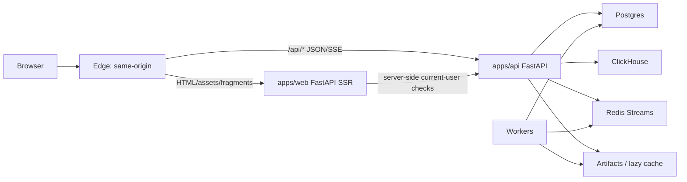
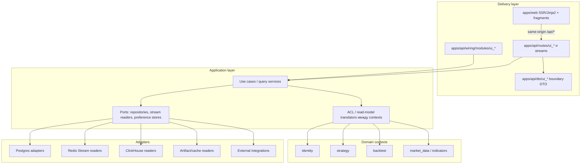
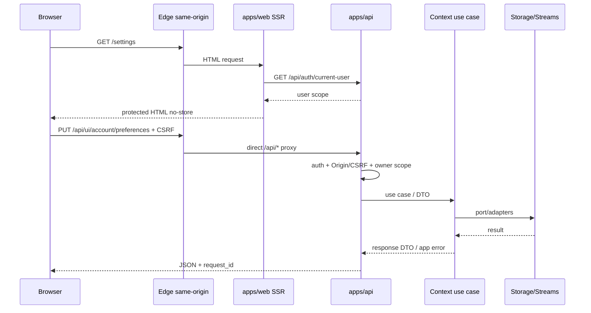
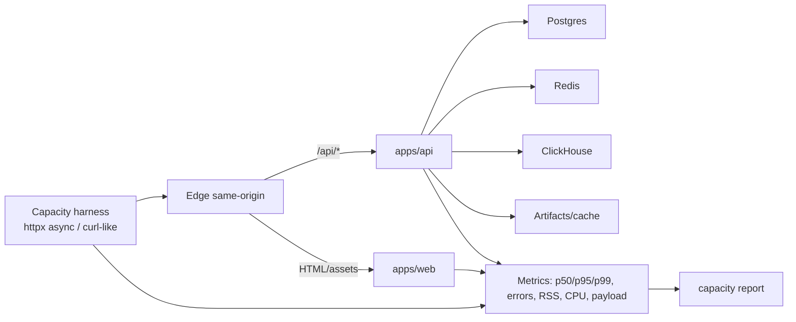
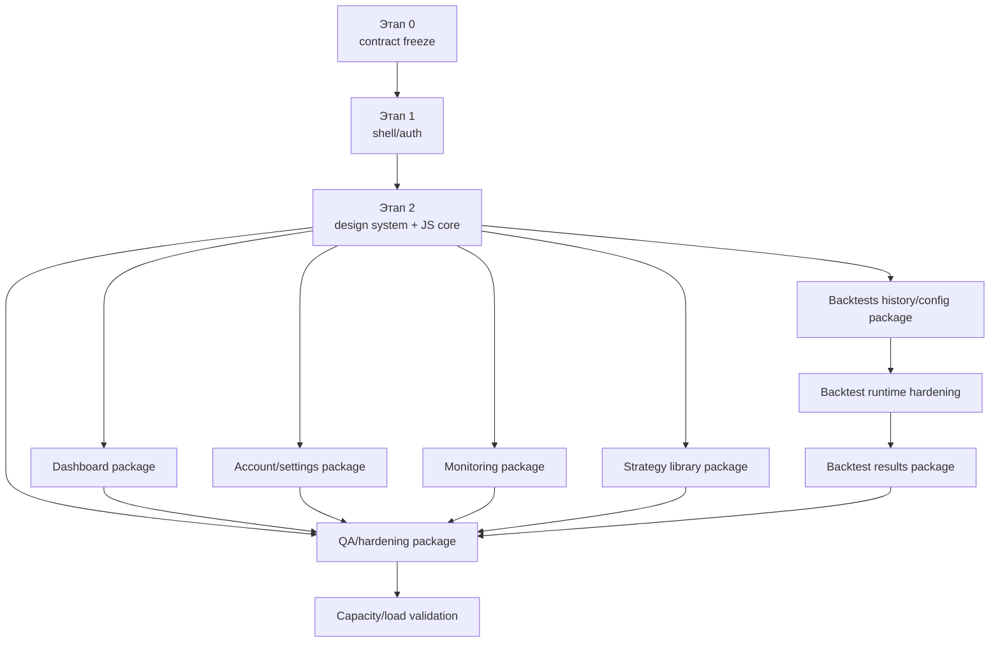
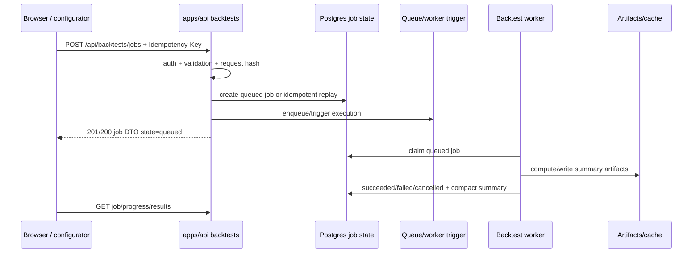

# План реализации Roehub Web UI + Backend v1

Документ фиксирует пошаговый план реализации новой версии Roehub Web UI и связанных backend read-model/API-расширений так, чтобы работу можно было безопасно распараллелить между агентами.

## Статус

- предлагаемый план реализации;
- дизайн-источник правды: `docs/architecture/apps/web/web-ui-design-manifest-v1.md`;
- исследовательский ввод: `docs/web-ui+backend-plan-deep-research.md`;
- текущая визуальная реализация `apps/web` заменяется полностью и не сохраняется как наследуемый режим.

## Цель

Построить новый сайт и защищенный UI приложения поверх существующих backend-контекстов Roehub:

- сначала базовый каркас: skeleton, вкладки шапки, точки входа авторизации/регистрации;
- затем отдельный план реализации для каждой страницы;
- для каждой страницы явно указать backend API, состав UI, пользовательский функционал, затрагиваемые файлы, критерии приемки и Playwright CLI-проверки;
- backend-логика остается в backend API/application services, не в `apps/web`;
- после базовых этапов агенты могут работать параллельно с непересекающимися зонами записи.

## Контекст

Факты текущего репозитория:

- `apps/web` - FastAPI SSR/Jinja2-приложение с login gate через `/api/auth/current-user`, защищенными страницами и static mount `/assets`.
- Текущие шаблоны лежат top-level файлами, текущие ассеты - `apps/web/dist/site.css`, `strategy_ui.js`, `backtest_ui.js`.
- Текущий `base.html` грузит HTMX из CDN, а login/logout-шаблоны используют встроенный JavaScript.
- Production routing должен оставаться same-origin на edge: HTML/assets идут в web, `/api/*` идет напрямую в backend. Встроенный web-proxy `/api/*` остается local/dev parity-путем, а не production-целью.
- Backend уже предоставляет auth/current-user, exchange keys, strategy CRUD/run/stop, справочники market-data, indicators и backtest jobs API.
- Backtest jobs API уже использует терминологию `jobs`, публично читаемый `variant_key`, summary-only top rows и lazy trades endpoint.
- Strategy runtime уже имеет Redis Streams realtime output primitives; для UI не хватает browser-facing read-model/SSE-моста.

## Нотация API-путей

В этом документе пути вида `/api/...` описывают **browser-visible same-origin contract**. Это путь, который видит браузер на `roehub.com` или локально через `apps/web`.

Фактическая регистрация маршрутов в `apps/api/routes/*` остается без префикса `/api`, если этап явно не меняет edge contract:

- browser `/api/auth/current-user` -> backend API `/auth/current-user`;
- browser `/api/backtests/jobs` -> backend API `/backtests/jobs`;
- browser `/api/ui/dashboard/summary` -> backend API `/ui/dashboard/summary`;
- browser `/api/stream/strategies` -> backend API `/stream/strategies`.

Причина: production `Caddy handle_path /api/*` и локальный `apps/web` proxy оба снимают `/api` перед upstream API. Implementation-агенты не должны добавлять второй `/api` prefix внутри FastAPI router. Если этот edge/proxy contract меняется, нужно обновить `docs/runbooks/web-ui-gateway-same-origin.md`, `infra/caddy/Caddyfile.vps`, web proxy tests и smoke-проверки public edge.

## Охват

- замена маршрутов, шаблонов и ассетов `apps/web`;
- UI-kit на design-токенах и переключатель темы;
- каркас с auth/register/header;
- лендинг, dashboard, settings, monitoring стратегий, библиотека/детали стратегий, история/configurator/results backtest-задач;
- backend API read-model-расширения под same-origin `/api/*`;
- SSE/polling helpers для live UI;
- Playwright CLI-приемка для каждой реализованной страницы;
- обновление docs index.

## Что не входит

- миграция на React/Next/full SPA;
- отдельный Node.js frontend-сервер;
- сохранение текущего светлого UI как наследуемого режима;
- перенос production-трафика `/api/*` через FastAPI web;
- хранение полных сделок в `backtest_job_top_variants.trades_json`;
- вычисление backtest-задач в web-слое;
- breaking changes публичного API, если этап явно не содержит migration notes;
- прямой запуск job AI-ассистентом без подтверждения пользователя;
- темы, меняющие семантику финансовых цветов для доходности и процентных изменений.

## Целевая архитектура



Правила:

- `apps/web` рендерит только HTML-каркас и низкочастотные HTML-фрагменты.
- Browser JS вызывает same-origin `/api/*`.
- Backend API владеет JSON DTO, SSE streams, валидацией, persistence и доменной orchestration.
- Workers владеют долгими compute/realtime-процессами.
- HTMX используется для forms/fragments/tables, не для high-frequency live dashboard-ов.
- JS islands владеют charts, pollers, SSE, сложными формами и browser-local состоянием взаимодействия.

## Модель распараллеливания

Не распараллеливать реализацию страниц до приемки этапа 1 и этапа 2. После этого работу можно делить по page/API area.

Правила владения:

- Foundation-агент владеет `apps/web/main/app.py`, `apps/web/templates/base.html`, общими папками шаблонов и общими ассетами.
- Design-system-агент владеет `apps/web/dist/css/**`, общими macros/components, переключателем темы и страницами visual QA fixture.
- Settings-агент владеет account/settings-шаблонами и фрагментами, `identity` UI routes/read-models и тестами аккаунта.
- Monitoring-агент владеет strategy monitoring API/SSE-мостом, monitoring-шаблонами/ассетами и тестами мониторинга стратегий.
- Backtests configurator/history-агент владеет страницами истории/run, presets и интеграцией current jobs/preflight.
- Backtests results-агент владеет summary/chart/stats/paginated trades endpoints и страницей результатов.
- Dashboard-агент владеет dashboard read-model endpoints и обзорной страницей.
- QA/hardening-агент владеет Playwright evidence, проверками CSP/CSRF/cache headers и drift docs index.

Агенты не должны переписывать modules другого агента, кроме заранее согласованных exports, router includes или shared helper interfaces.

## Целевая структура файлов

Web:

```text
apps/web/templates/
  base.html
  pages/
    landing.html
    login.html
    logout.html
    dashboard.html
    settings.html
    strategies.html
    strategy_detail.html
    monitoring.html
    backtests_history.html
    backtests_run.html
    backtests_result.html
  fragments/
    account/
    dashboard/
    monitoring/
    backtests/
  components/
    panel.html
    metric_card.html
    data_table.html
    empty_state.html
    error_state.html
  macros/
    ui.html
```

Ассеты:

```text
apps/web/dist/
  css/
    tokens.css
    themes.css
    base.css
    layout.css
    components.css
    pages/
  js/
    core/
      api.js
      poller.js
      sse.js
      dom.js
      formatters.js
      notifications.js
      validators.js
      theme.js
    components/
    charts/
    pages/
  vendor/
```

Backend-добавления:

```text
apps/api/routes/
  ui_account.py
  ui_dashboard.py
  ui_strategies_monitoring.py
  ui_backtests.py
  streams.py
apps/api/dto/
  ui_account.py
  ui_dashboard.py
  ui_strategies_monitoring.py
  ui_backtests.py
apps/api/wiring/modules/
  ui_account.py
  ui_dashboard.py
  ui_strategies_monitoring.py
  ui_backtests.py
  streams.py
```

Точные имена modules можно уточнять при реализации, но разделение должно оставаться по bounded capability, а не через generic `misc UI`.

## Инженерный контракт реализации

Этот раздел является обязательным для всех этапов. Он дополняет `.codex/AGENTS.md` и делает план пригодным для передачи нескольким агентам без потери архитектурных, контрактных и verification-требований.

Каждый агент в финальном отчете по этапу обязан указать:

- `Intent`: что реализовано и почему это нужно пользователю;
- `Scope`: какие bounded capability, routes, modules и файлы были затронуты;
- `Design`: какие use cases, DTO, ports/adapters, migrations, JS modules и template fragments добавлены или изменены;
- `Contract impact`: классификация `public API contract`, `port contract`, `DTO schema`, `persisted schema`, `config schema`, `request hash/cache key/persistence identity`, `browser-visible behavior`, `performance risk`;
- `Tests`: точные команды, рабочая директория и результат; отдельно focused tests, lint/type gates, migration tests;
- `Docs`: какие документы обновлены или почему обновление отложено;
- `Performance`: затронут ли verified hot path, какие payload/latency/RSS ограничения применялись, какие load/capacity checks выполнены;
- `Runtime evidence`: что проверено браузером/Playwright, что проверено тестами, что является только inference;
- `Risks`: оставшиеся edge cases, migration/rollback risks, pre-existing failures, environmental limitations;
- `Handoff`: какие exports, route includes, shared helpers или endpoint contracts должен использовать следующий агент.

Минимальная классификация gate failures:

- `introduced`: создано текущим изменением;
- `required-path pre-existing`: уже было, но блокирует нужный путь;
- `unrelated pre-existing`: вне scope текущего этапа;
- `environmental`: зависит от локальной среды, внешнего сервиса, данных или host state;
- `flaky`: воспроизводится нестабильно; нужен повтор с тем же SHA/config.

Агент не имеет права заявлять, что browser-visible behavior работает, если он не проверил его через Playwright CLI или явно не пометил утверждение как inference.

## Направление зависимостей и DDD-контракт

Backend-добавления для UI реализуются как тонкие delivery slices поверх существующих bounded contexts. Router не содержит бизнес-правил, web не содержит domain orchestration, а новые read-models не импортируют private domain internals другого контекста без translation layer.



Правила реализации:

- `apps/api/routes/*` валидируют транспорт, авторизацию, статусы и маппинг ошибок; бизнес-решения не живут в router.
- `apps/api/dto/*` описывает публичный payload; ORM/domain entities не сериализуются напрямую.
- Application/query services владеют orchestration, pagination, ownership checks, fallback/degradation и read-model assembly.
- Ports описывают зависимости от storage, Redis Streams, ClickHouse, artifacts и external integrations. В новых production-facing slices предпочтителен `typing.Protocol`.
- Adapters реализуют ports и переводят infrastructure exceptions в application errors.
- Cross-context DTO собирается через explicit mapper/ACL. Например, dashboard не должен импортировать внутренние strategy/backtest entities ради удобства.
- Web templates получают только view model для first paint; дальнейшие JSON/SSE данные идут из backend API.
- Shared helper допускается только для stable primitives, formatters, errors или small cross-cutting contracts; нельзя создавать generic `misc UI service`.

## API-контракт и модель ошибок

Каждый новый endpoint в implementation prompt должен иметь краткую спецификацию до начала кода:

| Поле | Требование |
|---|---|
| `method/path` | Полный путь, query params, path params, auth requirement. |
| `owner scope` | Как определяется текущий user/account и как проверяется доступ к ресурсу. |
| `request DTO` | Required/optional поля, defaults, validation, idempotency key, size limits. |
| `response DTO` | Shape, nullable fields, enum values, links, timestamps, pagination. |
| `status codes` | `200`, `201`, `204`, `400`, `401`, `403`, `404`, `409`, `422`, `429`, `500/503` semantics. |
| `error payload` | Stable error code, message, field errors, retryability, correlation/request id. |
| `pagination` | Cursor/keyset/page semantics, limits, max page size, stable ordering. |
| `cache identity` | Request hash/cache key impact или explicit `none`. |
| `compatibility` | `none`, `compatible-change`, `breaking-change`, `unknown`; migration/deprecation notes. |

Базовый error envelope должен оставаться совместимым с текущим `RoehubError` contract:

```json
{
  "error": {
    "code": "validation_error",
    "message": "Validation failed",
    "details": {
      "errors": [
        {
          "path": "body.time_range.start",
          "code": "value_error",
          "message": "must be before end"
        }
      ]
    }
  }
}
```

Новые `/api/ui/*` и UI-facing additions не должны вводить второй несовместимый error envelope. Если этап добавляет `request_id`, `retryable` или field-map helpers, это делается как additive extension к общему API error handler и документируется в `docs/architecture/api/api-errors-and-422-payload-v1.md`, а не реализуется локально только в одном router.

Статусные правила:

- `401`: пользователь не аутентифицирован; browser client должен остановить polling/SSE и отправить пользователя на login.
- `403`: пользователь аутентифицирован, но ресурс ему не принадлежит или действие запрещено; не раскрывать наличие чужого ресурса там, где это чувствительно.
- `404`: ресурс не найден в scope пользователя или публичный ключ варианта неизвестен.
- `409`: конфликт состояния или дубликат, который пользователь может исправить; duplicate exchange key и idempotency mismatch должны быть детерминированными.
- `422`: структурная или доменная validation error с field-level деталями.
- `429`: rate limit для live-control, AI и potentially expensive endpoints.
- `503`: backend dependency degraded; UI должен показать degraded panel, а не бесконечный spinner.

Pagination:

- cursor/keyset по умолчанию для history, audit, sessions, fills и больших списков;
- page/page_size допустимы для trades table, если storage/cache уже поддерживает стабильный total;
- default limit должен быть безопасным; max limit обязателен;
- ordering должен быть стабильным и документированным.

Idempotency:

- `POST /api/backtests/jobs` принимает `Idempotency-Key`; replay возвращает тот же job и не запускает новый compute;
- destructive actions должны быть safe-to-retry с точки зрения UX;
- AI endpoints не могут вызывать job creation напрямую.

## Схема хранения, миграции и rollback

Любая новая таблица или column является контрактом хранения. Миграция должна быть additive, rollback-able и owner-scoped.

Перед добавлением таблицы агент обязан определить владельца БД и миграционный канал:

- `identity_*` таблицы добавляются через SQL-файлы `migrations/postgres/0006_...sql` и bootstrap path identity DB, если они принадлежат identity/session/account scope;
- strategy/backtest/runtime tables добавляются через Alembic `alembic/versions/...py` и `apps.migrations.main`, если они принадлежат основной application DB;
- таблицу нельзя создавать в "удобной" БД только потому, что рядом уже есть похожий repository;
- если owner DB не очевиден, этап фиксирует `unknown` для persisted schema и не начинает migration до отдельного design decision.

Общие правила схемы:

- каждая user-owned таблица содержит `owner_user_id` или эквивалентный account scope;
- индексы обязаны покрывать основные query patterns (`owner_user_id`, `created_at`, cursor key, external id, active flag);
- timestamps хранятся в UTC;
- JSON columns допускаются для drafts/preferences, но required query fields выносятся в typed columns;
- secrets не хранятся в UI tables; exchange secret policy остается в identity/exchange-key контексте;
- soft-delete применяется там, где audit/recoverability важнее физического удаления;
- retention policy задается для audit/events/sessions/AI transcript-like data;
- default resolution должен быть deterministic: server default -> account preference -> browser local fallback -> hardcoded safe default.

Минимальные планируемые схемы:

| Таблица | Назначение | Ключи и индексы | Rollback/default |
|---|---|---|---|
| `identity_user_preferences` | UI theme, density, locale-like preferences | unique `owner_user_id`; index `updated_at` | при rollback UI использует `terminal-orange` и `localStorage`; таблицу можно оставить unused. |
| `identity_integrations` | non-secret integration toggles/config refs | `owner_user_id`, `provider`, `enabled` | disable-on-read fallback; secrets отдельно. |
| `identity_audit_events` | account/settings/security/live-control audit | `owner_user_id`, `created_at`, `event_type` | append-only; rollback к read-only ignored events. |
| `identity_user_profile_overrides` | optional display/profile overrides | unique `owner_user_id` | fallback на `current-user` claims. |
| `backtest_presets` | safe request drafts для configurator | `owner_user_id`, `created_at`, `name`, optional `request_hash` | configurator продолжает работать без presets. |

Чеклист миграции:

- forward migration additive and nullable-safe;
- application code tolerates table absence only during explicit transitional rollout, otherwise fail fast;
- downgrade/rollback documented before merge;
- owner scope tested;
- duplicate/unique constraints tested;
- default-read behavior tested;
- docs index updated when architecture/persistence contract changes.

## Security и граница доверия

Security является частью каждого этапа, а не только финального hardening.



Обязательные правила:

- все state-changing browser calls защищены Origin/Referer validation и выбранной CSRF strategy до public rollout;
- конкретная CSRF strategy должна быть выбрана и зафиксирована до начала этапов, которые добавляют `PUT`, `POST`, `PATCH` или `DELETE` browser calls; до этого page-агенты могут реализовывать только read-only flows или использовать уже существующие защищенные endpoints без расширения mutation surface;
- cookies: `HttpOnly`, `Secure`, `SameSite=Lax` или более строгий эквивалент, если текущий identity flow позволяет;
- per-route authorization и owner scope обязательны для `/api/ui/*`, streams, settings, jobs, presets, trades, CSV export;
- SSE читает только события текущего пользователя/account; `last_event_id` не должен позволять читать чужой stream;
- destructive actions требуют confirm UI и audit event;
- live-control actions (`run`, `stop`, future trading controls) требуют rate limit и idempotency/retry semantics;
- exchange secrets never appear в response DTO, HTML, JS state, logs, screenshots или Playwright artifacts;
- AI prompt/session data не получают secrets, API keys, session cookies или raw private audit logs;
- CSP target после foundation: `default-src 'self'; script-src 'self'; style-src 'self'; img-src 'self' data:; connect-src 'self'; object-src 'none'; frame-ancestors 'none'; base-uri 'self'; form-action 'self'`.

## Observability и режимы отказа

Новые UI-facing endpoints должны быть operable на текущем host и при деградации зависимостей.

Минимальные observability-требования:

- переиспользовать существующие Prometheus HTTP metrics (`http_requests_total`, `http_request_duration_seconds`, `http_requests_in_progress`) и добавлять новые метрики только как additive labels/series без взрыва cardinality;
- каждый request имеет `request_id`/correlation id в logs и error DTO;
- если `request_id` еще не существует в API middleware, его добавление является отдельным compatible API-wide изменением в общем middleware/error handler; page-router не должен изобретать локальный request id contract;
- web proxy и edge должны сохранять или пробрасывать `X-Request-ID`/correlation header, если он выбран;
- boundary logs structured и не содержат secrets;
- метрики: request count, status count, p50/p95 latency, payload size bucket, active SSE connections, SSE reconnects, polling errors, dependency failure count;
- для dashboard/monitoring/results отдельно считать degraded panel count и dependency name;
- для backtest jobs считать create latency, queue wait, running duration, cancel latency, lazy detail materialization time;
- для load tests фиксировать CPU/RSS, DB pool wait, Redis latency и error rate.

Режимы отказа:

| Область | Failure mode | UI behavior | Backend behavior |
|---|---|---|---|
| Auth | `401` во время polling/SSE | остановить live loops, redirect/login banner | stable 401 без stack traces |
| Authorization | чужой ресурс | 403/404 без утечки деталей | owner scope до read/stream |
| Dashboard | один источник недоступен | degraded panel, остальные panels работают | partial DTO или typed degraded source |
| Monitoring SSE | network drop | reconnect 2s/5s/15s, затем polling fallback | read-only stream, bounded connections |
| Backtest results | lazy detail cache miss | loading state, bounded materialization | no full payload in top rows |
| CSV export | large export | отдельный download flow | streaming/file route, rate limit |
| AI | provider timeout | draft not applied, deterministic error | cancellation, redaction, rate limit |

## Backend quality gates и порядок проверок

Каждый этап должен начинаться с focused gates и расширяться только при риске или изменении shared contracts.

Общий порядок:

1. focused `uv run pytest -q <tests for touched behavior>`;
2. focused `uv run ruff check <touched python paths>` для Python paths;
3. `uv run pyright` при изменении DTO, ports, application services, routes или wiring;
4. migration tests / repository tests при изменении persisted schema;
5. related web route tests при изменении templates/routes;
6. broader `uv run pytest -q` только для финального hardening, shared contract changes или перед publish.

Prompt каждого этапа должен явно указать:

- какие тесты добавить или обновить;
- какой focused gate является минимальным acceptance;
- какие failures классифицируются как introduced vs pre-existing;
- какие browser checks обязательны и почему backend tests не заменяют их.

Минимальные классы тестов по зонам:

| Зона | Tests |
|---|---|
| Web shell/auth | route smoke, protected redirect, next sanitization, no inline script smoke. |
| JS core | если JS unit runner не вводится, добавить browser/Playwright flow для 401/422/abort/backoff; Python tests проверяют asset references. |
| Account/settings | route tests, DTO validation, owner scope, duplicate 409, audit event write, preferences default resolution. |
| Monitoring | route tests, stream auth, Redis reader adapter tests, fallback DTO, start/stop state reflection. |
| Backtests history/configurator | preflight invalid/valid, idempotency key, cancel idempotency, presets persistence, request hash unchanged. |
| Backtests results | variant 404, downsampling bounds, paginated trades, CSV auth/ownership, no full trades in top rows. |
| Migrations | upgrade/downgrade or equivalent migration smoke, indexes/unique constraints, default-read behavior. |

## Browser runtime evidence

Для каждого browser-visible этапа требуется Playwright CLI evidence:

- desktop screenshot: обычно `1440x1000`;
- mobile screenshot: около `390x844`;
- `snapshot` после ключевого состояния;
- console errors отсутствуют;
- failed same-origin network requests отсутствуют, кроме ожидаемых auth redirects;
- auth state и protected route behavior проверены;
- theme switcher меняет `base/accent/state`, но не financial colors;
- primary workflow выполнен без overlapping requests;
- для chart/canvas страниц выполнена nonblank canvas/SVG проверка;
- отчет различает observed runtime evidence, test evidence, inference и assumptions.

Пример минимального блока:

```bash
export CODEX_HOME="${CODEX_HOME:-$HOME/.codex}"
export PWCLI="$CODEX_HOME/skills/playwright/scripts/playwright_cli.sh"
"$PWCLI" open http://127.0.0.1:8010/<route>
"$PWCLI" snapshot
"$PWCLI" screenshot --filename output/playwright/<stage>-desktop.png
```

Если stage влияет на mobile layout или theme behavior, добавить отдельные команды/настройки viewport по Playwright skill и сохранить evidence в `output/playwright/`.

## Нагрузочное тестирование и оценка capacity

Цель: оценить потенциал текущего backend host как машины для Roehub UI/API и не внедрить UI, который хорошо выглядит локально, но перегружает 1 vCPU / 2 GB class host.

Нагрузочные проверки не заменяют функциональные tests. Они дают capacity evidence и классифицируют риск как `green`, `yellow` или `red`:

- `green`: p95 latency и error rate приемлемы, RSS стабилен, CPU не держится в saturation;
- `yellow`: работает, но есть явный bottleneck или малый запас; нужен mitigation перед ростом traffic;
- `red`: endpoint/workflow не готов к public rollout на текущем host.



Рекомендуемый harness:

- не добавлять Node toolchain ради load tests;
- если в repo нет готового инструмента, реализовать `tools/load/web_capacity_smoke.py` на стандартном Python + уже доступном `httpx`;
- сценарии должны быть read-mostly по умолчанию; destructive flows запускаются только в isolated test account;
- каждый запуск фиксирует commit, branch, host, config, dataset/fixtures, warmup, concurrency, duration, cold/warm mode.

Обязательные load/capacity сценарии:

| Этап / область | Сценарий | Минимальная нагрузка | Что измерить |
|---|---|---|---|
| Shell/assets | anonymous `/`, protected redirect, static assets | 30-60s, concurrency 10-25 | p95 HTML latency, asset cache hit, web RSS. |
| Dashboard summary | `GET /api/ui/dashboard/summary` | 30-60s, concurrency 5-20 | p95, payload size, dependency fan-out, degraded source count. |
| Settings | preferences/profile/audit read, exchange-key list | 30s, concurrency 5-10 | auth overhead, DB latency, no secret leakage. |
| Monitoring snapshot | monitor list + selected snapshot | 60s, concurrency 10 plus 1-5 SSE clients | Redis/DB fan-out, active SSE connections, reconnects. |
| Backtests history | `GET /api/backtests/jobs` cursor pages | 60s, concurrency 10-20 | cursor stability, DB indexes, p95. |
| Backtests results | summary/equity/drawdown/monthly/trades page | 60s, concurrency 5-15 | artifact/cache IO, chart downsampling cost, no full trades payload. |
| Paginated trades | `GET /trades?page=&page_size=50/100` | 60s, concurrency 5-10 | page latency, memory, cache materialization misses. |
| Backtest create/preflight | valid/invalid preflight, idempotent create | controlled low rate | no API-process compute saturation; queued/background behavior. |

Приемка оценки текущего host:

- report включает host class, process counts, env profile, DB/Redis locality и cache state;
- endpoint, используемый для first paint, не передает unbounded data;
- polling/SSE loops не накладывают новые requests поверх еще не завершенных при повышенной latency;
- SSE connection count ограничен и проходит reconnect test;
- p95 и RSS trends записаны даже если hard threshold еще не задан;
- если сценарий получает статус `yellow` или `red`, владелец этапа фиксирует mitigation до public rollout.

## Пакеты работ для параллельных агентов

После приемки этапов 1-2 работа делится на disjoint write sets. Каждый package prompt должен включать dependencies, owned files, forbidden files, integration points и handoff.



Шаблон package:

| Поле | Содержание |
|---|---|
| `depends_on` | Этапы и packages, которые должны быть accepted. |
| `owns` | Точные файлы/папки, где агент может писать. |
| `forbidden` | Файлы/папки других агентов; изменения только через согласованный integration point. |
| `integration points` | Router include, DTO export, macro name, JS core API, CSS class/token, migration dependency. |
| `contracts` | Endpoint specs, DTO shapes, errors, persistence, browser defaults. |
| `gates` | Focused tests, ruff/pyright, Playwright, load smoke if relevant. |
| `handoff` | Что следующий агент может считать stable. |

Правила merge/order:

- shared foundation merges first;
- page packages do not edit each other's CSS/JS/page templates;
- changes to `apps/api/main/app.py`, route includes and shared DTO exports should be small and reviewed at integration boundaries;
- migration packages cannot run in parallel if they edit same migration chain or same table;
- QA/hardening package can patch shared shell/security only after page packages expose their route contracts.

## Этап 0 - фиксация контрактов и границы cleanup

Цель: зафиксировать scope до старта implementation-агентов.

Задачи:

- Считать `docs/architecture/apps/web/web-ui-design-manifest-v1.md` визуальным источником правды.
- Считать этот документ источником правды по исполнению.
- Подтвердить, что светлый наследуемый UI-режим не остается.
- Проинвентаризировать текущие web-файлы и пометить каждый как replace, move или delete.
- Зафиксировать route map и endpoint map до начала работ над страницами.

Основные файлы:

- `apps/web/main/app.py`;
- `apps/web/templates/*.html`;
- `apps/web/dist/site.css`;
- `apps/web/dist/strategy_ui.js`;
- `apps/web/dist/backtest_ui.js`;
- `tests/unit/apps/web/test_app_routes.py`.

Критерии приемки:

- у каждого текущего web-маршрута есть целевое решение;
- у каждого текущего top-level шаблона/ассета есть путь удаления или замены;
- ни один агент не начинает реализацию страницы, используя старый `site.css` как визуальную основу;
- docs index обновлен после добавления architecture docs.

Проверка:

```bash
python -m tools.docs.generate_docs_index
python -m tools.docs.generate_docs_index --check
```

Влияние на контракты:

- public API contract: `none`;
- browser-visible behavior: `breaking-change` для текущего вида/компоновки UI, намеренно принято этим планом;
- persisted schema: `none`.

## Этап 1 - каркас приложения, вкладки шапки, auth/register

Цель: создать новый skeleton: базовую компоновку, вкладки шапки, точки входа login/logout/register и gate защищенных страниц.

Задачи:

- Заменить `base.html` на терминальный каркас с токенами дизайн-манифеста.
- Добавить route map в `apps/web/main/app.py`:
  - `/`;
  - `/login`;
  - `/logout`;
  - `/register`;
  - `/dashboard`;
  - `/settings`;
  - `/strategies`;
  - `/strategies/new`;
  - `/strategies/{strategy_id}`;
  - `/monitoring`;
  - `/backtests`;
  - `/backtests/new`;
  - `/backtests/{job_id}`.
- Сохранить server-side проверку защищенного маршрута через `/api/auth/current-user`.
- Заменить inline JS для login/logout на внешний `apps/web/dist/js/pages/auth.js` или чистые серверные redirects там, где это возможно.
- Self-host HTMX в `apps/web/dist/vendor/htmx.min.js`.
- Добавить route-level template contexts для активного состояния nav, title страницы и user badge.
- Добавить `/register` как web entrypoint, запускающий Keycloak-backed registration/get-started flow.
- Не реализовывать локальную регистрацию username/password в Roehub web.

Backend/API:

- Текущий auth API сохраняется:
  - `GET /api/auth/login`;
  - `GET /api/auth/callback`;
  - `POST /api/auth/logout`;
  - `GET /api/auth/current-user`.
- Если Keycloak self-registration требует отдельный backend entrypoint, добавить его как совместимое auth-расширение в identity router, а не как обработку локальной web-формы.

Файлы:

- изменить `apps/web/main/app.py`;
- изменить `apps/web/templates/base.html`;
- переместить/пересоздать `apps/web/templates/login.html`, `logout.html`, `partials/user_badge.html`;
- добавить placeholder-шаблоны `apps/web/templates/pages/*.html`;
- добавить `apps/web/dist/css/tokens.css`, `themes.css`, `base.css`, `layout.css`;
- добавить `apps/web/dist/js/pages/auth.js`;
- обновить `tests/unit/apps/web/test_app_routes.py`;
- обновить `tests/unit/apps/web/test_security.py`.

Критерии приемки:

- anonymous `/` работает;
- защищенные страницы перенаправляют на `/login?next=<safe-local-path>`;
- внешний `next=https://...` санитизируется;
- шапка показывает вкладки и корректное активное состояние;
- login и logout не требуют inline scripts;
- register CTA присутствует и ведет в выбранный Keycloak-backed entrypoint;
- `/strategies/new` остается поддержанным entrypoint для создания стратегии или явно редиректит на новый create workflow;
- в базовом каркасе не остается внешнего CDN-скрипта.

Playwright CLI:

```bash
export CODEX_HOME="${CODEX_HOME:-$HOME/.codex}"
export PWCLI="$CODEX_HOME/skills/playwright/scripts/playwright_cli.sh"
"$PWCLI" open http://127.0.0.1:8010/
"$PWCLI" snapshot
"$PWCLI" screenshot --filename output/playwright/shell-landing-desktop.png
"$PWCLI" open http://127.0.0.1:8010/settings
"$PWCLI" snapshot
```

Backend gates:

```bash
uv run pytest -q tests/unit/apps/web/test_app_routes.py tests/unit/apps/web/test_security.py
```

Влияние на контракты:

- public API contract: `compatible-change` только если добавляется registration auth entrypoint;
- browser-visible behavior: `breaking-change`, намеренная замена;
- config schema: `compatible-change`, если добавляются настройки asset version/CSP.

## Этап 2 - дизайн-система, темы и JS core

Цель: создать shared UI primitives, переключатель темы и JS core до того, как page-команды начнут строить реальные экраны.

Задачи:

- Реализовать CSS token-файлы из дизайн-манифеста.
- Зафиксировать `terminal-orange` как тему по умолчанию.
- Добавить `themes.css` минимум с `terminal-orange`, `graphite`, `matrix-green`, `high-contrast` как placeholders или полные блоки токенов.
- Реализовать `apps/web/dist/js/core/theme.js`:
  - читает начальную тему из backend preference, если она доступна;
  - затем использует `localStorage`;
  - затем использует `terminal-orange`;
  - применяет `data-theme` без перезагрузки страницы;
  - никогда не переписывает финансовые семантические классы.
- Реализовать shared macros/components:
  - панель;
  - metric card;
  - status badge;
  - data table;
  - tabs;
  - empty/error state;
  - command bar;
  - modal shell;
  - переключатель темы.
- Реализовать JS core:
  - `api.js` с `credentials: "include"`, timeout, abort, 401 redirect, mapping для 403/409/422;
  - CSRF/Origin integration point для state-changing requests, даже если конкретная server strategy включается на hardening stage;
  - `poller.js` с no-overlap polling, hidden-tab pause и backoff;
  - `sse.js` с EventSource wrapper и downgrade callback;
  - `notifications.js`, `formatters.js`, `validators.js`.
- Один раз принять решение по доставке иконок:
  - либо self-host небольшой Lucide-compatible icon path;
  - либо оставить текстовые controls, пока доставка иконок не станет явной.

Файлы:

- добавить `apps/web/templates/macros/ui.html`;
- добавить `apps/web/templates/components/*.html`;
- добавить `apps/web/dist/css/components.css`;
- добавить `apps/web/dist/css/themes.css`;
- добавить `apps/web/dist/js/core/*.js`;
- добавить `apps/web/dist/js/components/*.js`;
- обновить web unit smoke tests для asset paths, theme hooks и layout hooks.

Критерии приемки:

- shared components рендерятся без page-specific CSS;
- в новых шаблонах не остается зависимости от старого `site.css`;
- тема по умолчанию - `terminal-orange`;
- переключатель темы сразу обновляет `data-theme`;
- финансовые цвета для доходности и процентных изменений остаются фиксированными во всех темах;
- `api.js` детерминированно обрабатывает 401, 403, 409, 422 и timeout;
- mutation requests имеют единый extension point для CSRF token/header и не реализуют ad hoc защиту в page modules;
- `poller.js` не допускает overlapping requests;
- hidden tab приостанавливает repeated polling в течение 5s;
- компоненты имеют accessible labels/focus states.

Playwright CLI:

```bash
"$PWCLI" open http://127.0.0.1:8010/dashboard
"$PWCLI" snapshot
"$PWCLI" screenshot --filename output/playwright/ui-kit-dashboard-placeholder.png
```

Backend gates:

```bash
uv run pytest -q tests/unit/apps/web
```

Влияние на контракты:

- public API contract: `none`;
- browser-visible behavior: `breaking-change`, намеренная визуальная замена;
- persisted schema: `none`;
- config schema: `compatible-change`, если theme defaults становятся server config.

## Этап 3 - лендинг

Цель: построить публичный первый экран по `general_page.png`.

Маршрут страницы:

- `GET /`.

Frontend:

- Заменить текущий `landing.html` на `pages/landing.html`.
- Использовать карту платформы/продуктовую диаграмму как основной визуал.
- Держать первый viewport сфокусированным на ценности Roehub и CTA.
- Показывать намек на следующий раздел на desktop и mobile.
- Не добавлять API-зависимость для анонимного рендера.

Backend/API:

- для v1-лендинга ничего не требуется;
- опциональный server-side user badge может продолжать использовать current-user, только если это уже доступно без блокировки рендера.

Файлы:

- изменить `apps/web/templates/pages/landing.html`;
- добавить `apps/web/dist/css/pages/landing.css`;
- опционально добавить `apps/web/dist/js/pages/landing.js`.

Критерии приемки:

- `/` загружается анонимно без доступности API;
- в шапке видны действия auth/register;
- CTA-маршруты корректны;
- на mobile нет горизонтального overflow;
- декоративные blobs/gradients не заменяют продуктовую диаграмму;
- переключатель темы работает, если он видим в каркасе.

Playwright CLI:

```bash
"$PWCLI" open http://127.0.0.1:8010/
"$PWCLI" snapshot
"$PWCLI" screenshot --filename output/playwright/landing-desktop.png
```

## Этап 4 - dashboard / обзор

Цель: создать компактный защищенный обзор активных стратегий, последних backtest-задач, статуса аккаунта и alerts.

Маршрут страницы:

- `GET /dashboard`.

Backend/API:

- добавить `GET /api/ui/dashboard/summary`;
- опциональные cursor endpoints, если summary становится слишком большим:
  - `GET /api/ui/dashboard/alerts?cursor=`;
  - `GET /api/ui/dashboard/recent-jobs?limit=10`;
  - `GET /api/ui/dashboard/strategy-health?limit=10`.

Поведение backend:

- агрегировать только компактные read models;
- не раскладывать страницу на множество browser calls;
- деградировать по панели: один упавший источник не должен ломать всю страницу, если auth не упал;
- целевой payload: менее 50 KB в сжатом виде.

Файлы:

- добавить `apps/api/routes/ui_dashboard.py`;
- добавить `apps/api/dto/ui_dashboard.py`;
- добавить `apps/api/wiring/modules/ui_dashboard.py`;
- обновить `apps/api/main/app.py`;
- добавить `apps/web/templates/pages/dashboard.html`;
- добавить `apps/web/templates/fragments/dashboard/*`;
- добавить `apps/web/dist/js/pages/dashboard.js`;
- добавить `apps/web/dist/css/pages/dashboard.css`;
- добавить тесты в `tests/unit/apps/api/test_ui_dashboard_routes.py`;
- обновить `tests/unit/apps/web/test_app_routes.py`.

Критерии приемки:

- один summary request рендерит страницу;
- auth-required behavior согласован с другими защищенными маршрутами;
- если recent jobs недоступны, account/strategy panels все равно рендерятся с error state;
- polling interval равен 10-15s и приостанавливается на hidden tab;
- browser request overlap отсутствует;
- financial deltas сохраняют фиксированные семантические цвета во всех темах.

Playwright CLI:

```bash
"$PWCLI" open http://127.0.0.1:8010/dashboard
"$PWCLI" snapshot
"$PWCLI" screenshot --filename output/playwright/dashboard-desktop.png
```

Влияние на контракты:

- public API contract: `compatible-change`, добавляются `/api/ui/dashboard/*`;
- DTO schema: `compatible-change`;
- persisted schema: `none`.

## Этап 5 - настройки / аккаунт

Цель: реализовать `personal_settings.png`: профиль, exchange keys, limits, integrations, notifications, security, sessions, audit и настройки темы.

Маршрут страницы:

- `GET /settings`.

Текущий backend:

- `GET /api/auth/current-user`;
- `GET /api/exchange-keys`;
- `POST /api/exchange-keys`;
- `DELETE /api/exchange-keys/{key_id}`.

Backend/API-добавления:

- `GET /api/ui/account/profile`;
- `PUT /api/ui/account/profile`;
- `GET /api/ui/account/limits`;
- `GET /api/ui/account/integrations`;
- `PUT /api/ui/account/integrations`;
- `GET /api/ui/account/notifications`;
- `PUT /api/ui/account/notifications`;
- `GET /api/ui/account/preferences`;
- `PUT /api/ui/account/preferences`;
- `GET /api/ui/account/sessions?cursor=`;
- `GET /api/ui/account/audit-events?cursor=`.

Фактические `apps/api` route paths регистрируются как `/ui/account/...`; `/api/ui/account/...` является browser-visible same-origin path.

Поведение backend:

- exchange secrets остаются write-only;
- существующий exchange-key response должен оставаться masked и не должен добавлять secret fields;
- дубликат активного exchange key остается детерминированным `409` с code `exchange_key_already_exists`;
- каждая destructive/settings mutation пишет audit event;
- sessions и audit используют cursor pagination, без load-all;
- account preferences включают выбранную UI-тему, но не могут переопределять семантику финансовых цветов.

Вероятно потребуется хранение:

- `identity_user_preferences`;
- `identity_integrations`;
- `identity_audit_events`;
- опционально `identity_user_profile_overrides`.

Файлы:

- добавить `apps/api/routes/ui_account.py`;
- добавить `apps/api/dto/ui_account.py`;
- добавить `apps/api/wiring/modules/ui_account.py`;
- добавить identity application use cases/ports/adapters по необходимости в `src/trading/contexts/identity/**`;
- добавить миграцию в `migrations/postgres/`;
- добавить `apps/web/templates/pages/settings.html`;
- добавить `apps/web/templates/fragments/account/*`;
- добавить `apps/web/dist/js/pages/settings.js`;
- добавить `apps/web/dist/css/pages/settings.css`;
- тесты:
  - `tests/unit/apps/api/test_ui_account_routes.py`;
  - `tests/unit/apps/api/test_identity_exchange_keys_routes.py`;
  - `tests/unit/apps/web/test_app_routes.py`.

Критерии приемки:

- страница settings открывается за auth gate;
- добавление exchange key работает; secret никогда не присутствует в response, DOM или logs;
- duplicate exchange key возвращает видимый детерминированный `409` с code `exchange_key_already_exists`;
- delete key подтверждается и идемпотентен с точки зрения UX;
- notification/integration toggles сохраняются без полного reload страницы;
- theme preference сохраняется и корректно восстанавливается после reload;
- sessions и audit пагинируются;
- mobile layout складывается без горизонтального overflow.

Playwright CLI:

```bash
"$PWCLI" open http://127.0.0.1:8010/settings
"$PWCLI" snapshot
"$PWCLI" screenshot --filename output/playwright/settings-desktop.png
```

Влияние на контракты:

- public API contract: `compatible-change`;
- DTO schema: `compatible-change`;
- persisted schema: `compatible-change` через additive tables;
- config schema: `none`, если не вводятся integration credentials.

## Этап 6 - библиотека и детали стратегий

Цель: заменить текущий strategy list/builder/detail UI новым дизайном, сохранив существующую семантику Strategy API.

Маршруты страниц:

- `GET /strategies`;
- `GET /strategies/new` или явный redirect на новый create workflow;
- `GET /strategies/{strategy_id}`.

Текущий backend:

- `GET /api/strategies`;
- `GET /api/strategies/{strategy_id}`;
- `POST /api/strategies`;
- `POST /api/strategies/clone`;
- `DELETE /api/strategies/{strategy_id}`;
- `POST /api/strategies/{strategy_id}/run`;
- `POST /api/strategies/{strategy_id}/stop`;
- `GET /api/market-data/markets`;
- `GET /api/market-data/instruments`;
- `GET /api/indicators`.

Backend/API-добавления:

- для начальной замены ничего не требуется;
- опциональная более поздняя read model: `GET /api/ui/strategies/library?cursor=&state=`.

Frontend:

- сохранить immutable strategy model: редактирование означает clone/create, а не mutable update;
- заменить JSON textarea на visual spec summary/builder controls;
- не потерять create workflow: текущий `/strategies/new` либо становится новой страницей/фрагментом конструктора, либо возвращает контролируемый redirect на `/strategies` с открытием create modal;
- details page может использовать layout из `strategy_statistic.png` только для статистики стратегии, реально подкрепленной данными; метрики не подделывать.

Файлы:

- добавить/изменить `apps/web/templates/pages/strategies.html`;
- добавить/изменить `apps/web/templates/pages/strategy_create.html`, если create остается отдельной страницей;
- добавить/изменить `apps/web/templates/pages/strategy_detail.html`;
- добавить `apps/web/templates/fragments/strategies/*`;
- добавить `apps/web/dist/js/pages/strategies.js`;
- добавить `apps/web/dist/css/pages/strategies.css`;
- вывести из использования старые `strategies_list.html`, `strategy_builder.html`, `strategy_details.html` после завершения замены маршрутов.

Критерии приемки:

- list, clone и soft-delete продолжают вызывать существующие `/api/strategies*` routes;
- `/strategies/new` покрыт route test и browser check как create entrypoint или redirect на create modal;
- create/clone сохраняет canonical indicator payload shape;
- strategy route не означает live monitoring; live monitoring принадлежит `/monitoring`;
- зависимость от старого `strategy_ui.js` отсутствует;
- переключатель темы не перекрашивает финансовые метрики, если они показаны.

Playwright CLI:

```bash
"$PWCLI" open http://127.0.0.1:8010/strategies
"$PWCLI" snapshot
"$PWCLI" screenshot --filename output/playwright/strategies-desktop.png
```

Влияние на контракты:

- public API contract: `none` для начальной замены;
- browser-visible behavior: `breaking-change`.

## Этап 7 - мониторинг стратегий

Цель: реализовать `strategy_monitoring.png`: панель выбранной стратегии плюс правый список стратегий с live state.

Маршрут страницы:

- `GET /monitoring`.

Backend/API-добавления:

- `GET /api/ui/strategies/monitor?state=active|all&cursor=`;
- `GET /api/ui/strategies/{strategy_id}/snapshot`;
- `GET /api/ui/strategies/{strategy_id}/positions?limit=50`;
- `GET /api/ui/strategies/{strategy_id}/fills?cursor=`;
- `GET /api/ui/strategies/{strategy_id}/equity?range=1d&points=600`;
- `GET /api/stream/strategies?strategy_id=&last_event_id=` как SSE-мост поверх существующих Redis Streams.

Поведение backend:

- использовать существующие strategy repositories/run model и контракты realtime output publisher;
- SSE-мост должен авторизовать current user перед чтением per-user streams;
- SSE является read-only;
- polling fallback использует snapshot endpoints;
- ограничивать list rows, fills, alerts и chart points.

Файлы:

- добавить `apps/api/routes/ui_strategies_monitoring.py`;
- добавить `apps/api/routes/streams.py` или stream-specific router;
- добавить `apps/api/dto/ui_strategies_monitoring.py`;
- добавить `apps/api/wiring/modules/ui_strategies_monitoring.py`;
- добавить backend read-model services/ports в `src/trading/contexts/strategy/application/**`;
- добавить Redis stream reader adapter, если текущий код только публикует;
- добавить `apps/web/templates/pages/monitoring.html`;
- добавить `apps/web/templates/fragments/monitoring/*`;
- добавить `apps/web/dist/js/pages/monitoring.js`;
- добавить `apps/web/dist/css/pages/monitoring.css`;
- тесты:
  - `tests/unit/apps/api/test_ui_strategy_monitoring_routes.py`;
  - `tests/unit/apps/api/test_strategy_stream_routes.py`;
  - `tests/unit/apps/web/test_app_routes.py`.

Критерии приемки:

- strategy list и selected strategy snapshot рендерятся из backend DTO;
- start/stop actions отражают состояние в течение одного refresh cycle;
- SSE переподключается или деградирует до polling;
- 401 останавливает stream и отправляет пользователя на login;
- hidden tab приостанавливает polling;
- mobile сворачивает list/detail во вкладки;
- PnL, ROI, return и drawdown сохраняют фиксированные финансовые цвета во всех темах.

Playwright CLI:

```bash
"$PWCLI" open http://127.0.0.1:8010/monitoring
"$PWCLI" snapshot
"$PWCLI" screenshot --filename output/playwright/monitoring-desktop.png
```

Влияние на контракты:

- public API contract: `compatible-change`;
- DTO schema: `compatible-change`;
- port contract: `compatible-change`, если добавляется stream reader port;
- persisted schema: ожидается `none`;
- performance risk: контролировать Redis и DB fan-out; использовать bounded DTO.

## Этап 8 - история и конфигуратор backtest-задач

Цель: разделить текущий совмещенный `/backtests` monolith на историю и конфигуратор.

Маршруты страниц:

- `GET /backtests` - история/список;
- `GET /backtests/new` - конфигуратор.

Текущий backend:

- `GET /api/backtests/runtime-defaults`;
- `POST /api/backtests/preflight`;
- `POST /api/backtests/jobs`;
- `GET /api/backtests/jobs`;
- `GET /api/backtests/jobs/{job_id}`;
- `GET /api/backtests/jobs/{job_id}/top`;
- `POST /api/backtests/jobs/{job_id}/cancel`;
- `GET /api/market-data/markets`;
- `GET /api/market-data/instruments`;
- `GET /api/indicators`.

Backend/API-добавления:

- `GET /api/ui/backtest-presets`;
- `POST /api/ui/backtest-presets`;
- `DELETE /api/ui/backtest-presets/{preset_id}`;
- опционально `GET /api/ui/backtests/counters`;
- опционально `GET /api/backtests/jobs/{job_id}/events` SSE, если job progress доступен вне polling.

Поведение backend:

- `POST /api/backtests/jobs` остается authoritative и async с точки зрения UI;
- UI должен отправлять `Idempotency-Key` для create job;
- preflight только advisory; create повторяет валидацию;
- конфигуратор не может вычислять или materialize results локально;
- presets хранят безопасные request drafts, а не result payloads.

Вероятно потребуется хранение:

- owner-scoped table `backtest_presets` с request JSON, name, timestamps.

Файлы:

- расширять `apps/api/routes/backtests.py` только для существующих публичных backtest-ресурсов;
- добавить `apps/api/routes/ui_backtests.py` для presets/counters, если они выбраны;
- добавить `apps/api/dto/ui_backtests.py`;
- добавить backtest preset use cases/ports/adapters в `src/trading/contexts/backtest/**`;
- добавить Alembic migration в `alembic/versions/` для `backtest_presets`, если presets принадлежат backtest/application DB;
- использовать `migrations/postgres/` только если отдельным design decision presets переносятся в identity/account DB;
- добавить `apps/web/templates/pages/backtests_history.html`;
- добавить `apps/web/templates/pages/backtests_run.html`;
- добавить `apps/web/templates/fragments/backtests/*`;
- добавить `apps/web/dist/js/pages/backtests_history.js`;
- добавить `apps/web/dist/js/pages/backtests_run.js`;
- добавить `apps/web/dist/css/pages/backtests.css`;
- вывести из использования старые `backtests.html` и `backtest_ui.js` после split;
- тесты:
  - `tests/unit/apps/api/test_backtests_routes.py`;
  - `tests/unit/apps/api/test_ui_backtests_routes.py`;
  - `tests/unit/apps/web/test_app_routes.py`.

Критерии приемки:

- `/backtests` показывает только историю и пагинируется;
- `/backtests/new` строит валидный request из runtime defaults/reference endpoints;
- invalid request никогда не создает job;
- duplicate submit с тем же idempotency key воспроизводит ту же job;
- cancel идемпотентен в UI;
- history остается отзывчивой при большом числе jobs за счет cursor pagination;
- полные results или trades не загружаются на странице конфигуратора.

Playwright CLI:

```bash
"$PWCLI" open http://127.0.0.1:8010/backtests
"$PWCLI" snapshot
"$PWCLI" screenshot --filename output/playwright/backtests-history-desktop.png
"$PWCLI" open http://127.0.0.1:8010/backtests/new
"$PWCLI" snapshot
"$PWCLI" screenshot --filename output/playwright/backtests-run-desktop.png
```

Влияние на контракты:

- public API contract: `compatible-change`;
- DTO schema: `compatible-change`;
- persisted schema: `compatible-change`, если добавляются presets;
- request hash/cache identity: `none`; не менять canonical backtest request hashing.

## Этап 8.5 - backtest runtime hardening перед публичным UI

Цель: убрать архитектурный риск `sync_inline` execution в API process как публичный путь для configurator/results. Browser contract уже должен быть job-based, но фактическое выполнение нужно привести к queued/background semantics до того, как results/configurator станут основной пользовательской поверхностью.

Наблюдаемое основание:

- deep research фиксирует, что текущая wiring-конфигурация поднимает `BacktestRuntimeJobOrchestrationService` внутри API process, а `BacktestJobsUseCase.create()` может выполнять job через `sync_inline`;
- UI должен относиться к `POST /api/backtests/jobs` как async create flow независимо от текущей реализации;
- heavy compute не должен конкурировать с auth, dashboard, monitoring и lightweight read endpoints на текущем backend host.

Целевая runtime-модель:



Backend/API:

- `POST /api/backtests/jobs` сохраняет idempotent persisted job и возвращает быстро;
- `cancel` остается idempotent;
- API process не выполняет long-running compute в request path;
- если полноценный worker queue еще не готов, этап должен явно зафиксировать transitional adapter, timeout guard и запрет public rollout для high-load create;
- job event SSE может быть добавлен как read-only progress bridge, но polling fallback остается обязательным.

Файлы:

- проверить/изменить `apps/api/wiring/modules/backtest.py`;
- проверить/изменить `src/trading/contexts/backtest/application/use_cases/backtest_jobs.py`;
- добавить/изменить worker trigger/port/adapters в `src/trading/contexts/backtest/**` или существующем worker package;
- обновить `apps/api/routes/backtests.py` только если меняется external behavior/status;
- добавить tests:
  - create возвращает `queued/accepted` response без inline compute;
  - idempotency replay не enqueue-ит duplicate job;
  - cancel для `queued/running` безопасен и детерминирован;
  - request hash/cache identity не меняются;
  - worker claim/update state transitions покрыты тестами.

Критерии приемки:

- API create path ограничен validation/persistence/enqueue, а не full compute;
- UI может всегда показывать `queued/running/succeeded|failed|cancelled`;
- current job states не меняются на persisted `created`/`completed`;
- no full result/trades payload stored in job top rows;
- local focused tests pass;
- если compute path затронут, Mac Studio/backtest benchmark policy применяется отдельно и не подменяется UI smoke.

Нагрузочная проверка:

- controlled low-rate create/preflight scenario показывает, что API process не уходит в CPU saturation;
- dashboard/auth lightweight endpoints остаются responsive во время queued job create burst;
- если используется transitional inline fallback, capacity report обязан классифицировать риск как `yellow` или `red`.

Влияние на контракты:

- public API contract: `compatible-change`, если response shape/status остается совместимым;
- runtime workflow: `compatible-change` или `breaking-change`, если фактическая sync semantics была externally relied upon;
- request hash/cache identity: `none`;
- performance risk: `unknown` до capacity/benchmark evidence;
- persisted schema: `none` или `compatible-change`, если добавляется queue metadata.

## Этап 9 - результаты и статистика backtest-задач

Цель: реализовать страницу результатов в стиле `strategy_statistic.png` без initial payload с полными trades.

Маршрут страницы:

- `GET /backtests/{job_id}`.

Текущий backend:

- `GET /api/backtests/jobs/{job_id}`;
- `GET /api/backtests/jobs/{job_id}/top`;
- `GET /api/backtests/jobs/{job_id}/variants/{variant_key}`;
- `POST /api/backtests/jobs/{job_id}/variants/{variant_key}/trades`.

Backend/API-добавления:

- `GET /api/backtests/jobs/{job_id}/summary`;
- `GET /api/backtests/jobs/{job_id}/variants/{variant_key}/equity?points=1200`;
- `GET /api/backtests/jobs/{job_id}/variants/{variant_key}/drawdown?points=1200`;
- `GET /api/backtests/jobs/{job_id}/variants/{variant_key}/monthly-stats`;
- `GET /api/backtests/jobs/{job_id}/variants/{variant_key}/symbol-stats`;
- `GET /api/backtests/jobs/{job_id}/variants/{variant_key}/trades?page=1&page_size=50`;
- `GET /api/backtests/jobs/{job_id}/variants/{variant_key}/trades.csv`.

Поведение backend:

- `POST /trades` может остаться lazy materialization/cache warm path;
- `GET /trades` возвращает только paginated rows;
- chart endpoints возвращают downsampled series, максимум 600-1500 points;
- неизвестный публичный `variant_key` возвращает 404;
- storage identity остается разделенной: публичный `variant_key`, стабильный `variant_hash`.

Файлы:

- расширить `apps/api/routes/backtests.py` и `apps/api/dto/backtests.py`;
- добавить result summary/series/trades pagination services в `src/trading/contexts/backtest/application/services/v2/`;
- расширить lazy trades cache/read model при необходимости, не сохраняя полные trades в top variant rows;
- добавить `apps/web/templates/pages/backtests_result.html`;
- добавить `apps/web/dist/js/pages/backtests_result.js`;
- добавить chart helpers в `apps/web/dist/js/charts/*`;
- тесты:
  - `tests/unit/apps/api/test_backtests_routes.py`;
  - focused tests для pagination/downsampling/404;
  - web route smoke test.

Критерии приемки:

- result page открывается напрямую по URL;
- loading page не загружает все trades;
- variant switch запрашивает summary/chart endpoints для одного варианта;
- trades table использует server pagination;
- CSV export отделен от table paging;
- canvas/SVG charts nonblank;
- multi-year series ограничен points limit;
- все значения доходности и процентных изменений используют фиксированные финансовые цвета независимо от выбранной темы.

Playwright CLI:

```bash
"$PWCLI" open http://127.0.0.1:8010/backtests/<job_id>
"$PWCLI" snapshot
"$PWCLI" screenshot --filename output/playwright/backtests-result-desktop.png
```

Влияние на контракты:

- public API contract: `compatible-change`;
- DTO schema: `compatible-change`;
- persisted schema: ожидается `none`, если cache metadata не переносится в DB;
- request hash/cache identity: `none`; cache keys могут быть additive, но должны сохранять существующую lazy trades semantics;
- performance risk: chart/trades endpoints должны оставаться bounded.

## Этап 10 - AI-конфигуратор backtest-задач

Цель: добавить AI-assisted draft config только после стабилизации backtest configurator и validation path.

Область страницы:

- `/backtests/new`.

Backend/API-добавления:

- `POST /api/ai/backtest-config/chat`;
- `GET /api/ai/backtest-config/stream/{session_id}`;
- `POST /api/ai/backtest-config/validate`.

Правила:

- AI может создать только draft config;
- AI не может напрямую вызывать `/api/backtests/jobs`;
- пользователь должен явно применить draft, запустить preflight и submit job;
- AI output должен пройти ту же валидацию, что и manual config;
- prompt/session data не должны содержать секреты.

Файлы:

- добавить AI routes только после явного AI backend design decision;
- добавить `apps/web/dist/js/pages/backtests_ai.js` или интегрировать в `backtests_run.js`.

Критерии приемки:

- AI draft появляется в конфигураторе без запуска job;
- invalid AI draft показывает детерминированные validation errors;
- stream cancellation работает;
- secret/account API key data не попадают в AI requests.

Влияние на контракты:

- public API contract: `compatible-change`;
- DTO schema: `compatible-change`;
- security risk: требуется отдельное review перед реализацией.

## Этап 11 - security, performance и delivery hardening

Цель: довести полный UI до production-ready состояния после реализации page streams.

Задачи:

- Добавить CSRF strategy для state-changing browser calls.
- Настроить cache headers:
  - protected HTML: `Cache-Control: no-store`;
  - versioned assets: long-lived immutable.
- Ужесточить CSP после удаления CDN/inline scripts.
- Добавить asset versioning по git SHA или manifest.
- Проверить, что edge route split сохраняется: HTML/assets в web, `/api/*` в backend.
- Проверить, что SSE route buffering отключен на edge при деплое за proxy, который буферизует.
- Добавить performance smoke для допущений 1 vCPU / 2 GB VPS.
- Подготовить финальное Playwright evidence для всех основных страниц.
- Проверить все поддерживаемые темы минимум на одной странице с видимыми financial deltas.

Критерии приемки:

- для core auth flow не нужны inline scripts;
- в базовом каркасе нет external script CDN;
- state-changing requests несут CSRF/Origin protection;
- protected HTML использует no-store;
- assets versioned;
- browser QA содержит desktop/mobile screenshots и отсутствие console errors для основных страниц;
- переключатель темы работает и не меняет семантические финансовые цвета;
- backend gates проходят;
- docs index check проходит.

Финальные gates:

```bash
uv run ruff check .
uv run pyright
uv run pytest -q
python -m tools.docs.generate_docs_index --check
```

Финальный Playwright CLI sweep:

```bash
"$PWCLI" open http://127.0.0.1:8010/
"$PWCLI" snapshot
"$PWCLI" screenshot --filename output/playwright/final-landing.png
"$PWCLI" open http://127.0.0.1:8010/dashboard
"$PWCLI" snapshot
"$PWCLI" open http://127.0.0.1:8010/settings
"$PWCLI" snapshot
"$PWCLI" open http://127.0.0.1:8010/monitoring
"$PWCLI" snapshot
"$PWCLI" open http://127.0.0.1:8010/backtests
"$PWCLI" snapshot
"$PWCLI" open http://127.0.0.1:8010/backtests/new
"$PWCLI" snapshot
```

## Этап 12 - capacity/load validation текущего backend host

Цель: проверить, насколько текущий host подходит как backend machine для новой UI/API нагрузки, и зафиксировать масштабируемость до публичного rollout.

Этот этап выполняется после основных page packages и вместе с финальным delivery hardening либо непосредственно перед ним. Он не должен менять user-facing contracts без отдельного design decision.

Задачи:

- добавить или использовать существующий lightweight capacity harness;
- если нового инструмента нет, создать planned `tools/load/web_capacity_smoke.py` на `httpx`, без Node/runtime server dependency;
- описать test profile: host, branch/commit, env, process count, DB/Redis locality, cache warm/cold, duration, concurrency, dataset;
- прогнать read-mostly сценарии: shell/assets, dashboard summary, settings reads, monitoring snapshot/SSE, backtests history, backtests results, paginated trades;
- отдельно прогнать controlled preflight/create burst для backtest jobs после этапа 8.5;
- собрать p50/p95/p99, error rate, payload sizes, RSS, CPU, DB/Redis latency signs, active SSE connections;
- классифицировать каждую область как `green`, `yellow`, `red`;
- для `yellow/red` добавить mitigation: payload bound, index, cache, polling interval, SSE cap, worker queue, endpoint split или rollout limit.

Файлы:

- опционально добавить `tools/load/web_capacity_smoke.py`;
- опционально добавить `docs/runbooks/web-ui-capacity-smoke.md`;
- обновить релевантные architecture docs, если capacity limits становятся delivery gates;
- не добавлять внешние load-test dependencies без отдельного обоснования.

Критерии приемки:

- capacity report содержит точные команды, host class, commit и config;
- endpoint-ы first paint не передают unbounded data;
- polling/SSE loops не накладывают новые requests поверх еще не завершенных при повышенной latency;
- backtest create path не выполняет full compute в API request path;
- p95/RSS/error trends записаны для текущего host;
- known limits внесены в rollout notes и stage handoff.

Минимальный сценарий команд:

```bash
uv run python tools/load/web_capacity_smoke.py \
  --base-url http://127.0.0.1:8010 \
  --api-base-url http://127.0.0.1:8000 \
  --profile local-smoke \
  --duration-s 60 \
  --concurrency 10 \
  --scenario dashboard,monitoring,backtests_history
```

Примечание: конкретные ports и auth bootstrap зависят от local/prod profile; агент обязан не хардкодить secrets и не записывать cookies/tokens в report.

Влияние на контракты:

- public API contract: `none`, если этап только измеряет;
- config schema: `compatible-change`, если добавляются capacity profile settings;
- performance risk: measured evidence;
- rollout gates: `compatible-change`, если capacity report становится обязательным pre-ship gate.

## Межэтапная классификация контрактов

| Измерение | Классификация | Примечания |
|---|---|---|
| Контракт public API | `compatible-change` | Новые `/api/ui/*`, stream, summary/chart/trades pagination endpoints являются additive. Существующие routes должны остаться совместимыми. |
| Контракт port | `compatible-change` | Могут добавляться новые read-model, stream-reader, preset, audit, settings или preferences ports. Существующие ports не должны сужаться. |
| DTO schema | `compatible-change` | Добавляются response DTO. Удаление/переименование existing DTO fields вне scope. |
| Persisted schema | `compatible-change` | Ожидаются additive tables для presets/settings/preferences/audit. Существующие таблицы не должны переписываться молча. |
| Config schema | `compatible-change` | Опциональные добавления для CSRF, CSP, asset versioning, stream config или theme defaults. Существующие env defaults должны остаться совместимыми. |
| Request hash / cache key / persistence identity | `none` или `compatible-change` | Backtest canonical request hash не должен меняться. Lazy cache keys могут добавлять metadata только при сохранении существующей semantics. |
| Browser-visible behavior | `breaking-change` | Намеренная замена текущего UI. |
| Поведение тем | `compatible-change` | Переключение тем является additive; палитра по умолчанию остается `terminal-orange`; семантика финансовых цветов остается инвариантом. |
| Runtime workflow | `compatible-change` или `unknown` | Backtest create должен стать bounded async path; фактический переход с `sync_inline` требует evidence и rollout notes. |
| Benchmark / rollout gates | `compatible-change` | Backtest performance gates остаются; UI-работа не должна заявлять benchmark acceptance без Mac Studio evidence, если меняются compute paths. |
| Performance risk | `unknown` до измерений | Dashboard/monitoring/results/create flows могут создать fan-out или CPU pressure; требуются bounded DTOs, Playwright/network evidence и capacity/load report. |

## Открытые вопросы реализации

Эти вопросы не блокируют базовые этапы, но ответственный агент должен закрыть их до реализации затронутой функции:

- Registration: будет ли `/register` вызывать отдельный Keycloak registration action или существующий login/get-started flow, зависит от Keycloak realm/client configuration.
- Icons: добавить ли self-hosted Lucide delivery path или оставить text-only controls для v1.
- UI language: финальное разделение copy между русскими защищенными страницами приложения и англоязычным публичным лендингом.
- AI assistant: provider, storage, redaction и rate limits требуют отдельного design decision перед Этап 10.
- Backtest runtime: final queue/worker trigger shape должен быть подтвержден до публичного results/configurator rollout.
- Capacity thresholds: жесткие p95/RSS/error thresholds можно зафиксировать только после первого capacity report на текущем host.
- Dashboard data: точные KPIs зависят от того, какие strategy/backtest/account read models будут приняты после этапов 5-9.

## Как передавать работу агентам

Каждый implementation prompt должен включать:

- релевантный этап из этого документа;
- путь к design manifest;
- точные owned files и forbidden write areas;
- текущие backend endpoints, которые разрешено переиспользовать;
- требуемые новые endpoints/DTOs;
- acceptance criteria;
- команду Playwright CLI evidence;
- focused Python gates;
- явную contract impact classification;
- theme acceptance, если затрагиваются browser-visible values.

Агенты не должны preload unrelated docs. Для page stream читать:

1. `.codex/AGENTS.md`;
2. этот план;
3. `web-ui-design-manifest-v1.md`;
4. текущие route/template/API files, перечисленные в этапе;
5. только domain docs для backend surface этой страницы.

## Связанные файлы

- `docs/architecture/apps/web/web-ui-design-manifest-v1.md` - визуальный источник правды.
- `docs/web-ui+backend-plan-deep-research.md` - research brief и endpoint map.
- `apps/web/main/app.py` - composition root web-маршрутов.
- `apps/web/templates/base.html` - цель замены app shell.
- `apps/web/dist/site.css` - цель замены старого CSS.
- `apps/web/dist/strategy_ui.js` - цель замены старого Strategy JS.
- `apps/web/dist/backtest_ui.js` - цель замены старого Backtest JS.
- `apps/api/main/app.py` - composition root backend API.
- `apps/api/routes/backtests.py` - текущий backtest jobs API.
- `apps/api/routes/strategies.py` - текущий strategy CRUD/run/stop API.
- `apps/api/routes/identity.py` - router facade для auth и exchange keys.
- `docs/architecture/backtest/backtest-service-artifact-runtime-v1.ru.md` - текущий источник правды по backtest API/job.
- `docs/architecture/strategy/strategy-realtime-output-redis-streams-v1.md` - контракт strategy realtime output.
- `docs/architecture/identity/identity-keycloak-auth-model-v1.md` - источник правды по auth.
- `docs/architecture/identity/identity-exchange-keys-storage-2fa-gate-policy-v2.md` - контракт секретности exchange-key.

## Как проверить сам документ

```bash
python -m tools.docs.generate_docs_index
python -m tools.docs.generate_docs_index --check
```

Этапы реализации должны запускать собственные focused gates и Playwright CLI-проверки из соответствующих разделов этапов.
