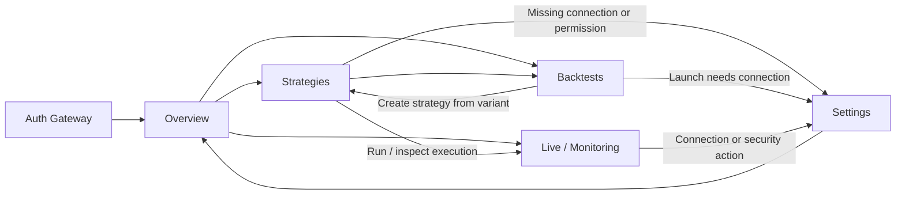

# Roehub Web App Redesign Master Plan v2

Документ фиксирует целевую продуктовую и визуальную систему Roehub как модульной, адаптивной и нативно ощущающейся web-программы без изменения доменных контрактов по умолчанию.

## Статус документа

- Статус: `implemented in apps/web; local browser verified; production delivery pending`.
- Режим: implementation; визуальный контракт проверен отдельным интерактивным прототипом, а перенос выполняется в текущем FastAPI SSR/Jinja2/CSS/vanilla JS/HTMX контуре.
- Цель: зафиксировать целевую визуальную концепцию, информационную архитектуру, состав каждой страницы, связи между страницами, адаптивную модель и поэтапный путь миграции.
- Текущий технологический контур сохраняется: FastAPI SSR, Jinja2, CSS, vanilla JS/HTMX, same-origin `/api/*`.
- Документ не является runnable prompt pack. Реализация выполняется напрямую в активном Codex Goal по отдельному production-контракту; для этого режима отдельные `stage ledger` и `prompt pack` не требуются.

## 1. Короткое решение

Roehub должен перестать выглядеть как сайт с терминальной темой и стать **нативной web-программой для исследования, запуска и контроля торговых систем**.

Целевая концепция: **Roehub Workbench — Institutional Native Research**.

Это гибрид трех проверенных направлений:

- нативная оболочка, инспекторы и пристыкованные панели из **Native Control System**;
- визуальная строгость и спокойная плотность данных из **Institutional Workbench**;
- исследовательские рабочие области из **Quant Research Studio**.

Ее основные свойства:

- спокойная институциональная визуальная система вместо постоянного оранжевого свечения;
- модульная компоновка, в которой каждый блок имеет конкретную рабочую роль;
- один главный рабочий объект на экране, а детали раскрываются прогрессивно;
- плотность данных регулируется уровнем иерархии, а не одинакова во всех панелях;
- desktop, tablet и mobile используют одну информационную модель, но разные способы представления;
- dark и light темы проектируются одновременно;
- существующие маршруты, auth, same-origin API, DTO, deep links и технические идентификаторы сохраняются;
- визуальная замена может быть поэтапной без переписывания продукта на SPA.

Терминальный мотив остается частью характера бренда, но больше не управляет всей геометрией интерфейса. Mono-типографика используется для чисел, кодов, market symbols, timestamps и технических состояний; основной интерфейс и длинный текст используют системный sans-serif.

## 2. Основание и границы анализа

### 2.1. Подтвержденное текущее состояние

По текущему коду и runtime-поверхности подтверждены:

- public routes: `/`, `/login`, `/register`, `/logout`;
- protected routes: `/dashboard`, `/strategies`, `/strategies/new`, `/strategies/{strategy_id}`, `/backtests`, `/backtests/new`, `/backtests/{job_id}`, `/settings`, `/monitoring`;
- `/monitoring` реализован как отдельная read-only рабочая область поверх существующего dashboard summary contract;
- `/strategies/new`, `/strategies/{strategy_id}`, `/backtests/new`, `/backtests/{job_id}` используют state одной canonical page, а не отдельные дизайн-системы;
- auth идет через Keycloak/OIDC; Roehub не собирает локальный пароль;
- страницы используют общий SSR shell, Jinja2 templates, CSS tokens, branded controls, locale `en`/`ru`, manual refresh/autorefresh и same-origin `/api/*`;
- текущая тема основана на почти черном фоне, тонких orange borders, плотных таблицах и terminal-style controls;
- production public page проверена в браузере на desktop и `390x844`;
- protected pages проверены как authenticated production runtime flow через разрешенный smoke account без раскрытия секрета: `/dashboard`, `/strategies`, `/backtests`, `/settings`;
- состав оставшихся поверхностей дополнительно подтвержден по templates, JS hooks, route contracts и architecture docs;
- визуальный прототип проверен отдельно и не выдается за production runtime.

### 2.2. Основные проблемы текущей модели

Структурные проблемы:

1. Header пытается одновременно быть брендом, primary navigation, theme/language control, user status и auth panel. На mobile он превращается в несколько рядов кнопок и занимает слишком много первого экрана.
2. Почти все области имеют одинаковую orange border-геометрию, поэтому главный объект, вторичные данные и служебные элементы конкурируют между собой.
3. Постоянная terminal-типографика снижает читаемость длинных labels, пояснений и настроек.
4. Bottom status bar повторяется на страницах и становится особенно тяжелым на mobile.
5. Страницы построены как максимально плотные desktop workstations, но мобильная версия в основном складывает те же блоки вертикально.
6. Стратегии смешивают библиотеку, runtime, аналитику, readiness, trades и RL/ML в одной длинной поверхности.
7. Backtests совмещает конфигурацию, очередь и результат без достаточно сильного различия между фазами работы.
8. Settings показывают много независимых панелей одновременно, хотя пользователь обычно решает одну задачу: профиль, подключение биржи, уведомления или безопасность.
9. Состояния `unavailable`, `degraded`, `stale`, `loading`, `empty` визуально недостаточно отделены от нормальных данных.

Визуальные проблемы:

- orange используется как border, focus, active state, button и decoration одновременно;
- glow и контуры создают шум вместо иерархии;
- прямоугольные панели с минимальным внутренним отступом делают продукт визуально «техническим прототипом», а не зрелой программой;
- текущий mobile auth modal уже ширины viewport и визуально конфликтует с header и CLI preview;
- интерактивные цели на desktop часто ниже рекомендуемых touch-размеров, а mobile layout не дает нативной навигационной модели.

## 3. Продуктовые цели редизайна

### 3.1. Пользовательские цели

Пользователь должен быстро понимать:

1. Что сейчас работает и где есть риск.
2. Какая стратегия, job, connection или account context сейчас выбрана.
3. Как перейти от исследования к backtest, затем к стратегии и далее к live/paper/testnet execution.
4. Где находится подтверждение действия, а где только read-only состояние.
5. Насколько свежи данные и откуда они получены.
6. Как вернуться назад без потери filters, scroll, selected item и form draft.

### 3.2. Бизнес-результат

Новая система должна:

- повысить доверие к Roehub как к профессиональному продукту;
- уменьшить риск ошибочного запуска, остановки, удаления или подключения биржи;
- сделать сложные функции видимыми, но не показывать все одновременно;
- позволить добавлять новые bounded contexts и страницы без нового визуального языка;
- сократить стоимость поддержки за счет общего component contract;
- сохранить текущую backend-архитектуру и выполнять миграцию page-by-page.

### 3.3. Что не входит в этот план

- переход на React, Next.js или full SPA;
- изменение доменных правил backtest, strategies, identity или execution;
- изменение публичных API/DTO только ради нового внешнего вида;
- хранение секретов или sensitive values в HTML/JS state;
- создание новых execution mutations до готовности backend contracts;
- AI assistant как обязательная часть первой версии редизайна;
- декоративные 3D, glassmorphism, анимированные background blobs или маркетинговый bento-grid внутри рабочей программы.

## 4. Визуальный концепт: Roehub Workbench — Institutional Native Research

### 4.1. Характер

Ключевые слова:

- institutional;
- precise;
- calm;
- modular;
- data-first;
- native-feeling;
- responsive;
- high-trust.

Визуальное направление объединяет:

- строгую сетку Swiss Modernism 2.0;
- спокойную темную поверхность профессиональных desktop-приложений;
- модульность bento/grid только как систему размеров блоков, не как декоративный прием;
- привычные паттерны native productivity apps: sidebar, top context bar, inspector, sheets, command palette, preserved navigation state.

### 4.2. Иерархия поверхностей

Вместо одинаковых terminal panels используются четыре уровня:

1. `Canvas` — фон приложения, не интерактивен.
2. `Workspace` — основная рабочая плоскость страницы.
3. `Module` — самостоятельный блок данных или действий.
4. `Overlay` — inspector, popover, dialog, sheet, command palette.

Рамки не должны присутствовать на каждом вложенном уровне. В обычном состоянии модуль отделяется surface contrast и одним subtle border. Brand accent появляется только у selected state, primary action и keyboard focus.

### 4.3. Цветовая модель

Рекомендуемый dark baseline:

Все значения ниже являются **candidate tokens**. Они не считаются принятыми до automated contrast check и browser проверки обеих тем на реальных components/states.

Первичная формульная проверка базовых foreground/background pairs дала диапазон `4.94:1-17.35:1`; это не заменяет проверку hover, disabled, chart, border и overlay states.

| Token | Значение | Назначение |
|---|---:|---|
| `--rh-canvas` | `#090C11` | фон приложения |
| `--rh-workspace` | `#0D1218` | рабочая поверхность |
| `--rh-surface-1` | `#121922` | основные модули |
| `--rh-surface-2` | `#18212C` | selected/elevated surface |
| `--rh-border` | `#2A3542` | обычные разделители |
| `--rh-text` | `#F3F6FA` | основной текст |
| `--rh-text-muted` | `#A3AFBD` | вторичный текст |
| `--rh-brand` | `#55A7C8` | спокойный сине-голубой акцент выбранного объекта и primary action |
| `--rh-brand-strong` | `#76BDD8` | hover/focus на dark surface |
| `--rh-info` | `#65A9C4` | информационные состояния |

Рекомендуемый light baseline:

| Token | Значение | Назначение |
|---|---:|---|
| `--rh-canvas` | `#EEF2F6` | фон приложения |
| `--rh-workspace` | `#F7F9FB` | рабочая поверхность |
| `--rh-surface-1` | `#FFFFFF` | основные модули |
| `--rh-surface-2` | `#F1F4F7` | selected/elevated surface |
| `--rh-border` | `#D4DCE5` | обычные разделители |
| `--rh-text` | `#151B23` | основной текст |
| `--rh-text-muted` | `#5E6977` | вторичный текст |
| `--rh-brand` | `#1F7694` | accessible brand/action |
| `--rh-brand-strong` | `#165E79` | hover/focus на light surface |
| `--rh-info` | `#257995` | информационные состояния |

Финансовые цвета остаются отдельными семантическими tokens и не меняют смысл между темами:

- positive: зеленый + знак/label;
- negative/drawdown: красный + знак/label;
- warning: amber + icon/label;
- info: blue/cyan + icon/label;
- unknown/stale: нейтральный + текст состояния.

Цвет никогда не является единственным носителем смысла.

### 4.4. Типографика

- UI и длинный текст: `Inter`, `SF Pro Text`, `Segoe UI`, system-ui fallback.
- Числа, market symbols, hashes, ids, timestamps: `JetBrains Mono`, `SFMono-Regular`, system monospace fallback.
- Tabular numbers обязательны для таблиц, PnL, time, price, quantity и progress.
- Body: 14-16px desktop, минимум 16px для mobile form inputs.
- Page title: 24-30px, без uppercase.
- Module title: 14-16px, weight 600.
- Supporting label: 12-13px, без чрезмерного letter-spacing.

Шрифты не должны загружаться с внешнего CDN. Допустим system stack или self-hosted subset.

### 4.5. Геометрия и ритм

- базовая единица: 4px;
- основной spacing rhythm: 8, 12, 16, 24, 32, 48;
- module radius: 8px desktop, 10-12px touch surfaces;
- input/button radius: 6-8px;
- panel border: 1px;
- shadow: только у overlays и selected floating inspector;
- hover не меняет layout bounds;
- default desktop control height: 36-40px;
- mobile touch target: минимум 44x44px;
- gap между touch targets: минимум 8px.

### 4.6. Motion

- feedback: 80-120ms;
- component state transitions: 150-220ms;
- sheets/dialogs: до 280ms;
- animate только `transform` и `opacity`;
- exit короче enter;
- route transitions минимальны и не блокируют input;
- `prefers-reduced-motion` отключает non-essential motion.

## 5. Новая информационная архитектура

### 5.1. Canonical routes

| Раздел | Canonical route | Роль |
|---|---|---|
| Auth gateway | `/` и `/login` | единственная public product surface; вход в программу |
| Registration | `/register` | отдельный Keycloak-backed onboarding entrypoint |
| Overview | `/dashboard` | состояние всего аккаунта и fleet overview |
| Strategies | `/strategies` | библиотека, selected strategy workspace, runtime, analytics, RL/ML |
| Backtests | `/backtests` | configure, queue, results, promotion to strategy |
| Live | `/monitoring` | execution/operations/risk/incident monitoring |
| Models | `/models` | отдельный вход в RL/ML registry и readiness; использует существующий Strategies read model |
| Connections | `/connections` | отдельный вход в lifecycle exchange/data connections; использует существующие Account contracts |
| Settings | `/settings` | account, preferences, limits, integrations, notifications, sessions и security |

Рекомендация для `/`:

- guest получает минимальный auth gateway, а не отдельный marketing landing;
- authenticated user сразу перенаправляется на `/dashboard`;
- полноценный marketing site при необходимости должен быть отдельным public контуром и не определять app shell.

### 5.2. Compatibility routes

| Route | Поведение v2 |
|---|---|
| `/strategies/new` | открывает `/strategies` в clone/create-from-source state, если backend contract готов; иначе остается compatibility alias |
| `/strategies/{strategy_id}` | открывает selected strategy workspace и сохраняет deep link |
| `/backtests/new` | открывает `/backtests` в `configure` state |
| `/backtests/{job_id}` | открывает `/backtests` с selected job/result state |
| `/logout` | компактный progress/confirmation state без самостоятельной дизайн-системы |

### 5.3. Cross-page flow

Основной продуктовый цикл:

`Research -> Backtest -> Variant -> Strategy -> Paper/Testnet/Live -> Monitor -> Improve`.

Навигация и page copy должны показывать этот цикл, а не заставлять пользователя угадывать связь между сущностями.

## 6. Общий app shell

### 6.1. Desktop, ширина от 1280px

Структура:

1. Левый sidebar `240px`, сворачиваемый до `72px`.
2. Верхний context bar `56px` над рабочей зоной.
3. Основная content grid на 12 колонок.
4. Опциональный правый inspector `320-400px`, открывающийся по выбранному объекту.

Sidebar:

- Roehub logo/wordmark;
- Overview;
- Strategies;
- Backtests;
- Live;
- Settings в нижней группе;
- компактный system health indicator;
- labels и icons; icon-only только в collapsed state с tooltip.

Top context bar:

- breadcrumb/current page;
- global search/command palette;
- environment selector `production|testnet|paper`, если разрешен текущим context;
- environment и общий connection state;
- global search/command palette.

Notifications имеют единственный вход в utility section sidebar. Account menu имеет единственного владельца в sidebar footer. Эти controls не дублируются в top context bar.

Не должно быть постоянного bottom status footer на каждой странице. Его функции переходят в:

- status center в top bar;
- freshness line внутри конкретного live module;
- collapsible diagnostics drawer;
- optional desktop ticker только на страницах, где он имеет самостоятельную ценность.

### 6.2. Tablet, `768-1279px`

- sidebar превращается в navigation rail `64-72px`;
- labels открываются в drawer;
- main grid становится 8-колоночной;
- правый inspector становится modal side sheet;
- вторичные таблицы переходят во вкладки;
- page actions группируются в overflow menu после одного primary action.

### 6.3. Mobile, `360-767px`

Структура:

- top app bar: page title, context status, overflow/account;
- bottom navigation: `Overview`, `Strategies`, `Backtests`, `Live`, `More`;
- `Settings`, locale, theme, account и diagnostics находятся в `More`;
- один основной scroll container;
- filters открываются в bottom sheet;
- detail/inspector открывается как full-height sheet;
- таблицы используют prioritized columns, row detail sheet или controlled horizontal scroll с видимым affordance;
- sticky CTA используется только для текущего workflow и не перекрывает контент;
- safe-area padding обязателен.

Bottom navigation не используется для вложенных страниц или вкладок внутри модуля.

### 6.4. Native behavior

- browser back восстанавливает selected item, tab, filters, form draft и scroll;
- ключевые views имеют deep-linkable URL state;
- route change переводит focus в page heading;
- `Cmd/Ctrl+K` открывает command palette;
- `Esc` закрывает последний overlay;
- destructive action всегда имеет понятный cancel route;
- optimistic state допустим только для обратимых low-risk actions;
- run/stop/delete/connect/rotate требуют authoritative backend result.

## 7. Подробный план страниц

## 7.1. Auth Gateway — `/`, `/login`, `/register`

### Роль

Дать безопасный и короткий вход в программу. Это не marketing homepage и не демонстрация всех возможностей.

### Desktop layout

Две области:

- слева, 7 колонок: subdued preview реального Roehub workspace, три trust facts, current environment/system status;
- справа, 5 колонок: auth panel.

Preview использует только специально подготовленный sanitized product shell или synthetic fixture. Protected screenshots, account names, positions, orders, PnL, exchange identifiers и другие authenticated data не используются как public background/asset.

Auth panel:

1. Roehub wordmark.
2. Заголовок `Sign in to Roehub`.
3. Короткое пояснение Keycloak/SSO.
4. Environment/domain indicator.
5. Primary action `Continue with Keycloak`.
6. Secondary route `Request access / Register`.
7. Safe `next` destination в human-readable виде без технического шума.
8. Language/theme в компактной верхней строке.
9. Security/privacy note.

### Mobile layout

- только auth panel и короткий system status;
- preview скрыт или сокращен до одного статичного блока;
- modal не используется как единственный mobile entrypoint: `/login` рендерит полноценную auth surface;
- primary CTA имеет ширину контейнера и высоту не менее 48px.

### Взаимодействия

- успешный login -> safe `next`, fallback `/dashboard`;
- authenticated visit `/` -> `/dashboard`;
- `Register` -> `/register` -> Keycloak registration;
- `Esc`/close modal сохраняются для login, открытого из public context;
- `401` из protected UI открывает re-auth sheet/dialog, сохраняет current route и останавливает polling/SSE.

### Состояния

- default;
- IdP unavailable;
- session expired;
- account requires access;
- logout in progress;
- reduced connectivity.

### Связи

- после входа всегда появляется app shell;
- auth surface не показывает protected data и не симулирует production PnL;
- status link может вести к отдельному operational status URL, если он существует.

## 7.2. Overview — `/dashboard`

### Роль

Ответить на вопрос: «Что происходит со всем торговым контуром прямо сейчас и где требуется мое внимание?»

### Desktop layout, 12 колонок

1. `Page context` — 12 колонок.
   - account/workspace;
   - environment;
   - selected strategy context;
   - data freshness;
   - primary action: открыть выбранную стратегию.
2. `Portfolio KPI strip` — 12 колонок.
   - equity;
   - total PnL;
   - realized/unrealized PnL;
   - exposure;
   - max drawdown;
   - active strategies/open positions.
3. `Equity & PnL chart` — 8 колонок.
   - range control;
   - equity/PnL series;
   - event markers;
   - legend toggle;
   - table alternative.
4. `Strategy fleet` — 4 колонки.
   - running/stopped/degraded tabs;
   - search, filter, sort;
   - current status, PnL, freshness, health;
   - row click -> `/strategies/{strategy_id}`.
5. `Operational activity` — 8 колонок.
   - tabs: Open positions / Recent executions;
   - bounded rows;
   - row detail -> inspector;
   - `View all` -> Live page с соответствующим filter.
6. `Health & alerts` — 4 колонки.
   - health/risk summary;
   - active alerts;
   - source freshness;
   - alert click -> `/monitoring`.
7. `Allocation & risk` — 12 колонок или две области по 6.
   - symbol allocation;
   - risk limits/current usage;
   - numbers + accessible bar/bullet chart.

### Mobile order

1. Page context.
2. Three priority KPIs + horizontal `More metrics` disclosure.
3. Alerts/health.
4. Equity chart with simplified ticks.
5. Strategy fleet.
6. Positions/Executions segmented view.
7. Allocation/Risk.

### Взаимодействия

- выбор стратегии в fleet обновляет selected context без потери scroll;
- `Open strategy` открывает Strategies workspace;
- alert открывает Live page с filter/source context;
- position/execution открывается в inspector/sheet;
- manual refresh действует на видимый data scope;
- autorefresh сохраняет no-overlap, hidden-tab pause, `retry_after_seconds` и freshness.

### Состояния

Каждый module имеет отдельные состояния:

- `ready`;
- `loading` с reserved height;
- `empty` с объяснением и action;
- `degraded` с source и recovery path;
- `stale` с timestamp;
- `unauthorized` без утечки данных;
- `error` с retry.

### Сохраняемый текущий функционал

Сохраняются selected strategy snapshot, health/risk, equity/PnL series, metric grid, open positions, recent executions, alerts, symbol allocation, strategy list и refresh/status metadata. Меняется их иерархия и способ раскрытия, но не контракт данных.

## 7.3. Strategies — `/strategies`

### Роль

Стать единым workspace выбранной стратегии: выбор, состояние, аналитика, runtime, readiness, signals, trades и RL/ML.

### Desktop layout, 12 колонок

1. `Strategy header` — 12 колонок.
   - strategy selector;
   - version, mode, exchange, market, symbols;
   - status + freshness;
   - один contextual primary action;
   - overflow: clone, export, delete;
   - lifecycle group: run, stop, restart;
   - manual entry/exit отделены как high-risk controls.
2. `Saved strategies rail` — 3 колонки.
   - search;
   - filters;
   - status and PnL;
   - selected state;
   - virtualization/pagination при большом списке.
3. `Main strategy workspace` — 6 колонок.
   - tabs: Overview, Analytics, Runtime, Signals & Trades, RL/ML;
   - content меняется внутри одной устойчивой области.
4. `Readiness inspector` — 3 колонки.
   - runtime status;
   - live profile;
   - market readiness;
   - account/connection readiness;
   - paper accounting;
   - execution outcomes;
   - collapsible groups, issues first.

### Tab inventory

`Overview`:

- strategy summary;
- KPI grid;
- current runtime state;
- last signal/execution;
- compact visual series.

`Analytics`:

- Visual Workspace tabs: Trades/Candles, Equity, Drawdown;
- Statistics tabs: Overall, Long/Short, Hourly, Risk & Execution, Monthly;
- charts and data tables share the same selected time range;
- exact data available by keyboard/tap, not hover only.

`Runtime`:

- run state;
- environment/mainnet/paper/testnet;
- checkpoint/warmup;
- source freshness;
- latency gap;
- risk and compatibility reasons;
- operator actions gated by authoritative readiness.

`Signals & Trades`:

- signal journal;
- trades table;
- outcome filters;
- export;
- manual entry/exit history and reason.

`RL/ML`:

- model status/family/champion/registry;
- activation and calibration;
- active mode;
- risk configuration;
- ticker slots/entitlements;
- source-event outcomes;
- operator controls only when allowed.

### Tablet/mobile

- saved strategies становится full-screen selection sheet;
- readiness inspector открывается кнопкой `Readiness` как side/full-height sheet;
- main tabs horizontal scroll не допускают скрытых primary actions; overflow переносит редкие tabs;
- mobile показывает strategy header, priority status и один tab за раз;
- tables используют prioritized columns и row detail sheet.

### Взаимодействия и связи

- selection сразу обновляет URL и все связанные modules;
- clone сохраняет immutable strategy model;
- delete требует destructive confirmation и clear impact;
- backtest source link -> `/backtests/{job_id}`;
- `Run` с missing connection/permission -> `/settings` в нужный section;
- live execution/incident -> `/monitoring` с strategy filter;
- created-from-variant provenance остается видимым.

### Сохраняемый текущий функционал

Сохраняются classic/RL-ML modes, statistics tabs, lifecycle actions, manual entry/exit, clone/delete, strategy library, charts, signal journal, trades, runtime/live profile, market/account readiness, paper accounting, execution outcomes, ticker slots и refresh/autorefresh.

## 7.4. Backtests — `/backtests`

### Роль

Провести пользователя через цикл: настроить эксперимент, выполнить preflight, запустить asynchronous job, сравнить варианты и создать стратегию.

### Верхний уровень

Три primary views:

1. `Configure`.
2. `Queue`.
3. `Results`.

View state отражается в URL и восстанавливается browser back.

### Configure layout, desktop 12 колонок

1. `Experiment setup` — 3 колонки.
   - base strategy;
   - timeframe/direction;
   - date range;
   - capital, fees, slippage;
   - sizing/risk mode;
   - ranking/order.
2. `Instrument universe` — 3 колонки.
   - exchange/market;
   - search;
   - selected symbols;
   - pagination/filters;
   - current data coverage.
3. `Indicator grid` — 6 колонок.
   - indicator rows;
   - parameter from/to/step or explicit values;
   - sources;
   - copy/delete;
   - combinations count and guard warnings.
4. `Preflight summary` — 12 колонок, sticky near bottom of workspace.
   - readiness;
   - validation issues anchored to fields;
   - estimated combinations/runtime;
   - worker/queue state;
   - one primary action `Run backtest`.

На mobile Configure становится stepper:

`Setup -> Instruments -> Indicators -> Review`.

Draft auto-save сохраняет ввод между шагами и не создает job.

### Queue layout

- active job summary;
- progress, elapsed, estimated remaining;
- recent events;
- jobs table with filters;
- cancel/delete separated;
- failed job shows cause + recovery action;
- refresh/autorefresh scoped to queue state.

### Results layout

1. Job selector and filters.
2. Top variants table.
3. Selected variant summary.
4. Actions: compare, export CSV, create strategy, launch strategy when ready.
5. Detail tabs:
   - Overview;
   - Equity;
   - Drawdown;
   - Monthly;
   - Symbol;
   - Trades;
   - Compatibility & Readiness.
6. Variant detail inspector with signature, provenance, data range and materialization status.

На desktop selected variant detail использует split view; на tablet/mobile открывается как page subview/full-height sheet.

### Взаимодействия и связи

- preflight advisory, create повторяет authoritative validation;
- create использует `Idempotency-Key`;
- job всегда асинхронный;
- cancel идемпотентен;
- cache miss показывает materialization status и не блокирует UI;
- table paging остается server-side;
- `Create strategy` -> `/strategies/{strategy_id}`;
- launch с missing connection/readiness -> `/settings`;
- live run после promotion -> `/monitoring`.

### Сохраняемый текущий функционал

Сохраняются workstation endpoint, runtime defaults, artifact date bounds, preflight, jobs, cancel/delete, job summary, variant detail, equity, drawdown, monthly/symbol stats, paginated trades, CSV export, compatibility/readiness, create/launch strategy, exchange connection selection, branded controls и refresh/autorefresh.

### AI assistant

AI может быть добавлен позже как contextual assistant drawer. Он не занимает постоянную центральную колонку и не запускает job без явного подтверждения пользователя.

## 7.5. Live / Monitoring — `/monitoring`

### Роль

Объединить operational control: текущие позиции, исполнения, risk gates, execution outcomes, incidents, services и source freshness. Это новая canonical page v2; текущий `/monitoring` placeholder сам по себе не подтверждает готовность backend.

### Desktop layout, 12 колонок

1. `Live context header` — 12 колонок.
   - environment;
   - account/connection;
   - strategy filter;
   - last update;
   - emergency status.
2. `Risk banner` — 12 колонок, показывается только при active issue.
3. `Positions & Orders` — 8 колонок.
   - tabs: positions, open orders, recent executions;
   - bounded table;
   - details in inspector;
   - manual controls только при готовом contract и recent auth.
4. `System & Source Health` — 4 колонки.
   - services;
   - data feeds;
   - order routing;
   - risk engine;
   - notification delivery;
   - source freshness/latency.
5. `Incident timeline` — 8 колонок.
   - warnings, errors, reconciliation events, risk blocks;
   - filters and acknowledgment when supported.
6. `Risk & Controls` — 4 колонки.
   - exposure;
   - daily loss/current limits;
   - blocked reasons;
   - read-only by default;
   - high-risk controls physically separated.
7. `Notifications` — 12 колонок или drawer.
   - delivery status;
   - Telegram/scoped notification outcomes;
   - retry/status only when backend supports it.

### Mobile

- risk status first;
- positions/orders segmented view;
- health summary;
- incidents;
- actions in bottom sheet;
- no wide persistent status footer.

### Взаимодействия и связи

- Dashboard alerts -> Live с source/severity filter;
- Strategy runtime -> Live с strategy filter;
- execution event -> strategy/backtest provenance;
- connection issue -> Settings / Exchange connections;
- notification issue -> Settings / Integrations & Notifications.

### Rollout boundary

Первый этап Live page должен быть read-only и собирать только существующие bounded read models. Новые mutation controls допускаются только после отдельной contract, auth, recent-auth, idempotency и unknown-state проверки.

## 7.6. Settings — `/settings`

### Роль

Настроить account и доверительные границы без смешивания обычных preferences с критическими exchange/security actions.

### Desktop layout, 12 колонок

1. `Settings navigation` — 3 колонки.
2. `Selected settings workspace` — 6 колонок.
3. `Context/status panel` — 3 колонки, показывается только когда помогает текущей задаче.

### Sections

`Account overview`:

- profile summary;
- plan/limits;
- locale/timezone/theme/density;
- default autorefresh;
- save state and validation.

`Exchange connections`:

- active/history tabs;
- exchange, market types, environment;
- validation/readiness;
- masked credentials only;
- connect, validate, rotate, disable, archive;
- strategy bindings and in-use blockers;
- create/rotate secrets только в modal/sheet, never in row.

`Limits & subscription`:

- plan;
- active/queued jobs;
- exchange connections;
- strategy/ticker slots;
- usage shown as value + labeled bullet/progress chart.

`Integrations & notifications`:

- Telegram binding;
- scoped notification modes;
- weekly/monthly schedules;
- integration status;
- webhook/notification preferences;
- recovery state for unavailable provider.

`Security`:

- 2FA/recent auth posture;
- session policy;
- active sessions;
- terminate other sessions;
- audit log;
- security events and recovery links.

`Audit & activity`:

- cursor-paginated events;
- filters;
- sensitive details redacted;
- actor/source/time/category;
- export only if owner-scoped contract exists.

### Tablet/mobile

- settings navigation становится list page;
- выбор section открывает subpage с native back behavior;
- context panel становится inline disclosure;
- save CTA sticky только для dirty form;
- destructive actions находятся в отдельной danger zone;
- large tables переходят в rows с detail sheet.

### Взаимодействия и связи

- Strategy/Backtest/Live могут deep-link в конкретный settings section;
- successful connection/validation возвращает пользователя в исходный workflow;
- invalid connection показывает cause + how to fix;
- secret inputs никогда не попадают в screenshots, analytics, logs, autocomplete или DOM после submit;
- unsaved changes блокируют случайное закрытие sheet/page.

### Сохраняемый текущий функционал

Сохраняются profile, limits, exchange connections, market creation, rotation, disable/archive/validate, account config, strategy bindings, integrations, Telegram/scoped notifications, preferences, sessions, audit events и current security panels.

## 7.7. Shared compatibility surfaces

`/register`:

- auth shell;
- onboarding explanation;
- Keycloak registration CTA;
- no local password form.

`/logout`:

- progress state;
- clear destination;
- retry if IdP logout unavailable;
- no marketing content.

`404/403/500/offline`:

- app shell remains when safe;
- cause and recovery path;
- no technical stack traces;
- `Retry`, `Go back`, `Open status`, `Sign in` по context;
- errors use `role="alert"` only when immediate announcement is appropriate.

## 8. Component system

### 8.1. Foundation components

- `AppShell`;
- `NavigationRail/Sidebar`;
- `TopContextBar`;
- `MobileBottomNav`;
- `PageHeader`;
- `WorkspaceGrid`;
- `Module`;
- `Inspector`;
- `StatusCenter`;
- `CommandPalette`.

### 8.2. Data components

- `KpiStrip`;
- `Metric`;
- `DataTable` with column priority;
- `VirtualizedList` for 50+ items;
- `ChartFrame`;
- `ChartLegend`;
- `DataTableFallback`;
- `FreshnessIndicator`;
- `StatusChip`;
- `RiskBanner`;
- `Timeline`;
- `Progress/BulletMeter`.

### 8.3. Interaction components

- `Button` variants: primary, secondary, ghost, destructive;
- `IconButton` with accessible name and tooltip;
- `SegmentedControl`;
- `Tabs`;
- `Combobox/Listbox/Menu`;
- `FilterBar`;
- `SearchField`;
- `DateRange`;
- `FormField`;
- `InlineValidation`;
- `Dialog`;
- `SideSheet`;
- `BottomSheet`;
- `Toast` with `aria-live="polite"`;
- `ConfirmAction`;
- `DirtyStateGuard`.

### 8.4. State components

Каждый data module обязан поддерживать один контракт состояний:

- `loading`;
- `ready`;
- `empty`;
- `stale`;
- `degraded`;
- `error`;
- `unauthorized`;
- `rate_limited`;
- `materializing`, где применимо.

State component показывает:

- что произошло;
- какие данные затронуты;
- насколько они свежи;
- что может сделать пользователь;
- когда возможен retry.

## 9. Матрица сохранения функционала

| Текущий функционал | Новая поверхность | Изменение |
|---|---|---|
| CLI public landing | Auth Gateway | сокращается до безопасного entrypoint; marketing отделяется |
| Login modal / `/login` | Auth Gateway + contextual re-auth dialog | сохраняется Keycloak и safe `next`, mobile становится полноценной surface |
| Dashboard selected strategy | Overview page context | повышается приоритет выбранного context |
| Dashboard metric grid | KPI strip + details | критичные метрики сверху, полный набор в disclosure |
| Dashboard strategy list | Fleet module | становится navigational master list |
| Positions/executions/alerts | Overview tabs + Live deep links | summary остается на Overview, полный operational flow уходит в Live |
| Strategy saved list | Strategies rail/sheet | сохраняется selection и deep link |
| Statistics tabs | Strategies / Analytics | сохраняются все вкладки, но не показываются одновременно с runtime details |
| Strategy readiness panels | Readiness inspector | issues-first progressive disclosure |
| Strategy lifecycle/manual actions | Strategy header + high-risk sheet | действия разделяются по риску |
| RL/ML panels | Strategies / RL/ML tab | сохраняются как отдельный workspace mode |
| Backtest configurator | Configure workspace | desktop multi-pane, mobile stepper |
| Jobs/progress/events | Queue view | отделяется от configure и results |
| Variant summary/charts/trades | Results view + inspector | сохраняются bounded endpoints и materialization states |
| Create/launch strategy | Backtests -> Strategies/Live | связь становится явной |
| Settings profile/limits | Account overview | объединяются по пользовательской задаче |
| Exchange keys/connections | Exchange connections section | secrets переходят в modal/sheet, readiness становится заметнее |
| Integrations/notifications | Integrations & Notifications | сохраняются scoped modes и schedules |
| Sessions/audit/security | Security + Audit | разделяются normal security posture и event history |
| Global bottom status bar | Status Center + module freshness | убирается постоянный mobile/desktop шум |
| Theme/locale controls | Account menu + Settings | остаются доступны, но не конкурируют с primary navigation |

## 10. Responsive contract

| Viewport | Navigation | Grid | Detail pattern | Tables |
|---|---|---|---|---|
| `1536+` | expanded sidebar | 12 columns | persistent inspector | full columns, sticky headers |
| `1280-1535` | collapsible sidebar | 12 columns | optional inspector | hide low-priority columns |
| `1024-1279` | compact rail | 8 columns | side sheet | prioritized columns |
| `768-1023` | compact rail/drawer | 8 columns | full-height sheet | row detail / controlled scroll |
| `360-767` | top bar + bottom nav | 4 columns | full-screen subview/sheet | row layout or explicit scroll |

Обязательные правила:

- mobile-first CSS для новых components;
- container queries для modules, где поведение зависит от ширины модуля, а не страницы;
- no horizontal document scroll;
- `min-height: 100dvh` с safe-area;
- никаких отдельных несинхронизированных mobile/desktop DOM-копий основного content;
- long labels поддерживают wrap или tooltip/expand, а не скрываются без доступа;
- charts уменьшают ticks/series и сохраняют exact data через table/details;
- fixed bars резервируют место в scroll content.

## 11. Accessibility and trust contract

- WCAG AA contrast: 4.5:1 normal text, 3:1 large text/UI glyphs;
- logical heading hierarchy;
- skip link;
- focus ring 2-4px, не удаляется;
- keyboard access ко всем функциям;
- focus trap/restore для dialogs and sheets;
- route change focus management;
- minimum mobile touch target 44x44px;
- icons имеют labels/tooltips;
- color supplemented by icon/text/sign;
- charts имеют text summary и table alternative;
- tooltips доступны по keyboard/focus/tap;
- form labels всегда видимы;
- validation on blur/submit, не шумит на каждый keystroke;
- first invalid field получает focus, длинные формы имеют error summary;
- destructive actions отделены визуально и пространственно;
- reduced motion и zoom 200% не ломают layout;
- `en` и `ru` проходят одинаковые responsive checks;
- secrets, raw provider payloads и sensitive identifiers не попадают в DOM/screenshots/logs.

## 12. Performance contract

- SSR first paint сохраняется;
- route/page assets разделяются по page module;
- below-fold modules могут lazy hydrate/load;
- chart points bounded/downsampled server-side;
- lists over 50 rows virtualized or paginated;
- layout space reserved before async content, target CLS < 0.1;
- tap/click feedback появляется до 100ms;
- skeleton/progress показывается для ожидания более 300ms;
- main-thread work per frame остается в пределах примерно 16ms;
- polling no-overlap, hidden-tab pause, coalescing and retry metadata сохраняются;
- first paint не загружает full trades/history payload;
- animations используют transform/opacity;
- third-party scripts не добавляются без отдельного security/performance review.

## 12.1. Runtime integration and side-effect boundary

Редизайн меняет presentation и navigation, но не ослабляет существующие service boundaries.

| Caller | Callee / contract | Auth / trust | Timeout, retry and unknown state |
|---|---|---|---|
| Browser | `apps/web` SSR/assets | public или authenticated cookie context | HTML failure показывает recoverable error; protected HTML остается `no-store` |
| Browser | same-origin `/api/*` -> `apps/api` | current user, same-origin/CSRF policy для mutations | read requests могут иметь bounded retry/backoff; side-effecting requests не повторяются вслепую |
| Browser | `/api/auth/login` -> Keycloak/OIDC | sanitized local `next`; Roehub не получает local password | после timeout/unknown auth state UI проверяет session, а не создает новый параллельный login flow |
| Browser | backtest create/cancel/detail | owner scope; `Idempotency-Key` для create | create retry использует ту же identity или читает existing job; cache miss показывает materialization status |
| Browser | strategy run/stop/restart/manual actions | owner scope, readiness and recent-auth policy где требуется | после timeout UI refreshes authoritative run state; blind duplicate mutation запрещен |
| Browser | exchange connection/rotate/disable/archive/validate | owner scope, same-origin, recent auth, write-only secrets | unknown provider/control state требует read-after-write/reconciliation before repeat |
| Browser | polling/SSE read models | authenticated read-only context | no-overlap, hidden-tab pause, bounded reconnect/backoff, visible freshness and `retry_after_seconds` |

Stage-specific prompts должны уточнить endpoint timeout, retryable/non-retryable errors, idempotency/dedupe identity и unknown-state recovery для каждой mutation. Этот master-план не разрешает менять существующие semantics по умолчанию.

Redaction boundary:

- cookies, tokens, API keys/secrets, raw provider payloads и secret-bearing errors не попадают в browser logs, screenshots, traces, reports или ledgers;
- account/order/connection identifiers показываются только в owner-scoped UI и сокращаются в shared QA artifacts, если полный value не нужен для проверки;
- audit events хранят actor/action/result, но не raw secret/request payload.

## 13. Поэтапный rollout

### Stage 00 — Current-state contract freeze

Результат:

- route/function inventory;
- current screenshots для всех authenticated pages и ключевых states;
- API/DTO preservation matrix;
- list of existing and missing read models;
- approved v2 page map;
- formal decision по `/` и `/monitoring`.

Gate:

- ни один существующий workflow не потерян в page matrix;
- protected browser flow доступен для visual audit;
- secrets не используются как visual fixture.

Authenticated browser QA contract:

- default smoke username: `smoke_e2e_keycloak`;
- password source of truth on `macstudio`: `/Users/daniildegtyarev/.config/roehub/roehub.env`, key `ROEHUB_SMOKE_E2E_PASSWORD`;
- password никогда не записывается в repo files, prompts, screenshots, traces, logs, reports или stage ledger;
- если безопасный password source недоступен, authenticated visual audit фиксируется как `blocked`, а static code inference не выдается за runtime observation.

### Stage 01 — Design system and responsive shell

Результат:

- semantic color, spacing, typography, radius, elevation, z-index and motion tokens;
- dark/light parity;
- sidebar/rail/top bar/mobile bottom nav;
- inspector/dialog/sheet primitives;
- shared loading/empty/degraded/error states;
- component gallery/QA route только для development/test.

Gate:

- shell проверен на `390x844`, `768x1024`, `1280x800`, `1440x1000`, `1920x1080`;
- keyboard, focus, reduced motion, 200% zoom, `en`/`ru`;
- no API behavior change.

### Stage 02 — Auth Gateway and Overview

Результат:

- login-only public surface;
- authenticated redirect;
- mobile-safe auth;
- new Overview composition;
- preserved dashboard DTOs and refresh behavior.

Gate:

- Keycloak/safe `next`/session expiry verified;
- every dashboard module has typed state;
- no invented production metrics.

### Stage 03 — Strategies workspace

Результат:

- strategy header;
- library rail/sheet;
- tabbed workspace;
- readiness inspector;
- all classic/RL-ML/runtime/trades functions preserved.

Gate:

- run/stop/restart/manual actions verified at real boundary or safely mocked only in local QA;
- route/deep-link/back state preserved;
- high-risk actions gated.

### Stage 04 — Backtests workflow

Результат:

- Configure/Queue/Results views;
- mobile stepper;
- variant inspector;
- promotion links to Strategies/Live/Settings.

Gate:

- preflight/create/idempotency/cancel/materialization/pagination verified;
- no heavy compute in API request;
- charts and tables use bounded payloads.

### Stage 05 — Settings information architecture

Результат:

- task-oriented sections;
- exchange connections flow;
- notification/integration flow;
- security/session/audit flow;
- mobile settings subpages.

Gate:

- secrets remain write-only;
- recent-auth/security requirements preserved;
- unsaved changes and deterministic errors verified.

### Stage 06 — Live / Monitoring read-only baseline

Результат:

- operational read-only surface;
- positions/orders/executions summary;
- health/source freshness;
- risk/incidents/notification outcomes;
- cross-links from Overview/Strategies/Settings.

Gate:

- only existing bounded read models used;
- missing backend areas show explicit unavailable state;
- no new mutation without separate contract stage.

### Stage 07 — Cross-page hardening and migration closure

Результат:

- full browser QA;
- accessibility smoke;
- performance/capacity evidence;
- dark/light and `en`/`ru` evidence;
- docs and old CSS/template cleanup;
- controlled production rollout and rollback target.

Delivery proof boundary:

- `target_host_readiness_pre_main` — только готовность host/path/environment, без доказательства changed code;
- `read_only_existing_runtime_smoke` — наблюдение текущего production behavior без sync/reload/migration;
- `post_main_production_runtime_proof` — changed revision уже в `main`, CI/deploy green, runtime обновлен, затем выполнен browser/API/service smoke;
- Web UI разворачивается workflow `Deploy Web` на production VPS в `/opt/roehub-web` из опубликованного GHCR image;
- Mac Studio остаётся API/backend upstream и не считается средой размещения `apps/web`;
- `/Users/daniildegtyarev/Projects/roehub.com` и `/opt/roehub/app` на Mac Studio проверяются только как граница backend/runtime, а не как доказательство web deploy.

Gate:

- no workflow regression;
- console/network errors classified;
- visual and runtime evidence collected on target breakpoints;
- docs index and repository gates pass.

Публикация и развёртывание выполняются активным Codex Goal по production-контракту `web-ui-v2-1-production-contract.md`: scoped commit в `main`, green CI, публикация GHCR image, workflow `Deploy Web` и production browser proof. Отдельные prompt pack и stage ledger для этого прямого режима не создаются.

## 14. Contract impact classification

Это классификация реализованного локального изменения до production delivery.

| Dimension | Classification | Комментарий |
|---|---|---|
| Public API contract | `none` для visual migration; `compatible-change` для новых read-only Monitoring endpoints | существующие endpoints сохраняются |
| Port contract | `none` на первых stages; `compatible-change` при новых read models | уточняется в Stage 00 |
| DTO schema | `none` для reskin; `compatible-change` при additive state/readiness metadata | breaking rename запрещен |
| Persisted schema | `none` | preferences уже имеют storage; новые tables только по отдельному плану |
| Config schema | `compatible-change` | новые theme/density/shell preferences additive |
| Request hash/cache key/persistence identity | `none` | backtest identity и public `variant_key` не меняются |
| Browser-visible behavior | `breaking-change` | намеренная полная визуальная и navigation replacement |
| Route behavior `/` | `breaking-change` | marketing landing заменяется auth gateway; нужен явный rollout decision |
| Route behavior `/monitoring` | `compatible-change` | placeholder становится canonical read-only page |
| Performance risk | `unknown` до измерений | новые composition patterns требуют browser/network evidence |

## 15. Решения, которые считаются рекомендуемым baseline

1. Roehub app имеет login-only public entrypoint.
2. Authenticated user не видит marketing landing.
3. Desktop navigation переходит в sidebar/rail; mobile — в bottom navigation максимум из пяти items.
4. `/monitoring` становится отдельной read-only canonical page v2.
5. Dark и light темы обязательны с первой foundation-итерации.
6. Постоянный orange accent убирается из рабочей системы; brand/action baseline становится спокойным сине-голубым, а amber остается только семантикой warning.
7. Mono-типографика ограничивается data/technical roles.
8. Постоянная bottom status bar не переносится в production; environment и общий connection state находятся в top context bar, а freshness и refresh controls остаются локальными внутри data modules и inspector.
9. Strategies используют tabbed workspace + readiness inspector.
10. Backtests используют Configure/Queue/Results, а mobile — stepper.
11. Реализация остается SSR/Jinja/CSS/vanilla JS/HTMX до отдельного архитектурного решения.

## 16. Acceptance checklist для master-plan

- перечислены все текущие canonical и compatibility routes;
- для каждой страницы определены роль, блоки, placement, interactions, responsive behavior и cross-page links;
- весь текущий функционал сопоставлен новой поверхности;
- auth, secrets, same-origin API, refresh/autorefresh, bounded payloads и deep links сохранены;
- новый Monitoring отделен от недоказанных mutation contracts;
- dark/light, `en`/`ru`, keyboard, touch, reduced motion и 200% zoom входят в acceptance;
- rollout разбит на bounded stages;
- contract impact классифицирован;
- локально реализованные факты, production-доказательства и оставшиеся предложения явно разделены.

## 16.1. Documentation continuity

Существующие v1 docs остаются источником API/runtime-семантики, а этот документ и `web-ui-v2-1-production-contract.md` становятся источником визуального и shell-контракта. Синхронизация выполняется узко:

- `docs/architecture/apps/web/web-ui-design-manifest-v1.md` — отметить visual contract v1 как superseded по мере rollout, а не раньше;
- `docs/architecture/apps/web/web-ui-backend-implementation-plan-v1.md` — сохранить current API/runtime facts и связать их с v2 stages;
- `docs/runbooks/web-ui-gateway-same-origin.md` — только если меняется edge/web behavior;
- `docs/runbooks/keycloak-local-setup-and-ops.md` — auth QA and recovery;
- `docs/runbooks/exchange-secret-management.md` — exchange connection/secret UI;
- `docs/runbooks/strategy-live-worker.md` и `docs/runbooks/live-execution-redis-dispatch.md` — Live/Monitoring operational flow;
- `docs/runbooks/backtest-artifacts-rebuild.md` и relevant backtest runtime docs — Backtests queue/results/materialization flow;
- `docs/runbooks/notifications-admin-alerts.md` — notifications/incident surfaces;
- `docs/architecture/README.md` — docs index entry after conflict-safe generation.

Created/modified artifacts, browser evidence, проверки и остаточные риски фиксируются в `web-ui-v2-1-browser-qa.md`, production-контракте и Git manifest. Этот master-план остаётся архитектурным документом, а не execution-ready prompt pack.

## 17. Реализованный дизайн-артефакт

Интерактивный прототип находится в:

- `prototypes/roehub-v2`;
- локальный запуск: `npm run dev -- --host 0.0.0.0 --port 4173 --strictPort`;
- локальный адрес: `http://localhost:4173`.

Это изолированная поверхность проверки дизайна. Она не подключается к production API, не хранит и не копирует smoke password, не заменяет текущий SSR/Jinja runtime и не является решением о переходе production-приложения на React.

### 17.1. Три исходных визуальных направления

На одинаковых типах экранов были разработаны и сравнены три направления:

1. **Institutional Workbench** — строгая профессиональная иерархия, спокойные поверхности, высокая читаемость таблиц и графиков.
2. **Quant Research Studio** — исследовательские рабочие области, сравнение экспериментов, моделей и параметров.
3. **Native Control System** — rail, context navigation, document tabs, inspector, activity drawer и системные overlays.

Итоговый гибрид берет оболочку из третьего направления, визуальную дисциплину из первого и структуру исследовательских сценариев из второго.

### 17.2. Полная матрица прототипа

| Рабочая область | Реализованные блоки и состояния |
|---|---|
| Auth Gateway | бренд-контекст, Keycloak redirect CTA, theme selector, безопасный `next`, переход в Overview |
| Overview | KPI, portfolio chart, drawdown, active strategies, experiments, signals, data health |
| Strategies / Library | поиск, state filter, strategy cards, selection inspector |
| Strategies / Analytics | performance, comparison, long/short attribution, risk contribution |
| Strategies / Runtime control | start/stop, positions, executions, readiness, health |
| Strategies / RL / ML | active model, training pipeline, registry, promotion readiness |
| Backtests / Configure | form, instruments, parameter space, preflight, run dock |
| Backtests / Queue | queue filters, metrics, jobs, workers, переход в completed result |
| Backtests / Results | KPI, candidate/baseline chart, variants, parameters, export/promotion actions |
| Live operations | positions, strategy health, execution stream, data freshness, local pause/resume |
| Model registry | list, selection, evaluation, promotion contract |
| Connections | providers, health, protected credential description, test action |
| Settings | six themes, density, notifications, access, defaults |
| Program map | shell, workspaces, cross-cutting surfaces, states, entities, primary flow |
| Interface states | loading, empty, error/retry, stale, restricted, disabled, success |

### 17.3. Общая оболочка и взаимодействия

Прототип реализует визуальные варианты, часть которых production-контракт намеренно упрощает:

- единственную primary context navigation с desktop collapse и mobile sheet;
- top toolbar и command search;
- document tabs с deep-link safe active tab;
- right inspector выбранной стратегии;
- activity drawer;
- status bar только как prototype evidence; production её не переносит;
- notification center;
- theme picker;
- user menu и возврат в login;
- mobile bottom navigation;
- toast confirmations.

Основной межстраничный путь остается явным:

`Backtest → Strategy → Live → Settings / Connections`.

### 17.4. Темы

Прототип использует шесть семантических схем с одинаковыми ролями token-ов:

| Тема | Яркость | Назначение |
|---|---|---|
| `abyss` | очень темная | максимальная концентрация в затемненном окружении |
| `graphite` | темная baseline | основной институциональный вариант |
| `slate` | приглушенная | повышенная светимость темной темы |
| `frost` | мягкая светлая | сниженный контраст поверхности |
| `paper` | яркая светлая | дневная работа и максимальная четкость |
| `sand` | теплая светлая | более мягкий нейтральный фон |

Цвета positive, negative, warning, info, stale и restricted не меняют смысл между темами.

### 17.5. Адаптивная модель

- Desktop `≥1280px`: единственная context navigation + workspace + contextual inspector + status surface.
- Tablet `768-1279px`: inspector скрыт, рабочая область расширена, таблицы остаются локально прокручиваемыми.
- Mobile `360-767px`: bottom navigation, navigation sheet, stacked modules, horizontal document tabs, локальный table scroll; страница не получает глобальный horizontal overflow.

Prototype browser evidence собрано при `1440x1024`, `1280x720`, `1189x611`, `1024x768`, `820x800` и `390x844`. Это ограниченная локальная концептуальная проверка, а не доказательство production SSR-интеграции, реальных API, локализации, `200%` zoom или production performance.

### 17.6. Текущее состояние переноса

Controlled перенос принятой системы в `apps/web` по контракту `web-ui-v2-1-production-contract.md` локально выполнен активным Codex Goal:

1. foundation tokens и shell;
2. Auth Gateway и Overview;
3. Strategies workspace;
4. Backtests workflow;
5. Connections и Settings;
6. read-only Live / Monitoring;
7. cross-page hardening, accessibility и local browser closure.

Оставшийся этап — scoped публикация в `main`, green CI, `Deploy Web` и production smoke на `https://roehub.com`. До него статус ограничен формулировкой `local browser verified`. Этот запуск не является staged prompt-pack execution, поэтому отдельные prompt pack и stage ledger не создаются. Runtime goal plan хранит текущий прогресс; контракт, owned-file manifest, проверки и Git history обеспечивают устойчивую трассируемость.
