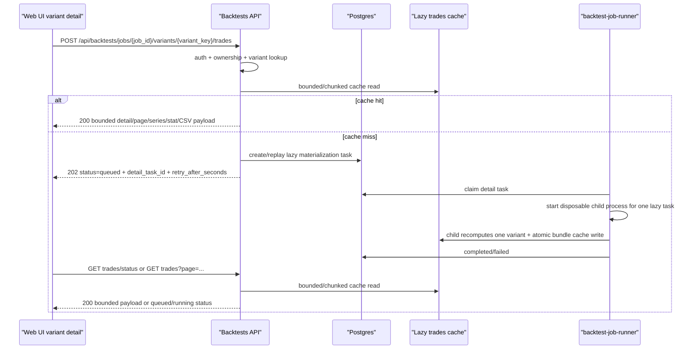

# Backtest Job Runner Production Plan v1

Статус: целевой production-план перед реализацией. Документ фиксирует решения
для отдельного `backtest-job-runner` prompt pack и закрывает runtime gaps между
job-based API, Web UI `/backtests`, lazy trades detail и Mac Studio native
operations.

Дата фиксации: 2026-05-11.

## Цель

Поднять недостающий production runtime, который исполняет persisted backtest jobs
и lazy trades materialization tasks, созданные через публичный API.

Пользовательский результат:

- `POST /api/backtests/jobs` быстро создает `queued` job;
- `backtest-job-runner` забирает job из очереди и доводит его до terminal state;
- `/backtests` показывает прогресс, top variants и result state без тяжелого
  compute в API process;
- при открытии конкретного `variant_key` Web UI получает cached trades или
  запускает bounded lazy materialization с понятным queued/running/result state.

## Текущий контекст

- `backtest_jobs` уже является durable queue boundary для full backtest jobs.
- `BacktestJobWorkerUseCase` уже задает application-level seam:
  `claim_next -> update_progress -> executor -> finish_with_top_variants`.
- `DatabaseBacktestJobExecutionTrigger` сейчас является explicit no-op trigger:
  API сохраняет row в БД, но не запускает process сам.
- `backtest_lazy_trades_materializations` уже существует как request-side queue
  boundary: миграция, порт и Postgres adapter умеют создать/replay task.
  Текущий storage/API literal: `status` в
  `queued|running|completed|failed|cancelled`, а не отдельное поле `state`.
- В production на Mac Studio нет активного `backtest-job-runner` service.
- `reload_launchd_services.sh prod` сейчас удаляет legacy
  `backtest-job-runner.*` plists и не поднимает новый runner.
- `BacktestLazyTradesDetailService` умеет deterministic recompute/cache для одного
  `variant_key`. Public jobs API сейчас на cache miss создает materialization task
  и возвращает typed `202`, но runner еще не умеет claim/execute/finish этих
  tasks. Любой production fallback к sync recompute внутри API process остается тем
  же классом риска, что и старый `sync_inline`.

## Охват

- Standalone worker process для Mac Studio.
- Очередь full jobs на базе `backtest_jobs`.
- Очередь lazy trades materialization для cache miss/detail view.
- Admission control и tier limits для `free|base|pro|ultra`.
- Lease, heartbeat, restart/reclaim и bounded retry semantics.
- Metrics/logging/Prometheus target.
- Launchd bootstrap/reload и optional Monit supervision.
- Production smoke на реальных artifacts.
- Prompt-pack decomposition для реализации.

## Что не входит

- Новая UI-страница или изменение reference-shaped `/backtests` layout.
- Возврат `sync_inline` compute в `com.roehub.api`.
- Внешний брокер Celery/RQ/Kafka/Redis Streams для v1.
- Multi-host scaling без shared object storage.
- Hard kill running compute по user cancel.
- Хранение full trades в `backtest_job_top_variants`.

## Зафиксированные решения

### 1) API остается публичным контрактом, runner является compute boundary

`com.roehub.api` владеет:

- authentication/authorization;
- request validation/preflight;
- idempotent job create;
- cancel request;
- status/progress/top/results reads;
- cache-hit lazy trades reads.

`backtest-job-runner` владеет:

- claim/reclaim queued jobs;
- full backtest execution;
- progress/heartbeat;
- terminal persistence;
- cache-miss lazy trades materialization.

API process не выполняет long-running backtest compute и не выполняет тяжелый
lazy trades cache-miss recompute в production request path.

### 2) V1 запускает responsive parent и disposable child processes

V1 target:

- один `launchd` service: `com.roehub.backtest-job-runner`;
- один long-lived parent process, который владеет claim, heartbeat, progress,
  metrics, child supervision и terminal commit coordination;
- full backtest compute выполняется в отдельном `child process` для одного job;
- каждый full-job child process является disposable и завершает работу после
  ровно одного full job, поэтому hard memory release/RSS boundary привязан к OS
  process exit, а не к Python `gc.collect()`;
- parent не строит `BacktestRuntimeJobOrchestrationService`; этот compute graph
  находится только в child entrypoint/direct benchmark/test surfaces;
- default full-job policy для Mac Studio v1:
  `ROEHUB_BACKTEST_LIGHT_CONCURRENCY=0`,
  `ROEHUB_BACKTEST_HEAVY_CONCURRENCY=1`,
  `ROEHUB_BACKTEST_HEAVY_NUMBA_NUM_THREADS=12`; все full jobs идут в один
  heavy child lane, без light/full overlap и без light promotion в hot path.

Причина: current production failure mode показал, что full compute в parent может
мешать `/metrics` и провоцировать Monit restart. Parent должен оставаться
responsive, а память full job должна возвращаться через disposable child exit.

### 3) Очередь full jobs остается в `backtest_jobs`

Full job states:

```text
queued -> running -> succeeded|failed|cancelled
```

Claim semantics:

- claim через Postgres `FOR UPDATE SKIP LOCKED`;
- heavy jobs claim FIFO по `created_at ASC, job_id ASC`;
- reclaim expired `running` jobs через `lease_expires_at <= now`;
- terminal write guarded by `(job_id, locked_by, lease_expires_at > now)`.

Scheduling semantics:

- preflight сохраняет additive metadata `request_json.scheduling`;
- metadata включает `scheduling_class`,
  `estimated_combinations_upper_bound`, `estimated_combinations`, `arity`,
  per-indicator row upper bounds, `risk_mode`, requested range и requested
  `top_n`;
- `scheduling_class=heavy` используется для всех новых full jobs, независимо от
  preflight estimate;
- старые rows с `light_candidate`/`light` metadata нормализуются в heavy path при
  исполнении full job;
- child после prepare/basic stages не выполняет light confirmation/promotion:
  exact scoring всегда стартует уже в heavy child с 12 Numba threads.

Crash/restart semantics: `at-least-once compute`, но `at-most-one terminal commit`.
Повторный compute после crash допустим, если прежний lease истек и прежний process
не смог сделать terminal write.

### 4) Lazy trades detail получает отдельную materialization queue

Web UI detail flow для выбранного варианта:



Browser-side UX contract:

- Web UI keeps a bounded in-memory result-detail cache for the current tab,
  keyed by `job_id + public variant_key`;
- repeated clicks on a variant that is already loaded in the tab render from
  browser memory and must not issue a new backend detail request;
- concurrent requests for the same `job_id + variant_key + page` are reused;
- stale in-flight variant-detail requests are aborted when the user switches to
  another variant;
- after opening a job, Web UI may prefetch the first few top variants from the
  same public API. This is a latency optimization only; the durable 14-day
  source remains the backend lazy trades cache.

Target storage для cache-miss queue:

```text
backtest_lazy_trades_materializations
```

Планируемые поля:

- `task_id UUID PRIMARY KEY`;
- `owner_user_id UUID NOT NULL`;
- `job_id UUID NOT NULL`;
- `public_variant_key TEXT NOT NULL`;
- `variant_hash TEXT NOT NULL`;
- `request_hash TEXT NOT NULL`;
- `artifact_manifest_hash TEXT NOT NULL`;
- `cache_key TEXT NOT NULL`;
- `status TEXT NOT NULL CHECK status IN ('queued','running','completed','failed','cancelled')`;
- `priority_class TEXT NOT NULL`;
- `created_at`, `updated_at`, `started_at`, `finished_at`;
- `locked_by`, `locked_at`, `lease_expires_at`, `heartbeat_at`, `attempt`;
- `last_error`, `last_error_json`;
- `cache_status`, `cache_path`, `ttl_seconds`.

Уникальность/idempotency:

- unique active key: `(owner_user_id, job_id, public_variant_key, cache_key)` для
  non-terminal или свежей successful materialization;
- повторный POST при уже queued/running task возвращает тот же task status;
- cache hit возвращает payload без создания task, но только через bounded/chunked
  readers (`metadata.json` + `trades.jsonl` bundle), без full-detail JSON load в
  API process.
- lazy cache miss исполняется только одноразовым child process; parent владеет
  claim, heartbeat, metrics, child supervision и terminal status.

API compatibility:

- `POST /trades` может возвращать `200` на cache hit и `202` на cache miss.
- Если до публичного rollout есть клиенты, ожидающие только sync `200`, это
  classified as `breaking-change`; иначе для Web UI v1 это controlled
  target-state change.

### 5) Приоритеты очередей

Один process обрабатывает две категории задач:

- `full_job`: full backtest execution;
- `lazy_detail`: materialization одного `variant_key`.

V1 policy:

- running task не прерывается;
- cache-hit lazy detail всегда отвечает API без runner;
- cache-miss lazy detail получает interactive priority над queued full jobs, но
  не может starve full jobs;
- anti-starvation guard: не более `5` `lazy_detail` подряд при наличии queued
  `full_job`, затем runner обязан взять один `full_job`.

Если evidence покажет, что detail tasks мешают full jobs или наоборот, v1.1
должен разделить runners: `backtest-job-runner` и `backtest-detail-runner`.

### 6) Cancel semantics

Full jobs:

- `queued` cancel: terminal `cancelled` без запуска compute;
- `running` cancel: cooperative cancellation через `cancel_requested_at`;
- hard kill процесса по user cancel в v1 не делается;
- runner проверяет cancel между pipeline stages и перед terminal write;
- если compute kernel не может быть прерван внутри tight loop, UI показывает
  `cancel_requested` до ближайшей cooperative boundary.

Lazy detail tasks:

- cache-miss queued task может быть cancelled/expired если UI больше не ждет;
- running detail task не kill-ится, но terminal result может быть discarded by TTL
  policy, если cache write больше не нужен.

### 7) SLA и bounded behavior

API:

- create/status/top/result endpoints: p95 < 1-2s при нормальной нагрузке;
- API не блокируется на full compute;
- cache-miss lazy detail не блокирует API до завершения recompute.

Full jobs:

- нормальный runtime: минуты или десятки минут;
- hard timeout v1 default: `6h`, configurable;
- queue wait виден через status/progress DTO и metrics.

Lazy trades detail:

- cache hit through bounded/chunked readers: p95 < 500ms target;
- cache miss при idle runner: target < 60s, evidence-dependent;
- при занятом runner UI обязан показывать queued/running state и
  `retry_after_seconds`.

## Tier limits и admission control

Источник tier: `identity_users.paid_level` / `CurrentUserPrincipal.paid_level`.

Лимиты v1 должны быть configuration-driven, но стартовые production defaults такие:

| Tier | Active full jobs (`queued+running`) | Effective running full jobs/user | Creates/hour | Max `top_n` | Max arity | Max range | Active lazy detail tasks | Lazy detail/hour | Min autorefresh |
|---|---:|---:|---:|---:|---:|---|---:|---:|---:|
| `free` | 2 | 1 | 5 | 20 | 2 | 365d | 2 | 10 | 60s |
| `base` | 5 | 1 | 15 | 50 | 3 | 730d | 5 | 30 | 30s |
| `pro` | 20 | 1 in v1, 2 after concurrency expansion | 60 | 100 | 7 | artifact coverage | 20 | 120 | 15s |
| `ultra` | 50 | 1 in v1, 4 after concurrency expansion | 240 | 250 | 10 | artifact coverage | 50 | 500 | 10s |

Global v1 defaults:

- global full compute concurrency: `1`;
- global lazy/detail concurrency: same process, no parallel compute;
- global queued full jobs cap: `200`;
- global queued lazy detail tasks cap: `500`;
- global max API create burst smoke: evidence-defined, not guessed.

Admission outcomes:

- tier quota exceeded: `429 backtest.rate_limited` with
  `retry_after_seconds`, `limit_scope`, `paid_level`;
- request too expensive: `422 backtest.request_too_expensive`;
- global queue saturated: `503 backtest.queue_saturated`;
- duplicate idempotency key with different request: `409`.

Implementation note: per-hour counters may be computed from persisted rows at v1
scale, but require indexes:

- `backtest_jobs(user_id, created_at DESC, job_id DESC)`;
- `backtest_lazy_trades_materializations(owner_user_id, created_at DESC, task_id DESC)`.

If query cost grows, move to explicit quota counter table with transactional
increments.

## Конфигурация

Planned env/config keys:

- `ROEHUB_BACKTEST_RUNNER_ENABLED=true`;
- `ROEHUB_BACKTEST_RUNNER_CONCURRENCY=1`;
- `ROEHUB_BACKTEST_RUNNER_POLL_INTERVAL_SECONDS=2`;
- `ROEHUB_BACKTEST_RUNNER_EMPTY_BACKOFF_SECONDS=5`;
- `ROEHUB_BACKTEST_RUNNER_LEASE_SECONDS=120`;
- `ROEHUB_BACKTEST_RUNNER_HEARTBEAT_INTERVAL_SECONDS=1`;
- `ROEHUB_BACKTEST_RUNNER_MAX_JOB_RUNTIME_SECONDS=21600`;
- `ROEHUB_BACKTEST_CHILD_TIMEOUT_SECONDS=21600`;
- `ROEHUB_BACKTEST_LIGHT_CONCURRENCY=0`;
- `ROEHUB_BACKTEST_HEAVY_CONCURRENCY=1`;
- `ROEHUB_BACKTEST_LIGHT_MAX_ESTIMATED_COMBINATIONS=50000`;
- `ROEHUB_BACKTEST_LIGHT_MAX_COMBINATIONS=50000` may be used as the shorter
  alias for the same preflight light threshold;
- `ROEHUB_BACKTEST_LIGHT_MAX_ACTUAL_COMBINATIONS=50000`;
- `ROEHUB_BACKTEST_NUMBA_NUM_THREADS=12`;
- `ROEHUB_BACKTEST_HEAVY_NUMBA_NUM_THREADS=12`;
- `ROEHUB_BACKTEST_RUNNER_MAX_JOBS_PER_PROCESS=10` remains parent lifecycle
  accounting only; it is not the primary full-job memory-release strategy;
- `ROEHUB_BACKTEST_RUNNER_METRICS_PORT=9204`;
- `ROEHUB_BACKTEST_DETAIL_CACHE_TTL_SECONDS=1209600`;
- `ROEHUB_BACKTEST_DETAIL_MATERIALIZATION_ENABLED=true`;
- `ROEHUB_BACKTEST_DETAIL_SYNC_FALLBACK_ENABLED=false` in production.

Test profile:

- `ROEHUB_BACKTEST_RUNNER_METRICS_PORT=19204`;
- smaller poll/timeout values are allowed only in test config.

## Observability

Logs:

- structured log fields: `event`, `task_kind`, `job_id`, `task_id`,
  `owner_user_id`, `paid_level`, `state`, `stage`, `attempt`, `locked_by`,
  `duration_seconds`, `error_code`;
- no secrets, no full request payload, no full trades payload.

Metrics must avoid high cardinality labels such as `job_id`, `variant_key`,
`user_id`, `request_hash`.

Required metrics:

- `backtest_runner_tasks_claimed_total{task_kind,paid_level}`;
- `backtest_runner_tasks_finished_total{task_kind,status}`;
- `backtest_runner_task_duration_seconds{task_kind,status}`;
- `backtest_runner_queue_wait_seconds{task_kind,paid_level}`;
- `backtest_runner_active{task_kind}`;
- `backtest_runner_active_children{scheduling_class}`;
- `backtest_runner_lease_lost_total{task_kind}`;
- `backtest_lazy_trades_cache_total{status}`;
- `backtest_quota_rejections_total{scope,paid_level,reason}`;
- `backtest_runner_last_success_unixtime{task_kind}`;

Prometheus target:

- prod: `backtest-job-runner` -> `127.0.0.1:9204/metrics`;
- test: `test-backtest-job-runner` -> `127.0.0.1:19204/metrics`.

## Mac Studio service model

V1 target:

- `launchd` owns process start/stop;
- new plist: `infra/macos/launchd/com.roehub.backtest-job-runner.plist`;
- installed by `scripts/macos/bootstrap_native_prod.sh`;
- reloaded by `scripts/macos/reload_launchd_services.sh prod`;
- logs: `/Users/daniildegtyarev/Library/Logs/roehub/backtest-job-runner.out.log`
  and `.err.log`;
- Monit may supervise/alert via launchd wrapper, but launchd remains process owner.
- Monit metrics timeout must not restart live compute; `/metrics` failure is
  alert-only for this service because parent/child supervision owns active child
  lifecycle.

Important: current runbook says legacy `backtest-job-runner` plists are removed
and runner is not in production reload baseline. Implementation must replace that
legacy exclusion with a deliberate new static service entry and prove reload does
not remove the new runner.

## Production smoke

Generic `smoke_prod.sh` is not enough. Runner acceptance requires a dedicated
smoke:

1. inspect backlog before enabling runner;
2. create controlled job through API with real production artifacts, normally
   BTCUSDT 15m and bounded `top_n`;
3. observe `queued -> running`;
4. observe `locked_by`, `started_at`, `heartbeat_at`, `lease_expires_at`;
5. observe terminal `succeeded` with `top_variants > 0`;
6. open one top `variant_key`;
7. call lazy detail endpoint;
8. on cache miss observe materialization `queued/running/completed`;
9. verify cached second read;
10. verify parent metrics endpoint and Prometheus target health while child
    compute is active;
11. verify logs contain no secrets/full payloads.

Missing artifacts/config is a blocker for production acceptance. A separate
negative test may prove graceful `backtest.artifacts_unavailable`, but it does not
replace successful runner smoke.

Existing queued work, including full jobs and lazy detail materialization tasks,
must not be the primary acceptance smoke. Rollout must first create a controlled
smoke job/detail task pair; after that, backlog can be released, cancelled, or
processed by explicit operator decision.

## Узкие места и mitigations

| Risk | Why it matters | Plan mitigation |
|---|---|---|
| Long compute loses lease | Another worker can reclaim and duplicate compute | Parent heartbeat during child execution; lease-owner guarded terminal write; at-most-one terminal commit. |
| Memory growth | Backtest runtime is array-heavy | Disposable child process per full job; parent retained RSS and child peak RSS are separate evidence. |
| Lazy trades cache miss blocks API | Detail view can repeat old `sync_inline` problem | Cache hit in API only; cache miss enqueues materialization. |
| Full job starvation by detail tasks | Interactive detail priority can delay queued jobs | Anti-starvation after 5 detail tasks while full queue non-empty. |
| Running cancel expectations | UI may imply immediate stop | Cooperative cancel only; UI displays `cancel_requested`. |
| Backlog surprise after deploy | Runner can process old queued jobs unexpectedly | Pre-enable backlog inspection and controlled smoke first. |
| Metrics cardinality explosion | Prometheus can degrade | No job/user/variant/request labels. |
| Artifact drift | Lazy recompute may not reproduce old result | Cache keys include artifact metadata; historical prefix invariant remains release gate. |
| Multi-host cache inconsistency | Local file cache is not shared | V1 single Mac Studio host; shared object storage required before scale-out. |

## План внедрения

### Этап R0 - docs/prompt freeze

- Зафиксировать этот план.
- Подготовить prompt pack `backtest-job-runner-v1`.
- Явно отделить Web UI Stage 8/9 от runtime runner implementation.

Acceptance:

- docs index check passes;
- prompt pack не содержит UI layout work.

### Этап R1 - admission control и quota contracts

- Добавить tier policy service.
- Проверять active/queued/rate/top_n/arity/date-range limits в create/preflight.
- Добавить индексы для quota reads при необходимости.
- Обновить error payloads `429/422/503`.

Acceptance:

- focused API tests for `free|base|pro|ultra`;
- idempotent replay не потребляет новый quota slot;
- request hash/cache identity unchanged.

### Этап R2 - runner process для full jobs

- Добавить `apps/worker/backtest_job_runner`.
- Wire `BacktestJobWorkerUseCase` with existing runtime services.
- Добавить loop, heartbeat, graceful shutdown, max-jobs recycle.
- Добавить unit/integration tests для claim/progress/finish/fail/reclaim.

Acceptance:

- local tests pass;
- API create remains enqueue-only;
- no full compute in API request path.

### Этап R3 - lazy trades materialization queue

- Расширить существующие storage/port/use case для
  `backtest_lazy_trades_materializations`: claim, heartbeat, terminal
  completed/failed/cancelled и worker execution.
- Изменить production cache-miss behavior: `POST /trades` returns queued/running task
  instead of blocking on recompute.
- Runner parent обрабатывает claim/heartbeat/terminal status, запускает
  disposable lazy child process и не выполняет recompute in-process.
- Lazy child writes cache atomically as a bundle: metadata/summary JSON plus
  chunk-readable trades JSONL.
- `GET /trades`/series/stat/CSV endpoints read cache/status through bounded
  cache readers and stay bounded.

Acceptance:

- cache hit returns `200`;
- cache miss returns `202` and later `200`;
- detail queue respects tier limits;
- no full trades stored in top rows.

### Этап R4 - Mac Studio service + monitoring

- Add launchd plist.
- Add bootstrap/reload entries.
- Add Prometheus target `9204`.
- Add optional Monit snippet if selected for supervision.
- Update runbooks.

Acceptance:

- `launchctl print` shows runner loaded/running;
- `curl http://127.0.0.1:9204/metrics` works;
- Prometheus target is `up`.

### Этап R5 - production smoke/load evidence

- Deploy through `publish-ci-deploy`.
- Sync Mac Studio checkout and runtime bundle.
- Run dedicated runner smoke with controlled BTCUSDT 15m job.
- Run lazy detail cache miss + cache hit smoke.
- Run small create/status burst to prove API remains responsive.

Acceptance:

- controlled job reaches `succeeded`;
- one lazy materialization reaches `completed`;
- second detail read is cache hit;
- API/auth/dashboard endpoints remain responsive;
- rollback path documented.

## Contract impact

| Surface | Impact | Notes |
|---|---|---|
| Public jobs API | `compatible-change` | Job create remains async and job-based. |
| Lazy trades API | `compatible-change` before public rollout, otherwise possible `breaking-change` | Cache miss may return `202` instead of blocking `200`. |
| Ports | `compatible-change` | Additive worker/detail queue ports. |
| DTO | `compatible-change` | Add task/status/retry fields for lazy detail. |
| Persisted schema | `compatible-change` | Additive table/indexes for materializations and quota reads. |
| Config schema | `compatible-change` | New runner/quota keys with safe defaults. |
| Cache identity | `compatible-change` | Preserve existing cache key components; add materialization metadata. |
| Runtime workflow | `compatible-change` | Heavy compute moves out of API process. |

## Открытые вопросы

- Финальные commercial tier values могут отличаться от стартовых defaults; реализация
  должна сделать их config-driven.
- Нужно ли включать Monit supervision в R4 сразу или оставить как R4.1 после
  launchd baseline.
- Нужно ли отдельное `backtest-detail-runner` process после первых latency/load
  evidence.
