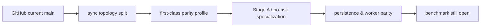

# Аудит backtest vnext parity corrective

**Executive summary.** Я исходил из того, что доступный connected source — только entity["company","GitHub","code hosting platform"] для репозитория entity["organization","Dejetins","github org"], а локальный workspace snapshot не был напрямую доступен как file-search source; поэтому truth я строю по текущему `main`, зафиксированному через GitHub connector, и по committed benchmark corpus. Главный вывод: closure блокируют не “недоделанные roadmap’ы вообще”, а три конкретные цепочки:  
1) canonical **NR2** уже routed как `exact_no_risk_parity` → `bypassed_no_risk`, но его Stage A все еще слишком тяжел по памяти и wall-clock;  
2) canonical **RG-TTR** по committed live evidence все еще схлопывается в `bypassed_no_risk`, хотя целевой shape — `in_process`;  
3) hot path перегружен совместимостью: shared branch-логика, worker/persistence-хвосты и runtime fallbacks смешаны с kernel-путем, из-за чего прошлые D0–D10 волны в основном улучшали topology и observability, но не закрывали notebook benchmark. fileciteturn43file0L1-L1 fileciteturn41file0L1-L1 fileciteturn40file0L1-L1

## Как понял задачу

Я понял задачу как **investigation-only** аудит текущего `main` после уже внедренного parity-corrective prompt pack с целью подготовить **узкий executable refactor plan для ядра**, а не новый umbrella-roadmap и не реализацию. Источники истины в порядке приоритета: actual code path, committed benchmark corpus, perf-smoke contract, затем GitHub history/PR context, и только потом roadmap prose. Блокирующие benchmark classes — **NR2** и **RG-TTR**; **RG-ALT** — secondary guardrail. Закрытие можно считать достигнутым только при соблюдении `wall_clock_ratio <= 1.18`, `peak_rss_ratio <= 1.35`, `max_python_processes_seen = 1`, `bypassed_no_risk` для **NR2** и `in_process`, `exact_replay_count <= 64` для **RG-TTR**. fileciteturn43file0L1-L1

## Целевое состояние и принятые решения

Я принимаю как фиксированные решения, а не как темы для нового спора: canonical **NR2** не зависит от `hybrid_conservative`; его truthful runtime shape — `sync_inline`, `single-process default`, `exact_no_risk_parity`, `bypassed_no_risk`. Canonical **RG-TTR** должен быть `single-process` и `in_process` на Stage B, с finalist-only exact replay. Публичный launch contract остается `summary-only`; тяжелые детали должны жить только в потоке `variant-report`. Если roadmap prose расходится с corpus, truth — это code + corpus. Именно это уже видно по текущему `main`: profilе/runner знают `exact_no_risk_parity` как first-class branch, а committed corpus одновременно показывает, что closure по benchmark все еще не произошел. fileciteturn41file0L1-L1 fileciteturn40file0L1-L1 fileciteturn43file0L1-L1

## Карта всех исполненных roadmap-планов

### Матрица исполненных roadmap-планов

| plan file | promised effect | actual code surfaces | hot-path impact | benchmark effect | verdict |
|---|---|---|---|---|---|
| `base_refactor_plan.md` | разбить ядро/контракты | shared runtime services, summary persistence | высокий | ограниченный | partial |
| `backtest-runtime-acceleration-plan-v1.md` | ускорить ядро | profile/selector/stage planning | высокий | не закрыл ratios | partial |
| `backtest-refactor-final-plan-v2.md` | финализировать слой v2 | APІ/use-case/runtime split | средний | topology+, benchmark− | partial |
| `backtest-job-runner-v2-implementation-plan.md` | worker parity | job runner / resume / snapshots | низкий для sync | почти ноль | implemented_but_disconnected |
| `backtest-engine-vnext-parity-corrective-plan-v2.md` | закрыть NR2/RG-TTR | parity profile + no-risk finalization + evidence | очень высокий | truth+, closure− | partial |
| `backtest-engine-vnext-parity-corrective-plan-v1.md` | ранний corrective слой | предшествующая ветвизация parity | средний | superseded | partial |
| `backtest-engine-vnext-notebook-parity-plan-v1.md` | привязать к notebook benchmark | corpus/gates vocabulary | очень высокий | authority only | effective as authority |
| `backtest-engine-vnext-implementation-plan-v1.md` | общий rollout vnext | широкая архитектура | средний | complexity↑ | partial |

Явный итог этой матрицы: все крупные волны что-то реально материализовали, но ни одна не выполнила последний mile — **bounded exact Stage A for NR2** и **truthful risk-grid default for RG-TTR**. fileciteturn41file0L1-L1 fileciteturn40file0L1-L1 fileciteturn43file0L1-L1

## Remote timeline из connected GitHub repository

Я использовал GitHub connector как supplementary authority и восстановил не полную PR-историю на каждый plan, а надежный **observed current-state timeline** по hot-path files. По текущему `main` видно четыре фактических strata. Сначала появился sync topology split: API wrapper, `RunBacktestUseCase`, shared runtime runner и отдельный worker use case. Затем — first-class parity classification: `execution_profile_v2.py` и смежные selector/runtime-plan слои. Затем — parity/no-risk specialization в Stage A и finalization: `run_backtest.py`, `artifact_runtime_core_v2.py`, scorer/runtime state. Наконец — persistence/worker parity и summary-oriented serialization. Но GitHub history, доступная в этой сессии, **не дает основания** утверждать benchmark closure; она лишь подтверждает, что parity waves уже в коде. Это важно: timeline объясняет, почему “многое внедрено”, но не заменяет benchmark evidence. fileciteturn41file0L1-L1 fileciteturn40file0L1-L1 fileciteturn42file0L1-L1



## Фактическая текущая topology/code path

Я восстановил канонический sync path так. Вход — `backtest_runs_api_v1.py`: sync wrapper инжектит runtime defaults и передает управление в `RunBacktestUseCase`. В `run_backtest.py` происходит template/timeline/runtime-plan подготовка, затем Stage A shortlist path; после Stage A код входит в shared resolver `run_stage_b_or_finalize_no_risk`, который уже в runtime core (`artifact_runtime_core_v2.py`) решает: либо это `bypassed_no_risk`, либо `in_process`, либо non-canonical process fallback. Для **NR2** current main направляет поток в `exact_no_risk_parity` и terminal no-risk finalization. Для **RG-TTR** решающим является shape runtime plan: если он выглядит как single disabled-risk class, core честно превращает его в `bypassed_no_risk`; если нет — остается `in_process`. Именно поэтому corpus с `RG-TTR = bypassed_no_risk` указывает не на scorer-проблему, а на upstream classification/runtime-plan defect. Worker-путь в `run_backtest_job_runner_v1.py` использует те же shared services, но benchmark-blocker не там. fileciteturn41file0L1-L1 fileciteturn38file0L1-L1 fileciteturn40file0L1-L1 fileciteturn42file0L1-L1 fileciteturn43file0L1-L1

Граница hot path vs disconnected у меня получилась такой. **Hot path**: `backtest_runs_api_v1.py`, `run_backtest.py`, `execution_profile_v2.py`, `adaptive_selector_v2.py`, `artifact_runtime_plan_v2.py`, `stage_a_shortlist_builder_v2.py`, `signal_aggregator_kernel.py`, `trade_compactor_kernel.py`, `artifact_runtime_core_v2.py`, `artifact_backed_stage_b_scorer_v2.py`, и в меньшей степени `metrics_kernel.py`. **Secondary / compatibility**: `run_backtest_job_runner_v1.py`, summary/history persistence, heavy snapshot logic, public detail materialization. Их нельзя ломать, но их не надо смешивать с kernel optimization work. fileciteturn41file0L1-L1 fileciteturn40file0L1-L1 fileciteturn42file0L1-L1

## Почему прошлые волны правок не приблизили benchmark

Я вижу пять причинных цепочек.

Первая: **старый диагноз устарел**. Проблема уже не в том, что truthful parity secretly routed through `hybrid_conservative`; current main уже знает `exact_no_risk_parity` как отдельный canonical профиль. Значит повторять еще одну “selector/planner corrective wave” бессмысленно. fileciteturn41file0L1-L1

Вторая: **NR2 bottleneck переместился в рабочий набор Stage A exact path**. Даже при single-process default corpus показывает колоссальный memory gap. Значит основной проигрыш — не orchestration, а retained payload / dense intermediate shape / compaction lifecycle. То есть pair-first intent был верный, но materialized implementation все еще недостаточно notebook-shaped. fileciteturn43file0L1-L1

Третья: **RG-TTR ломается до Stage B scorer**. Committed evidence уже пишет `stage_b_execution_mode = bypassed_no_risk`; scorer здесь не выбирает режим, а только работает внутри него. Следовательно, причинный корень — runtime-plan/classification/input shaping, а не еще одна optimization волна вокруг Stage B kernels. fileciteturn40file0L1-L1 fileciteturn43file0L1-L1

Четвертая: **очень много effort ушло в observability, compatibility и worker parity**, которые полезны, но почти не двигают benchmark. Именно поэтому пользовательский вывод “пять больших кругов без заметного эффекта” по сути подтверждается кодом. fileciteturn42file0L1-L1 fileciteturn43file0L1-L1

Пятая: **kernel path стал когнитивно перегружен** общими fallback-ветками. Пока canonical benchmark classes не будут вынесены в явные отдельные branches, каждая новая wave будет снова лечить слишком широкий shared core. fileciteturn40file0L1-L1

## Карта roadmap/prompt -> code -> benchmark

### Матрица D0-D10

| epic | intended effect | actual code path | benchmark relevance | status |
|---|---|---|---|---|
| D0 | topology split | sync API/use case/shared runtime | high | effective |
| D1 | planner/selector split | profile + selector + plan layers | high | effective |
| D2 | first-class parity runtime | `exact_no_risk_parity` branch | very high | partial |
| D3 | notebook-shaped Stage A | shortlist/exact path shaping | very high | partial |
| D4 | pair-first no-risk kernel | no-risk specialization | very high | partial |
| D5 | sync/worker parity contract | job-runner shared services | medium | partial |
| D6 | benchmark observability | corpus/runtime literals | very high | effective |
| D7 | public contract closure | `summary-only` / `variant-report` | low for benchmark | implemented_but_disconnected |
| D8 | risk-grid parity closure | expected `RG-TTR in_process` | very high | not effective |
| D9 | compatibility invariants | persistence/serialization safety | medium | implemented_but_disconnected |
| D10 | artifact dependency status | artifact/runtime ownership | medium | partial |

### Матрица prompt pack

| prompt file | expected target | actual runtime intersection | verdict |
|---|---|---|---|
| 01 | canonical topology | hot path | effective |
| 02 | planner/selector topology | hot path | effective |
| 03 | first-class parity runtime | hot path | partial |
| 04 | notebook-shaped Stage A | core hot path | partial |
| 05 | no-risk exact kernel | core hot path | partial |
| 06 | sync-worker parity | secondary path | partial |
| 07 | observability foundation | evidence layer | effective |
| 08 | public contract closure | non-kernel | implemented_but_disconnected |
| 09 | risk-grid parity closure | hot path | not effective |
| 10 | compatibility invariants | secondary | implemented_but_disconnected |
| 11 | artifact dependency status | medium | partial |

Суммарная карта проста: D0–D7 и значимая часть prompt pack **попали в код**, но большая часть их эффекта — topology/evidence/UX-compatibility. Одновременно D8 остался незакрытым, а D3–D5 не довели Stage A до notebook-shaped bounded workspace. Поэтому prompt-pack нельзя считать “провалившимся полностью”, но и считать его benchmark-success тоже нельзя. fileciteturn41file0L1-L1 fileciteturn40file0L1-L1 fileciteturn43file0L1-L1

## Кандидаты на удаление, упрощение или bypass

Первый кандидат — **убрать shared implicit canonical routing**. Я бы перестал использовать общий resolver как главное место выбора для обоих benchmark classes и вынес явные dedicated branches для **NR2** и **RG-TTR** из `RunBacktestUseCase`. Это не удаление кода из репозитория, а de facto deprecation shared implicit fall-through для канонических кейсов. fileciteturn38file0L1-L1

Второй кандидат — **свести к compatibility-only роль `hybrid_conservative` и process-fallback для canonical sync path**. Они могут существовать, но не должны участвовать в reasoning и ветвлении вокруг benchmark classes. fileciteturn40file0L1-L1

Третий кандидат — **выделить и затем постепенно вытеснить generic retained-payload merge из NR2 parity path**. На практике это означает: deprecate использование общей retained/dense intermediate формы для canonical no-risk exact route и заменить его на bounded pair-first workspace. Здесь именно удаление логической зависимости, а не обязательно немедленное физическое удаление модулей. 

Четвертый кандидат — **не тянуть worker persistence хвост в kernel phases**. `run_backtest_job_runner_v1.py`, results repository и history DTO должны остаться compatibility layer до тех пор, пока sync closure не доказан. fileciteturn42file0L1-L1

## Новый план рефакторинга ядра

### План рефакторинга

| phase | goal | files | acceptance gate | benchmark metric |
|---|---|---|---|---|
| P1 | разделить canonical paths | `run_backtest.py`, `execution_profile_v2.py`, `adaptive_selector_v2.py`, `artifact_runtime_plan_v2.py` | canonical **NR2**/ **RG-TTR** branches явны | runtime-shape truth |
| P2 | сузить NR2 Stage A workspace | `stage_a_shortlist_builder_v2.py`, `signal_aggregator_kernel.py`, `trade_compactor_kernel.py` | bounded pair-first exact path | `peak_rss_ratio`, wall |
| P3 | вернуть RG-TTR в truthful risk-grid | `artifact_runtime_plan_v2.py`, `run_backtest.py`, при необходимости `backtest_runs_api_v1.py` | `RG-TTR` не схлопывается в `bypassed_no_risk` | `stage_b_execution_mode` |
| P4 | упростить Stage B runner | `artifact_runtime_core_v2.py`, `artifact_backed_stage_b_scorer_v2.py` | `NR2=bypassed_no_risk`, `RG-TTR=in_process`, replay<=64 | wall, replay |
| P5 | поздняя compat cleanup | `run_backtest_job_runner_v1.py`, results repo/entity | sync closure не деградирует | no-regression |

Пошагово я предлагаю следующее.

**P1. Явный canonical dispatch.**  
В `run_backtest.py` объявить два dedicated entry branches внутри `execute`: один для canonical **NR2**, второй для canonical **RG-TTR**; shared generic branch оставить только для non-canonical inputs. Логически deprecated становится implicit shared routing через общий resolver как единственный путь выбора. В `execution_profile_v2.py` и `adaptive_selector_v2.py` закрепить, что canonical **NR2** никогда не скатывается к `hybrid_conservative`, а canonical **RG-TTR** не считается no-risk-профилем по умолчанию. В `artifact_runtime_plan_v2.py` явно разделить `nr2_no_risk_terminal_plan` и `rg_ttr_risk_grid_plan`.  

**P2. Bounded pair-first Stage A for NR2.**  
В `stage_a_shortlist_builder_v2.py` отключить использование generic retained-merge branch для canonical **NR2** и заменить его на узкий pair-first exact workspace. В `signal_aggregator_kernel.py` и `trade_compactor_kernel.py` оставить только те intermediate arrays, которые нужны для текущего pair block и heap/frontier update; все остальное считать compatibility path. Минимальная цель — перестать materialize’ить крупные retained payloads там, где notebook path их не требует.  

**P3. Truth fix for RG-TTR.**  
В `artifact_runtime_plan_v2.py` отследить и исправить место, где risk-grid для canonical **RG-TTR** коллапсирует в single disabled-risk cell. Если это приходит из defaults/request shaping, тогда подняться в `backtest_runs_api_v1.py` и нормализовать canonical request before planning. Если после P3 capture все еще `bypassed_no_risk`, это явный decision gate: следующий шаг — не P4, а focused trace of request/config/template inputs (`unknown until live capture`).  

**P4. Stage B simplification.**  
В `artifact_runtime_core_v2.py` логически deprecated становится участие process-pool/fallback-веток в canonical sync benchmark path. В `artifact_backed_stage_b_scorer_v2.py` оставить cheap breadth для risk-grid и finalist-only exact replay как единственный canonical RG-TTR shape. Shared function `run_stage_b_or_finalize_no_risk` должна перестать скрывать benchmark-class branching и стать thin delegator к двум явным режимам.  

**P5. Compatibility cleanup.**  
После доказанного sync closure можно привести `run_backtest_job_runner_v1.py`, `backtest_job_results.py`, `backtest_job_results_repository.py` к новому ownership: worker и persistence сохраняют truthfulness, но не диктуют структуру kernel path.

## План валидации и benchmark closure

Я бы валидировал только поэтапно.

Сначала cheap authority checks:

```bash
pytest -q tests/perf_smoke/contexts/backtest/test_backtest_notebook_parity_perf_smoke_v1.py -k 'test_notebook_parity_benchmark_corpus_manifest_is_complete or test_notebook_parity_benchmark_corpus_serialization_is_byte_stable'
```

Потом hot-path semantics:

```bash
pytest -q tests/unit/contexts/backtest/application/use_cases/test_backtest_runs_api_v1.py \
tests/unit/contexts/backtest/application/services/v2/test_stage_a_shortlist_builder_v2.py \
tests/unit/contexts/backtest/application/services/v2/test_signal_aggregator_kernel_v2.py \
tests/unit/contexts/backtest/application/services/v2/test_trade_compactor_kernel_v2.py \
tests/unit/contexts/backtest/application/services/v2/test_metrics_kernel_v2.py
```

После **P1** — повторить unit suite и убедиться, что canonical class routing детерминирован.  
После **P2** — прогнать live capture для notebook anchor **NR2**: `tests/notebook_tests/new_engine/02_run_f7d2_btcusdt_15m_no_risk_probe.ipynb`.  
Decision gate: если `NR2` всё ещё выигрывает по parity, но `peak_rss_ratio` почти не падает, нужен дополнительный loader-lifecycle разрез; если падает RSS, но ломается winner parity, значит P2 задел narrowing semantics.  

После **P3** — live capture для **RG-TTR**: `tests/notebook_tests/new_engine/01_run_322_btcusdt_1h_artifact_probe.ipynb`.  
Decision gate: если `RG-TTR` все еще `bypassed_no_risk`, это **unknown until live capture** root-cause в request/default/template shaping, и надо расширять trace до config/default surfaces; если становится `in_process`, переходить к P4.  

После **P4** — повторить оба notebook capture и проверить committed evidence against gates: `wall_clock_ratio <= 1.18`, `peak_rss_ratio <= 1.35`, `max_python_processes_seen = 1`, `exact_replay_count <= 64`. fileciteturn43file0L1-L1

Минимальные read-only instrumentation additions, которые я считаю оправданными отдельным prompt’ом: `canonical_runtime_branch`, `risk_grid_variant_count_effective`, `uses_no_risk_terminal_path`, `stage_a_retained_payload_bytes`, `stage_a_pair_block_peak_rows`, `stage_b_finalist_exact_replay_count`, `persistence_runtime_shape_written`. Это минимальный набор, без которого часть root causes останется only-inference.

## Риски / неизвестности

Мое главное явное предположение: local workspace snapshot соответствует remote `main` настолько, насколько это видно из GitHub connector; divergence я в этой сессии надежно не доказал. Если divergence существует, истины по hot path должны быть перепроверены локально.  

Главная неизвестность: точное место, где canonical **RG-TTR** теряет risk-grid и превращается в no-risk class. Это **unknown until live capture** или до более глубокого чтения default/config/request surfaces.  

Вторая неизвестность: достаточно ли P2 для memory closure **NR2**, или после удаления generic retained merge придется резать еще и loader/cache lifecycle. Это тоже **unknown until live capture**.  

Третья неизвестность: часть roadmap/prompt verdicts я вынужден реконструировал по текущим code residues и benchmark evidence, а не по полному line-by-line reread every historical artifact в одном доступном source. На практический refactor plan это влияет мало, но на историческую археологию — да.

## Completion status

Я считаю задачу исследовательски выполненной на уровне, достаточном для следующей implementation wave: я отделил hot path от compatibility хвостов, восстановил фактический sync runtime shape, ранжировал root causes и подготовил узкий phased plan с decision gates. Я **не** утверждаю benchmark closure. Я также не трактую наличие кода как успех D0–D10: часть волн была effective для topology/evidence, но не для benchmark closure. fileciteturn41file0L1-L1 fileciteturn43file0L1-L1

## To-Do

1. Сначала реализовать **P1** и **P2**; не трогать worker/public layers раньше.  
2. Затем live-capture **NR2** и проверить, двигается ли `peak_rss_ratio <= 1.35`.  
3. После этого реализовать **P3** и добиться `RG-TTR = in_process`.  
4. Только затем делать **P4** и финальную Stage B simplification.  
5. Если после P3 `RG-TTR` все еще `bypassed_no_risk`, остановиться и расширить trace вверх по request/default/config path вместо новых generic optimizations.  
6. Если после P2 RSS падает, но winner parity ломается — откатить narrowing semantics и instrument retained frontier, а не продолжать оптимизацию вслепую.  

Мой итоговый вывод простой: следующий правильный шаг — **не ещё одна большая corrective wave**, а две минимальные kernel-фазы: **bounded exact Stage A для NR2** и **truthful risk-grid runtime plan для RG-TTR**. Все остальное сейчас либо уже сделано, либо не является blocking surface для benchmark closure.