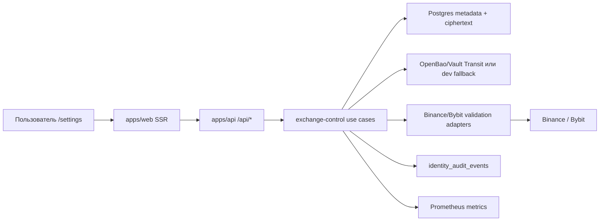

# Идентификация + Биржевые Подключения — хранение API-ключей v1

Статус: целевое архитектурное решение на согласование перед реализацией.

Документ фиксирует архитектуру первого production-этапа для Binance/Bybit
API-ключей на `/settings`: добавление, безопасное хранение, валидация,
ротация, отключение, audit, метрики и операционный контроль.

Этот документ намеренно не проектирует торговое исполнение. Размещение ордеров,
`exchange-execution`, order ledger, hot path сигнала и native order adapters
выносятся в отдельное будущее решение после появления контракта:

```text
strategy signal -> execution intent -> risk gate -> order submit -> ack/fill -> reconciliation
```

Пока такого контура в репозитории нет, попытка проектировать исполнение ордеров
в рамках задачи хранения ключей будет преждевременной.

## Цель

Построить безопасный и наблюдаемый контур биржевых подключений, который позволяет
пользователю на `/settings` добавить Binance/Bybit API-ключ, сохранить его без
утечки секретов, проверить права ключа, увидеть статус подключения, повернуть
или отключить ключ и получить понятный audit trail.

Критерий качества: каждый этап внедрения имеет проверочный рубеж с конкретными
runtime-вызовами. Нельзя переходить к следующему этапу, пока текущий этап не
доказан через API calls, DB evidence, Prometheus/Monit evidence и grep-проверку
секретов в логах/артефактах.

## Контекст

Что уже есть в репозитории:

- `identity_exchange_keys` хранит API-учетные данные для `binance`/`bybit`.
- Storage policy v2 уже запрещает возврат `api_secret`/`passphrase` через API и
  использует зашифрованные blobs для API key/secret.
- `/settings` уже содержит видимую в браузере панель биржевых ключей и вызывает
  `/api/exchange-keys`.
- `apps/api/routes/ui_account.py` уже содержит account/preferences/sessions/audit
  API и шаблон защиты мутаций same-origin.
- `strategy_live_runner` сейчас обрабатывает свечи, сигналы и realtime-вывод, но
  не имеет production-контракта отправки сигналов на исполнение сделок.
- Продуктовый runtime на Mac Studio уже использует отдельные процессы,
  `--metrics-port`, Prometheus scrape targets, правила alerting, launchd и
  контроль через Monit.

Внешние факты, которые влияют на дизайн:

- Binance signed endpoints требуют типы прав API-ключа; Binance разделяет
  `TRADE`, `USER_DATA`, `USER_STREAM`, а API key по умолчанию не имеет `TRADE`.
- Binance предоставляет `GET /sapi/v1/account/apiRestrictions` для проверки
  прав API-ключа, IP-ограничений и опасных capabilities.
- Bybit `GET /v5/user/query-api` возвращает метаданные API-ключа: `readOnly`,
  `permissions`, `ips`, expiry fields и пустой `secret`.
- Bybit имеет отдельные IP/rate-limit правила и региональные ограничения egress.
- OpenBao/Vault Transit-compatible secret engine подходит как сервис шифрования:
  key material не хранится в приложении, а Postgres хранит ciphertext и metadata.

## Охват

Входит:

- жизненный цикл биржевого подключения пользователя;
- безопасное хранение API key/secret/passphrase;
- версии учетных данных и ротация;
- связь подключения с `owner_user_id`;
- валидация прав, IP-политики, окружения и account mode Binance/Bybit;
- browser/API контракт `/settings`;
- audit events для добавления, валидации, ротации, отключения и удаления;
- Prometheus metrics для контуров хранения/валидации;
- обязательный launchd/Monit контроль `exchange-control` до включения внешней
  Binance/Bybit validation;
- stage gates с конкретными runtime-вызовами.

Не входит:

- размещение, отмена или сверка ордеров;
- `exchange-execution`;
- order ledger;
- signal-to-execution transport;
- risk engine для торговых лимитов;
- private user streams для fills/orders;
- live trading canary;
- native order adapters Binance/Bybit;
- portfolio accounting или OMS;
- withdrawal, transfer, earn, P2P, wallet-moving операции.

## Ключевое Решение

Текущая задача строит только capability `Exchange Control`.

`Exchange Control` отвечает за:

- прием write-only API-ключей от пользователя;
- шифрование и сохранение секретов;
- стабильный `exchange_connection_id`;
- версии credentials;
- проверку прав ключа на бирже без размещения ордеров;
- статусы подключения;
- rotate/disable/delete;
- audit;
- метрики;
- операционные проверки.

`apps/api` и `/settings` остаются facade/read-model. Они не получают plaintext
секреты, не импортируют биржевые SDK напрямую и не выполняют торговые действия.



## Направление Зависимостей

- `identity` владеет пользователями, сессиями и current-user моделью.
- `exchange_control` владеет подключениями, версиями credentials, validation
  state и политикой шифрования секретов.
- `apps/api` валидирует/authenticates HTTP, вызывает use cases и мапит DTO.
- `apps/web` рендерит masked read models и write-only forms.
- Биржевые validation adapters живут только на outbound-краю.
- OpenBao/Vault client живет только за портами secret cipher и credential
  resolver.
- `strategy` и любые будущие execution-модули получают только `connection_id` и
  non-secret metadata, но не секреты.

## Публичная Модель

### Таксономия Рынка v1

В v1 фиксируется совместимый с текущим backend/UI контракт:

- `market_type`: `spot` или `futures`.

Причина: существующие migration, API DTO, identity use case и strategy модели уже
используют `spot|futures`. Переход на `linear|inverse` без отдельной миграции
будет breaking change для текущих контрактов.

Mapping strategy v1:

| Биржа | Exchange-specific рынок | `market_type` v1 | Где хранить детализацию |
|---|---|---|---|
| Binance | Spot | `spot` | `permission_summary_json` / validation metadata |
| Binance | USD-M Futures / COIN-M Futures | `futures` | `permission_summary_json.exchange_market_category` |
| Bybit | Spot | `spot` | `permission_summary_json` / validation metadata |
| Bybit | Linear / Inverse derivatives | `futures` | `permission_summary_json.exchange_market_category` |

Отдельные значения `linear` и `inverse` допустимы только в будущем решении по
market taxonomy, после явной миграции API, схемы БД, UI и strategy contracts.

### Биржевое Подключение

Стабильный пользовательский объект:

- `connection_id`;
- `owner_user_id`;
- `exchange_name`: `binance` или `bybit`;
- `market_type`: `spot` или `futures`;
- `environment`: `testnet`, `mainnet`, опциональный exchange-specific demo mode;
- `label`;
- `active_credential_version_id`;
- `status`;
- `permission_summary`;
- `ip_restriction_status`;
- `last_validated_at`;
- `disabled_at`;
- без секретных полей.

### Версия Учетных Данных

Заменяемая версия секретного материала:

- `credential_version_id`;
- `connection_id`;
- `api_key_ciphertext`;
- `api_secret_ciphertext`;
- `passphrase_ciphertext`, когда нужен;
- `api_key_last4`;
- `api_key_fingerprint_hmac`;
- `secret_cipher`: `openbao_transit_v1`, `vault_transit_v1` или локальный dev
  fallback;
- `transit_key_id`;
- `credential_scheme`: изначально `hmac_sha256`, с расширением до RSA/Ed25519;
- `created_by_user_id`;
- `created_by_session_id`;
- `status`: `active`, `rotated`, `disabled`, `revoked`, `validation_failed`;
- временные отметки.

Почему нужен `connection_id`, а не только `key_id`: ротация ключа не должна
ломать будущую связь стратегии, истории запусков или audit trail с биржевым
подключением.

## Управление Секретами

Целевое продуктовое решение: использовать OpenBao Transit как основной
open-source secret engine. HashiCorp Vault Transit-compatible реализация
допустима, если это разрешает политика deployment.

Обоснование:

- Postgres хранит ciphertext и lifecycle metadata, а не plaintext;
- encryption keys находятся вне app process config Roehub;
- OpenBao/Vault ACL может выдавать разные capabilities разным сервисам;
- Transit поддерживает ротацию ключей и rewrap без раскрытия plaintext;
- backup базы не становится plaintext secret backup.

Права сервисов:

| Сервис | Права Transit |
|---|---|
| `apps/api` | без decrypt; вызывает только exchange-control use case/API |
| `exchange-control` | encrypt, HMAC/fingerprint, ограниченный decrypt для валидации |
| ops/admin | key create/rotate/rewrap, без обычного доступа к credentials приложения |

Transit ACL создается только после появления стабильной service identity
`exchange-control`. До этого этапа можно проектировать интерфейсы и локальные
tests, но нельзя считать ACL production-ready: неизвестно, какому runtime
principal выдаются `encrypt/decrypt/hmac` capabilities.

Fallback для локальной разработки:

- текущий AES-GCM envelope cipher может остаться для local/dev и migration tests;
- product/live-ready режим должен fail closed, если настроен с dev-only KEK или
  без Transit/OpenBao backend;
- миграция от текущих encrypted blobs к Transit ciphertext должна быть отдельным
  этапом re-encryption с evidence и rollback.

Обязательные правила:

- никаких API secret в browser responses;
- никакого plaintext в логах, метриках, трассировках или исключениях;
- никаких secret-like values в Playwright artifacts;
- объект credentials имеет redacted `repr`;
- labels метрик никогда не включают `user_id`, `connection_id`, `api_key` или
  raw symbol;
- credential decrypt аудируется и считается метрикой.

## Валидация Подключения

Валидация подключения не размещает ордера.

Проверки:

- credentials могут подписывать authenticated requests;
- endpoint окружения соответствует выбранному `environment`;
- permissions соответствуют заявленной capability;
- dangerous permissions отсутствуют или явно отклонены;
- IP restriction присутствует, когда этого требует политика Roehub;
- exchange account mode поддерживается;
- egress region разрешен для биржи;
- rate-limit headers/errors нормализованы.

Статусы подключения:

- `pending_validation`;
- `valid_readonly`;
- `valid_trade_enabled`;
- `invalid_credentials`;
- `invalid_permissions`;
- `invalid_ip_restriction`;
- `unsupported_account_mode`;
- `disabled_by_user`;
- `disabled_by_policy`;
- `stale_validation`.

Важно: `valid_trade_enabled` не означает, что Roehub готов торговать. Это только
подтверждает, что ключ имеет торговые права. Торговля остается заблокированной,
пока отдельный будущий контур signal-to-execution не будет спроектирован,
реализован и принят.

## Хранение

Целевая schema является additive и может быть разбита на несколько migrations.

```sql
CREATE TABLE exchange_connections (
    connection_id UUID PRIMARY KEY,
    owner_user_id UUID NOT NULL REFERENCES identity_users(user_id) ON DELETE CASCADE,
    exchange_name TEXT NOT NULL,
    market_type TEXT NOT NULL,
    environment TEXT NOT NULL,
    label TEXT NULL,
    active_credential_version_id UUID NULL,
    status TEXT NOT NULL,
    status_reason TEXT NULL,
    permission_summary_json JSONB NOT NULL DEFAULT '{}'::jsonb,
    ip_restriction_status TEXT NOT NULL DEFAULT 'unknown',
    remote_account_fingerprint BYTEA NULL,
    last_validated_at TIMESTAMPTZ NULL,
    last_used_at TIMESTAMPTZ NULL,
    created_at TIMESTAMPTZ NOT NULL,
    updated_at TIMESTAMPTZ NOT NULL,
    disabled_at TIMESTAMPTZ NULL
);
```

```sql
CREATE TABLE exchange_credential_versions (
    credential_version_id UUID PRIMARY KEY,
    connection_id UUID NOT NULL REFERENCES exchange_connections(connection_id),
    api_key_ciphertext TEXT NOT NULL,
    api_secret_ciphertext TEXT NOT NULL,
    passphrase_ciphertext TEXT NULL,
    api_key_last4 TEXT NOT NULL,
    api_key_fingerprint_hmac BYTEA NOT NULL,
    secret_cipher TEXT NOT NULL,
    transit_key_id TEXT NOT NULL,
    credential_scheme TEXT NOT NULL,
    status TEXT NOT NULL,
    created_by_user_id UUID NOT NULL REFERENCES identity_users(user_id),
    created_by_session_id UUID NULL,
    created_at TIMESTAMPTZ NOT NULL,
    rotated_at TIMESTAMPTZ NULL,
    disabled_at TIMESTAMPTZ NULL
);
```

Текущую `identity_exchange_keys` нужно сохранить как compatibility surface на
переходный период с явной dual-read стратегией:

- новые записи создаются в `exchange_connections` и
  `exchange_credential_versions`;
- legacy `GET /api/exchange-keys` читает compatibility projection из новых
  таблиц после backfill;
- до завершения backfill допускается dual-read: сначала новые таблицы, затем
  `identity_exchange_keys`;
- dual-write не используется как долгосрочный режим, чтобы не получить две
  конкурирующие истины о секрете;
- rollback до legacy endpoint возможен, пока `identity_exchange_keys` не удалена
  и backfill не помечен irreversible;
- external API на всех фазах не возвращает secret/ciphertext/HMAC.

## API/UI Контракты

Текущие compatibility endpoints остаются до deprecation:

- `POST /api/exchange-keys`;
- `GET /api/exchange-keys`;
- `DELETE /api/exchange-keys/{key_id}`.

Целевые account endpoints:

- `GET /api/ui/account/exchange-connections?cursor=&limit=`;
- `POST /api/ui/account/exchange-connections`;
- `POST /api/ui/account/exchange-connections/{connection_id}/validate`;
- `POST /api/ui/account/exchange-connections/{connection_id}/rotate`;
- `POST /api/ui/account/exchange-connections/{connection_id}/disable`;
- `DELETE /api/ui/account/exchange-connections/{connection_id}`.

Правила DTO:

- без `api_secret`, `passphrase`, ciphertext, fingerprint, HMAC и raw exchange
  error body;
- включать masked key suffix, status, permission summary, environment, последнюю
  валидацию, доступность действий и risk warnings;
- cursor pagination для connections и audit events;
- deterministic errors: `exchange_connection_not_found`,
  `exchange_connection_not_owned`, `exchange_connection_invalid`,
  `exchange_connection_validation_failed`, `recent_auth_required`,
  `csrf_required`.

Требования UI:

- `/settings` показывает реальный validation status, а не синтетические
  latency/status;
- выбор environment явный;
- выбор permissions явный: `read` по умолчанию, `trade` только как осознанное
  повышение capability; hardcoded `trade` запрещен;
- IP allowlist guidance показывает Roehub outbound IP/runbook state;
- add/rotate credentials работают через write-only forms;
- destructive actions требуют typed confirmation;
- после submit/failure password inputs очищаются;
- account limits/counts берутся из backend read model, без hardcoded
  `exchange_connections_used=0` или `api_keys_used=0`;
- browser QA обязан выполнять grep artifacts на secret-like markers.

## Операционный Дизайн

Начальные security/schema этапы могут жить в API-процессе, пока они не делают
внешнюю биржевую validation и не требуют production decrypt. Но перед любыми
реальными Binance/Bybit validation calls `exchange-control` должен быть выделен
в обязательный supervised process с собственной service identity, metrics,
healthcheck, launchd и Monit. Это не optional optimization, а gate безопасности и
операционной наблюдаемости.

Планируемый процесс:

- `exchange-control` на `127.0.0.1:9205/metrics`;
- health/readiness endpoint: `127.0.0.1:9205/health/ready`;
- launchd: `infra/macos/launchd/com.roehub.exchange-control.plist`;
- Monit: `infra/scripts/monit/roehub-exchange-control.monitrc`;
- Prometheus scrape job в `infra/macos/prometheus/prometheus.prod.yml`;
- alert rules в Mac Studio monitoring rules;
- runbook update в `docs/runbooks/mac-studio-monitoring-plan.md`.

Обязательные метрики:

- `exchange_control_active`;
- `exchange_connection_create_total{exchange,result}`;
- `exchange_connection_validation_total{exchange,result,reason}`;
- `exchange_connection_status{exchange,status}`;
- `exchange_credential_rotation_total{exchange,result}`;
- `exchange_credential_disable_total{exchange,result}`;
- `exchange_credential_decrypt_total{service,result}`;
- `exchange_api_requests_total{exchange,api_group,result}`;
- `exchange_api_rate_limited_total{exchange,api_group}`.

Запрещенные labels:

- `user_id`;
- `connection_id`;
- `credential_version_id`;
- `api_key`;
- raw exception text;
- secret-like values.

Минимальные alerts:

- `ExchangeControlDown`;
- `ExchangeValidationFailuresGrowing`;
- `ExchangeCredentialDecryptFailures`;
- `ExchangeRateLimitedGrowing`;
- `ExchangeNoRecentSuccessfulValidation`, если включена регулярная revalidation.

## Контроли Безопасности

- Keycloak step-up/recent-auth обязателен для add/rotate/delete/disable
  credentials.
- CSRF fail-closed обязателен для всех browser mutations. Принимается либо
  валидный CSRF token, либо строгий same-origin guard, который отклоняет
  cross-origin запросы и запросы без `Origin`/`Referer`, если CSRF token не
  прошел проверку.
- Audit events включают user, session, IP/user-agent hash, action, старое/новое
  состояние без секретов и reason code.
- Withdrawal/transfer permissions отклоняются для Roehub-managed connection.
- IP allowlist обязателен для mainnet connection, если operator policy явно не
  отключила это требование.
- Product-ready режим fail closed без Transit/OpenBao backend.
- Любой статус `valid_trade_enabled` остается informational до появления
  отдельного execution-контракта.

## Что Сейчас Не Хватает

Backend:

- отдельная модель `exchange_connections`;
- отдельные `exchange_credential_versions`;
- Transit/OpenBao secret backend и ACL model;
- HMAC fingerprint вместо plain SHA-256 для новых ключей;
- create/list/rotate/disable/validate use cases;
- Binance/Bybit validation adapters;
- new-model audit events beyond the Stage 1 legacy create/delete bridge;
- Stage 1 already added audit schema event types `exchange_*`;
- Stage 1 already added Keycloak-backed recent-auth enforcement for legacy
  add/delete hooks; rotate/disable hooks must reuse it when introduced;
- Stage 1 already added CSRF fail-closed hardening for exchange mutations;
- rate-limit/error redaction around validation;
- metrics endpoint и Prometheus metrics;
- обязательные Monit/launchd configs для `exchange-control`;
- runbook для secret rotation и emergency disable.

UI:

- real connection status и validation details;
- environment/testnet/mainnet selection;
- permissions selector с default `read`, без hardcoded `trade`;
- IP allowlist guidance;
- rotate/disable/revalidate flows;
- typed confirmation для destructive actions;
- очистка password inputs и secret artifacts.

Docs/Ops:

- единый iteration ledger для facts/handoff между stages;
- exchange-control runbook;
- secret management runbook;
- OpenBao/Vault deployment и backup/restore notes;
- production egress/IP allowlist runbook;
- stage evidence template;
- единый iteration ledger для фиксации статуса stages, blockers, проверенных
  фактов и handoff-контекста для следующих stages.

## План Внедрения

Каждый этап имеет обязательный gate. Следующий этап нельзя начинать, пока
текущий этап не доказан на runtime/API/DB/ops evidence и не сохранен короткий
stage report и запись в единый iteration ledger.

Для каждого этапа фиксируются:

- конкретные API/runtime вызовы;
- ожидаемые ответы;
- DB evidence;
- Prometheus/Monit evidence, если применимо;
- grep-проверка отсутствия секретов в logs/browser/test artifacts;
- короткий stage report;
- запись в
  `docs/architecture/identity/exchange-connections-stage-reports/identity-exchange-connections-live-trading-v1-iteration-ledger.md`
  с тем, что обязательно знать следующим stages.

После успешной validation каждого stage доставка выполняется напрямую в
`main`: executor остается или переключается на `main`, выполняет
`git pull --ff-only origin main`, stage-ит только scoped changes, делает commit
на `main`, выполняет `git push origin main` и контролирует CI/deploy status.
Отдельная branch или draft PR на stage не создаются. Если direct-main delivery
невозможен, stage помечается `blocked` в ledger; следующий stage не стартует.

### Этап 0 — Фиксация Текущего Состояния

Цель: доказать, что текущий `/api/exchange-keys` и `/settings` понятны и не
возвращают секреты. На этом этапе ничего не меняем в поведении.

Работа:

- инвентаризировать текущие `/api/exchange-keys`, `/api/ui/account/*`,
  `/settings`;
- подтвердить текущие DTO и duplicate/delete behavior;
- зафиксировать compatibility surface `key_id`;
- подтвердить текущий `market_type` contract: `spot|futures`.

Валидация:

```bash
uv run pytest -q tests/unit/apps/api/test_identity_exchange_keys_routes.py tests/unit/apps/api/test_ui_account_routes.py tests/unit/apps/web/test_app_routes.py
python -m tools.docs.generate_docs_index --check
```

Acceptance calls:

```bash
curl -fsS -X GET "$ROEHUB_BASE_URL/api/exchange-keys" \
  -H "Cookie: $ROEHUB_SESSION_COOKIE"
```

Ожидаемо:

- response не содержит `api_secret`, `passphrase`, `ciphertext`, `hmac`;
- masked key отображается только как suffix/last4;
- unauthenticated request получает auth error/redirect.

DB evidence:

```sql
SELECT key_id, user_id, exchange_name, market_type, api_key_last4
FROM identity_exchange_keys
ORDER BY created_at DESC
LIMIT 5;
```

Contract evidence:

```bash
rg -n "spot|futures|linear|inverse" \
  migrations/postgres/0003_identity_exchange_keys_v1.sql \
  src/trading/contexts/identity \
  apps/api/routes \
  apps/web/templates/fragments/account/exchange_keys.html \
  apps/web/dist/js/pages/settings.js
```

Secret grep:

```bash
rg -n "TEST_SECRET|TEST_API_SECRET|TEST_PASSPHRASE" logs output .playwright-cli || true
```

Критерий выхода:

- baseline report сохранен;
- iteration ledger создан или обновлен;
- direct-main push в `origin/main` выполнен или stage явно заблокирован;
- текущие contracts заморожены;
- секреты не найдены в response/log/artifact evidence.

### Этап 1 — Security Baseline: CSRF, Recent Auth, Audit Schema

Цель: закрыть текущий state-changing surface до расширения модели и подготовить
audit schema для будущих exchange events.

Работа:

- сделать CSRF fail-closed для всех exchange mutations;
- отклонять browser mutation без валидного CSRF token, если `Origin`/`Referer`
  отсутствуют или не совпадают с trusted host;
- добавить Keycloak step-up/recent-auth gate для add/delete legacy ключей и для
  будущих add/rotate/delete/disable actions;
- добавить migration, расширяющую `identity_audit_events` event types:
  `exchange_key_created`, `exchange_key_deleted`,
  `exchange_connection_created`, `exchange_connection_validated`,
  `exchange_connection_validation_failed`, `exchange_credential_rotated`,
  `exchange_connection_disabled`, `exchange_connection_deleted`;
- добавить audit events для текущих create/delete;
- добавить rate-limit/error redaction;
- подтвердить, что prod config не принимает dev-only KEK для product-ready mode.

Валидация:

```bash
uv run pytest -q tests/unit/apps/api/test_identity_exchange_keys_routes.py tests/unit/apps/api/test_ui_account_routes.py
uv run ruff check apps/api src/trading/contexts/identity tests/unit/apps/api/test_identity_exchange_keys_routes.py tests/unit/apps/api/test_ui_account_routes.py
uv run pyright apps/api src/trading/contexts/identity tests/unit/apps/api/test_identity_exchange_keys_routes.py tests/unit/apps/api/test_ui_account_routes.py
```

Acceptance calls:

```bash
# no Origin/Referer + no CSRF token -> fail closed
curl -i -X POST "$ROEHUB_BASE_URL/api/exchange-keys" \
  -H "Cookie: $ROEHUB_SESSION_COOKIE" \
  -H "Content-Type: application/json" \
  --data '{"exchange_name":"binance","market_type":"spot","label":"blocked","permissions":"read","api_key":"TEST","api_secret":"TEST_SECRET"}'

# cross-origin -> fail closed
curl -i -X POST "$ROEHUB_BASE_URL/api/exchange-keys" \
  -H "Origin: https://evil.example" \
  -H "Cookie: $ROEHUB_SESSION_COOKIE" \
  -H "Content-Type: application/json" \
  --data '{"exchange_name":"binance","market_type":"spot","label":"blocked","permissions":"read","api_key":"TEST","api_secret":"TEST_SECRET"}'

# same-origin + CSRF, но без recent-auth -> recent_auth_required
curl -i -X POST "$ROEHUB_BASE_URL/api/exchange-keys" \
  -H "Origin: $ROEHUB_BASE_URL" \
  -H "Cookie: $ROEHUB_SESSION_COOKIE" \
  -H "X-CSRF-Token: $ROEHUB_CSRF_TOKEN" \
  -H "Content-Type: application/json" \
  --data '{"exchange_name":"binance","market_type":"spot","label":"needs-recent-auth","permissions":"read","api_key":"TEST","api_secret":"TEST_SECRET"}'

# same-origin + CSRF + recent-auth -> mutation allowed
curl -i -X POST "$ROEHUB_BASE_URL/api/exchange-keys" \
  -H "Origin: $ROEHUB_BASE_URL" \
  -H "Cookie: $ROEHUB_RECENT_AUTH_SESSION_COOKIE" \
  -H "X-CSRF-Token: $ROEHUB_CSRF_TOKEN" \
  -H "Content-Type: application/json" \
  --data '{"exchange_name":"binance","market_type":"spot","label":"allowed","permissions":"read","api_key":"TEST","api_secret":"TEST_SECRET"}'
```

Ожидаемо:

- mutation без CSRF и без trusted `Origin`/`Referer` отклонена;
- cross-origin mutation отклонена;
- mutation без recent-auth возвращает deterministic `recent_auth_required`;
- mutation с валидным CSRF и recent-auth проходит;
- audit event не содержит secret;
- audit schema принимает только разрешенные `exchange_*` event types.

DB evidence:

```sql
SELECT conname, pg_get_constraintdef(oid)
FROM pg_constraint
WHERE conname = 'identity_audit_events_type_check';

SELECT event_type, actor_user_id, target_type, created_at
FROM identity_audit_events
WHERE event_type LIKE 'exchange_%'
ORDER BY created_at DESC
LIMIT 10;
```

Критерий выхода:

- CSRF fail-closed доказан;
- Keycloak recent-auth доказан;
- audit schema/event types работают;
- iteration ledger обновлен фактами, нужными Stage 2;
- direct-main push в `origin/main` выполнен или stage явно заблокирован;
- секреты не попадают в audit/logs.

### Этап 2 — Exchange-Control Process И Service Identity

Цель: создать обязательный runtime boundary до любых реальных Binance/Bybit
validation calls.

Работа:

- добавить `exchange-control` process или отдельный supervised runtime
  entrypoint;
- завести service identity/principal `exchange-control`;
- раскрыть `/health/ready` и `/metrics`;
- добавить Prometheus target `127.0.0.1:9205`;
- добавить launchd/Monit configs;
- обновить monitoring runbook;
- оставить validation adapters выключенными до этапа 5.

Валидация:

```bash
uv run pytest -q tests/unit/contexts/exchange_control tests/unit/apps/api
python -m tools.docs.generate_docs_index --check
```

Acceptance calls:

```bash
curl -fsS http://127.0.0.1:9205/health/ready
curl -fsS http://127.0.0.1:9205/metrics | rg 'exchange_control_active|exchange_connection_'
curl -fsS 'http://127.0.0.1:9090/api/v1/query?query=up{job="exchange-control"}'
/opt/homebrew/opt/monit/bin/monit -c /opt/homebrew/etc/monitrc summary | rg 'roehub_exchange_control'
```

Ожидаемо:

- health возвращает ready;
- metrics endpoint доступен;
- Prometheus target находится в `up`;
- Monit показывает сервис running/accessible;
- restart через Monit/launchd не теряет metadata;
- real exchange validation endpoints еще не вызываются.

Критерий выхода:

- `exchange-control` process обязателен и наблюдаем;
- service identity зафиксирована;
- Transit ACL можно проектировать на конкретный runtime principal;
- iteration ledger обновлен service identity, ports, Monit/Prometheus и restart evidence;
- direct-main push в `origin/main` выполнен или stage явно заблокирован;
- внешний validation adapter не подключается до прохождения этого stage.

### Этап 3 — Secret Engine Foundation После Service Identity

Цель: ввести production-grade secret boundary для хранения API-ключей.

Работа:

- добавить Transit implementation для `ExchangeSecretCipher`;
- оставить local/dev fallback только за явной non-production config;
- определить OpenBao/Vault policies для уже созданной service identity
  `exchange-control`;
- добавить config fail-closed checks;
- описать rewrap/rotation command.

Валидация:

```bash
uv run pytest -q tests/unit/contexts/exchange_control tests/unit/apps/migrations
uv run ruff check src/trading/contexts/exchange_control tests/unit/contexts/exchange_control
uv run pyright src/trading/contexts/exchange_control tests/unit/contexts/exchange_control
```

Acceptance calls:

```bash
curl -fsS "$OPENBAO_ADDR/v1/sys/health"

# exchange-control identity: encrypt allowed
curl -fsS -X POST "$OPENBAO_ADDR/v1/transit/encrypt/roehub-exchange-credentials" \
  -H "X-Vault-Token: $ROEHUB_EXCHANGE_CONTROL_TRANSIT_TOKEN" \
  --data '{"plaintext":"VEVTVF9TRUNSRVQ="}'

# apps/api identity: decrypt denied
curl -i -X POST "$OPENBAO_ADDR/v1/transit/decrypt/roehub-exchange-credentials" \
  -H "X-Vault-Token: $ROEHUB_API_TRANSIT_TOKEN" \
  --data '{"ciphertext":"vault:v1:example"}'
```

Ожидаемо:

- Transit encrypt возвращает ciphertext;
- API process не имеет decrypt capability;
- `exchange-control` имеет только нужные capabilities;
- production startup без Transit config завершается fail closed.

Secret grep:

```bash
rg -n "TEST_SECRET|TEST_API_SECRET|TEST_PASSPHRASE" logs output .playwright-cli || true
```

Критерий выхода:

- secret backend доказан runtime-вызовами;
- ACL behavior протестирован;
- iteration ledger обновлен Transit policy/env/capability facts для Stage 4;
- direct-main push в `origin/main` выполнен или stage явно заблокирован;
- product-ready режим не стартует с dev-only KEK.

### Этап 4 — Exchange Connections, Credential Versions, Backfill

Цель: отделить стабильное подключение от версии секретного материала.

Работа:

- добавить `exchange_connections`;
- добавить `exchange_credential_versions`;
- сохранить `market_type` v1 как `spot|futures`;
- выполнить backfill текущих rows из `identity_exchange_keys`;
- раскрыть additive `connection_id`, сохранив compatibility `key_id`;
- добавить create/list/rotate/disable use cases;
- реализовать compatibility read strategy:
  - phase A: schema deploy без смены поведения;
  - phase B: backfill legacy rows в новые таблицы;
  - phase C: включить новые writes только после успешного backfill;
  - phase D: legacy endpoint читает projection из новых таблиц с dual-read
    fallback на `identity_exchange_keys`;
  - phase E: fallback можно выключить только после отдельного evidence report.
- зафиксировать rollback:
  - до phase C rollback возможен на legacy read/write;
  - после phase C rollback допустим только на версию приложения с dual-read
    support или через явный reverse-backfill runbook;
  - удаление `identity_exchange_keys` запрещено в рамках этого документа.

Валидация:

```bash
uv run pytest -q tests/unit/apps/migrations tests/unit/contexts/exchange_control tests/unit/apps/api/test_identity_exchange_keys_routes.py tests/unit/apps/api/test_ui_account_routes.py
uv run ruff check src/trading/contexts/exchange_control apps/api tests/unit/contexts/exchange_control tests/unit/apps/api
uv run pyright src/trading/contexts/exchange_control apps/api tests/unit/contexts/exchange_control tests/unit/apps/api
```

Acceptance calls:

```bash
curl -fsS -X POST "$ROEHUB_BASE_URL/api/ui/account/exchange-connections" \
  -H "Origin: $ROEHUB_BASE_URL" \
  -H "Cookie: $ROEHUB_RECENT_AUTH_SESSION_COOKIE" \
  -H "X-CSRF-Token: $ROEHUB_CSRF_TOKEN" \
  -H "Content-Type: application/json" \
  --data @fixtures/nonreal-binance-connection.json

curl -fsS "$ROEHUB_BASE_URL/api/ui/account/exchange-connections" \
  -H "Cookie: $ROEHUB_SESSION_COOKIE"

curl -i -X POST "$ROEHUB_BASE_URL/api/ui/account/exchange-connections" \
  -H "Cookie: $ROEHUB_RECENT_AUTH_SESSION_COOKIE" \
  -H "X-CSRF-Token: $ROEHUB_CSRF_TOKEN" \
  -H "Content-Type: application/json" \
  --data '{"exchange_name":"bybit","market_type":"linear","environment":"testnet","label":"should-fail","permissions":"read","api_key":"TEST","api_secret":"TEST_SECRET"}'
```

Ожидаемо:

- create возвращает `connection_id`;
- response не содержит secret/ciphertext/HMAC;
- list возвращает masked key и status;
- rotation создает новый `credential_version_id`, но не меняет `connection_id`.
- `market_type=linear` или `inverse` отклоняется в v1 как unsupported enum.

DB evidence:

```sql
SELECT connection_id, owner_user_id, exchange_name, market_type, environment, status
FROM exchange_connections
ORDER BY created_at DESC
LIMIT 5;

SELECT connection_id, credential_version_id, api_key_last4, status
FROM exchange_credential_versions
ORDER BY created_at DESC
LIMIT 5;

SELECT COUNT(*) AS legacy_rows FROM identity_exchange_keys;
SELECT COUNT(*) AS connection_rows FROM exchange_connections;
```

Критерий выхода:

- стабильный `connection_id` доказан;
- credential rotation не ломает connection;
- compatibility endpoint остается рабочим.
- backfill/dual-read/rollback evidence зафиксированы.
- iteration ledger обновлен schema/backfill/rollback facts для Stage 5;
- direct-main push в `origin/main` выполнен или stage явно заблокирован;

### Этап 5 — Binance/Bybit Validation Без Ордеров

Цель: доказать, что Roehub может проверять ключи на биржах без торговых действий.

Prerequisites:

- этап 2 `exchange-control` process/service identity принят;
- этап 3 Transit ACL принят;
- этап 4 connection/credential model принят;
- validation adapters включаются только через explicit config flag.

Работа:

- добавить Binance validation adapter для `apiRestrictions`;
- добавить Bybit validation adapter для `/v5/user/query-api`;
- нормализовать permissions/IP/account mode;
- добавить sanitized error mapping;
- добавить validation status read model для `/settings`;
- добавить validation metrics и audit events.

External validation env contract:

```bash
ROEHUB_EXCHANGE_VALIDATION_LIVE=1
ROEHUB_TEST_BINANCE_ENVIRONMENT=testnet
ROEHUB_TEST_BINANCE_READONLY_API_KEY=...
ROEHUB_TEST_BINANCE_READONLY_API_SECRET=...
ROEHUB_TEST_BYBIT_ENVIRONMENT=testnet
ROEHUB_TEST_BYBIT_READONLY_API_KEY=...
ROEHUB_TEST_BYBIT_READONLY_API_SECRET=...

# optional manual scenarios, never required for default CI
ROEHUB_TEST_ALLOW_TRADE_ENABLED_VALIDATION=1
ROEHUB_TEST_BINANCE_TRADE_API_KEY=...
ROEHUB_TEST_BINANCE_TRADE_API_SECRET=...
ROEHUB_TEST_BYBIT_TRADE_API_KEY=...
ROEHUB_TEST_BYBIT_TRADE_API_SECRET=...
```

Skip policy:

- automated CI skips live exchange validation unless
  `ROEHUB_EXCHANGE_VALIDATION_LIVE=1`;
- skip is reported as `skipped_external_validation`, not as success;
- production acceptance requires at least one Binance readonly validation and
  one Bybit readonly validation from env-backed test credentials;
- trade-enabled validation is optional/manual and never places orders;
- invalid credentials use deterministic fake values from fixtures, not real
  secrets.

Валидация:

```bash
uv run pytest -q tests/unit/contexts/exchange_control tests/unit/apps/api/test_ui_account_routes.py tests/unit/apps/web/test_app_routes.py
uv run ruff check src/trading/contexts/exchange_control apps/api apps/web tests/unit/contexts/exchange_control tests/unit/apps/api tests/unit/apps/web
uv run pyright src/trading/contexts/exchange_control apps/api tests/unit/contexts/exchange_control tests/unit/apps/api
rg -n "/order|createOrder|submit_order|place_order" src/trading/contexts/exchange_control || true
```

Acceptance calls:

```bash
curl -fsS -X POST "$ROEHUB_BASE_URL/api/ui/account/exchange-connections/$CONNECTION_ID/validate" \
  -H "Origin: $ROEHUB_BASE_URL" \
  -H "Cookie: $ROEHUB_SESSION_COOKIE" \
  -H "X-CSRF-Token: $ROEHUB_CSRF_TOKEN"

curl -fsS "$ROEHUB_BASE_URL/api/ui/account/exchange-connections" \
  -H "Cookie: $ROEHUB_SESSION_COOKIE" | jq '.items[] | select(.connection_id=="'$CONNECTION_ID'")'

curl -fsS http://127.0.0.1:9205/metrics | rg 'exchange_connection_validation_total'
curl -fsS 'http://127.0.0.1:9090/api/v1/query?query=exchange_connection_validation_total'
```

Обязательные сценарии:

- invalid key -> `invalid_credentials`;
- read-only key -> `valid_readonly`;
- trade-enabled key -> `valid_trade_enabled`;
- withdrawal/transfer permission -> `invalid_permissions` или
  `disabled_by_policy`;
- missing IP restriction для mainnet -> `invalid_ip_restriction` или warning
  согласно policy;
- unsupported account mode -> `unsupported_account_mode`;
- exchange error body очищен.

DB evidence:

```sql
SELECT connection_id, status, status_reason, permission_summary_json, last_validated_at
FROM exchange_connections
WHERE connection_id = :'connection_id';

SELECT event_type, target_id, metadata_json, created_at
FROM identity_audit_events
WHERE event_type IN (
  'exchange_connection_validated',
  'exchange_connection_validation_failed'
)
ORDER BY created_at DESC
LIMIT 20;
```

Secret grep:

```bash
rg -n "$ROEHUB_TEST_BINANCE_READONLY_API_SECRET|$ROEHUB_TEST_BYBIT_READONLY_API_SECRET|TEST_PASSPHRASE|api_secret|passphrase" logs output .playwright-cli || true
```

Критерий выхода:

- validation доказана реальными или sandbox/testnet ключами из env;
- ни один validation call не размещает ордера;
- status виден в API и UI;
- iteration ledger обновлен validation/env/status facts для Stage 6;
- direct-main push в `origin/main` выполнен или stage явно заблокирован;
- Prometheus и audit отражают результат.

### Этап 6 — UI Completion На `/settings`

Цель: довести пользовательский flow добавления и обслуживания ключей.

Работа:

- заменить синтетические status/latency на backend status;
- добавить environment selection;
- добавить permissions selector с default `read`; `trade` выбирается только явно;
- добавить validate/rotate/disable flows;
- добавить IP allowlist guidance;
- заменить hardcoded account limits на backend read model;
- добавить typed confirmation для destructive actions;
- очистить password inputs после submit/failure.

Валидация:

```bash
uv run pytest -q tests/unit/apps/web/test_app_routes.py tests/unit/apps/api/test_ui_account_routes.py
```

Acceptance calls:

```bash
curl -fsS "$ROEHUB_BASE_URL/settings" \
  -H "Cookie: $ROEHUB_SESSION_COOKIE" | rg 'exchange'

curl -fsS "$ROEHUB_BASE_URL/api/ui/account/exchange-connections" \
  -H "Cookie: $ROEHUB_SESSION_COOKIE" | jq '.items'
```

Browser acceptance:

- authenticated `/settings` открывается;
- добавление ключа отправляет write-only request;
- default permissions value в форме равен `read`;
- выбранный permissions value уходит в backend, hardcoded `trade` отсутствует;
- после ошибки secret inputs очищены;
- list показывает masked key, status, last validation;
- validate/rotate/disable работают без full page reload или с ожидаемым fragment
  refresh;
- mobile layout не ломается;
- grep Playwright artifacts не находит secret markers.

Критерий выхода:

- пользовательский flow добавления/валидации/ротации/отключения принят в браузере;
- iteration ledger обновлен UI/browser QA facts для Stage 7;
- direct-main push в `origin/main` выполнен или stage явно заблокирован;
- секреты не попадают в browser-visible artifacts.

### Этап 7 — Production Readiness Для Хранения Ключей

Цель: принять контур хранения ключей как production-ready без торгового
исполнения.

Валидация:

```bash
uv run pytest -q tests/unit/apps/api/test_identity_exchange_keys_routes.py tests/unit/apps/api/test_ui_account_routes.py tests/unit/apps/web/test_app_routes.py tests/unit/contexts/exchange_control tests/unit/apps/migrations
uv run ruff check apps/api apps/web src/trading/contexts/identity src/trading/contexts/exchange_control tests/unit/apps/api tests/unit/apps/web tests/unit/contexts/exchange_control
uv run pyright apps/api src/trading/contexts/identity src/trading/contexts/exchange_control tests/unit/apps/api tests/unit/contexts/exchange_control
python -m tools.docs.generate_docs_index --check
```

Runtime acceptance:

```bash
curl -fsS http://127.0.0.1:9205/health/ready
curl -fsS http://127.0.0.1:9205/metrics | rg 'exchange_control_active|exchange_connection_validation_total'
curl -fsS 'http://127.0.0.1:9090/api/v1/query?query=up{job="exchange-control"}'
/opt/homebrew/opt/monit/bin/monit -c /opt/homebrew/etc/monitrc summary | rg 'roehub_exchange_control'
```

Security acceptance:

```bash
curl -i -X POST "$ROEHUB_BASE_URL/api/ui/account/exchange-connections" \
  -H "Cookie: $ROEHUB_SESSION_COOKIE" \
  -H "Content-Type: application/json" \
  --data @fixtures/nonreal-binance-connection.json

curl -i -X POST "$ROEHUB_BASE_URL/api/ui/account/exchange-connections" \
  -H "Origin: $ROEHUB_BASE_URL" \
  -H "Cookie: $ROEHUB_RECENT_AUTH_SESSION_COOKIE" \
  -H "X-CSRF-Token: $ROEHUB_CSRF_TOKEN" \
  -H "Content-Type: application/json" \
  --data @fixtures/nonreal-binance-connection.json
```

Ожидаемо:

- первый вызов без CSRF/recent-auth fail closed;
- второй вызов проходит;
- secret fields отсутствуют во всех responses/logs/artifacts.

Критерий выхода:

- API/UI/storage/validation/metrics/audit работают;
- все acceptance calls приложены к stage report;
- iteration ledger обновлен финальным readiness verdict;
- direct-main push в `origin/main` выполнен или stage явно заблокирован;
- торговое исполнение остается явно вне scope;
- future execution work заблокирован до отдельного signal-to-execution design.

## Контрактное Влияние

| Измерение | Классификация | Примечания |
|---|---|---|
| Публичное API | `compatible-change` | Добавляется `/api/ui/account/exchange-connections/*`; legacy `/exchange-keys` сохраняется. |
| Хранение | `compatible-change` | Добавляются таблицы/колонки; требуется backfill. |
| Граница секретов | `compatible-change` | Граница усиливается; plaintext consumers намеренно запрещены. |
| Операции | `compatible-change` | Новые metrics/Prometheus/Monit targets и runbooks для `exchange-control`. |
| Поведение в браузере | `compatible-change` | Settings получает real status, validation, rotate/disable и warnings. |
| Trading execution | `none` | Размещение ордеров намеренно вне scope этого документа. |

## Отклоненные Альтернативы

### Делать `exchange-execution` В Этой Задаче

Отклонено, потому что в репозитории еще нет принятого production-контракта:

```text
strategy signal -> execution intent -> risk gate -> order submit
```

Без этого `exchange-execution` не имеет корректного входного контракта, latency
budget и критериев приемки. Попытка проектировать его здесь смешает хранение
ключей с торговым hot path.

### Использовать `key_id` Как Стабильный Handle

Отклонено, потому что credential rotation сломала бы stable attribution и audit
history. `connection_id` является стабильным объектом; credential version
заменяема.

### CCXT Как Слой Валидации/Исполнения

Отклонено для production-контуров. Для валидации прав и account metadata нужны
биржевые нативные endpoints. Для исполнения ордеров будет отдельное будущее
решение.

### Postgres Plain AES-GCM С Env KEK Как Финальное Решение

Отклонено как финальный production shape. Это может быть
development/fallback/migration bridge, но product-ready хранение ключей должно
использовать OpenBao/Vault Transit-compatible secret boundary.

## Проверка Готовности

Вердикт: готово к реализации после обязательных решений.

До начала реализации нужно подтвердить:

- OpenBao Transit принят как основной secret engine или выбрана
  Vault-compatible альтернатива.
- Начальный exchange/product scope зафиксирован в терминах v1:
  `exchange_name=binance|bybit`, `market_type=spot|futures`,
  exchange-specific category только в validation metadata.
- Политика mainnet ключей зафиксирована: запрещаем до отдельного решения,
  разрешаем только read-only или разрешаем trade-enabled как informational.
- Production egress IP/region известен и совместим с target exchanges.
- Формат stage report принят.

Если часть решений остается нерешенной, реализация может дойти до hardening
текущего `/exchange-keys`, но external validation и production-ready storage не
должны продолжаться без явного решения.

## Связанные Файлы

- `docs/architecture/identity/exchange-connections-stage-reports/identity-exchange-connections-live-trading-v1-iteration-ledger.md`
- `docs/architecture/identity/identity-exchange-keys-storage-2fa-gate-policy-v2.md`
- `docs/architecture/identity/exchange-connections-stage-reports/identity-exchange-connections-live-trading-v1-iteration-ledger.md`
- `docs/runbooks/mac-studio-monitoring-plan.md`
- `infra/macos/prometheus/prometheus.prod.yml`
- `infra/monitoring/monitoring/prometheus/rules/mac-studio-monitoring.rules.yml`
- `migrations/postgres/0003_identity_exchange_keys_v1.sql`
- `migrations/postgres/0004_identity_exchange_keys_v2.sql`
- `migrations/postgres/0006_identity_account_settings_v1.sql`
- `apps/api/routes/ui_account.py`
- `apps/web/templates/pages/settings.html`
- `apps/web/templates/fragments/account/exchange_keys.html`
- `apps/web/dist/js/pages/settings.js`

## Внешние Источники

- [Binance Request Security](https://developers.binance.com/docs/binance-spot-api-docs/rest-api/request-security)
- [Binance Get API Key Permission](https://developers.binance.com/docs/wallet/account/api-key-permission)
- [Bybit V5 Introduction](https://bybit-exchange.github.io/docs/v5/intro)
- [Bybit Integration Guidance](https://bybit-exchange.github.io/docs/v5/guide)
- [Bybit Get API Key Information](https://bybit-exchange.github.io/docs/v5/user/apikey-info)
- [Bybit Rate Limit Rules](https://bybit-exchange.github.io/docs/v5/rate-limit)
- [OpenBao Transit](https://openbao.org/docs/secrets/transit/)
- [OpenBao Transit API](https://openbao.org/api-docs/secret/transit/)
- [Vault Transit](https://developer.hashicorp.com/vault/docs/secrets/transit)

## Как Проверять Документ

```bash
python -m tools.docs.generate_docs_index
python -m tools.docs.generate_docs_index --check
```
