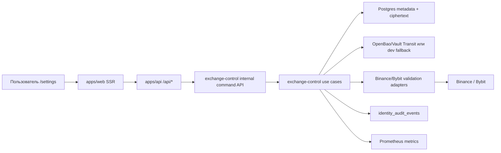

# Идентификация + Биржевые Подключения — хранение API-ключей v1

Статус: staged rollout active. Этап 8 принят как production-browser repair и
заменяет неполное readiness-утверждение Этапа 7 для authenticated public
`/settings` add-key flow. Этап 9 запланирован как hardening lifecycle,
архивирования и permission semantics перед любыми будущими execution stages.

Документ фиксирует архитектуру первого production-этапа для Binance/Bybit
API-ключей на `/settings`: добавление, безопасное хранение, валидация,
ротация, отключение, архивирование, audit, метрики и операционный контроль.

Этот документ намеренно не проектирует торговое исполнение. Размещение ордеров,
`exchange-execution`, order ledger, hot path сигнала и native order adapters
выносятся в отдельное будущее решение после появления контракта:

```text
strategy signal -> execution intent -> risk gate -> order submit -> ack/fill -> reconciliation
```

Пока такого контура в репозитории нет, попытка проектировать исполнение ордеров
в рамках задачи хранения ключей будет преждевременной.

## Цель

Построить безопасный и наблюдаемый контур биржевых подключений, который позволяет
пользователю на `/settings` добавить Binance/Bybit API-ключ, сохранить его без
утечки секретов, проверить права ключа, увидеть статус подключения, повернуть
или отключить ключ и получить понятный audit trail.

Критерий качества: каждый этап внедрения имеет проверочный рубеж с конкретными
runtime-вызовами. Нельзя переходить к следующему этапу, пока текущий этап не
доказан через API calls, DB evidence, Prometheus/Monit evidence и grep-проверку
секретов в логах/артефактах.

## Контекст

Что уже есть в репозитории:

- `identity_exchange_keys` хранит API-учетные данные для `binance`/`bybit`.
- Storage policy v2 уже запрещает возврат `api_secret`/`passphrase` через API и
  использует зашифрованные blobs для API key/secret.
- `/settings` содержит видимую в браузере панель биржевых ключей; после Stage 6
  основная UI-панель использует `/api/ui/account/exchange-connections`, а
  `/api/exchange-keys` остается legacy compatibility endpoint.
- `apps/api/routes/ui_account.py` уже содержит account/preferences/sessions/audit
  API и шаблон защиты мутаций same-origin.
- `strategy_live_runner` сейчас обрабатывает свечи, сигналы и realtime-вывод, но
  не имеет production-контракта отправки сигналов на исполнение сделок.
- Продуктовый runtime на Mac Studio уже использует отдельные процессы,
  `--metrics-port`, Prometheus scrape targets, правила alerting, launchd и
  контроль через Monit.

Внешние факты, которые влияют на дизайн:

- Binance signed endpoints требуют типы прав API-ключа; Binance разделяет
  `TRADE`, `USER_DATA`, `USER_STREAM`, а API key по умолчанию не имеет `TRADE`.
- Binance предоставляет `GET /sapi/v1/account/apiRestrictions` для проверки
  прав API-ключа, IP-ограничений и опасных capabilities.
- Bybit `GET /v5/user/query-api` возвращает метаданные API-ключа: `readOnly`,
  `permissions`, `ips`, expiry fields и пустой `secret`.
- Bybit имеет отдельные IP/rate-limit правила и региональные ограничения egress.
- OpenBao/Vault Transit-compatible secret engine подходит как сервис шифрования:
  key material не хранится в приложении, а Postgres хранит ciphertext и metadata.

## Охват

Входит:

- жизненный цикл биржевого подключения пользователя;
- безопасное хранение API key/secret/passphrase;
- версии учетных данных и ротация;
- связь подключения с `owner_user_id`;
- валидация прав, IP-политики, окружения и account mode Binance/Bybit;
- browser/API контракт `/settings`;
- audit events для добавления, валидации, ротации, отключения и удаления;
- Prometheus metrics для контуров хранения/валидации;
- обязательный launchd/Monit контроль `exchange-control` до включения внешней
  Binance/Bybit validation;
- stage gates с конкретными runtime-вызовами.

Не входит:

- размещение, отмена или сверка ордеров;
- `exchange-execution`;
- order ledger;
- signal-to-execution transport;
- risk engine для торговых лимитов;
- private user streams для fills/orders;
- live trading canary;
- native order adapters Binance/Bybit;
- portfolio accounting или OMS;
- withdrawal, transfer, earn, P2P, wallet-moving операции.

## Ключевое Решение

Текущая задача строит только capability `Exchange Control`.

`Exchange Control` отвечает за:

- прием write-only API-ключей от пользователя;
- шифрование и сохранение секретов;
- стабильный `exchange_connection_id`;
- версии credentials;
- проверку прав ключа на бирже без размещения ордеров;
- статусы подключения;
- rotate/disable/delete;
- audit;
- метрики;
- операционные проверки.

`apps/api` и `/settings` остаются facade/read-model. Они не получают plaintext
секреты, не импортируют биржевые SDK напрямую и не выполняют торговые действия.



## Направление Зависимостей

- `identity` владеет пользователями, сессиями и current-user моделью.
- `exchange_control` владеет подключениями, версиями credentials, validation
  state и политикой шифрования секретов.
- `apps/api` валидирует/authenticates HTTP, вызывает use cases и мапит DTO.
- Для write/secret/validation операций `apps/api` вызывает только local-only
  `exchange-control` internal command API/client. Он не импортирует Transit
  cipher, credential resolver или Binance/Bybit SDK напрямую.
- `apps/web` рендерит masked read models и write-only forms.
- Биржевые validation adapters живут только на outbound-краю.
- OpenBao/Vault client живет только за портами secret cipher и credential
  resolver.
- `strategy` и любые будущие execution-модули получают только `connection_id` и
  non-secret metadata, но не секреты.

## Публичная Модель

### Таксономия Рынка v1

В v1 фиксируется совместимый с текущим backend/UI контракт:

- `market_type`: `spot` или `futures`.

Причина: существующие migration, API DTO, identity use case и strategy модели уже
используют `spot|futures`. Переход на `linear|inverse` без отдельной миграции
будет breaking change для текущих контрактов.

Mapping strategy v1:

| Биржа | Exchange-specific рынок | `market_type` v1 | Где хранить детализацию |
|---|---|---|---|
| Binance | Spot | `spot` | `permission_summary_json` / validation metadata |
| Binance | USD-M Futures / COIN-M Futures | `futures` | `permission_summary_json.exchange_market_category` |
| Bybit | Spot | `spot` | `permission_summary_json` / validation metadata |
| Bybit | Linear / Inverse derivatives | `futures` | `permission_summary_json.exchange_market_category` |

Отдельные значения `linear` и `inverse` допустимы только в будущем решении по
market taxonomy, после явной миграции API, схемы БД, UI и strategy contracts.

### Биржевое Подключение

Стабильный пользовательский объект:

- `connection_id`;
- `owner_user_id`;
- `exchange_name`: `binance` или `bybit`;
- `market_type`: `spot` или `futures`;
- `environment`: `testnet`, `mainnet`, опциональный exchange-specific demo mode;
- `label`;
- `active_credential_version_id`;
- `status`: lifecycle state `active`, `disabled`, `archived`;
- `status_reason`;
- `permission_summary`;
- `requested_permissions`;
- `exchange_permissions`;
- `effective_permissions`;
- `ip_restriction_status`;
- `last_validated_at`;
- `disabled_at`;
- `archived_at`;
- без секретных полей.

### Версия Учетных Данных

Заменяемая версия секретного материала:

- `credential_version_id`;
- `connection_id`;
- `api_key_ciphertext`;
- `api_secret_ciphertext`;
- `passphrase_ciphertext`, когда нужен;
- `api_key_last4`;
- `api_key_fingerprint_hmac`;
- `secret_cipher`: `openbao_transit_v1`, `vault_transit_v1` или локальный dev
  fallback;
- `transit_key_id`;
- `credential_scheme`: изначально `hmac_sha256`, с расширением до RSA/Ed25519;
- `created_by_user_id`;
- `created_by_session_id`;
- `status`: `active`, `rotated`, `disabled`, `revoked`, `validation_failed`;
- временные отметки.

Почему нужен `connection_id`, а не только `key_id`: ротация ключа не должна
ломать будущую связь стратегии, истории запусков или audit trail с биржевым
подключением.

## Управление Секретами

Целевое продуктовое решение: использовать OpenBao Transit как основной
open-source secret engine. HashiCorp Vault Transit-compatible реализация
допустима, если это разрешает политика deployment.

Обоснование:

- Postgres хранит ciphertext и lifecycle metadata, а не plaintext;
- encryption keys находятся вне app process config Roehub;
- OpenBao/Vault ACL может выдавать разные capabilities разным сервисам;
- Transit поддерживает ротацию ключей и rewrap без раскрытия plaintext;
- backup базы не становится plaintext secret backup.

Права сервисов:

| Сервис | Права Transit |
|---|---|
| `apps/api` | без decrypt; вызывает только exchange-control use case/API |
| `exchange-control` | encrypt, HMAC/fingerprint, ограниченный decrypt для валидации |
| ops/admin | key create/rotate/rewrap, без обычного доступа к credentials приложения |

Transit ACL создается только после появления стабильной service identity
`exchange-control`. До этого этапа можно проектировать интерфейсы и локальные
tests, но нельзя считать ACL production-ready: неизвестно, какому runtime
principal выдаются `encrypt/decrypt/hmac` capabilities.

Fallback для локальной разработки:

- текущий AES-GCM envelope cipher может остаться для local/dev и migration tests;
- product/live-ready режим должен fail closed, если настроен с dev-only KEK или
  без Transit/OpenBao backend;
- миграция от текущих encrypted blobs к Transit ciphertext должна быть отдельным
  этапом re-encryption с evidence и rollback.

Обязательные правила:

- никаких API secret в browser responses;
- никакого plaintext в логах, метриках, трассировках или исключениях;
- никаких secret-like values в Playwright artifacts;
- объект credentials имеет redacted `repr`;
- labels метрик никогда не включают `user_id`, `connection_id`, `api_key` или
  raw symbol;
- credential decrypt аудируется и считается метрикой.

## Валидация Подключения

Валидация подключения не размещает ордера.

Проверки:

- credentials могут подписывать authenticated requests;
- endpoint окружения соответствует выбранному `environment`;
- permissions соответствуют заявленной capability;
- dangerous permissions отсутствуют или явно отклонены;
- IP restriction присутствует, когда этого требует политика Roehub;
- exchange account mode поддерживается;
- egress region разрешен для биржи;
- rate-limit headers/errors нормализованы.

Validation statuses описывают результат проверки ключа на бирже и не должны
смешиваться с lifecycle state подключения:

- `valid_readonly`;
- `valid_trade_enabled`;
- `permission_mismatch`;
- `invalid_credentials`;
- `invalid_permissions`;
- `invalid_ip_restriction`;
- `unsupported_account_mode`;
- `skipped_external_validation`;
- `stale_validation`.

`permission_mismatch` является status. Конкретная причина, например
`requested_trade_but_exchange_readonly`, хранится в `validation_reason`, а не в
`validation_status`.

Lifecycle states описывают, участвует ли подключение в продуктовых workflows:

- `active`;
- `disabled`;
- `archived`.

Важно: `valid_trade_enabled` не означает, что Roehub готов торговать. Это только
подтверждает, что ключ имеет торговые права. Торговля остается заблокированной,
пока отдельный будущий контур signal-to-execution не будет спроектирован,
реализован и принят.

## Хранение

Целевая schema является additive и может быть разбита на несколько migrations.

```sql
CREATE TABLE exchange_connections (
    connection_id UUID PRIMARY KEY,
    owner_user_id UUID NOT NULL REFERENCES identity_users(user_id) ON DELETE CASCADE,
    exchange_name TEXT NOT NULL,
    market_type TEXT NOT NULL,
    environment TEXT NOT NULL,
    label TEXT NULL,
    active_credential_version_id UUID NULL,
    status TEXT NOT NULL,
    status_reason TEXT NULL,
    permission_summary_json JSONB NOT NULL DEFAULT '{}'::jsonb,
    ip_restriction_status TEXT NOT NULL DEFAULT 'unknown',
    remote_account_fingerprint BYTEA NULL,
    last_validated_at TIMESTAMPTZ NULL,
    last_used_at TIMESTAMPTZ NULL,
    created_at TIMESTAMPTZ NOT NULL,
    updated_at TIMESTAMPTZ NOT NULL,
    disabled_at TIMESTAMPTZ NULL,
    archived_at TIMESTAMPTZ NULL,
    CONSTRAINT exchange_connections_lifecycle_state_chk
        CHECK (status IN ('active', 'disabled', 'archived')),
    CONSTRAINT exchange_connections_lifecycle_timestamps_chk
        CHECK (
            (status = 'active' AND disabled_at IS NULL AND archived_at IS NULL)
            OR
            (status = 'disabled' AND disabled_at IS NOT NULL AND archived_at IS NULL)
            OR
            (status = 'archived' AND disabled_at IS NOT NULL AND archived_at IS NOT NULL)
        )
);
```

```sql
CREATE TABLE exchange_credential_versions (
    credential_version_id UUID PRIMARY KEY,
    connection_id UUID NOT NULL REFERENCES exchange_connections(connection_id),
    api_key_ciphertext TEXT NOT NULL,
    api_secret_ciphertext TEXT NOT NULL,
    passphrase_ciphertext TEXT NULL,
    api_key_last4 TEXT NOT NULL,
    api_key_fingerprint_hmac BYTEA NOT NULL,
    secret_cipher TEXT NOT NULL,
    transit_key_id TEXT NOT NULL,
    credential_scheme TEXT NOT NULL,
    status TEXT NOT NULL,
    created_by_user_id UUID NOT NULL REFERENCES identity_users(user_id),
    created_by_session_id UUID NULL,
    created_at TIMESTAMPTZ NOT NULL,
    rotated_at TIMESTAMPTZ NULL,
    disabled_at TIMESTAMPTZ NULL
);
```

Текущую `identity_exchange_keys` нужно сохранить как compatibility surface на
переходный период с явной dual-read стратегией:

- новые записи создаются в `exchange_connections` и
  `exchange_credential_versions`;
- legacy `GET /api/exchange-keys` читает compatibility projection из новых
  таблиц после backfill;
- до завершения backfill допускается dual-read: сначала новые таблицы, затем
  `identity_exchange_keys`;
- dual-write не используется как долгосрочный режим, чтобы не получить две
  конкурирующие истины о секрете;
- rollback до legacy endpoint возможен, пока `identity_exchange_keys` не удалена
  и backfill не помечен irreversible;
- external API на всех фазах не возвращает secret/ciphertext/HMAC.

## API/UI Контракты

Текущие compatibility endpoints остаются до deprecation:

- `POST /api/exchange-keys`;
- `GET /api/exchange-keys`;
- `DELETE /api/exchange-keys/{key_id}`.

Целевые account endpoints:

- `GET /api/ui/account/exchange-connections?cursor=&limit=`;
- `GET /api/ui/account/exchange-connections?status=active|disabled|archived|all&cursor=&limit=`;
- `POST /api/ui/account/exchange-connections`;
- `POST /api/ui/account/exchange-connections/{connection_id}/validate`;
- `POST /api/ui/account/exchange-connections/{connection_id}/rotate`;
- `POST /api/ui/account/exchange-connections/{connection_id}/disable`;
- `POST /api/ui/account/exchange-connections/{connection_id}/archive`;

`DELETE /api/ui/account/exchange-connections/{connection_id}` не вводится в
Stage 9, чтобы не создавать ложное ожидание physical deletion. В v1 используется
только явный `POST .../archive`; physical hard delete запрещен.

Правила DTO:

- create/rotate request в account facade для текущих Binance/Bybit принимает
  `api_key` и `api_secret`, но не принимает `passphrase`;
- без `api_secret`, `passphrase`, ciphertext, fingerprint, HMAC и raw exchange
  error body;
- включать masked key suffix, status, permission summary, environment, последнюю
  валидацию, доступность действий и risk warnings;
- default list возвращает только `active`; `disabled` и `archived` доступны
  только по явному фильтру/status tab;
- cursor pagination для connections и audit events;
- deterministic errors: `exchange_connection_not_found`,
  `exchange_connection_not_owned`, `exchange_connection_invalid`,
  `exchange_connection_validation_failed`, `recent_auth_required`,
  `csrf_required`, `exchange_connection_not_disabled`,
  `exchange_connection_already_archived`.

Требования UI:

- `/settings` показывает реальный validation status, а не синтетические
  latency/status;
- основная таблица `Connected Exchange APIs` показывает только `active`
  подключения;
- `disabled`/`archived` доступны через отдельный фильтр/history и не занимают
  визуальное место в основном списке;
- выбор environment явный;
- выбор permissions явный: `read` по умолчанию, `trade` только как осознанное
  повышение capability; hardcoded `trade` запрещен;
- UI различает `requested_permissions`, `exchange_permissions` и
  `effective_permissions`; mismatch не отображается как успешное нормальное
  состояние;
- IP allowlist guidance показывает Roehub outbound IP/runbook state;
- add/rotate credentials работают через write-only forms;
- destructive actions требуют typed confirmation;
- после submit/failure password inputs очищаются;
- account limits/counts берутся из backend read model, без hardcoded
  `exchange_connections_used=0` или `api_keys_used=0`;
- `exchange_connections_used` и `api_keys_used` считаются только по
  `status='active'`; `disabled` и `archived` не занимают лимиты;
- browser QA обязан выполнять grep artifacts на secret-like markers.

## Операционный Дизайн

Начальные security/schema этапы могут жить в API-процессе, пока они не делают
внешнюю биржевую validation и не требуют production decrypt. Но перед любыми
реальными Binance/Bybit validation calls `exchange-control` должен быть выделен
в обязательный supervised process с собственной service identity, metrics,
healthcheck, launchd и Monit. Это не optional optimization, а gate безопасности и
операционной наблюдаемости.

Планируемый процесс:

- `exchange-control` на `127.0.0.1:9205/metrics`;
- health/readiness endpoint: `127.0.0.1:9205/health/ready`;
- local-only internal command API на том же `127.0.0.1:9205` для команд
  create/rotate/disable/validate, закрытый service-to-service auth и
  недоступный из public edge;
- launchd: `infra/macos/launchd/com.roehub.exchange-control.plist`;
- Monit: `infra/scripts/monit/roehub-exchange-control.monitrc`;
- Prometheus scrape job в `infra/macos/prometheus/prometheus.prod.yml`;
- alert rules в Mac Studio monitoring rules;
- runbook update в `docs/runbooks/mac-studio-monitoring-plan.md`.

Обязательные метрики:

- `exchange_control_active`;
- `exchange_connection_create_total{exchange,result}`;
- `exchange_connection_validation_total{exchange,result,reason}`;
- `exchange_connection_status{exchange,status}`;
- `exchange_credential_rotation_total{exchange,result}`;
- `exchange_credential_disable_total{exchange,result}`;
- `exchange_connection_archive_total{exchange,result,reason}`;
- `exchange_connection_cleanup_total{source,result}`;
- `exchange_permission_mismatch_total{exchange,requested,effective}`;
- `exchange_credential_decrypt_total{service,result}`;
- `exchange_api_requests_total{exchange,api_group,result}`;
- `exchange_api_rate_limited_total{exchange,api_group}`.

Запрещенные labels:

- `user_id`;
- `connection_id`;
- `credential_version_id`;
- `api_key`;
- raw exception text;
- secret-like values.

Минимальные alerts:

- `ExchangeControlDown`;
- `ExchangeValidationFailuresGrowing`;
- `ExchangeCredentialDecryptFailures`;
- `ExchangeRateLimitedGrowing`;
- `ExchangeNoRecentSuccessfulValidation`, если включена регулярная revalidation.

## Контроли Безопасности

- Keycloak step-up/recent-auth обязателен для add/rotate/delete/disable
  credentials.
- CSRF fail-closed обязателен для всех browser mutations. Принимается либо
  валидный CSRF token, либо строгий same-origin guard, который отклоняет
  cross-origin запросы и запросы без `Origin`/`Referer`, если CSRF token не
  прошел проверку.
- Audit events включают user, session, IP/user-agent hash, action, старое/новое
  состояние без секретов и reason code.
- Withdrawal/transfer permissions отклоняются для Roehub-managed connection.
- IP allowlist обязателен для mainnet connection, если operator policy явно не
  отключила это требование.
- Product-ready режим fail closed без Transit/OpenBao backend.
- Любой статус `valid_trade_enabled` остается informational до появления
  отдельного execution-контракта.

## Что Сейчас Не Хватает

Backend:

- отдельная модель `exchange_connections`;
- отдельные `exchange_credential_versions`;
- Transit/OpenBao secret backend и ACL model;
- local-only internal command API между `apps/api` и `exchange-control`;
- `apps/api` outbound client для `exchange-control`, чтобы public routes не
  импортировали secret/decrypt/exchange adapters напрямую;
- HMAC fingerprint вместо plain SHA-256 для новых ключей;
- create/list/rotate/disable/validate use cases;
- Binance/Bybit validation adapters;
- new-model audit events beyond the Stage 1 legacy create/delete bridge;
- Stage 1 already added audit schema event types `exchange_*`;
- Stage 1 already added Keycloak-backed recent-auth enforcement for legacy
  add/delete hooks; rotate/disable hooks must reuse it when introduced;
- Stage 1 already added CSRF fail-closed hardening for exchange mutations;
- rate-limit/error redaction around validation;
- business metrics для create/rotate/disable/validation поверх уже принятого
  Stage 2 `/metrics`;
- Stage 2 уже добавил обязательные Monit/launchd configs для
  `exchange-control`; Stage 3C/5 должны не обходить этот runtime boundary;
- runbook для secret rotation и emergency disable.

UI:

- real connection status и validation details;
- environment/testnet/mainnet selection;
- permissions selector с default `read`, без hardcoded `trade`;
- IP allowlist guidance;
- rotate/disable/revalidate flows;
- typed confirmation для destructive actions;
- очистка password inputs и secret artifacts.

Docs/Ops:

- единый iteration ledger для facts/handoff между stages;
- exchange-control runbook;
- secret management runbook;
- OpenBao/Vault deployment и backup/restore notes;
- production egress/IP allowlist runbook;
- stage evidence template;
- единый iteration ledger для фиксации статуса stages, blockers, проверенных
  фактов и handoff-контекста для следующих stages.

## План Внедрения

Каждый этап имеет обязательный gate. Следующий этап нельзя начинать, пока
текущий этап не доказан на runtime/API/DB/ops evidence и не сохранен короткий
stage report и запись в единый iteration ledger.

Для каждого этапа фиксируются:

- конкретные API/runtime вызовы;
- ожидаемые ответы;
- DB evidence;
- Prometheus/Monit evidence, если применимо;
- grep-проверка отсутствия секретов в logs/browser/test artifacts;
- короткий stage report;
- запись в
  `docs/architecture/identity/exchange-connections-stage-reports/identity-exchange-connections-live-trading-v1-iteration-ledger.md`
  с тем, что обязательно знать следующим stages.

После успешной validation каждого stage доставка выполняется напрямую в
`main`: executor остается или переключается на `main`, выполняет
`git pull --ff-only origin main`, stage-ит только scoped changes, делает commit
на `main`, выполняет `git push origin main` и контролирует CI/deploy status.
Отдельная branch или draft PR на stage не создаются. Если direct-main delivery
невозможен, stage помечается `blocked` в ledger; следующий stage не стартует.

### Этап 0 — Фиксация Текущего Состояния

Цель: доказать, что текущий `/api/exchange-keys` и `/settings` понятны и не
возвращают секреты. На этом этапе ничего не меняем в поведении.

Работа:

- инвентаризировать текущие `/api/exchange-keys`, `/api/ui/account/*`,
  `/settings`;
- подтвердить текущие DTO и duplicate/delete behavior;
- зафиксировать compatibility surface `key_id`;
- подтвердить текущий `market_type` contract: `spot|futures`.

Валидация:

```bash
uv run pytest -q tests/unit/apps/api/test_identity_exchange_keys_routes.py tests/unit/apps/api/test_ui_account_routes.py tests/unit/apps/web/test_app_routes.py
python -m tools.docs.generate_docs_index --check
```

Acceptance calls:

```bash
curl -fsS -X GET "$ROEHUB_BASE_URL/api/exchange-keys" \
  -H "Cookie: $ROEHUB_SESSION_COOKIE"
```

Ожидаемо:

- response не содержит `api_secret`, `passphrase`, `ciphertext`, `hmac`;
- masked key отображается только как suffix/last4;
- unauthenticated request получает auth error/redirect.

DB evidence:

```sql
SELECT key_id, user_id, exchange_name, market_type, api_key_last4
FROM identity_exchange_keys
ORDER BY created_at DESC
LIMIT 5;
```

Contract evidence:

```bash
rg -n "spot|futures|linear|inverse" \
  migrations/postgres/0003_identity_exchange_keys_v1.sql \
  src/trading/contexts/identity \
  apps/api/routes \
  apps/web/templates/fragments/account/exchange_keys.html \
  apps/web/dist/js/pages/settings.js
```

Secret grep:

```bash
rg -n "TEST_SECRET|TEST_API_SECRET|TEST_PASSPHRASE" logs output .playwright-cli || true
```

Критерий выхода:

- baseline report сохранен;
- iteration ledger создан или обновлен;
- direct-main push в `origin/main` выполнен или stage явно заблокирован;
- текущие contracts заморожены;
- секреты не найдены в response/log/artifact evidence.

### Этап 1 — Security Baseline: CSRF, Recent Auth, Audit Schema

Цель: закрыть текущий state-changing surface до расширения модели и подготовить
audit schema для будущих exchange events.

Работа:

- сделать CSRF fail-closed для всех exchange mutations;
- отклонять browser mutation без валидного CSRF token, если `Origin`/`Referer`
  отсутствуют или не совпадают с trusted host;
- добавить Keycloak step-up/recent-auth gate для add/delete legacy ключей и для
  будущих add/rotate/delete/disable actions;
- добавить migration, расширяющую `identity_audit_events` event types:
  `exchange_key_created`, `exchange_key_deleted`,
  `exchange_connection_created`, `exchange_connection_validated`,
  `exchange_connection_validation_failed`, `exchange_credential_rotated`,
  `exchange_connection_disabled`, `exchange_connection_deleted`;
- добавить audit events для текущих create/delete;
- добавить rate-limit/error redaction;
- подтвердить, что prod config не принимает dev-only KEK для product-ready mode.

Валидация:

```bash
uv run pytest -q tests/unit/apps/api/test_identity_exchange_keys_routes.py tests/unit/apps/api/test_ui_account_routes.py
uv run ruff check apps/api src/trading/contexts/identity tests/unit/apps/api/test_identity_exchange_keys_routes.py tests/unit/apps/api/test_ui_account_routes.py
uv run pyright apps/api src/trading/contexts/identity tests/unit/apps/api/test_identity_exchange_keys_routes.py tests/unit/apps/api/test_ui_account_routes.py
```

Acceptance calls:

```bash
# no Origin/Referer + no CSRF token -> fail closed
curl -i -X POST "$ROEHUB_BASE_URL/api/exchange-keys" \
  -H "Cookie: $ROEHUB_SESSION_COOKIE" \
  -H "Content-Type: application/json" \
  --data '{"exchange_name":"binance","market_type":"spot","label":"blocked","permissions":"read","api_key":"TEST","api_secret":"TEST_SECRET"}'

# cross-origin -> fail closed
curl -i -X POST "$ROEHUB_BASE_URL/api/exchange-keys" \
  -H "Origin: https://evil.example" \
  -H "Cookie: $ROEHUB_SESSION_COOKIE" \
  -H "Content-Type: application/json" \
  --data '{"exchange_name":"binance","market_type":"spot","label":"blocked","permissions":"read","api_key":"TEST","api_secret":"TEST_SECRET"}'

# same-origin + CSRF, но без recent-auth -> recent_auth_required
curl -i -X POST "$ROEHUB_BASE_URL/api/exchange-keys" \
  -H "Origin: $ROEHUB_BASE_URL" \
  -H "Cookie: $ROEHUB_SESSION_COOKIE" \
  -H "X-CSRF-Token: $ROEHUB_CSRF_TOKEN" \
  -H "Content-Type: application/json" \
  --data '{"exchange_name":"binance","market_type":"spot","label":"needs-recent-auth","permissions":"read","api_key":"TEST","api_secret":"TEST_SECRET"}'

# same-origin + CSRF + recent-auth -> mutation allowed
curl -i -X POST "$ROEHUB_BASE_URL/api/exchange-keys" \
  -H "Origin: $ROEHUB_BASE_URL" \
  -H "Cookie: $ROEHUB_RECENT_AUTH_SESSION_COOKIE" \
  -H "X-CSRF-Token: $ROEHUB_CSRF_TOKEN" \
  -H "Content-Type: application/json" \
  --data '{"exchange_name":"binance","market_type":"spot","label":"allowed","permissions":"read","api_key":"TEST","api_secret":"TEST_SECRET"}'
```

Ожидаемо:

- mutation без CSRF и без trusted `Origin`/`Referer` отклонена;
- cross-origin mutation отклонена;
- mutation без recent-auth возвращает deterministic `recent_auth_required`;
- mutation с валидным CSRF и recent-auth проходит;
- audit event не содержит secret;
- audit schema принимает только разрешенные `exchange_*` event types.

DB evidence:

```sql
SELECT conname, pg_get_constraintdef(oid)
FROM pg_constraint
WHERE conname = 'identity_audit_events_type_check';

SELECT event_type, actor_user_id, target_type, created_at
FROM identity_audit_events
WHERE event_type LIKE 'exchange_%'
ORDER BY created_at DESC
LIMIT 10;
```

Критерий выхода:

- CSRF fail-closed доказан;
- Keycloak recent-auth доказан;
- audit schema/event types работают;
- iteration ledger обновлен фактами, нужными Stage 2;
- direct-main push в `origin/main` выполнен или stage явно заблокирован;
- секреты не попадают в audit/logs.

### Этап 2 — Exchange-Control Process И Service Identity

Цель: создать обязательный runtime boundary до любых реальных Binance/Bybit
validation calls.

Работа:

- добавить `exchange-control` process или отдельный supervised runtime
  entrypoint;
- завести service identity/principal `exchange-control`;
- раскрыть `/health/ready` и `/metrics`;
- добавить Prometheus target `127.0.0.1:9205`;
- добавить launchd/Monit configs;
- обновить monitoring runbook;
- оставить validation adapters выключенными до этапа 5.

Валидация:

```bash
uv run pytest -q tests/unit/contexts/exchange_control tests/unit/apps/api
python -m tools.docs.generate_docs_index --check
```

Acceptance calls:

```bash
curl -fsS http://127.0.0.1:9205/health/ready
curl -fsS http://127.0.0.1:9205/metrics | rg 'exchange_control_active|exchange_connection_'
curl -fsS 'http://127.0.0.1:9090/api/v1/query?query=up{job="exchange-control"}'
/opt/homebrew/opt/monit/bin/monit -c /opt/homebrew/etc/monitrc summary | rg 'roehub_exchange_control'
```

Ожидаемо:

- health возвращает ready;
- metrics endpoint доступен;
- Prometheus target находится в `up`;
- Monit показывает сервис running/accessible;
- restart через Monit/launchd не теряет metadata;
- real exchange validation endpoints еще не вызываются.

Критерий выхода:

- `exchange-control` process обязателен и наблюдаем;
- service identity зафиксирована;
- Transit ACL можно проектировать на конкретный runtime principal;
- iteration ledger обновлен service identity, ports, Monit/Prometheus и restart evidence;
- direct-main push в `origin/main` выполнен или stage явно заблокирован;
- внешний validation adapter не подключается до прохождения этого stage.

### Этап 3A — OpenBao/Vault Runtime Provisioning

Цель: поднять и доказать живой Transit-compatible secret backend до того, как
application code начнет считаться production-ready.

Этот этап отделяет инфраструктурное provision/recovery от application
integration. Stage 3B нельзя принимать, если Stage 3A не доказал runtime,
Transit key, ACL и токены.

Работа:

- развернуть OpenBao или Vault-compatible Transit service на target runtime;
- закрепить service owner, storage path, bind address, launchd/Monit unit,
  health endpoint и restart policy;
- описать init/unseal или выбранную recovery-модель, backup/restore notes и
  emergency access path;
- включить Transit secret engine;
- создать Transit key `roehub-exchange-credentials`;
- создать ACL/policies и выдать отдельные tokens:
  - `exchange-control`: encrypt, HMAC/fingerprint и ограниченный decrypt для
    validation workflow;
  - `apps/api`: без decrypt capability; API не должен получать plaintext path;
  - admin/operator token: только для rotation/rewrap, не для app runtime env;
- зафиксировать runtime env names без значений секретов:
  `OPENBAO_ADDR`, `ROEHUB_EXCHANGE_CONTROL_TRANSIT_TOKEN`,
  `ROEHUB_API_TRANSIT_TOKEN`;
- добавить Prometheus/Monit health checks и runbook для secret backend.

Валидация:

```bash
curl -fsS "$OPENBAO_ADDR/v1/sys/health"

curl -fsS -X POST "$OPENBAO_ADDR/v1/transit/encrypt/roehub-exchange-credentials" \
  -H "X-Vault-Token: $ROEHUB_EXCHANGE_CONTROL_TRANSIT_TOKEN" \
  --data '{"plaintext":"VEVTVF9TRUNSRVQ="}'

curl -i -X POST "$OPENBAO_ADDR/v1/transit/decrypt/roehub-exchange-credentials" \
  -H "X-Vault-Token: $ROEHUB_API_TRANSIT_TOKEN" \
  --data '{"ciphertext":"vault:v1:example"}'

/opt/homebrew/opt/monit/bin/monit -c /opt/homebrew/etc/monitrc summary | rg 'openbao|vault|transit'
```

Ожидаемо:

- OpenBao/Vault health endpoint healthy;
- Transit key `roehub-exchange-credentials` существует;
- `exchange-control` token может выполнить encrypt;
- `apps/api` token получает `403`/permission denied на decrypt;
- secret backend находится под process supervision;
- tokens, unseal material и admin credentials не попадают в repo, logs,
  stage reports или browser artifacts.

Критерий выхода:

- secret backend доказан runtime-вызовами;
- ACL behavior доказан direct Transit calls;
- service supervision и restart/health evidence сохранены;
- runbook содержит install/init/unseal/backup/restore/rotation notes;
- iteration ledger обновлен runtime endpoint, policy names, token roles,
  env contract и blockers для Stage 3B;
- direct-main push в `origin/main` выполнен или stage явно заблокирован.

### Этап 3B — Transit Application Integration

Цель: подключить `exchange-control` application code к уже принятому
OpenBao/Vault Transit runtime без выдачи decrypt path в `apps/api`.

Prerequisites:

- этап 2 `exchange-control` process/service identity принят;
- этап 3A OpenBao/Vault runtime provisioning принят;
- `OPENBAO_ADDR`, `ROEHUB_EXCHANGE_CONTROL_TRANSIT_TOKEN`,
  `ROEHUB_API_TRANSIT_TOKEN` доступны в target runtime config.

Работа:

- добавить `ExchangeSecretCipher` port;
- добавить Transit-compatible adapter для OpenBao/Vault;
- оставить deterministic in-memory fake только для tests/non-production;
- добавить redacted secret DTOs, чтобы plaintext/ciphertext/HMAC/fingerprint не
  попадали в `repr`, logs или audit metadata;
- добавить product config fail-closed checks:
  - `ROEHUB_ENV=prod` не принимает dev/in-memory secret engine;
  - product mode требует `openbao_transit_v1` или `vault_transit_v1`;
  - key name должен быть `roehub-exchange-credentials`;
- нормализовать внешние Transit errors в sanitized internal errors;
- обновить secret-management runbook application-level командами.

Валидация:

```bash
uv run pytest -q tests/unit/contexts/exchange_control tests/unit/apps/migrations
uv run ruff check src/trading/contexts/exchange_control tests/unit/contexts/exchange_control
uv run pyright src/trading/contexts/exchange_control tests/unit/contexts/exchange_control
python -m tools.docs.generate_docs_index --check
```

Runtime acceptance:

```bash
curl -fsS "$OPENBAO_ADDR/v1/sys/health"

curl -fsS -X POST "$OPENBAO_ADDR/v1/transit/encrypt/roehub-exchange-credentials" \
  -H "X-Vault-Token: $ROEHUB_EXCHANGE_CONTROL_TRANSIT_TOKEN" \
  --data '{"plaintext":"VEVTVF9TRUNSRVQ="}'

curl -i -X POST "$OPENBAO_ADDR/v1/transit/decrypt/roehub-exchange-credentials" \
  -H "X-Vault-Token: $ROEHUB_API_TRANSIT_TOKEN" \
  --data '{"ciphertext":"vault:v1:example"}'
```

Ожидаемо:

- Transit encrypt возвращает ciphertext;
- API process не имеет decrypt capability;
- `exchange-control` имеет только нужные capabilities;
- production startup без Transit config завершается fail closed.

Secret grep:

```bash
rg -n "TEST_SECRET|TEST_API_SECRET|TEST_PASSPHRASE" logs output .playwright-cli || true
```

Критерий выхода:

- Stage 3A принят и не superseded;
- application adapter и config fail-closed checks протестированы;
- runtime ACL calls повторно приложены к Stage 3B report;
- `apps/api` не получает decrypt capability и не содержит decrypt path;
- iteration ledger обновлен Transit policy/env/capability facts для Stage 3C;
- direct-main push в `origin/main` выполнен или stage явно заблокирован;
- product-ready режим не стартует с dev-only KEK.

### Этап 3C — Exchange-Control Internal Command API Boundary

Цель: зафиксировать реальный service-to-service путь между `apps/api` и
`exchange-control`, чтобы следующие stages не реализовали secret-bearing
create/rotate/validate операции внутри API-процесса.

Этот этап закрывает gap между "есть supervised process" и "public API вызывает
именно этот process". Stage 2 дал только `/health/ready` и `/metrics`.
Stage 3C должен добавить internal command API contract и `apps/api` client до
schema/backfill и Binance/Bybit validation.

Prerequisites:

- этап 2 `exchange-control` process/service identity принят;
- этап 3A OpenBao/Vault runtime provisioning принят;
- этап 3B Transit application integration принят.

Работа:

- добавить local-only internal command API namespace, например
  `/internal/v1/exchange-control/*`, на `127.0.0.1:9205`;
- добавить service-to-service auth для `apps/api -> exchange-control`:
  `ROEHUB_EXCHANGE_CONTROL_INTERNAL_API_TOKEN` без записи значения в repo;
- добавить request envelope с `actor_user_id`, `session_id`/`session_age`,
  `request_id`, idempotency key для mutating commands и sanitized error model;
- добавить `apps/api` outbound client/port для `exchange-control`;
- запретить public routes импортировать Transit/decrypt/native exchange
  adapters напрямую;
- добавить capabilities/contract-smoke endpoint, который доказывает, что
  `apps/api` может reach `exchange-control` по internal API;
- зафиксировать timeout/retry policy: короткие таймауты, без скрытого retry для
  non-idempotent commands, explicit idempotency для create/rotate/disable;
- оставить реальные create/rotate/disable/validate handlers для Stage 4/5.

Валидация:

```bash
uv run pytest -q tests/unit/contexts/exchange_control tests/unit/apps/api/test_ui_account_routes.py
uv run ruff check apps/api apps/exchange_control src/trading/contexts/exchange_control tests/unit/contexts/exchange_control tests/unit/apps/api
uv run pyright apps/api apps/exchange_control src/trading/contexts/exchange_control tests/unit/contexts/exchange_control tests/unit/apps/api
python -m tools.docs.generate_docs_index --check
```

Acceptance calls:

```bash
curl -fsS http://127.0.0.1:9205/health/ready

curl -fsS http://127.0.0.1:9205/internal/v1/capabilities \
  -H "Authorization: Bearer $ROEHUB_EXCHANGE_CONTROL_INTERNAL_API_TOKEN" \
  -H "X-Roehub-Internal-Service: apps/api" \
  -H "X-Request-Id: stage-3c-smoke"

curl -i http://127.0.0.1:9205/internal/v1/capabilities \
  -H "X-Roehub-Internal-Service: apps/api"
```

Ожидаемо:

- health остается ready;
- authenticated internal call возвращает service identity, supported contract
  version и список capabilities без секретов;
- missing/invalid internal token возвращает `401`/`403`;
- `apps/api` имеет client/port, но не импортирует Transit/decrypt/native exchange
  adapters;
- production config fail closed, если public exchange connection routes включены
  без `ROEHUB_EXCHANGE_CONTROL_INTERNAL_API_TOKEN` или internal base URL.

Secret/import grep:

```bash
rg -n "ExchangeSecretCipher|decrypt|openbao|vault|binance|bybit|pybit|api_secret|passphrase" apps/api || true
```

Критерий выхода:

- internal command API boundary доказан runtime-вызовами;
- service-to-service auth fail-closed доказан;
- `apps/api` client contract готов для Stage 4/5;
- iteration ledger обновлен internal API endpoint, auth env, timeout/retry и
  no-direct-import facts для Stage 4;
- direct-main push в `origin/main` выполнен или stage явно заблокирован.

### Этап 4 — Exchange Connections, Credential Versions, Backfill

Цель: отделить стабильное подключение от версии секретного материала.

Prerequisites:

- этап 3A OpenBao/Vault runtime provisioning принят;
- этап 3B Transit application integration принят;
- этап 3C exchange-control internal command API boundary принят;

Работа:

- добавить `exchange_connections`;
- добавить `exchange_credential_versions`;
- сохранить `market_type` v1 как `spot|futures`;
- выполнить backfill текущих rows из `identity_exchange_keys`;
- раскрыть additive `connection_id`, сохранив compatibility `key_id`;
- добавить create/list/rotate/disable use cases за `exchange-control`
  internal command API; `apps/api` остается public facade/client;
- реализовать compatibility read strategy:
  - phase A: schema deploy без смены поведения;
  - phase B: backfill legacy rows в новые таблицы;
  - phase C: включить новые writes только после успешного backfill;
  - phase D: legacy endpoint читает projection из новых таблиц с dual-read
    fallback на `identity_exchange_keys`;
  - phase E: fallback можно выключить только после отдельного evidence report.
- зафиксировать rollback:
  - до phase C rollback возможен на legacy read/write;
  - после phase C rollback допустим только на версию приложения с dual-read
    support или через явный reverse-backfill runbook;
  - удаление `identity_exchange_keys` запрещено в рамках этого документа.

Валидация:

```bash
uv run pytest -q tests/unit/apps/migrations tests/unit/contexts/exchange_control tests/unit/apps/api/test_identity_exchange_keys_routes.py tests/unit/apps/api/test_ui_account_routes.py
uv run ruff check src/trading/contexts/exchange_control apps/api tests/unit/contexts/exchange_control tests/unit/apps/api
uv run pyright src/trading/contexts/exchange_control apps/api tests/unit/contexts/exchange_control tests/unit/apps/api
```

Acceptance calls:

```bash
curl -fsS -X POST "$ROEHUB_BASE_URL/api/ui/account/exchange-connections" \
  -H "Origin: $ROEHUB_BASE_URL" \
  -H "Cookie: $ROEHUB_RECENT_AUTH_SESSION_COOKIE" \
  -H "X-CSRF-Token: $ROEHUB_CSRF_TOKEN" \
  -H "Content-Type: application/json" \
  --data @fixtures/nonreal-binance-connection.json

curl -fsS "$ROEHUB_BASE_URL/api/ui/account/exchange-connections" \
  -H "Cookie: $ROEHUB_SESSION_COOKIE"

curl -i -X POST "$ROEHUB_BASE_URL/api/ui/account/exchange-connections" \
  -H "Cookie: $ROEHUB_RECENT_AUTH_SESSION_COOKIE" \
  -H "X-CSRF-Token: $ROEHUB_CSRF_TOKEN" \
  -H "Content-Type: application/json" \
  --data '{"exchange_name":"bybit","market_type":"linear","environment":"testnet","label":"should-fail","permissions":"read","api_key":"TEST","api_secret":"TEST_SECRET"}'
```

Ожидаемо:

- create возвращает `connection_id`;
- response не содержит secret/ciphertext/HMAC;
- list возвращает masked key и status;
- rotation создает новый `credential_version_id`, но не меняет `connection_id`.
- `market_type=linear` или `inverse` отклоняется в v1 как unsupported enum.

DB evidence:

```sql
SELECT connection_id, owner_user_id, exchange_name, market_type, environment, status
FROM exchange_connections
ORDER BY created_at DESC
LIMIT 5;

SELECT connection_id, credential_version_id, api_key_last4, status
FROM exchange_credential_versions
ORDER BY created_at DESC
LIMIT 5;

SELECT COUNT(*) AS legacy_rows FROM identity_exchange_keys;
SELECT COUNT(*) AS connection_rows FROM exchange_connections;
```

Критерий выхода:

- стабильный `connection_id` доказан;
- credential rotation не ломает connection;
- compatibility endpoint остается рабочим.
- backfill/dual-read/rollback evidence зафиксированы.
- iteration ledger обновлен schema/backfill/rollback facts для Stage 5;
- direct-main push в `origin/main` выполнен или stage явно заблокирован;

### Этап 5 — Binance/Bybit Validation Без Ордеров

Цель: доказать, что Roehub может проверять ключи на биржах без торговых действий.

Prerequisites:

- этап 2 `exchange-control` process/service identity принят;
- этап 3A OpenBao/Vault runtime provisioning принят;
- этап 3B Transit application integration принят;
- этап 3C exchange-control internal command API boundary принят;
- этап 4 connection/credential model принят;
- validation adapters включаются только через explicit config flag.

Работа:

- добавить Binance validation adapter для `apiRestrictions`;
- добавить Bybit validation adapter для `/v5/user/query-api`;
- нормализовать permissions/IP/account mode;
- добавить sanitized error mapping;
- добавить validation status read model для `/settings`;
- добавить validation metrics и audit events.

External validation env contract:

```bash
ROEHUB_EXCHANGE_VALIDATION_LIVE=1
ROEHUB_TEST_BINANCE_ENVIRONMENT=testnet
ROEHUB_TEST_BINANCE_READONLY_API_KEY=...
ROEHUB_TEST_BINANCE_READONLY_API_SECRET=...
ROEHUB_TEST_BYBIT_ENVIRONMENT=testnet
ROEHUB_TEST_BYBIT_READONLY_API_KEY=...
ROEHUB_TEST_BYBIT_READONLY_API_SECRET=...

# optional manual scenarios, never required for default CI
ROEHUB_TEST_ALLOW_TRADE_ENABLED_VALIDATION=1
ROEHUB_TEST_BINANCE_TRADE_API_KEY=...
ROEHUB_TEST_BINANCE_TRADE_API_SECRET=...
ROEHUB_TEST_BYBIT_TRADE_API_KEY=...
ROEHUB_TEST_BYBIT_TRADE_API_SECRET=...
```

Skip policy:

- automated CI skips live exchange validation unless
  `ROEHUB_EXCHANGE_VALIDATION_LIVE=1`;
- skip is reported as `skipped_external_validation`, not as success;
- production acceptance requires at least one Binance readonly validation and
  one Bybit readonly validation from env-backed test credentials;
- trade-enabled validation is optional/manual and never places orders;
- invalid credentials use deterministic fake values from fixtures, not real
  secrets.

Валидация:

```bash
uv run pytest -q tests/unit/contexts/exchange_control tests/unit/apps/api/test_ui_account_routes.py tests/unit/apps/web/test_app_routes.py
uv run ruff check src/trading/contexts/exchange_control apps/api apps/web tests/unit/contexts/exchange_control tests/unit/apps/api tests/unit/apps/web
uv run pyright src/trading/contexts/exchange_control apps/api tests/unit/contexts/exchange_control tests/unit/apps/api
rg -n "/order|createOrder|submit_order|place_order" src/trading/contexts/exchange_control || true
```

Acceptance calls:

```bash
curl -fsS -X POST "$ROEHUB_BASE_URL/api/ui/account/exchange-connections/$CONNECTION_ID/validate" \
  -H "Origin: $ROEHUB_BASE_URL" \
  -H "Cookie: $ROEHUB_SESSION_COOKIE" \
  -H "X-CSRF-Token: $ROEHUB_CSRF_TOKEN"

curl -fsS "$ROEHUB_BASE_URL/api/ui/account/exchange-connections" \
  -H "Cookie: $ROEHUB_SESSION_COOKIE" | jq '.items[] | select(.connection_id=="'$CONNECTION_ID'")'

curl -fsS http://127.0.0.1:9205/metrics | rg 'exchange_connection_validation_total'
curl -fsS 'http://127.0.0.1:9090/api/v1/query?query=exchange_connection_validation_total'
```

Обязательные сценарии:

- invalid key -> `invalid_credentials`;
- read-only key -> `valid_readonly`;
- trade-enabled key -> `valid_trade_enabled`;
- withdrawal/transfer permission -> `invalid_permissions` или
  `disabled_by_policy`;
- missing IP restriction для mainnet -> `invalid_ip_restriction` или warning
  согласно policy;
- unsupported account mode -> `unsupported_account_mode`;
- exchange error body очищен.

DB evidence:

```sql
SELECT connection_id, status, status_reason, permission_summary_json, last_validated_at
FROM exchange_connections
WHERE connection_id = :'connection_id';

SELECT event_type, target_id, metadata_json, created_at
FROM identity_audit_events
WHERE event_type IN (
  'exchange_connection_validated',
  'exchange_connection_validation_failed'
)
ORDER BY created_at DESC
LIMIT 20;
```

Secret grep:

```bash
rg -n "$ROEHUB_TEST_BINANCE_READONLY_API_SECRET|$ROEHUB_TEST_BYBIT_READONLY_API_SECRET|TEST_PASSPHRASE|api_secret|passphrase" logs output .playwright-cli || true
```

Критерий выхода:

- validation доказана реальными или sandbox/testnet ключами из env;
- ни один validation call не размещает ордера;
- status виден в API и UI;
- iteration ledger обновлен validation/env/status facts для Stage 6;
- direct-main push в `origin/main` выполнен или stage явно заблокирован;
- Prometheus и audit отражают результат.

### Этап 6 — UI Completion На `/settings`

Цель: довести пользовательский flow добавления и обслуживания ключей.

Работа:

- заменить синтетические status/latency на backend status;
- добавить environment selection;
- добавить permissions selector с default `read`; `trade` выбирается только явно;
- добавить validate/rotate/disable flows;
- добавить IP allowlist guidance;
- не показывать и не принимать passphrase для текущих Binance/Bybit flows;
- заменить hardcoded account limits на backend read model;
- добавить typed confirmation для destructive actions;
- очистить password inputs после submit/failure.

Валидация:

```bash
uv run pytest -q tests/unit/apps/web/test_app_routes.py tests/unit/apps/api/test_ui_account_routes.py
```

Acceptance calls:

```bash
curl -fsS "$ROEHUB_BASE_URL/settings" \
  -H "Cookie: $ROEHUB_SESSION_COOKIE" | rg 'exchange'

curl -fsS "$ROEHUB_BASE_URL/api/ui/account/exchange-connections" \
  -H "Cookie: $ROEHUB_SESSION_COOKIE" | jq '.items'
```

Browser acceptance:

- authenticated `/settings` открывается;
- добавление ключа отправляет write-only request;
- default permissions value в форме равен `read`;
- выбранный permissions value уходит в backend, hardcoded `trade` отсутствует;
- после ошибки secret inputs очищены;
- list показывает masked key, status, last validation;
- validate/rotate/disable работают без full page reload или с ожидаемым fragment
  refresh;
- mobile layout не ломается;
- grep Playwright artifacts не находит secret markers.

Критерий выхода:

- пользовательский flow добавления/валидации/ротации/отключения принят в браузере;
- iteration ledger обновлен UI/browser QA facts для Stage 7;
- direct-main push в `origin/main` выполнен или stage явно заблокирован;
- секреты не попадают в browser-visible artifacts.

### Этап 7 — Production Readiness Для Хранения Ключей

Цель: принять контур хранения ключей как production-ready без торгового
исполнения.

Валидация:

```bash
uv run pytest -q tests/unit/apps/api/test_identity_exchange_keys_routes.py tests/unit/apps/api/test_ui_account_routes.py tests/unit/apps/web/test_app_routes.py tests/unit/contexts/exchange_control tests/unit/apps/migrations
uv run ruff check apps/api apps/web src/trading/contexts/identity src/trading/contexts/exchange_control tests/unit/apps/api tests/unit/apps/web tests/unit/contexts/exchange_control
uv run pyright apps/api src/trading/contexts/identity src/trading/contexts/exchange_control tests/unit/apps/api tests/unit/contexts/exchange_control
python -m tools.docs.generate_docs_index --check
```

Runtime acceptance:

```bash
curl -fsS http://127.0.0.1:9205/health/ready
curl -fsS http://127.0.0.1:9205/internal/v1/capabilities \
  -H "Authorization: Bearer $ROEHUB_EXCHANGE_CONTROL_INTERNAL_API_TOKEN" \
  -H "X-Roehub-Internal-Service: apps/api" \
  -H "X-Request-Id: stage-7-readiness"
curl -fsS http://127.0.0.1:9205/metrics | rg 'exchange_control_active|exchange_connection_validation_total'
curl -fsS 'http://127.0.0.1:9090/api/v1/query?query=up{job="exchange-control"}'
/opt/homebrew/opt/monit/bin/monit -c /opt/homebrew/etc/monitrc summary | rg 'roehub_exchange_control'
```

Security acceptance:

```bash
curl -i -X POST "$ROEHUB_BASE_URL/api/ui/account/exchange-connections" \
  -H "Cookie: $ROEHUB_SESSION_COOKIE" \
  -H "Content-Type: application/json" \
  --data @fixtures/nonreal-binance-connection.json

curl -i -X POST "$ROEHUB_BASE_URL/api/ui/account/exchange-connections" \
  -H "Origin: $ROEHUB_BASE_URL" \
  -H "Cookie: $ROEHUB_RECENT_AUTH_SESSION_COOKIE" \
  -H "X-CSRF-Token: $ROEHUB_CSRF_TOKEN" \
  -H "Content-Type: application/json" \
  --data @fixtures/nonreal-binance-connection.json
```

Ожидаемо:

- первый вызов без CSRF/recent-auth fail closed;
- второй вызов проходит;
- secret fields отсутствуют во всех responses/logs/artifacts.

Критерий выхода:

- API/UI/storage/validation/metrics/audit работают;
- все acceptance calls приложены к stage report;
- iteration ledger обновлен финальным readiness verdict;
- direct-main push в `origin/main` выполнен или stage явно заблокирован;
- торговое исполнение остается явно вне scope;
- future execution work заблокирован до отдельного signal-to-execution design.

### Этап 8 — Production Browser Repair Для `/settings`

Цель: закрыть gap после Stage 7, где production readiness была принята без
доказательства authenticated public browser flow добавления exchange connection
через `https://roehub.com/settings`.

Scope repair:

- `/api/ui/account/exchange-connections` должен принимать Referer-only browser
  mutation только если public edge передал trusted `X-Forwarded-Host` и
  `X-Forwarded-Proto`; через VPS -> Tailscale Serve hop дополнительно требуется
  edge-owned copy `X-Roehub-Forwarded-Host` и `X-Roehub-Forwarded-Proto`,
  потому что стандартные forwarded headers могут быть переписаны upstream hop;
- true cross-origin mutation остается fail-closed с `csrf_origin_mismatch`;
- `/api/ui/account/profile` и `/api/ui/account/integrations` должны переживать
  legacy production schema drift через idempotent SQL repair;
- API key/API secret поля на `/settings` не должны выглядеть как login/password
  поля сайта для browser/password-manager heuristics;
- `read` остается default permission, `trade` остается explicit opt-in;
- production acceptance требует authenticated Playwright evidence against
  `https://roehub.com/settings`, dummy credentials only, cleanup/disable/delete
  evidence и secret artifact grep.

Валидация:

```bash
uv run pytest -q tests/unit/apps/api/test_ui_account_routes.py tests/unit/apps/web/test_app_routes.py tests/unit/apps/migrations
uv run ruff check apps/api apps/web src/trading/contexts/identity tests/unit/apps/api tests/unit/apps/web tests/unit/apps/migrations
uv run pyright apps/api src/trading/contexts/identity tests/unit/apps/api
python -m tools.docs.generate_docs_index --check
curl -fsS https://roehub.com/__edge_id
```

Runtime acceptance:

- active VPS Caddy `/api/*` config contains `header_up X-Forwarded-Host {host}`
  and `header_up X-Forwarded-Proto {scheme}`, plus
  `header_up X-Roehub-Forwarded-Host {host}` and
  `header_up X-Roehub-Forwarded-Proto {scheme}`;
- Mac Studio bootstrap applies `0006_identity_account_settings_v1.sql` and
  repairs current account settings schema;
- OpenBao must be unsealed before add/rotate flows; if `/v1/sys/health`
  reports `sealed=true`, `exchange-control` Transit encrypt fails closed with
  `exchange_control_unavailable` until the host-local unseal/provision smoke is
  rerun;
- authenticated Playwright load shows `/api/ui/account/profile`,
  `/api/ui/account/integrations`, `/api/ui/account/limits` and
  `/api/ui/account/exchange-connections` without production 500s;
- dummy Binance/Bybit add-key request returns not `Mutation origin is not
  allowed` and not `csrf_origin_mismatch`;
- any dummy connection is disabled or deleted before stage acceptance.

Accepted Stage 8 evidence:

- direct-main commits `0b77d6e1` and `7a7d40b3`;
- CI/deploy passed for the second edge-hop repair: CI `26374180601`, Deploy
  Backend `26374257097`, Publish App Image `26374257127`, Deploy Web
  `26374257112`;
- production Playwright artifact:
  `output/playwright/settings-stage08-production-sanitized-20260524T222715Z.json`;
- scoped screenshot:
  `output/playwright/settings-stage08-exchange-panel-only-2026-05-24T22-28-34-016Z.png`;
- console artifact:
  `output/playwright/settings-stage08-console-20260524T222742Z.txt`.

### Этап 9 — Lifecycle И Permission Semantics Hardening

Цель: закрыть production gaps, выявленные после Stage 8: отключенные e2e/test
connections остаются в основном пользовательском списке, а `permissions=trade`
может отображаться рядом с `validation_status=valid_readonly` без явного
бизнес-смысла. Stage 9 не добавляет торговое исполнение; он делает управление
подключениями безопасным, чистым для UI и готовым к будущим execution stages.

Бизнес-смысл:

- пользователь видит только реально подключенные API в основном списке;
- тестовые и отключенные записи не выглядят как рабочие подключения;
- cleanup после e2e становится обязательным и доказуемым;
- Roehub не вводит пользователя в заблуждение: запрошенные права, права на
  бирже и фактически разрешенные права платформы разделены;
- будущий execution-контур сможет опираться на `effective_permissions`, а не на
  сырой пользовательский выбор.

Что не входит в Этап 9:

- не размещать ордера;
- не проектировать `exchange-execution`;
- не удалять физически secret/audit trail;
- не переносить custody из OpenBao Transit;
- не менять Binance/Bybit native validation endpoints, кроме нормализации
  permission summary и mismatch semantics;
- не добавлять новую биржу.

#### Целевая Lifecycle-Модель

Lifecycle state хранится отдельно от validation status.

| State | Значение | Участвует в default list | Можно валидировать | Можно rotate | Можно archive | Участвует в лимитах |
|---|---|---:|---:|---:|---:|---:|
| `active` | Подключение доступно для product workflows. | Да | Да | Да | Нет, сначала disable | Да |
| `disabled` | Подключение отключено пользователем/политикой, secrets больше не используются. | Нет | Нет | Нет | Да | Нет |
| `archived` | Запись скрыта из операционного UI, сохранена для audit/history. | Нет | Нет | Нет | Idempotent no-op | Нет |

Разрешенные переходы:

| Команда | From | To | Правило |
|---|---|---|---|
| `create` | N/A | `active` | Только owner user, recent-auth, CSRF/same-origin, write-only secrets. |
| `disable` | `active` | `disabled` | Требует owner user и recent-auth; active credential version получает `disabled_at`. |
| `archive` | `disabled` | `archived` | Требует owner user и recent-auth; physical delete не выполняется. |
| `archive` | `archived` | `archived` | Idempotent success или deterministic already-archived response. |
| `rotate` | `active` | `active` | Новый credential version, старый `rotated`; `connection_id` сохраняется. |
| `validate` | `active` | `active` | Обновляет validation/permission summary; lifecycle не меняет. |

Запрещенные переходы:

- `archive active` без предварительного `disable`;
- `rotate disabled|archived`;
- `validate disabled|archived`;
- physical hard delete в product v1;
- восстановление `archived -> active` без отдельного будущего решения.

#### Семантика Прав Доступа

Stage 9 вводит три разных понятия:

| Поле | Источник | Что означает |
|---|---|---|
| `requested_permissions` | Пользовательский выбор в Roehub UI/API: `read` или `trade`. | Что пользователь хочет разрешить платформе. |
| `exchange_permissions` | Нормализованный результат Binance/Bybit validation. | Что реально разрешает API key на бирже: `read`, `trade`, `withdraw_or_transfer`, `unknown`. |
| `effective_permissions` | Решение Roehub policy engine внутри `exchange-control`. | Что Roehub реально разрешает использовать дальше: `none`, `read`, `trade`. |

`effective_permissions` вычисляется только внутри `exchange-control`.
`apps/api` и UI могут отображать это поле, но не принимают самостоятельное
решение о фактически разрешенной capability.

Правила вычисления v1:

| Requested | Exchange validation | Effective | Validation status / reason |
|---|---|---|---|
| `read` | readonly key | `read` | `valid_readonly` |
| `read` | trade-enabled key без dangerous permissions | `read` | `valid_trade_enabled`, но UI показывает warning, что фактические права шире запрошенных |
| `trade` | trade-enabled key без dangerous permissions и с допустимой IP policy | `trade` | `valid_trade_enabled` |
| `trade` | readonly key | `read` | `permission_mismatch` / `requested_trade_but_exchange_readonly` |
| любое | withdrawal/transfer enabled | `none` | `invalid_permissions` |
| любое | missing mainnet IP restriction | `none` или `read` только если policy явно разрешает | `invalid_ip_restriction` |
| любое | invalid credentials | `none` | `invalid_credentials` |

Для v1 предпочтительное решение: если `requested_permissions=trade`, но биржа
вернула readonly, connection не считается trade-ready и не отображается как
успешный `trade`. UI должен показать mismatch, а будущий execution-контур обязан
читать только `effective_permissions`.

Если `requested_permissions=read`, а биржа вернула trade-enabled key без
dangerous permissions, Roehub оставляет `effective_permissions=read` и добавляет
warning `exchange_permissions_exceed_requested`. Это предотвращает скрытое
повышение capability.

`permission_summary_json` может оставаться техническим контейнером, но public
DTO должен отдавать явные поля:

- `requested_permissions`;
- `exchange_permissions`;
- `effective_permissions`;
- `validation_status`;
- `validation_reason`;
- `permission_warnings`.

Совместимость:

- старое поле `permissions` остается alias к `requested_permissions` на время
  перехода;
- новые consumers используют только явные поля;
- legacy rows получают `requested_permissions` из текущего `permissions`;
- `exchange_permissions='unknown'` и `effective_permissions='none'` до
  успешной validation, если policy не разрешает fallback.

#### API/UI Контракт Этапа 9

Целевые account endpoints:

```text
GET  /api/ui/account/exchange-connections?status=active|disabled|archived|all&cursor=&limit=
POST /api/ui/account/exchange-connections/{connection_id}/disable
POST /api/ui/account/exchange-connections/{connection_id}/archive
```

Правила:

- `GET` без `status` возвращает только `active`;
- `status=disabled` возвращает отключенные, но не archived;
- `status=archived` возвращает архив;
- `status=all` доступен только если это явно принято для user-facing history; по
  умолчанию UI не использует `all`;
- `POST .../archive` является единственным archive endpoint Stage 9;
- `DELETE` endpoint в Stage 9 не добавляется;
- physical delete запрещен;
- archive разрешен только для owned disabled connection;
- ошибки deterministic:
  - `exchange_connection_not_found`;
  - `exchange_connection_not_owned`;
  - `exchange_connection_not_disabled`;
  - `exchange_connection_already_archived`;
  - `recent_auth_required`;
  - `csrf_origin_mismatch`.

UI:

- `Connected Exchange APIs`: только `active`;
- отдельный фильтр/history для `disabled` и `archived`;
- action set:
  - `active`: validate, rotate, disable;
  - `disabled`: archive;
  - `archived`: no secret-bearing actions, только read-only audit/history view;
- disabled/archived records не занимают лимиты и не засоряют default list;
- e2e/test labels вида `stage08_*`, `e2e_*`, `smoke_*` не получают особых прав,
  но могут быть найдены operator cleanup tooling по prefix/request metadata.

#### Backfill И Controlled Cleanup

Stage 9 должен убрать уже созданные development/e2e artifacts без ручного
удаления из БД.

Правила controlled cleanup:

- script/command работает только через repository/use-case или internal command
  API, а не через ad hoc `DELETE FROM`;
- выбирает только owner/test records по безопасному predicate:
  - label prefix: `stage08_%`, `e2e_%`, `smoke_%`;
  - owner user id smoke account, если он подтвержден;
  - created_at window Stage 8;
  - status `disabled`;
- active user-created records, включая `bybit_test_2`, не трогает;
- перед изменением печатает dry-run summary без секретов;
- после выполнения доказывает:
  - records стали `archived`;
  - default API/UI list их не показывает;
  - audit events записаны;
  - secret grep чистый.

#### Audit И Метрики Этапа 9

Audit events:

- `exchange_connection_disabled`;
- `exchange_connection_archived` добавляется отдельной audit migration и
  используется для soft archive;
- `exchange_connection_deleted` остается legacy/future event name и не
  используется для Stage 9 archive, чтобы не смешивать archive с physical delete;
- metadata только redacted:
  - `connection_id`;
  - `exchange_name`;
  - `market_type`;
  - `environment`;
  - `previous_status`;
  - `new_status`;
  - `reason`;
  - без API key suffix, ciphertext, fingerprint, HMAC, raw exchange body.

Metrics:

- `exchange_connection_archive_total{exchange,result,reason}`;
- `exchange_connection_cleanup_total{source,result}`;
- `exchange_permission_mismatch_total{exchange,requested,effective}`;
- existing lifecycle metrics должны различать `active`, `disabled`,
  `archived`;
- labels не содержат `user_id`, `connection_id`, `credential_version_id`,
  `api_key`, raw error text или secret-like values.

#### Разбиение На Prompt Stages

Этап 9 выполняется отдельным prompt pack только после согласования этой секции.
Единый ledger остается:

```text
docs/architecture/identity/exchange-connections-stage-reports/identity-exchange-connections-live-trading-v1-iteration-ledger.md
```

Предлагаемое разбиение:

| Stage | Содержание | Gate |
|---|---|---|
| `09A` | Persistence/domain lifecycle: `archived_at`, status constraints, archive command, audit/metrics contracts. | Unit + migration tests; DB evidence; no hard delete path. |
| `09B` | API/UI list semantics: default active list, filters/history, archive action. | API tests + browser route tests; disabled/archived hidden from default UI; limits count only `active`. |
| `09C` | Permission semantics: requested/exchange/effective fields, mismatch status, DTO compatibility. | Validator tests for readonly/trade/mismatch/dangerous permissions. |
| `09D` | E2E cleanup + controlled backfill/archive old `stage08_*` records. | Dry-run, execution evidence, default list hidden assertion, audit evidence. |
| `09E` | Production readiness for lifecycle hardening. | Authenticated Playwright: create -> validate -> disable -> archive -> assert hidden; metrics/audit/docs evidence; direct-main delivery. |

Stage 09E readiness evidence is recorded in
`docs/architecture/identity/exchange-connections-stage-reports/09e-lifecycle-production-readiness.md`.
The accepted production proof used an authenticated `/settings` browser flow,
archived the deterministic `e2e_stage09_` connection through supported disable
and archive actions, and confirmed the archived row is hidden from the default
UI/API list while visible through the explicit archived filter.

#### Валидация Этапа 9

Local gates:

```bash
uv run pytest -q tests/unit/contexts/exchange_control tests/unit/apps/api/test_ui_account_routes.py tests/unit/apps/web/test_app_routes.py tests/unit/apps/migrations
uv run ruff check src/trading/contexts/exchange_control apps/api apps/web tests/unit/contexts/exchange_control tests/unit/apps/api tests/unit/apps/web tests/unit/apps/migrations
uv run pyright src/trading/contexts/exchange_control apps/api tests/unit/contexts/exchange_control tests/unit/apps/api
python -m tools.docs.generate_docs_index --check
```

API acceptance:

```bash
# default list shows active only
curl -fsS "$ROEHUB_BASE_URL/api/ui/account/exchange-connections" \
  -H "Cookie: $ROEHUB_SESSION_COOKIE" | jq '.items[] | .status'

# disabled list is explicit
curl -fsS "$ROEHUB_BASE_URL/api/ui/account/exchange-connections?status=disabled" \
  -H "Cookie: $ROEHUB_SESSION_COOKIE"

# archive requires disabled owned connection
curl -i -X POST "$ROEHUB_BASE_URL/api/ui/account/exchange-connections/$ACTIVE_CONNECTION_ID/archive" \
  -H "Origin: $ROEHUB_BASE_URL" \
  -H "Cookie: $ROEHUB_RECENT_AUTH_SESSION_COOKIE" \
  -H "X-CSRF-Token: $ROEHUB_CSRF_TOKEN"

curl -i -X POST "$ROEHUB_BASE_URL/api/ui/account/exchange-connections/$DISABLED_CONNECTION_ID/archive" \
  -H "Origin: $ROEHUB_BASE_URL" \
  -H "Cookie: $ROEHUB_RECENT_AUTH_SESSION_COOKIE" \
  -H "X-CSRF-Token: $ROEHUB_CSRF_TOKEN"
```

Ожидаемо:

- default list не содержит `disabled`/`archived`;
- archive active возвращает deterministic rejection;
- archive disabled возвращает archived state;
- archived connection исчезает из default list;
- `status=archived` явно показывает archived record;
- responses не содержат secrets/ciphertext/HMAC/fingerprint.

Playwright acceptance:

- authenticated `/settings` открывается;
- создать dummy connection с label prefix `e2e_stage09_`;
- validate выполняется или deterministic skip/failure фиксируется согласно env;
- disable проходит;
- archive проходит;
- default UI list больше не содержит dummy connection;
- history/filter показывает archived record, если UI поддерживает history view;
- secret inputs cleared;
- console errors/warnings отсутствуют или объяснены;
- artifact grep не находит secret-like markers.

DB evidence:

```sql
SELECT connection_id, owner_user_id, label, status, status_reason,
       created_at, disabled_at, archived_at
FROM exchange_connections
WHERE label LIKE 'stage08_%' OR label LIKE 'e2e_%' OR label LIKE 'smoke_%'
ORDER BY created_at DESC;

SELECT event_type, target_id, metadata_json, created_at
FROM identity_audit_events
WHERE event_type IN (
  'exchange_connection_disabled',
  'exchange_connection_archived'
)
ORDER BY created_at DESC
LIMIT 20;
```

Metrics evidence:

```bash
curl -fsS http://127.0.0.1:9205/metrics | rg 'exchange_connection_archive_total|exchange_connection_cleanup_total|exchange_permission_mismatch_total'
curl -fsS 'http://127.0.0.1:9090/api/v1/query?query=exchange_connection_archive_total'
```

Критерий выхода:

- lifecycle `active -> disabled -> archived` принят в API, persistence,
  domain service, UI и docs;
- default UI/API list показывает только active;
- disabled/archived доступны только явно;
- requested/exchange/effective permissions отражены в DTO и UI;
- permission mismatch не выглядит как успешный нормальный status;
- старые `stage08_*` disabled records архивированы controlled cleanup stage или
  явно перечислены как blocked с причиной;
- e2e cleanup доказывает `create -> validate -> disable -> archive -> assert hidden`;
- audit и metrics не содержат секретов;
- iteration ledger обновлен по каждому Stage 09 sub-stage;
- после acceptance каждого sub-stage выполнен direct-main delivery или stage
  явно помечен blocked.

## Контрактное Влияние

| Измерение | Классификация | Примечания |
|---|---|---|
| Публичное API | `compatible-change` | Добавляется `/api/ui/account/exchange-connections/*`; legacy `/exchange-keys` сохраняется. Stage 9 добавляет explicit status filter и archive endpoint/alias без удаления legacy routes. |
| Хранение | `compatible-change` | Добавляются таблицы/колонки; требуется backfill. Stage 9 добавляет `archived_at`, lifecycle status `archived` и explicit permission fields/metadata без hard delete. |
| Граница секретов | `compatible-change` | Граница усиливается; plaintext consumers намеренно запрещены. |
| Операции | `compatible-change` | Новые metrics/Prometheus/Monit targets, local-only internal command API и runbooks для `exchange-control`; Stage 9 добавляет archive/cleanup/mismatch metrics. |
| Поведение в браузере | `compatible-change` | Settings получает real status, validation, rotate/disable и warnings; Stage 9 скрывает disabled/archived из default list и добавляет history/filter. |
| Trading execution | `none` | Размещение ордеров намеренно вне scope этого документа. |

## Отклоненные Альтернативы

### Делать `exchange-execution` В Этой Задаче

Отклонено, потому что в репозитории еще нет принятого production-контракта:

```text
strategy signal -> execution intent -> risk gate -> order submit
```

Без этого `exchange-execution` не имеет корректного входного контракта, latency
budget и критериев приемки. Попытка проектировать его здесь смешает хранение
ключей с торговым hot path.

### Использовать `key_id` Как Стабильный Handle

Отклонено, потому что credential rotation сломала бы stable attribution и audit
history. `connection_id` является стабильным объектом; credential version
заменяема.

### CCXT Как Слой Валидации/Исполнения

Отклонено для production-контуров. Для валидации прав и account metadata нужны
биржевые нативные endpoints. Для исполнения ордеров будет отдельное будущее
решение.

### Postgres Plain AES-GCM С Env KEK Как Финальное Решение

Отклонено как финальный production shape. Это может быть
development/fallback/migration bridge, но product-ready хранение ключей должно
использовать OpenBao/Vault Transit-compatible secret boundary.

## Проверка Готовности

Вердикт: готово к реализации после обязательных решений.

До начала реализации нужно подтвердить:

- OpenBao Transit принят как основной secret engine или выбрана
  Vault-compatible альтернатива.
- Для Stage 3A подготовлен target runtime, где можно развернуть OpenBao/Vault,
  хранить recovery material вне repo и доказать Transit ACL runtime-вызовами.
- Начальный exchange/product scope зафиксирован в терминах v1:
  `exchange_name=binance|bybit`, `market_type=spot|futures`,
  exchange-specific category только в validation metadata.
- Политика mainnet ключей зафиксирована: запрещаем до отдельного решения,
  разрешаем только read-only или разрешаем trade-enabled как informational.
- Production egress IP/region известен и совместим с target exchanges.
- Формат stage report принят.

Если часть решений остается нерешенной, реализация может дойти до hardening
текущего `/exchange-keys`, но external validation и production-ready storage не
должны продолжаться без явного решения.

## Связанные Файлы

- `docs/architecture/identity/exchange-connections-stage-reports/identity-exchange-connections-live-trading-v1-iteration-ledger.md`
- `docs/architecture/identity/identity-exchange-keys-storage-2fa-gate-policy-v2.md`
- `docs/architecture/identity/exchange-connections-stage-reports/identity-exchange-connections-live-trading-v1-iteration-ledger.md`
- `docs/runbooks/mac-studio-monitoring-plan.md`
- `infra/macos/prometheus/prometheus.prod.yml`
- `infra/monitoring/monitoring/prometheus/rules/mac-studio-monitoring.rules.yml`
- `migrations/postgres/0003_identity_exchange_keys_v1.sql`
- `migrations/postgres/0004_identity_exchange_keys_v2.sql`
- `migrations/postgres/0006_identity_account_settings_v1.sql`
- `apps/api/routes/ui_account.py`
- `apps/web/templates/pages/settings.html`
- `apps/web/templates/fragments/account/exchange_keys.html`
- `apps/web/dist/js/pages/settings.js`

## Внешние Источники

- [Binance Request Security](https://developers.binance.com/docs/binance-spot-api-docs/rest-api/request-security)
- [Binance Get API Key Permission](https://developers.binance.com/docs/wallet/account/api-key-permission)
- [Bybit V5 Introduction](https://bybit-exchange.github.io/docs/v5/intro)
- [Bybit Integration Guidance](https://bybit-exchange.github.io/docs/v5/guide)
- [Bybit Get API Key Information](https://bybit-exchange.github.io/docs/v5/user/apikey-info)
- [Bybit Rate Limit Rules](https://bybit-exchange.github.io/docs/v5/rate-limit)
- [OpenBao Transit](https://openbao.org/docs/secrets/transit/)
- [OpenBao Transit API](https://openbao.org/api-docs/secret/transit/)
- [Vault Transit](https://developer.hashicorp.com/vault/docs/secrets/transit)

## Как Проверять Документ

```bash
python -m tools.docs.generate_docs_index
python -m tools.docs.generate_docs_index --check
```
