# Live Trading — запуск стратегий из бэктеста и универсальный order gateway v1

Документ фиксирует целевую архитектуру production-контура живой торговли Roehub:
от выбора варианта стратегии из результата бэктеста до создания immutable
strategy, запуска/restart live run, генерации фактического сигнала, risk gate,
отправки order на биржу, записи ack/fill/reconciliation и операционного
контроля.

Источниками торговых намерений могут быть стратегии, ручные действия пользователя и будущий ML agent.

Статус: итоговый architecture plan, staged rollout not started. Stages можно
перенумеровывать, потому что реализация этого плана еще не начата.

## Цель

Построить универсальный, безопасный и наблюдаемый execution layer, который:

- позволяет пользователю выбрать доступный вариант из результата бэктеста и
  создать из него immutable live strategy без ручного пересобирания spec;
- поддерживает запуск, остановку и restart стратегии с явным lifecycle,
  idempotency и ownership;
- хранит provenance: из какого `backtest_job_id`, `variant_key`, request hash и
  параметров была создана live strategy;
- разделяет `StrategySpec` и `LiveStrategyProfile`: spec описывает логику
  стратегии, profile описывает режим запуска, exchange binding, sizing и
  safety limits;
- проверяет, что выбранный backtest variant действительно можно безопасно
  запустить live/paper до создания активного run;
- доказывает market-data readiness для нужного instrument/timeframe и не
  запускает стратегию, если runtime feed не готов или не может быть
  provisioned;
- держит локальную проекцию состояния exchange account, чтобы risk/sizing не
  ходили на биржу в hot path;
- блокирует одновременное владение одной exchange position несколькими
  стратегиями;
- резервирует капитал, чтобы несколько стратегий не могли переиспользовать
  один и тот же доступный баланс;
- поддерживает paper execution с отдельным strategy-local accounting до
  включения реального exchange submit;
- принимает торговые намерения от разных producers, а не только от Strategy;
- записывает фактические source events/signals до принятия решения о создании
  order intent;
- нормализует их в единый `ExecutionIntent`;
- сохраняет durable ledger до любой попытки отправить order на биржу;
- пропускает каждое намерение через source-aware risk gate;
- явно ограничивает v1 order model: только поддержанные простые order types,
  без скрытой поддержки advanced order механик;
- отправляет orders через изолированный `exchange-execution` process;
- получает exchange ack/fills/status updates и сверяет состояние;
- учитывает commission/funding в paper/live accounting так, чтобы PnL не
  выглядел точнее, чем доказано данными биржи;
- ограничивает rate, backpressure и poison-message сценарии перед native
  exchange submit;
- контролирует clock drift/time source для exchange signing, recvWindow и
  latency/slippage evidence;
- управляет lifecycle private exchange streams: create/keepalive/reconnect и
  backfill после disconnect;
- имеет retention/partition policy для быстрорастущих ledgers;
- требует backup/PITR evidence для execution/accounting ledger до production
  readiness;
- создает user/operator notification events для важных terminal и incident
  states;
- задает severity, owner и escalation для production alerts;
- доказывает каждый stage реальными runtime-вызовами, а не только tests.

Ключевые правила:

| Правило | Смысл |
|---|---|
| Producer-neutral execution | `exchange-execution` не принадлежит Strategy. Strategy, ручной UI/API, будущий ML agent и ops smoke создают одинаковый `ExecutionRequest`. |
| Source-event journal first | Каждый фактический сигнал/решение producer записывается в Postgres как `execution_source_events` до `ExecutionIntent`, включая случаи, когда сделка не создается. |
| Durable-before-dispatch | До Redis и до order submit всегда появляется durable запись в Postgres. |
| Redis is transport | Redis может ускорять dispatch, но не является source of truth для денег. |
| Risk gate before money | Любой источник проходит единый risk gate до отправки order. |
| Native exchange boundary | Биржевые SDK/API живут только в `exchange-execution`, не в Strategy, UI или ML. |
| Evidence-first rollout | Stage принимается только реальными runtime/API/DB/Redis/Prometheus/Monit/testnet доказательствами. Tests обязательны, но недостаточны. |
| Backtest-to-live provenance | Любая live strategy, созданная из backtest variant, хранит ссылку на job/variant/hash и не теряет исходные параметры. |
| Compatibility before launch | Backtest variant нельзя запускать live/paper, пока checker не доказал поддержку evaluator, market data, instrument mapping, sizing и market type. |
| Market-data readiness before run | Strategy run не стартует, пока нужный instrument/timeframe feed не active, не fresh и не provisioned в runtime. |
| Account projection before risk | Risk gate и sizing используют локальную fresh projection account state; внешние exchange reads не выполняются в submit hot path. |
| Exchange config read-only v1 | Leverage, margin mode, position mode, precision и min notional в v1 только проверяются; auto-config запрещен без отдельного stage. |
| One strategy owns one position | Для `exchange_connection_id + market_type + instrument_key` допускается один active owner strategy, пока не появится отдельный portfolio/position-sharing design. |
| Capital reservation before execution | Risk gate учитывает durable reservations; доступный баланс нельзя использовать одновременно несколькими strategies. |
| Paper ledger first | Paper mode пишет durable paper orders/fills/accounting и не имитирует успех без strategy-local balance/position/PnL evidence. |
| Explicit order model | v1 поддерживает только `market` и `limit`; OCO, trailing, TP/SL, amend/replace и multi-leg orders запрещены до отдельного stage. |
| Accounting charges are explicit | Paper и live accounting должны явно учитывать commission/funding model или помечать PnL как неполный, если данных нет. |
| Bounded adapter pressure | Native exchange adapters обязаны иметь per-exchange limiter, retry budget, backpressure и quarantine/DLQ для poison messages. |
| Trusted time source | Exchange signing и latency/slippage metrics требуют контролируемого clock drift; degraded clock blocks submit. |
| Private stream lifecycle | Binance/Bybit private streams имеют lifecycle: open/listen-key, keepalive, reconnect, backfill, stale-state fail-closed. |
| Ledger lifecycle is architecture | Execution/accounting ledgers должны иметь partition/retention/archive policy до production readiness. |
| Ledger recoverability | Money ledger readiness требует backup/PITR restore proof, а не только partition/retention. |
| User/operator visibility | Rejected signals, fills, kill switch, unknown/reconciliation states создают notification events; journal не заменяет уведомления. |
| Alert ownership | Production alerts должны иметь severity, owner и escalation path, а не только Prometheus expression. |
| Safe default launch | Запуск из бэктеста по умолчанию не отправляет деньги: initial mode `monitor_only` или `paper`, live/mainnet включается отдельным явным действием. |

## Контекст

Что уже есть:

| Область | Состояние |
|---|---|
| Market Data | Закрытые 1m свечи публикуются в Redis Streams `md.candles.1m.<instrument_key>`. ClickHouse canonical остается historical truth. |
| Strategy Live Runner | Читает Redis Streams, ведет `strategy_runs.checkpoint_ts_open`, делает warmup/rollup/repair и realtime output. |
| Strategy CRUD/Run API | Есть immutable strategy CRUD/clone и `POST /strategies/{strategy_id}/run|stop`; restart как отдельный user contract не выделен. |
| Strategy Realtime Output | Публикует user-scoped Redis Streams `strategy.metrics.v1.user.<user_id>` и `strategy.events.v1.user.<user_id>`. |
| Backtest Results API | Есть job/top variants/variant detail/equity/drawdown/stats/trades endpoints; top variant DTO содержит `variant_key`, hashes, metrics и params. |
| Exchange Connections | Есть безопасный `exchange_connection_id`, lifecycle, validation, OpenBao Transit custody и usage guard. |
| Strategy Bindings | Стратегия может быть привязана к `exchange_connection_id`; active binding блокирует Disconnect/Archive. |

Чего нет:

| Область | Gap |
|---|---|
| Backtest variant promotion | Нет canonical flow “backtest variant -> immutable StrategySpecV1 -> live strategy”; непонятно, можно ли запустить не только top variants. |
| Strategy live profile | Нет отдельного persisted profile для `monitor_only|paper|live`, exchange binding, sizing, limits, restart policy и source provenance. |
| Restart contract | Есть run/stop, но нет explicit restart command с atomic stop/drain/start behavior и пользовательским evidence. |
| Signal evaluator | `signal_template` существует в `StrategySpecV1`, но live runner пока не описан как evaluator, который создает `StrategySignal` после warmup. |
| Signal contract | Нет канонического `TradeSignal` / `ExecutionSourceEvent` / `ExecutionRequest`, пригодного для разных producers. |
| Signal-to-execution audit | Нет durable журнала, который показывает gap между фактическим сигналом, созданным intent, risk result, order ack и fill. |
| Strategy compatibility checker | Нет отдельной проверки, что конкретный backtest variant поддержан live evaluator, market data, instrument mapping, sizing и exchange mode. |
| Market-data readiness provisioning | Нет контракта, кто проверяет/создает runtime subscription для нового instrument/timeframe перед запуском strategy. |
| Exchange account state projection | Нет локальной проекции balances/positions/open orders/account mode/precision для risk gate и sizing без exchange calls в hot path. |
| Exchange configuration guard | Нет fail-closed policy для leverage, margin mode, position mode, precision, min notional и futures constraints. |
| Position ownership lock | Нет durable ownership lock, который запрещает двум live strategies управлять одной exchange position. |
| Capital allocation / reservation | Нет durable reservations, которые защищают общий баланс account от over-allocation разными strategies. |
| Paper execution/accounting | Нет durable paper ledger и strategy-local accounting, который доказывает paper fills, position, equity и PnL до реального execution. |
| Explicit order model | Нет зафиксированного v1 контракта: какие order types разрешены, а какие запрещены. |
| Fee/funding model | Нет явной модели commission/funding для paper/live PnL и reconciliation. |
| Execution ledger | Нет durable `execution_intents`, `orders`, `fills`, `reconciliation`. |
| Risk gate | Нет production policy, которая решает, можно ли отправлять order. |
| Execution service | Нет отдельного `exchange-execution` process с native Binance/Bybit order adapters. |
| Redis execution transport | Нет streams/consumer contract для dispatch намерений и событий исполнения. |
| Exchange private streams | Нет order/fill user streams и periodic reconciliation. |
| Private stream lifecycle | Нет explicit keepalive/reconnect/backfill policy для Binance listen-key и Bybit private websocket sessions. |
| Exchange rate limits / backpressure | Нет per-exchange limiter, retry budget, DLQ/quarantine и poison-message recovery. |
| Clock drift / time source | Нет runtime evidence, что host/exchange time drift безопасен для signing, recvWindow и latency metrics. |
| Ledger retention / partitioning | Нет policy для growth-heavy execution/accounting tables. |
| Ledger backup/PITR | Нет proof, что execution/accounting ledger можно восстановить до точки во времени после сбоя. |
| User/operator notifications | Нет отдельного notification outbox для rejected signals, fills, kill switch и unknown states. |
| Alert severity/owner | Нет production alert contract: severity, owner, escalation и runbook evidence. |
| Rollout safety | Нет testnet/canary/kill-switch протокола для реальных денег. |

## Бизнес-Смысл

Execution layer должен быть универсальным, потому что Roehub будет иметь
несколько источников сделок:

| Источник | Пример | Почему нельзя делать отдельный execution path |
|---|---|---|
| `strategy_signal` | Live Runner получил сигнал от стратегии. | Стратегии должны использовать тот же risk gate и order ledger, что и другие источники. |
| `manual_request` | Пользователь вручную нажал Buy/Sell в будущем UI. | Ручная сделка тоже требует idempotency, лимитов, audit и reconciliation. |
| `ml_agent_decision` | ML agent предложил или инициировал сделку. | ML не должен иметь прямой доступ к биржам и должен проходить те же policy gates, budgets и kill switches. |
| `ops_test` | Testnet/canary smoke. | Нужен контролируемый способ доказывать runtime без mainnet риска. |

Ценность архитектуры: любой источник формирует намерение, но только execution
layer решает, можно ли его отправить на биржу, как это записать, как повторить
после сбоя и как доказать фактическое состояние order.

## Охват

Входит:

- создание live strategy из backtest variant с owner-scope и provenance;
- запуск, остановка и restart live strategies;
- live profile для режима стратегии: `monitor_only`, `paper`, `live`;
- стратегия как producer фактических `StrategySignal`;
- compatibility checker для backtest variants перед live/paper run;
- market-data readiness/provisioning перед запуском strategy;
- exchange account state projection для readiness/risk/sizing;
- exchange instrument/account configuration guard с fail-closed behavior;
- durable position ownership lock для strategy/profile/run;
- durable capital allocation/reservation для strategy/profile/run;
- paper execution и strategy-local accounting;
- универсальный ingress contract для торговых намерений;
- durable journal фактических сигналов/source events;
- durable `ExecutionIntent` ledger;
- source-aware authorization и risk gate;
- Redis Streams как dispatch/event transport;
- отдельный `exchange-execution` process;
- native Binance/Bybit order adapters;
- order ledger, fills, status updates, reconciliation;
- per-exchange rate limits, backpressure, retry budget и DLQ/quarantine;
- trusted time source/clock drift checks;
- ledger partitioning/retention/archive policy;
- user/operator notification outbox для важных trading events;
- metrics, audit, tracing-safe logs;
- Monit/launchd/Prometheus supervision;
- testnet-first и canary rollout;
- stage execution ledger и обязательные runtime proofs.

Не входит:

- ML model design и обучение;
- портфельная оптимизация;
- сложный OMS для multi-leg orders;
- UI-редактор произвольной стратегии вне backtest/clone flow;
- гарантированный запуск “любой внутренней grid-row variant”, если текущий
  backtest artifact не умеет owner-scoped lookup по этой variant; это должно
  быть доказано или добавлено отдельным stage до launch UI;
- автоматическое изменение exchange account configuration на бирже: leverage,
  margin mode, position mode в v1 только проверяются; auto-config требует
  отдельного approval/stage;
- advanced order types: OCO, trailing stop, TP/SL automation, amend/replace,
  multi-leg/bracket orders и smart routing;
- полноценный portfolio allocator/shared capital optimizer между стратегиями;
- margin liquidation prediction;
- tax/accounting;
- smart order routing между биржами;
- HFT/colocation latency optimization;
- mainnet trading до завершения testnet/canary gates.

## Ключевое Решение

Создаем отдельный bounded context и runtime:

```text
strategy launch + live_execution / exchange-execution
```

Strategy launch отвечает за пользовательский путь “создать и запустить
стратегию из бэктеста”. `live_execution` отвечает за money boundary.
`exchange-execution` не принадлежит Strategy. Strategy, manual UI и ML agent
являются producers. Они не вызывают биржевые SDK и не получают plaintext API
secrets.

Целевой пользовательский поток:

```text
backtest result
  -> selected variant
  -> BacktestVariantStrategyDraft
  -> immutable StrategySpecV1
  -> LiveStrategyProfile
  -> StrategyCompatibilityCheck
  -> MarketDataReadiness
  -> ExchangeAccountStateProjection
  -> StrategyPositionOwnership
  -> CapitalReservation
  -> StrategyRun
  -> StrategySignal
  -> PaperExecution/StrategyAccounting if mode=paper
  -> ExecutionSourceEvent
  -> ExecutionIntent
  -> risk/exchange execution
```

Целевой execution-поток. Важно: producer отправляет не “событие покупки”, а
универсальное торговое намерение. В v1 оно может выражать `buy`, `sell`,
`open`, `close`, `reduce` или `test`, а source-specific смысл остается в
metadata и policy.

```text
backtest variant / strategy setup
  -> StrategySpecV1 + LiveStrategyProfile
  -> compatibility checker
  -> market-data readiness/provisioning
  -> exchange account state projection
  -> position ownership lock
  -> capital reservation
  -> StrategyRun lifecycle
  -> producer
  -> ExecutionSourceEvent
  -> optional ExecutionRequest
  -> execution-gateway API
  -> execution_source_events journal
  -> execution_intents ledger
  -> risk gate
  -> Redis dispatch stream
  -> exchange-execution process
  -> native exchange adapter
  -> orders/fills/reconciliation ledger
  -> realtime/audit/metrics
```



```mermaid
flowchart LR
    BT["Backtest Result Variant"] --> DRAFT["BacktestVariantStrategyDraft"]
    DRAFT --> SPEC["Immutable StrategySpecV1"]
    SPEC --> PROFILE["LiveStrategyProfile"]
    PROFILE --> COMPAT["Strategy Compatibility Checker"]
    COMPAT --> MDR["Market Data Readiness"]
    MDR --> ACCT["Exchange Account State Projection"]
    ACCT --> LOCK["Strategy Position Ownership Lock"]
    LOCK --> CAP["Capital Reservation"]
    CAP --> RUN["StrategyRun"]
    RUN --> STR["Strategy Live Runner"]
    STR --> PAPER["Paper Execution + Strategy Accounting"]
    PAPER --> ING["execution-gateway ingress"]
    STR["Strategy Live Runner"] --> ING
    MAN["Manual UI/API"] --> ING
    ML["ML Agent"] --> ING
    ING --> PGS["Postgres execution_source_events"]
    PGS --> PGI["Postgres execution_intents"]
    ING --> RISK["Risk Gate"]
    RISK -->|accepted| REDIS["Redis execution.requests.v1"]
    RISK -->|rejected| PGI
    REDIS --> EXE["exchange-execution process"]
    EXE --> XCTRL["exchange-control credential resolver"]
    XCTRL --> BAO["OpenBao Transit"]
    EXE --> ADAPT["Binance/Bybit native order adapters"]
    ADAPT --> EX["Exchange"]
    EXE --> PGO["orders / fills / reconciliation"]
    EXE --> MET["Prometheus metrics"]
    EXE --> AUD["audit events"]
```

## Контексты И Модули

| Контекст / модуль | Роль в v1 | Что не должен делать |
|---|---|---|
| `backtest` / `backtest_artifacts` | Владеет job/result/variant artifact truth и owner-scoped доступом к variant. | Создавать live runs или отправлять orders. |
| `strategy` launch use cases | Создает immutable strategy из backtest variant, хранит provenance, управляет live profile и run/restart lifecycle. | Вызывать exchange SDK, decrypt credentials или писать execution orders. |
| `src/trading/contexts/live_execution/domain` | Domain model: `ExecutionSourceEvent`, `ExecutionRequest`, `ExecutionIntent`, order lifecycle, risk/result value objects. | Знать про FastAPI, Redis, Postgres, Binance/Bybit SDK. |
| `src/trading/contexts/live_execution/application` | Use cases: record source event, create intent, run risk gate, dispatch, submit, reconcile, kill switch. | Хранить transport-specific payloads как domain truth. |
| `src/trading/contexts/live_execution/application/ports` | Ports for repositories, dispatch publisher, exchange order client, credential resolver, metrics/audit. | Импортировать concrete infra clients. |
| `src/trading/contexts/live_execution/adapters` | Postgres, Redis, exchange native clients, exchange-control client, time/metrics adapters. | Принимать business decisions без application/domain layer. |
| `strategy` compatibility checker | Проверяет, что backtest variant можно запускать live/paper: evaluator parity, market data availability, instrument mapping, market type, sizing constraints. | Создавать orders или обходить profile readiness. |
| `market_data` readiness/provisioning | Проверяет active/fresh runtime feed для instrument/timeframe и создает bounded subscription requirement, если feed нужно подготовить. | Запускать strategy или решать execution/risk policy. |
| `live_execution` account projection | Хранит fresh read model balances/positions/open orders/account mode/instrument filters для risk/sizing. | Подменять exchange ledger или делать submit decisions без risk gate. |
| `live_execution` position ownership | Резервирует ownership за одной strategy на connection+instrument и блокирует конфликтующие starts. | Становиться portfolio allocator или разрешать shared position без отдельного design. |
| `live_execution` capital allocation | Резервирует quote/base/equity budget strategy-level, чтобы один account balance не был переиспользован параллельными strategies. | Выполнять portfolio optimization или гарантировать биржевую маржу без fresh account projection. |
| `live_execution` paper accounting | Ведет paper orders/fills/current position/equity/PnL для strategy-local проверки. | Притворяться exchange execution или смешивать paper ledger с real orders. |
| `live_execution` notification outbox | Публикует user/operator notification events для rejected/filled/unknown/kill-switch states. | Становиться user-facing inbox product или хранить secret-bearing payload. |
| `apps/api` | Public/manual ingress and internal producer ingress facade. | Decrypt credentials, import native exchange order clients, submit orders directly. |
| `apps/exchange_execution` | Separate supervised runtime for dispatch consumption, order submit, reconciliation, metrics. | Serve public user traffic or bypass durable ledger. |
| `strategy` | Producer of `strategy_signal` intents through an execution producer port; owner of strategy spec/run lifecycle. | Become an exchange execution engine or own order ledger. |
| `exchange_control` | Credential custody, validation, readiness, scoped credential resolve. | Place/cancel orders or own execution lifecycle. |
| `identity` | User/session/current-user/recent-auth model. | Decide trading risk or exchange order behavior. |
| `market_data` | Provides market data streams/canonical candles used by Strategy and future risk/readiness checks. | Act as source of truth for execution/order state. |

## Направление Зависимостей

| Компонент | Разрешено | Запрещено |
|---|---|---|
| Backtest Results | Отдавать owner-scoped variant snapshot/provenance для создания strategy draft. | Создавать live strategy/run напрямую, обходить Strategy use cases. |
| Strategy Launch | Создавать immutable `StrategySpecV1` из approved backtest variant, создавать/обновлять `LiveStrategyProfile`, вызывать compatibility checker, запускать/останавливать/restart run. | Генерировать exchange orders, обходить run state machine, терять provenance backtest variant. |
| Strategy | Записывать `ExecutionSourceEvent` и формировать `ExecutionRequest` из strategy signal; ссылаться на `strategy_id`, `run_id`, `exchange_connection_id`. | Импортировать Binance/Bybit SDK, decrypt credentials, писать orders напрямую. |
| Manual UI/API | Записывать manual `ExecutionSourceEvent` и отправлять ручной `ExecutionRequest` через authenticated/recent-auth endpoint. | Обходить risk gate или писать в Redis напрямую. |
| ML Agent | Записывать `ExecutionSourceEvent` и отправлять `ExecutionRequest` через отдельный authorized producer identity. | Иметь прямой доступ к exchange credentials или order adapters. |
| execution-gateway | Нормализовать request, делать idempotency, persist intent, risk gate, publish dispatch. | Отправлять order напрямую на биржу. |
| exchange-execution | Читать accepted intents, получать credentials через approved resolver, отправлять orders, писать orders/fills/reconciliation. | Принимать произвольные unsigned commands из Redis без ledger lookup. |
| exchange-control | Хранить/decrypt credentials по service policy. | Размещать orders. |
| Market Data Readiness | Проверять/создавать bounded runtime subscription requirement для instrument/timeframe и возвращать readiness reason. | Автоматически запускать strategy или молча считать missing feed нормой. |
| Account State Projection | Синхронизировать private read-only account state и отдавать fresh projection для readiness/risk/sizing. | Выполнять order submit или заставлять risk gate ждать внешний exchange read. |
| Position Ownership | Проверять и резервировать ownership до run/live execution. | Разрешать две активные strategies на один net position без явного portfolio design. |
| Capital Allocation | Резервировать/освобождать strategy budget на основе account projection и profile sizing. | Оптимизировать портфель или обещать доступность капитала без freshness/risk checks. |
| Notification Outbox | Записывать redacted notification events из source/risk/order/reconciliation lifecycle. | Подменять audit ledger или рассылать секреты/raw exchange payloads. |

## Runtime Config, Feature Flags И Kill Switches

Все destructive возможности должны быть fail-closed. Имена ниже являются
планируемым контрактом v1; stage implementation может уточнить YAML shape, но
не должен менять default-deny смысл.

| Config / flag | Consumer | Default | Назначение |
|---|---|---|---|
| `ROEHUB_BACKTEST_VARIANT_LAUNCH_ENABLED` | `apps/api`, `apps/web` | `0` | Разрешает создать strategy/profile из backtest variant. |
| `ROEHUB_STRATEGY_LIVE_PROFILE_ENABLED` | `apps/api`, strategy worker | `0` | Разрешает persisted live profile и mode-aware запуск. |
| `ROEHUB_STRATEGY_RESTART_ENABLED` | `apps/api`, strategy worker | `0` | Разрешает explicit restart command; без flag доступен только existing run/stop. |
| `ROEHUB_STRATEGY_SIGNAL_EVALUATOR_ENABLED` | strategy worker | `0` | Разрешает live evaluation `signal_template -> StrategySignal`. |
| `ROEHUB_STRATEGY_COMPATIBILITY_CHECKER_ENABLED` | `apps/api`, strategy services | `0` | Разрешает persisted compatibility checks для launchable variants/profiles. |
| `ROEHUB_MARKET_DATA_READINESS_ENABLED` | `apps/api`, strategy worker, market-data services | `0` | Требует active/fresh market-data feed или provisioned subscription requirement перед run. |
| `ROEHUB_EXCHANGE_ACCOUNT_STATE_SYNC_ENABLED` | account-state worker / `exchange-execution` read side | `0` | Разрешает sync private read-only account projection. |
| `ROEHUB_EXCHANGE_CONFIG_GUARD_ENABLED` | `apps/api`, risk gate, `apps/exchange_execution` | `0` | Fail-closed проверка leverage/margin/position mode/precision/min notional; auto-config запрещен. |
| `ROEHUB_STRATEGY_POSITION_OWNERSHIP_ENABLED` | `apps/api`, strategy services, risk gate | `0` | Требует ownership lock перед paper/live run. |
| `ROEHUB_CAPITAL_RESERVATION_ENABLED` | `apps/api`, live_execution, risk gate | `0` | Требует durable capital reservation перед paper/live execution. |
| `ROEHUB_PAPER_EXECUTION_ENABLED` | strategy worker, live_execution | `0` | Разрешает durable paper orders/fills/accounting без exchange submit. |
| `ROEHUB_EXECUTION_ALLOWED_ORDER_TYPES` | risk gate, `apps/exchange_execution` | `market,limit` | Явный allowlist v1 order types; unsupported values fail startup or reject intent. |
| `ROEHUB_EXECUTION_FEE_MODEL_CONFIG` | paper/live accounting, reconciliation | unset -> prod startup fail for paper/live | Путь к fee/funding model config для paper accounting и live reconciliation. |
| `ROEHUB_EXCHANGE_RATE_LIMITS_ENABLED` | `apps/exchange_execution` | `1` in prod | Включает per-exchange limiter, retry budget, backpressure и poison-message quarantine. |
| `ROEHUB_EXECUTION_CLOCK_DRIFT_MAX_MS` | `apps/exchange_execution`, ops health | unset -> prod startup fail | Максимальный допустимый drift host/exchange time для signing/latency evidence. |
| `ROEHUB_EXCHANGE_PRIVATE_STREAM_ENABLED` | `apps/exchange_execution` | `0` | Разрешает private user-stream/websocket lifecycle for order/fill updates after adapter readiness. |
| `ROEHUB_EXECUTION_NOTIFICATION_OUTBOX_ENABLED` | live_execution, `apps/api` | `0` | Разрешает redacted notification events для user/operator surfaces. |
| `ROEHUB_EXECUTION_PITR_REQUIRED` | deploy/ops readiness checks | `1` in prod | Блокирует production readiness без доказанного backup/PITR restore для money ledger. |
| `ROEHUB_EXCHANGE_EXECUTION_ENABLED` | `apps/api`, `apps/exchange_execution` | `0` | Глобально включает execution ingress/worker. |
| `ROEHUB_EXCHANGE_EXECUTION_MODE` | все execution components | `disabled` | `disabled`, `shadow`, `paper`, `testnet_live`, `mainnet_dry_run`, `mainnet_canary`, `mainnet_live`. |
| `ROEHUB_EXCHANGE_EXECUTION_CONFIG` | `apps/exchange_execution` | env-specific YAML path | Явный путь к runtime config, если не используется default `configs/<env>/exchange_execution.yaml`. |
| `ROEHUB_EXCHANGE_EXECUTION_INTERNAL_API_TOKEN` | service-to-service producers | missing -> deny | Internal producer API auth. |
| `ROEHUB_EXCHANGE_EXECUTION_METRICS_PORT` | `apps/exchange_execution` | unset -> startup fail in prod | Prometheus `/metrics` port. |
| `ROEHUB_EXECUTION_STRATEGY_PRODUCER_ENABLED` | Strategy producer adapter | `0` | Разрешает Strategy создавать execution intents. |
| `ROEHUB_EXECUTION_MANUAL_PRODUCER_ENABLED` | `apps/api` manual route | `0` | Разрешает ручные user intents. |
| `ROEHUB_EXECUTION_ML_PRODUCER_ENABLED` | ML producer integration | `0` | Разрешает ML intents; до approval только `shadow`/`testnet_live`. |
| `ROEHUB_EXCHANGE_EXECUTION_MAINNET_ENABLED` | risk gate / exchange-execution | `0` | Hard gate для любого mainnet order submit. |

Kill switches:

| Scope | Где хранить | Кто проверяет | Поведение |
|---|---|---|---|
| global | Postgres/config projection | risk gate and exchange-execution | Все новые intents rejected; in-flight submit pause/drain по runbook. |
| user | Postgres policy table | risk gate | Новые user intents rejected. |
| connection | exchange connection/readiness projection | risk gate and exchange-execution | Submit по connection запрещен; reconciliation остается разрешенной. |
| source | source policy registry | risk gate | Отключает Strategy/manual/ML отдельно. |

## Сервисные Обращения

Все денежные обращения должны идти через единый ingress. Producer не получает
право писать в Redis напрямую и не вызывает exchange adapter.

| Caller | Callee | Контракт | Auth | Timeout / retry | Failure result |
|---|---|---|---|---|---|
| Backtest UI/API | `apps/api` `GET /api/backtests/jobs/{job_id}/variants/{variant_key}` | Получить owner-scoped variant snapshot для launch draft. | Keycloak session, owner scope. | UI retry только для read; bounded timeout. | 404/403/409, strategy не создается. |
| Backtest UI/API | `apps/api` `POST /api/backtests/jobs/{job_id}/variants/{variant_key}/strategies` | Создать immutable strategy из variant и записать provenance. | Keycloak session, CSRF, owner scope. | Mutating retry только с `Idempotency-Key`; повтор возвращает existing strategy/provenance. | 400/403/409 с sanitized reason; run не создается. |
| Backtest/Strategy UI/API | `apps/api` `POST /api/backtests/jobs/{job_id}/variants/{variant_key}/compatibility-check` или equivalent read-through endpoint | Доказать, что variant можно запускать live/paper и вернуть reason codes. | Keycloak session, owner scope. | Read-like recalculation допускает bounded retry; persisted result keyed by variant/profile hash. | `not_launchable`/`degraded` reason; strategy/run не создается автоматически. |
| Backtest/Strategy UI/API | market-data readiness/provisioning port | Проверить active/fresh runtime feed для `instrument_key/timeframe` или создать bounded subscription requirement. | Service identity / owner-scoped API action. | Retry only for read/provision idempotency key; provisioning status polled. | `market_data_not_ready` или `market_data_subscription_pending`; run blocked. |
| Strategy UI/API | `apps/api` `POST /api/strategies/{strategy_id}/live-profile` | Создать/обновить launch profile: mode, exchange binding, sizing, safety limits. | Keycloak session, CSRF, owner scope, recent-auth for live mode. | Idempotent by profile version key. | Profile rejected; existing run unaffected. |
| Account State Sync Worker | Exchange private read-only API через native account adapter | Синхронизировать balances, positions, open orders, account mode, filters/precision. | Exchange credentials through exchange-control scoped read operation. | Bounded polling/stream reconnect; stale projection marks readiness/risk blocked. | Projection stale/degraded; submit path не делает внешний read. |
| Account Config Guard | local projection + exchange instrument filters | Verify-only policy for leverage, margin mode, position mode, precision, min notional. | No exchange write permissions in v1. | No retry side effect; mismatch remains blocked until user/operator fixes exchange config. | `exchange_config_mismatch`; auto-config forbidden. |
| Strategy UI/API | `apps/api` ownership use case | Reserve/release position ownership для strategy profile/run. | Keycloak session, CSRF, owner scope. | Idempotent by profile/run operation key; release requires terminal run or explicit operator repair. | 409 `position_ownership_conflict`, run не стартует. |
| Strategy UI/API | capital reservation use case | Reserve/release quote/base/equity budget for profile/run before paper/live. | Keycloak session, CSRF, owner scope. | Idempotent by profile/run operation key; release tied to terminal run/accounting/reconciliation. | 409/422 `capital_reservation_insufficient`, run/intent blocked. |
| Strategy UI/API | `apps/api` `POST /api/strategies/{strategy_id}/run` | Запустить strategy run в allowed mode. | Keycloak session, CSRF, owner scope. | No hidden retry; duplicate active run returns conflict/existing active state per contract. | Run not created or existing active returned, no source events. |
| Strategy UI/API | `apps/api` `POST /api/strategies/{strategy_id}/restart` | Atomic restart: request stop/drain of active run and create new run only after terminal stop. | Keycloak session, CSRF, owner scope; recent-auth if profile can trade live. | Request carries idempotency key; status polling instead of repeated restart side effect. | 409 if stopping/drain cannot complete; no second active run. |
| Manual UI/API | `apps/api` `POST /api/ui/execution/intents` | Создать `ExecutionRequest` от пользователя. | Keycloak session, CSRF, recent-auth. | UI не делает скрытый retry; повтор возможен только с тем же `idempotency_key`. | HTTP error с sanitized code, intent не создается или возвращается existing idempotent intent. |
| Strategy Live Runner | `execution-gateway` internal producer port / `POST /internal/v1/execution/source-events` и optional `/internal/v1/execution/intents` | Записать фактический `strategy_signal`; если режим разрешает торговлю, создать `ExecutionRequest`. | Service identity + allowlisted producer. | При timeout producer делает lookup по `source_event_id`/`idempotency_key`, а не новый order intent. | Source event сохраняется; если intent не создан, event получает terminal outcome `handoff_failed` или `no_intent`. |
| Strategy Live Runner | Paper execution/accounting use case | Для `paper` записать paper order/fill/accounting snapshot без exchange submit. | Service identity, active run/profile ownership. | Idempotent by `strategy_signal_id`/paper order ref; replay returns existing paper outcome. | Paper accounting blocked/stale; source event получает safe reason. |
| Paper/live accounting | fee/funding model port | Получить commission/funding assumptions для paper или фактические fee/funding facts для live reconciliation. | Internal config/read-model access. | No network call in hot path; stale/missing model blocks readiness or marks PnL incomplete. | `fee_model_missing`, `funding_data_stale`, accounting status degraded. |
| ML Agent | `execution-gateway` internal producer port / `POST /internal/v1/execution/source-events` и optional `/internal/v1/execution/intents` | Записать `ml_agent_decision`; intent создается только при active policy/mode. | Service identity, `ml_agent_id`, active policy. | Только idempotent retry; default mode `shadow` до approval. | Durable source event с `shadow_recorded`, `ml_policy_inactive` или `ml_mode_blocked`; order intent может отсутствовать. |
| execution-gateway | Postgres | Persist intent/risk/status/audit before dispatch. | DB role без secret access. | Transaction boundary; no partial accepted intent without status. | HTTP 503/500, no Redis publish. |
| execution-gateway | Redis `execution.requests.v1` | Dispatch only accepted durable intent. | Redis credentials from runtime config. | Short timeout; retry state persisted. | Intent status `dispatch_failed_retryable`, no order submit. |
| exchange-execution | Postgres | Load accepted intent, lock, write order/fill/reconciliation events. | Dedicated DB role. | Per-intent lock; duplicate consumer sees locked/existing order. | Retryable/final status persisted. |
| exchange-execution | exchange-control internal API | Resolve scoped credentials for one connection. | Service token, local-only network, request id. | Same rule as exchange-control runbook: short timeout, no hidden retry without same operation id. | Intent/order remains not submitted; retryable dependency failure. |
| exchange-execution | exchange time / host time source | Check clock drift before signed exchange submit and latency/slippage evidence. | Local process + exchange public/private time endpoint where needed. | Bounded check/cache; degraded clock blocks submit rather than widening recvWindow silently. | `clock_drift_too_high`, process ready degraded. |
| exchange-execution | Binance/Bybit native API | Submit/cancel/status; testnet first. | Exchange API credential resolved at edge. | Exchange timeout creates `unknown_needs_reconciliation`; do not blindly resubmit before status lookup by `client_order_ref`. | Durable exchange error code, sanitized raw response, reconciliation required if state unknown. |
| exchange-execution | Binance/Bybit private stream lifecycle | Open/keepalive/reconnect private order/fill stream, record lag, trigger backfill after gaps. | Exchange API credential resolved at edge; no public API exposure. | Keepalive timer, bounded reconnect, REST backfill on disconnect/gap; stale stream blocks readiness for live. | `private_stream_stale`, `private_stream_backfill_required`, reconciliation required. |
| live_execution | notification outbox | Write redacted user/operator notification event for rejected signal, fill, unknown state, kill switch and reconciliation mismatch. | Internal service call / DB transaction. | Outbox write idempotent by source event/order/risk event id. | Notification delayed/retryable; audit/ledger remains source of truth. |

## Планируемые Файлы И Артефакты

Список фиксирует ожидаемые точки изменения. Исполнитель может добавить соседние
файлы, если это следует из локальных patterns, но обязан записать отклонение в
журнал.

| Stage | Создать / изменить |
|---|---|
| `01` | Только docs/runtime inventory: этот документ, stage report, ledger. Код не меняется. |
| `02` | Backtest variant launch contract: `src/trading/contexts/backtest...` owner-scoped variant lookup/launch DTO if missing; `src/trading/contexts/strategy/application/use_cases/create_strategy_from_backtest_variant.py`; `apps/api/routes/backtests.py` launch endpoint; `apps/api/dto/backtests.py`; `apps/web/templates/pages/backtests.html`, `apps/web/dist/js/pages/backtests.js`, `apps/web/dist/css/pages/backtests.css`, `apps/web/locales/{ru,en}.json`; provenance event mapping; migration only if current strategy storage cannot persist bounded provenance. |
| `03` | `LiveStrategyProfile`: profile domain/value objects/repository/use cases under `src/trading/contexts/strategy/`; migration for `strategy_live_profiles` if not representable safely in existing schema; API DTO/routes for profile create/update/read; `apps/web/templates/pages/strategies.html`, `apps/web/dist/js/pages/strategies.js`, `apps/web/dist/css/pages/strategies.css`; validation/readiness reason codes. |
| `04` | Run/stop/restart hardening: `RestartStrategyUseCase`, optional `strategy_run_operations` table, API `POST /strategies/{strategy_id}/restart`, worker pickup/stop-drain behavior, `apps/web/templates/pages/strategies.html`, `apps/web/dist/js/pages/strategies.js` action/state updates, metrics/audit. Existing `run|stop` endpoints must remain compatible. |
| `05` | Live signal evaluator: strategy evaluator/service port, `StrategySignal` domain/DTO/persistence or event journal, integration in `src/trading/contexts/strategy/application/services/live_runner.py`; mode behavior `monitor_only|paper|live`; docs update for strategy live runner. |
| `06` | Strategy compatibility checker + market-data readiness: `src/trading/contexts/strategy/application/services/live_variant_compatibility_checker.py`; `src/trading/contexts/strategy/application/use_cases/check_live_variant_compatibility.py`; market-data readiness port/use case; optional `market_data_subscription_requirements` migration/read model; DTO/reason codes for launchability and feed readiness; API endpoint or launch response extension under `apps/api/routes/backtests.py`; `/backtests` UI launchable/not_launchable/degraded/pending-feed reasons. |
| `07` | Exchange account state projection + account config guard: domain/read models under `src/trading/contexts/live_execution/domain/account_state.py`; sync use case/ports; exchange-control scoped private account-state read adapter using trading-ready connections only; migrations for `exchange_account_snapshots`, `exchange_position_snapshots`, `exchange_open_order_snapshots`, instrument filter/account mode snapshots; `exchange_account_configuration_requirements`/reason codes if needed; metrics/audit and stale/config-mismatch fail-closed handling. |
| `08` | Strategy position ownership lock: domain/use cases/repository for `strategy_position_ownership`; migration with unique active ownership over `owner_user_id + exchange_connection_id + market_type + instrument_key`; profile/run readiness checks; release/repair commands; UI conflict reason. |
| `09` | Capital reservation + paper execution + strategy-local accounting: `strategy_capital_reservations` domain/use cases/repository/migration; paper order/fill/accounting domain/use cases; migrations for `paper_execution_orders`, `paper_execution_fills`, `strategy_accounting_snapshots`; fee/funding model config for paper/live accounting assumptions; integration with `StrategySignal`; `/strategies` reserved capital, paper position/PnL/current equity surface. |
| `10` | `src/trading/contexts/live_execution/` (`domain`, `application`, `ports`, DTO); explicit `ExecutionRequest` v1 order model allowlist (`market`, `limit`) and unsupported advanced-order rejection; `migrations/postgres/<next>_live_execution_v1.sql` with `execution_source_events` + `execution_intents` and partition/retention scaffolding; `apps/api/routes/ui_execution.py`; `apps/api/dto/ui_execution.py`; `apps/api/wiring/modules/live_execution.py`; unit tests for schema/idempotency. |
| `11` | `src/trading/contexts/live_execution/application/risk_gate.py`; source policy/value objects; compatibility/market-data/account-config/account-state/capital-reservation/ownership/accounting checks; audit event writer; metrics hooks in `apps/api/monitoring.py`; tests for real reason codes. |
| `12` | Redis adapter under `src/trading/contexts/live_execution/adapters/outbound/messaging/redis_*`; runtime config `configs/{dev,test,prod}/exchange_execution.yaml` or explicit live execution config if split; Redis runbook section; retry budget and poison-message metadata. |
| `13` | `apps/exchange_execution/main/app.py`, `apps/exchange_execution/main/main.py`, package `apps/exchange_execution/`; exchange rate limiter/backpressure/DLQ/quarantine skeleton; clock drift health check; `infra/macos/launchd/com.roehub.exchange-execution.plist`; test plist if needed; `infra/scripts/monit/roehub-exchange-execution.monitrc`; Prometheus scrape config. |
| `14` | Native order adapters under `src/trading/contexts/live_execution/adapters/outbound/exchanges/{binance,bybit}_order_client.py`; per-exchange limiter integration; config guard verify before submit; explicit v1 order model enforcement; exchange server-time/recvWindow checks; private stream session/listen-key lifecycle skeleton; testnet env documentation; no mainnet default. |
| `15` | Postgres repositories for real orders/fills/reconciliation; reconciliation worker/use case; exchange private/status adapters with keepalive/reconnect/backfill; fee/funding reconciliation; partition/retention policy for order/fill/reconciliation tables; backup/PITR restore proof; migration additions if not fully created in `10`. |
| `16` | Producer integrations: Strategy producer port from `StrategySignal` to `ExecutionSourceEvent/ExecutionRequest`; manual UI/API if enabled; ML producer contract docs/stub; notification outbox events for producer outcomes; browser tests for visible launch/manual flow. |
| `17` | Prometheus alert rules with severity/owner/escalation in `infra/monitoring/monitoring/prometheus/rules/mac-studio-monitoring.rules.yml`; dashboard JSON under `infra/monitoring/monitoring/grafana/dashboards/roehub/`; runbooks `docs/runbooks/strategy-live-worker.md` and `docs/runbooks/exchange-execution.md`; ledger retention/partition + backup/PITR operational proof; notification proof; deployment evidence updates. |

## Затрагиваемая Документация

| Документ | Когда обновлять | Что должно измениться |
|---|---|---|
| `docs/architecture/backtest/*` или актуальный backtest result doc | Stage `02`, `06` | Зафиксировать owner-scoped launchable variant lookup, ограничения top/non-top variants и compatibility reason codes. |
| `docs/architecture/strategy/strategy-api-immutable-crud-clone-run-control-v1.md` | Stage `02`, `03`, `04`, `06`, `08`, `09` | Добавить create-from-backtest-variant, live profile, restart command, compatibility/readiness, ownership conflict и capital reservation без ломки существующих run/stop. |
| `docs/architecture/strategy/strategy-domain-spec-immutable-storage-runs-events-v1.md` | Stage `02`, `03`, `04`, `05`, `06`, `08`, `09` | Добавить provenance/profile/signal/compatibility/ownership/capital-reservation/paper-accounting storage или явно указать новый соседний документ, если старый остается historical. |
| `docs/architecture/strategy/strategy-live-runner-redis-streams-v1.md` | Stage `05`, `06`, `09`, `16` | Зафиксировать, что runner после warmup вычисляет `StrategySignal`, market-data readiness блокирует run, paper mode пишет accounting с explicit fee/funding assumptions, а Strategy только создает source event/request, не размещает real orders. |
| `docs/architecture/strategy/strategy-realtime-output-redis-streams-v1.md` | Stage `04`, `05`, `09`, `16`, `17` | Описать run/restart/signal/capital reservation/paper accounting/notification events и связь strategy realtime с execution realtime без смешивания streams. |
| `docs/architecture/market_data/market-data-live-feed-redis-streams-v1.md` | Stage `06` | Добавить readiness/provisioning contract для instrument/timeframe, subscription requirement и proof, что run не стартует без active/fresh feed. |
| `docs/architecture/identity/identity-exchange-connections-live-trading-v1.md` | Stage `03`, `07`, `08`, `09`, `11`, `14`, `16` | Обновить границу: exchange connections остаются custody/control, account state projection выполняет только read operations через trading-ready `exchange_connection_id`, capital reservation использует projection, execution использует usage guard. |
| `docs/runbooks/exchange-secret-management.md` | Stage `07`, `13` или `14` | Добавить account projection credential boundary for read operations on trading-ready connections, exchange config verify-only boundary и exchange-execution credential resolve boundary; доказать, что `apps/api` не decrypt. |
| `docs/runbooks/strategy-live-worker.md` | Stage `04`, `05`, `06`, `08`, `09`, `17` | Новый/обновленный runbook: launch profile, compatibility, market-data readiness, ownership, capital reservation, run/restart, worker health, stuck runs, evaluator signals, paper accounting, fee/funding assumptions. |
| `docs/architecture/operations/native-service-control-monitoring-admin-target-v1.md` | Stage `07`, `13` и `17` | Добавить account-state sync, clock drift checks, rate-limit/backpressure/DLQ monitoring, alert severity/owner/escalation и `exchange-execution` как обязательный supervised/monitored service. |
| `docs/runbooks/exchange-execution.md` | Stage `13`, `14`, `15`, `17` | Новый runbook: запуск, health, metrics, Redis backlog, rate limit, poison quarantine/DLQ, clock drift, private stream lifecycle, reconciliation, backup/PITR evidence, kill switch, testnet smoke, alert escalation. |
| `docs/architecture/README.md` | Каждый docs stage | Генерировать через `python -m tools.docs.generate_docs_index`. |

## Текущее Состояние UI И Обязательная UI-Разбивка

UI уже существует как SSR + page-specific JS/CSS:

| Экран | Текущий факт | Чего не хватает для live trading |
|---|---|---|
| `/backtests` | Есть workstation, results table, job picker, variant detail endpoints, equity/drawdown/stats/trades surfaces. | Нет CTA/action “создать live strategy из variant”, compatibility/launchability status, preview modal, launch warnings, created strategy handoff. |
| `/strategies` | Есть selected strategy panel, saved strategies list, chart surface, action buttons `Run`/`Stop`, API templates для run/stop/delete/clone. | Нет `LiveStrategyProfile`, mode selector/status, exchange binding/sizing/limits UI, account readiness, ownership conflict, paper accounting, `Restart`, latest signals/journal, execution outcome links. |
| `/settings` | Есть exchange connections surface. | Не должен становиться live-trading console; используется только как источник подключений/готовности. |

Правило: UI не является “косметикой” после backend. Stages `02-09` и `16-17`
считаются неполными без UI implementation и Playwright/browser evidence, если
соответствующий пользовательский flow должен быть видим пользователю.

| Stage | UI scope | Файлы | Acceptance |
|---|---|---|---|
| `02` | `/backtests`: action у launchable variant, preview modal/inline panel с params/metrics/provenance/warnings, create request с CSRF/idempotency, success handoff на created strategy. | `apps/web/templates/pages/backtests.html`, `apps/web/dist/js/pages/backtests.js`, `apps/web/dist/css/pages/backtests.css`, `apps/web/locales/{ru,en}.json`. | Playwright: открыть results, выбрать succeeded job/variant, увидеть launch action, создать strategy, увидеть success/handoff; forbidden/not-launchable reason отображается без raw payload. |
| `03` | `/strategies`: live profile panel для selected strategy: mode `monitor_only|paper|live`, exchange connection, sizing, limits, readiness/blocked reason. | `apps/web/templates/pages/strategies.html`, `apps/web/dist/js/pages/strategies.js`, `apps/web/dist/css/pages/strategies.css`, `apps/web/locales/{ru,en}.json`. | Playwright: default safe mode виден, live нельзя включить без explicit action/recent-auth, blocked reason виден, secrets не отображаются. |
| `04` | `/strategies`: run/stop/restart controls как stateful controls, а не статичные кнопки; disabled/loading/error states; refresh после action; no duplicate active run. | Те же strategy UI файлы + API templates for restart. | Playwright: run, stop, restart; UI показывает in-progress/terminal states и после refresh не показывает две active runs. |
| `05` | `/strategies`: latest signals/journal panel: signal/no-signal, source candle, mode, reason, reference price, linkable source id. | Strategy page JS/CSS/templates/locales. | Playwright/API: после controlled candle signal появляется в журнале; no-signal/blocked отображается как нормальный explainable state; exchange call отсутствует. |
| `06` | `/backtests` и `/strategies`: compatibility/launchability + market-data readiness status для variant/profile, reason codes, blocked/degraded/pending-feed warnings до run. | Backtests/strategies templates, JS/CSS/locales, API DTO. | Playwright: launchable variant показывает action; unsupported/missing-feed variant показывает конкретный safe reason; run/profile не выглядит готовым при `not_launchable` или `market_data_not_ready`. |
| `07` | `/strategies`: account readiness/status projection: fresh/stale/degraded, account mode, permission/effective permission summary без balances-as-dashboard. | Strategy page fragments/JS/CSS/locales. | Playwright/API: stale projection блокирует live/paper readiness понятным reason; UI не показывает secrets/raw exchange payload. |
| `08` | `/strategies`: ownership conflict reason при попытке run/paper/live на занятый connection+instrument; history/repair только через backend/admin если требуется. | Strategy page action state + API templates. | Playwright: второй strategy на тот же connection+instrument получает conflict, первый owner остается active, UI не предлагает небезопасный override. |
| `09` | `/strategies`: reserved capital + paper accounting surface: reserved budget, available budget reason, paper position, last paper fill, realized/unrealized PnL/current equity, fee/funding completeness status, link to source signal. | Strategy UI + capital/paper accounting read endpoints. | Playwright: insufficient capital blocks run/signal; paper signal создает paper order/fill/accounting snapshot, UI показывает paper outcome/PnL completeness и не показывает real exchange submit. |
| `16` | `/strategies` или execution detail fragment: связь `StrategySignal -> ExecutionSourceEvent -> ExecutionIntent -> order/rejection` для Strategy path; notification events для rejected/fill/unknown/kill-switch visible через bounded surface; manual/ML можно оставить API-only, если нет user-facing UI. | Strategy UI + future execution event/read model endpoints/fragments + notification outbox read model. | Playwright: от strategy signal виден source-event/intent/outcome link/status; rejected/no-intent не выглядит как успешный trade; important terminal state создает notification event. |
| `17` | Полный пользовательский E2E: backtest variant -> create live strategy -> configure profile -> compatibility/market-data/account config/account state/ownership/capital -> run/restart -> signal -> paper/execution outcome/testnet evidence. | Все затронутые UI assets + docs/runbook evidence. | Playwright trace/screenshots + API/DB/Redis/metrics/DLQ/clock/private-stream/PITR/notification evidence; UI не раскрывает secrets/raw signed payloads. |

UI constraints:

- запуск из backtest variant не должен автоматически включать `live`;
- default mode должен быть `monitor_only` или `paper`;
- dangerous/live actions требуют явного user action, CSRF и recent-auth там, где
  это требуется backend policy;
- UI не хранит exchange secrets, raw API keys, signed exchange payloads,
  cookies или CSRF в persisted browser state/logs;
- таблицы signal/execution/history должны быть server-side bounded/paginated,
  если могут расти;
- browser evidence must include console/network check: no 4xx/5xx on happy path,
  expected 4xx for rejected cases, no secret values in DOM/screenshot/logs.

## Контракт Backtest Variant -> Live Strategy

Пользовательский CJM должен быть таким:

```text
Backtests
  -> открыть succeeded job
  -> выбрать variant
  -> создать live strategy
  -> проверить generated StrategySpec + LiveStrategyProfile
  -> выбрать mode: monitor_only или paper по умолчанию, live отдельно
  -> Run
  -> Stop / Restart
```

Важное ограничение: “любой вариант из бэктеста” нельзя обещать как UI/API
capability, пока backend не докажет owner-scoped lookup для такого variant. Если
сейчас доступны только persisted `top_variants`, Stage `02` обязан либо:

- явно сузить v1 до “любой доступный persisted variant на result surface”; либо
- добавить bounded artifact lookup для non-top variants без загрузки full trades
  и без синхронного тяжелого recompute в API.

Целевой DTO `BacktestVariantStrategyDraft`:

| Поле | Назначение |
|---|---|
| `backtest_job_id` | Job, из которого выбран variant. |
| `variant_key` | Public variant key, owner-scoped. |
| `variant_hash` | Hash variant parameters. |
| `request_hash`, `result_config_hash` | Связь с исходным backtest request/result config. |
| `engine_params_hash` / `artifact_manifest_hash` | Если доступны, фиксируют воспроизводимость artifact. |
| `source_metrics_json` | Bounded metrics snapshot для UI и audit; не full trades. |
| `strategy_spec_json` | Сконструированный `StrategySpecV1` для live strategy. |
| `strategy_spec_hash` | Hash нормализованного spec. |
| `provenance_json` | Redacted provenance: job/variant/rank/created_at/source params. |
| `warnings` | Например: missing exchange binding, backtest market unsupported, live evaluator unsupported indicator. |

Создание strategy из draft:

| Правило | Решение |
|---|---|
| Ownership | User может создать strategy только из своего succeeded backtest job/variant. |
| Immutability | Создается новая `strategy_strategies` row; существующий spec не обновляется. |
| Idempotency | Повтор `POST` с тем же `Idempotency-Key` возвращает тот же strategy/profile result. |
| Provenance | `strategy_events` получает `strategy_created_from_backtest_variant`; metadata/profile хранит bounded source refs. |
| Safety default | Live profile создается в `monitor_only` или `paper`; `live` требует отдельного явного шага и recent-auth. |

## Контракт LiveStrategyProfile И Run/Restart

`StrategySpecV1` отвечает на вопрос “какую стратегию считать”.
`LiveStrategyProfile` отвечает на вопрос “как эту стратегию запускать сейчас”.

Минимальные persisted поля `strategy_live_profiles` или эквивалентного
profile storage:

| Поле | Назначение |
|---|---|
| `profile_id` | UUID profile. |
| `strategy_id`, `owner_user_id` | Owner-scoped связь со strategy. |
| `mode` | `monitor_only`, `paper`, `live`. Default: `monitor_only` или `paper`, но не `live`. |
| `exchange_connection_id` | Nullable для `monitor_only`; required для `paper/live`, если нужен account context. |
| `market_type`, `instrument_key` | Derived target из strategy/backtest. |
| `sizing_policy_json` | `all_in`, `fixed_quote`, `fixed_equity_pct`, min/max quote, leverage/margin params when supported. |
| `risk_limits_json` | Per-run/per-day/per-connection notional/loss/order limits. |
| `restart_policy` | v1 manual only; automatic restart запрещен без отдельного stage. |
| `created_from_backtest_job_id`, `created_from_variant_key` | Provenance для launch surface. |
| `status` | `draft`, `ready`, `blocked`, `archived`. |
| `validation_status`, `validation_reason` | Почему profile готов/не готов к run/live execution. |
| `created_at`, `updated_at` | Audit timestamps. |

Жизненный цикл run/restart:

| Команда | Поведение | Доказательство |
|---|---|---|
| `create_from_backtest_variant` | Создает immutable strategy + profile + provenance event; run не стартует без явного action. | API-вызов + DB rows + UI evidence. |
| `run` | Создает новый `strategy_run` только если нет active run и profile `ready`. | API-вызов + `strategy_runs` row + worker pickup. |
| `stop` | Переводит active run в `stopping`; runner закрывает в `stopped`. | API-вызов + run state transitions + realtime event. |
| `restart` | Idempotent command: если run active, request stop/drain; после terminal stop создает новый run. В v1 restart не должен создавать две active runs. | API-вызов + DB proof one active run max + worker proof new run after stop. |

`restart` не должен быть alias на “stop + immediate run” в UI, потому что это
создает гонки: старый run может еще обрабатывать candle/checkpoint/source event.
Нужен application-level command с durable operation id:

```text
restart_requested
  -> active_run_stopping
  -> active_run_stopped
  -> new_run_starting
  -> new_run_warming_up/running
```

Ошибки:

| Ситуация | Код / status | Поведение |
|---|---|---|
| Variant не принадлежит user | `backtest_variant_not_found` или `forbidden` | Strategy не создается. |
| Variant недоступен как launch source | `backtest_variant_not_launchable` | Требуется materialization/lookup stage; no run. |
| Profile требует live, но нет recent-auth | `recent_auth_required` | Profile/run rejected. |
| Exchange binding missing | `strategy_live_profile_not_ready` | `run` запрещен, UI показывает blocked reason. |
| Restart while stopping | `strategy_restart_in_progress` | Возвращается existing restart operation. |
| Existing active run | `strategy_run_already_active` | `run` не создает второй active run. |

## Контракт StrategySignal

Live runner должен стать producer фактических strategy signals, а не только
consumer свечей и publisher metrics.

Минимальный `StrategySignal`:

| Поле | Назначение |
|---|---|
| `signal_id` | Stable id: strategy/run/bar/side/intent fingerprint. |
| `strategy_id`, `strategy_run_id` | Source identity. |
| `live_profile_id` | Mode/binding/sizing source. |
| `bar_ts_open`, `bar_ts_close` | Свеча, на которой принято решение. |
| `instrument_key`, `market_type` | Target. |
| `signal_action` | `none`, `open`, `close`, `reduce`, `reverse`; v1 может поддерживать subset. |
| `side` | `buy`/`sell`, если применимо. |
| `confidence` | Optional bounded numeric, если стратегия/ML его поддерживает. |
| `reference_price` | Цена для slippage/gap анализа. |
| `expected_order_json` | Redacted order proposal после sizing, без secrets. |
| `mode` | `monitor_only`, `paper`, `live`. |
| `created_at` | Время решения producer. |

Правила:

- `monitor_only` пишет `StrategySignal` и `ExecutionSourceEvent` с
  `outcome=no_intent`, если execution disabled by mode;
- `paper` пишет signal/source event и может создавать paper intent/order в
  отдельном paper ledger или execution mode без биржевого submit;
- `live` может создать `ExecutionRequest` только после profile readiness, active
  exchange binding, risk gate и execution flags;
- evaluator должен использовать тот же indicator/variant semantics, что и
  backtest. Если live evaluator не поддерживает indicator/rule из variant,
  profile получает `blocked`, а run/live execution запрещены.

## Контракт Strategy Compatibility Checker

Stage `06` нужен, чтобы пользователь не мог создать иллюзию “любой backtest
variant можно запустить live”. Checker не исполняет стратегию и не создает
orders. Он отвечает на один вопрос: можно ли конкретный owner-scoped variant
перевести в live/paper profile с текущими runtime возможностями.

Результат проверки:

| Поле | Назначение |
|---|---|
| `compatibility_check_id` | Durable id проверки. |
| `owner_user_id`, `backtest_job_id`, `variant_key` | Owner-scoped source. |
| `strategy_spec_hash`, `variant_hash` | Что именно проверяли. |
| `market_type`, `instrument_key`, `timeframe` | Target runtime. |
| `result` | `launchable`, `not_launchable`, `degraded`. |
| `reason_codes` | Bounded machine-readable reasons. |
| `checked_at` | UTC timestamp. |

Обязательные проверки:

| Check | Что доказывает |
|---|---|
| `variant_owner_scoped` | User видит только свой succeeded job/variant. |
| `variant_materialized` | Variant доступен без тяжелого синхронного recompute в API. |
| `live_evaluator_supported` | Все indicators/rules/signal_template поддержаны live runner. |
| `market_data_available` | Для `instrument_key/timeframe` есть runtime Redis/ClickHouse source. |
| `instrument_mapping_supported` | Backtest symbol однозначно мапится в exchange instrument. |
| `market_type_supported` | v1 поддерживает `spot`/`futures` для этой стратегии и exchange connection. |
| `sizing_supported` | Sizing policy можно нормализовать без неизвестной account state. |
| `shorts_allowed_only_when_safe` | Short/reverse запрещены для spot и разрешены только для futures profile с нужным account mode. |

Reason codes должны быть стабильными: `unsupported_indicator`,
`missing_market_data_stream`, `instrument_mapping_missing`,
`market_type_not_supported`, `sizing_requires_account_projection`,
`short_not_allowed_on_spot`, `variant_not_materialized`.

Acceptance Stage `06` требует не только unit tests: реальные API calls должны
показать `launchable`, `not_launchable`, `degraded`, owner-forbidden и
idempotent persisted result. UI на `/backtests` обязан показывать reason codes
до создания/запуска strategy.

## Контракт Market-Data Readiness И Provisioning

Stage `06` также фиксирует, что strategy нельзя запустить только потому, что
variant совместим по spec. Для run нужен live feed нужного
`instrument_key/timeframe`.

Readiness result:

| Поле | Назначение |
|---|---|
| `market_data_requirement_id` | Stable id requirement для strategy/profile. |
| `instrument_key`, `timeframe` | Какой feed нужен runner/evaluator. |
| `stream_name` | Ожидаемый Redis stream, например `md.candles.1m.<instrument_key>`. |
| `status` | `ready`, `pending_subscription`, `stale`, `unsupported`, `failed`. |
| `last_closed_candle_at` | Последняя closed candle, видимая runtime. |
| `reason` | `stream_missing`, `stream_stale`, `subscription_pending`, `unsupported_timeframe`. |

Правила:

- compatibility checker может создать bounded subscription requirement, но не
  стартует run;
- `run`/`restart` блокируются при `pending_subscription`, `stale` или
  `unsupported`;
- market-data service остается владельцем feed/provisioning, strategy launch
  только проверяет readiness через port/API;
- acceptance требует реальный `XINFO STREAM`/API proof: ready feed, missing
  feed, stale feed и pending provisioning.

## Контракт Exchange Account State Projection

Stage `07` создает локальную read model состояния exchange account. Это не
ledger и не источник истины для fills. Это свежая projection, которая нужна
readiness, sizing и risk gate, чтобы order submit не ждал внешний exchange read.

Минимальные projections:

| Таблица / read model | Назначение |
|---|---|
| `exchange_account_snapshots` | Account mode, margin/position mode, permissions/effective permissions, snapshot time. |
| `exchange_balance_snapshots` | Available/locked/equity balances, bounded currencies, redacted payload hash. |
| `exchange_position_snapshots` | Current exchange positions by connection/market/instrument/side mode. |
| `exchange_open_order_snapshots` | Open orders known on exchange for conflict/risk checks. |
| `exchange_instrument_filter_snapshots` | Precision, minQty/minNotional, tick/step size, leverage limits. |

Freshness policy:

| Projection | v1 max age | Fail behavior |
|---|---|---|
| account mode/permissions | 15 minutes или exchange stream reconnect event | `account_state_stale`, live/paper readiness blocked. |
| balances/positions/open orders | 60 seconds for live, 5 minutes for paper readiness | `account_state_stale`, risk rejects live intent. |
| instrument filters | 24 hours or config version change | `instrument_filters_stale`, profile degraded/blocked. |

Projection sync может использовать private REST/websocket read operations, но
только через approved trading-ready exchange connection и вне hot path.
Read-only API keys не становятся поддерживаемым product capability: они
остаются rejected/not active по exchange-connections policy. `exchange-execution`
order submit и risk gate читают
локальную projection. Если projection stale, система fail-closed для `live`;
для `paper` допускается только если stage явно доказал strategy-local initial
capital и не использует реальные balances.

## Контракт Exchange Configuration Guard

Stage `07` и Stage `14` обязаны проверять биржевую конфигурацию как
fail-closed precondition. В v1 Roehub не меняет настройки аккаунта на бирже
автоматически.

Что проверяется:

| Область | Проверка | Поведение v1 |
|---|---|---|
| Futures leverage | Требуемое плечо profile не превышает exchange/account limits. | Mismatch -> `exchange_config_mismatch`; user/operator меняет вручную. |
| Margin mode | `isolated`/`cross` соответствует profile policy. | Mismatch -> profile/live blocked. |
| Position mode | v1 ожидает one-way/net mode; hedge-mode blocked до отдельного design. | Mismatch -> `position_mode_unsupported`. |
| Precision/filter | Tick size, step size, minQty, minNotional доступны и свежие. | Risk normalizes order; stale/missing filters block. |
| Permissions | Effective permissions позволяют только требуемый режим. | Trade disabled -> live blocked, paper может быть разрешен без exchange submit. |

Auto-config rejected: отдельный future stage может добавить change-management,
recent-auth, audit, rollback и exchange-specific confirmation. До этого
`exchange-execution` перед submit повторно проверяет локальную свежую projection
и отказывается отправлять order при mismatch.

## Контракт Strategy Position Ownership Lock

Stage `08` защищает от ситуации, когда две стратегии одновременно управляют
одной net position на одном exchange account. Без полноценного portfolio
allocator v1 выбирает простое правило: один active owner на
`owner_user_id + exchange_connection_id + market_type + instrument_key`.

Минимальная таблица `strategy_position_ownership`:

| Поле | Назначение |
|---|---|
| `ownership_id` | UUID. |
| `owner_user_id`, `exchange_connection_id` | Scope аккаунта. |
| `strategy_id`, `live_profile_id`, `strategy_run_id` | Кто владеет position. |
| `market_type`, `instrument_key` | Что заблокировано. |
| `position_mode` | `net` v1 default; hedge-mode требует отдельного design. |
| `state` | `reserved`, `active`, `releasing`, `released`, `stale_requires_repair`. |
| `acquired_at`, `released_at`, `expires_at` | Lifecycle/audit. |
| `reason` | `run_started`, `manual_repair`, `run_stopped`, `profile_archived`. |

Правила:

- ownership резервируется до `run`/paper/live activation;
- второй run на тот же connection+instrument получает
  `position_ownership_conflict`;
- `stop` переводит ownership в `releasing`, а release происходит только после
  terminal run и проверки, что нет open/pending paper/live outcome;
- stuck ownership не снимается автоматически без repair evidence;
- manual/ML future producers должны либо использовать тот же owner, либо иметь
  отдельный portfolio policy stage.

Acceptance Stage `08`: два реальных strategy/profile на один
connection+instrument должны показать first owner active и second conflict.
После stop/release повторный run должен получить ownership только после
доказанного terminal state.

## Контракт Capital Reservation

Stage `09` добавляет durable capital reservation. Position ownership защищает
один instrument, но не защищает общий balance account. Reservation отвечает за
то, чтобы две стратегии не использовали один и тот же доступный капитал.

Минимальная таблица `strategy_capital_reservations`:

| Поле | Назначение |
|---|---|
| `reservation_id` | UUID. |
| `owner_user_id`, `exchange_connection_id` | Scope аккаунта. |
| `strategy_id`, `live_profile_id`, `strategy_run_id` | Для кого зарезервирован капитал. |
| `asset` | Quote/base/equity asset, например `USDT`. |
| `mode` | `paper` или `live`. |
| `requested_amount`, `reserved_amount` | Requested and actually reserved budget. |
| `state` | `reserved`, `partially_reserved`, `released`, `stale_requires_repair`. |
| `source_snapshot_id` | Account/accounting snapshot, на котором основано решение. |
| `created_at`, `released_at` | Audit timestamps. |

Правила:

- reservation строится из `LiveStrategyProfile.sizing_policy_json`, account
  projection и strategy-local accounting;
- live reservation fail-closed при stale account projection;
- paper reservation может использовать configured virtual initial capital, но
  обязан быть durable и видим в accounting;
- reservation освобождается только после terminal run и закрытия pending
  paper/live outcomes;
- risk gate Stage `11` обязан проверять active reservation до accepted intent.

Ошибки: `capital_reservation_insufficient`, `capital_projection_stale`,
`capital_reservation_conflict`, `capital_reservation_stale_requires_repair`.

## Контракт Paper Execution И Strategy-Local Accounting

Stage `09` нужен до реального execution, чтобы проверить полный путь сигналов,
резервирования капитала, позиции и PnL без денег. Paper mode не должен быть
“записали success в лог”. Он обязан писать durable paper ledger и
strategy-local accounting.

Минимальные таблицы:

| Таблица | Назначение |
|---|---|
| `paper_execution_orders` | Paper order identity, source signal, normalized order, status. |
| `paper_execution_fills` | Paper fill price/quantity/fee model/reference source. |
| `strategy_capital_reservations` | Durable reserved paper/live budget by strategy/profile/run. |
| `strategy_accounting_snapshots` | Current paper cash/equity/position/realized/unrealized PnL by strategy run. |
| `strategy_accounting_events` | Append-only accounting transitions and adjustments. |

Paper fill policy:

| Правило | Решение v1 |
|---|---|
| Reference price | Берется из той closed candle/market data, на которой создан `StrategySignal`, либо из explicitly configured quote source. |
| Slippage model | Default zero or configured fixed bps, но значение записывается в fill metadata. |
| Fees | Configurable fee bps per exchange/market; default must be explicit. |
| Idempotency | `strategy_signal_id + paper_order_ref` уникальны; replay возвращает existing paper order/fill/accounting. |
| Boundary | Paper orders не попадают в exchange adapter и не создают real `execution_orders`. |

Paper acceptance: controlled candle -> `StrategySignal` -> paper order -> paper
fill -> accounting snapshot -> UI visible paper position/PnL. DB и UI должны
доказывать, что real exchange submit отсутствовал.

## Fee/Funding Model

PnL не должен выглядеть точнее, чем фактически доказано. Stage `09` вводит
явную модель комиссий для paper accounting. Stage `15` сверяет реальные fee и
funding facts из exchange fills/account income/reconciliation.

| Область | v1 contract |
|---|---|
| Paper spot/futures commission | Configurable bps per exchange/market/account tier; default должен быть явно записан в config и fill metadata. |
| Paper funding | Для futures либо disabled with explicit `funding_not_modelled`, либо configured schedule/rate source; нельзя молча считать funding равным нулю. |
| Live commission | Берется из exchange fill/trade payload или account income endpoint; если отсутствует, order accounting получает `fee_incomplete`. |
| Live funding | Для futures сверяется через account income/funding history; отсутствующие данные дают `funding_reconciliation_pending`. |
| UI PnL | Показывает `complete`, `fee_incomplete`, `funding_pending` или `estimated`, чтобы пользователь видел качество accounting. |

Ошибки/статусы: `fee_model_missing`, `fee_model_unsupported`,
`funding_data_stale`, `fee_incomplete`, `funding_reconciliation_pending`.

## Source Event И Intent Gap Contract

Все producers сначала записывают `ExecutionSourceEvent`. Если событие должно
попытаться стать сделкой, producer или gateway создает связанный
`ExecutionRequest`.

`ExecutionSourceEvent` отвечает на вопрос: “что фактически решил/сделал
источник?”. `ExecutionIntent` отвечает на вопрос: “что платформа решила
попробовать исполнить через risk/exchange контур?”.

Это разделение обязательно для анализа gap:

```text
source_event
  -> no_intent | paper_order/fill/accounting | intent_created?
  -> risk_result -> dispatch -> order_ack -> fill/reconciliation
```

## ExecutionSourceEvent Journal

`execution_source_events` — durable journal всех фактических сигналов/решений,
которые могут привести к сделке или объяснить, почему сделки не было.

Минимальные persisted поля:

| Поле | Назначение |
|---|---|
| `source_event_id` | UUID primary id. |
| `source_type` | `strategy_signal`, `manual_request`, `ml_agent_decision`, `ops_test`. |
| `source_id` | `strategy_id`, `manual_action_id`, `ml_agent_id`, `test_run_id`. |
| `source_event_ref` | Stable producer ref: `signal_id`, `decision_id`, action id. |
| `owner_user_id` | Владелец счета/стратегии/action. |
| `strategy_run_id` | Для `strategy_signal`, nullable для остальных. |
| `live_profile_id` | Для `strategy_signal`, если сигнал создан live profile. |
| `exchange_connection_id` | Nullable, если событие еще не связано с конкретным подключением. |
| `instrument_key`, `market_type`, `side` | Торговая цель, если известна. |
| `producer_mode` | `monitor_only`, `paper`, `shadow`, `testnet_live`, `mainnet_*`. |
| `signal_payload_hash` | HMAC/hash нормализованного payload без secrets и без громоздких raw blobs. |
| `signal_payload_redacted_json` | Минимальный redacted payload для forensic/debug. |
| `strategy_signal_id` | Nullable stable `StrategySignal.signal_id` для source_type `strategy_signal`. |
| `source_created_at` | Timestamp producer-side. |
| `received_at` | Timestamp gateway-side. |
| `outcome` | `recorded`, `no_intent`, `paper_recorded`, `intent_created`, `risk_rejected`, `submitted`, `filled`, `cancelled`, `failed`, `reconciliation_required`. |
| `outcome_reason` | Sanitized reason code. |
| `intent_id` | Nullable link to `execution_intents`. |
| `first_order_id` | Nullable link to first `execution_orders` row. |
| `finalized_at` | Когда gap/result стал terminal. |

Правила:

- `execution_source_events` пишется даже для `monitor_only`, `paper`,
  `shadow`, disabled execution и rejected preconditions;
- один source event может не создать intent, но это terminal outcome, а не
  потерянный сигнал;
- один source event в v1 создает не более одного execution intent. Multi-order
  и scaling-out требуют отдельного future stage;
- raw model internals, secrets, signed payloads и большие diagnostic blobs не
  пишутся в эту таблицу;
- Strategy/ML/manual producers обязаны передавать stable `source_event_ref`,
  чтобы повторный delivery не создавал дубликаты.

Состояния source event:

```text
recorded -> no_intent
recorded -> paper_recorded
recorded -> intent_created -> risk_rejected
recorded -> intent_created -> submitted -> filled
recorded -> intent_created -> submitted -> cancelled
recorded -> intent_created -> submitted -> reconciliation_required
recorded -> handoff_failed
```

## Универсальный Ingress Contract

Все execution attempts используют `ExecutionRequest`.

Минимальный DTO v1:

| Поле | Назначение |
|---|---|
| `request_id` | UUID producer-side или generated id для tracing. |
| `source_event_id` | Ссылка на `execution_source_events`; required для production producers. |
| `idempotency_key` | Stable key: source + decision identity + target + side + time bucket. |
| `source_type` | `strategy_signal`, `manual_request`, `ml_agent_decision`, `ops_test`. |
| `source_id` | `strategy_id`, manual session/action id, `ml_agent_id`, test run id. |
| `owner_user_id` | Владелец счета и подключения. |
| `exchange_connection_id` | Stable exchange connection. |
| `instrument_key` | Canonical `{exchange}:{market_type}:{symbol}`. |
| `market_type` | `spot` или `futures` v1. |
| `side` | `buy` или `sell`. |
| `intent_type` | `open`, `close`, `reduce`, `rebalance`, `test`. |
| `order_type` | v1: `market` или `limit`; расширения отдельным stage. |
| `quantity` / `quote_amount` | Один из способов задания размера; normalized risk gate решает precision. |
| `limit_price` | Только для `limit`. |
| `time_in_force` | v1: `GTC`, `IOC` при поддержке exchange adapter. |
| `client_order_ref` | Deterministic external client order id, производный от intent. |
| `created_at` | UTC timestamp producer-side. |
| `metadata_json` | Redacted metadata без secret values и raw model internals. |

Нормализация создает durable `ExecutionIntent`, связанный с
`source_event_id`.

Source-specific поля не должны менять базовый контракт:

| Source type | Дополнительные обязательные ссылки | Особое правило |
|---|---|---|
| `strategy_signal` | `strategy_id`, `strategy_run_id`, `live_profile_id`, `signal_id`, `bar_ts_open` | Idempotency строится из run/signal/bar/target; Strategy не выбирает credential path. |
| `manual_request` | `manual_action_id`, `session_id`, `recent_auth_at` | Требует recent-auth и явного user action. |
| `ml_agent_decision` | `ml_agent_id`, `model_version`, `policy_id`, `decision_id` | В v1 допускается только через explicit policy; default режим до отдельного approval - `shadow` или `testnet_live`. |
| `ops_test` | `test_run_id`, `operator_id` | Только testnet/smoke; mainnet запрещен. |

## ExecutionRequest v1 Order Model

v1 не является полноценным OMS. Цель v1 - безопасно и доказуемо провести
простую сделку через единый ledger/risk/execution контур.

Разрешено:

| Order field | v1 contract |
|---|---|
| `order_type=market` | Разрешен для testnet/live только после risk gate, capital reservation, config guard и limiter. |
| `order_type=limit` | Разрешен при обязательном `limit_price` и normalized precision/filter checks. |
| `time_in_force` | `GTC` и `IOC`, если конкретный exchange adapter явно поддерживает комбинацию. |
| `cancel` | Разрешен как explicit command по known local `order_id/client_order_ref`; unknown state требует status lookup/reconciliation. |
| `status` | Разрешен для reconciliation и user-visible state. |

Запрещено в v1:

| Advanced order | Почему не входит |
|---|---|
| OCO / bracket orders | Требует отдельного lifecycle и reconciliation нескольких связанных exchange orders. |
| Take-profit / stop-loss automation | Требует отдельной risk model, trigger source и failure semantics. |
| Trailing stop | Требует market-data-triggered order management loop. |
| Amend / replace | Требует отдельной idempotency and unknown-state model, потому что exchange может принять часть изменений. |
| Multi-leg orders | Требуют atomicity/partial execution design, которого нет в v1. |

Risk gate Stage `11` обязан проверять `order_model_supported`. Native adapters
Stage `14` обязаны повторно проверять allowlist перед submit. Unsupported order
не должен попадать в Redis dispatch как accepted intent.

## ExecutionIntent Ledger

`execution_intents` — source of truth до отправки order.

Lifecycle v1:

```text
received -> risk_checking -> rejected
received -> risk_checking -> accepted -> dispatching -> dispatched
dispatched -> submitting -> submitted -> terminal
dispatched -> submitting -> submit_failed_retryable -> dispatching
dispatched -> submitting -> submit_failed_final
```

Минимальные persisted поля:

| Поле | Назначение |
|---|---|
| `intent_id` | UUID primary id. |
| `source_event_id` | FK на `execution_source_events`; required для production producers. |
| `idempotency_key_hash` | Unique hash для dedupe. |
| `source_type`, `source_id` | Кто инициировал намерение. |
| `owner_user_id` | Владелец. |
| `exchange_connection_id` | Подключение. |
| `instrument_key`, `market_type`, `side` | Торговая цель. |
| `normalized_order_json` | Нормализованный order request без secrets. |
| `risk_status`, `risk_reason` | Итог risk gate. |
| `status`, `status_reason` | Lifecycle. |
| `created_at`, `updated_at`, `dispatched_at` | UTC timestamps. |

Нельзя принимать Redis message как истину, если нет соответствующего accepted
intent в Postgres.

## Risk Gate v1

Risk gate должен быть source-aware, но единым для всех источников.

Обязательные проверки:

| Check | Для кого | Решение |
|---|---|---|
| `exchange_connection_active` | все | Connection должен быть `active`, trading-ready, not archived/disabled. |
| `secret_custody_ready` | все | OpenBao/exchange-control доступны; decrypt path только у разрешенного service. |
| `source_authorized` | все | Strategy/manual/ML producer имеет право инициировать сделку. |
| `strategy_variant_compatible` | `strategy_signal` | Backtest-created strategy/profile должен иметь accepted compatibility result для текущего spec/profile hash. |
| `market_data_ready` | `strategy_signal` | Нужный instrument/timeframe feed active/fresh; missing/stale feed блокирует run/intent. |
| `strategy_binding_active` | `strategy_signal` | Strategy должна иметь active binding к `exchange_connection_id`. |
| `strategy_live_profile_ready` | `strategy_signal` | Live profile должен быть `ready`, mode должен разрешать текущий outcome. |
| `strategy_run_active` | `strategy_signal` | Signal принимается только от active run, который принадлежит user/profile. |
| `exchange_config_verified` | все live/paper where account context matters | Leverage/margin/position mode/filters/precision/min notional соответствуют profile/order; auto-config не выполняется. |
| `account_state_fresh` | `strategy_signal`, `manual_request`, `ml_agent_decision` | Локальная account projection не stale и соответствует exchange/profile market type. |
| `position_ownership_active` | `strategy_signal` | Strategy владеет `exchange_connection_id + market_type + instrument_key`. |
| `capital_reservation_active` | `strategy_signal`, будущие manual/ML если используют account budget | Есть active durable reservation; reserved amount достаточен для normalized order. |
| `paper_accounting_ready` | `strategy_signal` в `paper` | Strategy-local accounting initialized; paper orders/fills can be replayed idempotently. |
| `order_model_supported` | все | v1 допускает только `market`/`limit`, supported `time_in_force` и запрещает OCO/TP/SL/trailing/amend/multi-leg. |
| `manual_recent_auth` | `manual_request` | Ручной order требует recent auth/step-up policy. |
| `ml_agent_policy_active` | `ml_agent_decision` | ML agent должен иметь отдельный authorization/budget policy. |
| `kill_switch_open` | все | Global/user/connection kill switch не должен блокировать trading. |
| `environment_policy` | все | Mainnet запрещен до отдельного canary approval; testnet разрешен для acceptance. |
| `max_order_size` | все | Size не превышает лимиты пользователя/connection/source. |
| `daily_loss_or_notional_limit` | все | Учитываются дневные лимиты и exposure. |
| `duplicate_intent` | все | Idempotency предотвращает повторную отправку. |

Reject должен быть durable: intent остается в ledger со статусом `rejected` и
reason code.

## Latency И Slippage Policy

Цель `exchange-execution` - уменьшить задержку между producer decision и
exchange ack, но не ценой обхода ledger/risk/security.

Hot path rules:

- exchange permissions validation, IP checks и account-mode detection не
  выполняются в order submit hot path; они должны быть precomputed/readiness
  state из exchange-control и account-state projection;
- exchange config guard использует локальную свежую projection; при mismatch
  submit блокируется, а auto-config в hot path запрещен;
- risk gate использует локальные projections/limits, а не внешние exchange
  validation calls;
- capital reservation читается из durable local state; новый внешний balance
  read не выполняется в submit path;
- Redis dispatch не заменяет durable intent, но должен быть коротким и
  измеряемым;
- rate limiter/backpressure должен быть локальным для `exchange-execution` и
  не должен превращать overload в бесконечный retry;
- clock drift check должен быть дешевым/cached; при degraded time source submit
  блокируется до восстановления;
- credential resolve latency измеряется отдельно. Если OpenBao/exchange-control
  resolve становится bottleneck, допустим только memory-only signer cache внутри
  `exchange-execution` с TTL, rotation/disable invalidation и secret-redaction
  evidence;
- при exchange timeout нельзя повторять submit вслепую ради скорости; сначала
  reconciliation/status lookup по `client_order_ref`.

Обязательные latency metrics:

| Metric | Что измеряет |
|---|---|
| `execution_source_event_to_intent_latency_seconds` | Source event received -> persisted intent. |
| `execution_signal_to_ack_latency_seconds` | Source event timestamp -> exchange ack/reject/timeout. |
| `execution_signal_to_fill_latency_seconds` | Source event timestamp -> fill-visible event. |
| `execution_signal_to_fill_gap_total` | Signals/source events that did not produce a fill, grouped by reason. |
| `paper_signal_to_fill_latency_seconds` | Paper source signal -> durable paper fill/accounting snapshot. |
| `execution_producer_to_intent_latency_seconds` | Producer decision -> persisted intent; alias allowed only if backed by `source_event_id`. |
| `execution_risk_gate_latency_seconds` | Risk gate duration. |
| `execution_intent_to_dispatch_latency_seconds` | Intent accepted -> Redis dispatch. |
| `execution_dispatch_to_submit_latency_seconds` | Redis consumed -> exchange submit attempt. |
| `execution_exchange_ack_latency_seconds` | Submit attempt -> exchange ack/reject/timeout. |
| `execution_end_to_end_latency_seconds` | Producer decision -> terminal ack/reject/fill-visible event. |
| `execution_slippage_bps` | Expected/reference price vs fill price, only when fill/reference price is available. |
| `execution_clock_drift_seconds` | Host/exchange time drift used for signing and latency evidence. |
| `execution_rate_limit_wait_seconds` | Time spent waiting on per-exchange limiter before submit. |

Stage `17` обязан зафиксировать p50/p95/p99 для этих метрик на testnet smoke.
Любой mainnet canary требует отдельного SLO-решения после testnet evidence.

## Redis Transport

Redis используется как fast dispatch/event channel, но не как источник истины.

Streams v1:

| Stream | Producer | Consumer | Назначение |
|---|---|---|---|
| `execution.requests.v1` | execution-gateway | exchange-execution | Dispatch accepted intents. |
| `execution.events.v1.user.<user_id>` | exchange-execution | UI/API future gateway | User-visible execution events. |
| `execution.ops.v1` | exchange-execution | ops/monitoring tooling | Sanitized operational events. |
| `execution.requests.retry.v1` | exchange-execution | exchange-execution | Bounded retry schedule for retryable dependency/rate-limit states. |
| `execution.requests.dlq.v1` | exchange-execution | ops/reconciliation tooling | Quarantine poison messages after retry budget or schema/ledger mismatch. |

Message payload для `execution.requests.v1`:

| Поле | Назначение |
|---|---|
| `schema_version` | `"1"`. |
| `intent_id` | UUID из Postgres. |
| `idempotency_key_hash` | Для consumer dedupe. |
| `owner_user_id` | Только если accepted labels/logs не раскрывают это в metrics. |
| `exchange_connection_id` | Stable handle. |
| `dispatch_attempt` | Номер попытки. |
| `created_at` | UTC. |

Consumer обязан:

1. получить message из Redis;
2. загрузить intent из Postgres;
3. проверить, что status допускает submit;
4. взять per-intent lock;
5. отправить order или записать retry/final failure;
6. ack Redis только после durable update.

Backpressure и poison messages:

| Сценарий | Поведение |
|---|---|
| Exchange rate limit hit | Intent получает retryable status с next-at; message уходит в bounded retry stream, не busy-loop. |
| Redis payload schema invalid | Message quarantined в `execution.requests.dlq.v1`; durable ledger lookup обязателен перед любым repair. |
| Intent missing/not accepted | Message quarantined; submit запрещен. |
| Retry budget exhausted | Intent получает `submit_failed_retryable_exhausted` или `reconciliation_required` по типу ошибки; operator notification event создается. |
| Backlog above threshold | Producers/risk gate могут включить degraded mode или reject non-critical source types по source policy. |

## Exchange-Execution Process

`exchange-execution` — отдельный runtime process, потому что:

- это денежный hot path;
- он требует отдельной service identity и metrics;
- сбои exchange adapters не должны ронять `apps/api` или Strategy Live Runner;
- его нужно контролировать через launchd/Monit/Prometheus;
- он должен иметь минимально необходимые права на credential decrypt через
  exchange-control/OpenBao.

Runtime boundary:

| Endpoint / surface | Назначение |
|---|---|
| `GET /health/ready` | Process ready, Redis/Postgres/exchange-control reachable in configured mode. |
| `GET /metrics` | Prometheus metrics. |
| local-only internal admin | Pause/resume consumer, drain, canary controls; not public. |

Обязательные runtime guards:

| Guard | Назначение |
|---|---|
| Per-exchange rate limiter | Ограничивает request weight/order rate отдельно для Binance/Bybit и market type. |
| Retry budget | Ограничивает число retry для dependency/rate-limit failures; unknown submit идет в reconciliation, не в blind retry. |
| Poison-message quarantine | Изолирует message, который нельзя безопасно обработать, без потери durable ledger state. |
| Clock drift check | Проверяет host/exchange time drift для signing, recvWindow и latency evidence. |
| Config guard verify | Перед submit проверяет свежую локальную config/account projection; auto-config не выполняется. |

## Order Ledger И Reconciliation

Отдельные таблицы:

| Таблица | Назначение |
|---|---|
| `execution_source_events` | Durable фактические сигналы/решения producers и их outcome до/после intent. |
| `execution_intents` | Durable намерения и risk result. |
| `execution_orders` | Exchange order identity, submit status, client order id. |
| `execution_order_events` | append-only status transitions and raw-safe normalized events. |
| `execution_fills` | fills/trades, commission, price, quantity. |
| `execution_funding_events` | Futures funding/account income events used by accounting/reconciliation. |
| `execution_reconciliation_runs` | periodic reconciliation attempts and mismatches. |
| `paper_execution_orders` | Paper-only order identity/status, never sent to exchange adapter. |
| `paper_execution_fills` | Paper-only fills with reference price/slippage/fee model. |
| `strategy_capital_reservations` | Durable reserved paper/live budget by strategy/profile/run. |
| `strategy_accounting_snapshots` | Strategy-local cash/equity/position/PnL snapshots for paper and future live accounting view. |
| `exchange_account_snapshots` / `exchange_position_snapshots` | Read-only account state projection used by readiness/risk/sizing. |
| `strategy_position_ownership` | Durable lock preventing conflicting active strategies on one exchange position. |
| `execution_notifications_outbox` | Redacted user/operator notification events derived from source/risk/order/reconciliation lifecycle. |

Минимальный order lifecycle:

```text
created -> submit_pending -> submitted -> partially_filled -> filled
created -> submit_pending -> submit_rejected
submitted -> canceled
submitted -> expired
submitted -> unknown_needs_reconciliation
```

Reconciliation:

- private exchange user stream используется для near-real-time order/fill updates;
- REST status polling закрывает gaps после рестарта, stream lag или disconnect;
- если локальный ledger и exchange disagree, order получает
  `unknown_needs_reconciliation`, а не считается успешным/проваленным молча.

## Private Stream Lifecycle

Stage `14`/`15` должны доказать не только submit/cancel/status REST calls, но и
жизненный цикл private stream, потому что fills и order updates часто приходят
через exchange user stream.

| Exchange | Lifecycle v1 |
|---|---|
| Binance | Создать listen-key/session, keepalive по documented interval, reconnect before expiry, REST backfill after disconnect/lag. |
| Bybit | Auth private websocket session, heartbeat/ping-pong, reconnect with resubscribe, REST backfill after gap. |

Правила:

- private stream stale не блокирует reconciliation, но блокирует live-ready
  статус для новых submits, если REST-only mode явно не approved для stage;
- reconnect не должен создавать duplicate fill events: dedupe по exchange trade
  id/order id/client order ref;
- после disconnect/gap reconciliation должен выполнить bounded backfill и
  записать `execution_reconciliation_runs`;
- acceptance Stage `15` требует доказать disconnect -> reconnect -> backfill ->
  ledger converged на testnet.

## Ledger Retention И Partitioning

Execution/accounting tables быстро растут, поэтому partition/retention policy
является частью v1, а не поздней уборкой.

| Данные | Policy v1 |
|---|---|
| `execution_source_events`, `execution_intents` | Partition by `created_at`; online retention не меньше incident/audit window, archive before purge. |
| `execution_orders`, `execution_order_events`, `execution_fills` | Partition by submit/fill time; retention дольше source events, потому что это money ledger. |
| `execution_funding_events` | Partition by funding/account income time; retention aligned with futures accounting audit window. |
| `paper_execution_*`, `strategy_accounting_*` | Partition by run/start time; retention aligned with strategy analytics window. |
| `exchange_*_snapshots` | Shorter retention with latest snapshot fast path; audit-safe sampled/history archive. |
| `execution_notifications_outbox` | Retain delivery status and notification reason, not raw payload. |

Stage `10` должен создать schema так, чтобы partitioning не требовал
destructive migration. Stage `15` доказывает retention/reconciliation не
ломают lookup по active orders. Stage `17` фиксирует operational proof:
partition exists, old partition archive/purge dry-run, index bloat check.

## Ledger Backup И PITR

Для денег недостаточно сказать “данные durable в Postgres”. Production readiness
требует доказать recoverability.

| Область | Требование v1 |
|---|---|
| Backup scope | `execution_*`, `paper_execution_*`, `strategy_accounting_*`, `strategy_capital_reservations`, ownership, exchange snapshots, notification outbox. |
| PITR | Должна быть доказана возможность восстановить ledger до конкретной точки времени после known order/fill event. |
| Restore drill | Stage `17` фиксирует sanitized restore proof на test/staging DB: row counts, latest order/fill ids, reconciliation status after restore. |
| RPO/RTO | Должны быть явно записаны в operations/runbook; если не утверждены продуктово, Stage `17` не может быть marked production-ready. |
| Retention vs backup | Partition purge/archive не выполняется без подтверждения, что backup/archive содержит required audit window. |

Ошибки/статусы readiness: `ledger_backup_not_verified`,
`pitr_restore_not_verified`, `ledger_archive_missing`.

## Notification Outbox

Journal и audit объясняют состояние системы, но пользователь и оператор должны
получать отдельные события о важных исходах.

Notification events v1:

| Event | Получатель | Когда |
|---|---|---|
| `strategy_signal_rejected` | user | Signal не стал intent/order из-за readiness/risk/config/capital reason. |
| `execution_order_filled` | user | Fill/reconciliation подтвердил исполнение. |
| `execution_unknown_state` | operator + user-safe status | Submit/order state требует reconciliation. |
| `execution_kill_switch_active` | operator | Global/user/connection kill switch включен. |
| `execution_reconciliation_mismatch` | operator | Local ledger disagree with exchange. |
| `paper_accounting_failed` | user/operator depending severity | Paper signal не получил durable accounting snapshot. |

Outbox не является source of truth. Он хранит redacted summary, durable link на
source event/intent/order/reconciliation id и delivery status. Повторная
доставка idempotent by `notification_event_id`.

## Security И Secrets

Правила:

- producers не получают API secrets;
- `apps/api` не decrypt credentials;
- `exchange-execution` получает только scoped credential operation через
  approved internal boundary;
- secrets не попадают в Redis, Postgres order ledger, logs, metrics, traces,
  screenshots или reports;
- raw exchange responses redacted before persistence;
- audit metadata хранит ids/status/reasons, но не secret-bearing payload.

## Операционные Метрики

Prometheus metrics v1:

| Metric | Labels | Назначение |
|---|---|---|
| `execution_source_event_total` | `source_type`, `outcome`, `reason` | Producer signals/decisions and terminal outcomes. |
| `strategy_variant_launch_total` | `result`, `reason` | Создание live strategy/profile из backtest variant. |
| `strategy_variant_compatibility_total` | `result`, `reason` | Compatibility checks for backtest variants/profiles. |
| `market_data_readiness_total` | `result`, `reason` | Feed readiness/provisioning outcomes for strategy run requirements. |
| `strategy_run_command_total` | `command`, `result`, `reason` | Run/stop/restart command outcomes. |
| `strategy_signal_total` | `mode`, `action`, `outcome` | Live evaluator фактически создал signal/no-signal event. |
| `strategy_restart_duration_seconds` | `result` | Restart request -> new run active/failed. |
| `exchange_account_state_sync_total` | `exchange`, `result`, `reason` | Account projection sync outcomes. |
| `exchange_account_state_staleness_seconds` | `exchange`, `market_type` | Возраст локальной account projection. |
| `exchange_config_guard_total` | `exchange`, `market_type`, `result`, `reason` | Verify-only account/instrument config checks. |
| `strategy_position_ownership_total` | `result`, `reason` | Ownership reserve/release/conflict outcomes. |
| `strategy_capital_reservation_total` | `mode`, `result`, `reason` | Capital reservation/release outcomes. |
| `strategy_accounting_fee_funding_total` | `mode`, `result`, `reason` | Fee/funding model application and completeness. |
| `paper_execution_order_total` | `result`, `reason` | Paper order/fill/accounting outcomes. |
| `paper_signal_to_fill_latency_seconds` | `result` | Paper signal -> durable paper fill/accounting. |
| `strategy_accounting_snapshot_total` | `mode`, `result` | Accounting snapshot writes. |
| `execution_source_event_to_intent_latency_seconds` | `source_type` | Source event received -> persisted intent. |
| `execution_signal_to_ack_latency_seconds` | `source_type`, `exchange`, `market_type` | Source event timestamp -> exchange ack/reject/timeout. |
| `execution_signal_to_fill_latency_seconds` | `source_type`, `exchange`, `market_type` | Source event timestamp -> fill-visible event. |
| `execution_signal_to_fill_gap_total` | `source_type`, `gap_reason` | Signals that did not reach fill, grouped by durable reason. |
| `execution_intent_total` | `source_type`, `result`, `reason` | Ingress/risk outcomes. |
| `execution_dispatch_total` | `result`, `reason` | Redis dispatch. |
| `execution_dlq_total` | `reason` | Poison/quarantined execution messages. |
| `execution_order_submit_total` | `exchange`, `market_type`, `result`, `reason` | Submit outcomes. |
| `execution_order_model_rejected_total` | `source_type`, `reason` | Unsupported v1 order model requests rejected before dispatch/submit. |
| `execution_rate_limit_wait_seconds` | `exchange`, `market_type` | Wait time from per-exchange limiter/backpressure. |
| `execution_retry_budget_exhausted_total` | `exchange`, `reason` | Retry budget exhaustion events. |
| `execution_clock_drift_seconds` | `source` | Host/exchange clock drift. |
| `execution_producer_to_intent_latency_seconds` | `source_type` | Producer decision -> persisted intent. |
| `execution_intent_to_dispatch_latency_seconds` | `source_type` | Intent accepted -> Redis dispatch. |
| `execution_dispatch_to_submit_latency_seconds` | `exchange`, `market_type` | Redis consumed -> exchange submit attempt. |
| `execution_exchange_ack_latency_seconds` | `exchange`, `market_type`, `order_type` | Submit attempt -> exchange ack/reject/timeout. |
| `execution_end_to_end_latency_seconds` | `source_type`, `exchange`, `market_type` | Producer decision -> terminal ack/reject/fill-visible event. |
| `execution_order_submit_latency_seconds` | `exchange`, `market_type`, `order_type` | Latency от dispatch до exchange ack. |
| `execution_risk_gate_latency_seconds` | `source_type` | Risk gate latency. |
| `execution_slippage_bps` | `source_type`, `exchange`, `market_type` | Reference/expected price vs fill price when available. |
| `execution_reconciliation_total` | `exchange`, `result`, `reason` | Reconciliation outcomes. |
| `execution_private_stream_lag_seconds` | `exchange` | Private stream update lag/staleness. |
| `execution_private_stream_reconnect_total` | `exchange`, `result`, `reason` | Private stream reconnect/keepalive outcomes. |
| `execution_ledger_backup_restore_total` | `result`, `reason` | Backup/PITR restore drill outcomes for money ledger. |
| `execution_kill_switch_state` | `scope` | Global/user/connection kill switch status. |
| `execution_notification_outbox_total` | `event`, `result` | Notification outbox writes/delivery outcomes. |

Запрещенные labels: `user_id`, `connection_id`, `intent_id`, `order_id`,
`api_key`, raw symbol с высокой кардинальностью, raw exchange error.

## Audit Events

Audit events v1:

| Event | Когда |
|---|---|
| `strategy_created_from_backtest_variant` | Создана immutable strategy из конкретного backtest variant. |
| `strategy_live_profile_created` | Создан profile для запуска strategy. |
| `strategy_live_profile_updated` | Profile изменен безопасным action. |
| `strategy_variant_compatibility_checked` | Проверена launchability конкретного backtest variant/profile. |
| `market_data_readiness_checked` | Проверен/provisioned required feed для strategy/profile. |
| `strategy_run_requested` | User/API запросил run. |
| `strategy_restart_requested` | User/API запросил restart. |
| `strategy_signal_recorded` | Live runner создал StrategySignal или no-signal decision. |
| `exchange_account_state_snapshot_recorded` | Account projection обновлена или признана stale/degraded. |
| `exchange_config_guard_checked` | Verify-only check account/instrument config выполнен. |
| `strategy_position_ownership_reserved` | Strategy получила ownership на connection+instrument. |
| `strategy_position_ownership_released` | Ownership освобожден после terminal run/repair. |
| `strategy_position_ownership_conflict` | Run/profile action заблокирован из-за занятой position. |
| `strategy_capital_reserved` | Strategy получила reserved budget. |
| `strategy_capital_released` | Reservation освобожден после terminal run/accounting/reconciliation. |
| `strategy_capital_reservation_failed` | Reservation заблокирован из-за недостаточного/stale капитала. |
| `paper_order_recorded` | Paper order persisted без real exchange submit. |
| `paper_fill_recorded` | Paper fill persisted. |
| `strategy_accounting_snapshot_recorded` | Strategy-local accounting snapshot persisted. |
| `strategy_accounting_fee_funding_applied` | Fee/funding model применена или помечена incomplete/pending. |
| `execution_source_event_recorded` | Producer signal/decision persisted. |
| `execution_source_event_finalized` | Source event получил terminal outcome. |
| `execution_intent_received` | Intent persisted. |
| `execution_intent_rejected` | Risk gate rejected. |
| `execution_intent_accepted` | Risk gate accepted. |
| `execution_order_submit_attempted` | Before exchange submit. |
| `execution_order_model_rejected` | Unsupported v1 order model rejected before dispatch/submit. |
| `execution_order_submitted` | Exchange accepted order. |
| `execution_order_submit_failed` | Retryable/final submit failure. |
| `execution_message_quarantined` | Message отправлен в DLQ/quarantine. |
| `execution_retry_budget_exhausted` | Retry budget исчерпан. |
| `execution_clock_drift_detected` | Clock drift превысил policy. |
| `execution_order_fill_recorded` | Fill persisted. |
| `execution_order_reconciled` | REST/user stream reconciliation completed. |
| `execution_private_stream_reconnected` | Private stream reconnect/backfill lifecycle completed. |
| `execution_ledger_pitr_restore_verified` | Backup/PITR restore proof recorded. |
| `execution_kill_switch_changed` | Kill switch changed by authorized actor. |
| `execution_notification_event_recorded` | Redacted notification event persisted. |

## Ошибки, Retry И Idempotency

Денежный контур не должен превращать неопределенность в повторный order.

| Ситуация | Код / status | Поведение |
|---|---|---|
| Backtest variant cannot become live strategy | `backtest_variant_not_launchable` | Strategy/profile/run не создаются; причина persisted в audit/event. |
| Backtest variant incompatible with live runtime | `strategy_variant_not_live_compatible` | Profile/run blocked; UI показывает stable reason codes. |
| Market data feed not ready | `market_data_not_ready` | Run/profile readiness blocked until active/fresh stream or provisioned subscription. |
| Strategy profile blocked | `strategy_live_profile_not_ready` | Run/restart/live signal intent запрещены до исправления profile. |
| Restart in progress | `strategy_restart_in_progress` | Повторный restart с тем же operation/idempotency key возвращает текущую операцию. |
| Exchange config mismatch | `exchange_config_mismatch` | Live submit blocked; auto-config не выполняется. |
| Exchange account projection stale | `exchange_account_state_stale` | Live risk rejects, paper readiness blocks unless paper has independent strategy-local initial capital. |
| Position already owned | `position_ownership_conflict` | Второй run/profile activation получает 409/rejected reason; existing owner не трогается. |
| Capital unavailable | `capital_reservation_insufficient` | Run/intent rejected; existing reservations are not stolen. |
| Capital reservation stale | `capital_reservation_stale_requires_repair` | New execution blocked until reservation repaired/released. |
| Paper accounting not initialized | `paper_accounting_unavailable` | Paper signal не считается successful; source event получает safe terminal reason. |
| Fee/funding model missing | `fee_model_missing` | Paper/live accounting readiness blocked or PnL marked incomplete. |
| Funding data stale | `funding_data_stale` | Futures PnL marked pending; live readiness may block by policy. |
| Unsupported order model | `order_model_not_supported` | Intent rejected before Redis dispatch; adapter never sees advanced order. |
| Invalid source event | `invalid_source_event` | HTTP 400, source event не создается. |
| Duplicate source event | `source_event_idempotent_replay` | Возвращается существующий `source_event_id`; новый source event/intent не создается. |
| Invalid request | `invalid_execution_request` | HTTP 400, intent не создается. |
| Unauthorized producer | `producer_not_authorized` | HTTP 401/403, audit без secret payload. |
| Manual without recent-auth | `recent_auth_required` | HTTP 403, intent не создается или rejected intent по выбранному контракту stage. |
| Duplicate idempotency key | `idempotent_replay` | Возвращается существующий `intent_id`; новый order не создается. |
| Risk reject | `risk_rejected:<reason>` | Durable intent со status `rejected`; Redis dispatch запрещен. |
| Redis unavailable | `dispatch_failed_retryable` | Intent остается durable accepted/retryable; order submit не выполняется. |
| Redis poison message | `execution_message_quarantined` | Message отправляется в DLQ; submit запрещен до ledger-backed repair. |
| exchange-control unavailable | `credential_resolve_failed_retryable` | Submit не выполняется; retry only after dependency recovery. |
| Exchange rate limit | `exchange_rate_limited_retryable` | Intent получает bounded retry schedule; no busy-loop. |
| Retry budget exhausted | `retry_budget_exhausted` | Intent moves to final/reconciliation-required state by failure type; notification event created. |
| Clock drift too high | `clock_drift_too_high` | Submit blocked; readiness degraded until time source recovered. |
| Private stream stale | `private_stream_stale` | New live submit blocked unless REST-only degraded mode is explicitly approved; reconciliation/backfill required. |
| PITR restore not verified | `pitr_restore_not_verified` | Stage cannot be production-ready; deploy/canary blocked. |
| Exchange HTTP 4xx deterministic | `exchange_rejected:<exchange_code>` | Final rejected order event, sanitized exchange code. |
| Exchange timeout / unknown submit | `unknown_needs_reconciliation` | Не повторять submit вслепую; сначала status lookup по `client_order_ref`. |
| Process crash after submit before DB write | `reconciliation_required` | Startup reconciliation ищет order по `client_order_ref` и закрывает gap. |

Retry rules:

- mutating calls всегда несут `idempotency_key`;
- producer retry допускается только с тем же `idempotency_key`;
- exchange submit retry запрещен, если неизвестно, дошел ли предыдущий запрос до
  биржи;
- Redis ack выполняется только после durable update;
- retry/backoff параметры должны быть runtime-configurable и отражаться в
  metrics.

## Логирование И Redaction

Логи должны быть структурированными и пригодными для incident analysis без
утечки секретов.

| Категория | Разрешено |
|---|---|
| Correlation | `request_id`, `trace_id`, `intent_id`, `order_id`, `client_order_ref`. |
| Business context | `source_type`, `exchange`, `market_type`, `order_type`, `side`, `status`, `reason`. |
| Safe ownership | `owner_user_hash` или internal numeric id только если repository policy допускает; не использовать как Prometheus label. |
| Timing | `latency_ms`, `attempt`, `dispatch_lag_ms`, `reconciliation_lag_ms`. |
| Exchange diagnostics | Sanitized `exchange_error_code`, `exchange_http_status`, no raw signed payload. |

Запрещено в logs, metrics, traces, screenshots и stage reports:

- API key, API secret, passphrase, OpenBao/Vault tokens;
- raw Authorization/Cookie/CSRF headers;
- signed request query/body;
- raw exchange response до redaction;
- plaintext credential material и ciphertext blobs без необходимости.

## Alerts И Operational Monitoring

Метрики выше должны быть подкреплены alert rules, severity, owner,
escalation path и runbook actions. Stage `17` не считается готовым, если alert
описан без владельца и процедуры эскалации.

| Alert | Severity | Owner | Source | Trigger | Escalation / runbook action |
|---|---|---|---|---|---|
| `ExchangeExecutionDown` | critical | ops/backend on-call | Prometheus/Monit | `up{job="exchange-execution"} == 0` или Monit service not OK. | Page owner; проверить launchd, logs, `/health/ready`, Redis/Postgres/OpenBao dependencies. |
| `ExecutionIntentBacklogHigh` | critical | execution owner | Redis/Postgres metrics | Accepted intents не переходят в dispatched/submitted дольше SLO. | Pause producers, проверить Redis consumer group, restart exchange-execution после evidence. |
| `ExecutionSubmitErrorSpike` | critical | execution owner | `execution_order_submit_total` | Рост final/retryable failures. | Включить kill switch, проверить exchange status, credentials, rate limits. |
| `ExecutionUnknownState` | critical | execution owner | reconciliation metrics | Есть `unknown_needs_reconciliation` старше допустимого окна. | Stop submits for affected connection, запустить reconciliation command, сравнить exchange status по `client_order_ref`. |
| `ExecutionReconciliationMismatch` | critical | execution owner + ops | reconciliation metrics | Local ledger disagree с exchange после reconciliation. | Incident mode, stop submits for connection/user, manual audit. |
| `ExchangeAccountStateStale` | high | execution owner | account projection metrics | Projection stale дольше configured max age for live/paper readiness. | Pause live starts, проверить sync worker, trading-ready exchange connection и account-state read path, refresh projection. |
| `MarketDataReadinessStale` | high | market-data owner | market-data readiness metrics | Required feed stale/missing for active or ready-to-run strategy. | Pause run, проверить market-data scheduler/subscription requirement, восстановить stream. |
| `ExchangeConfigMismatch` | high | execution owner | config guard metrics | Required leverage/margin/position mode/filter missing or mismatched. | Block live submit, показать user/operator reason, менять exchange config только вручную/out-of-band. |
| `StrategyPositionOwnershipStuck` | high | strategy owner | ownership metrics/DB query | Ownership `releasing`/`stale_requires_repair` старше runbook window. | Проверить terminal runs/open orders, выполнить repair command с audit evidence. |
| `StrategyCapitalReservationStuck` | high | execution owner | capital reservation metrics/DB query | Reservation stale/releasing старше runbook window. | Проверить active runs/orders/accounting, release/repair with audit evidence. |
| `PaperAccountingWriteFailure` | high | strategy owner | paper accounting metrics | Paper signals не получают durable accounting snapshot. | Stop paper runs for affected strategy, проверить DB/idempotency/accounting worker. |
| `ExecutionDLQNotEmpty` | high | execution owner | DLQ metrics/Redis | `execution.requests.dlq.v1` содержит новые quarantine messages. | Stop affected consumer/source, inspect ledger-backed repair path, do not replay blindly. |
| `ExecutionRateLimitSaturated` | medium | execution owner | limiter metrics | Rate-limit wait/backlog exceeds SLO. | Enable degraded source policy, reduce producers, inspect exchange limits. |
| `ExecutionClockDriftHigh` | critical | ops/backend on-call | clock drift metric | Drift exceeds `ROEHUB_EXECUTION_CLOCK_DRIFT_MAX_MS`. | Block submit, check host NTP/time sync and exchange time endpoint. |
| `ExecutionPrivateStreamStale` | high | execution owner | private stream metrics | Private stream lag/reconnect failure exceeds SLO. | Block new live submits if policy requires, run REST backfill, verify reconciliation. |
| `ExecutionLedgerPitrNotVerified` | critical | ops/backend on-call | restore drill evidence | Backup/PITR restore proof missing or failing. | Block canary/production readiness, run restore drill, verify ledger row counts and latest order/fill ids. |
| `ExecutionNotificationOutboxStuck` | medium | backend owner | outbox metrics | Notification events pending delivery above SLO. | Verify notification worker/API; journal/audit remains source of truth. |
| `ExecutionRiskGateLatencyHigh` | medium | execution owner | risk histogram | Risk gate latency выше SLO. | Проверить DB locks, dependency calls, policy changes. |
| `ExecutionKillSwitchActive` | info/high by scope | execution owner | kill switch metric | Global/user/connection kill switch active. | Убедиться, что это ожидаемое состояние; иначе incident review. |

Обязательные файлы мониторинга для stages `06`, `07`, `09`, `13` и `17`:

- `infra/macos/prometheus/prometheus.prod.yml`;
- `infra/macos/prometheus/prometheus.test.yml`, если test contour используется;
- `infra/monitoring/monitoring/prometheus/rules/mac-studio-monitoring.rules.yml`;
- `infra/monitoring/monitoring/grafana/dashboards/roehub/`;
- `infra/scripts/monit/roehub-exchange-account-state-sync.monitrc`, если account-state sync выделен в отдельный process;
- `infra/scripts/monit/roehub-exchange-execution.monitrc`;
- `infra/macos/launchd/com.roehub.exchange-execution.plist`.

## План Внедрения

Единый журнал:

```text
docs/architecture/live_execution/live-execution-universal-order-gateway-v1-stage-reports/live-execution-universal-order-gateway-v1-iteration-ledger.md
```

| Stage | Содержание | Acceptance gate |
|---|---|---|
| `01` | Current-state baseline: Backtest results, Strategy CRUD/run/stop, Live Runner, Redis streams, exchange connections, bindings, runtime ops. | Runtime inventory доказывает, что сейчас есть, чего нет, где отсутствуют backtest->live launch, restart, signal evaluator и execution submit. |
| `02` | Backtest variant -> immutable strategy creation. | Реальные API/DB вызовы и Playwright доказывают owner-scoped variant lookup, `/backtests` create-from-variant UI, provenance, idempotency, отказ для чужого/неlaunchable variant. |
| `03` | `LiveStrategyProfile`: mode, exchange binding, sizing, limits, readiness. | API/DB/UI вызовы доказывают profile creation/update/readiness, `/strategies` live profile panel, default safe mode, blocked reasons, no live without explicit recent-auth. |
| `04` | Strategy run/stop/restart lifecycle hardening. | Реальные API/DB/worker/UI вызовы доказывают run, stop, restart controls, one-active-run invariant, restart idempotency и отсутствие гонки stop+run. |
| `05` | Live signal evaluator and `StrategySignal` journal. | Controlled Redis candle feed + DB + `/strategies` journal evidence доказывают warmup -> signal/no-signal, mode behavior `monitor_only|paper|live`, no order submit до execution stages. |
| `06` | Strategy compatibility checker + market-data readiness/provisioning для backtest variants. | Реальные API/DB/Redis/UI вызовы доказывают `launchable`, `not_launchable`, `degraded`, owner-forbidden, ready/missing/stale/pending feed и stable reason codes; run/profile не становятся ready при incompatible variant или missing feed. |
| `07` | Exchange account state projection + exchange configuration guard. | Реальные account-state read sync calls через approved trading-ready connection, DB snapshots, stale/fresh/config-mismatch transitions, metrics и `/strategies` readiness доказывают, что risk/sizing читают локальную projection, auto-config не выполняется, mismatch fail-closed. |
| `08` | Strategy position ownership lock. | Два strategy/profile на один connection+instrument показывают first owner active, second conflict, release after terminal stop, stuck/repair behavior и UI conflict reason. |
| `09` | Capital reservation + paper execution + strategy-local accounting. | Controlled candle -> reservation -> StrategySignal -> paper order/fill/accounting snapshot -> UI reserved budget/position/PnL с explicit fee/funding status; insufficient/stale capital blocks execution; DB/metrics доказывают idempotency и отсутствие real exchange submit. |
| `10` | Universal `ExecutionSourceEvent` + `ExecutionRequest` contracts, explicit v1 order model, source registry и `ExecutionIntent` persistence. | Concrete API/DB вызовы создают, дедуплицируют и валидируют source events + intents для `strategy_signal`, `manual_request`, `ml_agent_decision`, `ops_test`; unsupported order model rejected; Redis/order submit отсутствуют. |
| `11` | Source-aware authorization и risk gate v1. | Real API calls доказывают accepted/rejected outcomes для каждого source type, включая compatibility/market-data/account-config/account-state/capital-reservation/order-model/ownership/accounting/profile/run/binding checks, durable reason codes, audit events и metrics. |
| `12` | Redis dispatch transport after accepted durable intent. | XADD/XREADGROUP evidence, DB status transitions, duplicate/no-loss behavior, Redis outage behavior, retry budget metadata and DLQ/quarantine behavior; ack только после durable update. |
| `13` | `exchange-execution` supervised process skeleton. | launchd/Monit/Prometheus `/health/ready` evidence; process читает Redis и ledger, доказывает rate-limit/backpressure/DLQ/clock drift guards, но order adapters еще disabled. |
| `14` | Native Binance/Bybit testnet order adapters. | Testnet-only submit/cancel/status calls через native adapters with limiter/config/time guards and v1 order allowlist; private stream session lifecycle starts; mainnet hard-blocked; no secret leakage evidence. |
| `15` | Order/fill/funding ledger, private status updates, reconciliation, retention/partitioning, backup/PITR proof. | Testnet lifecycle persisted end-to-end; REST/user-stream reconciliation доказывает filled/canceled/rejected/status/funding sync после restart/gap; private stream reconnect/backfill works; partition/retention/PITR proof не ломает active lookup. |
| `16` | Producer integrations: Strategy, Manual, ML agent contract, notification outbox. | Strategy path идет от backtest-created live profile до `StrategySignal`, source event и UI-visible execution outcome; manual/ML также создают source events через тот же ingress; важные terminal/rejected/unknown states создают redacted notification events. |
| `17` | Production readiness, latency/slippage evidence, canary protocol и deploy proof. | Полный Playwright + runtime safe end-to-end: backtest variant -> live strategy -> profile -> compatibility/market data/account config/account state/ownership/capital -> run/restart -> signal -> paper/execution outcome -> intent -> risk -> Redis -> submit -> ack/fill/funding -> reconciliation -> notifications -> UI/API/metrics/audit; Monit/Prometheus/clock/DLQ/private-stream/PITR/alert-owner/retention/kill-switch/rollback доказаны. |

## Журнал Выполнения Stages

Журнал является обязательным handoff-документом между итерациями. Он не
заменяет stage report, а фиксирует факты, которые следующий исполнитель обязан
знать перед продолжением.

Правила:

| Правило | Обязательное содержание |
|---|---|
| Update after every stage | Статус, commit/deploy status, runtime evidence, blockers, contract impact, rollback notes. |
| No tests-only acceptance | Tests/lint/type checks записываются как quality gates, но accepted stage требует настоящих вызовов. |
| No secret material | В журнал нельзя писать API keys, secrets, raw headers, cookies, Vault/OpenBao tokens, raw exchange responses с secret-bearing полями. |
| Block dependent stages | Если stage заблокирован runtime dependency, следующий dependent stage не стартует как accepted production stage. |
| Direct-main policy | После successful validation stage может быть доставлен direct-main только если ledger содержит evidence и rollback path. |

## Валидация И Доказательства

Правило acceptance: tests, lint и type checks обязательны, но не являются
достаточным доказательством для stages с runtime/денежным контуром.

Каждый stage должен записать:

- concrete commands;
- sanitized output summary;
- DB evidence;
- Redis evidence, если stage касается Redis;
- Prometheus/Monit evidence, если stage касается runtime;
- browser/API evidence, если stage видим в UI/API;
- secret-artifact grep;
- direct-main delivery status;
- blocked/partial status, если реальный runtime недоступен.

Минимальная матрица доказательств:

| Stage | API/runtime доказательство | DB доказательство | Redis доказательство | Ops/metrics доказательство | Browser/exchange доказательство |
|---|---|---|---|---|---|
| `01` | `curl` текущих strategy/backtest/exchange endpoints показывает наличие run/stop и отсутствие launch/restart/execution submit API. | SQL показывает existing strategy/backtest/exchange tables и отсутствие новых live profile/execution tables. | `XINFO` по market/strategy streams показывает текущие streams; execution streams отсутствуют. | `monit summary` и `/metrics` показывают текущие процессы. | Browser inventory для backtests/strategies/settings, если доступен runtime. |
| `02` | `GET variant`, `POST create strategy from variant`, duplicate idempotency, forbidden чужой job/variant, non-launchable variant. | `strategy_strategies`, `strategy_events`/provenance rows подтверждают source job/variant/hash. | Не требуется. | `strategy_variant_launch_total`, audit counts. | Playwright: user creates strategy from visible `/backtests` variant; rejected variant shows safe reason. |
| `03` | `POST/GET live-profile`, update mode/binding/sizing, live-mode recent-auth failure/success where applicable. | `strategy_live_profiles` or equivalent rows show mode/status/readiness/reason and no secret data. | Не требуется. | Profile readiness metrics/audit. | Playwright: profile defaults safe, blocked reasons visible. |
| `04` | `POST run`, `POST stop`, `POST restart`, duplicate restart idempotency, conflict while active/stopping. | `strategy_runs`, optional `strategy_run_operations`, `strategy_events` prove one active run max and restart sequence. | Strategy worker consumes active run normally; no execution streams. | `strategy_run_command_total`, `strategy_restart_duration_seconds`, worker metrics. | Playwright: start/stop/restart user flow; no duplicate active run after refresh. |
| `05` | Controlled closed candles produce warmup -> signal/no-signal through live runner. | `strategy_signals`/events and source refs prove evaluator output and mode behavior. | Market-data Redis stream input and strategy realtime output evidence. | `strategy_signal_total`, evaluator latency, no secret leakage. | Playwright shows latest signal/journal; no exchange call. |
| `06` | Compatibility + market-data readiness calls for launchable, not_launchable, degraded, forbidden, replay, ready/missing/stale/pending feed. | `strategy_variant_compatibility_checks` and `market_data_subscription_requirements` or equivalent rows show variant/profile hash, feed status, result, reason codes. | `XINFO STREAM md.candles...` for ready/stale/missing feed; no execution stream. | `strategy_variant_compatibility_total`, `market_data_readiness_total`, audit rows. | Playwright: `/backtests` and `/strategies` show launchability/feed reasons before run. |
| `07` | Account-state read sync/config guard call or worker run proves fresh, stale, degraded and config-mismatch projections. | Account/balance/position/open-order/filter snapshots show age, source hash, config requirements, no secrets. | Optional stream reconnect evidence if used. | `exchange_account_state_sync_total`, `exchange_config_guard_total`, staleness gauge, Monit/health if process is separate. | API/UI readiness shows stale/fresh/config mismatch reason; no exchange submit/auto-config. |
| `08` | Two profile/run attempts on same connection+instrument produce first success and second conflict; release path after stop. | `strategy_position_ownership` rows show reserved/active/releasing/released/stale states and unique active invariant. | Не требуется. | `strategy_position_ownership_total`, stuck ownership alert query. | Playwright: second strategy blocked with conflict reason, no unsafe override. |
| `09` | Reservation create/release and controlled signal in paper mode create paper order/fill/accounting; replay is idempotent; fee/funding status is explicit. | `strategy_capital_reservations`, `paper_execution_orders`, `paper_execution_fills`, `strategy_accounting_snapshots/events` prove reserved budget/position/equity/PnL and fee/funding assumptions. | Existing market/strategy streams only; execution dispatch stream empty unless explicitly shadowed. | `strategy_capital_reservation_total`, `paper_execution_order_total`, `paper_signal_to_fill_latency_seconds`, `strategy_accounting_fee_funding_total`, accounting metrics. | Playwright shows reserved budget, paper position/PnL completeness status and no real exchange call. |
| `10` | `POST /api/ui/execution/source-events` и `POST /api/ui/execution/intents` для всех source types, invalid payload, duplicate idempotency and unsupported order model. | `execution_source_events` и `execution_intents` подтверждают source refs, linked `source_event_id`, `strategy_signal_id`, statuses, order model fields и unique idempotency. | Execution dispatch stream отсутствует или пустой по контракту stage. | `execution_source_event_total`, `execution_intent_total`, `execution_order_model_rejected_total` и audit event counts. | Не требуется. |
| `11` | Вызовы accepted/rejected cases: incompatible variant, missing/stale feed, config mismatch, stale account projection, insufficient capital, unsupported order model, ownership conflict, inactive connection, profile blocked, run inactive, strategy binding missing, manual without recent-auth, ML without policy, kill switch. | Durable `risk_status`, `risk_reason`, audit rows. | Dispatch появляется только для accepted intents, если stage включает publish hook; rejected не публикуется. | `execution_risk_gate_latency_seconds`, `execution_intent_total{result=...}`. | Не требуется. |
| `12` | API создает accepted intent и возвращает dispatch state; retry budget и poison-message cases проверены фактическими сообщениями. | Status moves `accepted -> dispatching -> dispatched/retry/quarantined`; retry/backpressure/outage statuses persisted. | `XINFO`, `XREADGROUP`, `XPENDING`, retry stream, DLQ stream, duplicate replay proof. | Dispatch, retry, DLQ and Redis error counters. | Не требуется. |
| `13` | `GET /health/ready` local-only отвечает ready/degraded по реальным dependencies, limiter/backpressure и clock drift states. | Process locks/consumer heartbeats persisted if used. | Consumer group and DLQ visible; no submit adapter calls. | `monit summary`, launchd status, `/metrics` process/rate/clock/DLQ counters. | Не требуется. |
| `14` | Internal safe submit/cancel/status command через `exchange-execution` with limiter/config/time guards and v1 order allowlist; private stream session starts/keepalive evidence exists. | `execution_orders` фиксирует exchange order id/status and guard decisions. | Request consumed and acked only after DB update; retry/DLQ behavior proved for adapter errors. | Submit latency/counters, rate-limit wait, clock drift/private-stream metrics, secret-grep clean. | Binance/Bybit testnet ack/cancel/status/private-stream connection evidence; mainnet blocked. |
| `15` | Restart/gap scenario triggers reconciliation command, private stream reconnect/backfill, fee/funding reconciliation and retention/partition/PITR dry-run. | `execution_order_events`, `execution_fills`, `execution_funding_events`, `execution_reconciliation_runs` converge; partitions/indexes/retention/PITR metadata verified. | Pending/acked messages reconcile with ledger. | Reconciliation metrics, private stream lag/reconnect metrics, partition/index-bloat check, backup/PITR proof, alerts. | Exchange testnet status/fill/cancel/funding facts match local ledger. |
| `16` | Backtest-created Strategy/manual/ML producer calls create source events and eligible intents through same API/port; notification outbox writes terminal/rejected/unknown events. | Source refs, `source_event_id`, intent links, outbox rows and idempotency prove each producer path; no-intent outcomes are visible. | Accepted safe intents dispatch through same stream. | Per-source signal-to-intent/fill gap metrics and notification metrics without high-cardinality labels. | Playwright for backtest->strategy->run, notification visibility, manual source; ML shadow/testnet evidence. |
| `17` | Full E2E smoke and rollback/kill-switch commands. | Final lifecycle rows match expected terminal states from variant to fill/funding/reconciliation/notification; partition/retention/PITR proof recorded. | No stuck pending/DLQ messages after smoke. | Prometheus scrape, Monit auto-restart/health, alert rules with severity/owner/escalation, clock drift, private stream, rate limiter, PITR verified. | Playwright/API proof, exchange testnet proof, latency/slippage/notification report. |

Примеры проверок:

```bash
curl -fsS "$ROEHUB_BASE_URL/api/backtests/jobs/$JOB_ID/variants/$VARIANT_KEY" \
  -H "Cookie: $ROEHUB_SESSION_COOKIE"

curl -fsS -X POST "$ROEHUB_BASE_URL/api/backtests/jobs/$JOB_ID/variants/$VARIANT_KEY/strategies" \
  -H "Cookie: $ROEHUB_SESSION_COOKIE" \
  -H "X-CSRF-Token: $ROEHUB_CSRF_TOKEN" \
  -H "Idempotency-Key: $ROEHUB_IDEMPOTENCY_KEY"

curl -fsS -X POST "$ROEHUB_BASE_URL/api/strategies/$STRATEGY_ID/restart" \
  -H "Cookie: $ROEHUB_SESSION_COOKIE" \
  -H "X-CSRF-Token: $ROEHUB_CSRF_TOKEN" \
  -H "Idempotency-Key: $ROEHUB_RESTART_IDEMPOTENCY_KEY"

curl -fsS -X POST "$ROEHUB_BASE_URL/api/backtests/jobs/$JOB_ID/variants/$VARIANT_KEY/compatibility-check" \
  -H "Cookie: $ROEHUB_SESSION_COOKIE" \
  -H "X-CSRF-Token: $ROEHUB_CSRF_TOKEN"

psql "$ROEHUB_PG_DSN" -c "
SELECT strategy_id, state, started_at, stopped_at, metadata_json
FROM strategy_runs
WHERE strategy_id = '$STRATEGY_ID'
ORDER BY started_at DESC
LIMIT 5;"

psql "$ROEHUB_PG_DSN" -c "
SELECT compatibility_check_id, result, reason_codes, checked_at
FROM strategy_variant_compatibility_checks
ORDER BY checked_at DESC
LIMIT 10;"

psql "$ROEHUB_PG_DSN" -c "
SELECT exchange_connection_id, market_type, instrument_key, snapshot_at, status
FROM exchange_account_snapshots
ORDER BY snapshot_at DESC
LIMIT 10;"

psql "$ROEHUB_PG_DSN" -c "
SELECT instrument_key, timeframe, status, reason, last_closed_candle_at
FROM market_data_subscription_requirements
ORDER BY updated_at DESC
LIMIT 20;"

psql "$ROEHUB_PG_DSN" -c "
SELECT strategy_id, exchange_connection_id, market_type, instrument_key, state, acquired_at, released_at
FROM strategy_position_ownership
ORDER BY acquired_at DESC
LIMIT 20;"

psql "$ROEHUB_PG_DSN" -c "
SELECT strategy_id, exchange_connection_id, asset, reserved_amount, state, source_snapshot_id
FROM strategy_capital_reservations
ORDER BY created_at DESC
LIMIT 20;"

psql "$ROEHUB_PG_DSN" -c "
SELECT strategy_run_id, equity, position_qty, realized_pnl, unrealized_pnl, created_at
FROM strategy_accounting_snapshots
ORDER BY created_at DESC
LIMIT 20;"

curl -fsS "$ROEHUB_BASE_URL/api/ui/execution/intents" \
  -H "Cookie: $ROEHUB_SESSION_COOKIE"

psql "$ROEHUB_PG_DSN" -c "
SELECT source_event_id, source_type, source_event_ref, outcome, outcome_reason, intent_id, received_at
FROM execution_source_events
ORDER BY received_at DESC
LIMIT 20;"

psql "$ROEHUB_PG_DSN" -c "
SELECT intent_id, source_type, status, risk_status, risk_reason, created_at
FROM execution_intents
ORDER BY created_at DESC
LIMIT 20;"

redis-cli XINFO STREAM execution.requests.v1
redis-cli XINFO STREAM execution.requests.dlq.v1
redis-cli XREADGROUP GROUP execution.execution_gateway.v1 smoke-1 COUNT 10 STREAMS execution.requests.v1 '>'

curl -fsS http://127.0.0.1:<execution_metrics_port>/metrics \
  | rg 'market_data_readiness_total|exchange_config_guard_total|strategy_capital_reservation_total|strategy_accounting_fee_funding_total|execution_dlq_total|execution_clock_drift_seconds|execution_order_model_rejected_total|execution_private_stream_lag_seconds|execution_ledger_backup_restore_total|strategy_variant_compatibility_total|exchange_account_state_sync_total|strategy_position_ownership_total|paper_execution_order_total|execution_intent_total|execution_order_submit_total|execution_reconciliation_total|execution_notification_outbox_total'

monit summary | rg 'roehub_exchange_execution|roehub_exchange_account_state|roehub_exchange_control|roehub_openbao'
```

## Rollout Policy

| Phase | Policy |
|---|---|
| Local/dev | Fake adapters allowed only for deterministic tests; never acceptance for production stage. Backtest->strategy launch can be checked with local owned job/variant but must still prove API/DB/browser behavior. |
| Monitor/paper first | Strategy created from backtest variant starts in `monitor_only` or `paper`; `live` is never implicit. Paper accepted only with durable paper orders/fills/accounting evidence. |
| Account/ownership/capital before live | Live/testnet submit is blocked until market-data readiness, account projection, exchange config guard, position ownership and capital reservation are accepted for the strategy/run. |
| Mac Studio testnet | Required before any mainnet consideration. Uses exchange testnet credentials and real Redis/Postgres/OpenBao. |
| Mainnet dry-run | No order submit; validates risk gate, explicit order model, ledger, dispatch blocked before adapter, limiter/backpressure/DLQ, clock drift, private stream readiness, PITR evidence and notifications. |
| Mainnet canary | Separate future approval; tiny bounded order size, explicit user/ops consent, kill switch armed. |

No stage may mark mainnet trading accepted from simulation, fake adapters, or
unit tests.

## Риски И Открытые Вопросы

| Риск / вопрос | Статус | Решение в v1 |
|---|---|---|
| Redis message delivered but DB update failed | Known risk | Ack only after durable state transition; reconcile pending messages. |
| Duplicate producer request | Must solve | Unique `idempotency_key_hash`; return existing intent. |
| ML agent unsafe autonomy | Must constrain | ML is only a source type; risk gate and budgets decide. |
| Strategy signal format not finalized | Must design | Stage `05` defines `StrategySignal`; Stage `10` maps it into universal source event/request. |
| Backtest variant launchability | Must solve before launch UI | Stage `02` proves owner-scoped lookup for visible variants and either supports non-top variants or documents v1 as available persisted variants only. |
| Backtest variant incompatible with live runtime | Must solve before run | Stage `06` blocks unsupported evaluator/market data/instrument/sizing combinations with stable reason codes. |
| Market-data feed missing/stale | Must solve before run | Stage `06` adds readiness/provisioning and blocks run until feed is active/fresh. |
| Restart creates duplicate live processing | Must solve before live mode | Stage `04` requires durable restart operation and one-active-run proof. |
| Live evaluator diverges from backtest semantics | Must solve before Strategy producer integration | Stage `05` blocks unsupported indicator/rule variants and records profile `blocked` reason. |
| Account projection stale or wrong | Must solve before risk/live | Stage `07` makes stale projection fail-closed and proves sync/runtime evidence. |
| Exchange account config mismatch | Must solve before live/testnet submit | Stage `07`/`14` verify leverage/margin/position mode/filters and block without auto-config. |
| Two strategies control one exchange position | Must solve before paper/live | Stage `08` enforces ownership lock and conflict behavior. |
| Over-allocation of shared account balance | Must solve before paper/live | Stage `09` adds durable capital reservations and Stage `11` checks them in risk gate. |
| Paper mode looks successful without accounting | Must solve before execution | Stage `09` requires durable paper orders/fills/accounting and UI evidence. |
| Unsupported advanced order silently accepted | Must solve before dispatch | Stage `10` fixes explicit v1 order model; Stage `11`/`14` reject unsupported order types before Redis/submit. |
| Paper/live PnL ignores fees or funding | Must solve before accounting acceptance | Stage `09` defines explicit fee/funding model for paper; Stage `15` reconciles live fee/funding facts. |
| Exchange rate limits/backpressure/poison messages | Must solve before adapters | Stage `13`/`14` add limiter, retry budget, DLQ/quarantine and runtime evidence. |
| Clock drift breaks signing/latency evidence | Must solve before adapters | Stage `13`/`17` add clock drift metric/readiness gate. |
| Ledger growth degrades Postgres | Must solve before production readiness | Stage `10`/`15`/`17` add partition/retention/archive proof. |
| Private stream disconnect loses fills | Must solve before reconciliation acceptance | Stage `14`/`15` add keepalive/reconnect/backfill and dedupe proof. |
| Ledger cannot be restored after incident | Must solve before production readiness | Stage `15`/`17` add backup/PITR restore proof before canary. |
| User/operator miss critical outcomes | Must solve before E2E readiness | Stage `16`/`17` add notification outbox for rejected/fill/kill-switch/unknown states. |
| Alert fires but nobody owns response | Must solve before production readiness | Stage `17` requires severity, owner, escalation and runbook action for trading alerts. |
| Mainnet risk | Blocker until canary | Testnet-only through `17`; mainnet canary requires separate approval. |
| Exchange adapter differences | Known | Native adapters behind port; normalized order model plus exchange-specific metadata. |
| Partial fills and disconnects | Must solve before mainnet | Stage `15` reconciliation required. |

## Отклоненные Альтернативы

| Альтернатива | Почему отклонена |
|---|---|
| Strategy напрямую вызывает exchange SDK | Ломает универсальность, bypass risk gate, смешивает strategy и money hot path. |
| Redis как единственный source of truth | Невосстановимо для денег при restart/loss/duplicates. |
| Сразу mainnet order submit | Неприемлемо без testnet, reconciliation, kill switch и доказанного ledger. |
| Отдельные execution paths для Strategy/Manual/ML | Дублирует risk/ledger/reconciliation и создает разные уровни безопасности. |
| Auto-config exchange account в v1 | Слишком опасно для первой версии: требует отдельного UX, recent-auth, audit, rollback и exchange-specific confirmation. |
| Portfolio allocator в v1 | Усложняет MVP; durable capital reservation закрывает базовый over-allocation risk без оптимизации портфеля. |
| Advanced order management в v1 | OCO/TP/SL/trailing/amend/multi-leg требуют отдельного OMS lifecycle и reconciliation; v1 ограничен `market`/`limit`. |

## Связанные Документы

- `docs/architecture/strategy/strategy-live-runner-redis-streams-v1.md`
- `docs/architecture/strategy/strategy-realtime-output-redis-streams-v1.md`
- `docs/architecture/strategy/strategy-api-immutable-crud-clone-run-control-v1.md`
- `docs/architecture/strategy/strategy-domain-spec-immutable-storage-runs-events-v1.md`
- `docs/architecture/backtest/`
- `docs/architecture/market_data/market-data-live-feed-redis-streams-v1.md`
- `docs/architecture/identity/identity-exchange-connections-live-trading-v1.md`
- `docs/architecture/operations/native-service-control-monitoring-admin-target-v1.md`
- `docs/runbooks/strategy-live-worker.md`
- `docs/runbooks/exchange-execution.md`
- `docs/runbooks/exchange-secret-management.md`
- `.codex/PLANS.md`
