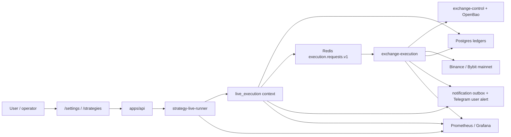

# Mainnet Real-Money Trading v1

Статус: `draft plan`. Документ описывает отдельный цикл внедрения real-money
mainnet trading для Roehub. Это не продолжение `Strategy Producer
Paper/Testnet Trading v1` и не Stage `18` старого
`live-execution-universal-order-gateway-v1`; оба принятых цикла используются
как foundation.

Связанные execution artifacts:

| Артефакт | Путь |
|---|---|
| `plan_doc` | `docs/architecture/live_execution/mainnet-real-money-trading-v1.md` |
| `prompt_pack_dir` | `.codex/agents/generated/mainnet-real-money-trading-v1/` |
| `stage_ledger` | `docs/architecture/live_execution/mainnet-real-money-trading-v1-stage-reports/mainnet-real-money-trading-v1-stage-ledger.md` |
| `execution_mode` | `goal_driven` поверх `plan_doc + prompt_pack_dir + stage_ledger`; `GOAL.md` не требуется |

## Цель

Безопасно включить работу с реальными Binance/Bybit mainnet API для
`spot` и `futures`, доказать реальные market orders малым капиталом и получить
измеримый путь:

```text
candle close -> StrategySignal -> ExecutionSourceEvent -> ExecutionIntent
-> risk accepted -> Redis dispatch -> exchange-execution read
-> native adapter submit -> exchange ack -> DB order persisted
-> first fill -> reconciliation matched -> user/operator notification
```

Критерий успеха v1: Roehub умеет автоматически, но под контролем агента,
исполнить реальные mainnet market orders по Binance/Bybit `spot` и `futures`
с жесткими лимитами, немедленным закрытием canary-позиций, Prometheus/Grafana
метриками, user/operator alerts, reconciliation и безопасным rollback.

## Бизнес-Смысл

Roehub переходит от доказанного `paper/testnet` контура к реальному
money-moving режиму. Ошибка в этом цикле может привести к потере денег,
незакрытым позициям, неизвестному состоянию ордера или повторному submit.
Поэтому каждый stage имеет go/no-go gate: если доказательство не собрано,
stage блокируется, а следующий stage не стартует.

## Уже Доказанный Foundation

| Область | Текущее состояние |
|---|---|
| Exchange keys custody | OpenBao/Transit + `exchange-control` используются как custody boundary; raw secrets не должны попадать в API/UI/логи. |
| Strategy producer | `apps/worker/strategy_live_runner` принят для `paper,testnet`; сейчас deliberately blocks `live/mainnet`. |
| Universal execution path | `ExecutionSourceEvent`, `ExecutionIntent`, risk gate, Redis dispatch, `exchange-execution`, order/fill/reconciliation ledgers уже приняты в testnet cycle. |
| Exchange execution service | `apps/exchange_execution` supervised через launchd/Monit/Prometheus; сейчас adapter mode `disabled/testnet`, mainnet submit hard-blocked. |
| Native adapters | Binance/Bybit native adapters доказаны на testnet; real mainnet enablement не доказан. |
| Market data live tail | 1m live-tail repair принят; `12.4` доказал signal-path latency/dedup для `paper/testnet`. |
| Notifications | `execution_notification_outbox` и admin alert/runbook слой есть; реальная user delivery через Telegram зависит от хостовой доступности `api.telegram.org`. |

## Hard Go/No-Go Decisions

| Decision | Значение v1 | Go/no-go |
|---|---|---|
| Биржи | Binance и Bybit | Обе обязательны для closure. |
| Markets | `spot` и `futures` | Обязательны Binance spot, Binance futures, Bybit spot, Bybit futures. |
| Symbol | `BTCUSDT` | Другие символы вне scope. |
| Order type | Только `market` | `limit`, OCO, trailing, TP/SL, amend/replace, batch orders вне scope. |
| Spot short | Unsupported | Spot canary только long buy -> sell close. |
| Futures direction | Long и short | Только isolated `1x`, default `isolated 1x`, user может задать futures параметры. |
| Futures config | Platform может менять margin/leverage/position config только как явная stage-команда до order submit | Скрытая auto-config внутри submit запрещена. |
| First canary max notional | `15 USDT` на один order | Любой order выше cap блокируется. |
| Budget | Заявлено `20 USDT` на каждый рынок и `60 USDT` всего | До submit нужен explicit capital allocation manifest; пока действует более строгий global cap `60 USDT` и per-order cap `15 USDT`. |
| Canary close | Обязательно немедленное закрытие | Spot buy закрывается sell; futures open закрывается reduce-only market. |
| Strategy mode | Автоматический режим под присмотром агента | Нет ручного подтверждения каждого order; есть scoped allowlist, kill switch и hard caps. |
| Sustained observation | Минимальная длительность | Не 6h; достаточно доказать факт signal -> execution на каждом required market. |
| Telegram/user alert | В scope как обязательный user-alert proof | Stage execution blocked до явного подтверждения пользователя, что проблема Telegram на хосте решена. VLESS/VPN настройка вне scope. |
| Mainnet approval | По stages, не общий вечный флаг | Каждый stage открывает только следующий bounded action. |

## Что Требуется От Пользователя

Эти действия не выполняются агентом и должны быть явно подтверждены в ledger.
Если действие не выполнено, соответствующий stage фиксирует `blocked`.

| Требование | Нужно до stage | Как подтвердить без раскрытия секретов |
|---|---:|---|
| Сказать буквально, что Telegram blocker решен | `01` | Сообщение пользователя: `Telegram blocker resolved for mainnet plan` или русская формулировка `проблема Telegram решена`; затем runtime readiness без раскрытия токенов. |
| Настроить VLESS/VPN для обращений Mac Studio к `api.telegram.org` | `01` | Это вне scope плана; stage только проверяет доступность/готовность. |
| Подключить Binance mainnet API key без withdrawals | `02` | Через `/settings`; report пишет только connection id, exchange, market, masked key suffix. |
| Подключить Bybit mainnet API key без withdrawals | `02` | То же. |
| Включить IP allowlist на публичный IP Mac Studio для mainnet ключей | `02` | Runtime validation/readiness доказывает restricted IP / trade-ready status; raw IP/keys не пишутся в docs. |
| Пополнить реальные балансы | `02` | Минимум достаточно для canary: план исходит из `15 USDT` на order и stricter total cap `60 USDT`; точные balances не публикуются, только pass/fail buckets. |
| Подтвердить capital allocation manifest | `03` | Нужно устранить неоднозначность `20 USDT` на каждый рынок vs `60 USDT` всего. До этого stage не может отправлять реальные orders. |
| Подтвердить futures policy | `05` | Default `isolated 1x`; любые другие user-selected параметры должны быть явно записаны и пройти read-back. |
| Подтвердить first real-money canary window | `06` | Пользователь разрешает bounded canary matrix по `15 USDT`, auto-close, no manual per-order approval. |
| Подтвердить strategy-driven mainnet canary window | `07` | Пользователь разрешает scoped automatic strategy execution под наблюдением агента. |

## Scope

Входит:

| Область | Решение v1 |
|---|---|
| Mainnet credentials | Use existing exchange connection flow and custody boundary; raw credentials не передаются агенту. |
| Binance/Bybit spot/futures | Readiness, account projection, market orders, status/fill/reconciliation. |
| Futures account config | Explicit pre-submit command: set/read isolated `1x` by default, block if mismatch after read-back. |
| Mainnet risk | Per-order, per-market, per-user, per-strategy caps; daily loss cap; open exposure cap; kill switch. |
| User alerts | Outbox + real user-alert delivery proof only after Telegram host blocker resolved. |
| Metrics | Dedicated Prometheus metrics for mainnet latency, slippage, unknown state, reconciliation, exposure, caps, alerts. |
| UI | Mainnet blocked/ready/live status and user-visible warnings on `/settings` and `/strategies`. |
| Validation | Real runtime calls: API, DB, Redis, Prometheus, Monit, browser, exchange mainnet canaries. Tests are gates only. |

Не входит:

| Не входит | Причина |
|---|---|
| Настройка VLESS/VPN на host | Пользователь прямо исключил это из scope. |
| Mainnet beyond BTCUSDT | Следующий отдельный plan/extension. |
| Spot margin/borrow short | Нет отдельного margin product. |
| Advanced orders | Не нужны для v1 market-order canary. |
| Portfolio allocator | Достаточно строгих caps/reservations. |
| ML agent real-money activation | Только compatibility contract; ML activation отдельным планом. |
| Долгий 6h/24h money soak | В v1 нужен минимальный proof факта signal execution per market. |

## Целевая Архитектура



Правило зависимости: `strategy-live-runner` не получает raw secrets и не
вызывает exchange SDK. Он создает `StrategySignal` и `ExecutionSourceEvent`.
Единственная money-moving boundary остается `exchange-execution`.

## Service Calls

| Caller | Callee | Contract | Auth / custody | Timeout / retry | Unknown-state rule |
|---|---|---|---|---|---|
| UI | `apps/api` | Mainnet readiness, launch, dashboard, manual stop/kill | User session + recent-auth where needed | No blind retry for money actions | UI shows pending/unknown, not success |
| `apps/api` | `live_execution` | Source event, intent, risk/cap state | App identity + user ownership | Idempotency by source key | Read durable source/intent before retry |
| `live_execution` | Redis | Dispatch accepted intent | Internal Redis ACL | Retry budget/backpressure/DLQ | DB remains source of truth |
| `exchange-execution` | `exchange-control` | Resolve secret for scoped connection | Service identity; decrypt only in execution service | Bounded timeout; no submit if unavailable | Block submit, readiness degraded |
| `exchange-execution` | Binance/Bybit | Market submit, reduce-only close, status, fills, private stream | Native signed exchange API | Per-exchange limiter; retry only safe failure classes | If provider state unknown, query/reconcile before any retry |
| Notification worker | Telegram API | User/operator alert delivery | Host-local bot config; no tokens in reports | Provider backoff; no blind replay for unknown critical delivery | Unknown delivery blocks closure until inspected |

Official provider docs that must be rechecked by relevant stages:

| Provider | Документ |
|---|---|
| Binance Spot limits | `https://developers.binance.com/docs/binance-spot-api-docs/rest-api/limits` |
| Binance USD-M Futures general info | `https://developers.binance.com/docs/derivatives/usds-margined-futures/general-info` |
| Bybit V5 rate limits | `https://bybit-exchange.github.io/docs/v5/rate-limit` |
| Bybit V5 create order | `https://bybit-exchange.github.io/docs/v5/order/create-order` |

## Error, Retry, Idempotency

| Сценарий | Правило |
|---|---|
| Duplicate strategy signal | Existing `signal_id` / source idempotency key returns existing rows, no duplicate order. |
| Binance HTTP `429` / `418` | Respect provider headers/backoff; no aggressive retry; alert if limiter is insufficient. |
| Binance futures `503` unknown execution status | Treat as `unknown`; first private stream/order-status lookup, then reconciliation, no blind second submit. |
| Bybit async order ack | Ack means accepted, final status comes from websocket/status/reconciliation; do not mark filled without fill facts. |
| Private stream stale | Block submit if private stream proof is required and stale/missing. |
| Redis message pending | Do not ack until durable state transition is written. |
| Unknown order | Kill new dispatch for affected scope, alert user/operator, reconcile from provider before retry/cleanup. |
| Auto-close failed | Critical alert, stop strategy scope, reconcile position, do not continue strategy canary. |
| Notification unknown | Mainnet closure blocked until delivery row inspected or replay policy followed. |

## Mainnet Metrics

Новые/расширяемые метрики должны быть добавлены в Prometheus rules и
`docs/runbooks/prod-dashboard-metrics-reference-ru.md`.

| Metric | Labels | Что измеряет |
|---|---|---|
| `mainnet_execution_latency_seconds_bucket` | `segment`, `exchange`, `market_type`, `source_type` | p50/p95/p99 по сегментам полного пути. |
| `mainnet_signal_to_fill_latency_seconds_bucket` | `exchange`, `market_type`, `direction` | Время от сигнала до первого fill. |
| `mainnet_exchange_submit_latency_seconds_bucket` | `exchange`, `market_type`, `order_type` | Native adapter submit latency. |
| `mainnet_order_slippage_bps` | `exchange`, `market_type`, `direction` | Slippage в bps по canary/fill facts. |
| `mainnet_reconciliation_lag_seconds_bucket` | `exchange`, `market_type` | Время до matched reconciliation. |
| `mainnet_unknown_state_total` | `exchange`, `market_type`, `reason` | Unknown provider/execution states. |
| `mainnet_risk_rejections_total` | `reason`, `exchange`, `market_type` | Mainnet risk/cap/futures-config blocks. |
| `mainnet_open_exposure_usd` | `exchange`, `market_type`, `user_scope` | Текущая открытая экспозиция в mainnet. |
| `mainnet_daily_loss_usd` | `exchange`, `market_type`, `user_scope` | Реализованный/оценочный дневной loss для caps. |
| `mainnet_kill_switch_state` | `scope`, `reason` | Глобальный/per-user/per-strategy/per-exchange stop state. |
| `mainnet_private_stream_age_seconds` | `exchange`, `market_type` | Freshness private order/fill stream. |
| `mainnet_user_alert_delivery_total` | `event_type`, `status`, `channel` | User alert delivery outcomes. |

Метрики не должны иметь high-cardinality labels вроде raw order id, user id,
API key suffix или provider payload.

## Alerts And Runbooks

| Alert | Severity | Owner | Trigger | Action |
|---|---|---|---|---|
| `MainnetTradingKillSwitchOpen` | critical | live-execution | Kill switch active for mainnet scope | Stop dispatch, show UI blocked, do not clear without operator note. |
| `MainnetUnknownOrderState` | critical | live-execution | Unknown provider/order/reconciliation state | Stop affected strategy/exchange, reconcile provider state before retry. |
| `MainnetAutoCloseFailed` | critical | exchange-execution | Canary close failed or position remains open | Stop all mainnet canaries, reconcile/close manually if needed. |
| `MainnetLatencyHigh` | warning/critical | live-execution | p99 segment threshold exceeded | Pause expansion; inspect Redis, adapter, provider, host resources. |
| `MainnetSlippageHigh` | warning/critical | live-execution | Slippage exceeds configured bps threshold | Stop canary expansion; inspect spread/liquidity/order sizing. |
| `MainnetRiskCapNearLimit` | warning | live-execution | Exposure/loss approaches cap | Stop new orders for scope if threshold crossed. |
| `MainnetPrivateStreamStale` | critical | exchange-execution | Stream age above threshold | Block submit, reconnect/backfill/reconcile. |
| `MainnetUserAlertDeliveryFailed` | critical | notifications | Critical trade alert unknown/failed | Block closure and inspect delivery route/provider. |
| `MainnetTelegramUnavailable` | critical | notifications | Host cannot reach Telegram while mainnet enabled | Keep mainnet disabled or open kill switch. |

## Stage Plan

| Stage | Назначение | User required before start | Acceptance / go-no-go |
|---|---|---|---|
| `00` | Baseline and hard-block manifest | Nothing. | Current paper/testnet/gateway foundation reconciled; mainnet hard-blocks listed; no runtime mutation. |
| `01` | User prerequisite and Telegram gate | Literal user confirmation that Telegram problem is solved; host Telegram readiness source available. | Runtime proves Telegram readiness without secrets; mainnet execution remains blocked if not proven. |
| `02` | Mainnet exchange connections read-only readiness | Binance/Bybit mainnet keys connected, IP allowlist enabled, balances funded. | Real read-only Binance/Bybit spot/futures readiness, trade permission/no withdrawal/IP restriction/balance buckets; no order submit. |
| `03` | Mainnet risk, caps, budget and kill-switch policy | Capital allocation manifest resolves `20 per market` vs `60 total`. | Durable risk/cap config, caps, daily loss, exposure, kill switches, UI blocked/ready states; no order submit. |
| `04` | Mainnet metrics, alerts, dashboard and user-alert contract | Telegram gate accepted. | Prometheus rules, dashboard metrics reference, notification outbox/user delivery contract, runbooks updated and smoke-proven; no order submit. |
| `05` | Mainnet adapter enablement behind fail-closed mode | Mainnet readiness/caps accepted. | `exchange-execution` can run in mainnet-capable mode but submit still blocked unless canary gate token/scope is active; no real order. |
| `06` | Futures account config and market-order guard | User approves default or selected futures config. | Binance/Bybit futures set/read back isolated `1x` or user-selected safe config; market-order guard, min notional/precision and auto-close policy proven; no strategy order yet. |
| `07` | Real mainnet ops canary matrix | User approves bounded canary window. | Binance spot long, Binance futures long/short, Bybit spot long, Bybit futures long/short market orders `<=15 USDT`, immediate close, fills/reconciliation/alerts/latency/slippage recorded. |
| `08` | Strategy producer live-mode enablement | User approves scoped automatic strategy window. | `strategy-live-runner` supports scoped `live` mode with allowlists/caps/kill switch; no broad mainnet fan-out. |
| `09` | Strategy-driven mainnet canaries per market | Stage `08` accepted and canary strategy/run selected. | Real strategy signal executes on required markets with auto-close and no manual per-order approval; latency path recorded from candle/signal to fill/reconciliation/alert. |
| `10` | Closure, cleanup and go/no-go record | Nothing unless residual open position/unknown state needs operator action. | No unexpected open orders/positions, no unknown/DLQ/retry growth, metrics/dashboard/alerts verified, ledgers updated, mainnet expansion remains disabled outside accepted scopes. |

## Validation Ladder

| Surface | Minimum proof |
|---|---|
| Local gates | Focused `ruff`, `pyright`, `pytest` for touched areas; docs index for Markdown. |
| API | Real authenticated calls through current production routes or internal local-only endpoints where appropriate. |
| DB | SQL evidence for source events, intents, orders, fills, reconciliation, risk, caps, notifications. |
| Redis | `XINFO`, `XPENDING`, retry/DLQ checks before/after canaries. |
| Exchange | Real Binance/Bybit mainnet read-only calls; canary stages perform real orders only within caps. |
| Browser | `/settings` and `/strategies` proof with no credential leakage in DOM/screenshots. |
| Metrics | Prometheus scrape/query evidence for new mainnet metrics and alerts. |
| Runtime | Mac Studio launchd/Monit/health/readiness proof after changed code reaches `main` and deploy/sync is complete. |
| Performance | p50/p95/p99 latency per segment from durable timestamps; no reasoned estimate as acceptance. |
| User alerts | Delivery proof for mainnet trade/incident notifications; if Telegram unavailable, stage blocked. |

Tests-only acceptance запрещена для всех stages этого плана.

## Planned Files And Artifacts

| Area | Expected touches |
|---|---|
| Plan / ledger | `docs/architecture/live_execution/mainnet-real-money-trading-v1.md`, `docs/architecture/live_execution/mainnet-real-money-trading-v1-stage-reports/mainnet-real-money-trading-v1-stage-ledger.md`, stage reports. |
| Prompt pack | `.codex/agents/generated/mainnet-real-money-trading-v1/*.md`. |
| API / DTO / UI | `apps/api/**`, `apps/web/**` only when stages add mainnet status/actions. |
| Domain/application | `src/trading/contexts/live_execution/**`, `src/trading/contexts/strategy/**`, identity/exchange-control adapters as needed. |
| Runtime | `apps/exchange_execution/**`, `apps/worker/strategy_live_runner/**`. |
| Config/infra | `configs/prod/**`, `infra/macos/launchd/**`, `infra/scripts/monit/**`, `infra/macos/prometheus/**`. |
| Migrations | `alembic/versions/**` for new risk/cap/latency/alert persistence. |
| Runbooks | `docs/runbooks/exchange-execution.md`, `docs/runbooks/strategy-live-worker.md`, `docs/runbooks/prod-dashboard-metrics-reference-ru.md`, `docs/runbooks/notifications-admin-alerts.md`. |
| Evidence | Stage reports under `docs/architecture/live_execution/mainnet-real-money-trading-v1-stage-reports/`; runtime artifacts under `/opt/roehub/state/live_execution/mainnet-real-money-trading-v1/` when created by execution stages. |

## Rollback And Recovery

| Сценарий | Rollback |
|---|---|
| Before real order | Keep mainnet submit disabled; revert config/feature flags; no ledger cleanup needed. |
| After canary order filled and closed | Leave ledger rows immutable; disable mainnet scope; verify no open orders/positions. |
| Auto-close failed | Open kill switch, stop strategy producer mainnet scope, reconcile provider position, perform operator/manual close if needed, record incident. |
| Unknown provider state | Do not replay; query provider order/status/fill, reconcile, then decide. |
| Telegram delivery failed | Keep mainnet expansion blocked; inspect delivery rows/provider health; follow notification replay policy. |
| Metrics/alerts missing | Do not accept stage; keep next stage blocked until Prometheus/Grafana/runbook evidence exists. |

## Open Decisions / Blockers

| Blocker | Почему важно | Resolution required |
|---|---|---|
| Telegram host access to `api.telegram.org` | User alerts are mandatory for real-money v1. | User says the issue is solved; Stage `01` proves readiness. |
| Capital allocation wording conflict | `20 USDT` per market across four market surfaces conflicts with `60 USDT` total. | Stage `03` must record explicit allocation manifest before any submit. |
| Exact strategy for signal canary | A real strategy signal must happen with minimal observation time. | Stage `09` selects/creates a canary strategy/run that can produce a bounded signal on live candles without fake exchange side effects. |
| Telegram real delivery channel | Outbox exists, but actual provider reachability depends on host/VPN. | Stage `04` cannot accept without real delivery readiness/canary proof. |

## Definition Of Done For The Plan

The plan is completed only when:

- all stages `00`-`10` are `accepted` in the stage ledger;
- Binance/Bybit `spot/futures` mainnet canary matrix is completed with real orders and auto-close;
- at least one strategy-driven real signal executes per required market surface;
- no unexpected open order/position remains;
- no unexplained retry/DLQ/unknown/reconciliation debt remains;
- Prometheus metrics and alert rules cover mainnet latency/slippage/reconciliation/user-alert state;
- user alert delivery is proven after Telegram blocker resolution;
- docs, runbooks, prompt pack, ledger and docs index are synchronized;
- mainnet remains disabled outside explicitly accepted scoped allowlists/caps.
