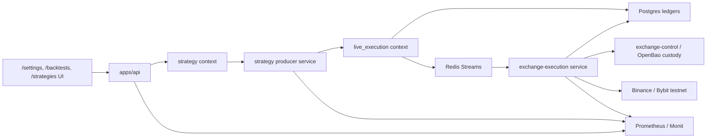

# Strategy Producer Paper/Testnet Trading v1

Статус: architecture plan для нового цикла реализации. Это не Stage `18` старого плана `live-execution-universal-order-gateway-v1`; старый план считается foundation, а этот документ описывает следующий самостоятельный цикл: пользовательский запуск стратегий из доступных backtest variants в `paper` и `testnet`, supervised strategy producer, реальные testnet orders и 6h acceptance с controlled burst/load и CPU/RAM evidence.

## Цель

Доказать полный пользовательский и runtime-цикл безопасной торговли стратегиями без mainnet денег:

| Цель | Что должно быть доказано |
|---|---|
| Пользователь может запустить стратегию из текущего UI/top variants | Через `/backtests` пользователь выбирает доступный variant, создает strategy/profile/run и видит это на `/strategies`. |
| Strategy producer реально создает торговые события | Live стратегия на живых свечах `BTCUSDT` пишет source event/signal, проходит risk gate и идет через уже существующий universal execution path. |
| Paper покрывает полную матрицу сценариев | Все доступные `entry sizing`, `risk mode`, `direction` из пользовательского варианта проходят через paper ledger/accounting с капиталом `$50` на стратегию. |
| Testnet покрывает representative exchange matrix | Реальные testnet orders проходят для Binance/Bybit, spot/futures, long/short и sizing groups на `BTCUSDT`. |
| Manual entry/exit использует тот же путь | Отдельные UI-кнопки manual entry и manual stop/exit создают такие же source events, intents, orders/outcomes. |
| Runtime работает как production-сервис | Strategy producer supervised через launchd/Monit, виден в Prometheus, имеет kill switches, allowlists, logs, redaction и restart evidence. |
| Производительность и задержки измеряются | Логируется gap от сигнала до intent, dispatch, exchange submit, ack/fill; 6h gate обязателен и включает controlled burst/load + CPU/RAM impact evidence. |

## Контекст

Уже принято в `docs/architecture/live_execution/live-execution-universal-order-gateway-v1.md` и его stage ledger:

| Область | Текущее состояние |
|---|---|
| Backtest variant promotion | Есть owner-scoped create-from-variant и provenance. |
| Live profile/run lifecycle | Есть live profile, run/stop/restart hardening и readiness. |
| Compatibility/readiness | Есть strategy compatibility checker, market-data readiness, exchange account projection и config guard. |
| Money boundary | Есть source events, intents, risk gate, Redis dispatch, `exchange-execution`, order/fill/reconciliation ledger, notification outbox. |
| Exchange adapters | Есть native testnet adapters и bounded Bybit spot canary; mainnet остается blocked. |
| UI evidence | `/backtests`, `/strategies`, `/settings` уже имеют отдельные доказанные части, но не полный пользовательский путь запуска testnet стратегии. |

Этот план не перепроектирует `exchange-execution`. Он включает его как существующий money boundary и добавляет верхний слой: supervised strategy producer, UI flow и покрытие сценариев.

## Бизнес-Смысл

Roehub должен дать пользователю простой путь: добавить testnet биржу, выбрать результат бэктеста, выделить небольшой капитал, запустить стратегию, увидеть сигналы, сделки, статус, ошибки и журнал. Для production-платформы с деньгами важно доказать это не на unit tests, а на реальном runtime: API, Postgres, Redis, browser, Monit, Prometheus и testnet exchanges.

## Охват

Входит:

| Область | Решение v1 |
|---|---|
| Exchange keys | Пользователь добавляет Binance/Bybit testnet keys через существующий `/settings`; секреты не передаются агенту и не пишутся в docs. |
| Instruments | Только `BTCUSDT`. Артефакты для остальных рынков пользователь добавит отдельно, вне scope. |
| Markets | `spot` и `futures`. Futures short допускается только как безопасный изолированный short `1x`. |
| Modes | `paper` и `testnet`. Mainnet/real money вне scope. |
| Capital | `$50` виртуального/тестового капитала на одну strategy allocation. |
| Strategy source | Любой доступный пользователю variant из текущего UI/top variants, если compatibility/readiness допускают запуск. |
| Scenario coverage | Все доступные `entry sizing`, `risk mode`, `direction` в paper; representative subset в testnet. |
| Manual actions | Отдельные кнопки manual entry и manual stop/exit на UI, через общий source-event/execution path. |
| Runtime | Strategy producer как supervised service через launchd/Monit, с Prometheus metrics и kill switches. |
| Load | Десятки/сотни testnet strategies с соблюдением внутренних и биржевых rate limits; Stage `12` повторно усиливает нагрузку controlled burst-интервалом внутри soak. |
| Resource impact | CPU/RAM влияние измеряется существующими Mac Studio monitoring/benchmark методами: Prometheus `node-exporter`, service metrics, Monit и уже принятые resource snapshots; отсутствие таких метрик блокирует acceptance до старта soak. |
| 6h acceptance | Обязательный логируемый 6h gate после end-to-end readiness; сокращение прежнего длительного soak окна компенсируется controlled burst/load и обязательным CPU/RAM evidence. |
| Notification delivery | Реальная доставка Telegram/email вне scope, но outbox/event contract должен быть совместимым. |

Не входит:

| Не входит | Причина |
|---|---|
| Mainnet submit | Следующий отдельный план с real-money risk controls. |
| Скрытое изменение настроек биржи во время исполнения | Execution/order submit не должен сам менять leverage/margin/position mode. Управление account config допускается только отдельной явной operator-командой для testnet futures с read-back proof. |
| Не-`BTCUSDT` рынки | Артефакты будут добавлены пользователем отдельно. |
| Полная ML agent реализация | Нужен только совместимый source-event/outbox contract. |
| Telegram/email delivery | Delivery service вне scope, outbox совместимость сохраняется. |
| Advanced orders | OCO, trailing, TP/SL exchange orders, amend/replace и multi-leg orders не добавляются в этом цикле. |

## Direction Semantics v1

| Market | `long` | `short` |
|---|---|---|
| `spot` | Может быть реальным testnet buy/sell lifecycle, если min notional/precision/balance проходят. | В v1 не является реальным spot order без отдельного margin/borrow продукта. Acceptance для spot-short: явный blocked/unsupported scenario с reason code, а не “фейковый short”. |
| `futures` | Может быть реальным testnet futures long при verified account/config guard. | Может быть реальным testnet futures short только при verified isolated margin, leverage `1x`, expected position mode, precision, min notional и balance projection. |

Paper stage обязан пройти все `direction` branches, но не должен маскировать unsupported spot-short как production-capable real order. Testnet stage обязан выполнить реальные shorts через futures, а spot-short зафиксировать как корректно заблокированную ветку, пока margin trading не появится отдельным планом.

## Термины Fail-Closed И Account Config

| Термин | Простыми словами | Решение в этом плане |
|---|---|---|
| `fail-closed` | Если безопасное состояние не доказано, действие запрещено. Например, если futures account не подтвержден как isolated `1x`, short не отправляется. | Обязательно. Любая неопределенность блокирует запуск/order с понятной причиной. |
| Явная account-config command | Оператор в `/settings`/API отдельно меняет testnet futures account config: margin mode и leverage. | Разрешено для Binance/Bybit testnet futures как отдельная команда: preflight no open orders/positions for symbol, documented exchange API call, read-back proof. Не вызывается скрыто из order submit. |
| Безопасный изолированный short `1x` | Futures short допускается только если account/position mode, margin mode, leverage, precision, min notional и balance projection доказаны заранее. | Verify-only guard перед запуском и перед order; mismatch блокирует сценарий. |

## Целевая Архитектура



Ключевая зависимость: Strategy producer не знает API secrets и не вызывает exchange SDK. Он создает source events/signals и передает их в `live_execution`. Единственный exchange submit boundary остается `exchange-execution`.

Service shape v1: переиспользуем существующий runtime `apps/worker/strategy_live_runner` как supervised strategy producer. Новый отдельный app/process допускается только если Stage `01` или Stage `06` докажет, что reuse существующего worker нарушает безопасность, lifecycle или observability; тогда executor обязан обновить plan/ledger и зафиксировать отдельное architecture decision до реализации нового процесса.

## Направление Зависимостей

| Слой | Может зависеть от | Не должен зависеть от |
|---|---|---|
| Strategy domain/application | StrategySpec, profile, compatibility, producer ports | Exchange SDK, OpenBao token, raw exchange credentials |
| Strategy producer service | Strategy use cases, market-data readers, execution producer port | UI internals, direct exchange adapters |
| live_execution | Source events, risk, orders, ledgers, dispatch ports | Browser/UI, strategy internals beyond published source contract |
| exchange-execution | Redis consumer, order adapters, credential resolver, DB order ledger | Strategy run internals, user UI state |
| apps/api/UI | Public use cases and read models | Plaintext secrets, direct exchange submit |

## Пользовательские Сценарии

| Сценарий | Ожидаемый путь |
|---|---|
| Добавить биржу | `/settings` -> connect Binance/Bybit testnet key -> validation/readiness -> connection available for testnet strategy launch. |
| Запустить paper strategy | `/backtests` -> top/available variant -> launch strategy -> choose paper, `$50`, sizing/risk/direction -> `/strategies` shows run, signals, paper positions/outcomes. |
| Запустить testnet strategy | Same flow, но с выбранной testnet exchange connection, market type, safe config guard и allowlist. |
| Manual entry | `/strategies` -> manual entry button -> source event `manual_request` -> risk gate -> paper/testnet order. |
| Manual stop/exit | `/strategies` -> manual stop/exit -> source event -> exit/close request -> outcome visible in journal. |
| Stop/restart strategy | `/strategies` -> stop/restart controls -> producer and run state change, no duplicate active run. |
| Смотреть историю | `/strategies` shows latest signals, source event, intent, order/fill/reconciliation/outbox status and latency gap. |

## Контракты И Хранение

Новые или расширяемые контракты должны быть additive/compatible unless explicitly stated:

| Контракт | Требование |
|---|---|
| Launch config DTO | `mode=paper|testnet`, `exchange_connection_id`, `market_type=spot|futures`, `symbol=BTCUSDT`, `capital_allocation_usd=50`, `entry_sizing`, `risk_mode`, `direction`, `allowlist_scope`. |
| Strategy producer source event | `source_type=strategy_signal|manual_request`, source refs, strategy/run/profile ids, scenario metadata, idempotency key. |
| Scenario matrix artifact | Durable record of all discovered entry sizing/risk/direction combinations and which were paper/testnet-covered. |
| Safe futures guard | Records account config evidence: isolated margin, leverage `1x`, position mode, filters, min notional, precision, projection age. Evidence can come from read-only account-state or from the explicit testnet account-config command followed by read-back. |
| Latency ledger | Stores timestamps for signal observed, source event persisted, intent persisted, risk accepted, dispatch, exchange submit, ack, fill/reconcile. |
| Outbox contract | Internal notification rows/events are delivery-neutral and safe for future Telegram/email reuse. |

Все sensitive fields запрещены в logs/docs/metrics/screenshots: API keys, secrets, cookies, tokens, raw signed payloads, OpenBao tokens, raw Authorization headers.

## Сервисные Обращения

| Caller | Callee | Стиль | Contract | Timeout / retry | Failure behavior |
|---|---|---|---|---|---|
| UI | `apps/api` | HTTP | Launch strategy, run/stop/restart, manual entry/exit, dashboards | Browser/API timeout bounded by existing frontend client; no hidden browser retry for money-moving actions. | Show fail-closed reason; duplicate actions require idempotency key. |
| `apps/api` | Strategy use cases | In-process | Create strategy/profile/run and read models | DB transaction timeout from existing API/DB config; no blind retry after partial write, use idempotency/read-after-write. | Transactional errors become stable API codes. |
| Strategy producer (`apps/worker/strategy_live_runner`) | Redis market-data streams / DB | Async/read | Closed candles, strategy runs, checkpoints | Bounded polling/block timeout; backoff on unavailable Redis/DB; no busy loop. | Missing/stale feed blocks strategy cycle and emits observable reason. |
| Strategy producer (`apps/worker/strategy_live_runner`) | `live_execution` port | In-process or service ACL | Source event + execution request | Idempotent write path; retry only after lookup by idempotency/source key. | Duplicate returns existing result; partial/unknown state is read before retry. |
| `live_execution` | Redis `execution.requests.v1` | Async transport | Dispatch accepted intents only | Existing retry budget/backpressure policy; retry stream then DLQ/quarantine. | Redis outage -> retry/quarantine; DB remains source of truth. |
| `exchange-execution` | ExchangeControl/OpenBao | Service call | Resolve secret for execution scope only | Short bounded service timeout; no order submit when custody/readiness is unavailable. | Secret backend unavailable -> no submit, readiness degraded. |
| `exchange-execution` | Binance/Bybit testnet | Native HTTP/WebSocket | Submit/cancel/status/private stream | Native adapter timeouts, per-exchange limiter, bounded retry only for safe retryable classes. | Unknown state requires provider lookup/reconciliation before retry. |

## Ошибки, Retry И Idempotency

| Риск | Правило |
|---|---|
| Duplicate launch/manual action | Client/server idempotency key; duplicate returns existing resource/outcome. |
| Unknown exchange submit | Never blind retry. First query provider status or reconcile from private/public order status. |
| Rate limit | Per-exchange limiter, retry budget, backpressure metrics, DLQ/quarantine for poison messages. |
| Strategy producer crash | Resume from durable run/checkpoint/source-event ledger; no duplicate submit without idempotency proof. |
| Safe futures config unknown | Block scenario as `config_guard_not_verified` or similar stable reason. |
| Insufficient `$50` allocation/min notional | Block with reason; do not auto-increase capital. |
| Manual exit unknown state | Record source event, risk result, order/reconciliation status; UI must show unknown/pending instead of success. |

## Логирование И Redaction

| Можно логировать | Нельзя логировать |
|---|---|
| Strategy id, run id, connection id, exchange name, market type, symbol, bounded reason code, non-sensitive order status, hashed idempotency/source key | API key, secret, passphrase, cookies, tokens, OpenBao token, plaintext/ciphertext, signed payload, raw Authorization, raw exchange response with sensitive fields |
| Aggregated latency, counters, p95/p99, order status category | User-specific or order-specific values as high-cardinality Prometheus labels |
| Provider order id only in DB/stage evidence when needed and redacted in reports if sensitive | Provider payload dumps in logs or docs |

## Monitoring И Alerts

| Signal | Metric / evidence | Severity | Owner |
|---|---|---|---|
| Strategy producer down | Monit service not running, `/metrics` absent | critical | operator |
| Mainnet submit attempted | Counter/audit event must stay zero | critical | operator |
| Signal-to-submit latency high | p95/p99 gap by stage, no user/order labels | warning/critical by threshold | operator |
| Redis dispatch lag | pending, retry, DLQ, consumer lag | warning | operator |
| Exchange adapter rate limit/backpressure | limiter wait, retry budget, DLQ | warning | operator |
| Config guard mismatch | blocked scenario counters | info/warning | product/operator |
| 6h soak/resource failure | any unknown unreconciled order, unexpected stop, secret leak, mainnet attempt, sustained CPU/RAM saturation, unbounded RSS growth, or burst impact not returning to accepted band | critical | operator |

## План Внедрения

| Stage | Название | Смысл | Acceptance: реальные доказательства |
|---|---|---|---|
| `01` | Baseline and handoff freeze | Зафиксировать текущее состояние Stage 17, Mac Studio services, `/settings`, `/backtests`, `/strategies`, Redis/Postgres/Prometheus. | SSH `macstudio`, API curls, SQL inventory, Redis `XINFO`, Monit/Prometheus probes, browser screenshots. |
| `02` | Backtest-to-strategy launch UI | Пользовательский launch flow из доступных UI/top variants с `$50`, paper/testnet, market, exchange, sizing/risk/direction. | Playwright: `/backtests` -> launch -> `/strategies`; API/DB proof; rejected cases visible. |
| `03` | Scenario matrix and compatibility | Найти фактические `entry sizing`, `risk mode`, `direction` из доступных variants и создать durable coverage matrix. | API/top variants calls, SQL matrix rows, compatibility/readiness calls, docs report with no guessed combinations. |
| `04` | BTCUSDT market readiness | Проверить/provision readiness только для `BTCUSDT` across Binance/Bybit spot/futures; non-BTC остается out of scope. | Redis market-data freshness, ClickHouse/reference rows, API readiness, browser status. |
| `05` | Safe testnet exchange binding | Testnet exchange selection, futures guard, safe isolated short `1x`, no hidden order-time config mutation. | Real Binance/Bybit testnet account/config reads, SQL projection, guard mismatch block; later repair adds explicit account-config command rather than mutating during submit. |
| `06` | Supervised strategy producer | Отдельный launchd/Monit service for strategy producer, per-user/per-strategy allowlist, admin switch, no mainnet. | launchd/Monit/Prometheus evidence, health/readiness, stop/restart proof, kill switch, allowlist block/allow. |
| `07` | Paper full branch coverage | Полная matrix coverage в paper: all sizing/risk/direction with `$50`, paper orders/fills/accounting. | API/DB/Redis/browser proof for every matrix row; PnL/fees/funding completeness flags; no exchange submit. |
| `08` | Manual entry and manual exit | UI buttons for manual entry and manual stop/exit through same source-event/risk/order path. | Playwright clicks, source-event/intent/order/outbox rows, duplicate/idempotency proof, blocked state proof. |
| `09` | Real testnet representative orders | Binance/Bybit x spot/futures x long/short branches x sizing groups on `BTCUSDT`; spot-short is blocked/unsupported unless margin product exists, futures short only isolated `1x`. | Real testnet order submit/status/fill/cancel or close for supported branches, explicit blocked proof for unsupported spot-short, DB order/fill/reconciliation rows, Redis ack, metrics, no mainnet. |
| `10` | Strategy UI status and journal | `/strategies` shows market/exchange/environment, producer state, latest signals, execution outcome links, manual controls. | Playwright desktop/mobile, console/network clean, DOM secret scan, API dashboard proof. |
| `11` | Rate limits and load harness | Dozens/hundreds of testnet-mode strategies while respecting internal/exchange limits and backpressure; paper may be used only as supporting baseline, not acceptance substitute. | Controlled testnet-mode load run, limiter wait metrics, queue lag, p95/p99 latency, no DLQ growth beyond accepted threshold. |
| `12` | 6h supervised soak | Mandatory 6h logged acceptance gate on paper+testnet strategies with one controlled amplified-load interval. | 6h logs, Prometheus snapshots, SQL counts, Redis pending/DLQ, Monit uptime, Stage `11`/existing harness burst evidence, CPU/RAM baseline/during/post/final snapshots, final browser/API report. |
| `13` | Notifications and operator runbooks | Outbox/event contract for future delivery, alert severity/owner/escalation, runbooks. | Outbox rows for rejected/fill/exit/kill/unknown, Prometheus rules, runbook drill evidence. |
| `14` | Final readiness and docs closure | Stage reports, ledger, docs index, prompt pack closure, delivery readiness. | All stage reports accepted, docs index check, `github:yeet` publish evidence, main-branch delivery evidence, CI/deploy/host-sync evidence where applicable, final go/no-go for separate mainnet plan. |

## Планируемые Файлы И Артефакты По Stages

| Stage | Основные зоны изменений | Stage report |
|---|---|---|
| `01` | docs/runtime inventory only unless drift repair is required | `docs/architecture/live_execution/strategy-producer-paper-testnet-trading-v1-stage-reports/01-baseline-handoff-freeze.md` |
| `02` | `apps/api/routes/ui_backtests.py`, `apps/api/routes/strategies.py`, `apps/web/dist/js/pages/backtests.js`, `apps/web/dist/js/pages/strategies.js`, strategy launch use cases | `02-backtest-launch-ui.md` |
| `03` | strategy compatibility/matrix use cases, DTOs, migrations, tests | `03-scenario-matrix-compatibility.md` |
| `04` | market-data readiness/reference config, Redis readiness adapters, docs | `04-btcusdt-market-readiness.md` |
| `05` | exchange account projection/config guard, API readiness, exchange-control calls, docs/runbook | `05-safe-testnet-exchange-binding.md` |
| `06` | reuse `apps/worker/strategy_live_runner` as supervised strategy producer, launchd/Monit/Prometheus assets, env config; new app only with documented blocker/architecture update | `06-supervised-strategy-producer.md` |
| `07` | paper accounting/coverage runners, strategy producer integration, API/UI read models | `07-paper-full-branch-coverage.md` |
| `08` | manual source endpoints/UI controls, source-event integration, idempotency | `08-manual-entry-exit.md` |
| `09` | testnet scenario runner, native adapter coverage, reconciliation evidence | `09-real-testnet-representative-orders.md` |
| `10` | `/strategies` dashboard/status/journal UI and API read models | `10-strategy-ui-status-journal.md` |
| `11` | load harness, limiter metrics, Prometheus rules, ops scripts | `11-rate-limits-load-harness.md` |
| `12` | 6h soak runner/reporting, controlled burst/load evidence, Mac Studio CPU/RAM logs/evidence scripts | `12-supervised-6h-soak.md` |
| `13` | notification outbox compatibility, alert rules, runbooks | `13-notifications-runbooks.md` |
| `14` | final docs, index, stage ledger closure, prompt pack audit | `14-final-readiness-docs-closure.md` |

## File Manifest Contract

План заранее задает ожидаемые зоны изменений, но точный список code files может уточняться во время реализации. Чтобы это не стало размытым scope, каждый stage обязан вести file manifest.

| Правило | Требование |
|---|---|
| Новые обязательные файлы | Каждый stage создает или обновляет свой stage report в `docs/architecture/live_execution/strategy-producer-paper-testnet-trading-v1-stage-reports/`. |
| Единый ledger | Каждый stage обновляет `strategy-producer-paper-testnet-trading-v1-stage-ledger.md`; отсутствие изменения ledger после validation является acceptance blocker. |
| Prompt file | Каждый stage исполняется только через соответствующий prompt из `.codex/agents/generated/strategy-producer-paper-testnet-trading-v1/`. |
| Docs index | Если меняются Markdown docs, обязательно обновить/проверить `docs/architecture/README.md`. |
| File manifest в stage report | Stage report обязан иметь таблицу `Created / Modified / Deleted / Reason / Contract impact`. |
| Pre-edit concrete list | Если prompt указывает директорию как expected path, executor обязан до редактирования сузить ее до конкретного списка файлов или новых planned files и записать это в stage report. |
| Scope justification | Любой файл вне `expected_primary_touches` и `possible_secondary_touches` prompt-а должен быть отдельно объяснен в stage report и ledger. |
| No hidden files | Нельзя оставлять локальные evidence/log/session/temp файлы в repo. Если evidence нужен, записывать только sanitized summary в stage report. |

Плановые новые durable artifacts:

| Artifact | Path |
|---|---|
| Plan | `docs/architecture/live_execution/strategy-producer-paper-testnet-trading-v1.md` |
| Ledger | `docs/architecture/live_execution/strategy-producer-paper-testnet-trading-v1-stage-reports/strategy-producer-paper-testnet-trading-v1-stage-ledger.md` |
| Prompt pack | `.codex/agents/generated/strategy-producer-paper-testnet-trading-v1/*.md` |
| Stage reports | `docs/architecture/live_execution/strategy-producer-paper-testnet-trading-v1-stage-reports/<stage>.md` |

Prompt/report mapping:

| Stage | Prompt | Required stage report |
|---|---|---|
| `01` | `.codex/agents/generated/strategy-producer-paper-testnet-trading-v1/01-baseline-handoff-freeze.md` | `docs/architecture/live_execution/strategy-producer-paper-testnet-trading-v1-stage-reports/01-baseline-handoff-freeze.md` |
| `02` | `.codex/agents/generated/strategy-producer-paper-testnet-trading-v1/02-backtest-launch-ui.md` | `docs/architecture/live_execution/strategy-producer-paper-testnet-trading-v1-stage-reports/02-backtest-launch-ui.md` |
| `03` | `.codex/agents/generated/strategy-producer-paper-testnet-trading-v1/03-scenario-matrix-compatibility.md` | `docs/architecture/live_execution/strategy-producer-paper-testnet-trading-v1-stage-reports/03-scenario-matrix-compatibility.md` |
| `04` | `.codex/agents/generated/strategy-producer-paper-testnet-trading-v1/04-btcusdt-market-readiness.md` | `docs/architecture/live_execution/strategy-producer-paper-testnet-trading-v1-stage-reports/04-btcusdt-market-readiness.md` |
| `05` | `.codex/agents/generated/strategy-producer-paper-testnet-trading-v1/05-safe-testnet-exchange-binding.md` | `docs/architecture/live_execution/strategy-producer-paper-testnet-trading-v1-stage-reports/05-safe-testnet-exchange-binding.md` |
| `06` | `.codex/agents/generated/strategy-producer-paper-testnet-trading-v1/06-supervised-strategy-producer.md` | `docs/architecture/live_execution/strategy-producer-paper-testnet-trading-v1-stage-reports/06-supervised-strategy-producer.md` |
| `07` | `.codex/agents/generated/strategy-producer-paper-testnet-trading-v1/07-paper-full-branch-coverage.md` | `docs/architecture/live_execution/strategy-producer-paper-testnet-trading-v1-stage-reports/07-paper-full-branch-coverage.md` |
| `08` | `.codex/agents/generated/strategy-producer-paper-testnet-trading-v1/08-manual-entry-exit.md` | `docs/architecture/live_execution/strategy-producer-paper-testnet-trading-v1-stage-reports/08-manual-entry-exit.md` |
| `09` | `.codex/agents/generated/strategy-producer-paper-testnet-trading-v1/09-real-testnet-representative-orders.md` | `docs/architecture/live_execution/strategy-producer-paper-testnet-trading-v1-stage-reports/09-real-testnet-representative-orders.md` |
| `10` | `.codex/agents/generated/strategy-producer-paper-testnet-trading-v1/10-strategy-ui-status-journal.md` | `docs/architecture/live_execution/strategy-producer-paper-testnet-trading-v1-stage-reports/10-strategy-ui-status-journal.md` |
| `11` | `.codex/agents/generated/strategy-producer-paper-testnet-trading-v1/11-rate-limits-load-harness.md` | `docs/architecture/live_execution/strategy-producer-paper-testnet-trading-v1-stage-reports/11-rate-limits-load-harness.md` |
| `12` | `.codex/agents/generated/strategy-producer-paper-testnet-trading-v1/12-supervised-6h-soak.md` | `docs/architecture/live_execution/strategy-producer-paper-testnet-trading-v1-stage-reports/12-supervised-6h-soak.md` |
| `13` | `.codex/agents/generated/strategy-producer-paper-testnet-trading-v1/13-notifications-runbooks.md` | `docs/architecture/live_execution/strategy-producer-paper-testnet-trading-v1-stage-reports/13-notifications-runbooks.md` |
| `14` | `.codex/agents/generated/strategy-producer-paper-testnet-trading-v1/14-final-readiness-docs-closure.md` | `docs/architecture/live_execution/strategy-producer-paper-testnet-trading-v1-stage-reports/14-final-readiness-docs-closure.md` |

## Затрагиваемая Документация

| Документ | Что обновлять |
|---|---|
| `docs/architecture/live_execution/live-execution-universal-order-gateway-v1.md` | Только если найден drift foundation-фактов; не переписывать как текущий план. |
| `docs/architecture/live_execution/live-execution-universal-order-gateway-v1-stage-reports/...` | Читать как источник доказанного foundation; не менять без причины. |
| `docs/architecture/live_execution/strategy-producer-paper-testnet-trading-v1.md` | Source of truth нового цикла. |
| `docs/architecture/live_execution/strategy-producer-paper-testnet-trading-v1-stage-reports/strategy-producer-paper-testnet-trading-v1-stage-ledger.md` | Единый журнал итераций; обновлять каждый stage. |
| `docs/architecture/identity/identity-exchange-connections-live-trading-v1.md` | Обновлять на Stage `05`, если меняются `/settings`, exchange connection readiness, trading capability, validation или strategy-binding semantics. |
| `docs/architecture/identity/exchange-connections-stage-reports/identity-exchange-connections-live-trading-v1-iteration-ledger.md` | Читать как current exchange-connections handoff; обновлять только если Stage `05` реально меняет identity/exchange-connection contract. |
| `docs/architecture/README.md` | Обновлять через `python -m tools.docs.generate_docs_index --check` после markdown changes. |
| Operations runbooks / Monit / Prometheus docs | Обновлять на stages `06`, `11`, `12`, `13`, если меняются runtime/alerts. |

## Журнал Выполнения Stages

Единый ledger:

```text
docs/architecture/live_execution/strategy-producer-paper-testnet-trading-v1-stage-reports/strategy-producer-paper-testnet-trading-v1-stage-ledger.md
```

Правила:

| Правило | Требование |
|---|---|
| Tests are gates, not acceptance | Каждый stage обязан иметь реальные вызовы к затронутым boundaries. |
| No secrets in evidence | Нельзя писать ключи, secrets, cookies, tokens, raw signed payloads. |
| Dependent stages blocked | Следующий зависимый stage не стартует, пока предыдущий не accepted или не superseded repair stage. |
| Mac Studio runtime | Git на `macstudio` только в `/Users/daniildegtyarev/Projects/roehub.com`; runtime checks в `/opt/roehub/app` только для deploy/smoke. |
| 6h gate | Stage `12` нельзя заменить коротким smoke; нужен фактический 6h логируемый acceptance с controlled burst/load, CPU/RAM snapshots и cleanup evidence. |

## Delivery, Main И Host Sync Contract

Каждый успешный stage должен быть не только проверен локально, но и доведен до состояния, из которого следующий stage может стартовать без расхождения между локальным checkout, GitHub и Mac Studio.

| Шаг | Обязательное правило |
|---|---|
| Pre-start user requirements | До реализации executor явно пишет `User required before start: ...`. Если ничего не нужно, пишет `User required before start: nothing`. Если нужны ключи/доступы/артефакты, executor останавливается до implementation и указывает точное действие; secrets не передаются в чат и добавляются только через штатный UI/env. |
| GitHub publish | После successful validation и до финального статуса stage executor использует `github:yeet`/`publish-ci-deploy` discipline для `gh --version`, `gh auth status`, `git status -sb`, diff scope, безопасного stage/commit/push. |
| Branch lifecycle | Ветка допустима только как временная delivery branch, когда direct-main delivery небезопасен или неудобен. Не создавать отдельную per-stage ветку без причины. Если ветка/PR созданы, successful stage обязан быть доставлен в `main`, а временная local/remote branch должна быть удалена после доказательства, что `main` содержит изменения. |
| Ограничение branch/PR | Draft PR, pushed branch или local branch не доказывают production delivery: это только промежуточное состояние. Если stage остановился на branch/PR, он остается `blocked`, а следующий зависимый stage не стартует. |
| Main branch evidence | Stage нельзя помечать `accepted`, пока не записано доказательство, что изменения доставлены в `origin/main` или другой утвержденный main-branch delivery path для этого цикла. Минимум: main commit SHA, branch/PR path или `N/A direct-main`, CI/checks status, `git rev-parse origin/main` или эквивалентный delivery evidence, плюс branch cleanup evidence если branch использовалась. |
| Mac Studio host sync | Для runtime/code stages нужен evidence, что `macstudio` checkout `/Users/daniildegtyarev/Projects/roehub.com` синхронизирован с доставленным SHA, а runtime `/opt/roehub/app` обновлен через deploy workflow или явно описанный sync path и прошел smoke. Git-команды в `/opt/roehub/app` запрещены. |
| Docs-only stages | Если stage меняет только docs/prompt artifacts, runtime sync может быть `N/A`, но причина `N/A` и main/docs delivery evidence обязательны. |
| Delivery blocker | Если validation пройдена, но branch/PR не доставлены в `main`, temporary branch не удалена, CI/deploy или host sync заблокированы, stage report и ledger фиксируют blocker `delivery_pending_main_host_sync`; следующий зависимый stage не стартует без явного unblock/supersede решения. |

## Prompt Pack

Prompt pack для реализации этого плана должен жить здесь:

```text
.codex/agents/generated/strategy-producer-paper-testnet-trading-v1/
```

Каждый prompt обязан:

| Требование | Смысл |
|---|---|
| Читать plan + ledger | Executor должен знать текущий accepted/blocker state. |
| Обновлять ledger | Handoff фиксируется после validation и до финального отчета. |
| Явно назвать требования к пользователю до старта | Executor пишет `User required before start: ...`; при необходимости ключей/артефактов/доступов останавливается до implementation. |
| Требовать реальные evidence | API/DB/Redis/browser/Monit/Prometheus/testnet calls по surface stage. |
| Использовать disciplined publish | После successful validation publish идет через `github:yeet`/`publish-ci-deploy` discipline; ветка/PR допустимы только как временный путь доставки. |
| Доставлять successful stage в `main` и синхронизировать host | Stage `accepted` только после main-branch delivery evidence, cleanup временных веток/PR если они использовались, и, где применимо, Mac Studio runtime sync/smoke. |
| Не переходить в mainnet | Mainnet submit blocked до отдельного плана. |

## Риски И Открытые Вопросы

| Риск | Обработка |
|---|---|
| Не каждый UI/top variant реально launchable | Stage `03` должен доказать matrix из фактических variants; unsupported variants показываются как blocked, не маскируются. |
| `$50` может быть меньше min notional для некоторых сценариев | Stage `03`/`05`/`07`/`09` фиксируют min-notional block; капитал не увеличивается автоматически. |
| Futures short требует account config | Stage `05`/`09` блокируют short, если isolated `1x` не доказан. Оператор может исправить testnet futures config через явную account-config command; execution всё равно проверяет read-back evidence перед order. |
| Spot short не является обычным spot order | Stage `03`/`07`/`09` должны доказать эту ветку как blocked/unsupported без margin trading, а не симулировать ее как реальный spot short. |
| Сотни testnet strategies могут создать bursts | Stage `11` обязан доказать внутренний limiter/backpressure на testnet-mode strategies, даже если биржевые лимиты ожидаемо не достигнуты. |
| 6h gate может выявить flaky runtime или resource pressure | Stage `12` фиксирует blocker, не принимает план “с оговоркой”; burst impact должен вернуться в заранее заданный acceptable band. |
| Notification delivery еще нет | Stage `13` делает delivery-neutral outbox contract, но не обещает Telegram/email доставку. |
