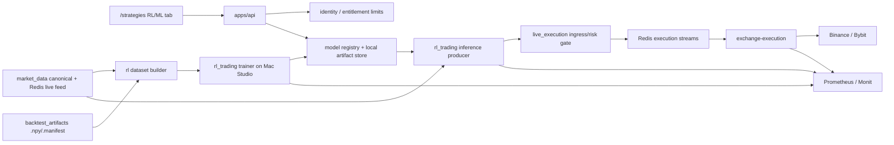

# RL Trading Agent Platform v1

Статус: architecture plan для staged внедрения платформенного RL/ML trading agent на базе концепции D3QN/PER из `YuriyKolesnikov/rl-trading-binance`, но с посадкой в текущую архитектуру Roehub. Документ не является реализацией и не открывает mainnet execution сам по себе.

## Цель

Построить полный production-ready путь RL-стратегии:

1. доказать воспроизводимость подхода на внешнем HF dataset;
2. собрать Roehub-native dataset из `market_data` и backtest artifacts;
3. обучать общую платформенную модель на Mac Studio с CPU/GPU/MPS evidence;
4. вести model registry, dataset lineage, reproducibility hashes и per-ticker calibration;
5. показывать RL/ML стратегию в отдельной вкладке `/strategies`;
6. запускать сигналы в `monitor_only`, затем `paper`, `testnet`, и только после доказательств переходить к bounded `mainnet live`;
7. ограничивать количество активных live tickers по тарифу backend-лимитами без полноценного billing.

## Контекст

### Проверенные факты на момент дизайна

| Область | Наблюдение |
|---|---|
| Execution boundary | В Roehub уже есть `live_execution`, `ml_agent_decision`, source events, intents, risk gate, Redis dispatch, `exchange-execution`, order/fill/reconciliation ledgers. |
| Classic strategy producer | `docs/architecture/live_execution/strategy-producer-paper-testnet-trading-v1.md` является отдельным циклом для запусков classic strategies в `paper`/`testnet`; ledger сейчас `current_stage=05`, Stage `05` blocked на Binance Futures Testnet account funding/config after the new connection validated and read account-state. Current blockers are `insufficient_balance`, `margin_mode_mismatch`, and `leverage_mismatch`. RL execution stages `15`/`16` blocked до classic Stage `07`/`09` after Stage `05` repair. |
| Market coverage | На Mac Studio `market_data.ref_market` содержит Binance/Bybit × spot/futures. |
| Canonical candles | `market_data.canonical_candles_1m` содержит `open/high/low/close`, `volume_base`, `volume_quote`, `trades_count`, taker volumes, source/ingestion metadata. |
| Artifact arrays | Текущий backtest artifact loader грузит `ohlcv.f32.npy` как 5 колонок OHLCV; этого недостаточно для полного 7-feature формата статьи без augment/enrich. |
| Data completeness snapshot | Binance spot/futures имеют `volume_quote` и `trades_count`; Bybit spot/futures имеют `volume_quote`, но `trades_count` сейчас отсутствует в canonical rows. Training-source v1 is now explicitly restricted to `binance:futures`, so Bybit and spot rows are inventory/future execution coverage only, not training branches for this cycle. |
| Runtime hardware | Единственный ML runtime target — Mac Studio M2 Max 64GB. PyTorch/MPS надо ставить в отдельный `uv` env/dependency group; основной API runtime не должен получать `torch`. |

### Связь с существующим plan-doc

RL-план не дублирует `strategy-producer-paper-testnet-trading-v1`.

| Уже делает classic strategy producer plan | Что делает RL-план |
|---|---|
| User launch из `/backtests` для classic variants | Отдельная RL/ML вкладка на `/strategies`, model/policy selection и active ticker slots. |
| Paper/testnet execution rails, source events, intents, testnet orders | Генерирует `ml_agent_decision` и использует те же rails после готовности classic producer/execution stages. |
| Supervised producer для classic strategy signals | Отдельный ML inference producer из-за PyTorch/MPS lifecycle; он не вызывает exchange SDK и не владеет секретами. |
| Manual entry/exit, journal, notification outbox base | RL signal journal/read-models должны быть совместимы и переиспользовать outcome/outbox паттерн. |
| 24h paper/testnet acceptance | RL получает свои 24h/7d gates поверх того же money boundary. |

## Бизнес-Смысл

Пользователь получает не инструмент обучения моделей, а готовую платформенную RL/ML стратегию. Он выбирает доступные тикеры в отдельной вкладке `/strategies`, настраивает risk/sizing policy и режим (`monitor_only`, `paper`, `testnet`, позже `live`). Количество активных live tickers ограничивается тарифом:

| План | Активные live tickers для RL strategy |
|---|---:|
| `Free` | 1 |
| `Pro` | 5 |
| `Premium` | 20 |
| `Enterprise` | custom/backend override |

Слот считается по активному live-режиму, а не по monitor/paper/testnet. Пользователь может свободно менять тикеры; освобождение слота происходит при остановке/выключении live ticker. Anti-rotation блокировка не вводится в v1, только audit и backend rate limit на частоту изменений при необходимости.

Current identity source of truth is not these product labels. Existing code exposes `paid_level` values `base|free|pro|ultra`; Keycloak/provider claims are not canonical entitlement source. Stage `12` must implement RL entitlement mapping explicitly:

| Current source | Product label | Default RL live ticker slots | Notes |
|---|---:|---:|---|
| `free` | `Free` | 1 | User-accepted v1 free plan. |
| `pro` | `Pro` | 5 | User-accepted v1 pro plan. |
| `ultra` | `Premium` | 20 | Product label differs from current enum; do not add `premium` enum without separate identity contract change. |
| `base` | internal/base | 0 until Stage `12` proves it should map to `Free` | Fail closed to avoid accidentally granting live RL slots from ambiguous legacy/base state. |
| per-account RL override | `Enterprise` | custom | Additive backend override table/use-case; no billing integration required in v1. |

## Охват

Входит:

- Binance и Bybit;
- `spot` и `futures`;
- общий платформенный RL model family;
- per-ticker/per-market calibration package: thresholds, normalization/calibration stats, optional ticker head only after evidence;
- HF dataset import как reproducibility baseline;
- Roehub-native dataset как acceptance basis;
- Mac Studio-only training/inference runtime;
- model registry и local artifact store;
- `/strategies` отдельная вкладка для RL/ML strategies;
- backend entitlement limits без billing/payment integration;
- staged rollout до mainnet live с отдельным approval gate.

Training-source v1: обучение, Roehub-native dataset acceptance, Stage `05` raw slabs, Stage `06` sessionized datasets, historical Stage `07A`/`07B`/`08` evidence, and the Stage `08A`-`08L` methodology/research repair chain are scoped to `binance:futures` only. Binance spot, Bybit spot, and Bybit futures remain product/execution inventory branches for later accepted plans, but are `blocked_not_training_source_v1` for training until a separate stage changes this contract.

Не входит:

- обучение пользователем своих моделей;
- cloud/S3/model hosting;
- прямой exchange SDK или secrets внутри ML worker;
- mainnet submit до завершения monitor/paper/testnet доказательств;
- замена `live_execution` или `exchange-execution`;
- полноценная биллинговая система;
- auto-config биржевого аккаунта без отдельного approval.

## Execution Boundary

Решение v1: каждый RL decision сначала становится durable `ml_agent_decision` source event. В `monitor_only` он завершается как `no_intent`. В `paper`/`testnet`/`live` intent создается только после user risk/sizing policy, tariff/quota check, account readiness и `live_execution` risk gate.

## RL Action, State И Reward Contract

V1 сохраняет семантику external repo, но переводит ее в Roehub money-boundary contract.

| Action id | Model action | Roehub meaning | Intent behavior |
|---:|---|---|---|
| `0` | `hold` | No-op для текущего RL strategy run. Если позиция этой стратегии уже открыта, она остается открытой; если позиции нет, стратегия остается flat. | Никогда не создает order intent. Пишется только decision/source-event/status. |
| `1` | `open_long` | Request to open long for this RL strategy run and ticker. | Может создать order intent только после risk/sizing/quota/account/readiness/risk-gate checks. |
| `2` | `open_short` | Request to open short for this RL strategy run and ticker. | Может создать order intent только если market/account supports short branch; spot-short без margin product блокируется как unsupported. |
| `3` | `close` | Request to close only the position owned by this RL strategy run for this exchange/market/ticker. | Не закрывает позиции пользователя от других стратегий или manual trades. |

Ownership invariant: несколько стратегий одного пользователя могут одновременно работать по одному ticker. Позиция, PnL, close/exit и risk limits считаются в scope `owner_user_id + strategy_run_id + exchange_name + market_type + symbol`. RL close action не имеет права закрыть позицию другой стратегии, даже если ticker совпадает.

V1 не добавляет pyramiding/scaling поверх логики external repo: `open_long`/`open_short` создают intent только когда в scope этой RL strategy позиции нет. Повторный same-side `open_*` при уже открытой позиции и opposite-side `open_*` до `close` превращаются в `no_intent` с audit reason `strategy_position_already_open`. `close` без strategy-owned позиции превращается в `no_intent` с reason `no_strategy_position`.

Training reward v1 повторяет external repo:

- reward считается как `pnl_change / initial_balance - inaction_penalty`;
- opening action учитывает fee как отрицательный `pnl_change`;
- closing action реализует trade PnL минус fee;
- `hold` при flat получает inaction penalty;
- `hold` при открытой позиции удерживает позицию и не получает mark-to-market reward;
- на последнем шаге training episode открытая позиция должна быть принудительно закрыта, а попытка открыть новую позицию в последний шаг превращается в `hold`;
- training reward не переписывается под Roehub risk score до отдельного accepted research stage.

Backtest/live distinction:

- offline backtest/evaluation считает realized trade outcomes, fees, slippage/funding policy и scorecard metrics;
- live execution не вычисляет reward как источник истины для денег; live outcome берется из order/fill/reconciliation ledgers;
- paper/testnet/live outcome может использоваться для monitoring, drift и evaluation ledgers;
- user-specific paper/testnet/live outcomes не попадают в platform-wide retraining dataset в v1. Использование таких outcomes для обучения требует отдельного accepted governance contract: source scope, redaction, owner isolation, opt-out/consent/product policy, no PII/secrets и lineage marker `source=platform_live_outcome`.

## Latency Budget

Safety boundary не должен добавлять заметную задержку в live execution path. Целевой runtime path держит модель загруженной в памяти, live feature window обновляет на закрытых 1m candles, а `source_event` и optional `intent` записывает коротким durable write path без тяжелой ML/ClickHouse работы в момент исполнения.

Начальные target budgets являются рабочими ориентирами до Stage `13`/`17` measurements:

| Segment | Target before evidence | Rule |
|---|---:|---|
| Candle close -> feature window ready | p95 <= 250 ms | No full ClickHouse scan on hot path; repair only on gap/degraded state. |
| Feature window -> model decision | p95 <= 100 ms | Model preloaded; no checkpoint load per decision. |
| Decision -> `source_event` persisted | p95 <= 50 ms | Durable audit insert must stay lightweight. |
| `source_event` -> accepted/rejected `intent` | p95 <= 100 ms | Risk/sizing/quota checks must be local and bounded. |
| Accepted `intent` -> Redis dispatch | p95 <= 100 ms | Existing dispatch path; no exchange call in producer. |
| Signal decision -> exchange submit attempt | p95 <= 750 ms before provider latency | Stage `16`/`17` must record real testnet evidence. |

If measurements exceed budget, the fix is not to remove audit/risk gates; the fix is to remove hot-path blocking work, cache readiness/quota/model state, or split slow repair/enrichment into degraded async paths.

## Mac Studio Resource Isolation

Mac Studio M2 Max 64GB является единственным ML host, поэтому training не должен деградировать live inference или existing backtest/runtime workers.

| Area | V1 rule |
|---|---|
| Training schedule | Manual/scheduled training windows are disabled during Stage `20` live canary unless an operator explicitly enables a bounded window with resource evidence. |
| Inference | Active inference keeps model preloaded, has a memory/RSS cap, health metric, restart policy and degraded mode when model cannot be loaded. |
| MPS | Stage `03`/`07` benchmark CPU vs MPS; accepted config records device policy and fallback. MPS training cannot starve inference. |
| CPU threads | Trainer, backtest/evaluator and inference process set bounded CPU/thread counts; Stage `17` records p95 latency and RSS under concurrent load. |
| Backtest jobs | RL training cannot consume the whole host while backtest/artifact publisher jobs are running; scheduler either serializes heavy jobs or enforces concurrency limits. |
| Disk | Training blocks before disk watermark; artifact cleanup cannot delete referenced accepted artifacts. |
| Evidence | Stage reports include resource usage (`rss`, CPU, MPS availability, wall-clock, queue lag) and explicit go/no-go for the next mode. |

## Целевая Архитектура



## Направление Зависимостей

| Слой | Может зависеть от | Не должен зависеть от |
|---|---|---|
| `rl_trading` domain/application | model policy, feature contract, calibration, dataset/model metadata, ports | FastAPI, ClickHouse driver, Redis client, exchange SDK, API secrets |
| Dataset builder adapters | ClickHouse canonical reader, artifact array loader, HF importer | execution intents/orders |
| Trainer app | PyTorch, NumPy, dataset artifacts, model registry writer | web UI, exchange SDK, secrets |
| Inference producer | model registry reader, Redis/canonical market feed, entitlement/risk config, `live_execution` ACL | raw exchange credentials, direct order adapters |
| `live_execution` | `ml_agent_decision` source event, risk context, order model | ML internal tensors/checkpoints |
| API/UI | model/read-model/entitlement use cases | PyTorch model execution, plaintext secrets |

## Контексты И Модули

Плановая target structure:

| Area | Planned path / artifact | Role |
|---|---|---|
| Domain/application | `src/trading/contexts/rl_trading/` | Feature contracts, dataset/model metadata, policy decisions, calibration, quota decisions. |
| Trainer app | `apps/worker/rl_trading_trainer/` | Offline training/evaluation jobs on Mac Studio. |
| Inference producer | `apps/worker/rl_trading_inference/` | Supervised runtime producer for monitor/paper/testnet/live decisions. |
| API routes | `apps/api/routes/ui_rl_strategies.py` or extension under strategies routes | UI read models, active ticker config, model registry summaries. |
| UI tab | `apps/web/templates/pages/strategies.html`, `apps/web/dist/js/pages/strategies.js`, CSS/locales | Separate RL/ML tab on `/strategies`. |
| Migrations | `alembic/versions/...rl_trading...py` | Additive Postgres metadata tables. |
| Local artifact store | `/opt/roehub/state/rl_trading/` | Datasets, checkpoints, training/eval reports, calibration packs. |
| Docs/ledger | `docs/architecture/ml/rl-trading-agent-platform-v1-stage-reports/` | Stage reports and iteration ledger. |

## Данные И Feature Contract

### Minimal article-compatible features

Для полного соответствия статье и HF baseline нужен 7-feature набор:

| Feature | Roehub source | Status |
|---|---|---|
| `open` | `canonical_candles_1m.open` or `ohlcv[:, 0]` | available |
| `high` | `canonical_candles_1m.high` or `ohlcv[:, 1]` | available |
| `low` | `canonical_candles_1m.low` or `ohlcv[:, 2]` | available |
| `close` | `canonical_candles_1m.close` or `ohlcv[:, 3]` | available |
| `volume` | `canonical_candles_1m.volume_base` or `ohlcv[:, 4]` | available |
| `vwap` | `volume_quote / volume_base`, fallback close if zero-volume policy accepts | available when `volume_quote` exists |
| `num_trades` | `canonical_candles_1m.trades_count` | available for Binance training source; current Bybit rows are not training sources in v1 |

Для Roehub production dataset дополнительно нужны:

- `exchange_name`, `market_type`, `symbol`, `instrument_key`;
- `ts_open`, `ts_close`;
- fee/slippage/funding config used by training/backtest reward;
- instrument filters: min notional, precision, qty step;
- instrument lifecycle windows: listing start/end, delisting/inactive state, and exchange availability gaps, so train/backtest splits do not get survivorship bias;
- futures-only inputs: funding-rate history, mark/index price source, margin/leverage tier metadata, and liquidation-risk assumptions;
- dataset split manifest and leak-check report;
- source table/artifact hashes and query bounds;
- feature availability status for the accepted `binance:futures` training scope; non-training branches are recorded as blocked for training instead of silently masked into the model.

### Dataset strategy

1. HF dataset используется только как external reproducibility baseline.
2. Acceptance model quality строится на Roehub-native `binance:futures` dataset over the full current Binance USD-M Futures `USDT` perpetual trading universe, not only over symbols that appeared in the external HF train split.
3. Existing `.npy` artifact arrays можно использовать как fast OHLCV source, но v1 RL feature dataset обязан augment-ить `vwap` и `num_trades` из Binance Futures ClickHouse canonical/raw rows или materialize separate RL feature artifacts.
4. Binance spot, Bybit spot, and Bybit futures are not training sources in v1. Stage `02B` records them as `blocked_not_training_source_v1`; it does not spend the current cycle on Bybit `trades_count` enrichment or feature-mask training branches.
5. Binance Futures evaluation cannot be treated as production-realistic until Stage `02B`/`05`/`08` define funding/fee/slippage/contract-spec coverage or explicitly record a research-only approximation.
6. Splits строятся по времени и instrument lifecycle, а не только по активным сегодня symbols; delisted/inactive intervals должны попадать в inventory как known missing/known unavailable, если исторические данные недоступны.

### Futures Metadata Gate

The `binance:futures` training branch получает статус `trainable`/`backtestable` только если Stage `02B` доказывает point-in-time coverage или явно ограничивает branch как `research_only_approximation`. Other exchange/market branches are not training sources in v1 and must not be silently moved into feature-mask training.

| Required input | Acceptance rule |
|---|---|
| Funding | Point-in-time funding history by exchange/market/symbol, with exact timestamp alignment and missing-period policy. |
| Fees/slippage | Maker/taker fee policy, commission tier assumption, spread/slippage/liquidity cap used by simulator and scorecard. |
| Mark/index price | Mark/index source or explicit approximation; liquidation/risk assumptions cannot use close price silently. |
| Instrument filters | `price_step`, `qty_step`, precision, min notional and contract size must be non-null or branch blocks. |
| Leverage/margin | Leverage tier, isolated/cross assumption, maintenance margin and liquidation approximation must be versioned in feature/backtest contract. |
| Acceptance status | Missing field can produce only `blocked`, `feature-mask`, or `research_only_approximation`; it cannot silently become production `trainable`. |

### Train/live feature parity

Feature generation должен быть общим контрактом, а не двумя похожими реализациями.

| Rule | Requirement |
|---|---|
| Shared builder | Dataset builder и live inference producer используют один feature-contract модуль или один набор pure functions для channel order, normalization, action-history extras и metadata. |
| Golden windows | Stage `05`/`13` создают golden fixtures: один и тот же candle window из ClickHouse/artifact должен давать одинаковый feature vector в offline dataset и live inference path. |
| Tolerance | Для `float32` normalized features acceptance через `np.testing.assert_allclose(..., rtol=1e-6, atol=1e-6)`; если MPS/NumPy path требует иной tolerance, Stage report обязан доказать причину и зафиксировать ее в feature contract. |
| Source ordering | Channel order фиксируется как `open, high, vwap, low, close, volume, num_trades` для article-compatible `binance:futures` mode. No feature-mask training branch exists in v1; any future alternative model would require a separate accepted plan and a separate `feature_contract_hash`. |
| Live gaps | Live inference читает Redis closed candles для hot path и допускает read-only ClickHouse canonical repair при gaps по паттерну strategy live-runner; full ClickHouse scan на hot path запрещен. |
| Drift guard | Feature stats в live сравниваются с promotion baseline; drift создает retraining candidate task/alert, но не меняет active model автоматически. |

Live feed feature gate:

| Decision path | Requirement |
|---|---|
| Preferred | Stage `02B`/`05` расширяет live feature window так, чтобы `trades_count` был доступен на hot path вместе с `open/high/low/close/volume_base/volume_quote`; `vwap` считается из `volume_quote / volume_base` только при валидном `volume_base > 0`. |
| Fallback | For v1 training there is no fallback training branch without `num_trades`: non-`binance:futures` branches are `blocked_not_training_source_v1`. A future accepted plan may introduce a separate feature-mask model, but that is outside this cycle. |
| Block | Market branch блокируется как `blocked`, если нельзя доказать train/live feature parity без тяжелого ClickHouse repair на обычном hot path. |
| Stage `13` acceptance | `monitor_only` inference не accepted, пока Redis/live feature window и offline dataset fixture не дают идентичный feature vector для одного candle window в пределах tolerance. |

### Session Extraction Policy

Stage `06` должен сначала воспроизвести подход статьи/repo максимально близко, затем адаптировать его под Roehub-native universe только после evidence.

| Area | V1 decision |
|---|---|
| Initial universe | Начинаем с `binance:futures` only, but the production/Roehub-native universe is now all current Binance USD-M Futures symbols where `status=TRADING`, `contractType=PERPETUAL`, and `quoteAsset=USDT`. Stage `02A` full NPZ inspection found `309` unique HF train-split symbols and `478` symbols across all HF splits; those counts are external-baseline evidence, not the ceiling for Roehub training. Current Roehub Binance Futures reference universe originally had only `6` tradable symbols, and Stage `04A` accepted an HF-intersection subset of `215`; Stage `04B` must repair/supplement that partial universe to the full current USDT perpetual universe before `04C/05/06`. |
| Window shape | Article-compatible default: `full_seq_len=150`, `pre_signal_len=90`, `post_signal_len=60`, `agent_history_len=30`, `agent_session_len=10`; demo config может использовать shorter path только как explicit research mode. |
| High-volatility rule | Исторический Stage `06` accepted `pre_signal_realized_volatility_plus_range_v1`, но после `08F`/`08G`/`08H` это считается current-selector failed evidence, а не article-equivalent extractor. Stage `08J` добавляет отдельный selector `article_future_10m_5pct_contrast_v1`: найти future/event window с движением цены минимум `5%` за `10m`, исключить события, где предыдущие `90m` уже содержали похожий импульс, зафиксировать `event_end_t` как `signal_ts_open`, затем строить `pre_window=[signal_ts_open-90m, signal_ts_open)` и `post_window=[signal_ts_open, signal_ts_open+60m)`. |
| Overlap | Overlapping sessions разрешены внутри одного split для увеличения sample count. Между train/val/test/backtest запрещен leakage: time-based split, instrument lifecycle bounds и embargo не меньше максимального `full_seq_len` вокруг split boundary. |
| Listing/delisting | Session extractor не строит окна вне instrument lifecycle. Missing lifecycle metadata блокирует market branch или помечает его `feature-mask/blocked` в activation matrix. |
| Keys | Session key включает `exchange_name`, `market_type`, `symbol`, `instrument_key`, `signal_ts_open`, `split`, `feature_contract_hash`. |
| Audit | Stage report сохраняет counts by split/ticker/market, rejected-window reasons, overlap rate, gap rate и distribution comparison with HF baseline. |

Article-compatible split/source windows for Binance Futures:

| Dataset segment | Signal window | Required source candle window |
|---|---|---|
| HF train-compatible | `[2020-01-14T00:00:00Z, 2024-08-31T00:00:00Z)` | `[2020-01-13T22:30:00Z, 2024-08-31T01:00:00Z)` |
| HF validation-compatible | `[2024-09-01T00:00:00Z, 2024-12-01T00:00:00Z)` | `[2024-08-31T22:30:00Z, 2024-12-01T01:00:00Z)` |
| HF test-compatible | `[2024-12-01T00:00:00Z, 2025-03-01T00:00:00Z)` | `[2024-11-30T22:30:00Z, 2025-03-01T01:00:00Z)` |
| HF backtest-compatible | `[2025-03-01T00:00:00Z, 2025-06-01T00:00:00Z)` | `[2025-02-28T22:30:00Z, 2025-06-01T01:00:00Z)` |
| Post-HF extension from current Mac Studio snapshot | `[2025-06-01T00:00:00Z, 2026-06-17T19:32:00Z]` | `[2025-05-31T22:30:00Z, 2026-06-17T20:32:00Z)` |

The source window expands each signal window by `pre_signal_len=90` minutes before the first signal and `post_signal_len=60` minutes after the last signal. The post-HF extension endpoint is tied to the observed Mac Studio Binance Futures last candle `2026-06-17T20:31:00Z`; Stage `06` must recompute it from the current snapshot before building artifacts.

### Binance Futures Universe Refresh And Backfill

Thread `019ed710-50f2-7cb2-b4c7-73f105c6979b` clarified that “дозагрузить данные” means a controlled dataset refresh pipeline, not downloading every historical symbol unconditionally.

V1 target training universe policy:

| Step | Rule |
|---|---|
| Candidate symbols | Start from current Binance USD-M Futures `exchangeInfo`, not from HF train symbols. The 2026-06-21 verification observed `528` `TRADING` `USDT` `PERPETUAL` symbols; the executor must use the live metadata count at run time and record the snapshot/hash. |
| Exchange filter | Accept current Binance USD-M Futures rows where `status=TRADING`, `contractType=PERPETUAL`, and `quoteAsset=USDT`. Do not apply HF membership as a filter. |
| Exclusions | Symbols that are not currently trading, quarterly/dated, `TRADIFI_PERPETUAL`, `USDC`/`USD1`/BUSD/non-USDT quoted, renamed/unmapped, or absent from current exchange metadata are recorded with explicit reasons and are not backfilled in v1. USDC/USD1 can be a later accepted expansion, but it is not part of this USDT-pair repair. |
| Roehub whitelist | All accepted Binance Futures USDT perpetual symbols are added/enabled for `binance:futures` in the market-data whitelist. Spot/Bybit branches are not expanded for training in this cycle. |
| Ref/enrichment | After whitelist update, sync to `market_data.ref_instruments` and enrich from exchange metadata so filters/steps/min-notional are current before backfill. |
| Source lower bound | For each symbol use `max(required_source_window_start, exchange onboard/listing/history start)`. Never request candles before exchange-confirmed availability. |
| Backfill source | Use existing market-data REST/scheduler/fill path if it supports explicit historical ranges safely; if the current CLI only supports parquet or seeded catch-up, Stage `04B` must implement the narrowest operator-safe range runner around existing `RestCandleIngestSource`/`RestFillRange1mUseCase` or block. Existing 215-symbol Stage `04B` progress is treated as a reusable partial backfill, not as the final universe. |
| Long-running backfill behavior | Stage `04B` must not keep an agent session open waiting for the entire history to load. It starts a managed resumable/background backfill, verifies within a bounded observation window that rows/high-watermarks started moving in ClickHouse, records job/log/resume evidence, and stops. Full Stage `04B` acceptance still requires a later completed-coverage check; start-only proof leaves the stage `in_progress` and does not unlock Stage `04C`. |
| Coverage acceptance | Backfill is accepted only with per-symbol first/last, missing minutes, duplicates, `volume_quote`, `trades_count`, and `vwap` computability report for the required source windows. |
| Dataset versions | Produce at least two refresh manifests when coverage permits: `hf_period_rebuild_current_trading` for HF-compatible time windows over the full current USDT perpetual universe, and `post_hf_extension_current_trading` for data after `2025-06-01`. Do not overwrite the external HF baseline. |

This refresh pipeline is intentionally inserted before raw feature-slab construction. Stage `05` must consume an accepted refresh manifest instead of rediscovering the universe or silently training on the current six Roehub Binance Futures reference symbols.

## Model Registry И Local Artifact Store

Локальное хранение на Mac Studio:

```text
/opt/roehub/state/rl_trading/
  datasets/{dataset_id}/
    manifest.json
    train.npz
    val.npz
    test.npz
    backtest.npz
    feature_stats.npz
    leak_check_report.json
  training_runs/{run_id}/
    config.json
    metrics.json
    logs.jsonl
    resource_usage.json
    promotion_decision.json
  models/{model_version_id}/
    checkpoint.pt
    model_config.json
    normalization.npz
    calibration.json
    metrics.json
    hashes.json
    rollback_manifest.json
  qval_cache/{model_version_id}/
```

Postgres хранит metadata, paths, hashes, owner/scope, status, metrics summary и activation state. Checkpoints и datasets не хранятся в БД и не попадают в git.

### Registry state machine

Stage `09` обязан реализовать state machine и invariant tests, а не только таблицы metadata.

| Entity | Allowed states |
|---|---|
| `dataset_version` | `building -> qa_failed | accepted | missing_artifact | superseded` |
| `training_run` | `planned -> running -> failed | completed | rejected | candidate` |
| `model_version` | `candidate -> rejected | accepted_champion | rollback_candidate | missing_artifact` |
| `calibration_pack` | `candidate -> accepted | rejected | superseded | missing_artifact` |
| `activation` | `inactive -> shadow -> monitor_only -> paper -> testnet -> live -> paused -> rolled_back` |

Required invariants:

- only one `accepted_champion` can be active per platform model family and feature contract scope;
- runtime inference can load only `accepted_champion` or explicitly selected rollback version;
- `candidate`, `rejected`, `failed`, `qa_failed`, `building` and `missing_artifact` cannot be runtime-loaded;
- activation requires matching `feature_contract_hash`, `dataset_hash`, `model_version_id`, `calibration_pack_hash` and exchange/market activation matrix;
- rollback changes activation pointer but does not delete current/rejected artifacts;
- `missing_artifact` blocks activation and requires restore/rollback evidence before mode can advance.

### Artifact operations

Основной путь v1: `/opt/roehub/state/rl_trading/`. Cloud/S3 storage не входит в v1. Local backup/restore добавляется отдельным Stage `09B`; если нет второго диска, Stage `19`/`21` обязаны явно принять residual single-host disk risk.

| Area | V1 rule |
|---|---|
| Atomic writes | Все datasets/checkpoints/reports пишутся во временный path, затем atomic rename; Postgres metadata обновляется только после hash validation. |
| Retention | Accepted champions, active calibration packs, rollback manifests и source manifests хранятся без автоматического удаления. Rejected/incomplete training runs удаляются через configurable `rejected_run_retention_days`; Stage `09` должен запретить prod startup без явного значения. |
| Disk quota | Stage `09` вводит local quota/watermark metrics for `/opt/roehub/state/rl_trading/`; new training run blocks before disk exhaustion. |
| Cleanup | Cleanup удаляет только artifacts со статусом `rejected|incomplete|superseded` after retention and only when no active metadata reference exists. |
| Metadata after missing artifact | Если Postgres ссылается на missing artifact, model/dataset status становится `missing_artifact`, activation blocks, UI показывает degraded reason. |
| Backup | Stage `09B` создает local backup path for accepted champion, calibration pack, source manifests and registry metadata dump. Если backup path на том же physical disk, это только corruption/operator-error protection, не disaster recovery. |
| Restore drill | Stage `09B` выполняет restore drill в отдельный restore path, hash validation после restore и rollback to previous local accepted champion. |
| Git/docs hygiene | Datasets/checkpoints/log dumps never enter git/docs; docs contain only sanitized summaries and hashes. |

### Checkpoint security

PyTorch checkpoints считаются trusted local artifacts, а не пользовательским upload.

| Rule | Requirement |
|---|---|
| No user upload | V1 не принимает model/checkpoint upload от пользователя. Все checkpoints создаются только Roehub trainer service. |
| Hash before load | Inference producer загружает checkpoint только после Postgres metadata lookup, file existence check и sha256 validation. |
| Accepted states only | Load разрешен только для `accepted_champion` или explicitly selected rollback version. Candidate/rejected/incomplete checkpoints не загружаются в runtime inference. |
| Safer load | Где поддерживается установленной PyTorch версией, использовать `torch.load(..., weights_only=True)` или эквивалентный safe loading path; fallback должен быть зафиксирован в Stage `03`/`09` evidence. |
| Path safety | Registry paths canonicalized under `/opt/roehub/state/rl_trading/`; symlink/path traversal outside store blocks load. |
| Audit | Every model load writes audit/metric with model_version_id, calibration_id, checkpoint hash, code/config hash, device, result. |

## Training, Retraining И Promotion Lifecycle

Training/retraining является платформенным offline-процессом, пользователь его не запускает и не настраивает напрямую.

### Upstream methodology parity requirement

After the Stage `08` rejection on 2026-06-24, the plan no longer treats a generic D3QN/PER implementation as sufficient. The next model-quality path must port the methodology from `YuriyKolesnikov/rl-trading-binance` explicitly before any new research candidate can reach registry stages.

The current Stage `07B` candidate is retained only as rejected evidence. It does not satisfy the methodology-parity requirement because it used Roehub MLP-D3QN/offline scripted transitions and raw argmax evaluation instead of the upstream CNN environment-rollout training and filtered backtest lifecycle.

Required upstream parity surface:

| Area | Upstream source behavior to port | Roehub acceptance rule |
|---|---|---|
| Dataset shape | `.npz` sessions keyed by `(ticker, signal_datetime)` with channel order `open, high, volume_weighted_average, low, close, volume, num_trades`. | HF-original loader and Roehub-native Stage `06` adapter must feed the same article-compatible channel order and preserve keys/lineage. |
| Sequence/window contract | `full_seq_len=150`, `pre_signal_len=90`, `post_signal_len=60`, `agent_history_len=30`, `agent_session_len=10`, `input_history_len=29`, action history length from config. | Dataset builder, environment and inference/evaluation use one frozen contract. The `alpha.py` demo profile (`agent_history_len=30`, `agent_session_len=10`) is valid for methodology-execution evidence and native experimentation, but weak demo-score quality is a warning, not a stop condition. Stronger `90/60` or larger-profile training is tracked as follow-up research hardening, not a prerequisite for starting `08E`. |
| Normalization | Price channels become log returns, volume channels become `log(x + 1)`, stats are computed from train sequences only and applied to val/test/backtest. | One shared Roehub normalization module must prove golden parity with upstream fixtures and must not compute stats from validation/test/backtest. |
| State vector | Flattened normalized history plus extras: current position, unrealized return, elapsed time, remaining time, and action-history one-hot vector. | Roehub state builder must match upstream state shape and extras; no hidden MLP-only state shape is accepted. |
| Model | CNN encoder over `(features, input_history_len, 1)` plus dueling value/advantage streams, dropout, target network. | `roehub_d3qn_cnn_dueling_v1` becomes the candidate architecture. MLP-D3QN remains smoke/debug only. |
| Agent | Double DQN target calculation, PER replay, epsilon-greedy exploration, `train_start`, target sync, gradient clipping, deterministic seed handling. | Full training must be environment-rollout based; prebuilt scripted transitions are smoke-only and cannot produce candidate checkpoints. |
| Training loop | Episode-based rollout through `TradingEnvironment`; store transition after each step; `learn()` after replay warmup; save `best.pth` by validation mean PnL and `final.pth`. | Candidate training progress records episodes and environment steps. `best` checkpoint selected by validation metric is the evaluation default. |
| Environment/reward | Actions `0 hold`, `1 long`, `2 short`, `3 close`; no pyramiding; last-step forced close; reward is realized PnL change divided by initial balance minus flat-hold inaction penalty. | Stage `02C` contract remains the money-boundary translation, but implementation fixtures must match upstream behavior step-for-step. |
| Evaluation | Test-set episode evaluation loads train normalization stats, model checkpoint, and reports reward/PnL/win-rate distributions. | HF-original evaluation must first prove the upstream-like train/test lifecycle before Roehub-native training is considered valid. |
| Backtest | Group sessions by signal timestamp, bound `max_parallel_sessions`, size by `position_fraction`, use Q-value cache, and filter weak actions by advantage thresholds or MC-dropout ensemble uncertainty. | Stage `08D`/`08F` must evaluate filtered decisions, action rejection counts, turnover, fees/slippage and full scorecard; raw argmax-only backtest is diagnostic, not acceptance. |
| Hyperparameters | `configs/alpha.py` family: CNN maps `[32,64,128]`, kernels `[7,5,3]`, strides `[2,1,1]`, dense `[128,64]`, dropout `0.1`, `episodes=55_000`, `batch_size=16`, `learning_rate=1e-4`, `train_start=10_000`, PER capacity `230_000`, action-history length `3`, advantage thresholds from config. | Roehub default full-training config starts from upstream `alpha.py`. Any deviation must be recorded as an explicit adaptation with evidence, not as a silent default. |
| Optuna/tuning | Backtest thresholds and risk-management knobs are tuned through the upstream `optimize_cfg.py` path after model training. The visible article result is part of that tuned backtest workflow; the article does not provide a separate accepted backtest result before `Optuna`. | After the blocked `08F` result, missing `Optuna` was no longer enough for a model-quality conclusion. Stage `08G` ran that check and is blocked. Stage `08H` then added oracle/supervised/session/reward diagnostics and the required `90/60` training profile, but also blocked after corrected trade-sufficient final holdout rechecks. |

Two full training branches are mandatory before Stage `09` can start:

1. `hf_original_full_training`: train and evaluate with the original external HF dataset splits and upstream-compatible methodology. This is the reproducibility gate.
2. `roehub_native_full_training`: train and evaluate with the accepted Roehub-native Binance Futures Stage `06` dataset using the same methodology and only documented adaptations. This is the platform-quality gate.

If `hf_original_full_training` or `08D` evaluation fails on execution/parity grounds, Roehub-native training must not start until methodology/dataset parity is repaired. Weak untuned HF-demo profitability, a stronger simple baseline, low positive-session ratio, missing Optuna/tuning, or the `30/10` demo profile are warnings and must be carried forward, but they do not block `08E` native experimentation.

Corrective decision on 2026-06-26: `08F` proved that the completed Roehub-native candidate fails the fixed-threshold native backtest gate. It did not prove that the upstream approach fails after the article-style optimization workflow. The next research path is Stage `08G`, not Stage `09`: rerun both branches under CPU-only deterministic policy, calibrate only the upstream-backed backtest parameters with `Optuna`, keep `max_parallel_sessions=2` and `position_fraction=0.5` as source-compatible defaults unless a separate accepted calibration decision changes them, and record whether the final untouched split clears the research gate.

Stage `08G` execution order is sequential on `macstudio`: train/evaluate the HF-original branch first, then train/evaluate the Roehub-native branch. Parallel CPU training is intentionally not the default because both runs would compete for the same host CPU/RAM/I/O and make resource/performance evidence harder to interpret. This is an execution policy only; it does not change the source-backed model architecture or `Optuna` search space.

Stage `08G` final result on 2026-06-26: the full CPU-only dual-branch run completed, but did not reopen Stage `09`. HF-original became positive after `Optuna` with final holdout PnL `2914.76906569`; Roehub-native remained negative on final Stage `06` backtest with PnL `-145.16434371` and best sanity baseline `95274.46982886`. Therefore `08G` is blocked and Stage `09` required corrective `08H` evidence; `08H` later also blocked, so `09` now requires a future accepted corrective research candidate.

Stage `08H` final result on 2026-06-29: the full `90/60` `MPS` dual-branch run completed, but did not reopen Stage `09`. HF-original failed final holdout with PnL `-201598.796937`. Roehub-native exposed a real selection bug: old multi-objective `Optuna` selection could choose zero-trade `trial 1` from `study.best_trials`. After removing the `-closed_trades` objective, selecting from all completed trials with `closed_trades >= min_calibration_closed_trades`, and manually rechecking trade-sufficient calibration winners `82`, `63`, and `11`, the best rechecked native trial still failed final Stage `06` holdout: `trial 82` PnL `-229005.38413725` vs best sanity baseline `481012.90631972`. Therefore `08H` is blocked and Stage `09` remains closed.

Correction decision on 2026-07-01: the chain `Stage 06 current selector + current features + realized-only sparse reward + DQN + action filter + Optuna` is retained as non-working evidence for Roehub-native quality. It must not be retried as the active path without a new accepted research decision. At that point the next executable stage became `08I`, not `09` and not another full training run. `08I` had to first prove or disprove step-level parity between the original `backtest_engine.py` and Roehub evaluator on the same HF checkpoint/config/data. The 2026-07-02 corrections below require `08I2` audit evidence, then `08I3` repair and `08I4` recheck before `08J`, `08K`, or new training. `90/60` remains failed/future research evidence, not the current article-reproduction path.

Stage `08I` final result on 2026-07-01: upstream evaluator/session parity is blocked before new training. Source-derived trace from pinned upstream `backtest_engine.py` found a material mismatch in backtest scheduling/sizing: upstream keeps rolling `open_sessions` across signal groups and sizes sessions from shared `balance * position_fraction`, while Roehub current grouped evaluator caps only exact `signal_time` groups and uses independent per-session sizing. First material diff: selected order `23`, upstream session `93` at `2025-03-02T15:37:00Z`, Roehub session `76` at `2025-03-02T15:27:00Z`. Stage `08J`, `08K`, and `09` remain blocked until `08I` is repaired or explicitly superseded with accepted parity evidence.

Correction decision on 2026-07-02: Stage `08I` found a real blocker, but that is not enough to conclude that all source-vs-Roehub methodology drift is understood. Stage `08I2` was inserted as an exhaustive methodology discrepancy audit. It had to check every diagnosis surface before any repair conclusion, `08J`, `08K`, `09`, or new training. The required matrix rows are:

| Row | Mandatory discrepancy surface | Minimum evidence before conclusions |
|---|---|---|
| 1 | Session extractor policy | Compare article/repo event selection with Stage `06` `pre_signal_realized_volatility_plus_range_v1`; verify exact `article_future_10m_5pct_contrast_v1` rules, signal-time semantics, overlap/embargo, lifecycle and leakage boundaries before `08J`. |
| 2 | Dataset geometry and distribution | Compare HF-original vs Stage `06` vs future article-selector counts by split, ticker, month, volatility bucket, session density, listing/delisting and train/validation/test/backtest ratio. |
| 3 | Past-only signal strength | Recompute or source-check oracle labels and supervised sanity by split/profile; prove whether past-only features predict direction or only select volatile noise. |
| 4 | Reward sparsity and semantics | Compare training reward, backtest reward/reporting fields, realized-only vs dense proxy coverage, `30/10` vs `90/60`, hold penalties and close timing. |
| 5 | Action/Q policy distribution | Check raw argmax, masked action, selected/effective action, long/short/hold/close distribution, Q-value scale, action mask order and pathological one-sided bias. |
| 6 | `Optuna` and calibration overfit | Compare upstream `optimize_cfg.py`/config search space, calibration/final split isolation, zero-trade prevention, trade-sufficient selection and final-holdout stability. |
| 7 | Sanity baselines | Keep hold/no-trade/random/simple-threshold and any source-relevant baseline on the same evaluation surface; baseline beating remains a hard blocker for native candidate acceptance. |
| 8 | Full evaluator/backtest parity | Continue beyond the first `08I` diff: shared balance, rolling `open_sessions`, signal group ordering, price index semantics, last-step action mask, commission/slippage, action filter thresholds, risk-management timing, Q-cache/state normalization and trace field semantics. |

`08I2` must not stop at the first material diff. If a blocker prevents a deeper dynamic comparison, it still must record every row as `checked_no_gap`, `gap`, `blocked_by_prior_gap`, or `not_applicable_with_source_reason`, with the exact repair or recheck required.

Stage `08I2` final result on 2026-07-02: the audit completed and is intentionally `blocked`, not accepted. It produced a complete matrix with `gap=7`, `blocked_by_prior_gap=1`, `stage09_allowed=false`, and `next_stage_allowed=false`. The matrix artifact is `/opt/roehub/state/rl_trading/evaluation_runs/stage08i2_exhaustive_methodology_discrepancy_audit_v1/stage08i2_methodology_discrepancy_matrix.json`, sha256 `abe3a0c8ba42d6b453e2166bf3a9089aba4bfc6e6e07656708829990bba81c30`. The active path is therefore not `08J` and not another training run.

Correction decision after blocked `08I2`: insert two repair/recheck stages before the article-selector dataset:

1. Stage `08I3` repairs or explicitly supersedes the pre-`08J` methodology blockers that invalidate evaluator conclusions: rolling `open_sessions`, shared `balance * position_fraction` sizing, action/Q mask/filter order, and `training_reward` vs `backtest_reporting_reward` trace semantics. It must re-run source-derived parity evidence and cannot train or tune a model.
2. Stage `08I4` rechecks the complete `08I2` matrix after `08I3`. It does not need to solve dataset/model-quality gaps that belong to `08J`/`08K`, but it must classify every row as closed, assigned to a later stage, superseded with a source-backed reason, not applicable, or still blocking. `08J` can start only if `08I4` records `08j_allowed=true`, no unresolved material evaluator/session/action/reward-reporting blocker remains, and `stage09_allowed=false` remains explicit.

Минимальный v1 lifecycle:

1. `dataset_version` создается из ClickHouse/artifacts с deterministic manifest, hashes, split policy и feature availability mask.
2. Stage `07A` создает trainer/runtime capability smoke. После Stage `08` rejection этот stage остается техническим smoke, но не считается достаточным переносом upstream methodology.
3. Stage `07B` historical run остается accepted как завершенный runtime experiment, но его candidate rejected/superseded after Stage `08`; он не может питать Stage `09`.
4. Stage `08A` фиксирует upstream methodology parity matrix: source file/function map, gap list, tests to add, accepted deviations and license/attribution notes.
5. Stage `08B` переносит upstream-compatible core into Roehub: CNN dueling model, environment rollout training loop, PER/epsilon/target sync/gradient clipping, train-only normalization, action-history state builder, best/final checkpoint policy, Q-value cache and filtered backtest policy.
6. Stage `08C` выполняет full training on original HF dataset with the upstream-compatible config/methodology and writes `hf_original_candidate`.
7. Stage `08D` evaluates `hf_original_candidate` on HF test/backtest splits with upstream-compatible test/backtest lifecycle. It blocks Roehub-native training only if execution/parity fails: checkpoint load, train-only normalization, split use, grouped backtest lifecycle, action filter/Q-cache/parallel-session mechanics, scorecards/manifests, leakage controls, or data consistency.
8. Stage `08E` выполняет full training on the accepted Roehub-native Stage `06` dataset using the same methodology and documented adaptations only.
9. Stage `08F` evaluates `roehub_native_candidate` and records the fixed-threshold native verdict. The current `08F` verdict is blocked and cannot move to Stage `09`.
10. Stage `08G` repeats the HF-original and Roehub-native research branches with sequential CPU-only deterministic execution, upstream-search-space `Optuna` calibration, and final holdout reporting. The operator entrypoint is `scripts/rl_trading/stage08g_dual_branch_cpu_training_evaluation.py`; it calls `08C`/`08E` training CLIs and then `stage08g_cpu_optuna_calibration.py` for each branch. `08G` is now blocked evidence, not a registry opener.
11. Stage `08H` ran oracle, supervised sanity, selector and reward-sparsity diagnostics for HF-original and Roehub-native splits, then ran the required `90/60` dual-branch training/evaluation profile on `MPS`. It is blocked evidence: it fixed the zero-trade `Optuna` selection issue, but corrected trade-sufficient native candidates still failed final holdout.
12. Stage `08I` performs upstream evaluator/session forensic parity before any new training. Current result: blocked on the rolling `open_sessions` and shared-balance sizing mismatch between upstream `backtest_engine.py` and Roehub current evaluator.
13. Stage `08I2` performed the exhaustive methodology discrepancy audit across all diagnosis surfaces. Current result: blocked with `gap=7`, `blocked_by_prior_gap=1`, `stage09_allowed=false`, and no next-stage allowance.
14. Stage `08I3` repairs the pre-`08J` evaluator/action/reward-reporting blockers from `08I`/`08I2`: rolling `open_sessions`, shared-balance sizing, Q mask/filter order, and backtest reward-reporting semantics. It does not run training or `Optuna`.
15. Stage `08I4` rechecks the full `08I2` matrix after `08I3` and records whether `08J` may start. It can assign session extractor and dataset geometry gaps to `08J`, and training-quality gates to `08K`, but it cannot open `09`.
16. Stage `08J` materializes `article_future_10m_5pct_contrast_v1` as a separate Roehub-native dataset variant. It does not replace historical Stage `06` artifacts, does not train a model, and remains blocked until `08I4` records `08j_allowed=true`.
17. Stage `08K` runs the next full article/demo-profile candidate path on `30/10`: HF-original control plus Roehub-native article-selector training, `Optuna`, final holdout, strict baseline-beating and stability gates.
18. Stage `08L` is a fail-closed research branch only after `08I3`/`08I4`/`08J` are accepted and `08K` is blocked. It may investigate reward shaping, supervised warm-start/behavior cloning, or contextual-bandit sanity, but it cannot silently replace the frozen reward/action contract or open Stage `09` without an accepted candidate scorecard.
19. `training_run` создает candidate model от frozen config. Для дообучения допустимы два режима:
   - `full_retrain`: полный replay на новом dataset_version;
   - `fine_tune`: продолжение от accepted champion checkpoint только если config/hash compatibility явно подтверждена.
20. `candidate` никогда не активируется автоматически. Promotion требует:
   - положительный Roehub backtest после fees/slippage/funding policy;
   - per-ticker/per-market calibration report;
   - latency/resource evidence на Mac Studio;
   - rollback_manifest;
   - stage report + ledger update.
21. `champion` модель platform-wide. Per-ticker поведение задается calibration/weights/thresholds/head metadata, но не пользовательскими training jobs.
22. `challenger` может работать только в `monitor_only` shadow mode, пока Stage `13+` не подтвердит signal parity, latency и drift evidence.
23. Drift monitoring сравнивает live feature distribution, action distribution, skipped-action reasons и paper/testnet/live outcomes с promotion baseline. Drift сам по себе не обновляет модель; он создает retraining candidate task.
24. Rollback всегда переводит активную модель/калибровку на предыдущий accepted champion без удаления audit trail.

Retraining triggers/cadence v1:

| Trigger | Behavior |
|---|---|
| Manual operator/admin action | Доступно сразу через host-local backend/admin command; RL/ML UI action control для authorized operators доставляется в Stage `11` только после server-side operator/admin authorization guard. |
| Scheduled retraining | Доступно сразу как disabled-by-default supervised schedule; включается config flag и пишет planned run в registry before execution. |
| Drift trigger | Drift создает alert/task и может автоматически запустить candidate training run, но не может auto-promote модель. |
| New dataset version | Создает retraining candidate task after dataset QA acceptance. |
| Promotion approval | Auto-approval допустим после всех gates, но activation champion требует operator/admin confirmation action and audit row. |
| Rollback | Доступен сразу через host-local backend/admin command + runbook; RL/ML UI rollback control доставляется в Stage `11` только после server-side operator/admin authorization guard; rollback не удаляет rejected/current artifacts. |

Operator authority v1:

| Surface | Rule |
|---|---|
| Stage `10A` backend command | Host-local CLI/runbook on Mac Studio under operator shell access. It may call application use cases directly and must write operator/source/audit metadata. |
| Stage `10A` web/API mutation | Not exposed to normal owner-scoped users unless Stage `10A` proves an existing server-side admin primitive. If no primitive exists, the API mutation remains internal-only until Stage `11`. |
| Stage `11` UI controls | UI action controls for retrain/promote/rollback require server-side operator/admin authorization, not only hidden buttons or frontend state. If no admin guard is implemented, controls render disabled/read-only with a blocked reason. |
| Ordinary user scope | Users can configure their own RL ticker activations and risk/sizing policy within entitlement limits, but cannot train, promote, rollback, or activate platform champion models. |
| Audit | Every retrain/promotion/rollback action records operator identity/source, model hash, calibration hash, reason, previous champion, next champion and rollback reference. |

### Promotion scorecard

Stage `08K`/`10A` не принимает candidate только по одному числу PnL. Historical Stage `08` is rejection evidence only, and blocked Stage `08F`/`08G`/`08H` are corrective rejection evidence only.

V1 разделяет уровни допуска:

| Level | Meaning | Gate |
|---|---|---|
| `research_candidate` | Модель может быть сохранена и анализироваться offline. | Stage `08K` or a later explicitly accepted corrective stage: positive final holdout PnL after costs, final PnL greater than best sanity baseline on the same surface, sufficient trade count, full scorecard, no zero-trade `Optuna` selection, no calibration-only overfit, no single-symbol/month domination, no pathological action bias, accepted evaluator/action/reward-reporting repair from `08I3`, accepted post-repair methodology recheck from `08I4`, and accepted article-selector dataset from `08J`. Stage `08D`/`08F`/`08G`/`08H` remain evidence and diagnostics, and blocked `08I`/`08I2` are not enough for Stage `09`. |
| `promotion_grade_candidate` | Модель может идти в `monitor_only`/`paper`/`testnet` pipeline. | Stage `10A`: versioned numeric threshold profile approved by operator/admin confirmation. |
| `live_candidate` | Модель может попасть в bounded mainnet canary. | Stage `19`: отдельный go/no-go review, incident drills, legal/product checklist and explicit approval. |

Stage `10A` обязан сохранить numeric threshold profile рядом с promotion decision. Конкретные числа задаются в stage report/config после evidence, но сам profile обязателен и должен включать минимум:

| Threshold area | Required field |
|---|---|
| Trade sufficiency | `min_total_trades`, `min_trades_per_split`, `min_trades_per_active_ticker_market` or explicit low-trade rejection. |
| Drawdown | `max_drawdown_pct` and worst-period loss limit. |
| Stability | per ticker/month/market pass/fail, not only aggregate PnL. |
| Concentration | max share of total PnL from one ticker, one month/period or one session bucket. |
| Baseline sanity | random/no-trade/simple heuristic cannot materially dominate candidate without blocking investigation. |
| Cost realism | fees, slippage and funding must already be inside net PnL. |
| Uncertainty | bootstrap/confidence interval or explicit uncertainty band for key metrics. |

Mandatory scorecard fields:

| Area | Required scorecard fields |
|---|---|
| Profitability | realized PnL after fee/slippage/funding policy, per split and aggregate. |
| Risk | max drawdown, downside distribution, loss streak, worst ticker/session, exposure time. |
| Trade sufficiency | total trades, trades by ticker/market/direction, skipped/blocked action counts. |
| Stability | metrics by ticker, market type, exchange, month/period and volatility bucket. |
| Out-of-sample | separate validation/test/backtest periods with source bounds and no leakage proof. |
| Overfit checks | train vs val/test/backtest gap, action distribution shift, suspicious concentration by ticker/session. |
| Runtime | CPU/MPS inference latency, memory/RSS, model load time, feature generation latency. |
| Operations | artifact hashes, rollback manifest, rejected/accepted reason, operator confirmation if promoted. |

### ML sanity baselines

Sanity baselines не являются пользовательским benchmark и не меняют RL policy. Они нужны, чтобы поймать ошибки симулятора, reward shaping, feature leakage или backtest accounting.

Stage `08D`/`08F`/`08K` должны сохранять рядом с candidate evaluation:

- `no_trade/hold` baseline;
- random valid-action baseline with fixed seed;
- simple threshold heuristic baseline from price/volatility movement;
- optional external repo CNN classifier baseline только если Stage `04` воспроизвел его без scope creep.

Baseline outputs хранятся в model registry/evaluation artifact как diagnostic metadata. Candidate promotion не требует “обыграть baseline” как business rule для historical `08D` HF methodology evidence. After blocked `08F`/`08G`/`08H`, baseline dominance is a hard blocker for the next native research candidate: Stage `08K` cannot accept a Roehub-native candidate unless final holdout PnL after costs is positive and greater than the best sanity baseline on the same evaluation surface. In Stage `10A`, baseline dominance remains promotion-grade blocker unless an operator/admin accepts a documented exception with evidence that the baseline is not executable under the same risk/cost constraints.

### Simulator/accounting parity

RL backtest должен доказывать совместимость не только с reward simulation, но и с Roehub accounting/execution ledgers.

Required parity ladder:

1. Stage `08D`/`08F`/`08K` create deterministic decision-sequence fixtures: same candle window, same feature vectors, same model/action sequence for their candidate branch.
2. Offline simulator computes realized PnL, fees, slippage/funding and position transitions from that sequence.
3. Roehub paper/execution accounting model replays the same accepted intents without exchange submit and reconciles within documented tolerance.
4. Stage `15` completes paper parity by running the same or equivalent decision sequence through paper execution ledgers and comparing outcome to the latest accepted corrective candidate simulator/accounting artifact, expected from Stage `08K` or a later explicitly accepted stage. Blocked `08F`/`08G`/`08H` artifacts are diagnostic only.

If offline simulator outcome and paper/execution ledger accounting diverge beyond tolerance, the model cannot advance beyond research candidate regardless of PnL.

Обязательные reproducibility поля:

- `dataset_id`, `dataset_hash`, source bounds, source query hash;
- `code_commit_sha`, dirty-state flag for research runs;
- `training_config_hash`, `feature_contract_hash`;
- `random_seed`, Python/PyTorch/NumPy versions, device (`cpu|mps`);
- checkpoint sha256;
- metrics summary and full report path;
- calibration pack hash;
- accepted/rejected status with reason.

## Risk/Sizing Policy

Пользователь настраивает risk/sizing, но модель не получает право обходить `live_execution`.

Minimum v1 controls:

- quote allocation per ticker/position;
- max position notional;
- max daily loss;
- max trades per day;
- max concurrent positions;
- long-only / short-only / long-short;
- futures leverage cap;
- stop-loss/take-profit/trailing policy as platform-side risk layer;
- emergency stop/kill switch;
- per-ticker enable/disable;
- mode: `monitor_only|paper|testnet|live`.

Баланс доходность/risk должен быть регулируемым через policy profile: `conservative`, `balanced`, `aggressive`, плюс advanced custom fields. Модель предлагает decision; risk/sizing policy переводит decision в order model или блокирует.

TP/SL/trailing v1 contract:

- `stop-loss`, `take-profit` and `trailing` are platform-side synthetic risk/exits, not native exchange OCO/TP/SL/trailing order fields;
- current `ExecutionOrderModelRequest` accepts only simple `market|limit` order intents for execution; advanced order fields are rejected by the existing execution boundary;
- synthetic exits create separate close intents only after strategy-owned position lookup, risk gate and idempotency checks;
- executor must not pass `take_profit`, `stop_loss`, `trailing`, `oco`, `amend_replace` or multi-leg fields into the exchange order model until a separate live-execution contract explicitly supports them.

Safe modes and incident actions:

| Mode | Meaning |
|---|---|
| `NORMAL` | Decisions may become intents after all risk/readiness checks. |
| `REDUCE_ONLY` | No new exposure; only closes/reductions for RL-owned positions are allowed. |
| `CANCEL_ALL` | Cancel pending RL-owned intents/orders where exchange state is known or reconciled. |
| `FLATTEN` | Close only RL-owned positions when configured and safe; never close other strategies/manual positions. |
| `HALT` | Stop new decisions/intents and require operator review. |

Kill switch drill before mainnet:

- global, user and per-strategy kill switches;
- stop new decisions and intents;
- cancel pending RL-owned intents/orders where safe;
- optional close of RL-owned position only when configured;
- reconcile unknown exchange state before retry/cancel/close;
- UI shows terminal/degraded reason and audit trail.

Stage `18` must prove this drill before Stage `19` can start.

## Тарифы И Enforcement

Backend-only v1 без billing:

| Contract | Rule |
|---|---|
| Plan source | Existing account/profile plan value first; if unavailable, default `Pro` only in dev/test, not silent prod entitlement. |
| Counted unit | Distinct active live RL ticker: `(owner_user_id, exchange_name, market_type, symbol)`. |
| Counted modes | Only `live`. `monitor_only`, `paper`, `testnet` do not consume live ticker slots. |
| Entitlement source | Existing Roehub identity `paid_level` plus optional RL entitlement override table; no browser/provider claim is trusted as canonical. |
| Default mapping | `free=1`, `pro=5`, `ultra=20`, `base=0/fail-closed until Stage 12 decision`, override=`custom`. |
| Free changes | User may freely stop one ticker and start another; audit event records change. |
| Enforcement point | API/use-case before activating live ticker and inference producer before creating live intent. |
| UI | `/strategies` RL tab shows used/limit and blocked reason before submit. |
| Bypass prevention | Database uniqueness for active ticker rows plus transactional quota check. |

## Сервисные Обращения

| Caller | Callee | Стиль | Contract | Timeout / retry | Failure behavior |
|---|---|---|---|---|---|
| UI | `apps/api` | HTTP | RL tab config, model registry summaries, active ticker CRUD, mode changes | Existing frontend timeout; no hidden retry for mode/live activation | Show stable blocked reason |
| API | RL application use cases | In-process | Validate ticker slots, policy config, model availability | DB transaction timeout; idempotency for activate/deactivate | Return typed error, no partial activation |
| Dataset builder | ClickHouse canonical | Read-only SQL | Feature extraction from `market_data.canonical_candles_1m` | Bounded chunking; no concurrent-session misuse | Stage blocked if coverage or feature availability missing |
| Dataset builder | Artifact arrays | Filesystem mmap | Fast OHLCV source from pinned manifests | Fail-fast hash/manifest validation | No fallback to unpinned arrays |
| Universe resolver | Binance Futures REST metadata | Public REST read | `exchangeInfo` current `TRADING` USDT perpetual universe and onboard/listing metadata | Bounded retries with rate-limit awareness; no secret-bearing endpoints | Excluded symbols are recorded and never backfilled if not currently tradable USDT perpetual |
| Market-data onboarding | Whitelist/ref/enrichment use cases | Config + ClickHouse metadata write | Add accepted `binance:futures` symbols to whitelist, sync `ref_instruments`, enrich filters/steps/min-notional | Idempotent sync/enrich; no blind duplicate rows outside existing writer semantics | Stage blocks if whitelist/ref/enrichment evidence is missing |
| Historical backfill runner | Binance Futures REST + ClickHouse raw writer | Public REST read + market-data raw write | Fill accepted symbol/source windows into raw/canonical 1m pipeline | Chunked ranges, resume manifest, rate-limit delays, dedup/read-back coverage check | Gaps remain explicit; no synthetic candles and no retry storm |
| Trainer | Model registry | Filesystem + Postgres metadata | Write dataset/run/model artifacts and hashes | Atomic write temp->rename; metadata after file hash | Failed run stays rejected/incomplete |
| Host-local operator command / authorized UI | Model registry and promotion use cases | CLI first; guarded HTTP later | Retrain, promote, rollback candidate/champion state | Idempotent by run/model/calibration hash and confirmation id | No activation if operator authority is missing or ambiguous |
| Inference producer | Redis/canonical market feed | Async/read | Closed 1m candles and gap repair | Backoff; no busy loop | Signal generation pauses with observable degraded reason |
| Inference producer | `live_execution` ACL | In-process/service ACL | `ml_agent_decision` source event and optional intent | Dedupe by source decision key before retry | Unknown write state requires lookup before retry |
| `live_execution` | Redis/exchange execution | Existing async path | Accepted intents only | Existing retry/DLQ/reconciliation | No blind exchange retry after unknown provider state |

## Ошибки, Retry И Idempotency

| Risk | Rule |
|---|---|
| Duplicate RL decision | Idempotency key includes `model_version_id`, `calibration_id`, `owner_user_id`, `exchange`, `market_type`, `symbol`, `bar_ts_open`, `action`. |
| Duplicate live activation | Transactional active ticker uniqueness plus idempotent activate request. |
| Unknown source event write | Read by idempotency key before retry. |
| Unknown exchange submit | Existing `exchange-execution` rule applies: reconcile/provider lookup before retry. |
| Feature gap | Stage blocks dataset/model activation; no implicit fill unless feature contract defines it. |
| Missing model/calibration | Inference emits degraded status, no intent. |
| Quota exceeded | API blocks activation; inference blocks live intent if active quota state is inconsistent. |
| PyTorch/MPS failure | Trainer falls back only when benchmark stage accepts CPU fallback; inference uses last accepted model or pauses. |
| Market-data backfill unknown state | Before rerunning a range, read canonical/raw coverage and the stage resume manifest; never assume an interrupted run wrote nothing. |
| Binance Futures symbol unavailable | Record exclusion and do not create whitelist/backfill tasks for that symbol. |

## Логирование И Redaction

Можно логировать:

- model/version/calibration ids;
- dataset ids and hashes;
- non-sensitive ticker/mode/status/reason;
- aggregate metrics and latency;
- decision category and confidence bucket.

Нельзя логировать:

- API secrets, tokens, cookies, OpenBao/transit data;
- raw signed provider payloads;
- raw exchange credentials;
- user PII beyond stable internal owner id where needed;
- unredacted provider order payloads in stage reports;
- full model tensors/checkpoint binary content in logs/docs.

## Monitoring И Alerts

| Signal | Severity | Required evidence |
|---|---|---|
| Trainer job failed | warning | run status, error class, resource usage |
| Inference producer down | critical for enabled runtime | Monit/launchd + Prometheus `up` |
| No live market feed for active ticker | warning/critical by mode | freshness metric and UI degraded state |
| Model registry hash mismatch | critical | registry validation failure, no activation |
| Model artifact missing/corrupt | critical for active model | hash check failure, UI degraded state, rollback path |
| Quota enforcement mismatch | critical | API and producer disagree on active live slots |
| Mainnet intent attempted before approval | critical | counter must stay zero before mainnet stage |
| Unknown unreconciled order | critical | existing execution runbook behavior |
| MPS/CPU benchmark regression | warning | wall-clock/RSS/device report |
| RL artifact disk quota high | warning/critical | local store watermark and blocked new training runs |
| Drift trigger fired | warning | drift task/alert, no auto-promotion |
| Feature/schema parity violation | critical | train/live golden fixture mismatch, activation blocked |
| Model action anomaly | warning/critical | action distribution, entropy/confidence bucket and skipped-action reasons vs promotion baseline |
| Trading quality anomaly | warning/critical | exposure, leverage, turnover, fill rate, reject rate, realized slippage and funding |
| Risk limit breach | critical | drawdown, daily loss, VaR/CVaR proxy, kill-switch/safe-mode state |
| Governance drift | warning | active model/calibration/config version, last approval, rollback pointer and operator audit |
| Training/inference resource contention | warning/critical | inference p95/RSS/CPU/MPS regression while training/backtest jobs are active |

## План Внедрения

Stages are grouped so data/model work can proceed before classic strategy producer delivery unblocks, while execution stages depend on the existing paper/testnet plan.

| Stage | Name | Purpose | Dependency | Acceptance evidence |
|---|---|---|---|---|
| `01` | Baseline and plan freeze | Freeze current ML/execution/data/user constraints, create ledger. | none | plan + ledger, ClickHouse feature snapshot, dirty-worktree note, docs index. |
| `02A` | Data source inventory | Inventory HF tickers, Roehub ClickHouse coverage, artifact arrays, exchange/market coverage, instrument lifecycle, raw gaps and current classic producer blocker state. | `01` | SQL coverage, HF ticker manifest, artifact manifests, lifecycle/gap report, classic Stage `05` blocker recorded, no feature contract decisions hidden. |
| `02B` | Feature and live-feed contract | Freeze `binance:futures` article-compatible training feature contract, channel order, missing fields, futures metadata gate and Redis/live feature hot-path decision; record non-training market branches as blocked for v1 training. | `02A` | feature contract hash, training-source matrix with `binance:futures=trainable|research_only_approximation|blocked` and Binance spot/Bybit spot/Bybit futures as `blocked_not_training_source_v1`, live `trades_count`/block decision, no hot-path full ClickHouse scan. |
| `02C` | Action/state/reward contract | Freeze RL environment semantics, action/state/reward mapping, position ownership, close scope and external-repo-compatible fixtures. | `02B` | action/reward/state contract tests planned, no-pyramiding/no-cross-strategy-close fixtures, reward compatibility notes. |
| `03` | Mac Studio ML environment | Create isolated `uv` ML env with PyTorch, CPU/MPS smoke, resource isolation policy and no API runtime dependency. | `02C` | `torch.backends.mps.is_available`, CPU/MPS microbenchmark, RSS/thread report, accepted device/fallback policy. |
| `04` | External repo/HF reproducibility | Import external repo concept safely and reproduce a small HF train/eval/backtest baseline. | `03` | dataset hash, run config hash, metrics, no vendored code without attribution/license note. |
| `04A` | Binance Futures universe and whitelist | Historical stage accepted an HF-intersection subset; after the 2026-06-21 correction it is treated as partial onboarding evidence, not the final target universe. | `04` | previous 215-symbol manifest remains reusable evidence, but `04B` must repair/supplement it to full current USDT perpetual coverage. |
| `04B` | Binance Futures historical backfill and coverage | Repair/supplement the partial Stage `04A` universe to all current Binance `TRADING` `USDT` `PERPETUAL` symbols, sync whitelist/ref/enrichment for missing symbols, and start/repair source windows through a managed resumable market-data ingestion path. | `04A` | full current USDT perpetual universe manifest, supplement whitelist/ref/enrichment evidence, start-proof evidence for in-progress long backfill; accepted only with per-symbol backfill/resume report, first/last/missing/duplicate coverage, `volume_quote`/`trades_count`/`vwap` coverage, no synthetic candles. |
| `04C` | Dataset refresh manifest | Freeze dataset refresh versions and source-window manifests for HF-period rebuild and post-HF extension before feature-slab construction. | `04B` | `hf_period_rebuild_current_trading` and `post_hf_extension_current_trading` manifests, dataset lineage/hashes, blocked symbols and residual gaps recorded. |
| `05` | Roehub dataset builder v1 | Build raw `binance:futures` feature slabs/manifests and golden fixtures from the accepted dataset refresh manifest; explicitly record spot/Bybit branches as blocked for v1 training. Stage `05` does not emit final accepted trainable/sessionized datasets. | `04C` | raw Binance Futures slab manifests, feature stats, deterministic rebuild hash, offline/live feature golden fixtures, live-feed feature parity decision implemented, no accepted sessionized training artifact yet. |
| `06` | Dataset QA and session extractor | Implement Binance Futures high-volatility session extraction and data QA; emit accepted sessionized train/val/test/backtest datasets. | `05` | sessionized Binance Futures dataset hashes, session counts, gap report, machine-readable leakage/embargo report, no look-ahead/survivorship-bias proof, reproducible split. |
| `07A` | D3QN/PER training runner smoke | Historical smoke stage: prove minimal trainer mechanics and Mac Studio optional-ML runtime. | `04`,`06` | accepted smoke evidence only; no full candidate or methodology-parity claim. |
| `07B` | Historical full candidate training run | Historical run that produced the rejected Stage `08` candidate. Retained as evidence, not as the path to registry. | `07A`,`06` | completed candidate artifacts and progress evidence remain recorded, but the candidate is rejected/superseded after Stage `08`. |
| `08` | Historical Roehub backtest/evaluation harness | Historical evaluation that rejected the Stage `07B` MLP/scripted-transition candidate. | `07B` | blocked evidence; no Stage `09` advancement. |
| `08A` | Upstream methodology parity audit | Build a source-to-Roehub methodology matrix for the original repo/Habr method and define exact acceptance fixtures before new implementation. | `08` blocked evidence, `04`, `06` | accepted source file/function map pinned to upstream SHA, parity checklist, gap list, accepted deviations, license/attribution note, exact prompts/expected files for `08B`-`08F`; no training. |
| `08B` | Upstream-compatible RL core port | Port the original methodology into Roehub: CNN dueling D3QN, environment rollout training loop, PER/epsilon/target sync/gradient clipping, train-only normalization, action-history state, validation-selected checkpoint interfaces, Q-value cache, advantage/ensemble filtered backtest policies. | `08A` | upstream-compatible unit/golden tests, HF fixture parity, Stage `02C` reward compatibility, no scripted-transition candidate path, MLP marked smoke/debug only. |
| `08C` | Original HF full training run | Train `hf_original_candidate` on the external HF original dataset splits using the upstream-compatible `alpha.py`-family config and Roehub artifact/progress conventions. | `08B`, `04` | completed HF candidate with `best` and `final` checkpoints, episode/step progress, validation curves, normalization stats from train only, resource evidence and hashes. |
| `08D` | Original HF evaluation/backtest | Evaluate `hf_original_candidate` with upstream-compatible test and backtest lifecycle before Roehub-native training starts. | `08C` | HF test metrics, realistic grouped backtest, action filter statistics, sanity baselines, scorecard, methodology-execution verdict, and quality warnings. Only execution/parity failures block `08E`. |
| `08E` | Roehub-native full training run | Train `roehub_native_candidate` on accepted Stage `06` Roehub-native Binance Futures dataset with the same methodology and only documented adaptations. | `08D`, `06` | completed Roehub-native candidate with full lineage, progress, best/final checkpoints, train-only stats, resource evidence, and explicit adaptation diff from HF-original branch. |
| `08F` | Roehub-native evaluation/backtest | Evaluate `roehub_native_candidate` with the same filtered backtest lifecycle, Roehub costs/scorecard, and sanity baselines. | `08E` | research candidate may be accepted only with positive PnL after costs, scorecard, sanity baseline artifacts, drawdown/stability/action-filter report, simulator/accounting parity fixture, and methodology-execution evidence; promotion-grade not granted here. |
| `08G` | Dual-branch CPU Optuna training/evaluation | Correct the post-`08F` quality gate by rerunning both HF-original and Roehub-native branches under sequential CPU-only deterministic policy, applying upstream-search-space `Optuna` calibration, and separating calibration evidence from final holdout evidence. | blocked `08F`, accepted `08D`, accepted `08E`, accepted Stage `06`, accepted HF dataset Stage `04` | completed CPU-only HF-original and Roehub-native artifacts, dual-branch orchestration summary, Optuna study artifacts, fixed `max_parallel_sessions=2` source-default decision or an explicit calibrated override decision, final holdout scorecards, leakage/split proof, baseline comparison, and clear Stage `09` allow/block verdict. |
| `08H` | Oracle/supervised/selector/reward and 90/60 research repair | Diagnose whether HF-original and Roehub-native sessions contain predictable trade opportunities, then rerun dual-branch training/evaluation with `agent_history_len=90` and `agent_session_len=60`. | blocked `08G`, accepted Stage `04`, accepted Stage `06` | blocked evidence: diagnostics completed, full `MPS` run completed, corrected trade-sufficient native `Optuna` candidates failed final holdout. |
| `08I` | Upstream evaluator/session parity forensic | Compare original upstream `backtest_engine.py` and Roehub evaluator on the same HF checkpoint/config/data without new training; write step-level traces and first-diff evidence. | blocked `08H`, accepted `08A`-`08D`, accepted HF dataset Stage `04` | Current result is blocked first-diff evidence: rolling `open_sessions` and shared-balance sizing mismatch. |
| `08I2` | Exhaustive methodology discrepancy audit | Check every source-vs-Roehub diagnosis surface before repair conclusions, `08J`, `08K`, `09`, or new training. | blocked `08I`, accepted `08A`-`08D`, accepted HF dataset Stage `04` | Blocked evidence: complete matrix found `gap=7`, `blocked_by_prior_gap=1`, `stage09_allowed=false`, `next_stage_allowed=false`. |
| `08I3` | Evaluator/action/reward parity repair | Repair or explicitly supersede pre-`08J` parity blockers: rolling `open_sessions`, shared-balance position sizing, Q mask/filter ordering and reward-reporting field semantics. | blocked `08I2`, accepted `08A`-`08D`, accepted HF dataset Stage `04` | Source-derived trace parity, regression tests and report proving whether evaluator/action/reward-reporting blockers are closed; no training or `Optuna`. |
| `08I4` | Post-repair methodology recheck | Recheck the complete `08I2` matrix after `08I3`; decide whether each row is closed, assigned to `08J`/`08K`, superseded, not applicable or still blocking. | accepted `08I3`, blocked `08I2` matrix evidence | `methodology_recheck_matrix`, `08j_allowed` decision, `stage09_allowed=false`, and exact downstream row ownership. |
| `08J` | Article session extractor dataset | Add article-style `article_future_10m_5pct_contrast_v1` session policy beside Stage `06` and materialize a Roehub-native article-selector dataset variant. | accepted `08I3`, accepted `08I4` with `08j_allowed=true` | session manifest, split/leakage/lifecycle proof, distribution comparison for HF-original vs Stage `06` current selector vs article selector, no overwrite of Stage `06` artifacts. |
| `08K` | Article demo-profile training/evaluation | Rerun the source/demo `30/10` full workflow on HF-original control and Roehub-native article-selector dataset with `Optuna` and untouched final holdout. | accepted `08I3`, accepted `08I4`, accepted `08J` | HF control plus native article-selector candidate manifests, progress/resource evidence, final holdout scorecards, strict baseline-beating gate, no pathological action bias, explicit Stage `09` allow/block verdict. |
| `08L` | Reward and warm-start research fallback | If `08K` is blocked after accepted repair/recheck/extractor work, investigate reward shaping, supervised warm-start, behavior cloning, or contextual-bandit sanity as separate research. | blocked `08K`, accepted `08I3`, accepted `08I4`, accepted `08J` | research comparison report and next-candidate decision; cannot silently replace reward/action contract or open `09` without an accepted research scorecard. |
| `09` | Model registry and activation gates | Persist datasets/models/calibrations with hashes, registry state machine, artifact lifecycle, checkpoint security and candidate/champion activation lifecycle. | accepted `08I3`, accepted `08I4`, accepted `08J`, and accepted research candidate from `08K` or a later explicitly accepted corrective stage with `stage09_allowed=true` | registry state-machine invariant tests, API/use-case tests, corrupt/missing hash block, safe checkpoint load evidence, retention/quota config, activation/deactivation audit. |
| `09B` | Local artifact backup and restore drill | Backup accepted champion/calibration/source manifests/registry metadata locally and prove restore/rollback drill before runtime activation. | `09` | backup manifest, registry metadata dump, restore to separate path, hash validation after restore, rollback to previous accepted champion; residual single-host disk risk recorded. |
| `10` | Per-ticker calibration | Create per-ticker/per-market calibration thresholds, weights, or heads. | accepted `09B` plus accepted research candidate from `08K` or later | calibration report per ticker, no global-only threshold activation unless accepted. |
| `10A` | Retraining and promotion lifecycle | Add full-retrain/fine-tune command path, manual + scheduled triggers, hard promotion approval contract, candidate/champion gates, drift trigger, rollback manifest, host-local operator command/runbook and internal application/API contract. | accepted `09B`, accepted `10`, and accepted research candidate from `08K` or later | deterministic rerun, schedule disabled-by-default proof, numeric threshold profile, candidate no-auto-activation proof, host-local rollback command/internal API test, promotion-grade report. |
| `11` | RL tab UI skeleton | Add `/strategies` RL/ML tab for model status, ticker slots, modes, risk config and authorized operator controls for retraining/rollback actions; extend the reusable strategy signal/outcome read model instead of creating an RL-only signal panel. | `09B`,`10A` | browser QA, API read models, authorized rollback UI control test, delivery-neutral signal/outcome read model, no live side effects. |
| `12` | Backend entitlements | Enforce active live ticker quotas from current `paid_level` (`base/free/pro/ultra`) plus optional RL override for Enterprise/custom. | `11` | transactional quota tests, UI blocked reason, audit rows, unknown/ambiguous level fail-closed tests. |
| `13` | Monitor-only inference producer | Supervised inference producer emits `ml_agent_decision` source events with `no_intent` and proves train/live feature parity. | `10`,`10A`,`11`,`12` | Monit/Prometheus, Redis/canonical feed with ClickHouse repair only on gaps, DB source events, Redis/live vs offline golden feature parity, common UI signal/outcome journal for `source_type=ml_agent_decision`. |
| `14` | User risk/sizing policy | Add configurable risk/sizing profiles for RL ticker activation, including synthetic platform-side exits. | `13` | API/UI tests, invalid policy blocks, TP/SL/trailing as synthetic exits only, no exchange-native advanced order fields, no exchange submit. |
| `15` | Paper RL integration | Convert accepted decisions to paper intents/orders through existing execution path and reconcile simulator vs paper accounting. | classic producer Stage `07` accepted; RL `14` | paper ledger proof, PnL accounting, simulator/accounting/paper parity within tolerance, duplicate/idempotency evidence. |
| `16` | Testnet RL integration | Run Binance/Bybit spot/futures testnet with safe guards and no mainnet. | classic producer Stage `09` accepted; RL `15` | real testnet orders/fills/reconciliation, unsupported branch blocks. |
| `17` | Multi-ticker runtime/load gate | Prove quotas, inference scheduling, market feed, rate limits across tariff-like ticker counts. | `16` | p95 latency, CPU/GPU/RSS, Redis lag, no DLQ growth. |
| `18` | 24h/7d RL soak and incident drills | 24h minimum, 7d preferred monitor/paper/testnet soak for selected tickers plus incident drill before mainnet review. | `17` | logs, metrics, UI, DB ledgers, model drift report, kill switch, pause, rollback, missing artifact, stale feed and unknown-state drill evidence. |
| `19` | Mainnet readiness architecture review | Separate go/no-go review for real-money live enablement, product/legal/support readiness and backup risk. | `18` | signed-off risk register, mainnet guard diff, rollback/runbook, disclaimer/risk disclosure/support policy/mainnet enablement policy/operator approval trail, backup evidence or explicit no-backup exception. |
| `20` | Bounded mainnet canary | Tiny-capital live canary on approved exchange/market/ticker count. | `19` explicit approval | real-money canary evidence, stop/close/reconcile proof, no quota bypass. |
| `21` | Product rollout | Enable tariff-limited live RL for broader users. | `20` accepted; backup/support/legal/product gates closed | rollout metrics, support/runbook, alert stability, artifact backup or signed residual-risk exception. |
| `22` | Final docs/prompt closure | Close docs, ledger, prompt pack, runbooks and delivery state. | all required prior stages | docs index, CI/deploy/host sync, final go/no-go record. |

## Планируемые Файлы И Артефакты По Stages

| Stage | Primary planned artifacts |
|---|---|
| `01` | This plan, stage ledger, Stage `01` report, docs index. |
| `02A` | Data inventory report, ClickHouse/HF/artifact coverage report, exchange/market/instrument lifecycle/gap report, classic producer blocker note. |
| `02B` | `src/trading/contexts/rl_trading/...feature_contract...`, feature contract note/tests plan, Binance Futures metadata gate report, live-feed `trades_count|blocked` decision, training-source matrix. |
| `02C` | Action/reward/state contract note, external-repo-compatible fixtures plan, no-pyramiding and strategy-owned close tests plan. |
| `03` | ML dependency group/config, Mac Studio env runbook, benchmark/resource isolation report. |
| `04` | HF import scripts/adapters, external license/attribution note, reproducibility report. |
| `04A` | Binance Futures universe resolver, whitelist update manifest, excluded-symbol report, `ref_instruments` sync/enrichment evidence. |
| `04B` | Historical REST/backfill runner or operator-safe wrapper, range/resume manifest, coverage/gap report, sanitized per-symbol backfill evidence. |
| `04C` | Dataset refresh manifests under `/opt/roehub/state/rl_trading/`, sanitized manifest summary report, source-window lineage and residual-gap decision. |
| `05` | Dataset builder, raw feature slabs, feature parity fixtures, raw manifests and deterministic rebuild tests. |
| `06` | Session extractor, accepted sessionized train/val/test/backtest datasets, leak-check tests, overlap/embargo reports, `/opt/roehub/state/rl_trading/datasets/*` runtime artifacts. |
| `07A` | Historical trainer smoke artifacts and CPU/MPS/RSS report; smoke/debug only after Stage `08` rejection. |
| `07B` | Historical rejected candidate training command/job, checkpoint/report artifacts, durable `progress.jsonl`, training curves and manifest; retained as rejected evidence, not reusable for registry. |
| `08` | Historical blocked evaluation report and runtime artifacts proving the Stage `07B` candidate failed research-save gates. |
| `08A` | Upstream methodology parity report, source file/function matrix, Roehub gap list, accepted-deviation register, license/attribution note, fixture inventory, and updated prompt handoff for `08B`-`08F`. |
| `08B` | Upstream-compatible Roehub core implementation: CNN dueling D3QN, environment rollout trainer, PER/epsilon/target-sync/gradient-clipping, train-only normalization, action-history state builder, best/final checkpoint selection, Q-value cache, advantage/ensemble filtered backtest policies, parity fixtures/tests. |
| `08C` | HF-original full training command/job, `hf_original_candidate` best/final checkpoints, train normalization stats, episode/step `progress.jsonl`, validation curves, resource report and manifest under `/opt/roehub/state/rl_trading/`. |
| `08D` | HF-original test/backtest evaluation report, grouped backtest scorecards, action-filter/rejection stats, sanity baselines, comparison against upstream expected behavior, execution/parity verdict, and quality warning register. |
| `08E` | Roehub-native full training command/job, `roehub_native_candidate` best/final checkpoints, Stage `06` lineage, adaptation diff from HF branch, progress/resource evidence and manifest. |
| `08F` | Roehub-native evaluation/backtest report, Roehub cost/funding policy notes, sanity baselines, simulator/accounting parity fixture, stability/action-filter scorecard and research candidate decision for Stage `09`. |
| `08G` | CPU-only dual-branch orchestration command, HF-original and Roehub-native candidate manifests, Optuna study databases/JSON summaries, calibrated backtest configs, calibration/final holdout scorecards, source-default `max_parallel_sessions=2` decision record, dual-branch summary, and Stage `09` allow/block decision. |
| `08H` | Oracle/supervised/selector/reward diagnostics summary, `90/60` dual-branch orchestration command, HF-original and Roehub-native `90/60` candidate manifests, Optuna summaries, corrected trade-count sufficiency rechecks, final holdout scorecards, and blocked Stage `09` decision. |
| `08I` | Upstream original-vs-Roehub forensic evaluator traces, first-diff report, parity fixture inventory, blocked report for `backtest_engine.py` semantics, and updated handoff for `08I2`. |
| `08I2` | Exhaustive methodology discrepancy matrix, row-level source/evidence status, repair backlog, recheck requirements, blocked report, and updated handoff for `08I3`/`08I4`. |
| `08I3` | Evaluator/action/reward-reporting repair implementation/tests, source-derived parity traces, fixed/superseded blocker register, Mac Studio non-production forensic evidence, and `08I4` handoff. |
| `08I4` | Post-repair `methodology_recheck_matrix`, row-level dispositions, `08j_allowed` decision, `stage09_allowed=false`, downstream row ownership for `08J`/`08K`, and ledger handoff. |
| `08J` | Article-style session extractor implementation/tests, `article_future_10m_5pct_contrast_v1` dataset manifests under `/opt/roehub/state/rl_trading/`, leakage/lifecycle reports, and selector distribution comparison. |
| `08K` | Full `30/10` article-demo training/evaluation artifacts for HF-original control and Roehub-native article-selector branch, `Optuna` summaries, final holdout scorecards, strict baseline-beating decision, and Stage `09` allow/block handoff. |
| `08L` | Reward/warm-start/contextual-bandit research report, controlled comparison artifacts, and explicit decision on whether a new candidate prompt is needed; no silent Stage `09` unlock. |
| `09`-`10A` | Registry state machine/metadata, artifact retention/quota controls, checkpoint security, calibration/promotion artifacts, host-local rollback command/runbook, tests, metrics reports. |
| `09B` | Local backup path, backup manifest, registry metadata dump, restore drill report and rollback evidence. |
| `11`-`12` | API DTO/routes/read models, UI tab assets/locales, server-side operator/admin guard for model action controls, entitlement use cases/migrations/tests. |
| `13`-`18` | Inference producer app, launchd/Monit/Prometheus config, source event integration, paper/testnet evidence reports, simulator-paper parity report, incident drill reports. |
| `19`-`21` | Mainnet readiness doc, product/legal/support checklist, runbooks, canary evidence, rollback procedures, backup/residual-risk decision. |
| `22` | Final ledger, prompt pack closure, docs/runbook index updates. |

## Затрагиваемая Документация

| Document | Action |
|---|---|
| `docs/architecture/ml/rl-trading-agent-platform-v1.md` | Source of truth for this cycle. |
| `docs/architecture/ml/rl-trading-agent-platform-v1-stage-reports/rl-trading-agent-platform-v1-stage-ledger.md` | Update every stage. |
| `docs/architecture/live_execution/strategy-producer-paper-testnet-trading-v1.md` | Read as dependency; update only if RL discovers a required shared contract change. |
| `docs/architecture/live_execution/live-execution-universal-order-gateway-v1.md` | Read as accepted money-boundary foundation; update only for real contract drift. |
| `docs/architecture/market_data/*` | Update if RL feature artifacts change market data contracts. |
| `docs/architecture/backtest/*` and `docs/runbooks/backtest-artifacts-rebuild.md` | Update if RL dataset builder extends artifact publisher semantics. |
| `docs/architecture/identity/*` | Update if entitlement/plan limits become identity-owned contracts. |
| `docs/runbooks/mac-studio-native-backend-operations.md` | Update when ML trainer/inference services are supervised. |
| `docs/runbooks/rl-trading-operations.md` (planned) | Create before Stage `18`/`19` for incident drills, safe modes, restore/rollback and mainnet operator actions. |
| Product/legal/support readiness note (planned) | Create or link before Stage `19` for risk disclosure, support policy, mainnet enablement policy and approval trail. |
| `docs/architecture/README.md` | Regenerate/check after Markdown changes. |

## Журнал Выполнения Stages

Ledger path:

```text
docs/architecture/ml/rl-trading-agent-platform-v1-stage-reports/rl-trading-agent-platform-v1-stage-ledger.md
```

Rules:

- every stage updates the ledger before final status;
- every stage report includes `Created / Modified / Deleted / Reason / Contract impact`;
- every implementation stage must start from or create an executor prompt under `.codex/agents/generated/rl-trading-agent-platform-v1/`, and the stage report must record prompt path/hash;
- Stage `02A` is startable only from the generated executor prompt under `.codex/agents/generated/rl-trading-agent-platform-v1/`, which names required context/files, includes a strict file manifest and passed prompt-pack cold-head review after required fixes;
- no secrets, cookies, raw provider payloads, model binaries, or large local logs in docs;
- runtime artifacts live under `/opt/roehub/state/rl_trading/`, not git;
- dependent execution stages cannot start until their classic producer prerequisites are accepted;
- stage acceptance requires real-boundary evidence when API, persistence, browser, runtime, performance, exchange, or Mac Studio surfaces are touched;
- code/runtime stage acceptance must state delivery state explicitly: `local-only`, `delivered-to-main`, and/or `deployed-on-macstudio`; `published-to-branch/draft-pr` is allowed only when the user explicitly requested branch/PR delivery. Runtime/live stages cannot be accepted as complete from local gates alone when host sync or supervised service state is part of the stage;
- default publish target is `main`. Do not create a branch, draft PR, worktree, temporary checkout, local folder, stash, or auxiliary workflow artifact unless the user explicitly requests that exact workflow. If a stage is published, use `publish-ci-deploy` direct-main discipline: inspect scope, stage only intended files, commit/push `origin main`, follow CI/deploy/Mac Studio verification when required, and mark `delivered-to-main` only after SHA evidence on `origin/main`. If the user explicitly requests branch/PR delivery, use at most one branch for the whole prompt pack and never per-stage branches;
- mainnet stages require explicit approval after Stage `19`; earlier stages must keep mainnet submit blocked.

## Architecture Review Gate

Cold-head review mode for this plan: explicit architecture-review subagent plus main-agent follow-up on 2026-06-17.

Subagent verdict: `Release after fixes`.

Applied fixes:

- identity tier mapping reconciled with current `base|free|pro|ultra` contract;
- prompt/delivery handoff added before executable stage work;
- training/retraining promotion lifecycle made explicit;
- classic producer current status refreshed: accepted through Stage `04`, Stage `05` currently blocked on Binance Futures Testnet account funding/config;
- Stage `02A`/`02B` data and feature manifest expectations tightened.
- follow-up lifecycle contracts added: action/reward/state, strategy-scoped close ownership, train/live feature parity, session extraction policy, promotion scorecard, sanity baselines, artifact operations, checkpoint security, retraining cadence and staged rollback controls.
- dataset artifact ownership split: Stage `05` raw feature slabs/golden fixtures, Stage `06` accepted sessionized datasets.
- operator authority grounded: Stage `10A` starts host-local, Stage `11` web controls require server-side operator/admin guard.
- reusable signal/outcome UI contract extended for `source_type=ml_agent_decision`.
- external completeness review gaps integrated: Stage `02A/02B/02C` decomposition, live-feed feature gate, futures metadata gate, registry state machine, Stage `09B` local backup/restore, promotion-grade threshold profile, synthetic exits, simulator/accounting/paper parity, Mac Studio resource isolation, incident drills, live-outcome governance and product/legal mainnet gate.

Current architecture-plan verdict after fixes: `Release for staged planning`.

Prompt-pack readiness on 2026-06-17: `.codex/agents/generated/rl-trading-agent-platform-v1/` was generated for Stage `01` repair plus Stage `02A`-`22` execution. Independent cold-head review initially returned `Block` on one High finding: prompts used an ambiguous combined worker topology while the plan fixes separate `apps/worker/rl_trading_trainer/` and `apps/worker/rl_trading_inference/` apps. The prompt pack was fixed to preserve the planned topology, non-browser prompt auth over-routing was trimmed, browser QA surfaces were clarified for UI-affecting prompts, and local follow-up checks passed. Execution remains gated by each stage prompt, ledger prerequisites and real-boundary evidence.

## Риски И Открытые Вопросы

| Risk | Handling |
|---|---|
| Bybit lacks `trades_count` in current canonical rows | Bybit is `blocked_not_training_source_v1`; no Bybit enrich/feature-mask training branch is planned in the current cycle. A later accepted plan may reopen this. |
| Classic strategy producer Stage `05` is blocked | RL data/model/UI/monitor-only work may proceed, but RL paper/testnet/live stages depend on classic Stage `05` repair and accepted classic Stage `07`/`09`. |
| External repo is demo, not production module | Treat as research input with attribution, but fully port the methodology before claiming candidate quality. Generic D3QN/PER is insufficient after Stage `08`; the required parity surface is pinned in Stage `08A` and includes `config.py`/`configs/alpha.py` profile values, `utils.py` train-only normalization and grouped signals, CNN dueling architecture with dropout, environment rollout, epsilon/PER training, validation-selected `best` plus `final` checkpoints, Q-value cache and filtered grouped backtest. |
| Historical Stage `07B` candidate failed Stage `08`; corrective `08F`/`08G`/`08H` also failed native quality gates | Keep all failed candidates as rejected/superseded evidence. Do not register, promote, activate, paper/testnet/live trade, or use them as the baseline for Stage `09`; run the new `08I3` -> `08I4` -> `08J` -> `08K` correction chain first, preserving blocked `08I` and `08I2` as evidence. |
| Article result depends on optimized backtest configuration and article-style session selection | The Habr article shows final backtest results in the workflow that includes `Optuna`; it does not publish a clean pre-`Optuna` final backtest table. Stage `08G` tested source-compatible `Optuna`, and `08H` tested `90/60`, but both failed native quality. Stage `08I` found evaluator parity blockers; Stage `08I2` checked all methodology drift surfaces and blocked. Stage `08I3` must repair evaluator/action/reward-reporting blockers, then `08I4` must explicitly allow `08J` before the article session extractor and `08K` demo `30/10` article path can run. |
| `max_parallel_sessions=2` may be a source default, not an optimum | Stage `08G` treated `max_parallel_sessions=2` as copied from upstream `configs/alpha.py`. It is not a proven Roehub optimum. Because upstream `optimize_cfg.py` leaves `max_sessions` search commented out, changing it requires a separate explicit calibration decision and cannot be silently mixed into a source-faithful Optuna run. |
| Positive backtest alone is not production promotion | Stage `08K` can accept only a research candidate, and only if it also beats sanity baselines and stability/action gates. Stage `10A` requires numeric promotion-grade threshold profile before paper/testnet/live progression. |
| MPS support may be incomplete for chosen ops | Stage `03`/`07A`/`08B`/`08C`/`08E` benchmark CPU vs MPS where relevant and define accepted fallback. |
| Futures funding/contract metadata may be incomplete | Stage `02B` must define Binance Futures funding, mark/index, filters, leverage tiers and explicitly block or mark the `binance:futures` training/evaluation branch as `research_only_approximation` before Stage `05`/`08F`. |
| Retraining can silently change live behavior | Stage `10A` requires candidate/champion gates, no auto-activation, rollback manifest and drift-triggered retraining task instead of in-place live mutation. |
| Action/reward semantics can drift from external repo | Stage `02C` records Roehub action/state/reward contract, Stage `08B` must reconcile it against the upstream environment contract, and Stage `08C`/`08E` must reuse the accepted fixtures before full candidate training acceptance. |
| Train/live features can diverge | Stage `05`/`13` require golden feature parity fixtures and shared feature builder contract before monitor/paper/testnet activation. |
| Overlapping sessions can leak across splits | Overlap is allowed only inside a split; Stage `06` must prove time embargo and lifecycle-aware split boundaries. |
| Local artifacts remain single-host risk | Stage `09B` must add local backup/restore drill; Stage `19`/`21` must either prove backup path is sufficient or explicitly accept residual single-host disk risk. |
| PyTorch checkpoint loading is a trust boundary | Stage `09` requires no user upload, sha256 validation, accepted-state-only load, path canonicalization and `weights_only` evidence or documented fallback. |
| Prompt pack can drift from plan | Stage executors must use `.codex/agents/generated/rl-trading-agent-platform-v1/*`, record prompt path/hash in every stage report and keep the ledger as the source of truth for current stage status. |
| Operator/admin auth primitive may be absent | Stage `10A` uses host-local command/runbook first; Stage `11` cannot enable web action controls until a server-side operator/admin guard exists. |
| Live feed schema may not carry all article-compatible features | Stage `02B`/`05` must make `trades_count` available for the `binance:futures` hot path or block training/runtime activation; Stage `13` cannot pass without Redis/live/offline golden parity. |
| TP/SL/trailing can be confused with exchange-native order fields | RL v1 treats them as synthetic platform-side exits and must not pass advanced order fields into current execution order model. |
| Training can starve inference on the only ML host | Stage `03`/`07`/`17` must prove resource isolation, bounded CPU/MPS/RSS and no inference degradation under training/backtest load. |
| User live outcomes can leak into platform training | V1 blocks user-specific paper/testnet/live outcomes from platform-wide retraining until a separate governance/consent/redaction/lineage contract is accepted. |
| Mainnet needs product/legal/support readiness | Stage `19` must include disclaimer, risk disclosure, support policy, mainnet enablement policy and operator approval trail. |
| Current identity tiers differ from product labels | Stage `12` must map `base/free/pro/ultra` to RL entitlements explicitly and keep `base` fail-closed unless product evidence says it is Free. |
| User risk preferences can make model unsafe | Risk/sizing policy is platform-side and fail-closed; model confidence alone never authorizes live order. |
| Free ticker switching can be abused | v1 allows free changes; audit/rate-limit can be added if real abuse appears. |
| Mainnet pressure before evidence | Stage `19` is mandatory architecture review; Stage `20` requires explicit approval and bounded capital. |
