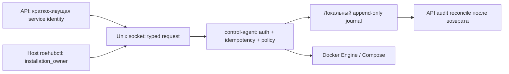

# Этап 18 — `control-agent`, `roehubctl` и аварийный журнал

## Статус

- Этап: `18`.
- Статус: `accepted`; implementation, единственная независимая cold review,
  исправления и полный повторный gate завершены.
- Дата: `2026-07-13`.
- Режим: `goal_driven`.
- Граница доказательств: `N/A`; локальный Docker Engine, одноразовый Compose
  project и volumes, host-local Unix socket и временный аварийный журнал.
- Глубина проверки: `real-boundary runtime`; настоящий Docker Engine,
  PostgreSQL `16`, FastAPI startup, Unix sockets и фактические container effects.
- Исключены: production host mutation, публикация, реальные provider writes,
  реальные заявки, production credentials, commit, push и deploy.

## Результат и смысл для владельца установки

Добавлены `app:control_agent`, `app:roehubctl` и
`context:operations`. Владелец установки теперь может диагностировать и
восстановить разрешённую topology даже при остановленных Web UI, API и
PostgreSQL. Основное приложение не получает Docker socket и не может передать
агенту произвольную shell/Docker-команду.

Для бизнеса это отделяет отказ пользовательской панели от возможности
восстановления: аварийный путь остаётся локальным и минимальным. Одновременно
снижается blast radius API compromise, потому что image, mount, environment,
resources и container command берутся только из hash-bound generated policy, а
не из запроса пользователя или API.

## Границы и зависимость

- `context:operations` владеет `OperationRequest`, `OperationResult`,
  `operation_id`, состояниями и портами backend/journal.
- `app:control_agent` является единственным продуктовым адаптером с
  `subprocess → docker`; он запускается на основной машине и не входит во
  внутренний Compose.
- `app:roehubctl` работает на основной машине, читает только локальный identity
  file и обращается к Unix socket.
- `app:api` использует `ApiControlAgentClient` и постоянный
  `PostgresControlAuditSink`; Docker imports, socket mount и произвольные argv
  отсутствуют. Startup reconciliation включается только при полном наборе трёх
  обязательных параметров и fail closed при частичной конфигурации.
- OCI job policy engine зависит от `DockerCommandRunner`; реализация subprocess
  перенесена в `apps/control_agent/job_runtime_backend.py`. Worker больше не
  владеет Docker subprocess adapter.
- Runtime manifest различает `host-service`, `host-tool`, container
  `operator-tool` и `isolated-job`; host-компоненты не генерируются как Compose
  services.

## Контракт операции

`io.roehub.control-operation/v1alpha1` — закрытая Pydantic/JSON Schema модель с
`additionalProperties=false`. Разрешены:

- topology: `inspect`, `start`, `stop`, `restart`, `recover`, `diagnostics`;
- release lifecycle: `install`, `update`, `rollback`;
- plugin lifecycle: `plugin.install`, `plugin.update`, `plugin.rollback`,
  `plugin.enable`, `plugin.disable`;
- state lifecycle: `backup`, `restore`.

В запросе нет `command`, image, mount, environment или resources. Service names
сверяются с generated allowlist. Release lifecycle требует точную установленную
`release_version`; plugin install/update требует `sha256` package digest.
Plugin actions являются зарезервированным transport contract и пока fail closed:
фактическое управление package/instance принадлежит Stage `12` API/SDK и
доменному `roehubctl plugins`, а не Docker handler control-agent.
Stage `21` регистрирует реальные state backup/restore и `N-1` handlers; до этого
эти два действия fail closed с `operation.handler_unavailable`.

## Auth, повтор и неизвестное состояние

API, `installation_owner` и `job_runtime` имеют разные mode-`0600` identity
files. Долгоживущий ключ не передаётся по сокету: клиент создаёт
HMAC-утверждение, которое подписывает identity, время, nonce и канонический
SHA-256 всего запроса без самого assertion. Агент проверяет signature,
identity, digest, срок не более 60 секунд и single-use nonce. Использованные
nonce сохраняются в owner-local mode-`0700` replay store и поэтому не становятся
повторно допустимыми после рестарта агента. Credential не записывается в журнал
или ответ.

`operation_id` является ключом идемпотентности. Cross-thread и cross-process
lock охватывает lookup, side effect и финальную запись. Повтор с тем же payload
возвращает существующий результат; другой payload даёт
`operation.idempotency_conflict`.

Docker timeout/неуспешное завершение после начала эффекта фиксируется как
`unknown`, а не `failed`. Blind retry запрещён. После успешного Docker effect
агент fsync-записывает локальный receipt с request/policy/compose/release hashes,
release before/after и точными container ID, image ID, start time и running
state. `reconcile` принимает результат только при совпадении receipt и текущих
fingerprints; один лишь список работающих сервисов не может превратить
неразличимый результат в `succeeded`.

## Generated control policy

Для каждого `base/trading/ml` генерируется
`io.roehub.control-policy/v1alpha1`. `generation-manifest.json` связывает hash
`control-policy.json` и `compose.yaml`. Для каждого сервиса закреплены:

- release-manifest reference с `@sha256:`;
- локальный runtime image ID для first-party tag;
- полный список mounts;
- только имена environment, без значений;
- CPU/memory limits;
- hash container command.

Перед каждой операцией агент заново читает и валидирует owner-protected bundle:
вся цепочка путей должна принадлежать root/effective UID, не быть symlink и не
разрешать group/world write. `generation-manifest.json` обязан совпасть по hash
с отдельно переданным доверенным `tools/release/release-metadata.json`; каждый
service reference также проверяется против этого манифеста. Для first-party tag
локальный image ID обязан совпасть с release digest, infrastructure digest
проверяется через `RepoDigests`. После проверки Compose получает проверенные
байты через stdin (`-f - --project-directory`), поэтому Docker не перечитывает
изменяемый файл между проверкой и effect. Все bind mounts read-only, Docker
socket запрещён; shell не используется.

`install`, `update` и `rollback` имеют разные monotonic SemVer-переходы в
атомарном локальном release-state: установка разрешена только при отсутствии
версии, обновление — только вверх, rollback — только вниз. Runtime proof реально
перевёл состояние `0.1.1 → 0.1.0`, а не повторно применил текущую версию.

## Аварийный журнал

`AppendOnlyOperationJournal` хранит JSONL независимо от PostgreSQL, использует
mode `0600`, directory mode `0700`, `O_NOFOLLOW`, `flock`, `fsync`, монотонный
`sequence`, `previous_hash` и `entry_hash`. Запись нельзя переписать или
незаметно удалить из середины hash-chain. Короткие системные read/write
завершаются циклами до полного размера. Оборванный незакоммиченный хвост
сохраняется отдельным mode-`0600` evidence-файлом и удаляется из active journal
только после проверки всей подтверждённой hash-chain.

Ответы содержат только type/state/detail code и список сервисов. Journal не
содержит identity, environment values, command output, DSN, cookies, provider
payloads или персональные данные. После восстановления API
`ApiControlAgentClient.reconcile_audit` передаёт новые события идемпотентному
PostgreSQL audit sink по `entry_hash`. Миграция `0021` хранит immutable events и
durable cursor; sequence gap, hash-chain mismatch и конфликт replay отклоняются
транзакционно.

## Реальная граница проверки

Версионированное доказательство находится в
[`evidence/18-control-agent-runtime-proof.json`](evidence/18-control-agent-runtime-proof.json),
имеет schema `io.roehub.control-agent-runtime-proof/v1alpha1` и
`status=passed`.

В уникальном одноразовом Compose project доказаны:

- start `base` исключительно через `roehubctl → control-agent`;
- остановка `web`, `api` и `postgresql` одной typed operation;
- `doctor=topology.degraded` при недоступных API/PostgreSQL;
- Keycloak типизирован как `not_installed`, а не как ложный runtime success;
- настоящий rollback release-state `0.1.1 → 0.1.0` и отдельный `recover`
  возвращают topology;
- replay одного `operation_id` возвращает тот же journal sequence и не создаёт
  второй effect;
- crash после фактического restart Redis и до terminal append оставляет
  незавершённую запись; новый service instance принимает точный effect receipt
  и fingerprints и завершает reconciliation как `operation.reconciled` без
  повторного restart;
- tampered image, mount и environment отклонены
  `control_agent.service_policy_mismatch`;
- поле произвольной shell-команды отклонено schema;
- 18/18 локальных journal events приняты реальным FastAPI startup wiring и
  постоянным PostgreSQL audit sink; durable cursor также равен `18`;
- отдельный HMAC-защищённый job-control Unix RPC доступен продуктовому
  `DockerCommandRunner`; произвольные/привилегированные Docker flags запрещены;
- журнал продолжил работу при остановленном PostgreSQL;
- cleanup удалил одноразовые containers и volumes.

Evidence фиксирует `production_mutation=false`,
`external_provider_writes=false`, `real_order_effects=false` и
`secrets_recorded=false`.

## Проверки качества

Тесты не являются доказательством принятия runtime-этапа. Реальная граница
пройдена отдельным процессом `roehub-control-agent`, настоящим Docker Engine,
одноразовым Compose-проектом, Unix sockets, фактическими container effects,
FastAPI startup wiring и PostgreSQL `16`; доказательство сохранено в
`evidence/18-control-agent-runtime-proof.json` с SHA-256
`8f0c0b8effcdbee183ea52c27533da54ac09599d4a8029516d4f614c90e017af`.

- Целевой повторный gate: `66 passed`.
- `ruff` для operations/control-agent/roehubctl/job-runtime и тестов — `passed`.
- Целевой `pyright` — `0 errors`.
- Полный `pytest`: `1941 passed`, 4 известные httpx deprecation warnings.
- Runtime topology generation write/check, runtime input inventory `156`, OSS
  metadata `3`, runbooks `7` и project map `5` — `passed`.
- `docker compose config` и `roehubctl validate-config` для
  `base/trading/ml` — `passed`.
- Real degraded runtime proof, PostgreSQL audit proof и cleanup — `passed`;
  контейнеры и volumes `roehub-stage18-*` после проверки отсутствуют.

## Контракты и совместимость

| Поверхность | Классификация | Обоснование |
|---|---|---|
| Public API | `compatible-change` | Добавлен API-side client adapter; новые HTTP routes ещё не публикуются. |
| Ports | `breaking-change` | OCI runner теперь требует `DockerCommandRunner`; прямой worker subprocess запрещён. |
| DTO/schema | `breaking-change` | Вводятся versioned closed operation/auth/control-policy schemas. |
| Persistence | `breaking-change` | Новый локальный journal дополняется PostgreSQL migration `0021` с immutable audit events и durable cursor. |
| Config/defaults | `breaking-change` | Release manifest обязан закреплять все runtime/infrastructure images; generated profiles получают control policy. |
| Request hash/identity | `breaking-change` | `operation_id` + canonical request digest становятся idempotency identity; service auth использует одноразовое HMAC-утверждение. |
| Service calls | `breaking-change` | API/CLI могут управлять topology только через authenticated Unix socket. |
| Runtime/ops | `breaking-change` | Docker control переносится в отдельный host-service; host components исключены из внутреннего Compose. |
| External effects | `compatible-change` | Provider writes, реальные заявки и production mutation не разрешаются. |

Основная классификация — `breaking-change`, ожидаемая для greenfield self-hosted
runtime. Миграция legacy/native production не выполняется согласно решению
этапа `00`.

## Независимая проверка

- Режим: одна cold independent review замороженного кандидата; reviewer не
  изменял файлы.
- Первоначальный вердикт: `Block` — 3 `Blocker`, 6 `High`, 2 `Medium`.
- Исправлены все `Blocker`/`High` и оба `Medium`:
  1. Docker исполняет проверенный stdin snapshot без TOCTOU;
  2. reconcile требует durable effect receipt и точные fingerprints;
  3. release policy связан с отдельным trusted manifest;
  4. API startup wiring использует PostgreSQL sink/cursor и доказан на реальной
     базе;
  5. release actions получили реальные направленные version transitions;
  6. HMAC связан с payload, а replay store переживает рестарт;
  7. plugin digest обязателен, а Stage `12` ownership и fail-closed defer
     описаны без ложного заявления о Docker handler;
  8. job runtime получил отдельный authenticated typed RPC и product wiring;
  9. `roehubctl effective` принимает только канонический redacted artifact,
     расширяет маркеры и fail closed на residual secret patterns;
  10. journal восстанавливает только torn tail после проверки prefix;
  11. JSON Schema получил action/method conditional parity с Pydantic.
- Локальная cold follow-up после исправлений: `Release after fixes`; целевые,
  полные, real-boundary и deterministic gates повторены.
- Допустимые остаточные риски: реальные backup/restore, `N-1` bundle registry,
  signed offline bundle, systemd/launchd units и identity rotation принадлежат
  Stages `21`/`22`/`24`; HTTP/Web admin surface принадлежит Stage `19`.

## Передача следующему этапу

Этап `18` принят. После синхронизации журнала единственный разрешённый следующий
этап — `19`; он получает typed API operation client, durable audit cursor,
fail-closed plugin-operation boundary и redacted emergency surface.
