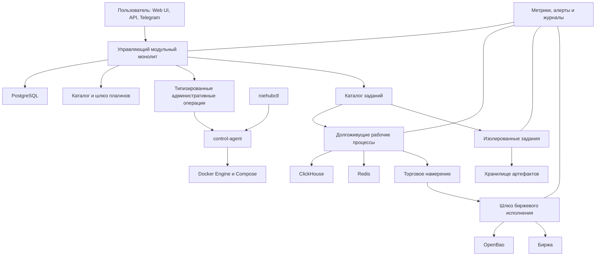

# Roehub Self-Hosted OSS Platform v1 — итоговый архитектурный и этапный план

## Статус и источники исполнения

- Статус целевой архитектуры: `accepted`.
- Статус реализации: `not_started`.
- Режим исполнения: `goal_driven`.
- `plan_doc`: `docs/architecture/platform/roehub-self-hosted-oss-platform-v1.md`.
- `prompt_pack_dir`: `.codex/agents/generated/roehub-self-hosted-oss-platform-v1/`.
- `stage_ledger`: `docs/architecture/platform/roehub-self-hosted-oss-platform-v1-stage-reports/roehub-self-hosted-oss-platform-v1-stage-ledger.md`.
- Ветка исполнения по умолчанию: `main`.
- Отдельный `GOAL.md` не создаётся. Режим цели работает поверх трёх источников выше.

Этот документ фиксирует согласованную целевую архитектуру и заменяет прежнее
направление «подписочная платформа на специально настроенном Mac Studio» на
полностью открытый самостоятельно разворачиваемый программный комплекс.
Текущая production-система в native-модели остаётся эксплуатационным фактом и
источником сведений о существующем коде, но не является ни целевой архитектурой,
ни источником данных для новой установки.

## Граница greenfield-реализации

Версия v1 строится как чистая установка. Текущие production-базы, пользователи,
identity links, checkpoints, секреты и артефакты не копируются, не исправляются и
не преобразуются в целевую модель. Новая установка начинает с пустых
PostgreSQL/ClickHouse/Redis/OpenBao и хранилища артефактов, создаёт первого
`installation_owner` через `roehubctl` и наполняется только через новые
версионированные контракты.

Текущий код, схема и runtime по-прежнему используются как evidence для
component inventory, trust boundaries, внешних эффектов и опасных failure
semantics. Наблюдаемые расхождения текущих production-данных не блокируют v1,
но структурные причины таких расхождений должны быть исключены в новой схеме
ограничениями, инвариантами и отрицательными тестами. Любой будущий импорт
старого состояния является отдельной не входящей в этот план инициативой с
отдельным разрешением и reconciliation plan.

## Бизнес-цель

Roehub должен распространяться как единый версионированный открытый продукт,
который пользователь запускает одной поддерживаемой командой на Linux или
macOS и получает:

- сервер Roehub и Web UI;
- встроенные либо подключённые PostgreSQL, ClickHouse, Redis и OpenBao;
- рыночные данные, бектесты, стратегии, уведомления и Telegram;
- хранилище артефактов с рабочей конфигурацией по умолчанию;
- административную панель;
- наблюдаемость, резервное копирование, восстановление и обновление;
- понятный `roehubctl`, который работает даже при отказе Web UI и API;
- машиночитаемые эксплуатационные инструкции для агентов и субагентов;
- расширение через безопасный публичный программный интерфейс плагинов.

Единицей продукта является комплект `vX.Y.Z`, а не ветка Git и не отдельный
`docker-compose.yml`.

## Не-цели версии v1

- Kubernetes, Podman и Colima не входят в официальную матрицу v1.
- Многовузловая высокая доступность не является условием первого выпуска.
- Linux-контейнеры на macOS не обещают нативное ускорение PyTorch через MPS;
  базовый ML-путь на Mac использует только процессор до отдельного доказанного решения.
- Сторонние плагины не получают прямого доступа к биржевым ключам,
  Docker socket, внутренним схемам Roehub или операциям `mainnet`.
- Roehub не реализует заново Prometheus, Grafana, Alertmanager или хранилище
  журналов.
- Подписки, тарифы, `paid_level` и собственный billing не входят в новый
  продуктовый контракт.
- Публикация релиза, переключение production и денежные проверочные операции не следуют
  автоматически из права изменять код.

## Зафиксированные решения

### Продукт и поставка

1. Снаружи Roehub — один строгий программный комплекс; внутри — модульная
   платформа и несколько контейнеров по границам отказа, доверия и нагрузки.
2. Поддерживаемый интерфейс пользователя — `roehubctl`, Web UI и публичный API.
   Compose является генерируемым внутренним слоем и не редактируется вручную.
3. `roehubctl up` является единой командой запуска. При первом запуске она
   выполняет безопасную инициализацию либо требует завершить явно показанный
   обязательный шаг.
4. Профили поставки: `base`, `trading`, `ml`. `base` включает Telegram-контур и
   локальное хранилище артефактов по умолчанию. Опасные возможности не
   активируются выбором профиля.
5. Официальные платформы: Linux `amd64`, Linux `arm64`, Docker Desktop на macOS.
   MacBook Pro 14 M3 Pro является обязательной проверочной машиной.
6. Лицензия Roehub — `Apache-2.0`; релиз включает `NOTICE`, SBOM, реестр
   сторонних компонентов, подписи и закреплённые digest образов.
7. Телеметрия, аналитика, автоматическая проверка обновлений и иные исходящие
   обращения выключены по умолчанию. Проверка обновлений требует явного
   включения.

### Управляющий и рабочий контуры

Управляющее ядро остаётся модульным монолитом. Организации, роли,
конфигурация продукта, каталог заданий и артефактов, административные операции
и аудит сначала являются модулями одного согласованно версионируемого продукта.

Отдельные процессы или контейнеры создаются только при наличии хотя бы одной
реальной причины:

- особые секреты или полномочия;
- отдельный профиль нагрузки;
- независимая область отказа;
- отдельный жизненный цикл;
- необходимость изоляции процессора, памяти, файловой системы или сети.

Долгоживущий рабочий контур включает получение рыночных данных, уведомления,
Telegram, планировщик, фоновые события, strategy runner и биржевой шлюз.
Тяжёлые задания — бектест, оптимизация, загрузка истории, отчёт, импорт
артефактов, ML и RL — выполняются в изолированных контейнерах с закреплённым
образом, снимком конфигурации, идентификатором организации, лимитами ресурсов и
собственным каталогом результата.

### Организации, роли и административные права

Одна установка поддерживает несколько организаций. Организации, членство,
роли и разрешения принадлежат Roehub DB, а не внешнему провайдеру входа.

| Роль | Основные полномочия |
|---|---|
| `installation_owner` | Первичная установка, аварийное восстановление, доверенные ключи издателей, последняя инстанционная власть и ручной production-cutover. Не назначается обычным администратором. |
| `owner` | Владелец организации, критические политики, подтверждение `mainnet`, управление владельцами и аварийная остановка. |
| `admin` | Управляет пользователями и ролями, кроме удаления последнего владельца; устанавливает, обновляет, настраивает и отключает плагины в пределах выданного системного разрешения; управляет административными настройками. Усиленные действия требуют `recent-auth`. |
| `operator` | Диагностика, проверки готовности, pause/resume, разрешённые повторы и эксплуатационные действия без просмотра или ротации секретов. |
| `trader` | Стратегии, исследовательские и разрешённые торговые действия в пределах политик организации. |
| `viewer` | Просмотр разрешённых данных без изменяющих операций. |

Администратор управляет ролями и плагинами, как зафиксировано владельцем
продукта. При этом установка кода с новыми системными правами, расширение
сетевого доступа, изменение доверенного ключа издателя и действия `mainnet`
всегда оставляют отдельный аудит, показывают разницу прав и требуют
`recent-auth`. Последний `owner` не может быть удалён или понижен.

Инсталляционный администратор не получает автоматического доступа к торговым
данным организаций. Временное аварийное повышение прав должно быть ограничено
сроком, причиной и полным аудитом.

### Аутентификация

1. Keycloak не входит в обязательный профиль `base`.
2. Чистая установка использует `auth.mode=local`.
3. Локальный вход отдаёт приоритет ключам доступа; пароль и одноразовые коды
   восстановления являются необязательными дополнительными способами. TOTP не
   входит в профиль v1.
4. Roehub хранит локальную серверную сессию, `recent-auth`, состояние восстановления
   и аудит. Открытая регистрация по умолчанию выключена.
5. Первый `installation_owner` назначается одноразовой процедурой
   `roehubctl`; остальные пользователи входят по приглашению.
6. Внешний OIDC подключается дополнительно через provider-neutral contract.
   Keycloak и Pocket ID поддерживаются как обычные OIDC-провайдеры новой
   установки, но не как миграционные источники.
7. Внешняя identity-связь создаётся в новой базе по паре
   `(provider_id, issuer, subject)` и указывает на стабильный внутренний
   `user_id`. Импорт текущих `keycloak_subject`, паролей, TOTP-секретов и
   активных сессий не выполняется.
8. Локальное восстановление `installation_owner` остаётся доступным независимо
   от внешнего OIDC. Отключение провайдера не требует retirement-процедуры для
   текущего Keycloak, потому что текущая установка не входит в новый контур.

Stage `00` зафиксировал user-scoped исходную схему и обнаружил в текущих
production-данных cross-owner mismatches и orphan references. После решения о
greenfield-запуске это observation не является входом для backfill. Stage
`05`, `09` и `10` обязаны сразу создать organization-aware ownership,
ссылочную целостность и отрицательные проверки на свежих данных.

### Режимы торговли и биржевое исполнение

Новая установка стартует только в режимах `research`, `paper` и `testnet`.
`mainnet` не является профилем Compose или переменной окружения. Это доменная
политика допуска, которую подтверждает `owner` через `recent-auth` только при
неактивном `kill-switch` и полном audit trail. Активный `kill-switch` всегда
запрещает отправку.

Стратегия формирует только торговое намерение:

```text
organization + account + instrument + side + size + constraints
```

Шлюз исполнения непосредственно перед отправкой проверяет режим, права,
принадлежность счёта, риск, `kill-switch`, идемпотентность и допустимость
адаптера. При неопределённом результате сначала выполняется сверка с биржей;
слепая повторная отправка запрещена.

Stage `16` реализует эту границу как persisted policy в PostgreSQL: разрешение
`mainnet` выдаётся владельцем после `recent-auth`, ограничено сроком, может
быть отозвано и привязано к редакциям риска, счёта и поставщика. Ссылка на
активную версию учётных данных и fingerprint материального состояния счёта
повторно сравниваются непосредственно перед submit. `mainnet` отсутствует в
пользовательской конфигурации и Compose; нативные адаптеры остаются
`testnet`-only. Локальный `core:exchange-emulator` служит только границей
проверки без сети и внешних эффектов.

### Владельцы состояния

| Состояние | Владелец |
|---|---|
| Организации, роли, конфигурация продукта, задания, операции и аудит | PostgreSQL |
| Рыночные и аналитические временные ряды | ClickHouse |
| Транспорт, кэш, временные блокировки и координация | Redis, но не как единственный источник истины |
| Секреты, токены и ключи | OpenBao |
| Модели, результаты, отчёты, пакеты плагинов и подписанные манифесты | Хранилище артефактов |
| Метрики, алерты и журналы | Специализированный наблюдаемый контур |

Постоянное состояние не хранится внутри файловой системы контейнера.

### Хранилище артефактов

Stage `14` принимает `ArtifactStore/v1`: точные байты адресуются SHA-256, а
`ArtifactManifest/v1` подписывается Ed25519 и связывает нормализованные пути с
digest, размером и media type. По умолчанию новая установка использует
`local_cas` во внешнем каталоге хоста; S3-compatible adapter доступен за тем же
портом и получает credentials только по typed OpenBao reference `storage`.

PostgreSQL хранит organization ownership, manifests, quotas, pins, leases и
durable GC candidates. Bytes не лежат внутри контейнера. Прямая публикация,
bundle install и restore используют один installation-controlled trust root и
повторно проверяют подпись и digest. Local materialization создаёт read-only
путь для mmap-heavy compute; текущие path-shaped RL/backtest artifacts не
импортируются и не читаются.

Миграция `0018` является частью greenfield storage lifecycle. Она не содержит
legacy converter или dual-read. Полный installation backup/restore и
single-active operational execution сборки мусора переданы соответственно
Stages `21` и `18`; Stage `14` доказывает доменный backup/restore, pin/lease/GC,
квоты, concurrent publish, restart, corruption rejection и S3-compatible
boundary на одноразовых PostgreSQL и MinIO.

### Изолированные задания

Stage `15` принимает `JobEnvelope/v1` и `JobResultManifest/v1` как общую
границу для backtest, optimize, history import, report, artifact transform,
ML/RL training/inference и custom strategy. PostgreSQL migration `0019` хранит
organization-scoped semantic jobs, неизменяемые attempts, deadlines,
heartbeat/cancel и terminal results; Redis не является источником истины.

Host executor сам materializes указанные `ArtifactStore/v1` manifests в
read-only input, запускает только image ID `sha256:<hex>` под UID/GID
`65532:65532` с read-only root, `network=none`, dropped capabilities и точными
CPU/RAM/PID/time/tmpfs/output limits. Output записывается в одноразовый
Docker volume на `tmpfs` с byte/inode quota; только отдельный ограниченный
host-owned keeper удерживает volume после реальной остановки PID 1, а
именованный exporter получает временный writable bind mount только после того,
как Docker уничтожил фоновые процессы задания. Keeper/exporter используют
отдельный host-controlled utility image digest, а не образ задания или плагина.
Docker logging отключён. Docker socket, database/OpenBao/exchange credentials
и произвольная host environment заданию не передаются. Bounded неисполняемые
outputs подписываются доверенной host identity и публикуются через тот же
Artifact Store; scratch, container и volume удаляются.

До записи и исполнения `TrustedRuntimeAuthority` сопоставляет capability,
runtime name/version, image digest, точный command digest и, для custom
strategy, canonical Stage `12` package digest. Каталог PostgreSQL защищает
envelope и terminal rows триггерами. Cancel/finish и recovery используют
единый порядок locks `job → attempt`; восстановление сначала получает
lease `recovering`, затем сверяет и удаляет реальные OCI-ресурсы и только
после этого фиксирует terminal result. Worker heartbeat threshold и recovery
lease cutoff разделены; cancel marker имеет приоритет над recovery outcome.

Retry создаёт новую attempt того же смыслового job и отклоняет изменение
image/config/inputs/limits/command. Custom strategy возвращает только строгий
`signal`/`intent`; submit order остаётся host-owned границей Stage `16`.
Подробный контракт и реальные доказательства зафиксированы в
`docs/architecture/platform/isolated-job-runtime-v1.md`.

### Организационная изоляция исследовательского контура

Stage `09` фиксирует следующую границу владения для greenfield v1:

| Ресурс | Класс владения | Правило доступа и идентичности |
|---|---|---|
| Канонические свечи ClickHouse и чистые indicator kernels | `installation-shared` | Свечи не копируются по организациям. Use case сначала разрешает организацию аутентифицированного пользователя на сервере, затем читает общий неизменяемый ряд; вычислительная семантика и content hash не зависят от организации. |
| Backtest jobs, результаты, shortlist/top-variant metadata и lazy materialization tasks | `organization-owned`, пользователь внутри организации | Каждая запись создаётся с `organization_id`; PostgreSQL composite foreign keys запрещают связь с пользователем или job другой организации. API и repository reads фильтруют organization scope до возврата строки. |
| Неизменяемые файлы предрасчёта и байтовые manifests | `installation-shared` по содержимому | SHA-256 остаётся нейтральным к организации только для идентичных байтов и детерминированного вычислительного содержимого. Организационное владение хранится в job/materialization metadata, а не дублирует immutable payload. |
| Idempotency, dedupe и materialization cache identity | `organization-owned` | Новые записи используют versioned namespaces `research-request/v1` и `research-cache/v1` с `organization_id`; legacy alias, dual-read и backfill отсутствуют. |
| Optimize context | нет mutable runtime state в текущей реализации | Определения и вычисления остаются чистыми; первое будущее сохраняемое задание или результат обязаны наследовать organization scope job и те же fresh-schema constraints. |

Research API не принимает `organization_id` из payload, path или заголовка как
источник authority. Scope выводится из активного membership текущего
аутентифицированного `user_id`. Отсутствие membership и несколько активных
membership закрывают операцию соответственно как forbidden и ambiguous; явный
server-side выбор организации для multi-organization session остаётся будущим
контрактом, а не клиентским обходом этой границы.

Миграция `0014` предназначена только для пустого исследовательского контура:
она прекращает работу при существующих mutable research rows и не выполняет
backfill. Это сохраняет решение `A07` и исключает неявное исправление или импорт
текущих production-данных.

### Организационная изоляция торгового контура

Stage `10` переносит тот же greenfield-инвариант на strategy, account, risk и
execution state:

| Ресурс | Класс владения | Правило доступа и идентичности |
|---|---|---|
| Стратегии, запуски, profiles, bindings и signals | `organization-owned`, пользователь внутри организации | Server-derived scope проходит через entity, use case и repository; composite foreign keys связывают только organization/user/strategy/run одной организации. |
| Биржевые подключения, credential versions и account projections | `organization-owned`, account=`exchange_connection_id` | Credential и snapshots ссылаются на connection той же организации. Расшифрованное значение существует только в trusted exchange-control/execution boundary. |
| Source events, intents, risk audit, orders, fills и reconciliation | `organization-owned` | Новые записи используют `io.roehub.execution-idempotency/v1` с organization/account namespace; source/signal/intent/connection/order relationships ограничены composite foreign keys. |
| RL risk policies, audit, ticker overrides и activations | `organization-owned` | Policy, quota и active ticker scoped по organization/owner; policy/activation дополнительно ссылаются на strategy/live profile той же организации. |
| Private-stream sessions | `organization-owned` | Явный organization scope и composite connection foreign key; глобальный connection UUID не заменяет ownership. |
| Request observations | `organization-owned` для распознанного intent; иначе `installation-operational` | Распознанное намерение получает organization FK. У malformed/quarantined входа scope остаётся `NULL`, потому что доверенного владельца установить нельзя. |
| Process heartbeat | `installation-shared` | Это готовность одного service instance, а не пользовательское торговое состояние. |
| Paper accounting и position ownership | `organization-owned` | Stable identity включает organization namespace; strategy/run/connection relationships остаются same-org. |

API/UI не принимают клиентские `organization_id` и `risk_context` как
authority. Публичный execution route получает risk facts через server-side
resolver и отказывает по умолчанию, пока trusted account-state, kill-switch и
limit services не подтверждены. Execution process допускает только
`disabled/testnet`; exchange adapters дополнительно останавливают любую
отправку вне testnet. При неизвестном результате сначала выполняется provider
lookup по `client_order_id`, и повторный submit запрещён до сверки.

Миграция `0015` прекращает работу при любой строке в mutable trading tables и
не содержит backfill или legacy import. Текущие production records не являются
источником ownership и не читаются.

### Три источника конфигурации

1. Установочная конфигурация: `roehub.yaml` — домен, порты, профили, каталоги,
   встроенные либо внешние базы и безопасные установочные параметры.
2. Продуктовая конфигурация: PostgreSQL — организации, провайдеры, стратегии,
   политики и уведомления.
3. Секреты: OpenBao — токены, ключи бирж, Telegram и провайдеров.

Compose, `.env`, конфигурация OIDC, политики OpenBao, цели Prometheus и
внутренние файлы среды исполнения генерируются. Пользователь не редактирует их вручную.

Stage `08` фиксирует typed reference
`openbao://<mount>/<root>/<kind>/<resource>?version=<n>#<field>` для
`exchange`, `telegram`, `oidc`, `plugins` и `storage`. Fragment обязателен,
version выбирается явно либо означает latest; resolver проверяет root/kind и
разрешает значение только внутри доверенной границы consumer. Служебные
OpenBao и internal API credentials передаются через absolute regular files с
mode `0600` и перечитываются, а не сохраняются raw в env/config dataclass.

Embedded OpenBao использует digest-pinned container, Raft volume и
декларативный HMAC audit с `log_raw=false`. Production initialization хранит
PGP-encrypted Shamir shares у `installation_owner`, AppRole tokens имеют
service-specific policies и короткий TTL, initial administrative credential
отзывается после bootstrap. Raft snapshot покидает процесс только в
`age`-зашифрованном виде на отдельном destination; force restore разрешён
только владельцу для доказанно нового пустого storage.

### Плагины

Плагин — подписанный неизменяемый пакет, а экземпляр плагина — конфигурация для
установки или организации. Пакет, версия, экземпляр, права и операция имеют
раздельные идентичности и аудит.

Публичные типы первой версии:

- `data-source`;
- `panel`;
- `app`;
- `notification-provider`.

Встроенные реализации используют тот же контракт для:

- `market-data-provider`;
- `artifact-store`;
- `job-runtime`;
- `strategy-runtime`;
- доверенного `exchange-execution-provider`.

PostgreSQL, ClickHouse и Redis как внутренние хранилища подключаются через
сертифицированные профили, а не произвольные плагины. Сторонний код работает в
ограниченном OCI-контейнере без Docker socket и прямого доступа к базам.
Интерфейс Roehub v1 загружает только декларативные панели; произвольный
JavaScript в основном источнике Web UI запрещён.

Контракт плагинов включает `roehub.plugin.yaml`, `Plugin API v1alpha1`,
`RoehubDataFrame/v1`, JSON Schema конфигурации, OpenAPI/RPC-описание,
наборы разработки Python и TypeScript, conformance tests и команды:

```bash
roehubctl plugins init
roehubctl plugins validate <bundle-or-oci-reference>
roehubctl plugins install <bundle-or-oci-reference>
roehubctl plugins update <plugin-id> --version <version>
roehubctl plugins rollback <plugin-id>
roehubctl plugins doctor <plugin-id>
```

### Провайдеры уведомлений

Stage `11` фиксирует `NotificationProvider/v1` как первый стабильный
plugin-style контракт. Установленный пакет провайдера и его экземпляр являются
разными PostgreSQL-ресурсами. Экземпляр принадлежит установке либо одной
организации; маршруты, доставки, попытки, Telegram updates, binding codes,
recipient bindings и durable cursor всегда ссылаются на конкретный
`provider_instance_id`.

Встроенный `TelegramBotProvider/v1` получает credential и адрес получателя
только по typed OpenBao references. Dispatcher имеет read-only identity, а
Telegram worker — отдельную identity, которая дополнительно может записывать
recipient secret. Raw bot token, chat ID и provider response не являются
переменными окружения, конфигурацией PostgreSQL, метрикой или доказательством.
Прямой Strategy runtime mode с глобальным `TELEGRAM_BOT_TOKEN` удалён из
greenfield composition: стратегия создаёт organization-scoped notification,
а provider instance разрешается внутри Notifications.

Delivery использует `delivery_id` как idempotency identity, бюджеты соединения
и запроса по умолчанию `3` и `10` секунд, bounded exponential backoff с jitter
и `Retry-After`. Ошибка до возможного принятия может перейти в `retry`, а timeout
после возможного принятия, отмена и восстановление незавершённой lease — в
durable `unknown`. `unknown` не возвращается в очередь автоматически; replay
создаёт новую доставку после явного решения оператора. Деградация относится
только к одному экземпляру, а критические и торговые сообщения никогда не
переключаются с бота организации на общий бот автоматически.

Application/CLI boundary включает раздельные операции `roehubctl providers
install`, `roehubctl providers add` и `roehubctl telegram connect`. Последняя
создаёт одноразовый binding code в новом файле mode `0600`; durable cursor и
реестр команд остаются в PostgreSQL.

### Визуальная система

Roehub владеет сеткой, типографикой, цветовыми и семантическими токенами,
темами, доступностью, адаптивностью, состояниями загрузки, отсутствия данных,
ошибки и деградации,
единицами измерения и табличной альтернативой графика. Плагин передаёт данные и
декларацию, а не собственный несогласованный дизайн.

Целевое направление — плотный институциональный интерфейс с постепенным
раскрытием деталей. Торговые временные ряды могут использовать Lightweight
Charts, общая аналитика — Apache ECharts, декларативные исследования —
Vega-Lite. Публичный контракт не зависит от конкретной библиотеки.

### Администрирование и аварийный контур

Основной API не получает Docker socket. Единственный компонент с ограниченным
доступом к Docker Engine — `control-agent`. Он принимает фиксированный набор
типизированных операций, запускает только digest из манифеста релиза, запрещает
произвольные команды оболочки, точки монтирования и переменные окружения и ведёт локальный
аварийный журнал.

`roehubctl` обязан выполнять `doctor`, резервное копирование, восстановление и
откат при
остановленных Web UI, API, Keycloak и PostgreSQL. Административный Web UI
использует тот же типизированный API, но не является единственным способом
восстановления.

### Наблюдаемость и эксплуатационные инструкции

Prometheus-совместимые метрики, Alertmanager, Grafana и хранилище журналов
работают независимо от основного Web UI. Roehub показывает прикладные состояния
«готово», «ухудшено», «остановлено», «неизвестно» и связывает проблему с
инструкцией и разрешённым действием.

Канонический формат инструкции — англоязычный машиночитаемый
`ops.roehub.io/v1` YAML. Из него генерируются русские пользовательские документы,
Web UI и JSON-индекс. Все доказательства удаляют секреты, cookies,
необработанные ответы провайдеров и персональные данные.

## Целевая схема зависимостей



Разрешённое направление зависимостей: слой доставки вызывает прикладной слой;
предметная область не импортирует инфраструктуру; адаптеры реализуют
принадлежащие прикладному слою или предметной области
порты; межконтекстные переводы проходят через явный ACL. Плагины не импортируют
внутренние Python-модули Roehub и взаимодействуют только через версионированный
сетевой контракт.

## Критические интеграционные контракты

| Вызов | Контракт и авторизация | Тайм-аут, повтор и неопределённое состояние | Деградация и наблюдаемость |
|---|---|---|---|
| Web UI → API | Локальная сессия Roehub, CSRF, организация и роль из серверного контекста | Короткий срок ожидания; изменяющие операции используют идемпотентность | Стабильная ошибка и событие аудита, без токенов в браузере |
| API-аутентификация → внешний OIDC | Владелец контракта — `AuthenticationProvider/v1`; authorization code/PKCE, проверенный issuer/subject, client secret только по ссылке OpenBao | По умолчанию: соединение 3 секунды, ответ 10 секунд, общий deadline 15 секунд. Discovery/JWKS GET допускает не более двух повторов с jitter и cache; token POST после неопределённого результата не повторяется вслепую, вход завершается ошибкой без сессии и начинается заново | Деградирует только внешний способ входа; local auth и текущие сессии продолжают работать. Метрики discovery/JWKS/token, алерт длительной недоступности и инструкция восстановления без raw token/response |
| API → `control-agent` | Краткоживущая служебная идентичность и разрешённая схема операции | Повтор только по `operation_id`; неизвестный результат читается из журнала операций | API показывает `unknown/degraded`; локальный журнал остаётся доступен `roehubctl` |
| Планировщик/API → изолированное задание | `JobEnvelope`, digest образа, снимок конфигурации, `organization_id` и ограничения | Уникальный `job_id`; повтор создаёт новую попытку, а не новое смысловое задание | Состояния тайм-аута, отмены и ошибки хранятся в PostgreSQL; журналы и метрики задания не содержат секретов |
| Шлюз плагинов → контейнер плагина | Краткоживущая идентичность с пакетом, версией, экземпляром, организацией и возможностью | Повторять можно только безопасные запросы; доставка и задания требуют ключа идемпотентности | Предохранитель отказов, проверка состояния, ограниченный исходящий трафик, аудит и удаление чувствительных данных |
| Диспетчер уведомлений → Telegram/провайдер | Владелец контракта — `NotificationProvider/v1`; секрет и адрес получателя разрешаются по ссылкам внутри доверенной границы экземпляра организации | По умолчанию: соединение 3 секунды и общий deadline 10 секунд. Повторяется только явно повторяемая ошибка с ограниченной экспоненциальной задержкой и `Retry-After`; `delivery_id` — ключ идемпотентности. Неопределённый результат критического/торгового сообщения получает `unknown` и требует сверки или явного аудируемого replay | Деградирует конкретный экземпляр провайдера, а не Roehub. Метрики sent/retry/unknown/dead-letter, алерт на `unknown` и инструкция проверки/replay; токены, chat ID и raw provider response удаляются |
| Исполнитель стратегии → шлюз исполнения | Версионированное намерение без секретов | Идемпотентность намерения; неизвестный результат отправки никогда не повторяется до сверки | `unknown` блокирует дальнейшее исполнение и создаёт алерт и эксплуатационную инструкцию |
| Шлюз исполнения → биржа | Секрет разрешается внутри доверенной границы OpenBao | Тайм-аут провайдера; сверка по клиентскому идентификатору заявки или приватному потоку перед повтором | `kill-switch`, карантин/DLQ, метрики и полный журнал аудита |
| Рабочие процессы → Redis/PostgreSQL/ClickHouse | Служебная идентичность и контекст организации | Redis не является единственной истиной; повтор согласуется с сохранённой контрольной точкой | Алерты задержки, обратного давления и свежести данных, а также инструкции восстановления |

## Этапный план

Каждый этап выполняется отдельным англоязычным промтом. Следующий этап разрешён
только после `accepted` всех зависимостей в журнале.

| Этап | Результат | Зависимости | Ближайшая граница доказательства |
|---|---|---|---|
| `00` | Текущий аудит всех компонентов, карта вызовов, владельцы состояния, модель угроз и заморозка контрактов | нет | Статическая сверка 33 компонентов и независимая проверка полноты |
| `01` | `Apache-2.0`, `NOTICE`, `SECURITY.md`, `CONTRIBUTING.md`, версия, политика выпуска, лицензии и предварительный SBOM | `00` | Лицензионный аудит и проверка релизных метаданных |
| `02` | `ops.roehub.io/v1`, генератор русских документов и JSON-индекса | `00` | Схема, генерация и связи проблемы → инструкция → действие |
| `03` | `roehub.yaml`, профили `base/trading/ml`, манифест релиза и генерация внутренних конфигураций | `01`,`02` | Детерминированная генерация без незакреплённых образов и секретов |
| `04` | Единые миграции PostgreSQL/ClickHouse, встроенные и внешние профили хранения и чистая инициализация | `03` | Чистая база, повторный запуск и восстановление после прерывания |
| `05` | Установка, организации, членство, RBAC, владение и аудит | `04` | Две организации и отрицательные проверки изоляции API/БД |
| `06` | Локальный вход с приоритетом ключей доступа, пароль/TOTP, восстановление, сессии, CSRF, `recent-auth` и первичная настройка владельца | `05` | Реальный браузерный поток и восстановление владельца |
| `07` | Универсальный OIDC для новой установки и стабильное связывание внешней identity с `user_id` | `06` | Disposable OIDC, local fallback, linking/conflict, отзыв и деградация |
| `08` | Контейнерный OpenBao, политики, ссылки на секреты, ротация, резервное копирование и восстановление | `04`,`05`,`06` | Минимальные права, ротация/восстановление и отсутствие секретов в доказательствах |
| `09` | Организационная изоляция рыночных данных, индикаторов, бектестов, артефактов и оптимизации | `05`,`08` | API/PostgreSQL/ClickHouse на двух организациях, детерминизм и измерение производительности |
| `10` | Организационная изоляция стратегий, рисков, управления биржами, исполнения и счетов | `05`,`08` | Полный поток `paper/testnet` и отрицательные проверки |
| `11` | `NotificationProvider/v1`, общий бот, боты организаций и пользовательский провайдер | `05`,`08`,`10` | Две организации/два бота, идемпотентность и отсутствие опасного резервного переключения |
| `12` | `context:extensions`, манифест, пакеты, экземпляры, права, подписи, API, SDK и проверка совместимости | `03`,`05`,`08` | Подписанный тестовый плагин в изолированном контейнере |
| `13` | `data-source`, `panel`, `app`, `RoehubDataFrame/v1` и единая визуальная система | `09`,`12` | Реальный браузер: доступность, адаптивность и деградация источника |
| `14` | `ArtifactStore/v1`, локальный CAS по умолчанию, S3-адаптер и демонстрационный комплект | `04`,`09`,`12` | Digest, атомарная публикация, закрепление/аренда/квоты/сборка мусора и резервное копирование/восстановление |
| `15` | Единая изолированная среда заданий для бектеста, оптимизации, импорта, отчётов, ML/RL и стратегий | `09`,`10`,`12`,`14` | Реальный ограниченный контейнер, тайм-аут, отмена, повтор и манифест результата |
| `16` | Усиленный шлюз исполнения и политика `mainnet` | `10`,`11`,`12`,`15` | Эмулятор и `testnet`: неизвестный результат, сверка, риск, `kill-switch` и аудит |
| `17` | Контейнеризация всех приложений, рабочих процессов и планировщиков; полные профили | `03`–`16` | `compose config/build/up`, готовность, перезапуск и сохранность состояния |
| `18` | `app:control_agent`, `app:roehubctl` и аварийный журнал операций | `12`,`17` | `doctor/recover/rollback` при остановленных Web/API/Keycloak/PostgreSQL |
| `19` | Административный Web UI для организаций, ролей, плагинов, резервного копирования, обновления и состояния | `05`,`06`,`12`,`18` | Ролевой браузерный сценарий, `recent-auth`, малый/большой экран и доступность |
| `20` | Контейнерная наблюдаемость, прикладные состояния и отказоустойчивые эксплуатационные инструкции | `02`,`17`,`18`,`19` | Инъекции отказов при доступных метриках/журналах и разрешённом действии |
| `21` | Резервное копирование, восстановление, обновление `N-1 → N` и откат для всех владельцев состояния | `14`,`17`,`18`,`20` | Полная проверка восстановления на отдельной установке и измеренные RPO/RTO |
| `22` | Мультиархитектурные образы, подписанный комплект релиза, автономная установка и отсутствие скрытых исходящих обращений | `01`,`03`,`17`,`21` | Установка без Git и без сети из автономного комплекта |
| `23` | Репетиция greenfield-установки и жизненного цикла из автономного комплекта | `21`,`22` | Чистая установка, bootstrap, свежие representative fixtures, backup/restore, повторяемость и release-to-release rollback |
| `24` | Кандидат релиза на Linux amd64/arm64 и macOS M3 Pro | `22`,`23` | Матрица чистой установки, браузера/API/БД, среды исполнения, безопасности, резервного копирования и обновления |
| `25` | Отдельно разрешённый greenfield production launch | `24` + новое подтверждение пользователя | Только `post_main_production_runtime_proof`; текущая native-система и её данные не мигрируют |

Stage `25` всегда является ручным барьером подтверждения. Автономная цель обязана
остановиться перед ним, если в текущем пользовательском запросе нет отдельного
явного разрешения на production-cutover.

## Охват компонентов текущей карты

| Компонент | Основные этапы | Обязательный итог |
|---|---|---|
| `app:api` | `05`–`13`,`16`,`19` | Организации, local/OIDC auth, plugin/admin API |
| `app:cli` | `03`,`09`,`17`,`18` | Доменные команды и отдельный аварийный `roehubctl` |
| `app:exchange_control` | `08`,`10`,`16`,`17` | Секреты и account policy только в доверенной границе |
| `app:exchange_execution` | `10`,`16`,`17` | Изолированный шлюз исполнения |
| `app:migrations` | `04`–`12`,`14` | Clean install и безопасное обновление схем |
| `app:monitoring` | `17`,`20` | Readiness, metrics и operational state |
| `app:scheduler` | `09`,`11`,`14`,`15`,`17` | Организационные расписания и задания |
| `app:web` | `06`,`07`,`13`,`19` | Локальный вход, панели и администрирование |
| `context:backtest` | `09`,`15` | Изолированные организационные задания |
| `context:backtest_artifacts` | `09`,`14` | CAS и единый artifact contract |
| `context:exchange_control` | `08`,`10`,`16` | Подключения, секреты и готовность счёта |
| `context:identity` | `05`–`08` | Multi-org, RBAC, local/OIDC/hybrid |
| `context:indicators` | `09`,`13`,`15` | Декларативный registry и изолированные вычисления |
| `context:live_execution` | `10`,`16` | Intent, order, reconcile и `kill-switch` |
| `context:market_data` | `09`,`12`,`17` | Нормализованные источники и контейнерный ingestion |
| `context:ml` | `15`,`17`,`24` | Изолированное обучение/inference и platform limits |
| `context:notifications` | `11`,`12` | Provider contract и per-org bots |
| `context:optimize` | `09`,`15` | Изолированное задание оптимизации |
| `context:risk` | `10`,`16` | Проверка непосредственно перед submit |
| `context:rl_trading` | `09`,`14`–`16` | Организационные модели и контролируемый inference |
| `context:strategy` | `10`,`15`,`16` | Strategy формирует intent без ключей |
| `core:fastpath` | `09`,`15`,`24` | Паритет и доказанная производительность |
| `core:integration` | `12`–`15` | Версионированные wire contracts и SDK |
| `core:platform` | `03`,`04`,`12`,`17` | Config, runtime errors и platform primitives |
| `core:shared_kernel` | `05`,`09`,`10` | User/org/request identities |
| `worker:backtest_job_runner` | `09`,`15`,`17` | Ограниченные задания и attempt semantics |
| `worker:market_data_ws` | `09`,`17`,`20` | Container ingestion и freshness proof |
| `worker:notification_dispatcher` | `11`,`17`,`20` | Идемпотентная delivery |
| `worker:notification_report_scheduler` | `11`,`17`,`20` | Организационные отчёты |
| `worker:rl_trading_inference` | `15`–`17` | Изолированный inference без exchange keys |
| `worker:rl_trading_trainer` | `14`,`15`,`17` | Resource limits и CAS results |
| `worker:strategy_live_runner` | `10`,`15`–`17` | Intent production и управляемый lifecycle |
| `worker:telegram_bot_worker` | `11`,`17`,`20` | Общий и организационные боты |

Новые целевые компоненты:

| Компонент | Этап | Назначение |
|---|---|---|
| `context:extensions` | `12` | Пакеты, экземпляры, права и операции плагинов |
| `context:operations` | `18`–`21` | Типизированные административные операции |
| `app:control_agent` | `18` | Единственная доверенная граница Docker Engine |
| `app:roehubctl` | `18` | Аварийное управление с основной машины |

Stage `00` обязан сверить этот список с актуальным `project-map.json`. Любой
непокрытый новый компонент блокирует продолжение до обновления плана и журнала.

## Инициализация, обновление и откат

Greenfield-жизненный цикл выполняется так:

1. Создаются пустые persistent volumes и версии схем PostgreSQL/ClickHouse.
2. `roehubctl` запускает идемпотентный bootstrap и создаёт первого
   `installation_owner` без импортированных пользователей.
3. Организации, роли, провайдеры, стратегии и остальные ресурсы создаются через
   новые API/use cases; старые owner fields и `paid_level` не backfill-ятся.
4. OIDC-провайдеры и OpenBao secret references настраиваются заново; старые
   identity links, credentials и secret values не копируются.
5. Демонстрационные данные и артефакты поставляются только как малый подписанный
   bundle с известными digest.
6. Stage `21` доказывает backup/restore и обновление между версиями уже нового
   self-hosted формата. Для первого v1 допускается versioned fixture предыдущей
   схемы вместо несуществующего опубликованного `N-1`.
7. Stage `23` повторяет полный greenfield lifecycle из автономного комплекта,
   не подключаясь к текущей production-базе.
8. Stage `25` при отдельном разрешении запускает новую пустую production-
   установку; текущая native-система не является источником переноса или
   rollback state.

Откат до Stage `25` означает удалить или остановить изолированную новую
установку. После greenfield production launch откат возвращает предыдущую
версию только внутри нового self-hosted контура из проверенного backup/release
bundle. Money-moving и provider side effects всегда сверяются по внешнему
источнику истины.

## Влияние на контракты

| Поверхность | Классификация | Миграционное требование |
|---|---|---|
| Публичный API, `/auth/current-user`, организации и admin API | `breaking-change` | Версионированные DTO, переходное отображение и browser/API tests |
| Identity principal, роли и permission semantics | `breaking-change` | Новые `user_id`, external identity links и RBAC matrix без legacy import |
| Persisted ownership и provider instances | `breaking-change` | Greenfield schema, constraints и fresh-fixture isolation; без backfill/dual-read |
| `roehub.yaml` и отказ от пользовательского `.env`/Compose | `breaking-change` | Greenfield schema, validation и generated files; без converter текущей установки |
| Plugin manifest/API до `v1` | `compatible-change` | `v1alpha1`, conformance suite и version negotiation |
| Notification/Telegram provider model | `breaking-change` | Fresh configuration of installation/per-org instances и новых OpenBao refs; текущие env values/tokens не импортируются |
| Secret reference, OIDC и service credential delivery | `breaking-change` | Обязательный typed OpenBao ref с field/version и mode-`0600` token files вместо raw env; нет fallback или конвертера старой native-конфигурации |
| Artifact identity и storage layout | `breaking-change` | Digest manifest, materialization cache и малый подписанный demo bundle; без old-path importer |
| Job/attempt identity и runtime isolation | `breaking-change` | Greenfield `0019`, `JobEnvelope/v1`, digest-only OCI, durable retry/cancel/result; без aliases прежних child-process jobs |
| Mainnet safety semantics | `breaking-change` с fail-closed default | Re-approval, recent-auth, kill-switch и reconciliation proof |
| Metrics, audit и machine-readable runbooks | `compatible-change` | Versioned labels/events, redaction и docs generation |
| Browser-visible admin и visualization defaults | `breaking-change` | Design tokens, accessibility, responsive и browser evidence |
| Request hash, cache key и persistence identity | `breaking-change` | Stage `00` подтвердил user/route/job-scoped исходные semantics: новые записи сразу используют versioned org/account/instance namespace; dual-read/alias старых данных не требуется, content hashes остаются byte-semantic |
| ML/RL performance на macOS | `unknown` до Stage `24` | CPU baseline и отсутствие обещаний MPS |

## Документальная непрерывность

Этот план немедленно заменяет как целевое направление:

- `docs/architecture/operations/native-service-control-monitoring-admin-target-v1.md`;
- `docs/architecture/identity/keycloak-cutover-plan-v1.md`;
- `docs/architecture/identity/keycloak-cutover-restart-prompt-pack-v1.md`.

`docs/architecture/identity/identity-keycloak-auth-model-v1.md` остаётся
историческим описанием прежней реализованной системы. После принятия Stages
`06`–`07` каноническими стали
`docs/architecture/identity/local-auth-sessions-recovery-v1.md` и
`docs/architecture/identity/oidc-authentication-provider-v1.md`.

Завершённые stage ledgers старых планов не переписываются: они остаются
историческим доказательством. Новый план ссылается на них как на входные факты.

Обязательные входные документы этапов:

- `docs/architecture/apps/web/web-ui-product-redesign-master-plan-v2.md`;
- `docs/architecture/apps/web/web-ui-design-manifest-v1.md`;
- `docs/architecture/notifications/web-execution-telegram-notifications-v1.md`;
- `docs/architecture/live_execution/live-execution-universal-order-gateway-v1.md`;
- `docs/architecture/live_execution/mainnet-real-money-trading-v1.md`;
- `docs/architecture/live_execution/strategy-producer-paper-testnet-trading-v1.md`;
- `docs/architecture/identity/identity-exchange-connections-live-trading-v1.md`;
- `docs/architecture/backtest/backtest-service-artifact-runtime-v1.ru.md`;
- `docs/architecture/project-map/project-map.json`.

## Общие правила выполнения и остановки

- В каждый момент только один stage имеет статус `in_progress`.
- Допустимые статусы: `pending`, `in_progress`, `accepted`, `blocked`, `skipped`,
  `superseded`.
- Этап читает plan/ledger и проверяет predecessor gate до изменения файлов.
- Этап обновляет ledger после validation и до итогового отчёта.
- Тесты являются gate, но не заменяют API, DB, browser, runtime, performance,
  migration, backup или delivery evidence.
- Нельзя просить секреты в чате или записывать их в evidence.
- Нельзя создавать branch, worktree, stash или отдельную рабочую папку без
  явного разрешения. По умолчанию используется общий `main` и только owned
  files/hunks.
- Нельзя подразумевать commit, push, release, deploy или production mutation.
- Если обязательная граница недоступна, статус — `blocked`, а не принятие по
  статическому выводу.
- Перед production delivery допустимы только
  `target_host_readiness_pre_main` и `read_only_existing_runtime_smoke`.
  Доказательство изменённого production-кода — только
  `post_main_production_runtime_proof` после `main`, зелёного CI/deploy и sync.

## Критерий завершения цели

Автономная цель считается выполненной, когда Stage `24` имеет `accepted`, все
предыдущие этапы приняты, получен проверенный автономный комплект релиза,
доказаны clean install и greenfield lifecycle rehearsal, а журнал содержит
полный handoff. Перенос текущей production-базы и Stage `25` не входят в
автоматическое завершение; Stage `25` требует отдельного решения владельца.
