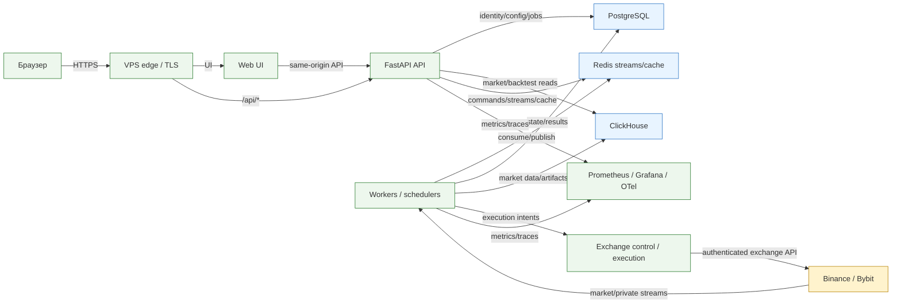

# Полная карта проекта Roehub

Этот документ — человекочитаемое представление единой карты проекта. Машиночитаемый источник для агентов — [`project-map.json`](project-map.json), семантический каталог — [`project-map.toml`](project-map.toml), правила использования — [`AGENT_GUIDE.md`](AGENT_GUIDE.md).

Карта построена детерминированно из каталога и фактического набора файлов/импортов. Generated-артефакты самой карты исключены из самоссылочного inventory. Текущий структурный digest: `5dede431923c4cdfba2250ca6c47871232586af79b7132c606c91fd64fd6f89c`; учтено файлов: **2335**.

## Визуальная runtime-карта

Исходник диаграммы отдельно: [`project-map.mmd`](project-map.mmd).

## Визуальная карта компонентов

Стрелка означает фактически обнаруженный Python import от источника к цели.

```mermaid
flowchart TB
  classDef context fill:#e8f4ff,stroke:#3178c6
  classDef app fill:#edf7ed,stroke:#2e7d32
  classDef worker fill:#fff3cd,stroke:#b8860b
  classDef core fill:#f3e8ff,stroke:#7b1fa2
  n_app_api["app:api"]
  class n_app_api app
  n_app_cli["app:cli"]
  class n_app_cli app
  n_app_exchange_control["app:exchange_control"]
  class n_app_exchange_control app
  n_app_exchange_execution["app:exchange_execution"]
  class n_app_exchange_execution app
  n_app_migrations["app:migrations"]
  class n_app_migrations app
  n_app_monitoring["app:monitoring"]
  class n_app_monitoring app
  n_app_scheduler["app:scheduler"]
  class n_app_scheduler app
  n_app_web["app:web"]
  class n_app_web app
  n_context_backtest["context:backtest"]
  class n_context_backtest context
  n_context_backtest_artifacts["context:backtest_artifacts"]
  class n_context_backtest_artifacts context
  n_context_exchange_control["context:exchange_control"]
  class n_context_exchange_control context
  n_context_identity["context:identity"]
  class n_context_identity context
  n_context_indicators["context:indicators"]
  class n_context_indicators context
  n_context_live_execution["context:live_execution"]
  class n_context_live_execution context
  n_context_market_data["context:market_data"]
  class n_context_market_data context
  n_context_ml["context:ml"]
  class n_context_ml context
  n_context_notifications["context:notifications"]
  class n_context_notifications context
  n_context_optimize["context:optimize"]
  class n_context_optimize context
  n_context_risk["context:risk"]
  class n_context_risk context
  n_context_rl_trading["context:rl_trading"]
  class n_context_rl_trading context
  n_context_strategy["context:strategy"]
  class n_context_strategy context
  n_core_fastpath["core:fastpath"]
  class n_core_fastpath core
  n_core_integration["core:integration"]
  class n_core_integration core
  n_core_platform["core:platform"]
  class n_core_platform core
  n_core_shared_kernel["core:shared_kernel"]
  class n_core_shared_kernel core
  n_worker_backtest_job_runner["worker:backtest_job_runner"]
  class n_worker_backtest_job_runner worker
  n_worker_market_data_ws["worker:market_data_ws"]
  class n_worker_market_data_ws worker
  n_worker_notification_dispatcher["worker:notification_dispatcher"]
  class n_worker_notification_dispatcher worker
  n_worker_notification_report_scheduler["worker:notification_report_scheduler"]
  class n_worker_notification_report_scheduler worker
  n_worker_rl_trading_inference["worker:rl_trading_inference"]
  class n_worker_rl_trading_inference worker
  n_worker_rl_trading_trainer["worker:rl_trading_trainer"]
  class n_worker_rl_trading_trainer worker
  n_worker_strategy_live_runner["worker:strategy_live_runner"]
  class n_worker_strategy_live_runner worker
  n_worker_telegram_bot_worker["worker:telegram_bot_worker"]
  class n_worker_telegram_bot_worker worker
  n_app_api --> n_app_cli
  n_app_api --> n_context_backtest
  n_app_api --> n_context_backtest_artifacts
  n_app_api --> n_context_identity
  n_app_api --> n_context_indicators
  n_app_api --> n_context_live_execution
  n_app_api --> n_context_market_data
  n_app_api --> n_context_notifications
  n_app_api --> n_context_rl_trading
  n_app_api --> n_context_strategy
  n_app_api --> n_core_platform
  n_app_api --> n_core_shared_kernel
  n_app_cli --> n_app_api
  n_app_cli --> n_context_backtest_artifacts
  n_app_cli --> n_context_indicators
  n_app_cli --> n_context_market_data
  n_app_cli --> n_core_platform
  n_app_cli --> n_core_shared_kernel
  n_app_exchange_control --> n_context_exchange_control
  n_app_exchange_execution --> n_context_exchange_control
  n_app_exchange_execution --> n_context_live_execution
  n_app_exchange_execution --> n_context_strategy
  n_app_exchange_execution --> n_core_shared_kernel
  n_app_scheduler --> n_app_api
  n_app_scheduler --> n_app_cli
  n_app_scheduler --> n_context_backtest_artifacts
  n_app_scheduler --> n_context_indicators
  n_app_scheduler --> n_context_market_data
  n_app_scheduler --> n_core_platform
  n_app_scheduler --> n_core_shared_kernel
  n_context_backtest --> n_context_backtest_artifacts
  n_context_backtest --> n_context_indicators
  n_context_backtest --> n_core_platform
  n_context_backtest --> n_core_shared_kernel
  n_context_backtest_artifacts --> n_context_backtest
  n_context_backtest_artifacts --> n_context_indicators
  n_context_backtest_artifacts --> n_context_market_data
  n_context_backtest_artifacts --> n_core_platform
  n_context_backtest_artifacts --> n_core_shared_kernel
  n_context_exchange_control --> n_core_shared_kernel
  n_context_identity --> n_core_shared_kernel
  n_context_indicators --> n_context_market_data
  n_context_indicators --> n_core_platform
  n_context_indicators --> n_core_shared_kernel
  n_context_live_execution --> n_context_exchange_control
  n_context_live_execution --> n_context_strategy
  n_context_live_execution --> n_core_shared_kernel
  n_context_market_data --> n_core_shared_kernel
  n_context_notifications --> n_core_shared_kernel
  n_context_rl_trading --> n_context_live_execution
  n_context_rl_trading --> n_context_strategy
  n_context_rl_trading --> n_core_shared_kernel
  n_context_strategy --> n_context_live_execution
  n_context_strategy --> n_context_market_data
  n_context_strategy --> n_context_notifications
  n_context_strategy --> n_core_platform
  n_context_strategy --> n_core_shared_kernel
  n_core_platform --> n_context_market_data
  n_core_platform --> n_core_shared_kernel
  n_worker_backtest_job_runner --> n_context_backtest
  n_worker_backtest_job_runner --> n_context_backtest_artifacts
  n_worker_backtest_job_runner --> n_core_platform
  n_worker_backtest_job_runner --> n_core_shared_kernel
  n_worker_market_data_ws --> n_app_cli
  n_worker_market_data_ws --> n_context_market_data
  n_worker_market_data_ws --> n_core_platform
  n_worker_market_data_ws --> n_core_shared_kernel
  n_worker_notification_dispatcher --> n_context_notifications
  n_worker_notification_report_scheduler --> n_context_notifications
  n_worker_rl_trading_inference --> n_context_live_execution
  n_worker_rl_trading_inference --> n_context_rl_trading
  n_worker_rl_trading_inference --> n_context_strategy
  n_worker_strategy_live_runner --> n_app_cli
  n_worker_strategy_live_runner --> n_context_live_execution
  n_worker_strategy_live_runner --> n_context_market_data
  n_worker_strategy_live_runner --> n_context_notifications
  n_worker_strategy_live_runner --> n_context_strategy
  n_worker_strategy_live_runner --> n_core_platform
  n_worker_telegram_bot_worker --> n_context_notifications
```

Исходник диаграммы отдельно: [`component-map.mmd`](component-map.mmd).

## Текстовая карта репозитория

| Область | Название | Ответственность | Файлов | Корни |
|---|---|---|---:|---|
| `domain` | Доменные контексты | Бизнес-правила и use cases по bounded contexts. | 593 | `src/trading/contexts/` |
| `shared-core` | Shared kernel и платформа | Общие типы, конфигурация, ошибки, интеграционные и производительные примитивы. | 22 | `src/trading/__init__.py`, `src/trading/shared_kernel/`, `src/trading/platform/`, `src/trading/integration/`, `src/trading/fastpath/` |
| `delivery` | Приложения и delivery | HTTP, HTML, CLI, workers, schedulers, migrations и composition roots. | 222 | `apps/` |
| `operations` | Инфраструктура и эксплуатация | Docker, macOS runtime, edge, monitoring, конфигурация и миграции данных. | 170 | `infra/`, `configs/`, `migrations/`, `alembic/`, `.github/workflows/` |
| `automation` | Инструменты и автоматизация | Операторские скрипты, генераторы, CI helpers, загрузчики и notebooks. | 74 | `tools/`, `scripts/`, `data_load/`, `notebooks/` |
| `quality` | Проверки и тестовые данные | Unit, integration, notebook и performance-smoke проверки, fixtures и typings. | 317 | `tests/`, `fixtures/`, `typings/` |
| `knowledge` | Документация и агентные контракты | Архитектура, runbooks, планы, правила агентов и индекс проекта. | 873 | `docs/`, `.codex/`, `AGENTS.md`, `README.md` |
| `experiments` | Прототипы и локальные результаты | Изолированные прототипы и каталоги воспроизводимых результатов. | 52 | `prototypes/`, `output/`, `local_artifacts/` |
| `repository-meta` | Корневые контракты репозитория | Build metadata, dependency locks, root configuration and compatibility indexes. | 12 | `.dockerignore`, `.gitignore`, `.opencode/`, `.python-version`, `.vscode/`, `Dockerfile.api`, `LICENSE`, `alembic.ini`, `pyproject.toml`, `pyrightconfig.json`, `repo_tree.md`, `uv.lock` |

## Компоненты и зависимости

Зависимости ниже вычисляются из Python imports. Это фактический статический граф, а не разрешение на новые cross-context imports.

| Компонент | Ответственность | Файлов | Точки входа | Зависит от |
|---|---|---:|---|---|
| `app:api` | FastAPI API и UI-oriented DTO/routes. | 41 | `apps/api/main/app.py`, `apps/api/main/main.py` | `app:cli`, `context:backtest`, `context:backtest_artifacts`, `context:identity`, `context:indicators`, `context:live_execution`, `context:market_data`, `context:notifications`, `context:rl_trading`, `context:strategy`, `core:platform`, `core:shared_kernel` |
| `app:cli` | Командная строка для операторских и data workflows. | 17 | `apps/cli/main/main.py` | `app:api`, `context:backtest_artifacts`, `context:indicators`, `context:market_data`, `core:platform`, `core:shared_kernel` |
| `app:exchange_control` | Сервис контроля биржевых соединений. | 4 | `apps/exchange_control/main/app.py`, `apps/exchange_control/main/main.py` | `context:exchange_control` |
| `app:exchange_execution` | Изолированный gateway исполнения на бирже. | 7 | `apps/exchange_execution/main/app.py`, `apps/exchange_execution/main/main.py` | `context:exchange_control`, `context:live_execution`, `context:strategy`, `core:shared_kernel` |
| `app:migrations` | Bootstrap и применение миграций. | 4 | `apps/migrations/main.py` | — |
| `app:monitoring` | Экспорт технических метрик. | 2 | — | — |
| `app:scheduler` | Планировщики фоновых задач. | 12 | `apps/scheduler/backtest_artifact_publisher/main/main.py`, `apps/scheduler/market_data_scheduler/main/main.py` | `app:api`, `app:cli`, `context:backtest_artifacts`, `context:indicators`, `context:market_data`, `core:platform`, `core:shared_kernel` |
| `app:web` | Server-rendered web UI и same-origin API client. | 86 | `apps/web/main/app.py`, `apps/web/main/main.py` | — |
| `context:backtest` | Расчёт и оркестрация исторических прогонов. | 86 | — | `context:backtest_artifacts`, `context:indicators`, `core:platform`, `core:shared_kernel` |
| `context:backtest_artifacts` | Публикация и чтение артефактов бектеста. | 28 | — | `context:backtest`, `context:indicators`, `context:market_data`, `core:platform`, `core:shared_kernel` |
| `context:exchange_control` | Политики доступности биржевых соединений и ключей. | 17 | `src/trading/contexts/exchange_control/adapters/inbound/http/app.py` | `core:shared_kernel` |
| `context:identity` | Пользователь, сессия, владение и доступ. | 53 | — | `core:shared_kernel` |
| `context:indicators` | Индикаторы и их вычислительные контракты. | 76 | — | `context:market_data`, `core:platform`, `core:shared_kernel` |
| `context:live_execution` | Живое исполнение, ордера и reconciliation. | 57 | — | `context:exchange_control`, `context:strategy`, `core:shared_kernel` |
| `context:market_data` | Получение, нормализация и хранение рыночных данных. | 95 | — | `core:shared_kernel` |
| `context:ml` | ML-модели и исследовательские контракты. | 1 | — | — |
| `context:notifications` | События, уведомления и каналы доставки. | 32 | — | `core:shared_kernel` |
| `context:optimize` | Поиск и оценка параметров стратегий. | 1 | — | — |
| `context:risk` | Риск-политики и ограничения исполнения. | 1 | — | — |
| `context:rl_trading` | Обучение, inference и эксплуатация RL-агентов. | 36 | — | `context:live_execution`, `context:strategy`, `core:shared_kernel` |
| `context:strategy` | Модель стратегии, версии и жизненный цикл запусков. | 109 | — | `context:live_execution`, `context:market_data`, `context:notifications`, `core:platform`, `core:shared_kernel` |
| `core:fastpath` | Общая техническая основа и кросс-контекстные примитивы. | 1 | — | — |
| `core:integration` | Общая техническая основа и кросс-контекстные примитивы. | 1 | — | — |
| `core:platform` | Общая техническая основа и кросс-контекстные примитивы. | 6 | — | `context:market_data`, `core:shared_kernel` |
| `core:shared_kernel` | Общая техническая основа и кросс-контекстные примитивы. | 13 | — | — |
| `worker:backtest_job_runner` | Исполнение очереди задач бектеста. | 14 | `apps/worker/backtest_job_runner/main/main.py` | `context:backtest`, `context:backtest_artifacts`, `core:platform`, `core:shared_kernel` |
| `worker:market_data_ws` | WebSocket ingestion рыночных данных. | 6 | `apps/worker/market_data_ws/main/main.py` | `app:cli`, `context:market_data`, `core:platform`, `core:shared_kernel` |
| `worker:notification_dispatcher` | Доставка подготовленных уведомлений. | 6 | `apps/worker/notification_dispatcher/main/main.py` | `context:notifications` |
| `worker:notification_report_scheduler` | Планирование отчётных уведомлений. | 2 | — | `context:notifications` |
| `worker:rl_trading_inference` | Inference RL-политик. | 7 | `apps/worker/rl_trading_inference/main/main.py` | `context:live_execution`, `context:rl_trading`, `context:strategy` |
| `worker:rl_trading_trainer` | Обучение RL-моделей. | 3 | `apps/worker/rl_trading_trainer/main/main.py` | — |
| `worker:strategy_live_runner` | Живой цикл стратегии и отправка intents. | 6 | `apps/worker/strategy_live_runner/main/main.py` | `app:cli`, `context:live_execution`, `context:market_data`, `context:notifications`, `context:strategy`, `core:platform` |
| `worker:telegram_bot_worker` | Telegram-команды и пользовательские уведомления. | 4 | — | `context:notifications` |

## Данные, интеграции и runtime

- PostgreSQL: пользовательские, конфигурационные и операционные записи; миграции в `alembic/` и `migrations/postgres/`.
- ClickHouse: рыночные ряды, вычислительные и аналитические данные; миграции в `migrations/clickhouse/`.
- Redis: streams, команды, runtime coordination и cache; точные контракты ищутся в соответствующем контексте и runbook.
- Binance/Bybit: внешняя trust boundary; ключи и приватные payload не включаются в карту.
- Prometheus/Grafana/OpenTelemetry: метрики, dashboards и traces; эксплуатационные действия определяются runbooks.

## Как поддерживается актуальность

Локально: `python -m tools.docs.generate_project_map`.

Проверка без записи: `python -m tools.docs.generate_project_map --check`.

Workflow `.github/workflows/update-project-map.yml`:

1. на каждом branch `push` пересобирает пять generated-артефактов;
2. при изменениях коммитит только их и отправляет bot-коммит в ту же ветку;
3. на `pull_request` выполняет `--check` без записи;
4. не включает секреты, содержимое файлов или runtime payload — только пути, классификацию и import edges.

Для bot-коммита репозиторию требуется разрешение GitHub Actions `contents: write`. Защита ветки должна разрешать `github-actions[bot]` этот узкий commit path либо workflow честно завершится ошибкой.
