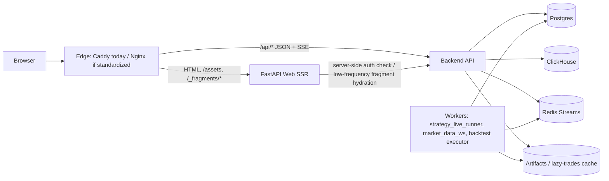
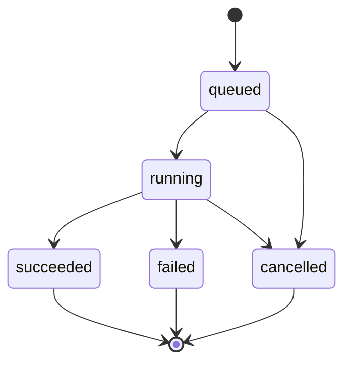

# Roehub UI-first implementation brief

Ключевые пути и артефакты, которые были проанализированы:

- `apps/web/main/app.py` — текущий FastAPI SSR web, protected pages, встроенный `/api/*` proxy для local/dev, `/_partial/user_badge` и `StaticFiles("/assets")`. fileciteturn85file0L1-L1
- `apps/web/main/api_client.py`, `security.py`, `settings.py`, `main.py` — server-side login gate через `/api/auth/current-user`, `next` sanitization, runtime env и запуск uvicorn. fileciteturn46file0L1-L1 fileciteturn47file0L1-L1 fileciteturn45file0L1-L1 fileciteturn68file0L1-L1
- `apps/web/templates/base.html`, `landing.html`, `login.html`, `logout.html`, `strategies_list.html`, `strategy_builder.html`, `strategy_details.html`, `backtests.html`, `partials/user_badge.html` — текущий SSR shell и существующие страницы. fileciteturn36file0L1-L1 fileciteturn37file0L1-L1 fileciteturn38file0L1-L1 fileciteturn39file0L1-L1 fileciteturn40file0L1-L1 fileciteturn41file0L1-L1 fileciteturn42file0L1-L1 fileciteturn43file0L1-L1 fileciteturn44file0L1-L1
- `apps/web/dist/site.css`, `strategy_ui.js`, `backtest_ui.js` — текущий CSS и page-level JS, включая client-side fetch, polling, canvas overlay и локальные state machines. fileciteturn33file0L1-L1 fileciteturn34file0L1-L1 fileciteturn35file0L1-L1
- `apps/api/main/app.py` — composition root backend API. fileciteturn22file0L1-L1
- `apps/api/routes/strategies.py`, `backtests.py`, `market_data_reference.py`, `indicators.py`, `identity.py` — текущий public API surface для auth, strategies, backtests, markets/instruments, indicators, exchange keys. fileciteturn98file0L1-L1 fileciteturn24file0L1-L1 fileciteturn55file0L1-L1 fileciteturn57file0L1-L1 fileciteturn25file0L1-L1
- `apps/api/dto/backtests.py`, `market_data_reference.py` — текущие response shapes и read-model API contracts. fileciteturn53file0L1-L1 fileciteturn76file0L1-L1
- `apps/api/wiring/modules/backtest.py`, `src/trading/contexts/backtest/application/use_cases/backtest_jobs.py`, `src/trading/contexts/backtest/domain/entities/backtest_job.py` — текущая job-модель, inline execution wiring, lazy trades cache. fileciteturn92file0L1-L1 fileciteturn84file0L1-L1 fileciteturn60file0L1-L1
- `src/trading/contexts/strategy/.../redis_streams_realtime_output_publisher.py`, `apps/worker/strategy_live_runner/...`, `docs/architecture/strategy/strategy-realtime-output-redis-streams-v1.md` — уже существующий realtime substrate для strategy monitoring через Redis Streams. fileciteturn102file0L1-L1 fileciteturn103file0L1-L1 fileciteturn73file0L1-L1
- `.github/workflows/deploy-web.yml`, `infra/docker/docker-compose.web.prod.yml`, `infra/caddy/Caddyfile.vps`, `docs/runbooks/web-ui-gateway-same-origin.md`, `docs/architecture/apps/gateway/nginx-gateway-same-origin-ui-api-v1.md` — текущая production topology и факт, что архивный Nginx path больше не активен, а production edge сейчас делает Caddy. fileciteturn64file0L1-L1 fileciteturn65file0L1-L1 fileciteturn66file0L1-L1 fileciteturn49file0L1-L1 fileciteturn86file0L1-L1
- `docs/architecture/apps/web/web-ui-skeleton-ssr-htmx-auth-v1.md`, `web-strategy-ui-crud-builder-delete-v1.md`, `backtest-service-artifact-runtime-v1.ru.md`, `identity-exchange-keys-storage-2fa-gate-policy-v2.md` — repo-level архитектурные намерения для web/auth, strategies, backtests и exchange secrets. fileciteturn48file0L1-L1 fileciteturn50file0L1-L1 fileciteturn51file0L1-L1 fileciteturn88file0L1-L1

## Executive summary

Решение: **оставить Roehub в модели “SSR Jinja2 + HTMX для low-frequency HTML fragments + JS islands для charts/live forms + backend-owned JSON/SSE”, но в production не прогонять `/api/*` через web-сервис — current repo уже выбрал более лёгкую схему, где edge отдаёт HTML/`/assets` через web, а `/api/*` проксирует прямо в backend; главные риски сейчас — монолитные page JS, несоответствие текущего light-theme CSS новым dark-terminal прототипам, отсутствие monitoring/settings/results страниц и тот факт, что current backtest execution в коде wired как `sync_inline` внутри API процесса, а не как отдельный background worker contract.** fileciteturn66file0L1-L1 fileciteturn85file0L1-L1 fileciteturn33file0L1-L1 fileciteturn84file0L1-L1 fileciteturn92file0L1-L1

## Что реально есть в репозитории и что это значит для UI-first

В репозитории уже есть рабочая база для тонкого web UI: `apps/web` рендерит SSR страницы, монтирует `/assets`, делает server-side auth check через `/api/auth/current-user`, а browser-facing `/api/*` proxy встроен в web только как FastAPI route. Одновременно production deploy и runbook показывают, что на VPS сейчас используется **Caddy edge**, который проксирует `/api/*` напрямую на backend host, а web-контейнер на `127.0.0.1:8010` обслуживает HTML и статические assets. Это важное отклонение от исходной гипотезы “browser -> web -> /api proxy -> backend”: в production уже реализована более дешёвая топология, и её стоит сохранить. fileciteturn85file0L1-L1 fileciteturn64file0L1-L1 fileciteturn65file0L1-L1 fileciteturn66file0L1-L1 fileciteturn49file0L1-L1

Current web UI покрывает только public landing, login/logout, стратегии и одну комбинированную backtests page. HTMX подключён глобально через CDN, но практически не используется; сложные экраны реализованы монолитными ES modules: `strategy_ui.js` управляет list/details/builder, а `backtest_ui.js` — form, jobs, polling, selected job, top variants и trades overlay. Это хороший старт для прототипа, но плохая точка роста для UI-first, потому что shared `api client`, `polling manager`, `SSE bridge`, `notifications` и reusable components пока не выделены. Дополнительно current `site.css` — светлая B2B-сетка, визуально сильно расходящаяся с приложенными dark-terminal mockups. fileciteturn36file0L1-L1 fileciteturn33file0L1-L1 fileciteturn34file0L1-L1 fileciteturn35file0L1-L1

Backend surface уже неплох для стратегии и backtests. Найдены owner-scoped strategy CRUD endpoints плюс `run/stop`, market-data reference endpoints, indicators registry, auth/current-user, exchange keys и полноценный public backtest jobs API с `runtime-defaults`, `preflight`, `jobs`, `top`, `variant`, `lazy trades`, `cancel`. Но для новых экранов **не найдены** SSR templates или API read-models для settings/dashboard/monitoring/results/dashboard-like overview; они должны быть добавлены. Для monitoring это не значит старт “с нуля”: в repo уже есть `strategy_live_runner` worker и publisher realtime output в per-user Redis Streams, просто у UI пока нет API/SSE bridge к этим данным. fileciteturn98file0L1-L1 fileciteturn55file0L1-L1 fileciteturn57file0L1-L1 fileciteturn25file0L1-L1 fileciteturn24file0L1-L1 fileciteturn73file0L1-L1 fileciteturn102file0L1-L1 fileciteturn103file0L1-L1

Отдельный архитектурный риск — backtests. Domain/use-case и docs уже ориентированы на persisted jobs, keyset/cursor history и lazy detail, но актуальная wiring-конфигурация `apps/api/wiring/modules/backtest.py` сейчас поднимает `BacktestRuntimeJobOrchestrationService` прямо в API процессе, а `BacktestJobsUseCase.create()` при наличии executor исполняет job через `sync_inline`. Для UI-first это нужно считать переходной реализацией: browser contract должен оставаться job-based, но фактическое выполнение надо переводить в отдельный background path до того, как configurator/results станут публичной частью сайта. fileciteturn51file0L1-L1 fileciteturn92file0L1-L1 fileciteturn84file0L1-L1 fileciteturn60file0L1-L1

По mockups сейчас есть пять уникальных экранов: landing, settings/account, monitoring/overview, backtest configurator и backtest results/statistics; screenshot `personal_dashboard.png` дублирует `strategy_monitoring.png`. Поэтому **Dashboard/Overview** и **Backtests list** ниже описаны как необходимые product screens, но частично **выведены** из текущего combined monitoring layout и из текущей combined `/backtests` page, а не из отдельного готового макета.

## Общая концепция UI-first и целевая архитектура

Главное правило для команды: **web = HTML facade и low-frequency fragment renderer; backend API = source of truth для JSON/SSE; heavy compute/live data = workers/Redis/DB; edge keeps same-origin**. Для current deployment это означает: не ломать production split `edge -> web for HTML`, `edge -> backend for /api/*`, а использовать built-in web `/api/*` proxy только для local/dev parity. Это и проще, и дешевле на VPS 1 vCPU / 2 GB, потому что убирает лишний hop и не заставляет web процесс проксировать long-running API/SSE трафик. fileciteturn66file0L1-L1 fileciteturn49file0L1-L1 fileciteturn85file0L1-L1



### Архитектурные правила

- **Jinja2 SSR**: layout, nav, page shell, first paint, SEO/public pages, empty/error/skeleton states, simple forms, tables first page.
- **HTMX**: только low-frequency HTML updates — settings fragments, filters, tabs, modal bodies, table refreshes, save/delete flows. Не использовать HTMX как transport для monitoring или backtest live progress.
- **JS islands**: charts, canvas/SVG, SSE/polling manager, complex forms, instrument typeahead, AI assistant, local validation, client-side state coordination.
- **Backend API**: all JSON DTOs, pagination, chart data, job APIs, SSE endpoints, auth, audit, secrets policy.
- **Workers/queues/jobs**: live strategy runtime, backtest execution, lazy trades recompute, AI orchestration if появится.
- **Web UI stateless**: no local secret storage, no backtest computation, no heavy joins/aggregations, no long-running CPU tasks, no persistent large cache.

### Почему не React / Next / full SPA сейчас

| Вариант | Решение |
|---|---|
| SSR Jinja2 + HTMX + JS islands | **Да**. Совпадает с текущим repo, не требует Node runtime на VPS, хорошо ложится на marketing + dashboards, позволяет держать frontend logic локально по страницам. |
| React SPA | **Нет сейчас**. Добавит build/toolchain, client routing, global state pressure и риск выноса серверной бизнес-логики в browser. Не нужен, пока большая часть сложности — в data contracts, jobs, charts и auth. |
| Next.js | **Нет сейчас**. Для текущего deployment это лишний server/runtime слой, плюс потребуется отдельная JS infrastructure и SSR/BFF duplication поверх уже существующего FastAPI SSR. |
| Tailwind / Bootstrap migration | **Нет сейчас**. Репозиторий уже живёт на custom CSS; проблемы не в utility framework, а в отсутствии design tokens, component split и terminal-theme system. |
| TypeScript/Vite | **Не сейчас на VPS; допустимо позже в CI-only**. Пока оптимально — ES modules + JSDoc + `// @ts-check`. Если JS модулей станет заметно больше, можно перейти на TS build в CI и выкладывать готовый `dist`, не поднимая Node server. |

Repo не содержит фронтенд toolchain или Node-based delivery path в анализированных путях; assets лежат прямо в `apps/web/dist`, страницы подключают их напрямую через `/assets/...`, а deploy-web workflow разворачивает только Python web container и edge config. Это ещё один аргумент не ломать стек преждевременно. fileciteturn61file0L1-L1 fileciteturn36file0L1-L1 fileciteturn40file0L1-L1 fileciteturn43file0L1-L1 fileciteturn64file0L1-L1

## Страницы и их контракт

Ниже — рекомендуемое разделение по технологиям. Для простоты `/backtests` нужно разделить на **list/history**, **configurator** и **results**, потому что текущая combined page не соответствует новым mockups и станет слишком тяжёлой. Current repository already exposes only one combined `/backtests` template, so это осознанный refactor, а не cosmetic tweak. fileciteturn43file0L1-L1

| Страница | Jinja2 | HTMX | JS islands | Live transport | Статус |
|---|---|---|---|---|---|
| Landing | 95% | нет | минимум | нет | есть mockup |
| Auth/Login | 100% | нет | минимум | нет | current + refine |
| Dashboard/Overview | shell + first snapshot | filters/tabs | sparklines/cards | polling 10–15s, SSE alerts optional | inferred |
| Личный кабинет / Settings | shell + fragments | **основной инструмент** | минимум | polling 15–30s | mockup |
| Strategy Monitoring | shell + first snapshot | action buttons, list filters | **основной инструмент** | **SSE + polling fallback** | mockup |
| Backtests list/history | SSR table | filters/pagination/cancel | минимально | polling 10s active rows | inferred/refactor |
| Backtest Configurator | shell | presets/modals | **основной инструмент** | job submit + progress redirect | mockup |
| Backtest Results / Statistics | shell + first summary | tabs/sort/pagination | **основной инструмент** | SSE until terminal, then on-demand JSON | mockup |

### Landing

**Цель.** Public marketing/SEO page с hero, product map, feature grid, CTA, pricing/docs links.

**Компоненты.** `Panel`, hero-callout, feature cards, capability badges, CTA buttons, footer status bar. Визуально — тёмный terminal/CLI style.

**Технологии.**
- Jinja2: вся страница.
- HTMX: не нужен.
- JS: только лёгкие non-blocking эффекты; не нужен для первого релиза.

**API.**
- Обязательных API нет.
- Допустим SSR user badge через current auth context, если пользователь уже залогинен.

**Acceptance.**
- Страница открывается анонимно без API зависимости.
- HTML usable без JS.
- No chart libs.
- Critical path: один CSS bundle + один optional small JS file.
- Тесты: anonymous open, logged-in header state, mobile layout, CTA routing.

### Auth/Login

**Цель.** Безопасно перевести пользователя в Keycloak flow и назад.

**Найдено.** Сейчас `/login` и `/logout` — SSR pages с inline scripts; `next` path sanitization уже есть; protected pages редиректят на `/login?next=...`. Это правильно по flow, но inline script и CDN htmx усложняют CSP. fileciteturn38file0L1-L1 fileciteturn39file0L1-L1 fileciteturn47file0L1-L1 fileciteturn85file0L1-L1

**Рекомендация.**
- Оставить page SSR-only.
- Убрать inline JS: либо server-side `302` на `/api/auth/login?next=...`, либо вынести redirect/logout logic в маленькие external modules.
- Self-host `htmx.min.js` вместо `unpkg`, чтобы можно было ввести strict CSP.

**Ключевые endpoints.**
- `GET /api/auth/login?next=/safe/path` — current.
- `GET /api/auth/callback` — current.
- `POST /api/auth/logout` — current.
- `GET /api/auth/current-user` — current.

**Acceptance.**
- `next=https://evil.example` всегда обрезается до safe local path.
- 401 на protected page всегда уводит на login.
- После logout cookie очищен, protected route даёт redirect.
- Stateful browser actions не ломают CSP.

### Dashboard / Overview

**Цель.** Верхнеуровневый summary: active strategies, backtest jobs, recent alerts, PnL cards, system status.

**Важно.** Отдельный dashboard template/API в repo не найден; экран нужно строить как новый потребитель уже существующих strategies/backtests surfaces и новых UI DTOs.

**Технологии.**
- Jinja2: shell, KPI grid, first-page placeholders.
- HTMX: period filter, account switch, collapsible panels.
- JS: sparklines, incremental refresh, client-side state for selected widgets.

**Минимальные endpoints.**
- `GET /api/ui/dashboard/summary` — **proposed**; один snapshot endpoint, чтобы не делать 5–7 browser calls через VPS/edge.
- `GET /api/ui/dashboard/alerts?cursor=` — **proposed**.
- `GET /api/ui/dashboard/recent-jobs?limit=10` — **proposed**; можно собрать поверх current backtest jobs API.
- `GET /api/ui/dashboard/strategy-health?limit=10` — **proposed**.
- `GET /api/ui/dashboard/system-status` — **proposed**.

**Perf и live.**
- Polling 10–15s.
- Alerts можно через SSE, если будет уже готов общий event stream.
- Верхний snapshot payload держать < 50 KB compressed.

**Acceptance / tests.**
- Один snapshot request строит весь экран.
- Карточки не блокируют страницу при падении одной панели.
- Hidden tab pausing работает.
- Последние 10 alerts/jobs обновляются без full page reload.

### Личный кабинет / Settings

**Цель.** Профиль, лимиты, exchange keys, integrations, notifications, security summary, recent sessions, audit log.

**Найдено.** Current backend уже умеет `current-user` и `exchange-keys`; secrets policy корректная: encrypted blobs, masked UI, без возврата secret fields. Но endpoints для profile/preferences/integrations/sessions/audit не найдены и должны быть добавлены. fileciteturn25file0L1-L1 fileciteturn88file0L1-L1

**Технологии.**
- Jinja2: page shell и all fragments.
- HTMX: основной механизм для forms, toggles, table refresh, confirm modal bodies.
- JS: confirm modal, copy-to-clipboard, local field validation, toast/errors.

**Минимальный API набор.**
- `GET /api/auth/current-user` — current.
- `GET /api/exchange-keys` / `POST /api/exchange-keys` / `DELETE /api/exchange-keys/{key_id}` — current.
- `GET /api/ui/account/profile` / `PUT /api/ui/account/profile` — **proposed**.
- `GET /api/ui/account/limits` — **proposed**.
- `GET /api/ui/account/integrations` / `PUT /api/ui/account/integrations` — **proposed**.
- `GET /api/ui/account/notifications` / `PUT /api/ui/account/notifications` — **proposed**.
- `GET /api/ui/account/sessions?cursor=` — **proposed**.
- `GET /api/ui/account/audit-events?cursor=` — **proposed**.

**Validation.**
- Exchange key: exchange enum required; `api_key`/`api_secret` non-empty; duplicate active key -> deterministic 409; passphrase only for exchanges that require it.
- Notifications/integrations: whitelist only; no arbitrary webhook host without validation.
- Sessions/audit: cursor pagination only, no “load everything”.

**Acceptance / tests.**
- Add exchange key, duplicate key, delete key, auth expiry, 403 чужого ресурса.
- Toggle notifications and integrate Telegram/Discord/Slack without full page reload.
- Secrets never appear in DOM, logs or JSON responses.
- Every destructive action leaves audit event.

### Strategy Monitoring

**Цель.** Two-column active strategies page как в mockup: справа — strategy list; слева — selected strategy live state, PnL/equity, positions, fills, alerts, risk.

**Найдено.** Current strategy API already supports `POST /strategies/{id}/run` and `POST /strategies/{id}/stop`, а worker already publishes realtime records to Redis Streams; но monitoring read endpoints и browser-facing SSE bridge не найдены. Значит правильный путь — **не переписывать live runtime**, а добавить thin API bridge/read models. fileciteturn98file0L1-L1 fileciteturn73file0L1-L1 fileciteturn102file0L1-L1 fileciteturn103file0L1-L1

**Технологии.**
- Jinja2: shell, initial selected strategy block, empty/error states.
- HTMX: start/stop/restart buttons, filters, sidebar reload, settings modal.
- JS: charts, SSE manager, positions/fills incremental update, tab selection.

**Минимальный API набор.**
- `GET /api/strategies` — current, base list.
- `POST /api/strategies/{id}/run` / `POST /api/strategies/{id}/stop` — current.
- `GET /api/ui/strategies/monitor?state=active|all&cursor=` — **proposed**, compact list DTO.
- `GET /api/ui/strategies/{id}/snapshot` — **proposed**, one payload for headline KPIs/state.
- `GET /api/ui/strategies/{id}/positions?limit=50` — **proposed**.
- `GET /api/ui/strategies/{id}/fills?cursor=` — **proposed**.
- `GET /api/ui/strategies/{id}/equity?range=1d&points=600` — **proposed**.
- `GET /api/stream/strategies?strategy_id=&last_event_id=` — **proposed SSE** bridge over Redis Streams.

**Transport.**
- Preferred: SSE for `run_state_changed`, `run_failed`, checkpoint/lag/health events.
- Fallback: polling `/snapshot` every 3–5s, `/positions` and `/fills` every 5–10s.
- Hidden tab: pause all polling; keep at most one idle SSE per page.

**Data limits.**
- Strategy list page-size 20.
- Fills/alerts 50 rows max per page.
- Chart points 600–1200 max, server-downsampled.

**Acceptance / tests.**
- Start/stop works and reflects state within one refresh cycle.
- SSE reconnect after network drop.
- Browser never fires overlapping snapshot requests.
- 401 during live monitoring stops stream and redirects to login.
- Mobile: list/detail collapse into tabs, not duplicated DOM.

### Backtests list / history

**Цель.** Separate history page: recent jobs, filters, status, cancel, quick open result.

**Найдено.** Current `/backtests` templatе mixes form + jobs + selected job + trades; current API already gives `GET /backtests/jobs` with cursor-ish history semantics. UI-first should split this page instead of growing the monolith. fileciteturn43file0L1-L1 fileciteturn24file0L1-L1 fileciteturn84file0L1-L1

**Технологии.**
- Jinja2: page shell and first table render.
- HTMX: filters, pagination, cancel button refresh.
- JS: optional row auto-refresh for active jobs.

**API.**
- `GET /api/backtests/jobs?state=&risk_mode=&limit=&cursor=` — current.
- `POST /api/backtests/jobs/{job_id}/cancel` — current.
- `GET /api/ui/backtests/counters` — **optional proposed**, only if needed for toolbar badges.

**Acceptance / tests.**
- Active rows refresh without reloading the whole page.
- Job list remains responsive with 1000+ historical rows because the page reads only one cursor page at a time.
- Clicking a terminal row opens results page.
- Cancel is idempotent.

### Backtest Configurator

**Цель.** Собрать валидный backtest request, прогнать preflight, запустить job, optionally involve AI assistant — но никогда не вычислять ничего тяжёлого в browser.

**Найдено.** Current page already consumes `runtime-defaults`, `preflight`, `jobs`, `market-data` and `indicators`; current JS has client-side validation, sample request, AbortController for some calls and 1.5s polling. Но form state, jobs list и results сейчас слиты в один модуль. fileciteturn43file0L1-L1 fileciteturn35file0L1-L1 fileciteturn69file0L1-L1

**Технологии.**
- Jinja2: shell, preset list region, AI chat container, validation/error blocks.
- HTMX: save/load/delete preset, duplicate last request, small fragments.
- JS: instrument search, indicator matrix, client validation, request serializer, AI chat UI, submit with idempotency key.

**API.**
- `GET /api/backtests/runtime-defaults` — current.
- `POST /api/backtests/preflight` — current.
- `POST /api/backtests/jobs` — current; UI should start sending `Idempotency-Key` even though current JS does not. fileciteturn84file0L1-L1 fileciteturn69file0L1-L1
- `GET /api/market-data/markets` / `GET /api/market-data/instruments` — current.
- `GET /api/indicators` — current.
- `GET/POST/DELETE /api/ui/backtest-presets` — **proposed**.
- `POST /api/ai/backtest-config/chat` + `GET /api/ai/backtest-config/stream/{session_id}` — **proposed**.
- `POST /api/ai/backtest-config/validate` — **proposed**.

**Validation.**
- Start `<` end, timeframe supported, symbol required, indicator rows 1..N, `window.start <= window.stop`, `step > 0`, `top_n` within guardrails, `risk.mode` explicit.
- Client validation helps UX; authoritative validation stays in `preflight` and `POST /jobs`.
- AI can only produce draft config; it cannot call `/jobs` directly.

**Acceptance / tests.**
- Invalid request never launches job.
- Duplicate submit returns same job when idempotency key matches.
- Network timeout and 422 show deterministic inline errors.
- Page stays usable without loading jobs list/result charts.

### Backtest Results / Strategy Statistics

**Цель.** Dedicated results page with summary metrics, top variants, equity/drawdown charts, monthly stats, symbol stats, trades and CSV export.

**Найдено.** Backend already has job read, top variants, single variant details and lazy trades detail. But current lazy trades route returns full trade list plus overlay, and current JS paginates client-side with `TRADES_PAGE_SIZE = 25` after full fetch. Это нормальный prototyping move и плохой public-site contract: нужен server-side pagination и downsampled series. fileciteturn53file0L1-L1 fileciteturn35file0L1-L1 fileciteturn69file0L1-L1

**Технологии.**
- Jinja2: summary shell, first selected variant, placeholders.
- HTMX: tabs, metric sort, pagination controls, variant switch.
- JS: charts, range selection, CSV export initiation, lazy loading.

**API.**
- `GET /api/backtests/jobs/{job_id}` — current.
- `GET /api/backtests/jobs/{job_id}/top` — current.
- `GET /api/backtests/jobs/{job_id}/variants/{variant_key}` — current.
- `POST /api/backtests/jobs/{job_id}/variants/{variant_key}/trades` — current lazy materialization path.
- **Add** `GET /api/backtests/jobs/{job_id}/summary` — proposed compact UI DTO.
- **Add** `GET /api/backtests/jobs/{job_id}/variants/{variant_key}/equity?points=1200` — proposed.
- **Add** `GET /api/backtests/jobs/{job_id}/variants/{variant_key}/drawdown?points=1200` — proposed.
- **Add** `GET /api/backtests/jobs/{job_id}/variants/{variant_key}/monthly-stats` — proposed.
- **Add** `GET /api/backtests/jobs/{job_id}/variants/{variant_key}/symbol-stats` — proposed.
- **Add** `GET /api/backtests/jobs/{job_id}/variants/{variant_key}/trades?page=1&page_size=50` — proposed stable pagination surface.
- **Add** `GET /api/backtests/jobs/{job_id}/variants/{variant_key}/trades.csv` — proposed export.

**Data limits.**
- Initial result page JSON < 150 KB compressed.
- Any chart endpoint returns max 600–1500 points, never raw full equity arrays.
- Trades: 50/page default, 100 max; export is separate file route.

**Acceptance / tests.**
- Results page opens from history link and from job completion redirect.
- Loading one variant does not fetch all trades.
- Charts remain performant with multi-year series.
- Direct open of unknown `variant_key` returns 404, not blank page.

## API, jobs and realtime contracts

Current public API surface already covers auth, strategies, exchange keys, indicators, markets/instruments and backtest jobs; new UI-first work should add **read-model DTOs and SSE bridges**, not duplicate domain logic in web. Given production routing, JSON DTOs belong in backend API under `/api/ui/*`; web may additionally expose HTML fragments under non-API paths like `/_fragments/*`. This split preserves the existing edge topology and keeps the VPS light. fileciteturn66file0L1-L1 fileciteturn98file0L1-L1 fileciteturn24file0L1-L1

### Existing vs proposed endpoint families

| Family | Current | Proposed additions |
|---|---|---|
| Auth | `/api/auth/login`, `/callback`, `/logout`, `/current-user` | `/api/auth/csrf` if CSRF token chosen |
| Identity/account | `/api/exchange-keys*` | `/api/ui/account/profile`, `limits`, `integrations`, `notifications`, `sessions`, `audit-events` |
| Strategies | `/api/strategies`, `/clone`, `/{id}`, `/{id}/run`, `/{id}/stop`, delete | `/api/ui/strategies/monitor`, `/{id}/snapshot`, `/{id}/positions`, `/{id}/fills`, `/{id}/equity`; `/api/stream/strategies` |
| Market data | `/api/market-data/markets`, `/instruments` | no change initially |
| Indicators | `/api/indicators`, `/estimate`, `/compute` | no change for UI-first |
| Backtests jobs | `/api/backtests/runtime-defaults`, `/preflight`, `/jobs`, `/jobs/{id}`, `/top`, `/variant`, `/trades`, `/cancel` | `/api/ui/backtest-presets*`, `/api/backtests/jobs/{id}/summary`, chart/stats endpoints, paginated trades, `/api/backtests/jobs/{id}/events` |
| Dashboard | none found | `/api/ui/dashboard/*` |
| AI | none found | `/api/ai/backtest-config/chat`, `/stream/{session_id}`, `/validate` |

### Job lifecycle

Current domain state machine for persisted backtest jobs is `queued -> running -> succeeded|failed|cancelled`; there is no persisted `created` state, and `completed` is better kept as a UI label mapped from `succeeded`, чтобы не ломать already implemented domain/storage/API contracts. fileciteturn60file0L1-L1 fileciteturn84file0L1-L1



**Contract for UI/agent:**
- `POST /api/backtests/jobs` creates a persisted job and returns `201` or idempotent replay `200`.
- UI must treat every create as async, even if current backend sometimes finishes inline.
- `cancel` is idempotent.
- `lazy trades` is a secondary detail flow, not part of initial result page.
- `result storage`: persist only summary/top-N; big details are on-demand and cached.

### Примеры ключевых JSON контрактов

```json
{
  "coordinates": {"exchange": "binance", "market_type": "spot", "symbol": "BTCUSDT"},
  "timeframe": "15m",
  "time_range": {"start": "2020-01-11T20:08:00Z", "end": "2026-04-11T20:08:00Z"},
  "indicators": [
    {"indicator_id": "ma.dema", "sources": ["close"], "window": {"start": 5, "stop": 100, "step": 1}}
  ],
  "risk": {"mode": "none"},
  "execution": {
    "direction_mode": "long_short_reversal",
    "fee_rate": 0.00075,
    "slippage_rate": 0.0001,
    "initial_cash_quote": 10000,
    "sizing": {"mode": "fixed_equity_pct", "equity_pct": 10},
    "profit_lock": {"enabled": false},
    "close_on_end": true
  },
  "ranking": {"primary_metric": "total_return_pct", "direction": "desc"},
  "top_n": 100
}
```

```json
{
  "job_id": "uuid",
  "state": "running",
  "request_hash": "sha256",
  "result_config_hash": "sha256",
  "artifact_metadata": {"artifact_slot": "slot_a", "artifact_manifest_hash": "sha256"},
  "progress": {
    "pipeline_stage": "stage_b",
    "percent": 62,
    "processed_units": 1240,
    "total_units": 2000,
    "updated_at": "2026-05-02T10:15:00Z"
  },
  "requested_top_n": 100,
  "created_at": "2026-05-02T10:10:00Z",
  "started_at": "2026-05-02T10:10:03Z",
  "finished_at": null,
  "terminal_summary": {},
  "links": {"self": "/api/backtests/jobs/uuid", "top": "/api/backtests/jobs/uuid/top"}
}
```

```json
{
  "job_id": "uuid",
  "variant_key": "job_abcd__dema_close_w20__vh_deadbeef",
  "summary": {
    "total_return_pct": 48.2,
    "max_drawdown_pct": -12.3,
    "profit_factor": 1.45,
    "win_rate_pct": 56.8,
    "trades": 1942
  },
  "series": {
    "equity_points": 1200,
    "drawdown_points": 1200
  },
  "links": {
    "equity": "/api/backtests/jobs/uuid/variants/.../equity?points=1200",
    "trades": "/api/backtests/jobs/uuid/variants/.../trades?page=1&page_size=50"
  }
}
```

```json
{
  "items": [
    {
      "trade_id": "t_001",
      "entry_time": "2024-01-01T00:15:00Z",
      "exit_time": "2024-01-01T04:45:00Z",
      "side": "long",
      "entry_price": 42347.19,
      "exit_price": 42887.65,
      "pnl_pct": 1.51,
      "reason": "tp"
    }
  ],
  "page": 1,
  "page_size": 50,
  "total": 1942,
  "has_next": true
}
```

### SSE vs polling

| Use case | Preferred | Fallback | Интервал / retry |
|---|---|---|---|
| Strategy monitoring live state | SSE | snapshot polling | reconnect 2s/5s/15s; polling 3–5s |
| Backtest job progress | SSE | job polling | reconnect 2s/5s/15s; polling 2.5–4s |
| AI assistant token stream | SSE | none | reconnect only by explicit user action |
| Dashboard summary cards | polling | n/a | 10–15s |
| Settings audit/sessions | polling | n/a | 15–30s |
| Instrument search | debounced fetch | n/a | 250 ms debounce |

**Implementation rules.**
- One poller registry per page.
- No overlapping requests; every repeated task uses `AbortController`.
- Hidden tab pauses polling within 5s.
- SSE failure automatically downgrades to polling after N retries.
- All modifying actions remain plain POST/PUT/DELETE; SSE is read-only.

## Frontend, Jinja, CSS и data-loading skeleton

Current repo already proves that Roehub can stay build-light: page templates connect `type="module"` JS directly, and `site.css` is served from `/assets`. Поэтому рекомендую не добавлять runtime Node layer; instead, reorganize public assets into a sane tree under the existing mounted asset root. fileciteturn33file0L1-L1 fileciteturn40file0L1-L1 fileciteturn43file0L1-L1

### Предлагаемая структура

```text
apps/web/templates/
  base.html
  pages/
    landing.html
    login.html
    dashboard.html
    settings.html
    monitoring.html
    backtests_list.html
    backtests_run.html
    backtests_result.html
  fragments/
    account/
    dashboard/
    monitoring/
    backtests/
  components/
    panel.html
    metric_card.html
    data_table.html
    empty_state.html
    error_state.html
  macros/
    ui.html
```

```text
apps/web/dist/
  css/
    tokens.css
    layout.css
    components.css
    pages/
      landing.css
      settings.css
      monitoring.css
      backtests.css
  js/
    core/
      api.js
      poller.js
      sse.js
      dom.js
      formatters.js
      notifications.js
      validators.js
    components/
      modal.js
      tabs.js
      table.js
      badges.js
      progress.js
    charts/
      sparkline.js
      equity_chart.js
      drawdown_chart.js
      candle_trades_chart.js
    pages/
      dashboard.js
      settings.js
      monitoring.js
      backtests_list.js
      backtests_run.js
      backtests_result.js
      auth.js
  vendor/
    htmx.min.js
    uplot.min.js
    lightweight-charts.min.js
```

### Правила JS

- `api.js`: `fetch` wrapper with `credentials: "include"`, default timeout, JSON/text parsing, 401 redirect, 403 banner, 409/422 mapping, CSRF header injection, `AbortController`.
- `poller.js`: no overlap, pause/resume, backoff, hidden-tab handling.
- `sse.js`: EventSource wrapper, auto-reconnect, last-event-id, downgrade callback.
- Page modules know only their DOM and endpoint map; they do not implement generic network/error logic.

### Jinja/UI-kit

- Macros: `panel()`, `metric_card()`, `status_badge()`, `risk_badge()`, `action_button()`, `data_table()`, `inline_progress()`, `empty_state()`, `error_state()`.
- Naming: prefix `rh-`, state classes `is-*`, data hooks `data-role`, `data-endpoint`.
- HTMX fragments return only the minimal HTML subtree: table body, card body, modal body.

### CSS strategy

Current `site.css` is a single monolith and uses light palette tokens; this should be replaced by tokenized dark-terminal theme, but **custom CSS must remain**. Tailwind/Bootstrap migration does not solve the actual problems here. fileciteturn33file0L1-L1

**Design tokens baseline:**
- colors: `--bg`, `--surface`, `--surface-2`, `--line`, `--text`, `--muted`, `--accent`, `--success`, `--danger`, `--warning`
- spacing: 4/8/12/16/24/32
- radii: 4/8/12
- typography: mono for labels/numbers, sans for body only if needed
- tables/panels/badges/status bars as first-class tokens

**Important CSP note.** `base.html` currently loads HTMX from CDN, and `login.html`/`logout.html` contain inline scripts. Before tightening CSP, self-host HTMX and remove inline scripts. fileciteturn36file0L1-L1 fileciteturn38file0L1-L1 fileciteturn39file0L1-L1

### Charts and data limits

| Need | Recommendation |
|---|---|
| Sparkline / mini status charts | custom canvas/SVG |
| Equity / drawdown line charts | `uPlot` or lightweight custom canvas |
| Candlestick + trades overlay | `lightweight-charts`, lazy-loaded only on result pages |
| Chart.js | no |
| D3 for all charts | no |

**Threshold rules.**
- Client-side tables: okay up to ~200 rows or ~100 KB compressed payload.
- Server-side pagination: mandatory for trades, logs, audit events, fills, sessions, history lists over that threshold.
- Charts: server returns pre-downsampled points, target 600–1500 points per series.
- Initial page load: never transfer full trades arrays or raw multi-year point series.

## Security, deployment и performance under 1 vCPU / 2 GB

Security posture already has two strong building blocks: same-origin auth flow with server-side current-user gate and a safe exchange-key storage policy where secrets are encrypted at rest and not returned via API. Build on that, do not bypass it from browser code. fileciteturn48file0L1-L1 fileciteturn46file0L1-L1 fileciteturn88file0L1-L1

### Security rules

- Keep **same-origin browser contract**.
- Cookies: `HttpOnly`, `Secure`, `SameSite=Lax`; exact current flags were not fully verified in the analyzed snippets, so treat this as an implementation checkpoint.
- Add CSRF protection for all state-changing endpoints before public settings/monitoring rollout; simplest acceptable option: server-side Origin/Referer validation + double-submit token.
- Every destructive action gets confirm modal; live-trade actions may require second confirmation text.
- Exchange secrets never enter HTML, JS state or API responses.
- Add audit events for profile/integration/exchange/live-control mutations.
- CSP target after cleanup: `default-src 'self'; script-src 'self'; style-src 'self'; img-src 'self' data:; connect-src 'self'; object-src 'none'; frame-ancestors 'none'; base-uri 'self'; form-action 'self'`.

### VPS / edge deployment

Repo today runs one web container on port `8010`, fronted by Caddy with `zstd gzip`; archival Nginx doc explicitly says Nginx path is obsolete. Поэтому рекомендация такая: если infra standard требует Nginx, **копируйте текущую Caddy semantics**, а не перестраивайте архитектуру. `/api/*` должно идти прямо в backend, остальное — в web container; для SSE через Nginx обязательно `proxy_buffering off`. fileciteturn65file0L1-L1 fileciteturn66file0L1-L1 fileciteturn86file0L1-L1

**Runtime recommendations for current VPS**
- Web process: **1 uvicorn worker**.
- Не добавлять Gunicorn multi-worker на 1 vCPU.
- Edge compression: gzip/brotli или `zstd gzip`.
- Static versioning: `?v=<git_sha>` или asset manifest.
- Cache headers:
  - protected HTML: `Cache-Control: no-store`
  - versioned assets: `Cache-Control: public, max-age=31536000, immutable`
- Monitoring: healthcheck on web `/`, backend `/health`, memory/RSS and 95p latency alerts.
- Swap: acceptable as safety net, not as scale strategy.

### Основные perf risks и mitigations

- **Risk:** routing `/api/*` through web in prod.  
  **Mitigation:** do not do that; keep edge direct-to-backend.
- **Risk:** monolithic JS and page-local network logic.  
  **Mitigation:** extract shared core modules before adding new screens.
- **Risk:** full-trades payload + client-side pagination.  
  **Mitigation:** paginated trades endpoints and downsampled chart data.
- **Risk:** too many browser round-trips across VPS → backend host.  
  **Mitigation:** snapshot DTOs for dashboard/monitoring/settings.
- **Risk:** strict CSP blocked by CDN/inline JS.  
  **Mitigation:** self-host vendor libs, remove inline scripts.
- **Risk:** live dashboards over HTMX fragments.  
  **Mitigation:** use backend JSON/SSE + JS islands instead.

## Roadmap для агента и финальный checklist

### Пошаговый UI-first roadmap

| Шаг | Что делаем | Ключевые файлы/модули | Тесты / критерии | Что не делать |
|---|---|---|---|---|
| Audit & contract freeze | зафиксировать page map, endpoint map, naming, dark theme tokens, prod route split | `apps/web/main/app.py`, edge config, page routes | approved ADR / spec | не писать новые страницы сразу |
| Web foundation | разнести templates/pages/fragments/macros; self-host htmx; убрать inline login/logout scripts | `base.html`, `login.html`, `logout.html`, new macros | login/logout/auth smoke | не менять auth flow semantics |
| JS core extraction | выделить `api.js`, `poller.js`, `sse.js`, `notifications.js`, `validators.js` | `apps/web/dist/js/core/**` | unit smoke for 401/422/abort/backoff | не тащить framework |
| Theme & UI-kit | custom CSS tokens/components/pages, terminal style, responsive rules | `dist/css/**`, Jinja macros | visual regression vs mockups | не мигрировать в Tailwind/Bootstrap |
| Settings page | profile, exchange keys, integrations, notifications, sessions, audit | new `settings.html`, fragments, `api/ui/account/*` | add/delete key, duplicate 409, audit rows | не возвращать secrets |
| Monitoring page | list + selected strategy, SSE bridge, fallback polling, stop/run controls | new monitoring template, `/api/ui/strategies/*`, `/api/stream/strategies` | run/stop + live update + reconnect | не строить monitoring на HTMX polling fragments |
| Backtests split | `/backtests` history, `/backtests/new`, `/backtests/{job_id}` results | split current page/module, new routes/templates | history page stable, configurator isolated | не оставлять combined monolith |
| Backtest runtime hardening | move create semantics toward queued/background worker, add paginated trades/stats/chart endpoints, job events SSE | backtest API/use case/wiring/services | async job flow, cancel, paginated trades | не вычислять backtests в web |
| AI assistant + hardening | AI draft/validate/apply, CSP/CSRF, cache headers, asset versioning, performance smoke | `/api/ai/*`, edge headers, asset version param | security and perf checklist green | не давать AI прямой submit-to-run |

### Обязательные тесты для агента

```bash
uv run ruff check .
uv run pyright
uv run pytest -q
```

Manual/smoke:
- anonymous `/` and `/login`
- protected route redirect to `/login?next=...`
- settings: add/delete exchange key, duplicate key
- monitoring: start/stop strategy, SSE reconnect, polling fallback
- backtests: preflight invalid/valid, create job, cancel job, open results
- results: top variants, paginated trades, chart loading
- logout and re-open protected pages
- CSP/CSRF sanity checks
- web process RSS and latency smoke on VPS

### Финальный checklist перед передачей dev-команде

- [ ] Production route split сохранён: HTML -> web, `/api/*` -> backend.
- [ ] Все новые JSON DTOs находятся в backend API, не в web.
- [ ] В web есть только SSR pages и low-frequency HTML fragments.
- [ ] Jinja macros/UI kit вынесены.
- [ ] `api.js` обрабатывает 401/403/409/422/500, timeout и abort.
- [ ] Polling manager и SSE wrapper не допускают overlaps.
- [ ] Backtest results не грузят все trades сразу.
- [ ] Monitoring использует SSE, а не full-page polling.
- [ ] Exchange secrets masked and never returned.
- [ ] HTMX self-hosted; inline scripts removed; CSP tightened.
- [ ] Assets versioned; protected HTML marked `no-store`.
- [ ] Web container runs with 1 worker and passes smoke under VPS limits.

### Что не делать сейчас

- React / Next.js / full SPA
- frontend monorepo or separate Node.js frontend server
- forcing all live dashboards through HTMX HTML fragments
- Tailwind/Bootstrap migration
- WebSocket for everything
- Chart.js or D3 as default chart stack
- client-side tables on thousands of rows
- full trades JSON on initial result load
- any backtest compute or large aggregation in web UI
- moving `/api/*` production traffic through FastAPI web on the weak VPS

### Финальная рекомендация

**Архитектурная формула Roehub на текущем этапе:**  
**edge-same-origin + FastAPI web for SSR HTML + backend-owned JSON/SSE + HTMX for low-frequency fragments + JS islands for charts/live UX + workers for compute/realtime; production `/api/*` идёт прямо в backend, а web остаётся stateless, cheap и replaceable.**